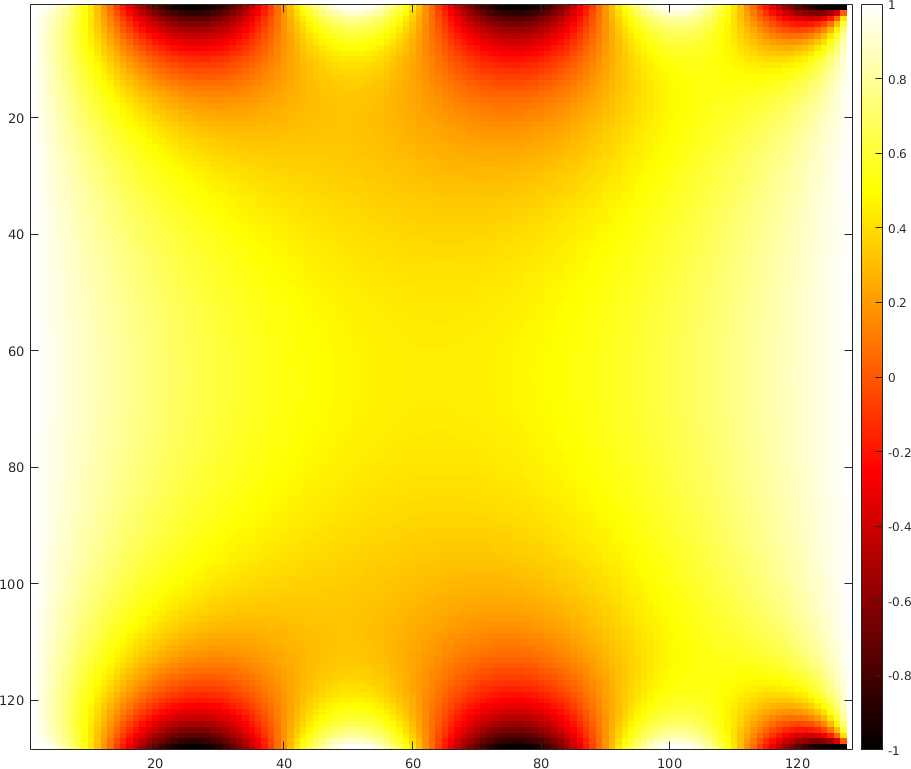
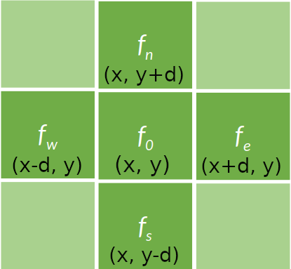

[](https://hpc.uni.lu) [](http://www.gnu.org/licenses/gpl-3.0.html) [](https://github.com/ULHPC/tutorials/issues/) [](https://github.com/ULHPC/tutorials/raw/devel/cuda/exercises/convolution/slides.pdf) [](https://github.com/ULHPC/tutorials/tree/devel/cuda/exercises/convolution/) [](http://ulhpc-tutorials.readthedocs.io/en/latest/cuda/exercises/convolution/) [](https://github.com/ULHPC/tutorials)

# Solving the Laplace Equation on GPU with OpenAcc

     Copyright (c) 2020-2021 L. Koutsantonis, T. Carneiro, UL HPC Team <hpc-team@uni.lu>

[](https://github.com/ULHPC/tutorials/raw/devel/OpenAccExe/slides.pdf)

<br />
<br />
--------------------


## Pre-requisites

Ensure you are able to [connect to the UL HPC cluster](https://hpc.uni.lu/users/docs/access.html).
In particular, recall that the `module` command **is not** available on the access frontends.


Access to ULHPC cluster  (here iris): 

```bash
(laptop)$> ssh iris-cluster
```

/!\ Advanced (but recommended) best-practice:
Always work within an GNU Screen session named with 'screen -S <topic>' (Adapt accordingly)
IF not yet done, copy ULHPC .screenrc in your home:

```bash
(access)$> cp /etc/dotfiles.d/screen/.screenrc ~/
```

Now you'll need to pull the latest changes in your working copy of the [ULHPC/tutorials](https://github.com/ULHPC/tutorials) you should have cloned in `~/git/github.com/ULHPC/tutorials` (see ["preliminaries" tutorial](../../preliminaries/))

``` bash
(access)$> cd ~/git/github.com/ULHPC/tutorials
(access)$> git pull

```
<br />
<br />

## Objectives

The objective of this tutorial is to show how the OpenAcc directives can be used to accelerate a numerical solver commonly used in engineering and scientific applications. After completing the exercise of this tutorial you would be able to: 

* Transfer data from host to  device using the data directives,

* Accelerate a nested loop application with the loop directives, and,

* Use the reduction clause to perform summation on variables or  elements of a vector.

<br />
<br />

## The Laplace Equation

* The Laplace differential equation in 2D is given by:

$$ \nabla^2 F = \frac{d^2F}{dx^2} + \frac{d^2F}{dy^2} = 0 $$

* It models a distribution at steady state or equilibrium in a 2D space (e.g. Temperature Distribution). 

* The Laplace differential equation can be solved using the Jacobi method if the boundary conditions are known (e.g. the temperature at the edges of the physical region of interest)

An example of a 2D problem is demonstrated in the figures bellow. The first figure presents the temperature at the edges of a plane. The solution of the Laplacian equation providing  the steady state temperature distribution was calculated for the given boundary condition using the Jacobi method and is shown in the second figure.

<p>
    
    <center><em>Boundary Conditions</em></center>
</p>


<br />
<br />


<p>
    
    <center><em>Solution</em></center>
</p>


<br />
<br />


## The Jacobi method

* Iterative method for solving a system of equations:

$$ Ax = b $$

where, the elements $A$ and $b$  are constants and $x$ is the vector with the unknowns.

* At each iteration, the elements $x$ are updated using their previous estimations by:

$$ x_i = \frac{1}{A_{ii}}(b_i - \sum_{i \ne j} A_{ij}x^{k-1}_j) $$

* An error metric is calculated at each iteration $k$ over the elements $x_i$:

$$ Error = \sum_i (x^k_i - x^{(k-1)}_i)^2 $$

* The algorithm terminates when this error becomes smaller than a predefined threshold:

$$ Error<Threshold $$

<br />
<br />

## Solving the Laplace Equation using the Jacobi method

* Second order derivatives can be calculated numerically for a small enough value of $\delta$ by:

$$\frac{d^2F}{dx^2} = \frac{1}{\delta ^2}(f(x+\delta, y) - 2f(x,y)+f(x-\delta,y))$$

$$\frac{d^2F}{dy^2} = \frac{1}{\delta ^2}(f(x, y +\delta) - 2f(x,y)+f(x, y-\delta))$$

* Substituting the numerical second order derivatives in Laplace equation gives:

$$f(x,y) = \frac{1}{4}(f(x, y +\delta) + f(x, y -\delta) + f(x+\delta, y) + f(x-\delta, y)) $$

* The above equation results to a stencil pattern where the new value of an element is calculated using its neigbors. A stencil of four points is shown in the figure bellow. The Jacobi iterative method can lead to the solution of the Laplace equation by succesively calculating the above stencil output for each element $f_i$ in the vector of uknowns which in this case is the vectorized representation of the examined distribution $F$ (e.g Temperature distribution) .

<p>
    <center></center>
    <center><em>Stencil of 4 points</em></center>
</p>


<br />
<br />
<br />
<br />

## Serial Implementation of the Jacobi Method in C


* A serial code implementing the Jacobi method employs a nested loop to compute the elements of a matrix at each iteration. At each iterattion, the error (distance metric) is calculated over these elements. This calculated error is monitored in the main loopto terminate the iterative Jacobi algorithm.

```c
while ((iter < miter )&& (error > thres))
    {
      error = calcTempStep(T, Tnew, n, m);
      
      update(T, Tnew, n, m);
      
      if(iter % 50 == 0) printf("Iterations = %5d, Error = %16.10f\n", iter, error);
      
      iter++;
    }
```

* The nested loop is implemented in function `calcTempStep(float *restrict F, float *restrict Fnew, int n, int m)`. `n` and `m` are the dimensions of the 2D matrix $F$, $F$ is a vector containing the current estimations, and $F_{new}$ is a buffer storing the new elements values  as resulted from the stencil calculations. The error is calculated for each new stencil calculation using the corresponding  elements of vectors $F$ and $F_{new}$. The error is summed  (reduced) for all elements  and returned 
to the main function.

```c
float calcTempStep(float *restrict F, float *restrict Fnew, int n, int m)
{
  float Fu, Fd, Fl, Fr;
  float error = 0.0;
  
 
  for (int i = 1; i < n-1; i++){
    for (int j = 1; j < m-1; j++){
      Fu = F[(i-1)*m + j];
      Fd = F[(i+1)*m + j];
      Fl = F[i*m + j - 1];
      Fr = F[i*m + j + 1];
      Fnew[i*m+j] = 0.25*(Fu + Fd + Fl + Fr);
      error += (Fnew[i*m+j] - F[i*m+j])*(Fnew[i*m+j] - F[i*m+j]);
    }
  }
  
  
  return error;
}
```

* The function `update(float *restrict F, float  *restrict Fnew, int n, int m)` implements a nested loop which is used to update the current estimates of $F$ with the stencil calculations stored in $F_{new}$.

```c
void update(float *restrict F, float  *restrict Fnew, int n, int m)
{
  
  for (int i = 0; i < n; i++)
    for (int j = 0; j < m; j++ )
      F[i*m+j] = Fnew[i*m+j]; 
  
  
}
```

<br />
<br />
<br />
<br />

## Exercise: 
## Parallelize the Jacobi iteration with OpenAcc

Follow the steps bellow to accelerate the Jacobi solver using the OpenAcc directives. 


***Task 1:*** If you do not have yet the UL HPC tutorial repository, clone it. Update to the latest version.

```bash
ssh iris-cluster
mkdir -p ~/git/github.com/ULHPC
cd  ~/git/github.com/ULHPC
git clone https://github.com/ULHPC/tutorials.git
cd tutorials/OpenAccExe/exercise/
git stash && git pull -r && git stash pop
```
<br />


***Task 2:*** Get an interactive GPU job on iris cluster:

```bash
### ... either directly - dedicate 1/4 of available cores to the management of GPU card
$> si-gpu -c7
# /!\ warning: append -G 1 to really reserve a GPU
# salloc -p interactive --qos debug -C gpu -c7 -G 1 --mem-per-cpu 27000

### ... or using the HPC School reservation 'hpcschool-gpu'
salloc --reservation=hpcschool-gpu -p interactive -C gpu --ntasks-per-node 1 -c7 -G 1
```
<br />
<br />

***Task 3:*** Load the required modules:

```bash
module load compiler/PGI/19.10-GCC-8.3.0-2.32
module load compiler/GCC
```
<br />
<br />

***Task 4:*** Use the source file `jacobi.c` under the folder `OpenAccExe/exercise/` with your favorite editor (e.g. `emacs`). The `C`  code implementing the method is already developed. Use the data directive to copy `T` and `Tnew` vectors in device memory before the loop in the function `main`:


```c
//Code Here ! (1 line)
while ((iter < miter )&& (error > thres))
    {
      error = calcTempStep(T, Tnew, n, m);
      
      update(T, Tnew, n, m);
      
      if(iter % 50 == 0) printf("Iterations = %5d, Error = %16.10f\n", iter, error);
      
      iter++;
    }
```

<br />
<br />


***Task 5:***  Use the parallel loop directive  to parallelize the nested loop in function `calcTempStep`. Use a reduction clause (sum) to sum over the error values calculated for the pairs of elements `T[i*m+j]` and `Tnew[i*m+j]`:

```c
float calcTempStep(float *restrict F, float *restrict Fnew, int n, int m)
{
  float Fu, Fd, Fl, Fr;
  float error = 0.0;
  
 //Code Here! (1 line)
  for (int i = 1; i < n-1; i++){
  //Code Here! (1 line)
    for (int j = 1; j < m-1; j++){
      Fu = F[(i-1)*m + j];
      Fd = F[(i+1)*m + j];
      Fl = F[i*m + j - 1];
      Fr = F[i*m + j + 1];
      Fnew[i*m+j] = 0.25*(Fu + Fd + Fl + Fr);
      error += (Fnew[i*m+j] - F[i*m+j])*(Fnew[i*m+j] - F[i*m+j]);
    }
  }
  
  
  return error;
}
```
<br />
<br />

***Task 6:***  Use the parallel loop directive  to parallelize the nested loop in function `update`:


```c
void update(float *restrict F, float  *restrict Fnew, int n, int m)
{
//Code Here! (1 line)  
  for (int i = 0; i < n; i++)
//Code Here! (1 line)
    for (int j = 0; j < m; j++ )
      F[i*m+j] = Fnew[i*m+j]; 
  
  
}
```

<br />
<br />

***Task 6:*** Compile and run your code

 The PGI compiler 'pgcc' can be used to compile the source code containing OpenAcc directives.The `-acc` flag is required to enable the OpenAcc directives. The target architecture (nvidia in this case) is defined using the `-ta` flag:


```bash
pgcc -acc -ta=nvidia -Minfo jacobi.c -o $exe
```
The compilation output indicates the part of the code thas has been parallelized with the OpenAcc directives and provides information on the data transfers between the host and device. An example  compilation output is given bellow:

```bash
calcTempStep:
     41, Generating copyin(F[:n*m]) [if not already present]
         Generating Tesla code
         42, #pragma acc loop gang /* blockIdx.x */
             Generating reduction(+:error)
         44, #pragma acc loop vector(128) /* threadIdx.x */
             Generating reduction(+:error)
     41, Generating implicit copy(error) [if not already present]
         Generating copyout(Fnew[:n*m]) [if not already present]
     42, FMA (fused multiply-add) instruction(s) generated
     44, Loop is parallelizable
update:
     65, Generating copyin(Fnew[:n*m]) [if not already present]
         Generating copyout(F[:n*m]) [if not already present]
         Generating Tesla code
         67, #pragma acc loop gang /* blockIdx.x */
         69, #pragma acc loop vector(128) /* threadIdx.x */
     69, Loop is parallelizable
         Memory copy idiom, loop replaced by call to __c_mcopy4
main:
    127, Generating copy(Tnew[:m*n],T[:m*n]) [if not already present]
```
<br />
<br />

To run your executable file interactively, simply run:
```bash
./$exe 
```
where `$exe` is the name of your executable after compilation. After running your script, the program prints to the screen the calculated error at each iteration:

```bash
Iterations =     0, Error =   191.4627685547
Iterations =    50, Error =     0.3710202873
Iterations =   100, Error =     0.1216623262
Iterations =   150, Error =     0.0623667538
Iterations =   200, Error =     0.0387549363
Iterations =   250, Error =     0.0268577076
Iterations =   300, Error =     0.0199674908
Iterations =   350, Error =     0.0155865224
Iterations =   400, Error =     0.0126058822
Iterations =   450, Error =     0.0104726302
Iterations =   500, Error =     0.0088840043
Iterations =   550, Error =     0.0076624807
Iterations =   600, Error =     0.0066990838
```

<br />
<br />

The total time and number of iterations required for reducing the error bellow the threshold value is printed when the program finishes its execution:
```bash
Total Iterations =            10000 
Error            =     0.0000861073 
Total time (sec) =            2.976 

```

<br />
<br />

***Task 7:***  Compile and run your code without using the OpenAcc directives. This can be done by just compiling the code without using the `-acc`  and `-ta=nvidia` flags:

```bash
pgcc  -Minfo jacobi.c -o $exe
```

Run your serial application. What do you observe? What is the acceleration achieved using the OpenAcc directives?


