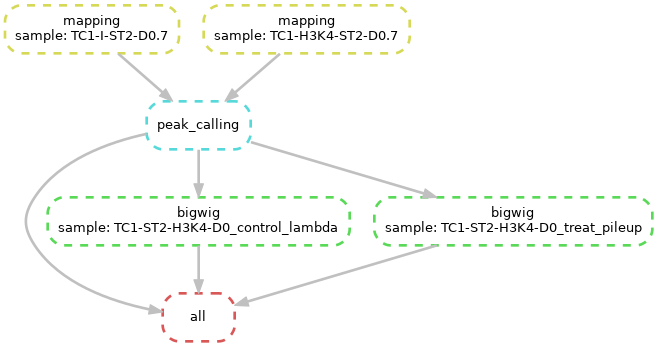

# Bioinformatics workflow with snakemake and conda

Author: Sarah Peter

In this tutorial you will learn how to run a ChIP-seq analysis with the snakemake workflow engine on the cluster.

## Setup the environment

For this tutorial we will use the `conda` [1] package manager to install the required tools. It can encapsulate software and packages in environments, so you can have multiple different versions of a software installed at the same time. It also has functionality to easily port and replicate environments, which is important to ensure reproducibility of analyses.

We will use conda on two levels in this tutorial. First we use a conda environment to install and run snakemake. Second, inside the snakemake workflow we will define separate conda environments for each step.

1. Start a job on the cluster

   ```bash
   (laptop)$> ssh iris-cluster
   (access)$> si
   ```

2. Install conda

   ```bash
   (node)$> mkdir -p $HOME/downloads
   (node)$> cd $HOME/downloads
   (node)$> wget https://repo.anaconda.com/miniconda/Miniconda3-latest-Linux-x86_64.sh
   (node)$> chmod u+x Miniconda3-latest-Linux-x86_64.sh
   (node)$> ./Miniconda3-latest-Linux-x86_64.sh 
   ```
   You will need to specify your installation destination, e.g. `/home/users/sdiehl/tools/miniconda3`. You must use the **full** path and can**not** user `$HOME/tools/miniconda3`. Answer `yes` to initialize Miniconda3. 

   The installation will modify your `.bashrc` to make conda directly available after each login. To activate the changes now, run

   ```bash
   (node)$> source ~/.bashrc
   ```

   Update conda to the latest version:
   ```bash
   (node)$> conda update conda 
   ```

3. Create a new conda environment and activate it

   ```bash
   (node)$> conda create -n bioinfo_tutorial
   (node)$> conda activate bioinfo_tutorial
   ```
   You can see that your prompt will now be prefixed with `(bioinfo_tutorial)` to show which environment is active. For rest of the tutorial make sure that you always have this environment active.
4. Install required tools

   ```bash
   (node)$> conda install -c bioconda -c conda-forge snakemake-minimal
   ```
   
   

## Create snakemake workflow

In this tutorial we will analyse ChIP-seq data [2] from a paper recently published by our colleagues in LSRU [3].

To speed up computing time we will use source files that only contain sequencing reads from chromosome 7. The files for input (control) and H3K4me3 (ChIP) are available on the cluster in the directory `/work/projects/ulhpc-tutorials/bio/snakemake/chip-seq` and the corresponding reference in `/work/projects/ulhpc-tutorials/bio/snakemake/reference`.

Create a working directory and link the necessary data:

```bash
cd $SCRATCH
mkdir bioinfo_tutorial
cd bioinfo_tutorial
ln -s /work/projects/ulhpc-tutorials/bio/snakemake/chip-seq .
ln -s /work/projects/ulhpc-tutorials/bio/snakemake/reference .
ln -s /work/projects/ulhpc-tutorials/bio/snakemake/envs .
```

Create a file called `Snakefile` in the current directory and open it in your favourite editor.

### Mapping

Note: Snakemake is based on Python and we can use Python code in the Snakefile.

```python
rule NAME:
    input: "path/to/inputfile", "path/to/other/inputfile"
    output: "path/to/outputfile", "path/to/another/outputfile"
    shell: "somecommand {input} {output}"
```


TODO: Rule without wildcards; add params, log, conda step by step

Let's define a rule for the mapping:

```python
rule mapping:
  input: "chip-seq/{sample}.fastq.gz"
  output: "bowtie/{sample}.bam"
  params:
    idx = "reference/Mus_musculus.GRCm38.dna_sm.chromosome.7"
  log: "logs/bowtie2_{sample}.log"
  conda: "envs/bowtie2.yaml"
  shell:
    """
    bowtie2 \
      -x {params.idx} \
      -U {input} \
      -S {output}.tmp

    samtools sort {output}.tmp > {output}
    samtools index {output}
    """
```

TODO: Skip intermediate {output}.tmp file if possible

You can test the rule by specifying one of the potential outputs. We will just do a dry-run with with option `-n` for now.

```bash
(node)$> snakemake -npr --use-conda bowtie/TC1-I-ST2-D0.7.bam
```


### Peak calling

```python
rule peak_calling:
  input:
    control = "bowtie/TC1-I-ST2-D0.7.bam",
    chip = "bowtie/TC1-H3K4-ST2-D0.7.bam"
  output:
    "output/TC1-ST2-H3K4-D0_peaks.narrowPeak",
    "macs2/TC1-ST2-H3K4-D0_control_lambda.bdg",
    "macs2/TC1-ST2-H3K4-D0_treat_pileup.bdg"
  conda: "envs/macs2.yaml"
  shell:
    """
    macs2 callpeak -t {input.chip} -c {input.control} -f BAM -g mm -n TC1-ST2-H3K4-D0 -B -q 0.01 --outdir macs2
    
    cp macs2/TC1-ST2-H3K4-D0_peaks.narrowPeak output/
    """
```

Disclaimer: Please be aware that the results of this step might be screwed, because we only have data from one chromosome.

### Generate bigwig files for visualisation

```python
rule bigwig:
  input: "macs2/{sample}.bdg"
  output: "output/{sample}.bigwig"
  params:
    idx = "reference/Mus_musculus.GRCm38.dna_sm.chromosome.7.fa.fai"
  conda: "envs/ucsc.yaml"
  shell:
    """
    bedGraphToBigWig {input} {params.idx} {output}
    """
```


## Summary rule

Add this rule to the **top** of the `Snakefile`:

```python
rule all:
  input: "output/TC1-ST2-H3K4-D0_peaks.narrowPeak", "output/TC1-ST2-H3K4-D0_control_lambda.bigwig", "output/TC1-ST2-H3K4-D0_treat_pileup.bigwig"
	
```

Finally test the workflow again, this time without a specific target file:

```bash
(node)$> snakemake --use-conda -npr
```

Snakemake can visualise the dependency graph of the workflow with the following command:

```bash
(nodes)$> snakemake --dag | dot -Tpng > dag.png
```



## Cluster configuration for snakemake

1. Adjust mapping step to run on multiple threads

   ```python
   rule mapping:
     input: "chip-seq/{sample}.fastq.gz"
     output: "bowtie/{sample}.bam"
     params:
       idx = "reference/Mus_musculus.GRCm38.dna_sm.chromosome.7"
     log: "logs/bowtie2_{sample}.log"
     conda: "envs/bowtie2.yaml"
     threads: 4
     shell:
       """
       bowtie2 -p {threads} \
         -x {params.idx} \
         -U {input} \
         -S {output}.tmp
   
       samtools sort {output}.tmp > {output}
       samtools index {output}
       """
   ```

   Run test:

   ```bash
   snakemake -j 4 -npr --use-conda bowtie/TC1-I-ST2-D0.7.bam
   ```

   

2. Configure job parameters with `cluster.json`

   ```json
   {
       "__default__" :
       {
           "time" : "0-00:10:00",
           "n" : 1,
           "partition" : "batch",
           "ncpus": 1,
           "job-name" : "{rule}",
           "output" : "slurm-%j-%x.out",
           "error" : "slurm-%j-%x.err"
       },
       "mapping":
       {
           "ncpus": 4,
       },
   }
   ```

   

3. Run snakemake with cluster configuration
Make sure you quit your job and run the following from the access node.
   
   ```bash
   (access)$> conda activate bioinfo_tutorial
   
   (access)$> SLURM_ARGS="-p {cluster.partition} -N 1 -n {cluster.n} -c {cluster.ncpus} -t {cluster.time} --job-name={cluster.job-name} -o {cluster.output} -e {cluster.error}"
   
   (access)$> snakemake -j 10 -pr --use-conda --cluster-config cluster.json --cluster "sbatch $SLURM_ARGS"
```
   
   


## Inspect results in IGV

Download IGV from http://software.broadinstitute.org/software/igv/download.

```
rsync -avz iris-cluster:/scratch/users/sdiehl/bioinfo_tutorial/output .
```

Select mouse mm10 as genome in the upper left.

Use `TC1-ST2-H3K4-D0_peaks.narrowPeak` to visualize peaks.


## (optional) Plot enrichment with deepTools


## References

* [1] [Anaconda](https://www.anaconda.com/)
* [2] [ChIP-seq data](https://www.ebi.ac.uk/ena/data/view/PRJEB20933)
* [3] [Gérard D, Schmidt F, Ginolhac A, Schmitz M, Halder R, Ebert P, Schulz MH, Sauter T, Sinkkonen L. Temporal enhancer profiling of parallel lineages identifies AHR and GLIS1 as regulators of mesenchymal multipotency. *Nucleic Acids Research*, Volume 47, Issue 3, 20 February 2019, Pages 1141–1163, https://doi.org/10.1093/nar/gky1240](https://www.ncbi.nlm.nih.gov/pubmed/30544251)
* [Snakemake](https://snakemake.readthedocs.io/en/stable/)
* [BWA](http://bio-bwa.sourceforge.net/)

## Acknowledgements

Many thanks to Nikola de Lange, Aurélien Ginolhac, Roland Krause and Cedric Laczny for their help in developing this tutorial.