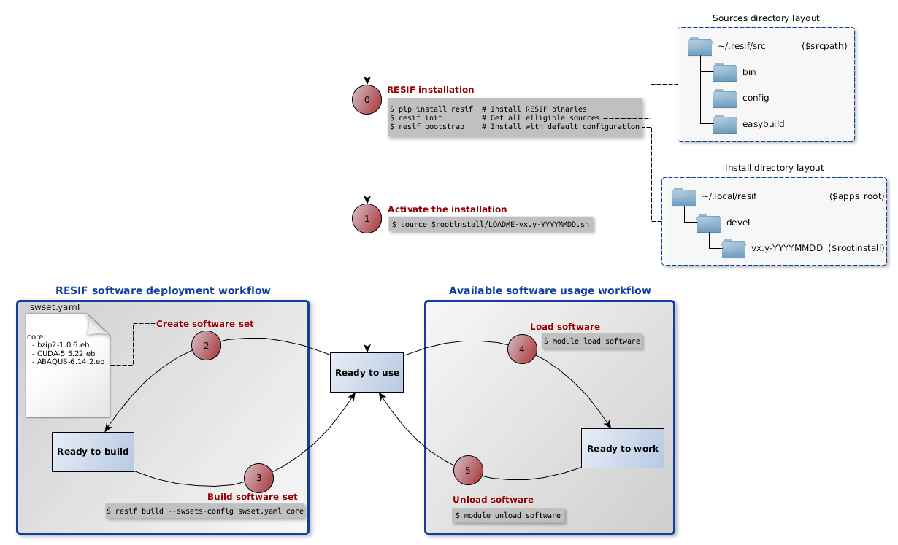

-*- mode: markdown; mode: visual-line; fill-column: 80 -*-

Copyright (c) 2013-2017 UL HPC Team  <hpc-sysadmins@uni.lu>

------------------------------------------------------
# UL HPC Tutorial: Using RESIF to manage software modules

[](https://hpc.uni.lu) [](http://www.gnu.org/licenses/gpl-3.0.html) [](https://github.com/ULHPC/tutorials/issues/) [](https://github.com/ULHPC/tutorials/tree/devel/advanced/RESIF/) [](http://ulhpc-tutorials.readthedocs.io/en/latest/advanced/RESIF/) [](https://github.com/ULHPC/tutorials)


`/!\ IMPORTANT`: __This tutorial is obsolete as we are about to release the new RESIF code completely refactored__.
Thus the below content has to be reworked with regards our new changes and is only kept for archives purposes.

--------------------

The objective of this tutorial is to present how to interact with the software installed on the UL HPC platform, from using provided software to extending the software collection by adding new software on the platform, and also reproducing the software environment on a local workstation.

This course is divided in three chapters that are going through each of these use cases.

The [first chapter](#understanding-and-using-the-software-available-on-the-ul-hpc-platform) details the architecture of the software collection and the basic tools to start using the software.
The [second chapter](#adding-a-software-to-the-existing-stack) defines the process of adding new software to the existing stack as a user using RESIF, the tool developed internally to manage the software stack on the UL HPC platform.
The [third chapter](#replicating-the-architecture-of-the-platform-on-a-local-environment) explains the process of reproducing the software stack present on the platform, or part of it, in a local environment.

The latest version of this document can be found on [Github](https://github.com/ULHPC/tutorials/tree/devel/advanced/RESIF).

## Using the software environment available on the UL HPC platform

Before starting this tutorial, please make sure you are on a compute node of Gaia/Chaos and not on the access node. To get resources on a compute node, use the following command:
`(access)$> oarsub -I -l core=1,walltime=1:00:00`
(for more details about this command and the node reservation process on the clusters, please referer to the [ULHPC documentation](https://hpc.uni.lu/users/docs/oar.html).)

Using the software available on the UL HPC platform is done through [Lmod](https://www.tacc.utexas.edu/research-development/tacc-projects/lmod) which provide a `module` command that we review in the following section.
Lmod allows us to provide a multitude of applications and libraries in multiple versions. These tools use special files named "modules" that define ways to manage environment variables such as PATH, LD_LIBRARY_PATH and MANPATH, enabling the easy loading and unloading of application/library profiles and their dependencies.

### `module` command basics and workflow

Firstly, we activate the newest software stack:

    source /opt/apps/resif/default_user.sh

By using `module available` (or the shorter forms `module avail` or `module av`) we can list all the software modules of the software stack:

    (node)$> module avail
    ------------------- /opt/apps/devel/v1.1-20150414/core/modules/bio ----------------
    bio/ABySS/1.3.4-goolf-1.4.10-Python-2.7.3        bio/Bowtie2/2.2.2-goolf-1.4.10   (D)
    bio/ABySS/1.3.4-ictce-5.3.0-Python-2.7.3  (D)    bio/Cufflinks/2.0.2-goolf-1.4.10
    [...]
Note that this command returns a lot of information since there is a lot of installed software. To reduce the output we can search for what we are interested in, for example:

    (node)$> module avail gromacs
    ----------- /opt/apps/devel/v1.1-20150414/core/modules/bio --------------
    bio/GROMACS/4.6.1-ictce-5.3.0-hybrid    bio/GROMACS/4.6.1-ictce-5.3.0-mt
    bio/GROMACS/4.6.5-goolf-1.4.10-mt (D)
    [...]
This will only output the software modules from the software stack that contain "gromacs" (case insensitive) in their name.

To start using an application in the version we require, for example `bio/GROMACS/4.6.5-goolf-1.4.10-mt`, we are going to `load` its software module:
`(node)$> module load bio/GROMACS/4.6.5-goolf-1.4.10-mt`

We can now use the software by running its commands (e.g. for Gromacs we can now use `mdrun`).

To check the currently loaded modules, we use the `module list` command:

    (node)$> module list
    Currently Loaded Modules:
        1) compiler/GCC/4.7.2             4) toolchain/gompi/1.4.10                            7) numlib/ScaLAPACK/2.0.2-gompi-1.4.10-OpenBLAS-0.2.6-LAPACK-3.4.2
        2) system/hwloc/1.6.2-GCC-4.7.2   5) numlib/OpenBLAS/0.2.6-gompi-1.4.10-LAPACK-3.4.2   8) toolchain/goolf/1.4.10
        3) mpi/OpenMPI/1.6.4-GCC-4.7.2    6) numlib/FFTW/3.3.3-gompi-1.4.10                    9) bio/GROMACS/4.6.5-goolf-1.4.10-mt

When we've finished working with the application, we can remove its environment profile with `module unload`:
`(node)$> module unload bio/GROMACS/4.6.5-goolf-1.4.10-mt`

However, this will not remove its dependencies from the environment:

    (node)$> module list
    Currently Loaded Modules:
        1) compiler/GCC/4.7.2             4) toolchain/gompi/1.4.10                            7) numlib/ScaLAPACK/2.0.2-gompi-1.4.10-OpenBLAS-0.2.6-LAPACK-3.4.2
        2) system/hwloc/1.6.2-GCC-4.7.2   5) numlib/OpenBLAS/0.2.6-gompi-1.4.10-LAPACK-3.4.2   8) toolchain/goolf/1.4.10
        3) mpi/OpenMPI/1.6.4-GCC-4.7.2    6) numlib/FFTW/3.3.3-gompi-1.4.10

To remove all the loaded modules at once we use the `module purge` command:
`(node)$> module purge`

Next we are going to look at the hierarchical architecture of the modules.

### Software stack architecture

The upper layer of the architecture is what we call a *software set*. It is a collection of software, for example we define a _core_ set that only contains commonly-used and tested software and an _experimental_ set that contains untested software.
The main goal of these categories is to provide information on the degree of support for the various software.

Inside these sets, software is named in regards to a *naming scheme* which classifies the software (e.g. compilers, physics) and allows for a better structuring of results with the `module avail` command.
The software named using this scheme has the following format: **software_class/software_name/software_complete_version** where

- **software_class** describes the category among the following classes: [base, bio, cae, chem, compiler, data, debugger, devel, lang, lib, math, mpi, numlib, phys, system, toolchain, tools, vis]
- **software_name** is the name of the software (e.g. GROMACS, MATLAB, R or ABySS)
- **software_complete_version** is the full version of the software: containing the version of the software itself followed by the type and version of the main dependencies it relies on (e.g. compiler) with the following format: software_version-dependencies_versions

The `module avail` command will thus have the output shown below, where we can note:

- the core software set is shown first
- application names are prefixed with the category (class)
- full versions including tool dependencies are shown
- the default module for each application is marked with a `(D)`, thus by loading `compiler/GCC` the system would in effect load `compiler/GCC/4.8.2`

        ```
        ------------------------------------------------------------------------------ /opt/apps/resif/devel/v1.1-20150414/core/modules/bio -------------------------------------------------------------------------------
           bio/ABySS/1.3.4-goolf-1.4.10-Python-2.7.3        bio/Bowtie2/2.2.2-goolf-1.4.10   (D)    bio/GROMACS/4.6.1-ictce-5.3.0-hybrid     bio/GROMACS/4.6.5-goolf-1.4.10-mt (D)
           bio/Bowtie2/2.0.2-ictce-5.3.0                    bio/Cufflinks/2.0.2-ictce-5.3.0  (D)    bio/GROMACS/4.6.5-goolf-1.4.10-hybrid    bio/SAMtools/0.1.18-ictce-5.3.0   (D)

        ------------------------------------------------------------------------------ /opt/apps/resif/devel/v1.1-20150414/core/modules/cae -------------------------------------------------------------------------------
           cae/ABAQUS/6.11.1    cae/OpenFOAM/2.3.0-goolf-1.4.10    cae/OpenFOAM/2.3.0-ictce-5.3.0 (D)

        ------------------------------------------------------------------------------ /opt/apps/resif/devel/v1.1-20150414/core/modules/chem ------------------------------------------------------------------------------
           chem/ABINIT/7.2.1-x86_64_linux_gnu4.5                chem/GPAW/0.9.0.8965-goolf-1.4.10-Python-2.7.3        chem/QuantumESPRESSO/5.0.2-goolf-1.4.10              chem/libctl/3.2.1-goolf-1.4.10
           chem/ASE/3.6.0.2515-ictce-5.3.0-Python-2.7.3  (D)    chem/QuantumESPRESSO/5.0.2-goolf-1.4.10-hybrid        chem/QuantumESPRESSO/5.0.2-ictce-5.3.0        (D)

        ---------------------------------------------------------------------------- /opt/apps/resif/devel/v1.1-20150414/core/modules/compiler ----------------------------------------------------------------------------
           compiler/GCC/4.7.2    compiler/GCC/4.8.2 (D)    compiler/icc/2013.3.163    compiler/ifort/2013.3.163

        ------------------------------------------------------------------------------ /opt/apps/resif/devel/v1.1-20150414/core/modules/data ------------------------------------------------------------------------------
           data/HDF5/1.8.7-goolf-1.4.10    data/HDF5/1.8.10-patch1-goolf-1.4.10        data/netCDF/4.2-goolf-1.4.10            data/netCDF-C++/4.2-goolf-1.4.10
           data/HDF5/1.8.9-ictce-5.3.0     data/h5utils/1.12.1-ictce-5.3.0      (D)    data/netCDF/4.2.1.1-ictce-5.3.0  (D)    data/netCDF-Fortran/4.2-ictce-5.3.0  (D)
        ```

## Adding a software to an existing stack on UL HPC

In this part, we are going to show the steps to add a software that is not already provided on the platform yet is available as a module in the [EasyBuild database](https://github.com/hpcugent/easybuild/wiki/List-of-supported-software-packages). Using the RESIF tool is the preferred way to add new software.
First of all we are going to install RESIF and then use it to add a software (bzip2 in this example).

Note: The following commands must be executed in an OAR job.

### Installation of RESIF

RESIF requires the following prerequisites (already available on the platform):

- [Python 2.6](https://www.python.org/downloads) or above
- pip (included in the latest Python)
- [git](http://git-scm.com/downloads)

RESIF installation:

        (node)$> pip install --install-option="--prefix=$HOME/.local" resif

Initially, we need to add the following paths to the environment:

        (node)$> export PATH=$PATH:~/.local/bin
        (node)$> export PYTHONPATH=$PYTHONPATH:~/.local/lib/python2.7/site-packages

Also,

RESIF initialization which will download the required module sources to build new software:

        (node)$> resif init

### Installation of additional software

First we need to create a file that lists the applications we want to install.
To search for the names of the application configuration files, we use RESIF as follow:

        (node)$> resif search bzip2
        [...]
        * bzip2-1.0.6.eb
        [...]
Create a file (we are assuming it is in the home directory), name it `swsets.yaml` and insert the following content:

        mysoftware:
          - bzip2-1.0.6.eb

This is a [YAML](http://yaml.org/) format file that RESIF reads, the internal layout is the following:

        software_set1_name:
          - software1_configurationfile
          - software2_configurationfile
        software_set2_name:
          - software3_configurationfile
It can list as many software, divided in as many software sets as we require to structure our installation.

Now we install the software using `resif build`:

        (node)$> resif build --installdir $HOME/.local/resif --swsets-config ~/swsets.yaml mysoftware
This will install the software using ~/.local/resif as the root of the installation.

To make the software modules available through the `module` command, we need to add their path:

        (node)$> module use $HOME/.local/resif/mysoftware/modules/all

Now, we can see `bzip2` at the very beginning of the output of the list of the software modules:

        (node)$> module avail
        ----- /home/users/username/.local/resif/mysoftware/core/modules/all -----
        tools/bzip2/1.0.6

The software is installed, and we can load its profile with `module load tools/bzip2/1.0.6`.

RESIF offers many more possibilities than this basic functionality, for more details check the [documentation](http://resif.readthedocs.org/en/latest/).

## Replicating the software sets in a local environment

In this part, we are going to create a software stack from scratch. This is especially useful if we want to work on a local workstation (e.g. a laptop) with the same tools as those available on the platform.

We assume that RESIF is already installed as per the instructions described [above](#installation-of-resif).
Note: RESIF internally depends on [EasyBuild](http://easybuild.readthedocs.org/en/latest/) which is compatible with Linux/OSX but not Windows. On Windows, you can configure a Linux Virtual Machine to use RESIF and the software built using it.

**At this point, please make sure to unset the RESIF_ROOTINSTALL environment variable.** This is a necessary step since this variable would interfere with the creation of a new software stack (which defines a new rootinstall).
To do so, execute the following command:

        unset RESIF_ROOTINSTALL

### Direct method

A `swsets.yaml` file that describes which software we want to install needs to be created.
As an example, create it in your home directory with the following content:

        core:
          - bzip2-1.0.6.eb
          - ABINIT-7.2.1-x86_64_linux_gnu4.5.eb

We include here only the bzip2 library and the ABINIT software as they are fast to deploy.

We can now install this simple software stack with the following command:

        $> resif cleaninstall --swsets-config ~/swsets.yaml core
This will install everything using `~/.local/resif` as the root of the installation.

To use this newly installed software stack, you need to source the LOADME file inside of the rootinstall directory.
This path should look like this: `~/.local/resif/devel/vx.y-YYYYMMDD/LOADME-vx.y-YYYYMMDD.sh`.

        $> source ~/.local/resif/devel/vx.y-YYYYMMDD/LOADME-vx.y-YYYYMMDD.sh

The software stack is now ready to be used with the `module` command.

### Indirect method

In this method we are going to create the architecture and then add software to it.

We create the architecture using the `bootstrap` subcommand:

        $> resif bootstrap
This will create the architecture using `~/.local/resif` as the root of the installation.

We now need to make this architecture active: you need to source the LOADME file inside of the rootinstall directory.
This path should look like this: `~/.local/resif/devel/vx.y-YYYYMMDD/LOADME-vx.y-YYYYMMDD.sh`.

        $> source ~/.local/resif/devel/vx.y-YYYYMMDD/LOADME-vx.y-YYYYMMDD.sh

Then we need to create the file that describe the software we want to install. In the home directory, create a file named `swsets.yaml` and make it match the following content:

        core:
          - bzip2-1.0.6.eb
          - ABINIT-7.2.1-x86_64_linux_gnu4.5.eb

We include here only the bzip2 library and the ABINIT software as they are fast to deploy.

We now only need to build the given software:

        $> resif build --swsets-config ~/swsets.yaml core

This will install the software listed in the `swsets.yaml` file. The software stack is now ready to be used.


To learn more about RESIF and how to control more parameters of its usage, please refer to the [documentation](http://resif.readthedocs.org/en/latest/).

To conclude this tutorial, here is a schema that summarizes the previous parts:


