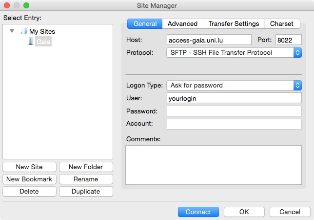
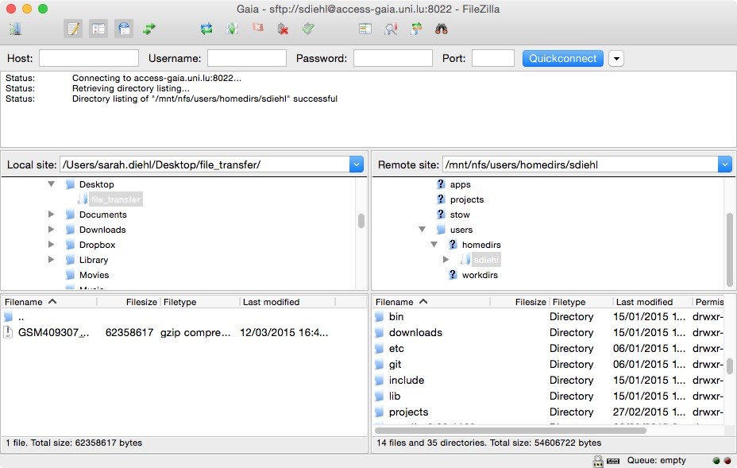
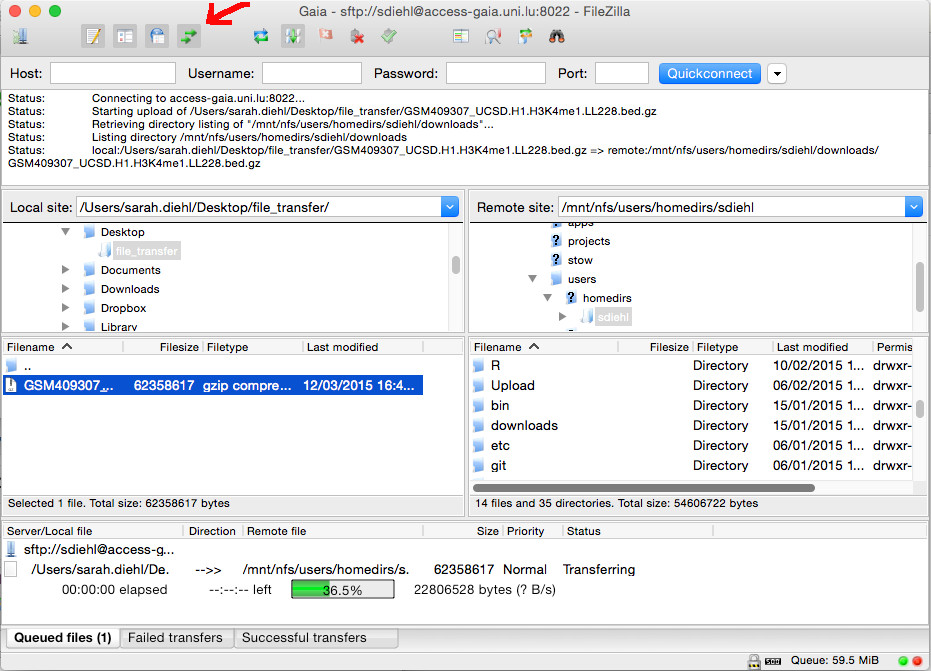

-*- mode: markdown; mode: auto-fill; fill-column: 80 -*-
`README.md`

Copyright (c) 2014 [Sebastien Varrette](mailto:<Sebastien.Varrette@uni.lu>) [www](http://varrette.gforge.uni.lu)

        Time-stamp: <Mar 2014-05-06 12:06 svarrette>

-------------------

# UL HPC Tutorial: Getting Started

This tutorial will guide you through your first steps on the
[UL HPC platform](http://hpc.uni.lu).  

Before proceeding: 

* make sure you have an account (if not, follow [this procedure](https://hpc.uni.lu/get_an_account)), and an SSH client.
* take a look at the [quickstart guide](https://hpc.uni.lu/users/getting_started.html)
* ensure you operate from a Linux / Mac environement. Most commands below assumes running in a Terminal in this context. If you're running Windows, you can use Putty tools etc. as described [on this page](https://hpc.uni.lu/users/docs/access.html#installing-ssh-on-windows) yet it's probably better that you familiarize "natively" with Linux-based environment by having a Linux Virtual Machine (consider for that [VirtualBox](https://www.virtualbox.org/)). 

From a general perspective, the [Support page](https://hpc.uni.lu/users/docs/report_pbs.html) describes how to get help during your UL HPC usage. 

## Convention

In the below tutorial, you'll proposed terminal commands where the prompt is denoted by `$>`. 

In general, we will prefix to precise the execution context (_i.e._ your laptop, a cluster frontend or a node). Remember that `#` character is a comment. Example: 

		# This is a comment 
		$> hostname

		(laptop)$> hostname         # executed from your personal laptop / workstation

		(access-gaia)$> hostname    # executed from access server of the Gaia cluster
 

## Platform overview. 

You can find a brief overview of the platform with key characterization numbers [on this page](https://hpc.uni.lu/systems/overview.html).

The general organization of each cluster is depicted below:


Details on this organization can be found [here](https://hpc.uni.lu/systems/clusters.html#clusters-organization)


# Connecting for the first time and preparing your SSH environment

* [Access / SSH Tutorial](https://hpc.uni.lu/users/docs/access.html)

The way SSH handles the keys and the configuration files is illustrated in the following figure:


In order to be able to login to the clusters, you have sent us through the Account request form the **public key** (i.e. `id_dsa.pub`, `id_rsa.pub` or the **public key** as saved by PuttY) you initially generated, enabling us to configure the `~/.ssh/authorized_keys` file of your account.  


### Step 1a: Connect to UL HPC (Linux / Mac OS / Unix)

Run the following commands in a terminal (substituting *yourlogin* with the login name you received from us):

        (laptop)$> ssh -p 8022 yourlogin@access-chaos.uni.lu

If you want to connect to the gaia cluster, 

        (laptop)$> ssh -p 8022 yourlogin@access-gaia.uni.lu

Now you probably want to avoid taping this long command to connect to the platform. You can customize SSH aliases for that. Edit the file `~/.ssh/config` (create it if it does not already exist) and adding the following entries: 

        Host chaos-cluster
            Hostname access-chaos.uni.lu

        Host gaia-cluster
            Hostname access-gaia.uni.lu

        Host *-cluster
            User yourlogin
            Port 8022
            ForwardAgent no

Now you shall be able to issue the following (simpler) command to connect to the cluster and obtain the welcome banner: 

		(laptop)$> ssh gaia-cluster

		(laptop)$> ssh chaos-cluster

In the sequel, we assume these aliases to be defined. 

### Step 1b: Connect to UL HPC (Windows)

* Download [all the Putty tools](http://the.earth.li/~sgtatham/putty/latest/x86/putty.zip)
  * extract them in an easy-to-find place, such as `C:\Putty`
* load your private key under Pageant
* open `Putty.exe` (connection type: `SSH`)
  * In `Category:Session`:
    * Host Name: `access-{chaos,gaia}.uni.lu`
    * Port: 8022
    * Saved session: `{Chaos,Gaia}`
  * In `Category:Connection:Data` :
    * Auto-login username: `yourlogin`
  * Go back to `Category:Session` and click on "Save"
  * Click on "Open"

		
## Step 2: configure your SSH environment on all clusters

The SSH key you provided us secure your connection __from__ your laptop (or personal workstation) __to__ the cluster frontends. It is thus important to protect them by a passphrase. 

You shall have also a new key pair configured in your account to permit a bi-directional transparent connection from one cluster to the other (you can check that in your `~/.ssh/authorized_keys` and by successfully running: 

		(access-gaia)$> ssh chaos-cluster

or 

		(access-chaos)$> ssh gaia-cluster

If that's the case, you can ignore the rest of this section. 
*Otherwise*, you will now have to configure a passphrase-free SSH key pair to permit a transparent connection from one cluster to another. 


* Connect to the `chaos` cluster: 

		(laptop)$> ssh chaos-cluster
		
* generate a new SSH key pair with `ssh-keygen` (leave the passphrase empty):

		(access-chaos)$> ssh-keygen -t dsa
		Generating public/private dsa key pair.
		Enter file in which to save the key (/home/users/yourlogin/.ssh/id_dsa): 
		Enter passphrase (empty for no passphrase): 
		Your identification has been saved in /home/users/yourlogin/.ssh/id_dsa.
		Your public key has been saved in /home/users/yourlogin/.ssh/id_dsa.pub.
		The key fingerprint is:
		1f:1d:a5:66:3b:4a:68:bc:7d:8c:7f:33:c9:77:0d:4a yourlogin@access.chaos-cluster.uni.lux
		The key's randomart image is:
		`-[ DSA 1024]---`
		|              .  |
		|             o   |
		|            =    |
		|       . . + o   |
		|        S o +    |
		|       . = =E..  |
		|        . =.oo o.|
		|           o. * +|
		|            .. +.|
		`---------------`

* authorize the newly generated public key to be used during challenge/response authentication:

		(access-chaos)$> cat ~/.ssh/id_dsa.pub 
		ssh-dss AAAAB[...]B2== yourlogin@access.chaos-cluster.uni.lux
		(access-chaos)$> cat ~/.ssh/id_dsa.pub  >> ~/.ssh/authorized_keys
		
  * you can check that it works by connecting to localhost: 

		```
		(access-chaos)$> ssh -p 8022 localhost
		[...]
		(access-chaos)$> exit   # or CTRL-D
		```
  		
* add an alias to facilitate the connection to each cluster by adding the following SSH configuration entry in the file `~/.ssh/config`: 

		Host gaia-cluster chaos-cluster
    		User yourlogin
    		Port 8022

		Host gaia-cluster
    		Hostname access-gaia.uni.lu
		Host chaos-cluster
    		Hostname access-chaos.uni.lu
  		
You'll have to setup the same key package on the gaia cluster such that you can then work indefferently on one or another cluster. It's also the occasion to learn how to add a new SSH key to your authorized key portfolio. 

* Open another terminal and connect to the gaia cluster 

		(laptop)$> ssh gaia-cluster

* edit the file `~/.ssh/authorized_keys` to add your previously generated key on chaos (use `:wq` in [vim](http://tnerual.eriogerg.free.fr/vimqrc.pdf) to save and quit):

		(access-gaia)$> vim ~/.ssh/authorized_keys


* go back to the terminal where you're connected on chaos, you shall now be able to connect to gaia, and reversely: 

		(access-chaos)$> ssh gaia
		[...]
		(access-gaia)$> exit     # or CRTL-D
		
You have a different home directory on each UL HPC site, so you will usually use Rsync or scp to move data around (see [transfering files tutorials](https://hpc.uni.lu/users/docs/filetransfer.html)).

Now that we are able to connect __from__ chaos __to__ gaia, we will transfer the SSH keys and configuration in place from chaos and check that we can connnect back: 

		(access-chaos)$> scp ~/.ssh/id_dsa* gaia:.ssh/
		(access-chaos)$> scp ~/.ssh/config  gaia:.ssh/
		(access-chaos)$> ssh gaia
		[...]
		(access-gaia)$>  ssh chaos
		(access-chaos)$> exit     # or CRTL-D
		(access-gaia)$>  exit     # or CRTL-D

So now **we have setup a bi-directional transparent connection from one cluster to the other.** 

## Step 2bis: Using SSH proxycommand setup to access the clusters despite port filtering

It might happen that the port 8022 is filtered from your working place. You can easily bypass this firewall rule using an SSH proxycommand to setup transparently multi-hop connexions *through* one host (a gateway) to get to the access frontend of the cluster, as depited below: 

     [laptop] -----||--------> 22 [SSH gateway] ---------> 8022 [access-{chaos,gaia}]
                firewall

The gateway can be any SSH server which have access to the access frontend of the cluster. The [Gforge @ UL](http://gforge.uni.lu) is typically used in this context but you can prefer any other alternative (your personal NAS @ home etc.). Then alter the SSH config on yout laptop (in `~/.ssh/confg` typically) as follows:

* create an entry to be able to connect to the gateway:

		# Alias for the gateway (not really needed, but convenient), below instanciated 
		Host gw
		    User anotherlogin
		    Hostname host.domain.org
		    ForwardAgent no

		# Automatic connection to UL HPC from the outside via the gateway
		Host *.ulhpc
			ProxyCommand ssh gw "nc -q 0 `basename %h .ulhpc` %p"

* ensure you can connect to the gateway:

		(laptop)$> ssh gw
		(gateway)$> exit # or CTRL-D 
		
* the `.ulhpc` suffix we mentionned in the previous configuration is an arbitrary suffix you will now specify in your command lines in order to access the UL HPC platform via the gateway as follows: 

		(laptop)$> ssh gaia.ulhpc

## Step 3: transferring files
Directories such as `$HOME`, `$WORK` or `$SCRATCH` are shared among the nodes of the cluster that you are using (including the front-end) via shared filesystems (NFS, Lustre) meaning that:

* every file/directory pushed or created on the front-end is available on the computing nodes
* every file/directory pushed or created on the computing nodes is available on the front-end


### Step 3a: Linux / OS X / Unix command line tools
The two most common tools you can use for data transfers over SSH:

* `scp`: for the full transfer of files and directories (only works fine for single files or directories of small/trivial size)
* `rsync`: a software application which synchronizes files and directories from one location to another while minimizing data transfer as only the outdated or inexistent elements are transfered (practically required for lengthy complex transfers, which are more likely to be interrupted in the middle).

Of both, normally the second approach should be preferred, as more generic; note that, both ensure a secure transfer of the data, within an encrypted tunnel.

* Create a new directory on your local machine and download a file to transfer (next-gen sequencing data from the NIH Roadmap Epigenomics Project):

		(laptop)$> mkdir file_transfer
		(laptop)$> cd file_transfer
		(laptop)$> wget "ftp://ftp.ncbi.nlm.nih.gov/geo/samples/GSM409nnn/GSM409307/suppl/GSM409307_UCSD.H1.H3K4me1.LL228.bed.gz"
	
* Transfer the file with scp:

		(laptop)$> scp GSM409307_UCSD.H1.H3K4me1.LL228.bed.gz gaia-cluster:
		
* Connect to the cluster, check if the file is there and delete it.

		(laptop)$> ssh gaia-cluster
		(access-gaia)$> ls
		(access-gaia)$> rm GSM409307_UCSD.H1.H3K4me1.LL228.bed.gz
		(access-gaia)$> exit
		
* Transfer the directory with rsync:

		(laptop)$> cd ..
		(laptop)$> rsync -avzu file_transfer gaia-cluster:
		
* Delete the file and retrieve it from the cluster:

		(laptop)$> rm file_transfer/GSM409307_UCSD.H1.H3K4me1.LL228.bed.gz
		(laptop)$> rsync -avzu gaia-cluster:file_transfer .
		
* **Bonus**: Check where the file is located on the cluster after the rsync.

You can get more information about these transfer methods in the [file transfer documentation](https://hpc.uni.lu/users/docs/filetransfer.html).


## Step 3b: Windows / Linux / OS X / Unix GUI tools
* Download the FileZilla client application from [filezilla-project.org](https://filezilla-project.org/download.php?type=client) and install it.
* First we need to tell FileZilla about our ssh key:
	* Start the application.
	* Go to the `Settings` (either under `Edit` or `FileZilla` depending on the OS).
	* In the category `Connection` select `SFTP`. 
	* Click on the button `Add keyfile...` and select your private keyfile (you may need to convert it).
	* Finally click `OK` to save and close the settings.
	


* Back in the main window click on the `Site Manager` button on the top left or select `Site Manager` from the `File` menu.
* Click on the `New Site` button and enter/select the following:
  * Host: `access-gaia.uni.lu`
  * Protocol: `SFTP - SSH File Transfer Protocol`
  * Logon Type: `Interactive`
  * User: your login
  

  
* Click on the `Connect` button.
* Accept the certificate.

You should now see something similar to the following window:



On the very top, beneath the quick connect, you see the message log. Below you have the directory tree and the contents of the current directory for you local computer on the left and the remote location on the right.

To transfer a file, simply drag and drop it from the directory listing on the left side to destination directory on the right (to transfer from local to remote) or vice versa (to transfer from remote to local). You can also select a file by left clicking on it once and then right click on it to get the context menu and select "Upload" or "Download" to transfer it.

If you skipped step 3a, you may download the following file (50 MB) for testing: <br />
[ftp://ftp.ncbi.nlm.nih.gov/geo/samples/GSM409nnn/GSM409307/suppl/GSM409307_UCSD.H1.H3K4me1.LL228.bed.gz](ftp://ftp.ncbi.nlm.nih.gov/geo/samples/GSM409nnn/GSM409307/suppl/GSM409307_UCSD.H1.H3K4me1.LL228.bed.gz) (next-gen sequencing data from the NIH Roadmap Epigenomics Project)

When you click the fifth icon on the top with the two green arrows to toogle the transfer queue, you can see the status of ongoing transfers on the very bottom of the window.



# Discovering, visualizing and reserving UL HPC resources

In the sequel, replace `<login>` in the proposed commands with you login on the platform (ex: `svarrette`).   

## Step 1: the working environment 

* [reference documentation](http://hpc.uni.lu/users/docs/env.html)

After a successful login onto one of the access node (see [Cluster Access](https://hpc.uni.lu/users/docs/access.html)), you end into your personal homedir `$HOME` which is shared over NFS between the access node and the computing nodes.

Again, remember that your homedir is placed on __separate__ NFS servers on each site, which __ARE NOT SYNCHRONIZED__: data synchronization between each of them remain at your own responsability. We will see below that the UL HPC team prepared for you a script to facilitate the transfer of data between each site. 

Otherwise, you have to be aware of at least two directories: 

* `$HOME`: your home directory under NFS. 
* `$SCRATCH`: a non-backed up area put if possible under Lustre for fast I/O operations

Your homedir is under a regular backup policy. Therefore you are asked to pay attention to your disk usage __and__ the number of files you store there. 

* Estimate file space usage and summarize disk usage of each FILE, recursively for directories using the `ncdu` command:

		(access)$> ncdu
		
* You shall also pay attention to the number of files in your homedirectory. You can count them as follows: 

		(access)$> find . -type f | wc -l
		
* You can get an overview of the quotas and your current disk usage with the following command:

       (access)$> df-ulhpc


## Step 2: web monitoring interfaces 

Each cluster offers a set of web services to monitore the platform usage: 

* A [pie-chart overview of the platform usage](https://hpc.uni.lu/status/overview.html)
* [Monika](https://hpc.uni.lu/status/monika.html), the visualization interface of the OAR scheduler, which  display the status of the clusters as regards the jobs running on the platform.
* [DrawGantt](https://hpc.uni.lu/status/drawgantt.html), the Gantt visualization of jobs scheduled on OAR
* [Ganglia](https://hpc.uni.lu/status/ganglia.html), a scalable distributed monitoring system for high-performance computing systems such as clusters and Grids.
* [CDash](http://cdash.uni.lux/) (internal UL network use)

## Step 3: Reserving resources with OAR: the basics

* [reference documentation](https://hpc.uni.lu/users/docs/oar.html)

[OAR](http://oar.imag.fr/) is an open-source batch scheduler which provides simple yet flexible facilities for the exploitation of the UL HPC clusters.

* it permits to schedule jobs for users on the cluster resource
* a _OAR resource_ corresponds to a node or part of it (CPU/core)
* a _OAR job_ is characterized by an execution time (walltime) on a set of resources. 
  There exists two types of jobs: 
  * _interactive_: you get a shell on the first reserve node
  * _passive_: classical batch job where the script passed as argument to `oarsub` is executed **on the first reserved node** 

We will now see the basic commands of OAR. 

* Connect to one of the UL HPC  frontend. You can request resources in interactive mode:

		(access)$> oarsub -I 

  Notice that with no parameters, oarsub gave you one resource (one core) for two hour. You were also directly connected to the node you reserved with an interactive shell.
  No exit the reservation: 
  
        (node)$> exit      # or CTRL-D
  
  When you run exit, you are disconnected and your reservation is terminated. 
  
To avoid anticipated termination of your jobs in case or errors (terminal closed by mistake), 
you can reserve and connect in 2 steps using the job id associated to your reservation. 

* First run a passive job _i.e._ run a predefined command -- here `sleep 10d` to delay the execution for 10 days -- on the first reserved node:

		(access)$> oarsub "sleep 10d"
		[ADMISSION RULE] Set default walltime to 7200.
		[ADMISSION RULE] Modify resource description with type constraints
		OAR_JOB_ID=919309
 
  You noticed that you received a job ID (in the above example: `919309`), which you can later use to connect to the reserved resource(s):
 
        (access)$> oarsub -C 919309        # adapt the job ID accordingly ;)
        Connect to OAR job 919309 via the node e-cluster1-13
		[OAR] OAR_JOB_ID=919309
		[OAR] Your nodes are:
      		e-cluster1-13*1		
        
		(e-cluster1-13)$> java -version
		(e-cluster1-13)$> hostname -f
		(e-cluster1-13)$> whoami
		(e-cluster1-13)$> env | grep OAR   # discover environment variables set by OAR
		(e-cluster1-13)$> exit             # or CTRL-D

**Question: At which moment the job `919309` will end?** 

a. after 10 days
b. after 2 hours
c. never, only when I'll delete the job  

**Question: manipulate the `$OAR_NODEFILE` variable over the command-line to extract the following information, once connected to your job**

a. the list of hostnames where a core is reserved (one per line) 
   * _hint_: `man cat`
b. number of reserved cores (one per line)
   * _hint_: `man wc` --  use `wc -l` over the pipe `|` command
c. number of reserved nodes (one per line)
   * _hint_: `man uniq` -- use `uniq` over the pipe `|` command
d. number of cores reserved per node together with the node name (one per line)
   * Example of output: 
    	
    	    12 gaia-11
    	    12 gaia-15
    
   * _hint_: `man uniq` -- use `uniq -c` over the pipe `|` command
e. **(for geeks)** output the number of reserved nodes times number of cores per node
   * Example of output:
   
	        gaia-11*12
	        gaia-15*12

   * _hint_: `man awk` -- use `printf` command of `awk` over the pipe command, for instance `awk '{ printf "%s*%d\n",$2,$1 }'`. You might prefer `sed` or any other advanced geek command.

## Step 4: Job management

Normally, the previously run job is still running.

* You can check the status of your running jobs using `oarstat` command:

		(access)$> oarstat      # access all jobs 
		(access)$> oarstat -u   # access all your jobs
		
  Then you can delete your job by running `oardel` command:

		(access)$> oardel 919309
		
		
* you can see your consumption (in an historical computational measure named _CPU hour_ i.e. the work done by a CPU in one hour of wall clock time) over a given time period using `oarstat --accounting "YYYY-MM-DD, YYYY-MM-DD" -u <youlogin>`:

		(access)$> oarstat --accounting "2013-01-01, 2013-12-31" -u <login>

  In particular, take a look at the difference between the **asked** resources and the **used** ones

In all remaining examples of reservation in this section, remember to delete the reserved jobs afterwards (using `oardel` or `CTRL-D`)

You probably want to use more than one core, and you might want them for a different duration than two hours. 
The `-l` switch allows you to pass a comma-separated list of parameters specifying the needed resources for the job.

* Reserve interactively 4 cores for 6 hours (delete the job afterwards) 

		(access)$> oarsub -I -l core=6,walltime=6


* Reserve interactively 2 nodes for 3h15 (delete the job afterwards): 

		(access)$> oarsub -I -l nodes=3,walltime=3:15

### Hierarchical filtering of resources

OAR features a very powerful resource filtering/matching engine able to specify resources in a **hierarchical**  way using the `/` delimiter. The resource property hierarchy is as follows: 

		enclosure -> nodes -> cpu -> core 


*  Reserve interactively 2 cores on 3 different nodes belonging to the same enclosure (**total: 6 cores**) for 3h15:

		(access)$> oarsub -I -l /enclosure=1/nodes=3/core=2,walltime=3:15


* Reserve interactively two full nodes belonging to the different enclosure for 6 hours: 

		(access)$> oarsub -I -l /enclosure=2/nodes=1,walltime=6

**Question: reserve interactively 2 cpus on 2 nodes belonging to the same enclosure for 4 hours**  

**Question: in the following statements, explain the advantage and drawback (in terms of latency/bandwidth etc.) of each of the proposed approaches**

a. `oarsub -I -l /nodes=2/cpu=1` vs `oarsub -I -l cpu=2` vs `oarsub -I -l /nodes=1/cpu=2`
b. `oarsub -I -l /enclosure=1/nodes=2` vs `oarsub -I -l nodes=2` vs `oarsub -I -l /enclosure=2/nodes=1`

### Using OAR properties

You might have notice on [Monika](https://hpc.uni.lu/status/monika.html) for each site a list of properties assigned to each resources. 

The `-p` switch allows you to specialize (as an SQL syntax) the property you wish to use when selecting the resources. The syntax is as follows: `oarsub -p "< property >='< value >'"`

You can find the available OAR properties on the [UL HPC documentation](https://hpc.uni.lu/users/docs/oar.html#select-nodes-precisely-with-properties). The main ones are described below

|Property        | Description                            | Example                                         |
|----------------|----------------------------------------|-------------------------------------------------|
|host            | Full hostname of the resource          | -p "host='h-cluster1-14.chaos-cluster.uni.lux'" |
|network_address | Short hostname of the resource         | -p "network_address='h-cluster1-14'"            |
|gpu             | GPU availability (gaia only)           | -p "gpu='YES'"                                  |
|nodeclass       | Node class (chaos only) 'h','d','e','s'| -p "nodeclass='h'"                              |

* reserve interactively 4 cores on a GPU node for 8 hours (_this holds only on the `gaia` cluster_) (**total: 4 cores**)

		(access-gaia)$> oarsub -I -l nodes=1/core=4,walltime=8 -p "gpu=’YES’"

* reserve interactively 4 cores on the GPU node `gaia-65` for 8 hours (_this holds only on the `gaia` cluster_) (**total: 4 cores**)

		(access-gaia)$> oarsub -I -l nodes=1/core=4,walltime=8 -p "gpu='yes'" -p "network_address='gaia-65'"


**Question: reserve interactively 2 nodes among the `h-cluster1-*` nodes (_this holds only on the `chaos` cluster_) using the `nodeclass` property**  

You can combine filters using the `+` sign.

* reserve interactively 4 cores, each on 2 GPU nodes and 20 cores on any other nodes (**total: 28 cores**)

		(access-gaia)$> oarsub -I -l "{gpu='YES'}/nodes=2/core=4+{gpu='NO'}/core=20"
		[ADMISSION RULE] Set default walltime to 7200.
		[ADMISSION RULE] Modify resource description with type and ibpool constraints
		OAR_JOB_ID=2828104
		Interactive mode : waiting...
		Starting...

		Connect to OAR job 2828104 via the node gaia-11
		[OAR] OAR_JOB_ID=2828104
		[OAR] Your nodes are:
            gaia-11*12
            gaia-12*4
            gaia-59*4
            gaia-63*4
            gaia-65*4

### Reserving specific resources `bigsmp`and `bigmem`

Some nodes are very specific (for instance the nodes with 1TB of memory or the BCS subsystem of Gaia composed of 4 motherboards of 4 processors with a total of 160 cores aggregated in a ccNUMA architecture). 
**Due to this specificity, they are NOT scheduled by default**  and can only be reserved with an explicit oarsub parameter: `-t bigmem` for `-t bigsmp`

* reserve interactively 2 cpu on the bigsmp node belonging to the same board for 3 hours: (**total: 32 cores**)

		(access-gaia)$> oarsub -t bigsmp -I -l /board=1/cpu=2,walltime=3


**Question: why are these resources not scheduled by default?**  


### OAR Containers

With OAR, it is possible to execute jobs within another one. This functionality is called [container jobs](https://hpc.uni.lu/users/docs/oar.html#container) and is invoked using the `-t container` switch.

* create a container job of 2 nodes for 4h30: 

		(access)$> oarsub -t container -l nodes=2,walltime=4:30:00 "sleep 1d" 
		[ADMISSION RULE] Modify resource description with type and ibpool constraints
		OAR_JOB_ID=2828112
		(access)$> oarstat -u

This creates a kind of "tunnel" inside witch you can push subjobs using the `-t inner=<container_job_id>`.

* reserve 3 sleep jobs (of different delay) over 10 cores within the previously created container job

		(access)$> oarsub -t inner=2828112 -l core=10 "sleep 3m"   # Job 1 
		(access)$> oarsub -t inner=2828112 -l core=10 "sleep 2m"   # Job 2
		(access)$> oarsub -t inner=2828112 -l core=10 "sleep 1m"   # Job 3

These jobs will be scheduled as follows

              ^ 
              |                        
              +======================== ... ========================+
              |                      ^       Container Job (4h30)   |
           ^  |  +--------+----+     |                              |
        20c|  |  |    J2  | J3 |     |24c                           | 
           |  |  +--------+----+     |                              |
           v  |  |      J1     |     v                              | 
              +==+=============+========= ... ======================+
              |   <------><--->
              |     2min    1min
              +--------------------------------------------------------------> time 

        
**Question: Check the way your jobs have been scheduled**

a. using `oarstat -u -f -j <subjob_id>` (take a look at the `assigned_resources`)
b. using the [OAR drawgantt](https://hpc.uni.lu/status/drawgantt.html) interface  

**Question: explain the interest of container jobs for the platform managers**


### Reservation at a given period of time

You can use the `-r "YYYY-MM-DD HH:MM:SS"` option of `oarsub` to specify the date you wish the reservation to be issued. This is of particular interest for you to book in advance resources out of the working hours (at night and/or over week ends) 


## Step 5: Using modules

[Environment Modules](http://modules.sourceforge.net/) is a software package that allows us to provide a [multitude of applications and libraries in multiple versions](http://hpc.uni.lu/users/software/) on the UL HPC platform. The tool itself is used to manage environment variables such as `PATH`, `LD_LIBRARY_PATH` and `MANPATH`, enabling the easy loading and unloading of application/library profiles and their dependencies.

We will have multiple occasion to use modules in the other tutorials so there is nothing special we foresee here. You are just encouraged to read the following resources: 

* [Introduction to Environment Modules by Wolfgang Baumann](https://www.hlrn.de/home/view/System/ModulesUsage)
* [Modules tutorial @ NERSC](https://www.nersc.gov/users/software/nersc-user-environment/modules/)
* [UL HPC documentation on modules](https://hpc.uni.lu/users/docs/modules.html)


## Step 6 (advanced): Job management and Persistent Terminal Sessions using GNU Screen

[GNU Screen](http://www.gnu.org/software/screen/‎) is a tool to manage persistent terminal sessions. 
It becomes interesting since you will probably end at some moment with the following  scenario:

> you frequently program and run computations on the UL HPC platforma _i.e_ on a remote Linux/Unix computer, typically working in six different terminal logins to the access server from your office workstation, cranking up long-running computations that are still not finished and are outputting important information (calculation status or results), when you have not 2 interactive jobs running... But it's time to catch the bus and/or the train to go back home. 

Probably what you do in the above scenario is to 

a. clear and shutdown all running terminal sessions
b. once at home when the kids are in bed, you're logging in again... And have to set up the whole environment again (six logins, 2 interactive jobs etc. )
c. repeat the following morning when you come back to the office. 

Enter the long-existing and very simple, but totally indispensable [GNU screen](www.gnu.org/software/screen/) command. It has the ability to completely detach running processes from one terminal and reattach it intact (later) from a different terminal login. 

### Pre-requisite: screen configuration file `~/.screenrc`

While not mandatory, we advise you to rely on our customized configuration file for screen `.screenrc` available on [Github](https://github.com/ULHPC/dotfiles/blob/master/screen/screenrc).   
Normally, you have nothing to do since we already setup this file for you in your homedir.
Otherwise, simply clone the [ULHPC dotfile repository](https://github.com/ULHPC/dotfiles/) and make a symbolic link `~/.screenrc` targeting the file `screen/screenrc` of the repository.

### Basic commands
	
You can start a screen session (_i.e._ creates a single window with a shell in it) with the `screen` command.
Its main command-lines options are listed below: 

* `screen`: start a new screen 
* `screen -ls`: does not start screen, but prints a list of `pid.tty.host` strings identifying your current screen sessions. 
* `screen -r`: resumes a detached screen session
* `screen -x`: attach to a not detached screen session. (Multi display mode _i.e._ when you and another user are trying to access the same session at the same time)


Once within a screen, you can invoke a screen command which consist of a "`CTRL + a`" sequence followed by one other character. The main commands are: 

* `CTRL + a c`: (create) creates a new Screen window. The default Screen number is zero.
* `CTRL + a n`: (next) switches to the next window.
* `CTRL + a p`: (prev) switches to the previous window.
* `CTRL + a d`: (detach) detaches from a Screen
* `CTRL + a A`: (title) rename the current window
* `CTRL + a 0-9`: switches between windows 0 through 9.
* `CTRL + a k` or `CTRL + d`: (kill) destroy the current window
* `CTRL + a ?`: (help) display a list of all the command options available for Screen.

### Sample Usage on the UL HPC platform: Kernel compilation

We will illustrate the usage of GNU screen by performing a compilation of a recent linux kernel.

* start a new screen session

        (access)$> screen
		
* rename the screen window "Frontend" (using `CTRL+a A`)
* create the directory to host the files

		(access)$> mkdir -p $WORK/PS1/src
		(access)$> cd $WORK/PS1/src

* create a new window and rename it "Compile"
* within this new window, start a new interactive job over 1 nodes for 6 hours

		(access)$> oarsub -I -l nodes=1,walltime=6

* detach from this screen (using `CTRL+a d`)
* kill your current SSH connection and your terminal
* re-open your terminal and connect back to the cluster frontend 
* list your running screens: 
		
		(access)$> screen -ls
		There is a screen on:
			9143.pts-0.access	(05/04/2014 11:29:43 PM) (Detached)
		1 Socket in /var/run/screen/S-svarrette.
		
* re-attach your previous screen session

		(access)$> screen -r      # OR screen -r 9143.pts-0.access (see above socket name)

* in the "Compile" windows, go to the working directory and download the Linux kernel sources

		(node)$> cd $WORK/PS1/src
		(node)$> wget -q -c http://www.kernel.org/pub/linux/kernel/v3.x/linux-3.13.6.tar.gz

   **IMPORTANT** to ovoid overloading the **shared** file system with the many small files involves in the kernel compilation (_i.e._ NFS and/or Lustre), we will perform the compilation in the **local** file system, _i.e._ either in `/tmp` or (probably more efficient) in `/dev/shm` (_i.e_ in the RAM):

		(node)$> mkdir /dev/shm/PS1
		(node)$> cd /dev/shm/PS1
		(node)$> tar xzf $WORK/PS1/src/linux-3.13.6.tar.gz
		(node)$> cd linux-3.13.6
		(node)$> make mrproper
		(node)$> make alldefconfig
		(node)$> make 2>&1 | tee /dev/shm/PS1/kernel_compile.log
		
* You can now detach from the screen and take a coffee

The last compilation command make use of `tee`, a nice tool which read from standard input and write to standard output _and_ files. This permits to save in a log file the message written in the standard output. 

**Question: why using the `make 2>&1` sequence in the last command?** 

**Question: why working in `/dev/shm` is more efficient?**


* Reattach from time to time to your screen to see the status of the compilation
* Your compilation is successful if it ends with the sequence: 

		[...]
		Kernel: arch/x86/boot/bzImage is ready  (#2)

* Restart the compilation, this time using parallel jobs within the Makefile invocation (`-j` option of make)

		(node)$> make clean
		(node)$> time make -j `cat $OAR_NODEFILE|wc -l` 2>&1 | tee /dev/shm/PS1/kernel_compile.2.log 

The table below should convince you to always run `make` with the `-j` option whenever you can...

|   Context                          | time (`make`) | time (`make -j 16`) |
|------------------------------------|---------------|---------------------|
| Compilation in `/tmp`(HDD / chaos) | 4m6.656s      | 0m22.981s           |
| Compilation in `/tmp`(SSD / gaia)  | 3m52.895s     | 0m17.508s           |
| Compilation in `/dev/shm` (RAM)    | 3m11.649s     | 0m17.990s           |


* Use the [Ganglia](https://hpc.uni.lu/status/monika.html) interface on the node you monitor the impact of the compilation process on the node

