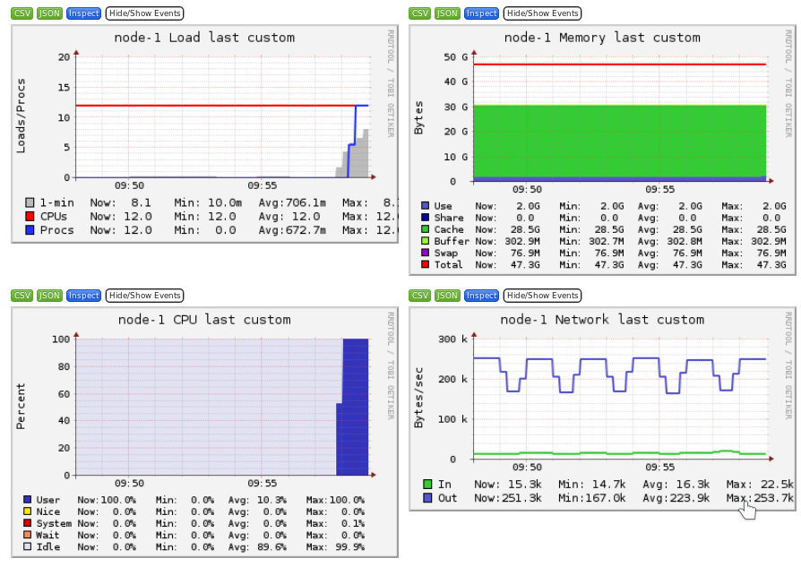
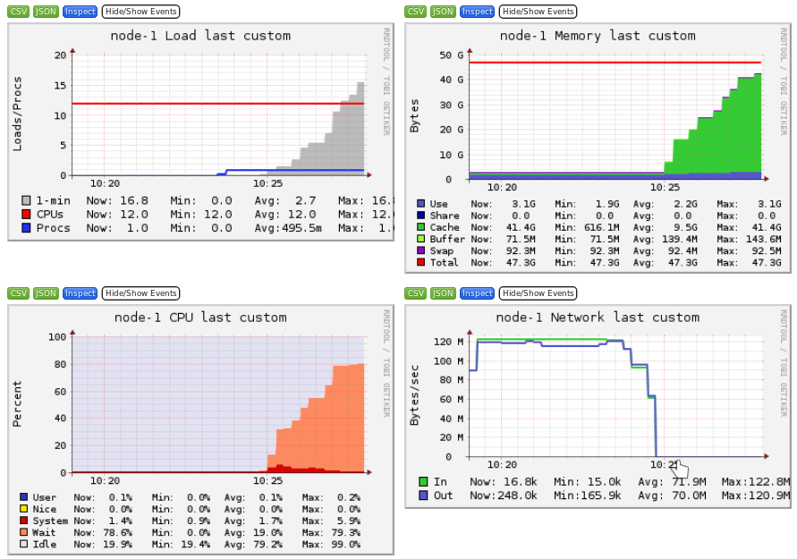
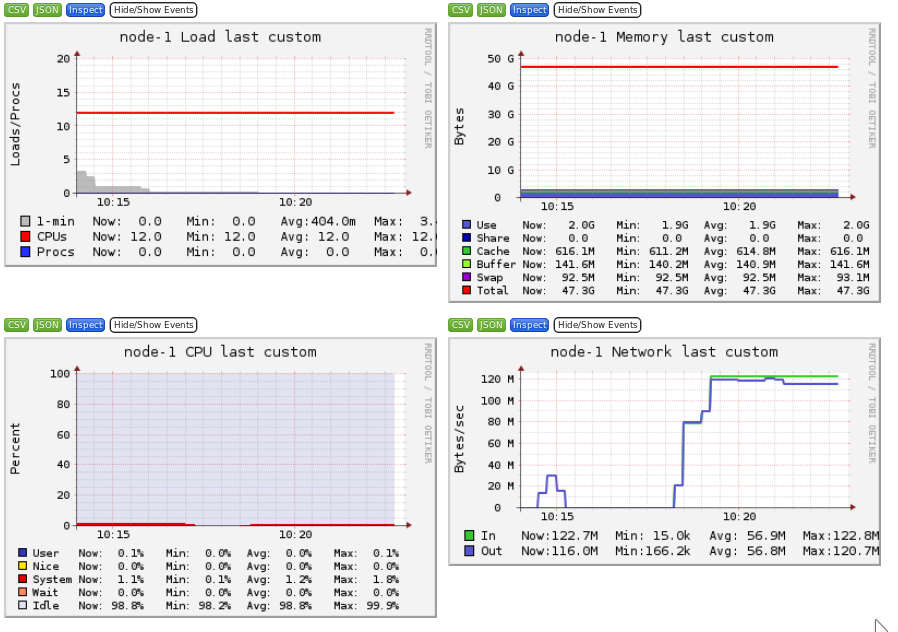
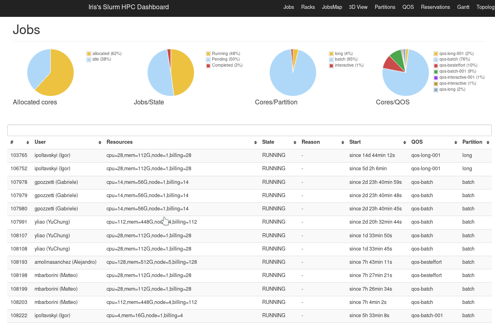

      

# Getting Started on the UL HPC platform

     Copyright (c) 2013-2021 UL HPC Team <hpc-sysadmins@uni.lu>

This tutorial will guide you through your first steps on the
[UL HPC platform](http://hpc.uni.lu).

Before proceeding:

* make sure you have an account (if not, follow [this procedure](https://hpc.uni.lu/get_an_account)), and an SSH client.
* take a look at the [quickstart guide](https://hpc.uni.lu/users/quickstart.html)
* ensure you operate from a Linux / Mac environment. Most commands below assumes running in a Terminal in this context. If you're running Windows, you can use MobaXterm, Putty tools etc. as described [on this page](https://hpc.uni.lu/users/docs/access/access_windows.html) yet it's probably better that you familiarize "natively" with Linux-based environment by having a Linux Virtual Machine (consider for that [VirtualBox](https://www.virtualbox.org/)) or [Windows Subsystem for Linux](https://docs.microsoft.com/en-us/windows/wsl/install-win10).

From a general perspective, the [Support page](https://hpc.uni.lu/users/docs/report_pbs.html) describes how to get help during your UL HPC usage.

**Convention**

In the below tutorial, you'll proposed terminal commands where the prompt is denoted by `$>`.

In general, we will prefix to precise the execution context (_i.e._ your laptop, a cluster access server or a node). Remember that `#` character is a comment. Example:

		# This is a comment
		$> hostname

		(laptop)$> hostname         # executed from your personal laptop / workstation

		(access-iris)$> hostname    # executed from access server of the Iris cluster

## Platform overview.

You can find a brief overview of the platform with key characterization numbers [on this page](https://hpc.uni.lu/systems/overview.html).

The general organization of each cluster is depicted below:

Details on this organization can be found [here](https://hpc.uni.lu/systems/clusters.html#clusters-organization)

## Discovering, visualizing and reserving UL HPC resources

In the following sections, replace `<login>` in the proposed commands with you login on the platform (ex: `svarrette`).

### Step 1: the working environment

* [reference documentation](http://hpc.uni.lu/users/docs/env.html)

After a successful login onto one of the access node (see [Cluster Access](https://hpc.uni.lu/users/docs/access.html)), you end into your personal homedir `$HOME` which is shared over GPFS between the access node and the computing nodes.

Otherwise, you have to be aware of at least two directories:

* `$HOME`: your home directory under NFS.
* `$SCRATCH`: a non-backed up area put if possible under Lustre for fast I/O operations

Your homedir is under a regular backup policy. Therefore you are asked to pay attention to your disk usage __and__ the number of files you store there.

* Estimate file space usage and summarize disk usage of each FILE, recursively for directories using the `ncdu` command:

		(access)$> ncdu

* You can get an overview of the quotas and your current disk usage with the following command:

		(access)$> df-ulhpc

* You shall also pay attention to the number of files in your home directory. You can count them as follows:

		(access)$> df-ulhpc -i

### Step 2: web monitoring interfaces

Each cluster offers a set of web services to monitor the platform usage:

#### [Ganglia](https://hpc.uni.lu/iris/ganglia/)

Ganglia is a scalable distributed monitoring system for high-performance computing systems such as clusters and Grids. Ganglia provides plots the system usage for each individual compute nodes (CPU, memory, I/O and network usage).

These information will help you identify and understand the behavior of your jobs on the cluster.

It is interesting to identify the limiting factor of your job:

* Memory

* CPU

* Storage I/O

* Network bound

This is covered in the other tutorial [Monitoring and profiling](https://ulhpc-tutorials.readthedocs.io/en/latest/basic/monitoring/)

#### [SLURM Web](https://access-iris.uni.lu/slurm/)

SLURM Web is a website that show the status of jobs and nodes with a nice graphical interface.

You can use the SLURM web interface for a visualization of the job scheduler state (list and gantt chart visualization).

### Sample Usage on the UL HPC platform: Kernel compilation

We will illustrate the usage of `tmux` by performing a compilation of a recent linux kernel.

* start a new tmux session

        (access)$> tmux

* rename the screen window "Frontend" (using `CTRL+b ,`)

* create a new window and rename it "Compile"
* within this new window, start a new interactive job over 1 node and 2 cores for 2 hours

		(access)$> si --time 2:00:0 -N 1 -c 2

* detach from this screen (using `CTRL+b d`)
* kill your current SSH connection and your terminal
* re-open your terminal and connect back to the cluster access server
* list your running tmux sessions:

		(access)$> tmux ls
		0: 1 windows (created Mon Nov 15 17:48:58 2021) [316x46]

* re-attach your previous screen session

		(access)$> tmux a        # OR tmux attach-session -t 0:

* in the "Compile" windows, go to the temporary directory and download the Linux kernel sources

		(node)$> cd /tmp/
		(node)$> curl -O https://cdn.kernel.org/pub/linux/kernel/v4.x/linux-4.19.163.tar.xz

   **IMPORTANT** to avoid overloading the **shared** file system with the many small files involves in the kernel compilation (_i.e._ NFS and/or Lustre), we will perform the compilation in the **local** file system, _i.e._ either in `/tmp` or (probably more efficient) in `/dev/shm` (_i.e_ in the RAM):

		(node)$> mkdir /dev/shm/PS1
		(node)$> cd /dev/shm/PS1
		(node)$> tar xf /tmp/linux-4.19.163.tar.xz
		(node)$> cd linux-4.19.163
		(node)$> make mrproper
		(node)$> make alldefconfig
		(node)$> make 2>&1 | tee /dev/shm/PS1/kernel_compile.log

* You can now detach from the tmux session and have a coffee

The last compilation command make use of `tee`, a nice tool which read from standard input and write to standard output _and_ files. This permits to save in a log file the message written in the standard output.

**Question: why using the `make 2>&1` sequence in the last command?**

**Question: why working in `/dev/shm` is more efficient?**

* Reattach from time to time to your tmux session to see the status of the compilation
* Your compilation is successful if it ends with the sequence:

		[...]
		Kernel: arch/x86/boot/bzImage is ready  (#2)

* Restart the compilation, this time using multiple cores and parallel jobs within the Makefile invocation (`-j` option of make)

		(node)$> make clean
		(node)$> time make -j $SLURM_CPUS_ON_NODE 2>&1 | tee /dev/shm/PS1/kernel_compile.2.log

The table below should convince you to always run `make` with the `-j` option whenever you can...

|   Context                          | time (`make`) | time (`make -j 16`) |
|------------------------------------|---------------|---------------------|
| Compilation in `/tmp`(HDD / chaos) | 4m6.656s      | 0m22.981s           |
| Compilation in `/tmp`(SSD / gaia)  | 3m52.895s     | 0m17.508s           |
| Compilation in `/dev/shm` (RAM)    | 3m11.649s     | 0m17.990s           |

* Use the [Ganglia](https://hpc.uni.lu/iris/ganglia/) interface to monitor the impact of the compilation process on the node your job is running on.
* Connect to your interactive job using the command `sjoin <jobid>`. Use the following system commands on the node during the compilation:

    * `htop`
    * `top`
    * `free -m`
    * `uptime`
    * `ps aux`

