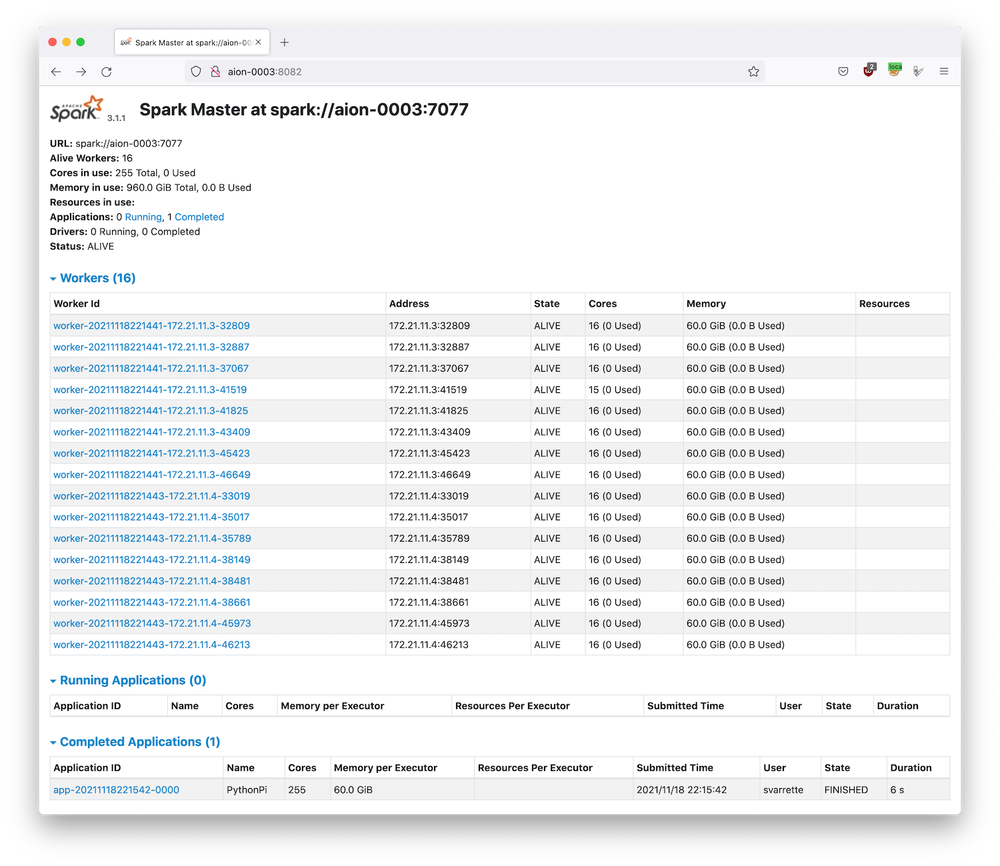

[](https://hpc.uni.lu) [](http://www.gnu.org/licenses/gpl-3.0.html) [](https://github.com/ULHPC/tutorials/issues/) [](https://github.com/ULHPC/tutorials/raw/devel/bigdata/slides.pdf) [](https://github.com/ULHPC/tutorials/tree/devel/bigdata/) [](http://ulhpc-tutorials.readthedocs.io/en/latest/bigdata/) [](https://github.com/ULHPC/tutorials)


# Big Data Applications (batch, stream, hybrid)

     Copyright (c) 2013-2021 UL HPC Team  <hpc-team@uni.lu>

[](https://github.com/ULHPC/tutorials/raw/devel/bigdata/slides.pdf)

The objective of this tutorial is to demonstrate how to build and run on top of the [UL HPC](https://hpc.uni.lu) platform a couple of reference analytics engine for large-scale Big Data processing, _i.e._ [Hadoop](http://hadoop.apache.org/), [Flink](http://flink.apache.org/) or  [Apache Spark](http://spark.apache.org/).


--------------------
## Pre-requisites ##

Ensure you are able to [connect to the UL HPC clusters](https://hpc-docs.uni.lu/connect/access/).
In particular, recall that the `module` command **is not** available on the access frontends. **For all tests and compilation, you MUST work on a computing node**

``` bash
(laptop)$ ssh aion-cluster  # or iris-cluster
```
Now you'll need to pull the latest changes in your working copy of the [ULHPC/tutorials](https://github.com/ULHPC/tutorials) you should have cloned in `~/git/github.com/ULHPC/tutorials` (see ["preliminaries" tutorial](../../preliminaries/))

``` bash
(access)$ cd ~/git/github.com/ULHPC/tutorials
(access)$ git pull
```

Now **configure a dedicated directory `~/tutorials/bigdata` for this session**

``` bash
# return to your home
(access)$> mkdir -p ~/tutorials/bigdata
(access)$> cd ~/tutorials/bigdata
# create a symbolic link to the reference material
(access)$> ln -s ~/git/github.com/ULHPC/tutorials/bigdata ref.d
# Prepare a couple of symbolic links that will be useful for the training
(access)$> ln -s ref.d/scripts .     # Don't forget trailing '.' means 'here'
(access)$> ln -s ref.d/settings .    # idem
(access)$> ln -s ref.d/src .         # idem
```

**Advanced users** (_eventually_ yet __strongly__ recommended), create a [Tmux](https://github.com/tmux/tmux/wiki) session (see [Tmux cheat sheet](https://tmuxcheatsheet.com/) and [tutorial](https://www.howtogeek.com/671422/how-to-use-tmux-on-linux-and-why-its-better-than-screen/)) or [GNU Screen](http://www.gnu.org/software/screen/) session you can recover later. See also ["Getting Started" tutorial ](../../beginners/).

### SOCKS 5 Proxy plugin (optional but VERY useful)

Many Big Data Analytics framework (including for the [Jupyter Notenooks](../python/advanced/jupyter/), the [Dask dashboard](../python/advanced/dask-ml/) etc.) involves a web interface (at the level of the master and/or the workers) you probably want to access in a relative transparent way.

Relying on SSH tunnels forwarding is of course one way opf proceeding, yet that's not the most convenient.
A more user-friendly approach consists in rely on a SOCKS proxy, which is basically an SSH tunnel in which specific applications forward their traffic down the tunnel to the server, and then on the server end, the proxy forwards the traffic out to the general Internet. Unlike a VPN, a SOCKS proxy has to be configured on an app by app basis on the client machine, but can be set up without any specialty client agents.

These steps were also described in the [Preliminaries](../preliminaries) tutorial.

__Setting Up the Tunnel__

To initiate such a SOCKS proxy using SSH (listening on `localhost:1080` for instance), you simply need to use the `-D 1080` command line option when connecting to the cluster:

```bash
(laptop)$> ssh -D 1080 -C iris-cluster
```

* `-D`: Tells SSH that we want a SOCKS tunnel on the specified port number (you can choose a number between 1025-65536)
* `-C`: Compresses the data before sending it

__Configuring Firefox to Use the Tunnel__: see [Preliminaries](../preliminaries) tutorial

We will see later on (in the section dedicated to Spark) how to effectively use this configuration.


---------------------------------
## Getting Started with Hadoop ##

Hadoop (2.10.0) is provided to you as a module:

```bash
module av Hadoop
module load tools/Hadoop
```

When doing that, the Hadoop distribution is installed in `$EBROOTHADOOP` (this is set by Easybuild for any loaded software.)

The below instructions are based on the [official tutorial](https://hadoop.apache.org/docs/r2.10.0/hadoop-project-dist/hadoop-common/SingleCluster.html).

#### Hadoop in Single mode

By default, Hadoop is configured to run in a non-distributed mode, as a single Java process. This is useful for debugging.

Let's test it

```bash
mkdir -p runs/hadoop/single/input
cd runs/hadoop/single
# Prepare input data
mkdir input
cp ${EBROOTHADOOP}/etc/hadoop/*.xml input
# Map-reduce grep <pattern> -- result is produced in output/
hadoop jar ${EBROOTHADOOP}/share/hadoop/mapreduce/hadoop-mapreduce-examples-2.10.0.jar grep input output 'dfs[a-z.]+'
[...]
        File System Counters
                FILE: Number of bytes read=1292102
                FILE: Number of bytes written=3190426
                FILE: Number of read operations=0
                FILE: Number of large read operations=0
                FILE: Number of write operations=0
        Map-Reduce Framework
                Map input records=1
                Map output records=1
                Map output bytes=17
                Map output materialized bytes=25
                Input split bytes=168
                Combine input records=0
                Combine output records=0
                Reduce input groups=1
                Reduce shuffle bytes=25
                Reduce input records=1
                Reduce output records=1
                Spilled Records=2
                Shuffled Maps =1
                Failed Shuffles=0
                Merged Map outputs=1
                GC time elapsed (ms)=5
                Total committed heap usage (bytes)=1019740160
        Shuffle Errors
                BAD_ID=0
                CONNECTION=0
                IO_ERROR=0
                WRONG_LENGTH=0
                WRONG_MAP=0
                WRONG_REDUCE=0
        File Input Format Counters
                Bytes Read=123
        File Output Format Counters
                Bytes Written=23
# Check the results on the local filesystem
$> cat output/*
1       dfsadmin
```

You can also view the output files on the distributed filesystem:

```
hdfs dfs -cat output/*
```

#### Pseudo-Distributed Operation

Hadoop can also be run on a single-node in a pseudo-distributed mode where each Hadoop daemon runs in a separate Java process.
Follow the [official tutorial](https://hadoop.apache.org/docs/r2.10.0/hadoop-project-dist/hadoop-common/SingleCluster.html#Pseudo-Distributed_Operation) to ensure you are running in **Single Node Cluster**

Once this is done, follow the [official Wordcount instructions](https://hadoop.apache.org/docs/r2.10.0/hadoop-mapreduce-client/hadoop-mapreduce-client-core/MapReduceTutorial.html#Example:_WordCount_v1.0)


```bash
 # Interactive job on 2 nodes:
 si -N 2 --ntasks-per-node 1 -c 16 -t 2:00:00
 ```

```bash
cd ~/tutorials/bigdata
# Pseudo-Distributed operation
mkdir -p run/shared/hadoop

```

#### Full cluster setup

Follow the official instructions of the [Cluster Setup](https://hadoop.apache.org/docs/r2.10.0/hadoop-project-dist/hadoop-common/ClusterSetup.html).

Once this is done, Repeat the execution of the [official Wordcount example](https://hadoop.apache.org/docs/r2.10.0/hadoop-mapreduce-client/hadoop-mapreduce-client-core/MapReduceTutorial.html#Example:_WordCount_v1.0).

------------------
## Apache Flink ##

[Apache Flink](https://flink.apache.org/) is a framework and distributed processing engine for stateful computations over unbounded and bounded data streams. Flink has been designed to run in all common cluster environments, perform computations at in-memory speed and at any scale.


Flink is available as a module:

``` bash
$ module load devel/Flink
```

Follow the [official Flink Hands-on training](https://nightlies.apache.org/flink/flink-docs-release-1.14/docs/learn-flink/overview/)
It should be fine in [standalone mode](https://nightlies.apache.org/flink/flink-docs-release-1.14/docs/deployment/resource-providers/standalone/overview/), yet to run Flink in a fully distributed fashion on top of a static (but possibly heterogeneous) [cluster](https://nightlies.apache.org/flink/flink-docs-release-1.14/docs/deployment/resource-providers/standalone/overview/#standalone-cluster-reference) requires more efforts.
For instance, you won't be able to start directly the `start-cluster.sh` script as the log settings (among other) need to be defined and inherit from the Slurm reservation.
This complex setup is illustrated with another very popular Big Data analytics framework: Spark.

-----------------------------------------------
## Big Data Analytics with Spark ##

The objective of this section is to compile and run on [Apache Spark](http://spark.apache.org/)  on top of the [UL HPC](https://hpc.uni.lu) platform.

[Apache Spark](http://spark.apache.org/docs/latest/) is a large-scale data processing engine that performs in-memory computing. Spark offers bindings in Java, Scala, Python and R for building parallel applications.
high-level APIs in Java, Scala, Python and R, and an optimized engine that supports general execution graphs. It also supports a rich set of higher-level tools including Spark SQL for SQL and structured data processing, MLlib for machine learning, GraphX for graph processing, and Spark Streaming.

As for Hadoop, we are first going to build Spark using Easybuild before performing some basic examples. More precisely, in this part, we will review the basic usage of Spark in two cases:

1. a single conffiguration where the classical interactive wrappers (`pyspark`, `scala` and `R` wrappers) will be reviewed.
2. a [Standalone](https://spark.apache.org/docs/latest/spark-standalone.html) cluster configuration - a simple cluster manager included with Spark that makes it easy to set up a cluster), where we will run the Pi estimation.

### Building a more recent version of Spark with Easybuild

[Spark](http://spark.apache.org/docs/latest/) is present as a module on the [ULHPC platform](https://hpc.uni.lu) **yet** it is a relatively old version (2.4.3).
So we are first going to install a newer version ([3.1.1(https://spark.apache.org/releases/spark-release-3-1-1.html)) using [EasyBuild](http://easybuild.readthedocs.io/).
For this reason, you should _first_ check the ["Using and Building (custom) software with EasyBuild on the UL HPC platform" tutorial](../tools/easybuild/). As mentioned at that occasion, when you're looking for a more recent version of a given software ([Spark](http://spark.apache.org/docs/latest/) here) than the one provided, you will typically search for the most recent version of Spark provided by Easybuild with `eb -S <pattern>`

 As it might be tricky to [guess the most appropriate version](https://hpc-docs.uni.lu/environment/modules/#ulhpc-toolchains-and-software-set-versioning), the script [`scripts/suggest-easyconfigs -v <version> <pattern>`](https://github.com/ULHPC/tutorials/blob/devel/tools/easybuild/scripts/suggest-easyconfigs) is provided

Let's do that with Spark

```bash
### Have an interactive job for the build
(access)$> cd ~/tutorials/bigdata
(access)$> si -c4
# properly configure Easybuild prefix and local build environment
$ cat settings/default.sh
$ source settings/default.sh
$ eb --version
$ echo $EASYBUILD_PREFIX
```

Now let's check the available easyconfigs for Spark:

```bash
$ eb -S Spark
# search for an exact match
$ ./scripts/suggest-easyconfigs -v ${RESIF_VERSION_PROD} Spark
=> Searching Easyconfigs matching pattern 'Spark'
Spark-1.3.0.eb
Spark-1.4.1.eb
Spark-1.5.0.eb
Spark-1.6.0.eb
Spark-1.6.1.eb
Spark-2.0.0.eb
Spark-2.0.2.eb
Spark-2.2.0-Hadoop-2.6-Java-1.8.0_144.eb
Spark-2.2.0-Hadoop-2.6-Java-1.8.0_152.eb
Spark-2.2.0-intel-2017b-Hadoop-2.6-Java-1.8.0_152-Python-3.6.3.eb
Spark-2.3.0-Hadoop-2.7-Java-1.8.0_162.eb
Spark-2.4.0-Hadoop-2.7-Java-1.8.eb
Spark-2.4.0-foss-2018b-Python-2.7.15.eb
Spark-2.4.0-intel-2018b-Hadoop-2.7-Java-1.8-Python-3.6.6.eb
Spark-2.4.0-intel-2018b-Python-2.7.15.eb
Spark-2.4.0-intel-2018b-Python-3.6.6.eb
Spark-2.4.5-intel-2019b-Python-3.7.4-Java-1.8.eb
Spark-3.0.0-foss-2018b-Python-2.7.15.eb
Spark-3.0.0-intel-2018b-Python-2.7.15.eb
Spark-3.1.1-fosscuda-2020b.eb
Spark-3.1.1-foss-2020a-Python-3.8.2.eb
Total: 21 entries

... potential exact match for 2020b toolchain
Spark-3.1.1-fosscuda-2020b.eb
 --> suggesting 'Spark-3.1.1-fosscuda-2020b.eb'
```

As can be seen, a GPU enabled version is proposed but won't be appropriate on Aion compute node.
In that case, you'll likely want to create and adapt an existing easyconfig -- see official [tutorial](https://easybuilders.github.io/easybuild-tutorial/2021-isc21/adding_support_additional_software/#writing-easyconfig-files). While out of scope in this session, here is how you would typically proceed:

* Copy the easyconfig file locally:
    - `eb --copy-ec Spark-3.1.1-fosscuda-2020b.eb Spark-3.1.1-foss-2020b.eb`
* (_eventually_) Rename the file to match the target version
    * Check on the website for the most up-to-date version of the software released
    * Adapt the filename of the copied easyconfig to match the target version / toolchain
* Edit the content of the easyconfig
   - You'll typically have to adapt the version of the dependencies (use again `scripts/suggest-easyconfigs -s  dep1 dep2 [...]`) and the checksum(s) of the source/patch files to match the static versions set for the target toolchain, enforce https urls etc.

You may have to repeat that process for the dependencies. And if you succeed, kindly do not forget to [submitting your easyconfig as pull requests (`--new-pr`)](https://easybuild.readthedocs.io/en/latest/Integration_with_GitHub.html#submitting-pull-requests-new-pr) to the Easybuild community.

To save some time, the appropriate easyconfigs file [`Spark-3.1.1-foss-2020b-Python-3.8.6.eb`](src/Spark-3.1.1-foss-2020b-Python-3.8.6.eb) (and its dependency [Apache Arrow](https://arrow.apache.org/)) that you can use to build __locally__ this application on top of the [UL HPC Software set](https://hpc-docs.uni.lu/environment/modules/) according to the recommended guidelines.

```bash
# If not done yet, properly configure Easybuild prefix and local build environment
$ source settings/default.sh
$ echo $EASYBUILD_PREFIX      # Check the format which must be:
#    <home>/.local/easybuild/<cluster>/<version>/epyc
```

Now you can build Spark from the provided easyconfigs -- the [`-r/--robot`](https://docs.easybuild.io/en/latest/Using_the_EasyBuild_command_line.html#searching-for-easyconfigs-the-robot-search-path) option control the robot search path for Easybuild (where to search for easyconfigs):

``` bash
# Dry-run: check the matched dependencies
$ eb src/Spark-3.1.1-foss-2020b-Python-3.8.6.eb -D -r src:   # <-- don't forget the trailing ':'
# only Arrow and Spark should noyt be checked
# Launch the build
$ eb src/Spark-3.1.1-foss-2020b-Python-3.8.6.eb -r src:
```
Installation will last ~8 minutes using a full Aion node (`-c 128`).
In general it is preferable to make builds within a screen session.

Once the build is completed, recall that it was installed under your homedir under `~/.local/easybuild/<cluster>/<version>/epyc` when the _default_ EASYBUILD_PREFIX target (for the sake of generality) to `~/.local/easybuild/`.
So if you want to access the installed module within another job, you'll need to load the settings `settings/default.sh` (to correct the values of the variables `EASYBUILD_PREFIX` and `LOCAL_MODULES` and invoke `mu`:

```bash
$ source settings/default.sh
$ mu    # shorcut for module use $LOCAL_MODULES
$ module av Spark   # Must display the build version (3.1.1)
```

### Interactive usage

Exit your reservation to reload one with the `--exclusive` flag to allocate an exclusive node -- it's better for big data analytics to dedicated full nodes (properly set).
Let's load the installed module:

```bash
(laptop)$ ssh aion-cluster
(access)$ si -c 128 --exclusive -t 2:00:00
$ source settings/default.sh   # See above remark
$ mu    # not required
$ module load devel/Spark/3.1.1
```

As in the [GNU Parallel tutorial](../sequential/gnu-parallel/), let's create a list of images from the [OpenImages V4 data set](https://storage.googleapis.com/openimages/web/download_v4.html).
A copy of this data set is available on the ULHPC facility, under `/work/projects/bigdata_sets/OpenImages_V4/`.
Let's create a CSV file which contains a random selection of 1000 training files within this dataset (prefixed by a line number).
You may want to do it as follows (**copy the full command**):

``` bash
#                                                       training set     select first 10K  random sort  take only top 10   prefix by line number      print to stdout AND in file
#                                                         ^^^^^^           ^^^^^^^^^^^^^   ^^^^^^^^     ^^^^^^^^^^^^^      ^^^^^^^^^^^^^^^^^^^^^^^^   ^^^^^^^^^^^^^^^^^^^^^^^^^^^^^^
$ find /work/projects/bigdata_sets/OpenImages_V4/train/ -print | head -n 10000 | sort -R   |  head -n 1000       | awk '{ print ++i","$0 }' | tee openimages_v4_filelist.csv
1,/work/projects/bigdata_sets/OpenImages_V4/train/6196380ea79283e0.jpg
2,/work/projects/bigdata_sets/OpenImages_V4/train/7f23f40740731c03.jpg
3,/work/projects/bigdata_sets/OpenImages_V4/train/dbfc1b37f45b3957.jpg
4,/work/projects/bigdata_sets/OpenImages_V4/train/f66087cdf8e172cd.jpg
5,/work/projects/bigdata_sets/OpenImages_V4/train/5efed414dd8b23d0.jpg
6,/work/projects/bigdata_sets/OpenImages_V4/train/1be054cb3021f6aa.jpg
7,/work/projects/bigdata_sets/OpenImages_V4/train/61446dee2ee9eb27.jpg
8,/work/projects/bigdata_sets/OpenImages_V4/train/dba2da75d899c3e7.jpg
9,/work/projects/bigdata_sets/OpenImages_V4/train/7ea06f092abc005e.jpg
10,/work/projects/bigdata_sets/OpenImages_V4/train/2db694eba4d4bb04.jpg
```

Download also another data files from Uber:

``` bash
curl -o src/uber.csv https://gitlab.com/rahasak-labs/dot/-/raw/master/src/main/resources/uber.csv
```

#### Pyspark

PySpark is the Spark Python API and exposes Spark Contexts to the Python programming environment.

```bash
$> pyspark
pyspark
Python 3.8.6 (default, Sep  3 2021, 01:03:58)
[GCC 10.2.0] on linux
Type "help", "copyright", "credits" or "license" for more information.
Using Spark's default log4j profile: org/apache/spark/log4j-defaults.properties
Setting default log level to "WARN".
To adjust logging level use sc.setLogLevel(newLevel). For SparkR, use setLogLevel(newLevel).
Welcome to
      ____              __
     / __/__  ___ _____/ /__
    _\ \/ _ \/ _ `/ __/  '_/
   /__ / .__/\_,_/_/ /_/\_\   version 3.1.1
      /_/

Using Python version 3.8.6 (default, Sep  3 2021 01:03:58)
Spark context Web UI available at http://aion-84.aion-cluster.uni.lux:4040
Spark context available as 'sc' (master = local[*], app id = local-1637268453800).
SparkSession available as 'spark'.
>>>
```

See [this tutorial](https://realpython.com/pyspark-intro/) for playing with pyspark.

In particular, play with the build-in `filter()`, `map()`, and `reduce()` functions which are all common in functional programming.

``` python
>>> txt = sc.textFile('file:////home/users/svarrette/tutorials/bigdata/openimages_v4_filelist.csv')
>>> print(txt.count())
1000
>>> txt2 = sc.textFile('file:////home/users/svarrette/tutorials/bigdata/src/uber.csv')
>>> print(txt2.count())
652436
>>> python_lines = txt.filter(lambda line: 'python' in line.lower())
>>> print(python_lines.count())
6
>>> big_list = range(10000)
>>> rdd = sc.parallelize(big_list, 2)
>>> odds = rdd.filter(lambda x: x % 2 != 0)
>>> odds.take(5)
[1, 3, 5, 7, 9]
```


####  Scala Spark Shell

Spark includes a modified version of the Scala shell that can be used interactively.
Instead of running `pyspark` above, run the `spark-shell` command:

```bash
$> spark-shell
Using Spark's default log4j profile: org/apache/spark/log4j-defaults.properties
Setting default log level to "WARN".
To adjust logging level use sc.setLogLevel(newLevel). For SparkR, use setLogLevel(newLevel).
Spark context Web UI available at http://aion-1.aion-cluster.uni.lux:4040
Spark context available as 'sc' (master = local[*], app id = local-1637272004201).
Spark session available as 'spark'.
Welcome to
      ____              __
     / __/__  ___ _____/ /__
    _\ \/ _ \/ _ `/ __/  '_/
   /___/ .__/\_,_/_/ /_/\_\   version 3.1.1
      /_/

Using Scala version 2.12.10 (OpenJDK 64-Bit Server VM, Java 11.0.2)
Type in expressions to have them evaluated.
Type :help for more information.

scala>
```

#### R Spark Shell

The Spark R API is still experimental. Only a subset of the R API is available -- See the [SparkR Documentation](https://spark.apache.org/docs/latest/sparkr.html).
Since this tutorial does not cover R, we are not going to use it.


## Running Spark in standalone cluster

* [Reference Documentation](https://spark.apache.org/docs/latest/cluster-overview.html)

Spark applications run as independent sets of processes on a cluster, coordinated by the SparkContext object in your main program (called the driver program).

Specifically, to run on a cluster, the SparkContext can connect to several types of cluster managers (either Spark’s own standalone cluster manager, Mesos or YARN), which allocate resources across applications. Once connected, Spark acquires executors on nodes in the cluster, which are processes that run computations and store data for your application. Next, it sends your application code (defined by JAR or Python files passed to SparkContext) to the executors. Finally, SparkContext sends tasks to the executors to run.


There are several useful things to note about this architecture:

1. Each application gets its own executor processes, which stay up for the duration of the whole application and run tasks in multiple threads. This has the benefit of isolating applications from each other, on both the scheduling side (each driver schedules its own tasks) and executor side (tasks from different applications run in different JVMs). However, it also means that data cannot be shared across different Spark applications (instances of SparkContext) without writing it to an external storage system.
2. Spark is agnostic to the underlying cluster manager. As long as it can acquire executor processes, and these communicate with each other, it is relatively easy to run it even on a cluster manager that also supports other applications (e.g. Mesos/YARN).
3. The driver program must listen for and accept incoming connections from its executors throughout its lifetime (e.g., see spark.driver.port in the network config section). As such, the driver program must be network addressable from the worker nodes.
4. Because the driver schedules tasks on the cluster, it should be run close to the worker nodes, preferably on the same local area network. If you'd like to send requests to the cluster remotely, it's better to open an RPC to the driver and have it submit operations from nearby than to run a driver far away from the worker nodes.

**Cluster Manager**

Spark currently supports three cluster managers:

* [Standalone](https://spark.apache.org/docs/latest/spark-standalone.html) – a simple cluster manager included with Spark that makes it easy to set up a cluster.
* [Apache Mesos](https://spark.apache.org/docs/latest/running-on-mesos.html) – a general cluster manager that can also run Hadoop MapReduce and service applications.
* [Hadoop YARN](https://spark.apache.org/docs/latest/running-on-mesos.html) – the resource manager in Hadoop 2.

In this session, we will deploy a **standalone cluster**, which consists of performing the following workflow (with the objective to prepare a launcher script):

1. create a master and the workers. Check the web interface of the master.
2. submit a spark application to the cluster using the `spark-submit` script
3. Let the application run and collect the result
4. stop the cluster at the end.

To facilitate these steps, Spark comes with a couple of scripts you can use to launch or stop your cluster, based on Hadoop's deploy scripts, and available in `$EBROOTSPARK/sbin`:

| Script                 | Description                                                                             |
|------------------------|------------------------------------------------------------------------------|
| `sbin/start-master.sh` | Starts a master instance on the machine the script is executed on.           |
| `sbin/start-slaves.sh` | Starts a slave instance on each machine specified in the conf/slaves file.   |
| `sbin/start-slave.sh`  | Starts a slave instance on the machine the script is executed on.            |
| `sbin/start-all.sh`    | Starts both a master and a number of slaves as described above.              |
| `sbin/stop-master.sh`  | Stops the master that was started via the bin/start-master.sh script.        |
| `sbin/stop-slaves.sh`  | Stops all slave instances on the machines specified in the conf/slaves file. |
| `sbin/stop-all.sh`     | Stops both the master and the slaves as described above.                     |

Yet the ULHPC team has designed a dedicated launcher script `./scripts/launcher.Spark.sh` that exploits these script to quickly deploy and in a flexible way a Spark cluster over the resources allocated by slurm.

Quit your previous job - eventually detach from your screen session
Ensure that you have connected by SSH to the cluster by opening an SOCKS proxy:

```
(laptop)$> ssh -D 1080 -C aion-cluster
```

Then make a new reservation across multiple full nodes:

```bash
# If not yet done, go to the appropriate directory
$ cd ~/tutorials/bigdata
# Play with -N to scale as you wish (or not) - below allocation is optimizing Aion compute nodes
#              on iris: use '-N <N> --ntasks-per-node 2 -c 14'
# You'll likely need to reserve less nodes to satisfy all demands ;(
$ salloc -N 2 --ntasks-per-node 8 -c 16 --exclusive # --reservation=hpcschool
$ source settings/default.sh
$ module load devel/Spark
# Deploy an interactive Spark cluster **ACROSS** all reserved nodes
$ ./scripts/launcher.Spark.sh -i
SLURM_JOBID  = 64441
SLURM_JOB_NODELIST = aion-[0003-0004]
SLURM_NNODES = 2
SLURM_NTASK  = 16
Submission directory = /mnt/irisgpfs/users/svarrette/tutorials/bigdata
starting org.apache.spark.deploy.master.Master, logging to /home/users/svarrette/.spark/logs/spark-64441-org.apache.spark.deploy.master.Master-1-aion-0001.out
==========================================
============== Spark Master ==============
==========================================
url: spark://aion-0003:7077
Web UI: http://aion-0003:8082

===========================================
============ 16 Spark Workers ==============
===========================================
export SPARK_HOME=$EBROOTSPARK
export MASTER_URL=spark://aion-0003:7077
export SPARK_DAEMON_MEMORY=4096m
export SPARK_WORKER_CORES=16
export SPARK_WORKER_MEMORY=61440m
export SPARK_EXECUTOR_MEMORY=61440m

 - create slave launcher script '/home/users/svarrette/.spark/worker/spark-start-slaves-64441.sh'
==========================================
        *** Interactive mode ***
==========================================
Ex of submission command:
    module load devel/Spark
    export SPARK_HOME=$EBROOTSPARK
    spark-submit \
        --master spark://$(scontrol show hostname $SLURM_NODELIST | head -n 1):7077 \
        --conf spark.driver.memory=${SPARK_DAEMON_MEMORY} \
        --conf spark.executor.memory=${SPARK_EXECUTOR_MEMORY} \
        --conf spark.python.worker.memory=${SPARK_WORKER_MEMORY} \
        $SPARK_HOME/examples/src/main/python/pi.py 1000
```

As we are in interactive mode (`-i` option of the launcher script), copy/paste the export commands mentioned by the command to have them defined in your shell -- **DO NOT COPY the above output but the one obtained on your side when launching the script**.

You can transparently access the Web UI (master web portal, on `http://<IP>:8082`) using a SOCKS 5 Proxy Approach.
Recall that this is possible as soon you have initiated an SSH connection with `-D 1080` flag option to open on the local port 1080:

```
(laptop)$> ssh -D 1080 -C aion-cluster
```

Now, enable the `ULHPC proxy` setting from [Foxy Proxy](https://getfoxyproxy.org/order/?src=FoxyProxyForFirefox)
extension (Firefox recommended) and access **transparently** the Web UI of the master process by entering the provided URL `http://aion-<N>:8082` -- if you haven't enabled the _remote_ DNS resolution, you will need to enter the url  `http://172.21.XX.YY:8082/` (adapt the IP).

It is worth to note that:

* The **memory in use exceed the capacity of a single node**, demonstrated if needed the scalability of the proposed setup
* The number of workers (and each of their memory) is **automatically** defined by the way you have request your jobs (`-N 2 --ntasks-per-node 8` in this case).
*  Each worker is **multithreaded** and execute on 16 cores, except one which has 1 less core (thread) available (15) than the others -- note that this value is also automatically inherited by the slurm reservation (`-c 16` in this case).
    - 1 core is indeed reserved for the master process.

As suggested, you can submit a Spark jobs to your freshly deployed cluster with `spark-submit`:

``` bash
spark-submit \
        --master spark://$(scontrol show hostname $SLURM_NODELIST | head -n 1):7077 \
        --conf spark.driver.memory=${SPARK_DAEMON_MEMORY} \
        --conf spark.executor.memory=${SPARK_EXECUTOR_MEMORY} \
        --conf spark.python.worker.memory=${SPARK_WORKER_MEMORY} \
        $SPARK_HOME/examples/src/main/python/pi.py 1000
```

And check the effect on the master portal.
At the end, you should have a report of the Completed application as in the below screenshot.



When you have finished, don't forget to close your tunnel and disable FoxyProxy
on your browser.


__Passive jobs examples:__

```bash
$> sbatch ./launcher.Spark.sh
[...]
```

Once finished, you can check the result of the default application submitted (in `result_${SLURM_JOB_NAME}-${SLURM_JOB_ID}.out`).

```bash
$> cat result_${SLURM_JOB_NAME}-${SLURM_JOB_ID}.out
Pi is roughly 3.141420
```

In case of problems, you can check the logs of the daemons in `~/.spark/logs/`

__Further Reading__

You can find on the Internet many resources for expanding your HPC experience
with Spark. Here are some links you might find useful to go further:

* [Using Spark with GPFS on the ACCRE Cluster](https://bigdata-vandy.github.io/using-spark-with-gpfs/)
* [ARIS notes on Spark](http://doc.aris.grnet.gr/software/spark/)
