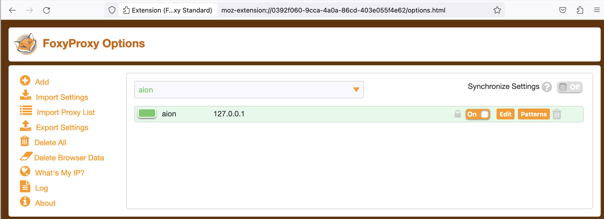
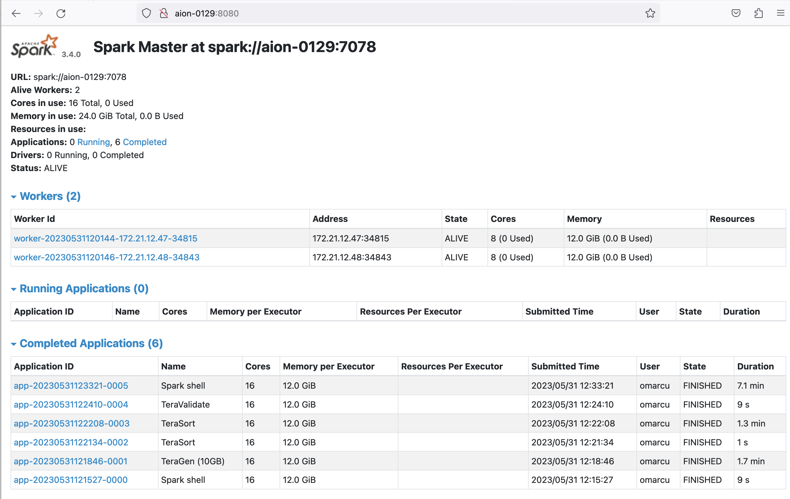

[](https://hpc.uni.lu) [](http://www.gnu.org/licenses/gpl-3.0.html) [](https://github.com/ULHPC/tutorials/issues/) [](https://github.com/ULHPC/tutorials/raw/devel/bigdata/slides.pdf) [](https://github.com/ULHPC/tutorials/tree/devel/bigdata/) [](http://ulhpc-tutorials.readthedocs.io/en/latest/bigdata/) [](https://github.com/ULHPC/tutorials)


# Big Data Applications (batch, stream, hybrid)

     Copyright (c) 2013-2021 S. Varrette and UL HPC Team  <hpc-team@uni.lu>

[](https://github.com/ULHPC/tutorials/raw/devel/bigdata/slides.pdf)

The objective of this tutorial is to demonstrate how to build and run on top of the [UL HPC](https://hpc.uni.lu) platform a couple of reference analytics engine for large-scale Big Data processing, _i.e._ [Hadoop](http://hadoop.apache.org/), [Flink](http://flink.apache.org/) or  [Apache Spark](http://spark.apache.org/).


--------------------
## Pre-requisites ##

Ensure you are able to [connect to the UL HPC clusters](https://hpc-docs.uni.lu/connect/access/).
In particular, recall that the `module` command **is not** available on the access frontends. **For all tests and compilation, you MUST work on a computing node**

``` bash
(laptop)$ ssh aion-cluster  # or iris-cluster
```
Now you'll need to pull the latest changes in your working copy of the [ULHPC/tutorials](https://github.com/ULHPC/tutorials) you should have cloned in `~/git/github.com/ULHPC/tutorials` (see ["preliminaries" tutorial](../../preliminaries/))

``` bash
(access)$ cd ~/git/github.com/ULHPC/tutorials
(access)$ git pull
```

Now **configure a dedicated directory `~/tutorials/bigdata` for this session**

``` bash
# return to your home
(access)$> mkdir -p ~/tutorials/bigdata
(access)$> cd ~/tutorials/bigdata
# create a symbolic link to the reference material
(access)$> ln -s ~/git/github.com/ULHPC/tutorials/bigdata ref.d
# Prepare a couple of symbolic links that will be useful for the training
(access)$> ln -s ref.d/scripts .     # Don't forget trailing '.' means 'here'
(access)$> ln -s ref.d/settings .    # idem
(access)$> ln -s ref.d/src .         # idem
```

**Advanced users** (_eventually_ yet __strongly__ recommended), create a [Tmux](https://github.com/tmux/tmux/wiki) session (see [Tmux cheat sheet](https://tmuxcheatsheet.com/) and [tutorial](https://www.howtogeek.com/671422/how-to-use-tmux-on-linux-and-why-its-better-than-screen/)) or [GNU Screen](http://www.gnu.org/software/screen/) session you can recover later. See also ["Getting Started" tutorial ](../../beginners/).

### SOCKS 5 Proxy plugin (optional but VERY useful)

Many Big Data Analytics framework (including for the [Jupyter Notenooks](../python/advanced/jupyter/), the [Dask dashboard](../python/advanced/dask-ml/) etc.) involves a web interface (at the level of the master and/or the workers) you probably want to access in a relative transparent way.

Relying on SSH tunnels forwarding is of course one way opf proceeding, yet that's not the most convenient.
A more user-friendly approach consists in rely on a SOCKS proxy, which is basically an SSH tunnel in which specific applications forward their traffic down the tunnel to the server, and then on the server end, the proxy forwards the traffic out to the general Internet. Unlike a VPN, a SOCKS proxy has to be configured on an app by app basis on the client machine, but can be set up without any specialty client agents.

These steps were also described in the [Preliminaries](../preliminaries) tutorial.

__Setting Up the Tunnel__

To initiate such a SOCKS proxy using SSH (listening on `localhost:1080` for instance), you simply need to use the `-D 1080` command line option when connecting to the cluster:

```bash
(laptop)$> ssh -D 1080 -C iris-cluster
```

* `-D`: Tells SSH that we want a SOCKS tunnel on the specified port number (you can choose a number between 1025-65536)
* `-C`: Compresses the data before sending it

__Configuring Firefox to Use the Tunnel__: see [Preliminaries](../preliminaries) tutorial

We will see later on (in the section dedicated to Spark) how to effectively use this configuration.


---------------------------------
## Getting Started with Hadoop ##

Hadoop (2.10.0) is provided to you as a module:

```bash
module av Hadoop
module load tools/Hadoop
```

When doing that, the Hadoop distribution is installed in `$EBROOTHADOOP` (this is set by Easybuild for any loaded software.)

The below instructions are based on the [official tutorial](https://hadoop.apache.org/docs/r2.10.0/hadoop-project-dist/hadoop-common/SingleCluster.html).

#### Hadoop in Single mode

By default, Hadoop is configured to run in a non-distributed mode, as a single Java process. This is useful for debugging.

Let's test it

```bash
mkdir -p runs/hadoop/single/input
cd runs/hadoop/single
# Prepare input data
mkdir input
cp ${EBROOTHADOOP}/etc/hadoop/*.xml input
# Map-reduce grep <pattern> -- result is produced in output/
hadoop jar ${EBROOTHADOOP}/share/hadoop/mapreduce/hadoop-mapreduce-examples-2.10.0.jar grep input output 'dfs[a-z.]+'
[...]
        File System Counters
                FILE: Number of bytes read=1292102
                FILE: Number of bytes written=3190426
                FILE: Number of read operations=0
                FILE: Number of large read operations=0
                FILE: Number of write operations=0
        Map-Reduce Framework
                Map input records=1
                Map output records=1
                Map output bytes=17
                Map output materialized bytes=25
                Input split bytes=168
                Combine input records=0
                Combine output records=0
                Reduce input groups=1
                Reduce shuffle bytes=25
                Reduce input records=1
                Reduce output records=1
                Spilled Records=2
                Shuffled Maps =1
                Failed Shuffles=0
                Merged Map outputs=1
                GC time elapsed (ms)=5
                Total committed heap usage (bytes)=1019740160
        Shuffle Errors
                BAD_ID=0
                CONNECTION=0
                IO_ERROR=0
                WRONG_LENGTH=0
                WRONG_MAP=0
                WRONG_REDUCE=0
        File Input Format Counters
                Bytes Read=123
        File Output Format Counters
                Bytes Written=23
# Check the results on the local filesystem
$> cat output/*
1       dfsadmin
```

You can also view the output files on the distributed filesystem:

```
hdfs dfs -cat output/*
```

#### Pseudo-Distributed Operation

Hadoop can also be run on a single-node in a pseudo-distributed mode where each Hadoop daemon runs in a separate Java process.
Follow the [official tutorial](https://hadoop.apache.org/docs/r2.10.0/hadoop-project-dist/hadoop-common/SingleCluster.html#Pseudo-Distributed_Operation) to ensure you are running in **Single Node Cluster**

Once this is done, follow the [official Wordcount instructions](https://hadoop.apache.org/docs/r2.10.0/hadoop-mapreduce-client/hadoop-mapreduce-client-core/MapReduceTutorial.html#Example:_WordCount_v1.0)


```bash
 # Interactive job on 2 nodes:
 si -N 2 --ntasks-per-node 1 -c 16 -t 2:00:00
 ```

```bash
cd ~/tutorials/bigdata
# Pseudo-Distributed operation
mkdir -p run/shared/hadoop

```

#### Full cluster setup

Follow the official instructions of the [Cluster Setup](https://hadoop.apache.org/docs/r2.10.0/hadoop-project-dist/hadoop-common/ClusterSetup.html).

Once this is done, Repeat the execution of the [official Wordcount example](https://hadoop.apache.org/docs/r2.10.0/hadoop-mapreduce-client/hadoop-mapreduce-client-core/MapReduceTutorial.html#Example:_WordCount_v1.0).

------------------
## Apache Flink ##

[Apache Flink](https://flink.apache.org/) is a framework and distributed processing engine for stateful computations over unbounded and bounded data streams. Flink has been designed to run in all common cluster environments, perform computations at in-memory speed and at any scale.


Flink is available as a module:

``` bash
$ module load devel/Flink
```

Follow the [official Flink Hands-on training](https://nightlies.apache.org/flink/flink-docs-release-1.14/docs/learn-flink/overview/)
It should be fine in [standalone mode](https://nightlies.apache.org/flink/flink-docs-release-1.14/docs/deployment/resource-providers/standalone/overview/), yet to run Flink in a fully distributed fashion on top of a static (but possibly heterogeneous) [cluster](https://nightlies.apache.org/flink/flink-docs-release-1.14/docs/deployment/resource-providers/standalone/overview/#standalone-cluster-reference) requires more efforts.
For instance, you won't be able to start directly the `start-cluster.sh` script as the log settings (among other) need to be defined and inherit from the Slurm reservation.
This complex setup is illustrated with another very popular Big Data analytics framework: Spark.

-----------------------------------------------
## Big Data Analytics with Spark ##

The objective of this section is to compile and run on [Apache Spark](http://spark.apache.org/)  on top of the [UL HPC](https://hpc.uni.lu) platform.

[Apache Spark](http://spark.apache.org/docs/latest/) is a large-scale data processing engine that performs in-memory computing. Spark offers bindings in Java, Scala, Python and R for building parallel applications.
high-level APIs in Java, Scala, Python and R, and an optimized engine that supports general execution graphs. It also supports a rich set of higher-level tools including Spark SQL for SQL and structured data processing, MLlib for machine learning, GraphX for graph processing, and Spark Streaming.

As for Hadoop, we are first going to build Spark using Easybuild before performing some basic examples. More precisely, in this part, we will review the basic usage of Spark in two cases:

1. a single conffiguration where the classical interactive wrappers (`pyspark`, `scala` and `R` wrappers) will be reviewed.
2. a [Standalone](https://spark.apache.org/docs/latest/spark-standalone.html) cluster configuration - a simple cluster manager included with Spark that makes it easy to set up a cluster), where we will run the Pi estimation.

### Building a more recent version of Spark with Easybuild

[Spark](http://spark.apache.org/docs/latest/) is present as a module on the [ULHPC platform](https://hpc.uni.lu) **yet** it is a relatively old version (2.4.3).
So we are first going to install a newer version ([3.1.1(https://spark.apache.org/releases/spark-release-3-1-1.html)) using [EasyBuild](http://easybuild.readthedocs.io/).
For this reason, you should _first_ check the ["Using and Building (custom) software with EasyBuild on the UL HPC platform" tutorial](../tools/easybuild/). As mentioned at that occasion, when you're looking for a more recent version of a given software ([Spark](http://spark.apache.org/docs/latest/) here) than the one provided, you will typically search for the most recent version of Spark provided by Easybuild with `eb -S <pattern>`

 As it might be tricky to [guess the most appropriate version](https://hpc-docs.uni.lu/environment/modules/#ulhpc-toolchains-and-software-set-versioning), the script [`scripts/suggest-easyconfigs -v <version> <pattern>`](https://github.com/ULHPC/tutorials/blob/devel/tools/easybuild/scripts/suggest-easyconfigs) is provided

Let's do that with Spark

```bash
### Have an interactive job for the build
(access)$> cd ~/tutorials/bigdata
(access)$> si -c4
# properly configure Easybuild prefix and local build environment
$ cat settings/default.sh
$ source settings/default.sh
$ eb --version
$ echo $EASYBUILD_PREFIX
```

Now let's check the available easyconfigs for Spark:

```bash
$ eb -S Spark
# search for an exact match
$ ./scripts/suggest-easyconfigs -v ${RESIF_VERSION_PROD} Spark
=> Searching Easyconfigs matching pattern 'Spark'
Spark-1.3.0.eb
Spark-1.4.1.eb
Spark-1.5.0.eb
Spark-1.6.0.eb
Spark-1.6.1.eb
Spark-2.0.0.eb
Spark-2.0.2.eb
Spark-2.2.0-Hadoop-2.6-Java-1.8.0_144.eb
Spark-2.2.0-Hadoop-2.6-Java-1.8.0_152.eb
Spark-2.2.0-intel-2017b-Hadoop-2.6-Java-1.8.0_152-Python-3.6.3.eb
Spark-2.3.0-Hadoop-2.7-Java-1.8.0_162.eb
Spark-2.4.0-Hadoop-2.7-Java-1.8.eb
Spark-2.4.0-foss-2018b-Python-2.7.15.eb
Spark-2.4.0-intel-2018b-Hadoop-2.7-Java-1.8-Python-3.6.6.eb
Spark-2.4.0-intel-2018b-Python-2.7.15.eb
Spark-2.4.0-intel-2018b-Python-3.6.6.eb
Spark-2.4.5-intel-2019b-Python-3.7.4-Java-1.8.eb
Spark-3.0.0-foss-2018b-Python-2.7.15.eb
Spark-3.0.0-intel-2018b-Python-2.7.15.eb
Spark-3.1.1-fosscuda-2020b.eb
Spark-3.1.1-foss-2020a-Python-3.8.2.eb
Total: 21 entries

... potential exact match for 2020b toolchain
Spark-3.1.1-fosscuda-2020b.eb
 --> suggesting 'Spark-3.1.1-fosscuda-2020b.eb'
```

As can be seen, a GPU enabled version is proposed but won't be appropriate on Aion compute node.
In that case, you'll likely want to create and adapt an existing easyconfig -- see official [tutorial](https://easybuilders.github.io/easybuild-tutorial/2021-isc21/adding_support_additional_software/#writing-easyconfig-files). While out of scope in this session, here is how you would typically proceed:

* Copy the easyconfig file locally:
    - `eb --copy-ec Spark-3.1.1-fosscuda-2020b.eb Spark-3.1.1-foss-2020b.eb`
* (_eventually_) Rename the file to match the target version
    * Check on the website for the most up-to-date version of the software released
    * Adapt the filename of the copied easyconfig to match the target version / toolchain
* Edit the content of the easyconfig
   - You'll typically have to adapt the version of the dependencies (use again `scripts/suggest-easyconfigs -s  dep1 dep2 [...]`) and the checksum(s) of the source/patch files to match the static versions set for the target toolchain, enforce https urls etc.

You may have to repeat that process for the dependencies. And if you succeed, kindly do not forget to [submitting your easyconfig as pull requests (`--new-pr`)](https://easybuild.readthedocs.io/en/latest/Integration_with_GitHub.html#submitting-pull-requests-new-pr) to the Easybuild community.

To save some time, the appropriate easyconfigs file [`Spark-3.1.1-foss-2020b-Python-3.8.6.eb`](src/Spark-3.1.1-foss-2020b-Python-3.8.6.eb) (and its dependency [Apache Arrow](https://arrow.apache.org/)) that you can use to build __locally__ this application on top of the [UL HPC Software set](https://hpc-docs.uni.lu/environment/modules/) according to the recommended guidelines.

```bash
# If not done yet, properly configure Easybuild prefix and local build environment
$ source settings/default.sh
$ echo $EASYBUILD_PREFIX      # Check the format which must be:
#    <home>/.local/easybuild/<cluster>/<version>/epyc
```

Now you can build Spark from the provided easyconfigs -- the [`-r/--robot`](https://docs.easybuild.io/en/latest/Using_the_EasyBuild_command_line.html#searching-for-easyconfigs-the-robot-search-path) option control the robot search path for Easybuild (where to search for easyconfigs):

``` bash
# Dry-run: check the matched dependencies
$ eb src/Spark-3.1.1-foss-2020b-Python-3.8.6.eb -D -r src:   # <-- don't forget the trailing ':'
# only Arrow and Spark should noyt be checked
# Launch the build
$ eb src/Spark-3.1.1-foss-2020b-Python-3.8.6.eb -r src:
```
Installation will last ~8 minutes using a full Aion node (`-c 128`).
In general it is preferable to make builds within a screen session.

Once the build is completed, recall that it was installed under your homedir under `~/.local/easybuild/<cluster>/<version>/epyc` when the _default_ EASYBUILD_PREFIX target (for the sake of generality) to `~/.local/easybuild/`.
So if you want to access the installed module within another job, you'll need to load the settings `settings/default.sh` (to correct the values of the variables `EASYBUILD_PREFIX` and `LOCAL_MODULES` and invoke `mu`:

```bash
$ source settings/default.sh
$ mu    # shorcut for module use $LOCAL_MODULES
$ module av Spark   # Must display the build version (3.1.1)
```

### Interactive usage

Exit your reservation to reload one with the `--exclusive` flag to allocate an exclusive node -- it's better for big data analytics to dedicated full nodes (properly set).
Let's load the installed module:

```bash
(laptop)$ ssh aion-cluster
(access)$ si -c 128 --exclusive -t 2:00:00
$ source settings/default.sh   # See above remark
$ mu    # not required
$ module load devel/Spark/3.1.1
```

As in the [GNU Parallel tutorial](../sequential/gnu-parallel/), let's create a list of images from the [OpenImages V4 data set](https://storage.googleapis.com/openimages/web/download_v4.html).
A copy of this data set is available on the ULHPC facility, under `/work/projects/bigdata_sets/OpenImages_V4/`.
Let's create a CSV file which contains a random selection of 1000 training files within this dataset (prefixed by a line number).
You may want to do it as follows (**copy the full command**):

``` bash
#                                                       training set     select first 10K  random sort  take only top 10   prefix by line number      print to stdout AND in file
#                                                         ^^^^^^           ^^^^^^^^^^^^^   ^^^^^^^^     ^^^^^^^^^^^^^      ^^^^^^^^^^^^^^^^^^^^^^^^   ^^^^^^^^^^^^^^^^^^^^^^^^^^^^^^
$ find /work/projects/bigdata_sets/OpenImages_V4/train/ -print | head -n 10000 | sort -R   |  head -n 1000       | awk '{ print ++i","$0 }' | tee openimages_v4_filelist.csv
1,/work/projects/bigdata_sets/OpenImages_V4/train/6196380ea79283e0.jpg
2,/work/projects/bigdata_sets/OpenImages_V4/train/7f23f40740731c03.jpg
3,/work/projects/bigdata_sets/OpenImages_V4/train/dbfc1b37f45b3957.jpg
4,/work/projects/bigdata_sets/OpenImages_V4/train/f66087cdf8e172cd.jpg
5,/work/projects/bigdata_sets/OpenImages_V4/train/5efed414dd8b23d0.jpg
6,/work/projects/bigdata_sets/OpenImages_V4/train/1be054cb3021f6aa.jpg
7,/work/projects/bigdata_sets/OpenImages_V4/train/61446dee2ee9eb27.jpg
8,/work/projects/bigdata_sets/OpenImages_V4/train/dba2da75d899c3e7.jpg
9,/work/projects/bigdata_sets/OpenImages_V4/train/7ea06f092abc005e.jpg
10,/work/projects/bigdata_sets/OpenImages_V4/train/2db694eba4d4bb04.jpg
```

Download also another data files from Uber:

``` bash
curl -o src/uber.csv https://gitlab.com/rahasak-labs/dot/-/raw/master/src/main/resources/uber.csv
```

#### Pyspark

PySpark is the Spark Python API and exposes Spark Contexts to the Python programming environment.

```bash
$> pyspark
pyspark
Python 3.8.6 (default, Sep  3 2021, 01:03:58)
[GCC 10.2.0] on linux
Type "help", "copyright", "credits" or "license" for more information.
Using Spark's default log4j profile: org/apache/spark/log4j-defaults.properties
Setting default log level to "WARN".
To adjust logging level use sc.setLogLevel(newLevel). For SparkR, use setLogLevel(newLevel).
Welcome to
      ____              __
     / __/__  ___ _____/ /__
    _\ \/ _ \/ _ `/ __/  '_/
   /__ / .__/\_,_/_/ /_/\_\   version 3.1.1
      /_/

Using Python version 3.8.6 (default, Sep  3 2021 01:03:58)
Spark context Web UI available at http://aion-84.aion-cluster.uni.lux:4040
Spark context available as 'sc' (master = local[*], app id = local-1637268453800).
SparkSession available as 'spark'.
>>>
```

See [this tutorial](https://realpython.com/pyspark-intro/) for playing with pyspark.

In particular, play with the build-in `filter()`, `map()`, and `reduce()` functions which are all common in functional programming.

``` python
>>> txt = sc.textFile('file:////home/users/svarrette/tutorials/bigdata/openimages_v4_filelist.csv')
>>> print(txt.count())
1000
>>> txt2 = sc.textFile('file:////home/users/svarrette/tutorials/bigdata/src/uber.csv')
>>> print(txt2.count())
652436
>>> python_lines = txt.filter(lambda line: 'python' in line.lower())
>>> print(python_lines.count())
6
>>> big_list = range(10000)
>>> rdd = sc.parallelize(big_list, 2)
>>> odds = rdd.filter(lambda x: x % 2 != 0)
>>> odds.take(5)
[1, 3, 5, 7, 9]
```


####  Scala Spark Shell

Spark includes a modified version of the Scala shell that can be used interactively.
Instead of running `pyspark` above, run the `spark-shell` command:

```bash
$> spark-shell
Using Spark's default log4j profile: org/apache/spark/log4j-defaults.properties
Setting default log level to "WARN".
To adjust logging level use sc.setLogLevel(newLevel). For SparkR, use setLogLevel(newLevel).
Spark context Web UI available at http://aion-1.aion-cluster.uni.lux:4040
Spark context available as 'sc' (master = local[*], app id = local-1637272004201).
Spark session available as 'spark'.
Welcome to
      ____              __
     / __/__  ___ _____/ /__
    _\ \/ _ \/ _ `/ __/  '_/
   /___/ .__/\_,_/_/ /_/\_\   version 3.1.1
      /_/

Using Scala version 2.12.10 (OpenJDK 64-Bit Server VM, Java 11.0.2)
Type in expressions to have them evaluated.
Type :help for more information.

scala>
```

#### R Spark Shell

The Spark R API is still experimental. Only a subset of the R API is available -- See the [SparkR Documentation](https://spark.apache.org/docs/latest/sparkr.html).
Since this tutorial does not cover R, we are not going to use it.


## Running Spark in standalone cluster

* [Reference Documentation](https://spark.apache.org/docs/latest/cluster-overview.html)

Spark applications run as independent sets of processes on a cluster, coordinated by the SparkContext object in your main program (called the driver program).

Specifically, to run on a cluster, the SparkContext can connect to several types of cluster managers (either Spark’s own standalone cluster manager, Mesos or YARN), which allocate resources across applications. Once connected, Spark acquires executors on nodes in the cluster, which are processes that run computations and store data for your application. Next, it sends your application code (defined by JAR or Python files passed to SparkContext) to the executors. Finally, SparkContext sends tasks to the executors to run.


There are several useful things to note about this architecture:

1. Each application gets its own executor processes, which stay up for the duration of the whole application and run tasks in multiple threads. This has the benefit of isolating applications from each other, on both the scheduling side (each driver schedules its own tasks) and executor side (tasks from different applications run in different JVMs). However, it also means that data cannot be shared across different Spark applications (instances of SparkContext) without writing it to an external storage system.
2. Spark is agnostic to the underlying cluster manager. As long as it can acquire executor processes, and these communicate with each other, it is relatively easy to run it even on a cluster manager that also supports other applications (e.g. Mesos/YARN).
3. The driver program must listen for and accept incoming connections from its executors throughout its lifetime (e.g., see spark.driver.port in the network config section). As such, the driver program must be network addressable from the worker nodes.
4. Because the driver schedules tasks on the cluster, it should be run close to the worker nodes, preferably on the same local area network. If you'd like to send requests to the cluster remotely, it's better to open an RPC to the driver and have it submit operations from nearby than to run a driver far away from the worker nodes.

**Cluster Manager**

Spark currently supports three cluster managers:

* [Standalone](https://spark.apache.org/docs/latest/spark-standalone.html) – a simple cluster manager included with Spark that makes it easy to set up a cluster.
* [Apache Mesos](https://spark.apache.org/docs/latest/running-on-mesos.html) – a general cluster manager that can also run Hadoop MapReduce and service applications.
* [Hadoop YARN](https://spark.apache.org/docs/latest/running-on-mesos.html) – the resource manager in Hadoop 2.

In this session, we will deploy a **standalone cluster**, which consists of performing the following workflow (with the objective to prepare a launcher script):

1. create a master and the workers. Check the web interface of the master.
2. submit a spark application to the cluster using the `spark-submit` script
3. Let the application run and collect the result
4. stop the cluster at the end.

To facilitate these steps, Spark comes with a couple of scripts you can use to launch or stop your cluster, based on Hadoop's deploy scripts, and available in `$EBROOTSPARK/sbin`:

| Script                 | Description                                                                             |
|------------------------|------------------------------------------------------------------------------|
| `sbin/start-master.sh` | Starts a master instance on the machine the script is executed on.           |
| `sbin/start-slaves.sh` | Starts a slave instance on each machine specified in the conf/slaves file.   |
| `sbin/start-slave.sh`  | Starts a slave instance on the machine the script is executed on.            |
| `sbin/start-all.sh`    | Starts both a master and a number of slaves as described above.              |
| `sbin/stop-master.sh`  | Stops the master that was started via the bin/start-master.sh script.        |
| `sbin/stop-slaves.sh`  | Stops all slave instances on the machines specified in the conf/slaves file. |
| `sbin/stop-all.sh`     | Stops both the master and the slaves as described above.                     |

Yet the ULHPC team has designed a dedicated launcher script `./scripts/launcher.Spark.sh` that exploits these script to quickly deploy and in a flexible way a Spark cluster over the resources allocated by slurm.

Quit your previous job - eventually detach from your screen session
Ensure that you have connected by SSH to the cluster by opening an SOCKS proxy:

```
(laptop)$> ssh -D 1080 -C aion-cluster
```

Then make a new reservation across multiple full nodes:

```bash
# If not yet done, go to the appropriate directory
$ cd ~/tutorials/bigdata
# Play with -N to scale as you wish (or not) - below allocation is optimizing Aion compute nodes
#              on iris: use '-N <N> --ntasks-per-node 2 -c 14'
# You'll likely need to reserve less nodes to satisfy all demands ;(
$ salloc -N 2 --ntasks-per-node 8 -c 16 --exclusive # --reservation=hpcschool
$ source settings/default.sh
$ module load devel/Spark
# Deploy an interactive Spark cluster **ACROSS** all reserved nodes
$ ./scripts/launcher.Spark.sh -i
SLURM_JOBID  = 64441
SLURM_JOB_NODELIST = aion-[0003-0004]
SLURM_NNODES = 2
SLURM_NTASK  = 16
Submission directory = /mnt/irisgpfs/users/svarrette/tutorials/bigdata
starting org.apache.spark.deploy.master.Master, logging to /home/users/svarrette/.spark/logs/spark-64441-org.apache.spark.deploy.master.Master-1-aion-0001.out
==========================================
============== Spark Master ==============
==========================================
url: spark://aion-0003:7077
Web UI: http://aion-0003:8082

===========================================
============ 16 Spark Workers ==============
===========================================
export SPARK_HOME=$EBROOTSPARK
export MASTER_URL=spark://aion-0003:7077
export SPARK_DAEMON_MEMORY=4096m
export SPARK_WORKER_CORES=16
export SPARK_WORKER_MEMORY=61440m
export SPARK_EXECUTOR_MEMORY=61440m

 - create slave launcher script '/home/users/svarrette/.spark/worker/spark-start-slaves-64441.sh'
==========================================
        *** Interactive mode ***
==========================================
Ex of submission command:
    module load devel/Spark
    export SPARK_HOME=$EBROOTSPARK
    spark-submit \
        --master spark://$(scontrol show hostname $SLURM_NODELIST | head -n 1):7077 \
        --conf spark.driver.memory=${SPARK_DAEMON_MEMORY} \
        --conf spark.executor.memory=${SPARK_EXECUTOR_MEMORY} \
        --conf spark.python.worker.memory=${SPARK_WORKER_MEMORY} \
        $SPARK_HOME/examples/src/main/python/pi.py 1000
```

As we are in interactive mode (`-i` option of the launcher script), copy/paste the export commands mentioned by the command to have them defined in your shell -- **DO NOT COPY the above output but the one obtained on your side when launching the script**.

You can transparently access the Web UI (master web portal, on `http://<IP>:8082`) using a SOCKS 5 Proxy Approach.
Recall that this is possible as soon you have initiated an SSH connection with `-D 1080` flag option to open on the local port 1080:

```
(laptop)$> ssh -D 1080 -C aion-cluster
```

Now, enable the `ULHPC proxy` setting from [Foxy Proxy](https://getfoxyproxy.org/order/?src=FoxyProxyForFirefox)
extension (Firefox recommended) and access **transparently** the Web UI of the master process by entering the provided URL `http://aion-<N>:8082` -- if you haven't enabled the _remote_ DNS resolution, you will need to enter the url  `http://172.21.XX.YY:8082/` (adapt the IP).

It is worth to note that:

* The **memory in use exceed the capacity of a single node**, demonstrated if needed the scalability of the proposed setup
* The number of workers (and each of their memory) is **automatically** defined by the way you have request your jobs (`-N 2 --ntasks-per-node 8` in this case).
*  Each worker is **multithreaded** and execute on 16 cores, except one which has 1 less core (thread) available (15) than the others -- note that this value is also automatically inherited by the slurm reservation (`-c 16` in this case).
    - 1 core is indeed reserved for the master process.

As suggested, you can submit a Spark jobs to your freshly deployed cluster with `spark-submit`:

``` bash
spark-submit \
        --master spark://$(scontrol show hostname $SLURM_NODELIST | head -n 1):7077 \
        --conf spark.driver.memory=${SPARK_DAEMON_MEMORY} \
        --conf spark.executor.memory=${SPARK_EXECUTOR_MEMORY} \
        --conf spark.python.worker.memory=${SPARK_WORKER_MEMORY} \
        $SPARK_HOME/examples/src/main/python/pi.py 1000
```

And check the effect on the master portal.
At the end, you should have a report of the Completed application as in the below screenshot.


When you have finished, don't forget to close your tunnel and disable FoxyProxy
on your browser.


__Passive jobs examples:__

```bash
$> sbatch ./launcher.Spark.sh
[...]
```

Once finished, you can check the result of the default application submitted (in `result_${SLURM_JOB_NAME}-${SLURM_JOB_ID}.out`).

```bash
$> cat result_${SLURM_JOB_NAME}-${SLURM_JOB_ID}.out
Pi is roughly 3.141420
```

In case of problems, you can check the logs of the daemons in `~/.spark/logs/`

__Further Reading__

You can find on the Internet many resources for expanding your HPC experience
with Spark. Here are some links you might find useful to go further:

* [Using Spark with GPFS on the ACCRE Cluster](https://bigdata-vandy.github.io/using-spark-with-gpfs/)
* [ARIS notes on Spark](http://doc.aris.grnet.gr/software/spark/)

-----------------------------------------------
## Deployment of Spark and HDFS with Singularity ##

This tutorial will build a Singularity container with Apache Spark, Hadoop HDFS and Java. We will deploy a Big Data cluster running Singularity through Slurm over Iris or Aion on CPU-only nodes.

### Step 1: Required software

* Create a virtual machine with Ubuntu 18.04 and having Docker and Singularity installed.
* This project will leverage the following scripts: `scripts/Dockerfile` and its `scripts/docker-entrypoint.sh`

### Step 2: Create the docker container

* Clean and create the Spark+Hadoop+Java Docker container that will be later used by Singularity

```bash
sudo docker system prune -a
sudo docker build . --tag sparkhdfs
```

* The Dockerfile contains steps to install Apache Spark, Hadoop and JDK11:

```bash
# Start from a base image
FROM ubuntu:18.04 AS builder

# Avoid prompts with tzdata
ENV DEBIAN_FRONTEND=noninteractive

# Set the working directory in the container
WORKDIR /usr/local

# Update Ubuntu Software repository
RUN apt-get update
RUN apt-get install -y curl unzip zip

# Install wget
RUN apt-get install -y wget

# Download Apache Hadoop
RUN wget https://downloads.apache.org/hadoop/core/hadoop-3.3.5/hadoop-3.3.5.tar.gz
RUN tar xvf hadoop-3.3.5.tar.gz 
RUN mv hadoop-3.3.5 hadoop

# Download Apache Spark
RUN wget https://dlcdn.apache.org/spark/spark-3.4.0/spark-3.4.0-bin-hadoop3.tgz
RUN tar xvf spark-3.4.0-bin-hadoop3.tgz
RUN mv spark-3.4.0-bin-hadoop3 spark

# Final stage
FROM ubuntu:18.04

COPY --from=builder \
/usr/local/hadoop /opt/hadoop

# Set environment variables for Hadoop
ENV HADOOP_HOME=/opt/hadoop
ENV PATH=$PATH:$HADOOP_HOME/bin:$HADOOP_HOME/sbin

COPY --from=builder \
/usr/local/spark /opt/spark

# Set environment variables for Spark
ENV SPARK_HOME=/opt/spark
ENV PATH=$PATH:$SPARK_HOME/bin:$SPARK_HOME/sbin

# Install ssh and JDK11
RUN apt-get update && apt-get install -y openssh-server ca-certificates-java openjdk-11-jdk
ENV JAVA_HOME="/usr/lib/jvm/java-11-openjdk-amd64"

RUN ssh-keygen -t rsa -f /root/.ssh/id_rsa -q -P ""
RUN cat /root/.ssh/id_rsa.pub >> /root/.ssh/authorized_keys
RUN chmod 0600 /root/.ssh/authorized_keys
RUN echo "PermitRootLogin yes" >> /etc/ssh/sshd_config && \
    echo "PubkeyAuthentication yes" >> /etc/ssh/sshd_config && \
    echo "StrictHostKeyChecking no" >> /etc/ssh/ssh_config

# Copy the docker-entrypoint.sh script into the Docker image
COPY ./docker-entrypoint.sh /

# Set the entrypoint script to run when the container starts
ENTRYPOINT ["/docker-entrypoint.sh"]

# Expose the necessary ports
EXPOSE 50070 8080 7078 22 9000 8020
### DONE
```

* The docker-entrypoint.sh will later be used when running the Singularity container through Slurm.

```bash
#!/bin/bash
set -e

case "$1" in
    sh|bash)
        set -- "$@"
        exec "$@"
    ;;
    sparkMaster)
        shift
        echo "Running Spark Master on `hostname` ${SLURM_PROCID}"
        /opt/spark/sbin/start-master.sh "$@" 1>$HOME/sparkMaster.out 2>&1 &
        status=$?
        if [ $status -ne 0 ]; then
            echo "Failed to start Spark Master: $status"
            exit $status
        fi

        exec tail -f $(ls -Art $HOME/sparkMaster.out | tail -n 1)
    ;;
    sparkWorker)
        shift
        /opt/spark/sbin/start-worker.sh "$@" 1>$HOME/sworker-${SLURM_PROCID}.out 2>&1 &
        status=$?
        if [ $status -ne 0 ]; then
            echo "Failed to start Spark worker: $status"
            exit $status
        fi

        exec tail -f $(ls -Art $HOME/sworker-${SLURM_PROCID}.out | tail -n 1)
    ;;
    sparkHDFSNamenode)
        shift
        echo "Running HDFS Namenode on `hostname` ${SLURM_PROCID}"
        /opt/hadoop/bin/hdfs namenode -format
        echo "Done format"
        /opt/hadoop/bin/hdfs --daemon start namenode "$@" 1>$HOME/hdfsNamenode.out 2>&1 &

        status=$?
        if [ $status -ne 0 ]; then
            echo "Failed to start HDFS Namenode: $status"
            exit $status
        fi

        exec tail -f $(ls -Art $HOME/hdfsNamenode.out | tail -n 1)
    ;;
    sparkHDFSDatanode)
        shift
        echo "Running HDFS datanode on `hostname` ${SLURM_PROCID}"
        /opt/hadoop/bin/hdfs --daemon start datanode "$@" 1>$HOME/hdfsDatanode-${SLURM_PROCID}.out 2>&1 &

        status=$?
        if [ $status -ne 0 ]; then
            echo "Failed to start HDFS datanode: $status"
            exit $status
        fi

        exec tail -f $(ls -Art $HOME/hdfsDatanode-${SLURM_PROCID}.out | tail -n 1)
    ;;
esac

```

### Step 3: Create the singularity container

* Either directly create the sparkhdfs.sif Singularity container, or use a sandbox to eventually modify/add before exporting to sif format. The sandbox is useful to further customize the Singularity container (e.g., modifying its docker-entry-point.sh).

```bash
#directly create a singularity container
sudo singularity build sparkhdfs.sif docker-daemon://sparkhdfs:latest
#create the sandbox directory from existing docker sparkhdfs container, then create the sparkhdfs.sif
sudo singularity build --sandbox sparkhdfs docker-daemon://sparkhdfs:latest
sudo singularity build sparkhdfs.sif sparkhdfs/
```

### Step 4: Create a script to deploy Spark and HDFS

* The following script runSparkHDFS.sh runs singularity sparkhdfs.sif container for deploying the Spark standalone cluster (one Master and two workers) and the Hadoop HDFS Namenode and Datanodes.
* You should further customize this script (e.g., time, resources etc.)
* This script assumes that under your $HOME directory there are two subdirectories installed for spark and hadoop configuration files.

```bash
#!/bin/bash -l
#SBATCH -J SparkHDFS
#SBATCH -N 3 # Nodes
#SBATCH -n 3 # Tasks
#SBATCH --ntasks-per-node=1
#SBATCH --mem=16GB
#SBATCH -c 16 # Cores assigned to each task
#SBATCH --time=0-00:59:00
#SBATCH -p batch
#SBATCH --qos=normal
#SBATCH --mail-user=first.lastname@uni.lu
#SBATCH --mail-type=BEGIN,END

module load tools/Singularity

hostName="`hostname`"
echo "hostname=$hostName"

#save it for future job refs
myhostname="`hostname`"
rm coordinatorNode
touch  coordinatorNode
cat > coordinatorNode << EOF
$myhostname
EOF

#create Spark configs
SPARK_CONF=${HOME}/spark/conf/spark-defaults.conf
cat > ${SPARK_CONF} << EOF

# Master settings
spark.master spark://$hostName:7078

# Memory settings
spark.driver.memory 2g
spark.executor.memory 12g

# Cores settings
spark.executor.cores 8
spark.cores.max 16

# Network settings
spark.driver.host $hostName

# Other settings
spark.logConf true

EOF

SPARK_ENVSH=${HOME}/spark/conf/spark-env.sh
cat > ${SPARK_ENVSH} << EOF
#!/usr/bin/env bash

SPARK_MASTER_HOST="$hostName"
SPARK_MASTER_PORT="7078"
SPARK_HOME="/opt/spark"
HADOOP_HOME="/opt/hadoop"

EOF

SPARK_L4J=${HOME}/spark/conf/log4j.properties
cat > ${SPARK_L4J} << EOF
# Set everything to be logged to the console
log4j.rootCategory=DEBUG, console
log4j.appender.console=org.apache.log4j.ConsoleAppender
log4j.appender.console.target=System.err
log4j.appender.console.layout=org.apache.log4j.PatternLayout
log4j.appender.console.layout.ConversionPattern=%d{yy/MM/dd HH:mm:ss} %p %c{1}: %m%n

# Settings to quiet third party logs that are too verbose
log4j.logger.org.spark_project.jetty=ERROR
log4j.logger.org.spark_project.jetty.util.component.AbstractLifeCycle=ERROR
log4j.logger.org.apache.spark.repl.SparkIMain$exprTyper=INFO
log4j.logger.org.apache.spark.repl.SparkILoop$SparkILoopInterpreter=INFO
EOF

### create HDFS config
HDFS_SITE=${HOME}/hadoop/etc/hadoop/hdfs-site.xml
cat > ${HDFS_SITE} << EOF
<?xml version="1.0" encoding="UTF-8"?>
<?xml-stylesheet type="text/xsl" href="configuration.xsl"?>

<configuration>
  <property>
    <name>dfs.replication</name>
    <value>1</value>
  </property>

  <property>
    <name>dfs.namenode.name.dir</name>
    <value>/tmp/hadoop/hdfs/name</value>
  </property>

  <property>
   <name>dfs.datanode.data.dir</name>
   <value>/tmp/hadoop/hdfs/data</value>
  </property>

</configuration>

EOF

HDFS_CORESITE=${HOME}/hadoop/etc/hadoop/core-site.xml
cat > ${HDFS_CORESITE} << EOF
<?xml version="1.0" encoding="UTF-8"?>
<?xml-stylesheet type="text/xsl" href="configuration.xsl"?>

<configuration>
  <property>
  <name>fs.defaultFS</name>
  <value>hdfs://$hostName:9000</value>
  </property>

</configuration>

EOF

###

# Create a launcher script for SparkMaster and hdfsNamenode
#Once started, the Spark master will print out a spark://HOST:PORT to be used for submitting jobs

SPARKM_LAUNCHER=${HOME}/spark-start-master-${SLURM_JOBID}.sh
echo " - create SparkMaster and hdfsNamenode launcher script '${SPARKM_LAUNCHER}'"
cat << 'EOF' > ${SPARKM_LAUNCHER}
#!/bin/bash

echo "I am ${SLURM_PROCID} running on:"
hostname

#we are going to share an instance for Spark master and HDFS namenode
singularity instance start --bind $HOME/hadoop/logs:/opt/hadoop/logs,$HOME/hadoop/etc/hadoop:/opt/hadoop/etc/hadoop,$HOME/spark/conf:/opt/spark/conf,$HOME/spark/logs:/opt/spark/logs,$HOME/spark/work:/opt/spark/work \
 sparkhdfs.sif shinst

singularity run --bind $HOME/hadoop/logs:/opt/hadoop/logs,$HOME/hadoop/etc/hadoop:/opt/hadoop/etc/hadoop instance://shinst \
  sparkHDFSNamenode 2>&1 &

singularity run --bind $HOME/spark/conf:/opt/spark/conf,$HOME/spark/logs:/opt/spark/logs,$HOME/spark/work:/opt/spark/work instance://shinst \
  sparkMaster


#the following example works for running without instance only the Spark Master
#singularity run --bind $HOME/spark/conf:/opt/spark/conf,$HOME/spark/logs:/opt/spark/logs,$HOME/spark/work:/opt/spark/work sparkhdfs.sif \
# sparkMaster

EOF
chmod +x ${SPARKM_LAUNCHER}

srun --exclusive -N 1 -n 1 -c 16 --ntasks-per-node=1 -l -o $HOME/SparkMaster-`hostname`.out \
 ${SPARKM_LAUNCHER} &

export SPARKMASTER="spark://$hostName:7078"

echo "Starting Spark workers and HDFS datanodes"

SPARK_LAUNCHER=${HOME}/spark-start-workers-${SLURM_JOBID}.sh
echo " - create Spark workers and HDFS datanodes launcher script '${SPARK_LAUNCHER}'"
cat << 'EOF' > ${SPARK_LAUNCHER}
#!/bin/bash

echo "I am ${SLURM_PROCID} running on:"
hostname

#we are going to share an instance for Spark workers and HDFS datanodes
singularity instance start --bind $HOME/hadoop/logs:/opt/hadoop/logs,$HOME/hadoop/etc/hadoop:/opt/hadoop/etc/hadoop,$HOME/spark/conf:/opt/spark/conf,$HOME/spark/logs:/opt/spark/logs,$HOME/spark/work:/opt/spark/work \
 sparkhdfs.sif shinst

singularity run --bind $HOME/hadoop/logs:/opt/hadoop/logs,$HOME/hadoop/etc/hadoop:/opt/hadoop/etc/hadoop instance://shinst \
  sparkHDFSDatanode 2>&1 &

singularity run --bind $HOME/spark/conf:/opt/spark/conf,$HOME/spark/logs:/opt/spark/logs,$HOME/spark/work:/opt/spark/work instance://shinst \
  sparkWorker $SPARKMASTER -c 8 -m 12G


#the following without instance only Spark worker
#singularity run --bind $HOME/spark/conf:/opt/spark/conf,$HOME/spark/logs:/opt/spark/logs,$HOME/spark/work:/opt/spark/work sparkhdfs.sif \
# sparkWorker $SPARKMASTER -c 8 -m 8G 

EOF
chmod +x ${SPARK_LAUNCHER}

srun --exclusive -N 2 -n 2 -c 16 --ntasks-per-node=1 -l -o $HOME/SparkWorkers-`hostname`.out \
 ${SPARK_LAUNCHER} &

pid=$!
sleep 3600s
wait $pid

echo $HOME

echo "Ready Stopping SparkHDFS instances"

```

* Now you can deploy Spark and HDFS with one command. Before that, under your $HOME directory we have to install Spark and Hadoop config directories.

```bash
#Login to Iris/Aion
ssh aion-cluster
#Make sure your $HOME directory contains the required scripts and configuration files
# You have cloned the tutorials on your laptop
# From bigdata directory e.g. /Users/ocm/bdhpc/tutorials/bigdata
#Replace omarcu with your username and from your laptop rsync as follows:
bigdata % rsync --rsh='ssh -p 8022' -avzu scripts/sparkhdfs/ aion-cluster:/home/users/omarcu/
```

* Your home directory looks as following:
```bash
#Login to Iris/Aion
ssh aion-cluster
#Make sure your $HOME directory contains the required scripts and configuration files
 create mode 100644 /home/users/omarcu/Dockerfile
 create mode 100755 /home/users/omarcu/clean.sh
 create mode 100755 /home/users/omarcu/docker-entrypoint.sh
 create mode 100644 /home/users/omarcu/hadoop/etc/hadoop/capacity-scheduler.xml
 create mode 100644 /home/users/omarcu/hadoop/etc/hadoop/configuration.xsl
 create mode 100644 /home/users/omarcu/hadoop/etc/hadoop/container-executor.cfg
 create mode 100644 /home/users/omarcu/hadoop/etc/hadoop/hadoop-env.cmd
 create mode 100644 /home/users/omarcu/hadoop/etc/hadoop/hadoop-env.sh
 create mode 100644 /home/users/omarcu/hadoop/etc/hadoop/hadoop-metrics2.properties
 create mode 100644 /home/users/omarcu/hadoop/etc/hadoop/hadoop-policy.xml
 create mode 100644 /home/users/omarcu/hadoop/etc/hadoop/hadoop-user-functions.sh.example
 create mode 100644 /home/users/omarcu/hadoop/etc/hadoop/hdfs-rbf-site.xml
 create mode 100644 /home/users/omarcu/hadoop/etc/hadoop/httpfs-env.sh
 create mode 100644 /home/users/omarcu/hadoop/etc/hadoop/httpfs-log4j.properties
 create mode 100644 /home/users/omarcu/hadoop/etc/hadoop/httpfs-site.xml
 create mode 100644 /home/users/omarcu/hadoop/etc/hadoop/kms-acls.xml
 create mode 100644 /home/users/omarcu/hadoop/etc/hadoop/kms-env.sh
 create mode 100644 /home/users/omarcu/hadoop/etc/hadoop/kms-log4j.properties
 create mode 100644 /home/users/omarcu/hadoop/etc/hadoop/kms-site.xml
 create mode 100644 /home/users/omarcu/hadoop/etc/hadoop/log4j.properties
 create mode 100644 /home/users/omarcu/hadoop/etc/hadoop/mapred-env.cmd
 create mode 100644 /home/users/omarcu/hadoop/etc/hadoop/mapred-env.sh
 create mode 100644 /home/users/omarcu/hadoop/etc/hadoop/mapred-queues.xml.template
 create mode 100644 /home/users/omarcu/hadoop/etc/hadoop/mapred-site.xml
 create mode 100644 /home/users/omarcu/hadoop/etc/hadoop/shellprofile.d/example.sh
 create mode 100644 /home/users/omarcu/hadoop/etc/hadoop/ssl-client.xml.example
 create mode 100644 /home/users/omarcu/hadoop/etc/hadoop/ssl-server.xml.example
 create mode 100644 /home/users/omarcu/hadoop/etc/hadoop/user_ec_policies.xml.template
 create mode 100644 /home/users/omarcu/hadoop/etc/hadoop/workers
 create mode 100644 /home/users/omarcu/hadoop/etc/hadoop/yarn-env.cmd
 create mode 100644 /home/users/omarcu/hadoop/etc/hadoop/yarn-env.sh
 create mode 100644 /home/users/omarcu/hadoop/etc/hadoop/yarn-site.xml
 create mode 100644 /home/users/omarcu/hadoop/etc/hadoop/yarnservice-log4j.properties
 create mode 100755 /home/users/omarcu/runSparkHDFS.sh
 create mode 100644 /home/users/omarcu/spark/spark-terasort-1.2-SNAPSHOT-jar-with-dependencies.jar
```


### Step 5: How the output looks

```bash
0 [omarcu@access1 ~]$ sbatch runSparkHDFS.sh
Submitted batch job 771126
0 [omarcu@access1 ~]$ sq
# squeue -u omarcu
   JOBID PARTIT       QOS                 NAME       USER NODE  CPUS ST         TIME    TIME_LEFT PRIORITY NODELIST(REASON)
  771126  batch    normal            SparkHDFS     omarcu    3    48  R         0:02        58:58    10398 aion-[0129,0131-0132]

0 [omarcu@access1 ~]$ ls
SparkWorkers-aion-0129.out  
coordinatorNode  
hdfsDatanode-0.out  
hdfsNamenode.out  
runSparkMaster.sh  
slurm-771126.out  
spark-start-master-771126.sh   
sparkMaster.out  
sworker-0.out
SparkMaster-aion-0129.out  
clean.sh                    
hadoop           
hdfsDatanode-1.out  
runSparkHDFS.sh    
spark             
spark-start-workers-771126.sh  
sparkhdfs.sif    
sworker-1.out

[omarcu@access1 ~]$ cat slurm-771126.out 
hostname=aion-0129
 - create SparkMaster and hdfsNamenode launcher script '/home/users/omarcu/spark-start-master-771126.sh'
Starting Spark workers and HDFS datanodes
 - create Spark workers and HDFS datanodes launcher script '/home/users/omarcu/spark-start-workers-771126.sh'

0 [omarcu@access1 ~]$ cat spark-start-master-771126.sh
#!/bin/bash

echo "I am ${SLURM_PROCID} running on:"
hostname

#we are going to share an instance for Spark master and HDFS namenode
singularity instance start --bind $HOME/hadoop/logs:/opt/hadoop/logs,$HOME/hadoop/etc/hadoop:/opt/hadoop/etc/hadoop,$HOME/spark/conf:/opt/spark/conf,$HOME/spark/logs:/opt/spark/logs,$HOME/spark/work:/opt/spark/work \
 sparkhdfs.sif shinst

singularity run --bind $HOME/hadoop/logs:/opt/hadoop/logs,$HOME/hadoop/etc/hadoop:/opt/hadoop/etc/hadoop instance://shinst \
  sparkHDFSNamenode 2>&1 &

singularity run --bind $HOME/spark/conf:/opt/spark/conf,$HOME/spark/logs:/opt/spark/logs,$HOME/spark/work:/opt/spark/work instance://shinst \
  sparkMaster

0 [omarcu@access1 ~]$ cat spark-start-workers-771126.sh
#!/bin/bash

echo "I am ${SLURM_PROCID} running on:"
hostname

#we are going to share an instance for Spark workers and HDFS datanodes
singularity instance start --bind $HOME/hadoop/logs:/opt/hadoop/logs,$HOME/hadoop/etc/hadoop:/opt/hadoop/etc/hadoop,$HOME/spark/conf:/opt/spark/conf,$HOME/spark/logs:/opt/spark/logs,$HOME/spark/work:/opt/spark/work \
 sparkhdfs.sif shinst

singularity run --bind $HOME/hadoop/logs:/opt/hadoop/logs,$HOME/hadoop/etc/hadoop:/opt/hadoop/etc/hadoop instance://shinst \
  sparkHDFSDatanode 2>&1 &

singularity run --bind $HOME/spark/conf:/opt/spark/conf,$HOME/spark/logs:/opt/spark/logs,$HOME/spark/work:/opt/spark/work instance://shinst \
  sparkWorker $SPARKMASTER -c 8 -m 12G

0 [omarcu@access1 ~]$ less spark/logs/spark-omarcu-org.apache.spark.deploy.master.Master-1-aion-0129.out
Spark Command: /usr/lib/jvm/java-11-openjdk-amd64/bin/java -cp /opt/spark/conf/:/opt/spark/jars/* -Xmx1g org.apache.spark.deploy.master.Master --host aion-0129 --port 7078 --webui-port 8080
========================================
Using Spark's default log4j profile: org/apache/spark/log4j2-defaults.properties
23/05/31 12:01:44 INFO Master: Started daemon with process name: 74@aion-0129
23/05/31 12:01:44 INFO SignalUtils: Registering signal handler for TERM
23/05/31 12:01:44 INFO SignalUtils: Registering signal handler for HUP
23/05/31 12:01:44 INFO SignalUtils: Registering signal handler for INT
23/05/31 12:01:44 WARN NativeCodeLoader: Unable to load native-hadoop library for your platform... using builtin-java classes where applicable
23/05/31 12:01:45 INFO SecurityManager: Changing view acls to: omarcu
23/05/31 12:01:45 INFO SecurityManager: Changing modify acls to: omarcu
23/05/31 12:01:45 INFO SecurityManager: Changing view acls groups to: 
23/05/31 12:01:45 INFO SecurityManager: Changing modify acls groups to: 
23/05/31 12:01:45 INFO SecurityManager: SecurityManager: authentication disabled; ui acls disabled; users with view permissions: omarcu; groups with view permissions: EMPTY; users with modify permissions: omarcu; groups with modify permissions: EMPTY
23/05/31 12:01:45 INFO Utils: Successfully started service 'sparkMaster' on port 7078.
23/05/31 12:01:45 INFO Master: Starting Spark master at spark://aion-0129:7078
23/05/31 12:01:45 INFO Master: Running Spark version 3.4.0
23/05/31 12:01:45 INFO JettyUtils: Start Jetty 0.0.0.0:8080 for MasterUI
23/05/31 12:01:45 INFO Utils: Successfully started service 'MasterUI' on port 8080.
23/05/31 12:01:45 INFO MasterWebUI: Bound MasterWebUI to 0.0.0.0, and started at http://aion-0129:8080
23/05/31 12:01:45 INFO Master: I have been elected leader! New state: ALIVE
23/05/31 12:01:46 INFO Master: Registering worker 172.21.12.48:34843 with 8 cores, 12.0 GiB RAM
23/05/31 12:01:51 INFO Master: Registering worker 172.21.12.47:34815 with 8 cores, 12.0 GiB RAM

```

* Spark is running at http://aion-0129:8080 with two workers.
* Running HDFS Namenode on aion-0129/172.21.12.45:9000 with two datanodes.

### Step 6: Running manually the Terasort application

* We are going to use aion-0129 singularity shared instance to add a file to Hadoop HDFS and run our Spark application.

* Take a shell to the singularity instance.

```bash
0 [omarcu@aion-0129 ~](771126 N/T/CN)$ module load tools/Singularity
0 [omarcu@aion-0129 ~](771126 N/T/CN)$ singularity instance list
INSTANCE NAME    PID        IP    IMAGE
shinst           1406958          /home/users/omarcu/sparkhdfs.sif
0 [omarcu@aion-0129 ~](771126 N/T/CN)$ singularity shell instance://shinst
Singularity> bash
```

* Run Spark shell and quit (testing).

```bash
omarcu@aion-0129:~$ /opt/spark/bin/spark-shell --master spark://aion-0129:7078
Setting default log level to "WARN".
To adjust logging level use sc.setLogLevel(newLevel). For SparkR, use setLogLevel(newLevel).
23/05/31 12:15:26 WARN NativeCodeLoader: Unable to load native-hadoop library for your platform... using builtin-java classes where applicable
Spark context Web UI available at http://aion-0129:4040
Spark context available as 'sc' (master = spark://aion-0129:7078, app id = app-20230531121527-0000).
Spark session available as 'spark'.
Welcome to
      ____              __
     / __/__  ___ _____/ /__
    _\ \/ _ \/ _ `/ __/  '_/
   /___/ .__/\_,_/_/ /_/\_\   version 3.4.0
      /_/
         
Using Scala version 2.12.17 (OpenJDK 64-Bit Server VM, Java 11.0.19)
Type in expressions to have them evaluated.
Type :help for more information.

scala> :q

```

* Next, we submit our jobs - see details about our application at https://github.com/ehiggs/spark-terasort.

```bash
omarcu@aion-0129:~$ cd /opt/spark/
omarcu@aion-0129:/opt/spark$ bin/spark-submit --master spark://aion-0129:7078 --class com.github.ehiggs.spark.terasort.TeraGen /home/users/omarcu/spark/spark-terasort-1.2-SNAPSHOT-jar-with-dependencies.jar 10g hdfs://aion-0129:9000/terasort_in
23/05/31 12:18:45 INFO SparkContext: Running Spark version 3.4.0
23/05/31 12:18:45 WARN NativeCodeLoader: Unable to load native-hadoop library for your platform... using builtin-java classes where applicable
23/05/31 12:18:45 INFO ResourceUtils: ==============================================================
23/05/31 12:18:45 INFO ResourceUtils: No custom resources configured for spark.driver.
23/05/31 12:18:45 INFO ResourceUtils: ==============================================================
23/05/31 12:18:45 INFO SparkContext: Submitted application: TeraGen (10GB)
23/05/31 12:18:45 INFO SparkContext: Spark configuration:
spark.app.name=TeraGen (10GB)
spark.app.startTime=1685535525515
spark.app.submitTime=1685535525437
spark.cores.max=16
spark.driver.extraJavaOptions=-Djava.net.preferIPv6Addresses=false -XX:+IgnoreUnrecognizedVMOptions --add-opens=java.base/java.lang=ALL-UNNAMED --add-opens=java.base/java.lang.invoke=ALL-UNNAMED --add-opens=java.base/java.lang.reflect=ALL-UNNAMED --add-opens=java.base/java.io=ALL-UNNAMED --add-opens=java.base/java.net=ALL-UNNAMED --add-opens=java.base/java.nio=ALL-UNNAMED --add-opens=java.base/java.util=ALL-UNNAMED --add-opens=java.base/java.util.concurrent=ALL-UNNAMED --add-opens=java.base/java.util.concurrent.atomic=ALL-UNNAMED --add-opens=java.base/sun.nio.ch=ALL-UNNAMED --add-opens=java.base/sun.nio.cs=ALL-UNNAMED --add-opens=java.base/sun.security.action=ALL-UNNAMED --add-opens=java.base/sun.util.calendar=ALL-UNNAMED --add-opens=java.security.jgss/sun.security.krb5=ALL-UNNAMED -Djdk.reflect.useDirectMethodHandle=false
spark.driver.host=aion-0129
spark.driver.memory=2g
spark.executor.cores=8
spark.executor.extraJavaOptions=-Djava.net.preferIPv6Addresses=false -XX:+IgnoreUnrecognizedVMOptions --add-opens=java.base/java.lang=ALL-UNNAMED --add-opens=java.base/java.lang.invoke=ALL-UNNAMED --add-opens=java.base/java.lang.reflect=ALL-UNNAMED --add-opens=java.base/java.io=ALL-UNNAMED --add-opens=java.base/java.net=ALL-UNNAMED --add-opens=java.base/java.nio=ALL-UNNAMED --add-opens=java.base/java.util=ALL-UNNAMED --add-opens=java.base/java.util.concurrent=ALL-UNNAMED --add-opens=java.base/java.util.concurrent.atomic=ALL-UNNAMED --add-opens=java.base/sun.nio.ch=ALL-UNNAMED --add-opens=java.base/sun.nio.cs=ALL-UNNAMED --add-opens=java.base/sun.security.action=ALL-UNNAMED --add-opens=java.base/sun.util.calendar=ALL-UNNAMED --add-opens=java.security.jgss/sun.security.krb5=ALL-UNNAMED -Djdk.reflect.useDirectMethodHandle=false
spark.executor.memory=12g
spark.jars=file:/home/users/omarcu/spark/spark-terasort-1.2-SNAPSHOT-jar-with-dependencies.jar
spark.logConf=true
spark.master=spark://aion-0129:7078
spark.submit.deployMode=client
spark.submit.pyFiles=
23/05/31 12:18:45 INFO ResourceProfile: Default ResourceProfile created, executor resources: Map(cores -> name: cores, amount: 8, script: , vendor: , memory -> name: memory, amount: 12288, script: , vendor: , offHeap -> name: offHeap, amount: 0, script: , vendor: ), task resources: Map(cpus -> name: cpus, amount: 1.0)
23/05/31 12:18:45 INFO ResourceProfile: Limiting resource is cpus at 8 tasks per executor
23/05/31 12:18:45 INFO ResourceProfileManager: Added ResourceProfile id: 0
23/05/31 12:18:45 INFO SecurityManager: Changing view acls to: omarcu
23/05/31 12:18:45 INFO SecurityManager: Changing modify acls to: omarcu
23/05/31 12:18:45 INFO SecurityManager: Changing view acls groups to: 
23/05/31 12:18:45 INFO SecurityManager: Changing modify acls groups to: 
23/05/31 12:18:45 INFO SecurityManager: SecurityManager: authentication disabled; ui acls disabled; users with view permissions: omarcu; groups with view permissions: EMPTY; users with modify permissions: omarcu; groups with modify permissions: EMPTY
23/05/31 12:18:45 INFO Utils: Successfully started service 'sparkDriver' on port 43365.
23/05/31 12:18:45 INFO SparkEnv: Registering MapOutputTracker
23/05/31 12:18:46 INFO SparkEnv: Registering BlockManagerMaster
23/05/31 12:18:46 INFO BlockManagerMasterEndpoint: Using org.apache.spark.storage.DefaultTopologyMapper for getting topology information
23/05/31 12:18:46 INFO BlockManagerMasterEndpoint: BlockManagerMasterEndpoint up
23/05/31 12:18:46 INFO SparkEnv: Registering BlockManagerMasterHeartbeat
23/05/31 12:18:46 INFO DiskBlockManager: Created local directory at /tmp/blockmgr-f8ba2d41-2a8e-4119-8341-9cd78a1dba15
23/05/31 12:18:46 INFO MemoryStore: MemoryStore started with capacity 1048.8 MiB
23/05/31 12:18:46 INFO SparkEnv: Registering OutputCommitCoordinator
23/05/31 12:18:46 INFO JettyUtils: Start Jetty 0.0.0.0:4040 for SparkUI
23/05/31 12:18:46 INFO Utils: Successfully started service 'SparkUI' on port 4040.
23/05/31 12:18:46 INFO SparkContext: Added JAR file:/home/users/omarcu/spark/spark-terasort-1.2-SNAPSHOT-jar-with-dependencies.jar at spark://aion-0129:43365/jars/spark-terasort-1.2-SNAPSHOT-jar-with-dependencies.jar with timestamp 1685535525515
23/05/31 12:18:46 INFO StandaloneAppClient$ClientEndpoint: Connecting to master spark://aion-0129:7078...
23/05/31 12:18:46 INFO TransportClientFactory: Successfully created connection to aion-0129/172.21.12.45:7078 after 26 ms (0 ms spent in bootstraps)
23/05/31 12:18:46 INFO StandaloneSchedulerBackend: Connected to Spark cluster with app ID app-20230531121846-0001
23/05/31 12:18:46 INFO StandaloneAppClient$ClientEndpoint: Executor added: app-20230531121846-0001/0 on worker-20230531120144-172.21.12.47-34815 (172.21.12.47:34815) with 8 core(s)
23/05/31 12:18:46 INFO StandaloneSchedulerBackend: Granted executor ID app-20230531121846-0001/0 on hostPort 172.21.12.47:34815 with 8 core(s), 12.0 GiB RAM
23/05/31 12:18:46 INFO StandaloneAppClient$ClientEndpoint: Executor added: app-20230531121846-0001/1 on worker-20230531120146-172.21.12.48-34843 (172.21.12.48:34843) with 8 core(s)
23/05/31 12:18:46 INFO StandaloneSchedulerBackend: Granted executor ID app-20230531121846-0001/1 on hostPort 172.21.12.48:34843 with 8 core(s), 12.0 GiB RAM
23/05/31 12:18:46 INFO Utils: Successfully started service 'org.apache.spark.network.netty.NettyBlockTransferService' on port 44799.
23/05/31 12:18:46 INFO NettyBlockTransferService: Server created on aion-0129:44799
23/05/31 12:18:46 INFO BlockManager: Using org.apache.spark.storage.RandomBlockReplicationPolicy for block replication policy
23/05/31 12:18:46 INFO BlockManagerMaster: Registering BlockManager BlockManagerId(driver, aion-0129, 44799, None)
23/05/31 12:18:46 INFO BlockManagerMasterEndpoint: Registering block manager aion-0129:44799 with 1048.8 MiB RAM, BlockManagerId(driver, aion-0129, 44799, None)
23/05/31 12:18:46 INFO BlockManagerMaster: Registered BlockManager BlockManagerId(driver, aion-0129, 44799, None)
23/05/31 12:18:46 INFO BlockManager: Initialized BlockManager: BlockManagerId(driver, aion-0129, 44799, None)
23/05/31 12:18:46 INFO StandaloneAppClient$ClientEndpoint: Executor updated: app-20230531121846-0001/0 is now RUNNING
23/05/31 12:18:46 INFO StandaloneAppClient$ClientEndpoint: Executor updated: app-20230531121846-0001/1 is now RUNNING
23/05/31 12:18:46 INFO StandaloneSchedulerBackend: SchedulerBackend is ready for scheduling beginning after reached minRegisteredResourcesRatio: 0.0
===========================================================================
===========================================================================
Input size: 10GB
Total number of records: 100000000
Number of output partitions: 2
Number of records/output partition: 50000000
===========================================================================
===========================================================================
23/05/31 12:18:47 INFO FileOutputCommitter: File Output Committer Algorithm version is 1
23/05/31 12:18:47 INFO FileOutputCommitter: FileOutputCommitter skip cleanup _temporary folders under output directory:false, ignore cleanup failures: false
23/05/31 12:18:47 INFO SparkContext: Starting job: runJob at SparkHadoopWriter.scala:83
23/05/31 12:18:47 INFO DAGScheduler: Got job 0 (runJob at SparkHadoopWriter.scala:83) with 2 output partitions
23/05/31 12:18:47 INFO DAGScheduler: Final stage: ResultStage 0 (runJob at SparkHadoopWriter.scala:83)
23/05/31 12:18:47 INFO DAGScheduler: Parents of final stage: List()
23/05/31 12:18:47 INFO DAGScheduler: Missing parents: List()
23/05/31 12:18:47 INFO DAGScheduler: Submitting ResultStage 0 (MapPartitionsRDD[1] at mapPartitionsWithIndex at TeraGen.scala:66), which has no missing parents
23/05/31 12:18:47 INFO MemoryStore: Block broadcast_0 stored as values in memory (estimated size 101.3 KiB, free 1048.7 MiB)
23/05/31 12:18:47 INFO MemoryStore: Block broadcast_0_piece0 stored as bytes in memory (estimated size 36.2 KiB, free 1048.7 MiB)
23/05/31 12:18:47 INFO BlockManagerInfo: Added broadcast_0_piece0 in memory on aion-0129:44799 (size: 36.2 KiB, free: 1048.8 MiB)
23/05/31 12:18:47 INFO SparkContext: Created broadcast 0 from broadcast at DAGScheduler.scala:1535
23/05/31 12:18:47 INFO DAGScheduler: Submitting 2 missing tasks from ResultStage 0 (MapPartitionsRDD[1] at mapPartitionsWithIndex at TeraGen.scala:66) (first 15 tasks are for partitions Vector(0, 1))
23/05/31 12:18:47 INFO TaskSchedulerImpl: Adding task set 0.0 with 2 tasks resource profile 0
23/05/31 12:18:48 INFO StandaloneSchedulerBackend$StandaloneDriverEndpoint: Registered executor NettyRpcEndpointRef(spark-client://Executor) (172.21.12.47:34826) with ID 0,  ResourceProfileId 0
23/05/31 12:18:48 INFO BlockManagerMasterEndpoint: Registering block manager 172.21.12.47:40937 with 7.0 GiB RAM, BlockManagerId(0, 172.21.12.47, 40937, None)
23/05/31 12:18:48 INFO TaskSetManager: Starting task 0.0 in stage 0.0 (TID 0) (172.21.12.47, executor 0, partition 0, PROCESS_LOCAL, 7492 bytes) 
23/05/31 12:18:48 INFO TaskSetManager: Starting task 1.0 in stage 0.0 (TID 1) (172.21.12.47, executor 0, partition 1, PROCESS_LOCAL, 7492 bytes) 
23/05/31 12:18:48 INFO StandaloneSchedulerBackend$StandaloneDriverEndpoint: Registered executor NettyRpcEndpointRef(spark-client://Executor) (172.21.12.48:57728) with ID 1,  ResourceProfileId 0
23/05/31 12:18:48 INFO BlockManagerMasterEndpoint: Registering block manager 172.21.12.48:36261 with 7.0 GiB RAM, BlockManagerId(1, 172.21.12.48, 36261, None)
23/05/31 12:18:48 INFO BlockManagerInfo: Added broadcast_0_piece0 in memory on 172.21.12.47:40937 (size: 36.2 KiB, free: 7.0 GiB)
23/05/31 12:20:15 INFO TaskSetManager: Finished task 1.0 in stage 0.0 (TID 1) in 86967 ms on 172.21.12.47 (executor 0) (1/2)
23/05/31 12:20:15 INFO TaskSetManager: Finished task 0.0 in stage 0.0 (TID 0) in 87277 ms on 172.21.12.47 (executor 0) (2/2)
23/05/31 12:20:15 INFO TaskSchedulerImpl: Removed TaskSet 0.0, whose tasks have all completed, from pool 
23/05/31 12:20:15 INFO DAGScheduler: ResultStage 0 (runJob at SparkHadoopWriter.scala:83) finished in 88.278 s
23/05/31 12:20:15 INFO DAGScheduler: Job 0 is finished. Cancelling potential speculative or zombie tasks for this job
23/05/31 12:20:15 INFO TaskSchedulerImpl: Killing all running tasks in stage 0: Stage finished
23/05/31 12:20:15 INFO DAGScheduler: Job 0 finished: runJob at SparkHadoopWriter.scala:83, took 88.340332 s
23/05/31 12:20:15 INFO SparkHadoopWriter: Start to commit write Job job_202305311218463169431769019098759_0001.
23/05/31 12:20:15 INFO SparkHadoopWriter: Write Job job_202305311218463169431769019098759_0001 committed. Elapsed time: 83 ms.
23/05/31 12:20:15 INFO SparkContext: Starting job: count at TeraGen.scala:94
23/05/31 12:20:15 INFO DAGScheduler: Got job 1 (count at TeraGen.scala:94) with 2 output partitions
23/05/31 12:20:15 INFO DAGScheduler: Final stage: ResultStage 1 (count at TeraGen.scala:94)
23/05/31 12:20:15 INFO DAGScheduler: Parents of final stage: List()
23/05/31 12:20:15 INFO DAGScheduler: Missing parents: List()
23/05/31 12:20:15 INFO DAGScheduler: Submitting ResultStage 1 (MapPartitionsRDD[1] at mapPartitionsWithIndex at TeraGen.scala:66), which has no missing parents
23/05/31 12:20:15 INFO MemoryStore: Block broadcast_1 stored as values in memory (estimated size 4.0 KiB, free 1048.7 MiB)
23/05/31 12:20:15 INFO MemoryStore: Block broadcast_1_piece0 stored as bytes in memory (estimated size 2.3 KiB, free 1048.7 MiB)
23/05/31 12:20:15 INFO BlockManagerInfo: Added broadcast_1_piece0 in memory on aion-0129:44799 (size: 2.3 KiB, free: 1048.8 MiB)
23/05/31 12:20:15 INFO SparkContext: Created broadcast 1 from broadcast at DAGScheduler.scala:1535
23/05/31 12:20:15 INFO DAGScheduler: Submitting 2 missing tasks from ResultStage 1 (MapPartitionsRDD[1] at mapPartitionsWithIndex at TeraGen.scala:66) (first 15 tasks are for partitions Vector(0, 1))
23/05/31 12:20:15 INFO TaskSchedulerImpl: Adding task set 1.0 with 2 tasks resource profile 0
23/05/31 12:20:15 INFO TaskSetManager: Starting task 0.0 in stage 1.0 (TID 2) (172.21.12.48, executor 1, partition 0, PROCESS_LOCAL, 7492 bytes) 
23/05/31 12:20:15 INFO TaskSetManager: Starting task 1.0 in stage 1.0 (TID 3) (172.21.12.47, executor 0, partition 1, PROCESS_LOCAL, 7492 bytes) 
23/05/31 12:20:15 INFO BlockManagerInfo: Added broadcast_1_piece0 in memory on 172.21.12.47:40937 (size: 2.3 KiB, free: 7.0 GiB)
23/05/31 12:20:16 INFO BlockManagerInfo: Added broadcast_1_piece0 in memory on 172.21.12.48:36261 (size: 2.3 KiB, free: 7.0 GiB)
23/05/31 12:20:30 INFO TaskSetManager: Finished task 0.0 in stage 1.0 (TID 2) in 14657 ms on 172.21.12.48 (executor 1) (1/2)
23/05/31 12:20:30 INFO TaskSetManager: Finished task 1.0 in stage 1.0 (TID 3) in 14962 ms on 172.21.12.47 (executor 0) (2/2)
23/05/31 12:20:30 INFO TaskSchedulerImpl: Removed TaskSet 1.0, whose tasks have all completed, from pool 
23/05/31 12:20:30 INFO DAGScheduler: ResultStage 1 (count at TeraGen.scala:94) finished in 14.972 s
23/05/31 12:20:30 INFO DAGScheduler: Job 1 is finished. Cancelling potential speculative or zombie tasks for this job
23/05/31 12:20:30 INFO TaskSchedulerImpl: Killing all running tasks in stage 1: Stage finished
23/05/31 12:20:30 INFO DAGScheduler: Job 1 finished: count at TeraGen.scala:94, took 14.977215 s
Number of records written: 100000000
23/05/31 12:20:30 INFO SparkContext: Invoking stop() from shutdown hook
23/05/31 12:20:30 INFO SparkContext: SparkContext is stopping with exitCode 0.
23/05/31 12:20:30 INFO SparkUI: Stopped Spark web UI at http://aion-0129:4040
23/05/31 12:20:30 INFO StandaloneSchedulerBackend: Shutting down all executors
23/05/31 12:20:30 INFO StandaloneSchedulerBackend$StandaloneDriverEndpoint: Asking each executor to shut down
23/05/31 12:20:30 INFO MapOutputTrackerMasterEndpoint: MapOutputTrackerMasterEndpoint stopped!
23/05/31 12:20:30 INFO MemoryStore: MemoryStore cleared
23/05/31 12:20:30 INFO BlockManager: BlockManager stopped
23/05/31 12:20:30 INFO BlockManagerMaster: BlockManagerMaster stopped
23/05/31 12:20:30 INFO OutputCommitCoordinator$OutputCommitCoordinatorEndpoint: OutputCommitCoordinator stopped!
23/05/31 12:20:31 INFO SparkContext: Successfully stopped SparkContext
23/05/31 12:20:31 INFO ShutdownHookManager: Shutdown hook called
23/05/31 12:20:31 INFO ShutdownHookManager: Deleting directory /tmp/spark-eca95b40-741a-4b10-860f-3a16cd2d850a
23/05/31 12:20:31 INFO ShutdownHookManager: Deleting directory /tmp/spark-fdbb3552-28c4-4abd-bc9c-eabf3a1435d3
```

```bash
omarcu@aion-0129:/opt/spark$ bin/spark-submit --master spark://aion-0129:7078 --class com.github.ehiggs.spark.terasort.TeraSort /home/users/omarcu/spark/spark-terasort-1.2-SNAPSHOT-jar-with-dependencies.jar hdfs://aion-0129:9000/terasort_in hdfs://aion-0129:9000/terasort_out
23/05/31 12:22:06 INFO SparkContext: Running Spark version 3.4.0
23/05/31 12:22:06 WARN NativeCodeLoader: Unable to load native-hadoop library for your platform... using builtin-java classes where applicable
23/05/31 12:22:06 INFO ResourceUtils: ==============================================================
23/05/31 12:22:06 INFO ResourceUtils: No custom resources configured for spark.driver.
23/05/31 12:22:06 INFO ResourceUtils: ==============================================================
23/05/31 12:22:06 INFO SparkContext: Submitted application: TeraSort
23/05/31 12:22:06 INFO SparkContext: Spark configuration:
spark.app.name=TeraSort
spark.app.startTime=1685535726750
spark.app.submitTime=1685535726689
spark.cores.max=16
spark.driver.extraJavaOptions=-Djava.net.preferIPv6Addresses=false -XX:+IgnoreUnrecognizedVMOptions --add-opens=java.base/java.lang=ALL-UNNAMED --add-opens=java.base/java.lang.invoke=ALL-UNNAMED --add-opens=java.base/java.lang.reflect=ALL-UNNAMED --add-opens=java.base/java.io=ALL-UNNAMED --add-opens=java.base/java.net=ALL-UNNAMED --add-opens=java.base/java.nio=ALL-UNNAMED --add-opens=java.base/java.util=ALL-UNNAMED --add-opens=java.base/java.util.concurrent=ALL-UNNAMED --add-opens=java.base/java.util.concurrent.atomic=ALL-UNNAMED --add-opens=java.base/sun.nio.ch=ALL-UNNAMED --add-opens=java.base/sun.nio.cs=ALL-UNNAMED --add-opens=java.base/sun.security.action=ALL-UNNAMED --add-opens=java.base/sun.util.calendar=ALL-UNNAMED --add-opens=java.security.jgss/sun.security.krb5=ALL-UNNAMED -Djdk.reflect.useDirectMethodHandle=false
spark.driver.host=aion-0129
spark.driver.memory=2g
spark.executor.cores=8
spark.executor.extraJavaOptions=-Djava.net.preferIPv6Addresses=false -XX:+IgnoreUnrecognizedVMOptions --add-opens=java.base/java.lang=ALL-UNNAMED --add-opens=java.base/java.lang.invoke=ALL-UNNAMED --add-opens=java.base/java.lang.reflect=ALL-UNNAMED --add-opens=java.base/java.io=ALL-UNNAMED --add-opens=java.base/java.net=ALL-UNNAMED --add-opens=java.base/java.nio=ALL-UNNAMED --add-opens=java.base/java.util=ALL-UNNAMED --add-opens=java.base/java.util.concurrent=ALL-UNNAMED --add-opens=java.base/java.util.concurrent.atomic=ALL-UNNAMED --add-opens=java.base/sun.nio.ch=ALL-UNNAMED --add-opens=java.base/sun.nio.cs=ALL-UNNAMED --add-opens=java.base/sun.security.action=ALL-UNNAMED --add-opens=java.base/sun.util.calendar=ALL-UNNAMED --add-opens=java.security.jgss/sun.security.krb5=ALL-UNNAMED -Djdk.reflect.useDirectMethodHandle=false
spark.executor.memory=12g
spark.jars=file:/home/users/omarcu/spark/spark-terasort-1.2-SNAPSHOT-jar-with-dependencies.jar
spark.logConf=true
spark.master=spark://aion-0129:7078
spark.serializer=org.apache.spark.serializer.KryoSerializer
spark.submit.deployMode=client
spark.submit.pyFiles=
23/05/31 12:22:06 INFO ResourceProfile: Default ResourceProfile created, executor resources: Map(cores -> name: cores, amount: 8, script: , vendor: , memory -> name: memory, amount: 12288, script: , vendor: , offHeap -> name: offHeap, amount: 0, script: , vendor: ), task resources: Map(cpus -> name: cpus, amount: 1.0)
23/05/31 12:22:06 INFO ResourceProfile: Limiting resource is cpus at 8 tasks per executor
23/05/31 12:22:06 INFO ResourceProfileManager: Added ResourceProfile id: 0
23/05/31 12:22:07 INFO SecurityManager: Changing view acls to: omarcu
23/05/31 12:22:07 INFO SecurityManager: Changing modify acls to: omarcu
23/05/31 12:22:07 INFO SecurityManager: Changing view acls groups to: 
23/05/31 12:22:07 INFO SecurityManager: Changing modify acls groups to: 
23/05/31 12:22:07 INFO SecurityManager: SecurityManager: authentication disabled; ui acls disabled; users with view permissions: omarcu; groups with view permissions: EMPTY; users with modify permissions: omarcu; groups with modify permissions: EMPTY
23/05/31 12:22:07 INFO Utils: Successfully started service 'sparkDriver' on port 42767.
23/05/31 12:22:07 INFO SparkEnv: Registering MapOutputTracker
23/05/31 12:22:07 INFO SparkEnv: Registering BlockManagerMaster
23/05/31 12:22:07 INFO BlockManagerMasterEndpoint: Using org.apache.spark.storage.DefaultTopologyMapper for getting topology information
23/05/31 12:22:07 INFO BlockManagerMasterEndpoint: BlockManagerMasterEndpoint up
23/05/31 12:22:07 INFO SparkEnv: Registering BlockManagerMasterHeartbeat
23/05/31 12:22:07 INFO DiskBlockManager: Created local directory at /tmp/blockmgr-3be7f28e-d8a7-461a-9075-8dd0fd172ec8
23/05/31 12:22:07 INFO MemoryStore: MemoryStore started with capacity 1048.8 MiB
23/05/31 12:22:07 INFO SparkEnv: Registering OutputCommitCoordinator
23/05/31 12:22:07 INFO JettyUtils: Start Jetty 0.0.0.0:4040 for SparkUI
23/05/31 12:22:07 INFO Utils: Successfully started service 'SparkUI' on port 4040.
23/05/31 12:22:07 INFO SparkContext: Added JAR file:/home/users/omarcu/spark/spark-terasort-1.2-SNAPSHOT-jar-with-dependencies.jar at spark://aion-0129:42767/jars/spark-terasort-1.2-SNAPSHOT-jar-with-dependencies.jar with timestamp 1685535726750
23/05/31 12:22:07 INFO StandaloneAppClient$ClientEndpoint: Connecting to master spark://aion-0129:7078...
23/05/31 12:22:07 INFO TransportClientFactory: Successfully created connection to aion-0129/172.21.12.45:7078 after 30 ms (0 ms spent in bootstraps)
23/05/31 12:22:08 INFO StandaloneSchedulerBackend: Connected to Spark cluster with app ID app-20230531122208-0003
23/05/31 12:22:08 INFO StandaloneAppClient$ClientEndpoint: Executor added: app-20230531122208-0003/0 on worker-20230531120144-172.21.12.47-34815 (172.21.12.47:34815) with 8 core(s)
23/05/31 12:22:08 INFO StandaloneSchedulerBackend: Granted executor ID app-20230531122208-0003/0 on hostPort 172.21.12.47:34815 with 8 core(s), 12.0 GiB RAM
23/05/31 12:22:08 INFO StandaloneAppClient$ClientEndpoint: Executor added: app-20230531122208-0003/1 on worker-20230531120146-172.21.12.48-34843 (172.21.12.48:34843) with 8 core(s)
23/05/31 12:22:08 INFO StandaloneSchedulerBackend: Granted executor ID app-20230531122208-0003/1 on hostPort 172.21.12.48:34843 with 8 core(s), 12.0 GiB RAM
23/05/31 12:22:08 INFO Utils: Successfully started service 'org.apache.spark.network.netty.NettyBlockTransferService' on port 35531.
23/05/31 12:22:08 INFO NettyBlockTransferService: Server created on aion-0129:35531
23/05/31 12:22:08 INFO BlockManager: Using org.apache.spark.storage.RandomBlockReplicationPolicy for block replication policy
23/05/31 12:22:08 INFO BlockManagerMaster: Registering BlockManager BlockManagerId(driver, aion-0129, 35531, None)
23/05/31 12:22:08 INFO BlockManagerMasterEndpoint: Registering block manager aion-0129:35531 with 1048.8 MiB RAM, BlockManagerId(driver, aion-0129, 35531, None)
23/05/31 12:22:08 INFO StandaloneAppClient$ClientEndpoint: Executor updated: app-20230531122208-0003/0 is now RUNNING
23/05/31 12:22:08 INFO StandaloneAppClient$ClientEndpoint: Executor updated: app-20230531122208-0003/1 is now RUNNING
23/05/31 12:22:08 INFO BlockManagerMaster: Registered BlockManager BlockManagerId(driver, aion-0129, 35531, None)
23/05/31 12:22:08 INFO BlockManager: Initialized BlockManager: BlockManagerId(driver, aion-0129, 35531, None)
23/05/31 12:22:08 INFO StandaloneSchedulerBackend: SchedulerBackend is ready for scheduling beginning after reached minRegisteredResourcesRatio: 0.0
23/05/31 12:22:09 INFO MemoryStore: Block broadcast_0 stored as values in memory (estimated size 192.6 KiB, free 1048.6 MiB)
23/05/31 12:22:09 INFO MemoryStore: Block broadcast_0_piece0 stored as bytes in memory (estimated size 32.7 KiB, free 1048.6 MiB)
23/05/31 12:22:09 INFO BlockManagerInfo: Added broadcast_0_piece0 in memory on aion-0129:35531 (size: 32.7 KiB, free: 1048.8 MiB)
23/05/31 12:22:09 INFO SparkContext: Created broadcast 0 from newAPIHadoopFile at TeraSort.scala:60
23/05/31 12:22:09 INFO FileInputFormat: Total input files to process : 2
23/05/31 12:22:09 INFO FileOutputCommitter: File Output Committer Algorithm version is 1
23/05/31 12:22:09 INFO FileOutputCommitter: FileOutputCommitter skip cleanup _temporary folders under output directory:false, ignore cleanup failures: false
23/05/31 12:22:09 INFO SparkContext: Starting job: runJob at SparkHadoopWriter.scala:83
23/05/31 12:22:09 INFO DAGScheduler: Registering RDD 0 (newAPIHadoopFile at TeraSort.scala:60) as input to shuffle 0
23/05/31 12:22:09 INFO DAGScheduler: Got job 0 (runJob at SparkHadoopWriter.scala:83) with 76 output partitions
23/05/31 12:22:09 INFO DAGScheduler: Final stage: ResultStage 1 (runJob at SparkHadoopWriter.scala:83)
23/05/31 12:22:09 INFO DAGScheduler: Parents of final stage: List(ShuffleMapStage 0)
23/05/31 12:22:09 INFO DAGScheduler: Missing parents: List(ShuffleMapStage 0)
23/05/31 12:22:09 INFO DAGScheduler: Submitting ShuffleMapStage 0 (hdfs://aion-0129:9000/terasort_in NewHadoopRDD[0] at newAPIHadoopFile at TeraSort.scala:60), which has no missing parents
23/05/31 12:22:09 INFO MemoryStore: Block broadcast_1 stored as values in memory (estimated size 4.6 KiB, free 1048.6 MiB)
23/05/31 12:22:09 INFO MemoryStore: Block broadcast_1_piece0 stored as bytes in memory (estimated size 2.9 KiB, free 1048.6 MiB)
23/05/31 12:22:09 INFO BlockManagerInfo: Added broadcast_1_piece0 in memory on aion-0129:35531 (size: 2.9 KiB, free: 1048.8 MiB)
23/05/31 12:22:09 INFO SparkContext: Created broadcast 1 from broadcast at DAGScheduler.scala:1535
23/05/31 12:22:09 INFO DAGScheduler: Submitting 76 missing tasks from ShuffleMapStage 0 (hdfs://aion-0129:9000/terasort_in NewHadoopRDD[0] at newAPIHadoopFile at TeraSort.scala:60) (first 15 tasks are for partitions Vector(0, 1, 2, 3, 4, 5, 6, 7, 8, 9, 10, 11, 12, 13, 14))
23/05/31 12:22:09 INFO TaskSchedulerImpl: Adding task set 0.0 with 76 tasks resource profile 0
23/05/31 12:22:09 INFO StandaloneSchedulerBackend$StandaloneDriverEndpoint: Registered executor NettyRpcEndpointRef(spark-client://Executor) (172.21.12.47:39364) with ID 0,  ResourceProfileId 0
23/05/31 12:22:09 INFO BlockManagerMasterEndpoint: Registering block manager 172.21.12.47:36545 with 7.0 GiB RAM, BlockManagerId(0, 172.21.12.47, 36545, None)
23/05/31 12:22:10 INFO TaskSetManager: Starting task 0.0 in stage 0.0 (TID 0) (172.21.12.47, executor 0, partition 0, ANY, 7460 bytes) 
23/05/31 12:22:10 INFO TaskSetManager: Starting task 1.0 in stage 0.0 (TID 1) (172.21.12.47, executor 0, partition 1, ANY, 7460 bytes) 
23/05/31 12:22:10 INFO TaskSetManager: Starting task 2.0 in stage 0.0 (TID 2) (172.21.12.47, executor 0, partition 2, ANY, 7460 bytes) 
23/05/31 12:22:10 INFO TaskSetManager: Starting task 3.0 in stage 0.0 (TID 3) (172.21.12.47, executor 0, partition 3, ANY, 7460 bytes) 
23/05/31 12:22:10 INFO TaskSetManager: Starting task 4.0 in stage 0.0 (TID 4) (172.21.12.47, executor 0, partition 4, ANY, 7460 bytes) 
23/05/31 12:22:10 INFO TaskSetManager: Starting task 5.0 in stage 0.0 (TID 5) (172.21.12.47, executor 0, partition 5, ANY, 7460 bytes) 
23/05/31 12:22:10 INFO TaskSetManager: Starting task 6.0 in stage 0.0 (TID 6) (172.21.12.47, executor 0, partition 6, ANY, 7460 bytes) 
23/05/31 12:22:10 INFO TaskSetManager: Starting task 7.0 in stage 0.0 (TID 7) (172.21.12.47, executor 0, partition 7, ANY, 7460 bytes) 
23/05/31 12:22:10 INFO StandaloneSchedulerBackend$StandaloneDriverEndpoint: Registered executor NettyRpcEndpointRef(spark-client://Executor) (172.21.12.48:59970) with ID 1,  ResourceProfileId 0
23/05/31 12:22:10 INFO BlockManagerMasterEndpoint: Registering block manager 172.21.12.48:38673 with 7.0 GiB RAM, BlockManagerId(1, 172.21.12.48, 38673, None)
23/05/31 12:22:10 INFO BlockManagerInfo: Added broadcast_1_piece0 in memory on 172.21.12.47:36545 (size: 2.9 KiB, free: 7.0 GiB)
23/05/31 12:22:10 INFO TaskSetManager: Starting task 8.0 in stage 0.0 (TID 8) (172.21.12.48, executor 1, partition 8, ANY, 7460 bytes) 
23/05/31 12:22:10 INFO TaskSetManager: Starting task 9.0 in stage 0.0 (TID 9) (172.21.12.48, executor 1, partition 9, ANY, 7460 bytes) 
23/05/31 12:22:10 INFO TaskSetManager: Starting task 10.0 in stage 0.0 (TID 10) (172.21.12.48, executor 1, partition 10, ANY, 7460 bytes) 
23/05/31 12:22:10 INFO TaskSetManager: Starting task 11.0 in stage 0.0 (TID 11) (172.21.12.48, executor 1, partition 11, ANY, 7460 bytes) 
23/05/31 12:22:10 INFO TaskSetManager: Starting task 12.0 in stage 0.0 (TID 12) (172.21.12.48, executor 1, partition 12, ANY, 7460 bytes) 
23/05/31 12:22:10 INFO TaskSetManager: Starting task 13.0 in stage 0.0 (TID 13) (172.21.12.48, executor 1, partition 13, ANY, 7460 bytes) 
23/05/31 12:22:10 INFO TaskSetManager: Starting task 14.0 in stage 0.0 (TID 14) (172.21.12.48, executor 1, partition 14, ANY, 7460 bytes) 
23/05/31 12:22:10 INFO TaskSetManager: Starting task 15.0 in stage 0.0 (TID 15) (172.21.12.48, executor 1, partition 15, ANY, 7460 bytes) 
23/05/31 12:22:10 INFO BlockManagerInfo: Added broadcast_1_piece0 in memory on 172.21.12.48:38673 (size: 2.9 KiB, free: 7.0 GiB)
23/05/31 12:22:10 INFO BlockManagerInfo: Added broadcast_0_piece0 in memory on 172.21.12.47:36545 (size: 32.7 KiB, free: 7.0 GiB)
23/05/31 12:22:11 INFO BlockManagerInfo: Added broadcast_0_piece0 in memory on 172.21.12.48:38673 (size: 32.7 KiB, free: 7.0 GiB)
23/05/31 12:22:12 INFO TaskSetManager: Starting task 16.0 in stage 0.0 (TID 16) (172.21.12.47, executor 0, partition 16, ANY, 7460 bytes) 
23/05/31 12:22:12 INFO TaskSetManager: Finished task 5.0 in stage 0.0 (TID 5) in 2761 ms on 172.21.12.47 (executor 0) (1/76)
23/05/31 12:22:12 INFO TaskSetManager: Starting task 17.0 in stage 0.0 (TID 17) (172.21.12.47, executor 0, partition 17, ANY, 7460 bytes) 
23/05/31 12:22:12 INFO TaskSetManager: Starting task 18.0 in stage 0.0 (TID 18) (172.21.12.47, executor 0, partition 18, ANY, 7460 bytes) 
23/05/31 12:22:12 INFO TaskSetManager: Starting task 19.0 in stage 0.0 (TID 19) (172.21.12.47, executor 0, partition 19, ANY, 7460 bytes) 
23/05/31 12:22:12 INFO TaskSetManager: Starting task 20.0 in stage 0.0 (TID 20) (172.21.12.47, executor 0, partition 20, ANY, 7460 bytes) 
23/05/31 12:22:12 INFO TaskSetManager: Starting task 21.0 in stage 0.0 (TID 21) (172.21.12.47, executor 0, partition 21, ANY, 7460 bytes) 
23/05/31 12:22:12 INFO TaskSetManager: Starting task 22.0 in stage 0.0 (TID 22) (172.21.12.47, executor 0, partition 22, ANY, 7460 bytes) 
23/05/31 12:22:12 INFO TaskSetManager: Finished task 2.0 in stage 0.0 (TID 2) in 2804 ms on 172.21.12.47 (executor 0) (2/76)
23/05/31 12:22:12 INFO TaskSetManager: Finished task 1.0 in stage 0.0 (TID 1) in 2805 ms on 172.21.12.47 (executor 0) (3/76)
23/05/31 12:22:12 INFO TaskSetManager: Finished task 7.0 in stage 0.0 (TID 7) in 2803 ms on 172.21.12.47 (executor 0) (4/76)
23/05/31 12:22:12 INFO TaskSetManager: Finished task 4.0 in stage 0.0 (TID 4) in 2810 ms on 172.21.12.47 (executor 0) (5/76)
23/05/31 12:22:12 INFO TaskSetManager: Finished task 0.0 in stage 0.0 (TID 0) in 2828 ms on 172.21.12.47 (executor 0) (6/76)
23/05/31 12:22:12 INFO TaskSetManager: Finished task 6.0 in stage 0.0 (TID 6) in 2809 ms on 172.21.12.47 (executor 0) (7/76)
23/05/31 12:22:13 INFO TaskSetManager: Starting task 23.0 in stage 0.0 (TID 23) (172.21.12.47, executor 0, partition 23, ANY, 7460 bytes) 
23/05/31 12:22:13 INFO TaskSetManager: Finished task 3.0 in stage 0.0 (TID 3) in 2892 ms on 172.21.12.47 (executor 0) (8/76)
23/05/31 12:22:13 INFO TaskSetManager: Starting task 24.0 in stage 0.0 (TID 24) (172.21.12.48, executor 1, partition 24, ANY, 7460 bytes) 
23/05/31 12:22:13 INFO TaskSetManager: Finished task 11.0 in stage 0.0 (TID 11) in 3216 ms on 172.21.12.48 (executor 1) (9/76)
23/05/31 12:22:13 INFO TaskSetManager: Starting task 25.0 in stage 0.0 (TID 25) (172.21.12.48, executor 1, partition 25, ANY, 7460 bytes) 
23/05/31 12:22:13 INFO TaskSetManager: Finished task 10.0 in stage 0.0 (TID 10) in 3337 ms on 172.21.12.48 (executor 1) (10/76)
23/05/31 12:22:13 INFO TaskSetManager: Starting task 26.0 in stage 0.0 (TID 26) (172.21.12.48, executor 1, partition 26, ANY, 7460 bytes) 
23/05/31 12:22:13 INFO TaskSetManager: Finished task 12.0 in stage 0.0 (TID 12) in 3497 ms on 172.21.12.48 (executor 1) (11/76)
23/05/31 12:22:13 INFO TaskSetManager: Starting task 27.0 in stage 0.0 (TID 27) (172.21.12.48, executor 1, partition 27, ANY, 7460 bytes) 
23/05/31 12:22:13 INFO TaskSetManager: Starting task 28.0 in stage 0.0 (TID 28) (172.21.12.48, executor 1, partition 28, ANY, 7460 bytes) 
23/05/31 12:22:13 INFO TaskSetManager: Finished task 15.0 in stage 0.0 (TID 15) in 3525 ms on 172.21.12.48 (executor 1) (12/76)
23/05/31 12:22:13 INFO TaskSetManager: Finished task 13.0 in stage 0.0 (TID 13) in 3527 ms on 172.21.12.48 (executor 1) (13/76)
23/05/31 12:22:13 INFO TaskSetManager: Starting task 29.0 in stage 0.0 (TID 29) (172.21.12.48, executor 1, partition 29, ANY, 7460 bytes) 
23/05/31 12:22:13 INFO TaskSetManager: Finished task 8.0 in stage 0.0 (TID 8) in 3555 ms on 172.21.12.48 (executor 1) (14/76)
23/05/31 12:22:13 INFO TaskSetManager: Starting task 30.0 in stage 0.0 (TID 30) (172.21.12.48, executor 1, partition 30, ANY, 7460 bytes) 
23/05/31 12:22:13 INFO TaskSetManager: Finished task 9.0 in stage 0.0 (TID 9) in 3566 ms on 172.21.12.48 (executor 1) (15/76)
23/05/31 12:22:13 INFO TaskSetManager: Starting task 31.0 in stage 0.0 (TID 31) (172.21.12.48, executor 1, partition 31, ANY, 7460 bytes) 
23/05/31 12:22:13 INFO TaskSetManager: Finished task 14.0 in stage 0.0 (TID 14) in 3571 ms on 172.21.12.48 (executor 1) (16/76)
23/05/31 12:22:14 INFO TaskSetManager: Starting task 32.0 in stage 0.0 (TID 32) (172.21.12.47, executor 0, partition 32, ANY, 7460 bytes) 
23/05/31 12:22:14 INFO TaskSetManager: Starting task 33.0 in stage 0.0 (TID 33) (172.21.12.47, executor 0, partition 33, ANY, 7460 bytes) 
23/05/31 12:22:14 INFO TaskSetManager: Finished task 19.0 in stage 0.0 (TID 19) in 1204 ms on 172.21.12.47 (executor 0) (17/76)
23/05/31 12:22:14 INFO TaskSetManager: Starting task 34.0 in stage 0.0 (TID 34) (172.21.12.47, executor 0, partition 34, ANY, 7460 bytes) 
23/05/31 12:22:14 INFO TaskSetManager: Finished task 22.0 in stage 0.0 (TID 22) in 1197 ms on 172.21.12.47 (executor 0) (18/76)
23/05/31 12:22:14 INFO TaskSetManager: Finished task 18.0 in stage 0.0 (TID 18) in 1209 ms on 172.21.12.47 (executor 0) (19/76)
23/05/31 12:22:14 INFO TaskSetManager: Starting task 35.0 in stage 0.0 (TID 35) (172.21.12.47, executor 0, partition 35, ANY, 7460 bytes) 
23/05/31 12:22:14 INFO TaskSetManager: Starting task 36.0 in stage 0.0 (TID 36) (172.21.12.47, executor 0, partition 36, ANY, 7460 bytes) 
23/05/31 12:22:14 INFO TaskSetManager: Finished task 23.0 in stage 0.0 (TID 23) in 1141 ms on 172.21.12.47 (executor 0) (20/76)
23/05/31 12:22:14 INFO TaskSetManager: Finished task 16.0 in stage 0.0 (TID 16) in 1287 ms on 172.21.12.47 (executor 0) (21/76)
23/05/31 12:22:14 INFO TaskSetManager: Starting task 37.0 in stage 0.0 (TID 37) (172.21.12.47, executor 0, partition 37, ANY, 7460 bytes) 
23/05/31 12:22:14 INFO TaskSetManager: Starting task 38.0 in stage 0.0 (TID 38) (172.21.12.47, executor 0, partition 38, ANY, 7460 bytes) 
23/05/31 12:22:14 INFO TaskSetManager: Finished task 17.0 in stage 0.0 (TID 17) in 1255 ms on 172.21.12.47 (executor 0) (22/76)
23/05/31 12:22:14 INFO TaskSetManager: Finished task 21.0 in stage 0.0 (TID 21) in 1246 ms on 172.21.12.47 (executor 0) (23/76)
23/05/31 12:22:14 INFO TaskSetManager: Starting task 39.0 in stage 0.0 (TID 39) (172.21.12.47, executor 0, partition 39, ANY, 7460 bytes) 
23/05/31 12:22:14 INFO TaskSetManager: Finished task 20.0 in stage 0.0 (TID 20) in 1261 ms on 172.21.12.47 (executor 0) (24/76)
23/05/31 12:22:14 INFO TaskSetManager: Starting task 40.0 in stage 0.0 (TID 40) (172.21.12.47, executor 0, partition 40, ANY, 7460 bytes) 
23/05/31 12:22:14 INFO TaskSetManager: Finished task 37.0 in stage 0.0 (TID 37) in 304 ms on 172.21.12.47 (executor 0) (25/76)
23/05/31 12:22:14 INFO TaskSetManager: Starting task 41.0 in stage 0.0 (TID 41) (172.21.12.48, executor 1, partition 41, ANY, 7460 bytes) 
23/05/31 12:22:14 INFO TaskSetManager: Finished task 24.0 in stage 0.0 (TID 24) in 1179 ms on 172.21.12.48 (executor 1) (26/76)
23/05/31 12:22:14 INFO TaskSetManager: Starting task 42.0 in stage 0.0 (TID 42) (172.21.12.48, executor 1, partition 42, ANY, 7460 bytes) 
23/05/31 12:22:14 INFO TaskSetManager: Finished task 25.0 in stage 0.0 (TID 25) in 1170 ms on 172.21.12.48 (executor 1) (27/76)
23/05/31 12:22:15 INFO TaskSetManager: Starting task 43.0 in stage 0.0 (TID 43) (172.21.12.48, executor 1, partition 43, ANY, 7460 bytes) 
23/05/31 12:22:15 INFO TaskSetManager: Finished task 26.0 in stage 0.0 (TID 26) in 1169 ms on 172.21.12.48 (executor 1) (28/76)
23/05/31 12:22:15 INFO TaskSetManager: Starting task 44.0 in stage 0.0 (TID 44) (172.21.12.48, executor 1, partition 44, ANY, 7460 bytes) 
23/05/31 12:22:15 INFO TaskSetManager: Finished task 27.0 in stage 0.0 (TID 27) in 1207 ms on 172.21.12.48 (executor 1) (29/76)
23/05/31 12:22:15 INFO TaskSetManager: Starting task 45.0 in stage 0.0 (TID 45) (172.21.12.48, executor 1, partition 45, ANY, 7460 bytes) 
23/05/31 12:22:15 INFO TaskSetManager: Finished task 29.0 in stage 0.0 (TID 29) in 1189 ms on 172.21.12.48 (executor 1) (30/76)
23/05/31 12:22:15 INFO TaskSetManager: Starting task 46.0 in stage 0.0 (TID 46) (172.21.12.48, executor 1, partition 46, ANY, 7460 bytes) 
23/05/31 12:22:15 INFO TaskSetManager: Finished task 28.0 in stage 0.0 (TID 28) in 1241 ms on 172.21.12.48 (executor 1) (31/76)
23/05/31 12:22:15 INFO TaskSetManager: Starting task 47.0 in stage 0.0 (TID 47) (172.21.12.48, executor 1, partition 47, ANY, 7460 bytes) 
23/05/31 12:22:15 INFO TaskSetManager: Finished task 30.0 in stage 0.0 (TID 30) in 1247 ms on 172.21.12.48 (executor 1) (32/76)
23/05/31 12:22:15 INFO TaskSetManager: Starting task 48.0 in stage 0.0 (TID 48) (172.21.12.47, executor 0, partition 48, ANY, 7460 bytes) 
23/05/31 12:22:15 INFO TaskSetManager: Starting task 49.0 in stage 0.0 (TID 49) (172.21.12.47, executor 0, partition 49, ANY, 7460 bytes) 
23/05/31 12:22:15 INFO TaskSetManager: Finished task 33.0 in stage 0.0 (TID 33) in 1109 ms on 172.21.12.47 (executor 0) (33/76)
23/05/31 12:22:15 INFO TaskSetManager: Finished task 34.0 in stage 0.0 (TID 34) in 1105 ms on 172.21.12.47 (executor 0) (34/76)
23/05/31 12:22:15 INFO TaskSetManager: Starting task 50.0 in stage 0.0 (TID 50) (172.21.12.47, executor 0, partition 50, ANY, 7460 bytes) 
23/05/31 12:22:15 INFO TaskSetManager: Finished task 35.0 in stage 0.0 (TID 35) in 1088 ms on 172.21.12.47 (executor 0) (35/76)
23/05/31 12:22:15 INFO TaskSetManager: Starting task 51.0 in stage 0.0 (TID 51) (172.21.12.47, executor 0, partition 51, ANY, 7460 bytes) 
23/05/31 12:22:15 INFO TaskSetManager: Starting task 52.0 in stage 0.0 (TID 52) (172.21.12.48, executor 1, partition 52, ANY, 7460 bytes) 
23/05/31 12:22:15 INFO TaskSetManager: Finished task 36.0 in stage 0.0 (TID 36) in 1090 ms on 172.21.12.47 (executor 0) (36/76)
23/05/31 12:22:15 INFO TaskSetManager: Finished task 31.0 in stage 0.0 (TID 31) in 1305 ms on 172.21.12.48 (executor 1) (37/76)
23/05/31 12:22:15 INFO TaskSetManager: Starting task 53.0 in stage 0.0 (TID 53) (172.21.12.47, executor 0, partition 53, ANY, 7460 bytes) 
23/05/31 12:22:15 INFO TaskSetManager: Finished task 38.0 in stage 0.0 (TID 38) in 1085 ms on 172.21.12.47 (executor 0) (38/76)
23/05/31 12:22:15 INFO TaskSetManager: Starting task 54.0 in stage 0.0 (TID 54) (172.21.12.47, executor 0, partition 54, ANY, 7460 bytes) 
23/05/31 12:22:15 INFO TaskSetManager: Finished task 32.0 in stage 0.0 (TID 32) in 1224 ms on 172.21.12.47 (executor 0) (39/76)
23/05/31 12:22:15 INFO TaskSetManager: Starting task 55.0 in stage 0.0 (TID 55) (172.21.12.47, executor 0, partition 55, ANY, 7460 bytes) 
23/05/31 12:22:15 INFO TaskSetManager: Finished task 39.0 in stage 0.0 (TID 39) in 1175 ms on 172.21.12.47 (executor 0) (40/76)
23/05/31 12:22:15 INFO TaskSetManager: Starting task 56.0 in stage 0.0 (TID 56) (172.21.12.47, executor 0, partition 56, ANY, 7460 bytes) 
23/05/31 12:22:15 INFO TaskSetManager: Finished task 40.0 in stage 0.0 (TID 40) in 1088 ms on 172.21.12.47 (executor 0) (41/76)
23/05/31 12:22:15 INFO TaskSetManager: Starting task 57.0 in stage 0.0 (TID 57) (172.21.12.48, executor 1, partition 57, ANY, 7460 bytes) 
23/05/31 12:22:15 INFO TaskSetManager: Finished task 41.0 in stage 0.0 (TID 41) in 1146 ms on 172.21.12.48 (executor 1) (42/76)
23/05/31 12:22:16 INFO TaskSetManager: Starting task 58.0 in stage 0.0 (TID 58) (172.21.12.48, executor 1, partition 58, ANY, 7460 bytes) 
23/05/31 12:22:16 INFO TaskSetManager: Finished task 42.0 in stage 0.0 (TID 42) in 1167 ms on 172.21.12.48 (executor 1) (43/76)
23/05/31 12:22:16 INFO TaskSetManager: Starting task 59.0 in stage 0.0 (TID 59) (172.21.12.48, executor 1, partition 59, ANY, 7460 bytes) 
23/05/31 12:22:16 INFO TaskSetManager: Finished task 43.0 in stage 0.0 (TID 43) in 1158 ms on 172.21.12.48 (executor 1) (44/76)
23/05/31 12:22:16 INFO TaskSetManager: Starting task 60.0 in stage 0.0 (TID 60) (172.21.12.48, executor 1, partition 60, ANY, 7460 bytes) 
23/05/31 12:22:16 INFO TaskSetManager: Finished task 45.0 in stage 0.0 (TID 45) in 1138 ms on 172.21.12.48 (executor 1) (45/76)
23/05/31 12:22:16 INFO TaskSetManager: Starting task 61.0 in stage 0.0 (TID 61) (172.21.12.47, executor 0, partition 61, ANY, 7460 bytes) 
23/05/31 12:22:16 INFO TaskSetManager: Finished task 49.0 in stage 0.0 (TID 49) in 1064 ms on 172.21.12.47 (executor 0) (46/76)
23/05/31 12:22:16 INFO TaskSetManager: Starting task 62.0 in stage 0.0 (TID 62) (172.21.12.47, executor 0, partition 62, ANY, 7460 bytes) 
23/05/31 12:22:16 INFO TaskSetManager: Finished task 51.0 in stage 0.0 (TID 51) in 1057 ms on 172.21.12.47 (executor 0) (47/76)
23/05/31 12:22:16 INFO TaskSetManager: Starting task 63.0 in stage 0.0 (TID 63) (172.21.12.48, executor 1, partition 63, ANY, 7460 bytes) 
23/05/31 12:22:16 INFO TaskSetManager: Finished task 44.0 in stage 0.0 (TID 44) in 1207 ms on 172.21.12.48 (executor 1) (48/76)
23/05/31 12:22:16 INFO TaskSetManager: Starting task 64.0 in stage 0.0 (TID 64) (172.21.12.47, executor 0, partition 64, ANY, 7460 bytes) 
23/05/31 12:22:16 INFO TaskSetManager: Finished task 53.0 in stage 0.0 (TID 53) in 1073 ms on 172.21.12.47 (executor 0) (49/76)
23/05/31 12:22:16 INFO TaskSetManager: Starting task 65.0 in stage 0.0 (TID 65) (172.21.12.48, executor 1, partition 65, ANY, 7460 bytes) 
23/05/31 12:22:16 INFO TaskSetManager: Starting task 66.0 in stage 0.0 (TID 66) (172.21.12.47, executor 0, partition 66, ANY, 7460 bytes) 
23/05/31 12:22:16 INFO TaskSetManager: Finished task 46.0 in stage 0.0 (TID 46) in 1212 ms on 172.21.12.48 (executor 1) (50/76)
23/05/31 12:22:16 INFO TaskSetManager: Finished task 50.0 in stage 0.0 (TID 50) in 1107 ms on 172.21.12.47 (executor 0) (51/76)
23/05/31 12:22:16 INFO TaskSetManager: Starting task 67.0 in stage 0.0 (TID 67) (172.21.12.48, executor 1, partition 67, ANY, 7460 bytes) 
23/05/31 12:22:16 INFO TaskSetManager: Finished task 52.0 in stage 0.0 (TID 52) in 1116 ms on 172.21.12.48 (executor 1) (52/76)
23/05/31 12:22:16 INFO TaskSetManager: Starting task 68.0 in stage 0.0 (TID 68) (172.21.12.47, executor 0, partition 68, ANY, 7460 bytes) 
23/05/31 12:22:16 INFO TaskSetManager: Finished task 48.0 in stage 0.0 (TID 48) in 1133 ms on 172.21.12.47 (executor 0) (53/76)
23/05/31 12:22:16 INFO TaskSetManager: Starting task 69.0 in stage 0.0 (TID 69) (172.21.12.47, executor 0, partition 69, ANY, 7460 bytes) 
23/05/31 12:22:16 INFO TaskSetManager: Starting task 70.0 in stage 0.0 (TID 70) (172.21.12.47, executor 0, partition 70, ANY, 7460 bytes) 
23/05/31 12:22:16 INFO TaskSetManager: Finished task 54.0 in stage 0.0 (TID 54) in 1033 ms on 172.21.12.47 (executor 0) (54/76)
23/05/31 12:22:16 INFO TaskSetManager: Starting task 71.0 in stage 0.0 (TID 71) (172.21.12.48, executor 1, partition 71, ANY, 7460 bytes) 
23/05/31 12:22:16 INFO TaskSetManager: Finished task 55.0 in stage 0.0 (TID 55) in 1018 ms on 172.21.12.47 (executor 0) (55/76)
23/05/31 12:22:16 INFO TaskSetManager: Finished task 47.0 in stage 0.0 (TID 47) in 1202 ms on 172.21.12.48 (executor 1) (56/76)
23/05/31 12:22:16 INFO TaskSetManager: Starting task 72.0 in stage 0.0 (TID 72) (172.21.12.47, executor 0, partition 72, ANY, 7460 bytes) 
23/05/31 12:22:16 INFO TaskSetManager: Finished task 56.0 in stage 0.0 (TID 56) in 1040 ms on 172.21.12.47 (executor 0) (57/76)
23/05/31 12:22:17 INFO TaskSetManager: Starting task 73.0 in stage 0.0 (TID 73) (172.21.12.48, executor 1, partition 73, ANY, 7460 bytes) 
23/05/31 12:22:17 INFO TaskSetManager: Finished task 57.0 in stage 0.0 (TID 57) in 1126 ms on 172.21.12.48 (executor 1) (58/76)
23/05/31 12:22:17 INFO TaskSetManager: Starting task 74.0 in stage 0.0 (TID 74) (172.21.12.48, executor 1, partition 74, ANY, 7460 bytes) 
23/05/31 12:22:17 INFO TaskSetManager: Finished task 58.0 in stage 0.0 (TID 58) in 1143 ms on 172.21.12.48 (executor 1) (59/76)
23/05/31 12:22:17 INFO TaskSetManager: Starting task 75.0 in stage 0.0 (TID 75) (172.21.12.48, executor 1, partition 75, ANY, 7460 bytes) 
23/05/31 12:22:17 INFO TaskSetManager: Finished task 59.0 in stage 0.0 (TID 59) in 1179 ms on 172.21.12.48 (executor 1) (60/76)
23/05/31 12:22:17 INFO TaskSetManager: Finished task 60.0 in stage 0.0 (TID 60) in 1133 ms on 172.21.12.48 (executor 1) (61/76)
23/05/31 12:22:17 INFO TaskSetManager: Finished task 62.0 in stage 0.0 (TID 62) in 1102 ms on 172.21.12.47 (executor 0) (62/76)
23/05/31 12:22:17 INFO TaskSetManager: Finished task 64.0 in stage 0.0 (TID 64) in 1096 ms on 172.21.12.47 (executor 0) (63/76)
23/05/31 12:22:17 INFO TaskSetManager: Finished task 66.0 in stage 0.0 (TID 66) in 1094 ms on 172.21.12.47 (executor 0) (64/76)
23/05/31 12:22:17 INFO TaskSetManager: Finished task 61.0 in stage 0.0 (TID 61) in 1154 ms on 172.21.12.47 (executor 0) (65/76)
23/05/31 12:22:17 INFO TaskSetManager: Finished task 68.0 in stage 0.0 (TID 68) in 1092 ms on 172.21.12.47 (executor 0) (66/76)
23/05/31 12:22:17 INFO TaskSetManager: Finished task 69.0 in stage 0.0 (TID 69) in 1089 ms on 172.21.12.47 (executor 0) (67/76)
23/05/31 12:22:17 INFO TaskSetManager: Finished task 70.0 in stage 0.0 (TID 70) in 1087 ms on 172.21.12.47 (executor 0) (68/76)
23/05/31 12:22:17 INFO TaskSetManager: Finished task 71.0 in stage 0.0 (TID 71) in 1212 ms on 172.21.12.48 (executor 1) (69/76)
23/05/31 12:22:17 INFO TaskSetManager: Finished task 63.0 in stage 0.0 (TID 63) in 1315 ms on 172.21.12.48 (executor 1) (70/76)
23/05/31 12:22:17 INFO TaskSetManager: Finished task 67.0 in stage 0.0 (TID 67) in 1274 ms on 172.21.12.48 (executor 1) (71/76)
23/05/31 12:22:17 INFO TaskSetManager: Finished task 65.0 in stage 0.0 (TID 65) in 1289 ms on 172.21.12.48 (executor 1) (72/76)
23/05/31 12:22:17 INFO TaskSetManager: Finished task 75.0 in stage 0.0 (TID 75) in 328 ms on 172.21.12.48 (executor 1) (73/76)
23/05/31 12:22:17 INFO TaskSetManager: Finished task 72.0 in stage 0.0 (TID 72) in 1121 ms on 172.21.12.47 (executor 0) (74/76)
23/05/31 12:22:18 INFO TaskSetManager: Finished task 73.0 in stage 0.0 (TID 73) in 1078 ms on 172.21.12.48 (executor 1) (75/76)
23/05/31 12:22:18 INFO TaskSetManager: Finished task 74.0 in stage 0.0 (TID 74) in 1073 ms on 172.21.12.48 (executor 1) (76/76)
23/05/31 12:22:18 INFO TaskSchedulerImpl: Removed TaskSet 0.0, whose tasks have all completed, from pool 
23/05/31 12:22:18 INFO DAGScheduler: ShuffleMapStage 0 (newAPIHadoopFile at TeraSort.scala:60) finished in 8.396 s
23/05/31 12:22:18 INFO DAGScheduler: looking for newly runnable stages
23/05/31 12:22:18 INFO DAGScheduler: running: Set()
23/05/31 12:22:18 INFO DAGScheduler: waiting: Set(ResultStage 1)
23/05/31 12:22:18 INFO DAGScheduler: failed: Set()
23/05/31 12:22:18 INFO DAGScheduler: Submitting ResultStage 1 (ShuffledRDD[1] at repartitionAndSortWithinPartitions at TeraSort.scala:63), which has no missing parents
23/05/31 12:22:18 INFO MemoryStore: Block broadcast_2 stored as values in memory (estimated size 101.9 KiB, free 1048.5 MiB)
23/05/31 12:22:18 INFO MemoryStore: Block broadcast_2_piece0 stored as bytes in memory (estimated size 37.0 KiB, free 1048.4 MiB)
23/05/31 12:22:18 INFO BlockManagerInfo: Added broadcast_2_piece0 in memory on aion-0129:35531 (size: 37.0 KiB, free: 1048.7 MiB)
23/05/31 12:22:18 INFO SparkContext: Created broadcast 2 from broadcast at DAGScheduler.scala:1535
23/05/31 12:22:18 INFO DAGScheduler: Submitting 76 missing tasks from ResultStage 1 (ShuffledRDD[1] at repartitionAndSortWithinPartitions at TeraSort.scala:63) (first 15 tasks are for partitions Vector(0, 1, 2, 3, 4, 5, 6, 7, 8, 9, 10, 11, 12, 13, 14))
23/05/31 12:22:18 INFO TaskSchedulerImpl: Adding task set 1.0 with 76 tasks resource profile 0
23/05/31 12:22:18 INFO TaskSetManager: Starting task 0.0 in stage 1.0 (TID 76) (172.21.12.47, executor 0, partition 0, NODE_LOCAL, 7185 bytes) 
23/05/31 12:22:18 INFO TaskSetManager: Starting task 1.0 in stage 1.0 (TID 77) (172.21.12.48, executor 1, partition 1, NODE_LOCAL, 7185 bytes) 
23/05/31 12:22:18 INFO TaskSetManager: Starting task 2.0 in stage 1.0 (TID 78) (172.21.12.47, executor 0, partition 2, NODE_LOCAL, 7185 bytes) 
23/05/31 12:22:18 INFO TaskSetManager: Starting task 3.0 in stage 1.0 (TID 79) (172.21.12.48, executor 1, partition 3, NODE_LOCAL, 7185 bytes) 
23/05/31 12:22:18 INFO TaskSetManager: Starting task 4.0 in stage 1.0 (TID 80) (172.21.12.47, executor 0, partition 4, NODE_LOCAL, 7185 bytes) 
23/05/31 12:22:18 INFO TaskSetManager: Starting task 5.0 in stage 1.0 (TID 81) (172.21.12.48, executor 1, partition 5, NODE_LOCAL, 7185 bytes) 
23/05/31 12:22:18 INFO TaskSetManager: Starting task 6.0 in stage 1.0 (TID 82) (172.21.12.47, executor 0, partition 6, NODE_LOCAL, 7185 bytes) 
23/05/31 12:22:18 INFO TaskSetManager: Starting task 7.0 in stage 1.0 (TID 83) (172.21.12.48, executor 1, partition 7, NODE_LOCAL, 7185 bytes) 
23/05/31 12:22:18 INFO TaskSetManager: Starting task 8.0 in stage 1.0 (TID 84) (172.21.12.47, executor 0, partition 8, NODE_LOCAL, 7185 bytes) 
23/05/31 12:22:18 INFO TaskSetManager: Starting task 9.0 in stage 1.0 (TID 85) (172.21.12.48, executor 1, partition 9, NODE_LOCAL, 7185 bytes) 
23/05/31 12:22:18 INFO TaskSetManager: Starting task 10.0 in stage 1.0 (TID 86) (172.21.12.47, executor 0, partition 10, NODE_LOCAL, 7185 bytes) 
23/05/31 12:22:18 INFO TaskSetManager: Starting task 11.0 in stage 1.0 (TID 87) (172.21.12.48, executor 1, partition 11, NODE_LOCAL, 7185 bytes) 
23/05/31 12:22:18 INFO TaskSetManager: Starting task 12.0 in stage 1.0 (TID 88) (172.21.12.47, executor 0, partition 12, NODE_LOCAL, 7185 bytes) 
23/05/31 12:22:18 INFO TaskSetManager: Starting task 13.0 in stage 1.0 (TID 89) (172.21.12.48, executor 1, partition 13, NODE_LOCAL, 7185 bytes) 
23/05/31 12:22:18 INFO TaskSetManager: Starting task 14.0 in stage 1.0 (TID 90) (172.21.12.47, executor 0, partition 14, NODE_LOCAL, 7185 bytes) 
23/05/31 12:22:18 INFO TaskSetManager: Starting task 15.0 in stage 1.0 (TID 91) (172.21.12.48, executor 1, partition 15, NODE_LOCAL, 7185 bytes) 
23/05/31 12:22:18 INFO BlockManagerInfo: Added broadcast_2_piece0 in memory on 172.21.12.47:36545 (size: 37.0 KiB, free: 7.0 GiB)
23/05/31 12:22:18 INFO BlockManagerInfo: Added broadcast_2_piece0 in memory on 172.21.12.48:38673 (size: 37.0 KiB, free: 7.0 GiB)
23/05/31 12:22:18 INFO MapOutputTrackerMasterEndpoint: Asked to send map output locations for shuffle 0 to 172.21.12.47:39364
23/05/31 12:22:18 INFO MapOutputTrackerMasterEndpoint: Asked to send map output locations for shuffle 0 to 172.21.12.48:59970
23/05/31 12:22:28 INFO TaskSetManager: Starting task 16.0 in stage 1.0 (TID 92) (172.21.12.48, executor 1, partition 16, NODE_LOCAL, 7185 bytes) 
23/05/31 12:22:28 INFO TaskSetManager: Finished task 1.0 in stage 1.0 (TID 77) in 10270 ms on 172.21.12.48 (executor 1) (1/76)
23/05/31 12:22:28 INFO TaskSetManager: Starting task 17.0 in stage 1.0 (TID 93) (172.21.12.47, executor 0, partition 17, NODE_LOCAL, 7185 bytes) 
23/05/31 12:22:28 INFO TaskSetManager: Finished task 2.0 in stage 1.0 (TID 78) in 10466 ms on 172.21.12.47 (executor 0) (2/76)
23/05/31 12:22:29 INFO TaskSetManager: Starting task 18.0 in stage 1.0 (TID 94) (172.21.12.48, executor 1, partition 18, NODE_LOCAL, 7185 bytes) 
23/05/31 12:22:29 INFO TaskSetManager: Finished task 5.0 in stage 1.0 (TID 81) in 10796 ms on 172.21.12.48 (executor 1) (3/76)
23/05/31 12:22:29 INFO TaskSetManager: Starting task 19.0 in stage 1.0 (TID 95) (172.21.12.47, executor 0, partition 19, NODE_LOCAL, 7185 bytes) 
23/05/31 12:22:29 INFO TaskSetManager: Finished task 10.0 in stage 1.0 (TID 86) in 10885 ms on 172.21.12.47 (executor 0) (4/76)
23/05/31 12:22:29 INFO TaskSetManager: Starting task 20.0 in stage 1.0 (TID 96) (172.21.12.47, executor 0, partition 20, NODE_LOCAL, 7185 bytes) 
23/05/31 12:22:29 INFO TaskSetManager: Finished task 12.0 in stage 1.0 (TID 88) in 11247 ms on 172.21.12.47 (executor 0) (5/76)
23/05/31 12:22:29 INFO TaskSetManager: Starting task 21.0 in stage 1.0 (TID 97) (172.21.12.47, executor 0, partition 21, NODE_LOCAL, 7185 bytes) 
23/05/31 12:22:29 INFO TaskSetManager: Finished task 8.0 in stage 1.0 (TID 84) in 11265 ms on 172.21.12.47 (executor 0) (6/76)
23/05/31 12:22:30 INFO TaskSetManager: Starting task 22.0 in stage 1.0 (TID 98) (172.21.12.48, executor 1, partition 22, NODE_LOCAL, 7185 bytes) 
23/05/31 12:22:30 INFO TaskSetManager: Finished task 11.0 in stage 1.0 (TID 87) in 12338 ms on 172.21.12.48 (executor 1) (7/76)
23/05/31 12:22:31 INFO TaskSetManager: Starting task 23.0 in stage 1.0 (TID 99) (172.21.12.47, executor 0, partition 23, NODE_LOCAL, 7185 bytes) 
23/05/31 12:22:31 INFO TaskSetManager: Finished task 14.0 in stage 1.0 (TID 90) in 12919 ms on 172.21.12.47 (executor 0) (8/76)
23/05/31 12:22:31 INFO TaskSetManager: Starting task 24.0 in stage 1.0 (TID 100) (172.21.12.48, executor 1, partition 24, NODE_LOCAL, 7185 bytes) 
23/05/31 12:22:31 INFO TaskSetManager: Finished task 9.0 in stage 1.0 (TID 85) in 12995 ms on 172.21.12.48 (executor 1) (9/76)
23/05/31 12:22:31 INFO TaskSetManager: Starting task 25.0 in stage 1.0 (TID 101) (172.21.12.48, executor 1, partition 25, NODE_LOCAL, 7185 bytes) 
23/05/31 12:22:31 INFO TaskSetManager: Finished task 15.0 in stage 1.0 (TID 91) in 13562 ms on 172.21.12.48 (executor 1) (10/76)
23/05/31 12:22:32 INFO TaskSetManager: Starting task 26.0 in stage 1.0 (TID 102) (172.21.12.47, executor 0, partition 26, NODE_LOCAL, 7185 bytes) 
23/05/31 12:22:32 INFO TaskSetManager: Finished task 4.0 in stage 1.0 (TID 80) in 13712 ms on 172.21.12.47 (executor 0) (11/76)
23/05/31 12:22:32 INFO TaskSetManager: Starting task 27.0 in stage 1.0 (TID 103) (172.21.12.48, executor 1, partition 27, NODE_LOCAL, 7185 bytes) 
23/05/31 12:22:32 INFO TaskSetManager: Finished task 3.0 in stage 1.0 (TID 79) in 13919 ms on 172.21.12.48 (executor 1) (12/76)
23/05/31 12:22:32 INFO TaskSetManager: Starting task 28.0 in stage 1.0 (TID 104) (172.21.12.47, executor 0, partition 28, NODE_LOCAL, 7185 bytes) 
23/05/31 12:22:32 INFO TaskSetManager: Finished task 6.0 in stage 1.0 (TID 82) in 14168 ms on 172.21.12.47 (executor 0) (13/76)
23/05/31 12:22:33 INFO TaskSetManager: Starting task 29.0 in stage 1.0 (TID 105) (172.21.12.48, executor 1, partition 29, NODE_LOCAL, 7185 bytes) 
23/05/31 12:22:33 INFO TaskSetManager: Finished task 13.0 in stage 1.0 (TID 89) in 14815 ms on 172.21.12.48 (executor 1) (14/76)
23/05/31 12:22:33 INFO TaskSetManager: Starting task 30.0 in stage 1.0 (TID 106) (172.21.12.47, executor 0, partition 30, NODE_LOCAL, 7185 bytes) 
23/05/31 12:22:33 INFO TaskSetManager: Finished task 0.0 in stage 1.0 (TID 76) in 15018 ms on 172.21.12.47 (executor 0) (15/76)
23/05/31 12:22:33 INFO TaskSetManager: Starting task 31.0 in stage 1.0 (TID 107) (172.21.12.48, executor 1, partition 31, NODE_LOCAL, 7185 bytes) 
23/05/31 12:22:33 INFO TaskSetManager: Finished task 7.0 in stage 1.0 (TID 83) in 15152 ms on 172.21.12.48 (executor 1) (16/76)
23/05/31 12:22:35 INFO TaskSetManager: Starting task 32.0 in stage 1.0 (TID 108) (172.21.12.47, executor 0, partition 32, NODE_LOCAL, 7185 bytes) 
23/05/31 12:22:35 INFO TaskSetManager: Finished task 17.0 in stage 1.0 (TID 93) in 6572 ms on 172.21.12.47 (executor 0) (17/76)
23/05/31 12:22:36 INFO TaskSetManager: Starting task 33.0 in stage 1.0 (TID 109) (172.21.12.48, executor 1, partition 33, NODE_LOCAL, 7185 bytes) 
23/05/31 12:22:36 INFO TaskSetManager: Finished task 16.0 in stage 1.0 (TID 92) in 7956 ms on 172.21.12.48 (executor 1) (18/76)
23/05/31 12:22:38 INFO TaskSetManager: Starting task 34.0 in stage 1.0 (TID 110) (172.21.12.48, executor 1, partition 34, NODE_LOCAL, 7185 bytes) 
23/05/31 12:22:38 INFO TaskSetManager: Finished task 18.0 in stage 1.0 (TID 94) in 9174 ms on 172.21.12.48 (executor 1) (19/76)
23/05/31 12:22:38 INFO TaskSetManager: Starting task 35.0 in stage 1.0 (TID 111) (172.21.12.47, executor 0, partition 35, NODE_LOCAL, 7185 bytes) 
23/05/31 12:22:38 INFO TaskSetManager: Finished task 19.0 in stage 1.0 (TID 95) in 9401 ms on 172.21.12.47 (executor 0) (20/76)
23/05/31 12:22:38 INFO TaskSetManager: Starting task 36.0 in stage 1.0 (TID 112) (172.21.12.48, executor 1, partition 36, NODE_LOCAL, 7185 bytes) 
23/05/31 12:22:38 INFO TaskSetManager: Starting task 37.0 in stage 1.0 (TID 113) (172.21.12.47, executor 0, partition 37, NODE_LOCAL, 7185 bytes) 
23/05/31 12:22:38 INFO TaskSetManager: Finished task 20.0 in stage 1.0 (TID 96) in 9316 ms on 172.21.12.47 (executor 0) (21/76)
23/05/31 12:22:38 INFO TaskSetManager: Finished task 22.0 in stage 1.0 (TID 98) in 8226 ms on 172.21.12.48 (executor 1) (22/76)
23/05/31 12:22:41 INFO TaskSetManager: Starting task 38.0 in stage 1.0 (TID 114) (172.21.12.47, executor 0, partition 38, NODE_LOCAL, 7185 bytes) 
23/05/31 12:22:41 INFO TaskSetManager: Finished task 23.0 in stage 1.0 (TID 99) in 10249 ms on 172.21.12.47 (executor 0) (23/76)
23/05/31 12:22:41 INFO TaskSetManager: Starting task 39.0 in stage 1.0 (TID 115) (172.21.12.48, executor 1, partition 39, NODE_LOCAL, 7185 bytes) 
23/05/31 12:22:41 INFO TaskSetManager: Finished task 24.0 in stage 1.0 (TID 100) in 10495 ms on 172.21.12.48 (executor 1) (24/76)
23/05/31 12:22:42 INFO TaskSetManager: Starting task 40.0 in stage 1.0 (TID 116) (172.21.12.47, executor 0, partition 40, NODE_LOCAL, 7185 bytes) 
23/05/31 12:22:42 INFO TaskSetManager: Finished task 21.0 in stage 1.0 (TID 97) in 12563 ms on 172.21.12.47 (executor 0) (25/76)
23/05/31 12:22:43 INFO TaskSetManager: Starting task 41.0 in stage 1.0 (TID 117) (172.21.12.48, executor 1, partition 41, NODE_LOCAL, 7185 bytes) 
23/05/31 12:22:43 INFO TaskSetManager: Finished task 25.0 in stage 1.0 (TID 101) in 12101 ms on 172.21.12.48 (executor 1) (26/76)
23/05/31 12:22:44 INFO TaskSetManager: Starting task 42.0 in stage 1.0 (TID 118) (172.21.12.47, executor 0, partition 42, NODE_LOCAL, 7185 bytes) 
23/05/31 12:22:44 INFO TaskSetManager: Finished task 28.0 in stage 1.0 (TID 104) in 11841 ms on 172.21.12.47 (executor 0) (27/76)
23/05/31 12:22:44 INFO TaskSetManager: Starting task 43.0 in stage 1.0 (TID 119) (172.21.12.48, executor 1, partition 43, NODE_LOCAL, 7185 bytes) 
23/05/31 12:22:44 INFO TaskSetManager: Finished task 27.0 in stage 1.0 (TID 103) in 12349 ms on 172.21.12.48 (executor 1) (28/76)
23/05/31 12:22:44 INFO TaskSetManager: Starting task 44.0 in stage 1.0 (TID 120) (172.21.12.48, executor 1, partition 44, NODE_LOCAL, 7185 bytes) 
23/05/31 12:22:44 INFO TaskSetManager: Finished task 29.0 in stage 1.0 (TID 105) in 11468 ms on 172.21.12.48 (executor 1) (29/76)
23/05/31 12:22:45 INFO TaskSetManager: Starting task 45.0 in stage 1.0 (TID 121) (172.21.12.48, executor 1, partition 45, NODE_LOCAL, 7185 bytes) 
23/05/31 12:22:45 INFO TaskSetManager: Finished task 31.0 in stage 1.0 (TID 107) in 12109 ms on 172.21.12.48 (executor 1) (30/76)
23/05/31 12:22:46 INFO TaskSetManager: Starting task 46.0 in stage 1.0 (TID 122) (172.21.12.47, executor 0, partition 46, NODE_LOCAL, 7185 bytes) 
23/05/31 12:22:46 INFO TaskSetManager: Finished task 32.0 in stage 1.0 (TID 108) in 11378 ms on 172.21.12.47 (executor 0) (31/76)
23/05/31 12:22:46 INFO TaskSetManager: Starting task 47.0 in stage 1.0 (TID 123) (172.21.12.47, executor 0, partition 47, NODE_LOCAL, 7185 bytes) 
23/05/31 12:22:46 INFO TaskSetManager: Finished task 37.0 in stage 1.0 (TID 113) in 7866 ms on 172.21.12.47 (executor 0) (32/76)
23/05/31 12:22:46 INFO TaskSetManager: Starting task 48.0 in stage 1.0 (TID 124) (172.21.12.48, executor 1, partition 48, NODE_LOCAL, 7185 bytes) 
23/05/31 12:22:46 INFO TaskSetManager: Finished task 33.0 in stage 1.0 (TID 109) in 10474 ms on 172.21.12.48 (executor 1) (33/76)
23/05/31 12:22:48 INFO TaskSetManager: Starting task 49.0 in stage 1.0 (TID 125) (172.21.12.47, executor 0, partition 49, NODE_LOCAL, 7185 bytes) 
23/05/31 12:22:48 INFO TaskSetManager: Finished task 26.0 in stage 1.0 (TID 102) in 16324 ms on 172.21.12.47 (executor 0) (34/76)
23/05/31 12:22:49 INFO TaskSetManager: Starting task 50.0 in stage 1.0 (TID 126) (172.21.12.48, executor 1, partition 50, NODE_LOCAL, 7185 bytes) 
23/05/31 12:22:49 INFO TaskSetManager: Finished task 34.0 in stage 1.0 (TID 110) in 11476 ms on 172.21.12.48 (executor 1) (35/76)
23/05/31 12:22:50 INFO BlockManagerInfo: Removed broadcast_1_piece0 on aion-0129:35531 in memory (size: 2.9 KiB, free: 1048.7 MiB)
23/05/31 12:22:50 INFO BlockManagerInfo: Removed broadcast_1_piece0 on 172.21.12.47:36545 in memory (size: 2.9 KiB, free: 7.0 GiB)
23/05/31 12:22:50 INFO BlockManagerInfo: Removed broadcast_1_piece0 on 172.21.12.48:38673 in memory (size: 2.9 KiB, free: 7.0 GiB)
23/05/31 12:22:51 INFO TaskSetManager: Starting task 51.0 in stage 1.0 (TID 127) (172.21.12.47, executor 0, partition 51, NODE_LOCAL, 7185 bytes) 
23/05/31 12:22:51 INFO TaskSetManager: Finished task 35.0 in stage 1.0 (TID 111) in 13362 ms on 172.21.12.47 (executor 0) (36/76)
23/05/31 12:22:51 INFO TaskSetManager: Starting task 52.0 in stage 1.0 (TID 128) (172.21.12.47, executor 0, partition 52, NODE_LOCAL, 7185 bytes) 
23/05/31 12:22:51 INFO TaskSetManager: Finished task 40.0 in stage 1.0 (TID 116) in 9852 ms on 172.21.12.47 (executor 0) (37/76)
23/05/31 12:22:52 INFO TaskSetManager: Starting task 53.0 in stage 1.0 (TID 129) (172.21.12.47, executor 0, partition 53, NODE_LOCAL, 7185 bytes) 
23/05/31 12:22:52 INFO TaskSetManager: Finished task 30.0 in stage 1.0 (TID 106) in 19315 ms on 172.21.12.47 (executor 0) (38/76)
23/05/31 12:22:52 INFO TaskSetManager: Starting task 54.0 in stage 1.0 (TID 130) (172.21.12.47, executor 0, partition 54, NODE_LOCAL, 7185 bytes) 
23/05/31 12:22:52 INFO TaskSetManager: Finished task 42.0 in stage 1.0 (TID 118) in 8451 ms on 172.21.12.47 (executor 0) (39/76)
23/05/31 12:22:53 INFO TaskSetManager: Starting task 55.0 in stage 1.0 (TID 131) (172.21.12.48, executor 1, partition 55, NODE_LOCAL, 7185 bytes) 
23/05/31 12:22:53 INFO TaskSetManager: Finished task 36.0 in stage 1.0 (TID 112) in 14159 ms on 172.21.12.48 (executor 1) (40/76)
23/05/31 12:22:53 INFO TaskSetManager: Starting task 56.0 in stage 1.0 (TID 132) (172.21.12.47, executor 0, partition 56, NODE_LOCAL, 7185 bytes) 
23/05/31 12:22:53 INFO TaskSetManager: Finished task 38.0 in stage 1.0 (TID 114) in 11942 ms on 172.21.12.47 (executor 0) (41/76)
23/05/31 12:22:54 INFO TaskSetManager: Starting task 57.0 in stage 1.0 (TID 133) (172.21.12.47, executor 0, partition 57, NODE_LOCAL, 7185 bytes) 
23/05/31 12:22:54 INFO TaskSetManager: Finished task 46.0 in stage 1.0 (TID 122) in 7966 ms on 172.21.12.47 (executor 0) (42/76)
23/05/31 12:22:55 INFO TaskSetManager: Starting task 58.0 in stage 1.0 (TID 134) (172.21.12.48, executor 1, partition 58, NODE_LOCAL, 7185 bytes) 
23/05/31 12:22:55 INFO TaskSetManager: Finished task 39.0 in stage 1.0 (TID 115) in 13915 ms on 172.21.12.48 (executor 1) (43/76)
23/05/31 12:22:56 INFO TaskSetManager: Starting task 59.0 in stage 1.0 (TID 135) (172.21.12.48, executor 1, partition 59, NODE_LOCAL, 7185 bytes) 
23/05/31 12:22:56 INFO TaskSetManager: Finished task 41.0 in stage 1.0 (TID 117) in 13013 ms on 172.21.12.48 (executor 1) (44/76)
23/05/31 12:22:58 INFO TaskSetManager: Starting task 60.0 in stage 1.0 (TID 136) (172.21.12.48, executor 1, partition 60, NODE_LOCAL, 7185 bytes) 
23/05/31 12:22:58 INFO TaskSetManager: Finished task 43.0 in stage 1.0 (TID 119) in 13943 ms on 172.21.12.48 (executor 1) (45/76)
23/05/31 12:22:58 INFO TaskSetManager: Starting task 61.0 in stage 1.0 (TID 137) (172.21.12.47, executor 0, partition 61, NODE_LOCAL, 7185 bytes) 
23/05/31 12:22:58 INFO TaskSetManager: Finished task 47.0 in stage 1.0 (TID 123) in 12169 ms on 172.21.12.47 (executor 0) (46/76)
23/05/31 12:22:59 INFO TaskSetManager: Starting task 62.0 in stage 1.0 (TID 138) (172.21.12.47, executor 0, partition 62, NODE_LOCAL, 7185 bytes) 
23/05/31 12:22:59 INFO TaskSetManager: Finished task 53.0 in stage 1.0 (TID 129) in 7096 ms on 172.21.12.47 (executor 0) (47/76)
23/05/31 12:23:02 INFO TaskSetManager: Starting task 63.0 in stage 1.0 (TID 139) (172.21.12.47, executor 0, partition 63, NODE_LOCAL, 7185 bytes) 
23/05/31 12:23:02 INFO TaskSetManager: Finished task 57.0 in stage 1.0 (TID 133) in 7447 ms on 172.21.12.47 (executor 0) (48/76)
23/05/31 12:23:02 INFO TaskSetManager: Starting task 64.0 in stage 1.0 (TID 140) (172.21.12.48, executor 1, partition 64, NODE_LOCAL, 7185 bytes) 
23/05/31 12:23:02 INFO TaskSetManager: Finished task 44.0 in stage 1.0 (TID 120) in 17636 ms on 172.21.12.48 (executor 1) (49/76)
23/05/31 12:23:02 INFO TaskSetManager: Starting task 65.0 in stage 1.0 (TID 141) (172.21.12.47, executor 0, partition 65, NODE_LOCAL, 7185 bytes) 
23/05/31 12:23:02 INFO TaskSetManager: Finished task 49.0 in stage 1.0 (TID 125) in 14265 ms on 172.21.12.47 (executor 0) (50/76)
23/05/31 12:23:04 INFO TaskSetManager: Starting task 66.0 in stage 1.0 (TID 142) (172.21.12.47, executor 0, partition 66, NODE_LOCAL, 7185 bytes) 
23/05/31 12:23:04 INFO TaskSetManager: Finished task 54.0 in stage 1.0 (TID 130) in 11389 ms on 172.21.12.47 (executor 0) (51/76)
23/05/31 12:23:04 INFO TaskSetManager: Starting task 67.0 in stage 1.0 (TID 143) (172.21.12.47, executor 0, partition 67, NODE_LOCAL, 7185 bytes) 
23/05/31 12:23:04 INFO TaskSetManager: Finished task 51.0 in stage 1.0 (TID 127) in 12214 ms on 172.21.12.47 (executor 0) (52/76)
23/05/31 12:23:05 INFO TaskSetManager: Starting task 68.0 in stage 1.0 (TID 144) (172.21.12.47, executor 0, partition 68, NODE_LOCAL, 7185 bytes) 
23/05/31 12:23:05 INFO TaskSetManager: Finished task 52.0 in stage 1.0 (TID 128) in 13156 ms on 172.21.12.47 (executor 0) (53/76)
23/05/31 12:23:05 INFO TaskSetManager: Starting task 69.0 in stage 1.0 (TID 145) (172.21.12.47, executor 0, partition 69, NODE_LOCAL, 7185 bytes) 
23/05/31 12:23:05 INFO TaskSetManager: Finished task 61.0 in stage 1.0 (TID 137) in 6549 ms on 172.21.12.47 (executor 0) (54/76)
23/05/31 12:23:05 INFO TaskSetManager: Starting task 70.0 in stage 1.0 (TID 146) (172.21.12.47, executor 0, partition 70, NODE_LOCAL, 7185 bytes) 
23/05/31 12:23:05 INFO TaskSetManager: Finished task 56.0 in stage 1.0 (TID 132) in 12226 ms on 172.21.12.47 (executor 0) (55/76)
23/05/31 12:23:07 INFO TaskSetManager: Starting task 71.0 in stage 1.0 (TID 147) (172.21.12.48, executor 1, partition 71, NODE_LOCAL, 7185 bytes) 
23/05/31 12:23:07 INFO TaskSetManager: Finished task 45.0 in stage 1.0 (TID 121) in 21630 ms on 172.21.12.48 (executor 1) (56/76)
23/05/31 12:23:09 INFO TaskSetManager: Starting task 72.0 in stage 1.0 (TID 148) (172.21.12.48, executor 1, partition 72, NODE_LOCAL, 7185 bytes) 
23/05/31 12:23:09 INFO TaskSetManager: Finished task 48.0 in stage 1.0 (TID 124) in 22249 ms on 172.21.12.48 (executor 1) (57/76)
23/05/31 12:23:09 INFO TaskSetManager: Starting task 73.0 in stage 1.0 (TID 149) (172.21.12.47, executor 0, partition 73, NODE_LOCAL, 7185 bytes) 
23/05/31 12:23:09 INFO TaskSetManager: Finished task 65.0 in stage 1.0 (TID 141) in 6891 ms on 172.21.12.47 (executor 0) (58/76)
23/05/31 12:23:10 INFO TaskSetManager: Starting task 74.0 in stage 1.0 (TID 150) (172.21.12.47, executor 0, partition 74, NODE_LOCAL, 7185 bytes) 
23/05/31 12:23:10 INFO TaskSetManager: Finished task 63.0 in stage 1.0 (TID 139) in 8683 ms on 172.21.12.47 (executor 0) (59/76)
23/05/31 12:23:12 INFO TaskSetManager: Starting task 75.0 in stage 1.0 (TID 151) (172.21.12.47, executor 0, partition 75, NODE_LOCAL, 7185 bytes) 
23/05/31 12:23:12 INFO TaskSetManager: Finished task 67.0 in stage 1.0 (TID 143) in 8577 ms on 172.21.12.47 (executor 0) (60/76)
23/05/31 12:23:12 INFO TaskSetManager: Finished task 50.0 in stage 1.0 (TID 126) in 23013 ms on 172.21.12.48 (executor 1) (61/76)
23/05/31 12:23:13 INFO TaskSetManager: Finished task 62.0 in stage 1.0 (TID 138) in 13660 ms on 172.21.12.47 (executor 0) (62/76)
23/05/31 12:23:13 INFO TaskSetManager: Finished task 68.0 in stage 1.0 (TID 144) in 8748 ms on 172.21.12.47 (executor 0) (63/76)
23/05/31 12:23:14 INFO TaskSetManager: Finished task 66.0 in stage 1.0 (TID 142) in 10361 ms on 172.21.12.47 (executor 0) (64/76)
23/05/31 12:23:14 INFO TaskSetManager: Finished task 70.0 in stage 1.0 (TID 146) in 8901 ms on 172.21.12.47 (executor 0) (65/76)
23/05/31 12:23:16 INFO TaskSetManager: Finished task 55.0 in stage 1.0 (TID 131) in 23545 ms on 172.21.12.48 (executor 1) (66/76)
23/05/31 12:23:17 INFO TaskSetManager: Finished task 69.0 in stage 1.0 (TID 145) in 12351 ms on 172.21.12.47 (executor 0) (67/76)
23/05/31 12:23:17 INFO TaskSetManager: Finished task 58.0 in stage 1.0 (TID 134) in 22285 ms on 172.21.12.48 (executor 1) (68/76)
23/05/31 12:23:18 INFO TaskSetManager: Finished task 75.0 in stage 1.0 (TID 151) in 5860 ms on 172.21.12.47 (executor 0) (69/76)
23/05/31 12:23:19 INFO TaskSetManager: Finished task 73.0 in stage 1.0 (TID 149) in 9600 ms on 172.21.12.47 (executor 0) (70/76)
23/05/31 12:23:19 INFO TaskSetManager: Finished task 74.0 in stage 1.0 (TID 150) in 8813 ms on 172.21.12.47 (executor 0) (71/76)
23/05/31 12:23:19 INFO TaskSetManager: Finished task 59.0 in stage 1.0 (TID 135) in 22807 ms on 172.21.12.48 (executor 1) (72/76)
23/05/31 12:23:21 INFO TaskSetManager: Finished task 60.0 in stage 1.0 (TID 136) in 23478 ms on 172.21.12.48 (executor 1) (73/76)
23/05/31 12:23:23 INFO TaskSetManager: Finished task 64.0 in stage 1.0 (TID 140) in 21365 ms on 172.21.12.48 (executor 1) (74/76)
23/05/31 12:23:24 INFO TaskSetManager: Finished task 72.0 in stage 1.0 (TID 148) in 15165 ms on 172.21.12.48 (executor 1) (75/76)
23/05/31 12:23:24 INFO TaskSetManager: Finished task 71.0 in stage 1.0 (TID 147) in 17251 ms on 172.21.12.48 (executor 1) (76/76)
23/05/31 12:23:24 INFO TaskSchedulerImpl: Removed TaskSet 1.0, whose tasks have all completed, from pool 
23/05/31 12:23:24 INFO DAGScheduler: ResultStage 1 (runJob at SparkHadoopWriter.scala:83) finished in 66.160 s
23/05/31 12:23:24 INFO DAGScheduler: Job 0 is finished. Cancelling potential speculative or zombie tasks for this job
23/05/31 12:23:24 INFO TaskSchedulerImpl: Killing all running tasks in stage 1: Stage finished
23/05/31 12:23:24 INFO DAGScheduler: Job 0 finished: runJob at SparkHadoopWriter.scala:83, took 74.646376 s
23/05/31 12:23:24 INFO SparkHadoopWriter: Start to commit write Job job_202305311222097391052444080749958_0001.
23/05/31 12:23:24 INFO SparkHadoopWriter: Write Job job_202305311222097391052444080749958_0001 committed. Elapsed time: 230 ms.
==== TeraSort took 75.115s ====
23/05/31 12:23:24 INFO SparkContext: SparkContext is stopping with exitCode 0.
23/05/31 12:23:24 INFO SparkUI: Stopped Spark web UI at http://aion-0129:4040
23/05/31 12:23:24 INFO StandaloneSchedulerBackend: Shutting down all executors
23/05/31 12:23:24 INFO StandaloneSchedulerBackend$StandaloneDriverEndpoint: Asking each executor to shut down
23/05/31 12:23:24 INFO MapOutputTrackerMasterEndpoint: MapOutputTrackerMasterEndpoint stopped!
23/05/31 12:23:24 INFO MemoryStore: MemoryStore cleared
23/05/31 12:23:24 INFO BlockManager: BlockManager stopped
23/05/31 12:23:24 INFO BlockManagerMaster: BlockManagerMaster stopped
23/05/31 12:23:24 INFO OutputCommitCoordinator$OutputCommitCoordinatorEndpoint: OutputCommitCoordinator stopped!
23/05/31 12:23:24 INFO SparkContext: Successfully stopped SparkContext
23/05/31 12:23:24 INFO ShutdownHookManager: Shutdown hook called
23/05/31 12:23:24 INFO ShutdownHookManager: Deleting directory /tmp/spark-01915051-55a1-43ab-97da-2c702bdcb330
23/05/31 12:23:24 INFO ShutdownHookManager: Deleting directory /tmp/spark-324123b8-f1c2-463b-8c64-ed572300f3fc
```

```bash
omarcu@aion-0129:/opt/spark$ ./bin/spark-submit --master spark://aion-0129:7078 --class com.github.ehiggs.spark.terasort.TeraValidate /home/users/omarcu/spark/spark-terasort-1.2-SNAPSHOT-jar-with-dependencies.jar hdfs://aion-0129:9000/terasort_out hdfs://aion-0129:9000/terasort_validate
23/05/31 12:24:09 INFO SparkContext: Running Spark version 3.4.0
23/05/31 12:24:09 WARN NativeCodeLoader: Unable to load native-hadoop library for your platform... using builtin-java classes where applicable
23/05/31 12:24:09 INFO ResourceUtils: ==============================================================
23/05/31 12:24:09 INFO ResourceUtils: No custom resources configured for spark.driver.
23/05/31 12:24:09 INFO ResourceUtils: ==============================================================
23/05/31 12:24:09 INFO SparkContext: Submitted application: TeraValidate
23/05/31 12:24:09 INFO SparkContext: Spark configuration:
spark.app.name=TeraValidate
spark.app.startTime=1685535849074
spark.app.submitTime=1685535849028
spark.cores.max=16
spark.driver.extraJavaOptions=-Djava.net.preferIPv6Addresses=false -XX:+IgnoreUnrecognizedVMOptions --add-opens=java.base/java.lang=ALL-UNNAMED --add-opens=java.base/java.lang.invoke=ALL-UNNAMED --add-opens=java.base/java.lang.reflect=ALL-UNNAMED --add-opens=java.base/java.io=ALL-UNNAMED --add-opens=java.base/java.net=ALL-UNNAMED --add-opens=java.base/java.nio=ALL-UNNAMED --add-opens=java.base/java.util=ALL-UNNAMED --add-opens=java.base/java.util.concurrent=ALL-UNNAMED --add-opens=java.base/java.util.concurrent.atomic=ALL-UNNAMED --add-opens=java.base/sun.nio.ch=ALL-UNNAMED --add-opens=java.base/sun.nio.cs=ALL-UNNAMED --add-opens=java.base/sun.security.action=ALL-UNNAMED --add-opens=java.base/sun.util.calendar=ALL-UNNAMED --add-opens=java.security.jgss/sun.security.krb5=ALL-UNNAMED -Djdk.reflect.useDirectMethodHandle=false
spark.driver.host=aion-0129
spark.driver.memory=2g
spark.executor.cores=8
spark.executor.extraJavaOptions=-Djava.net.preferIPv6Addresses=false -XX:+IgnoreUnrecognizedVMOptions --add-opens=java.base/java.lang=ALL-UNNAMED --add-opens=java.base/java.lang.invoke=ALL-UNNAMED --add-opens=java.base/java.lang.reflect=ALL-UNNAMED --add-opens=java.base/java.io=ALL-UNNAMED --add-opens=java.base/java.net=ALL-UNNAMED --add-opens=java.base/java.nio=ALL-UNNAMED --add-opens=java.base/java.util=ALL-UNNAMED --add-opens=java.base/java.util.concurrent=ALL-UNNAMED --add-opens=java.base/java.util.concurrent.atomic=ALL-UNNAMED --add-opens=java.base/sun.nio.ch=ALL-UNNAMED --add-opens=java.base/sun.nio.cs=ALL-UNNAMED --add-opens=java.base/sun.security.action=ALL-UNNAMED --add-opens=java.base/sun.util.calendar=ALL-UNNAMED --add-opens=java.security.jgss/sun.security.krb5=ALL-UNNAMED -Djdk.reflect.useDirectMethodHandle=false
spark.executor.memory=12g
spark.jars=file:/home/users/omarcu/spark/spark-terasort-1.2-SNAPSHOT-jar-with-dependencies.jar
spark.logConf=true
spark.master=spark://aion-0129:7078
spark.serializer=org.apache.spark.serializer.KryoSerializer
spark.submit.deployMode=client
spark.submit.pyFiles=
23/05/31 12:24:09 INFO ResourceProfile: Default ResourceProfile created, executor resources: Map(cores -> name: cores, amount: 8, script: , vendor: , memory -> name: memory, amount: 12288, script: , vendor: , offHeap -> name: offHeap, amount: 0, script: , vendor: ), task resources: Map(cpus -> name: cpus, amount: 1.0)
23/05/31 12:24:09 INFO ResourceProfile: Limiting resource is cpus at 8 tasks per executor
23/05/31 12:24:09 INFO ResourceProfileManager: Added ResourceProfile id: 0
23/05/31 12:24:09 INFO SecurityManager: Changing view acls to: omarcu
23/05/31 12:24:09 INFO SecurityManager: Changing modify acls to: omarcu
23/05/31 12:24:09 INFO SecurityManager: Changing view acls groups to: 
23/05/31 12:24:09 INFO SecurityManager: Changing modify acls groups to: 
23/05/31 12:24:09 INFO SecurityManager: SecurityManager: authentication disabled; ui acls disabled; users with view permissions: omarcu; groups with view permissions: EMPTY; users with modify permissions: omarcu; groups with modify permissions: EMPTY
23/05/31 12:24:09 INFO Utils: Successfully started service 'sparkDriver' on port 42621.
23/05/31 12:24:09 INFO SparkEnv: Registering MapOutputTracker
23/05/31 12:24:09 INFO SparkEnv: Registering BlockManagerMaster
23/05/31 12:24:09 INFO BlockManagerMasterEndpoint: Using org.apache.spark.storage.DefaultTopologyMapper for getting topology information
23/05/31 12:24:09 INFO BlockManagerMasterEndpoint: BlockManagerMasterEndpoint up
23/05/31 12:24:09 INFO SparkEnv: Registering BlockManagerMasterHeartbeat
23/05/31 12:24:09 INFO DiskBlockManager: Created local directory at /tmp/blockmgr-99f4c365-0138-48af-84b7-ad4c077044bc
23/05/31 12:24:09 INFO MemoryStore: MemoryStore started with capacity 1048.8 MiB
23/05/31 12:24:09 INFO SparkEnv: Registering OutputCommitCoordinator
23/05/31 12:24:09 INFO JettyUtils: Start Jetty 0.0.0.0:4040 for SparkUI
23/05/31 12:24:09 INFO Utils: Successfully started service 'SparkUI' on port 4040.
23/05/31 12:24:09 INFO SparkContext: Added JAR file:/home/users/omarcu/spark/spark-terasort-1.2-SNAPSHOT-jar-with-dependencies.jar at spark://aion-0129:42621/jars/spark-terasort-1.2-SNAPSHOT-jar-with-dependencies.jar with timestamp 1685535849074
23/05/31 12:24:10 INFO StandaloneAppClient$ClientEndpoint: Connecting to master spark://aion-0129:7078...
23/05/31 12:24:10 INFO TransportClientFactory: Successfully created connection to aion-0129/172.21.12.45:7078 after 30 ms (0 ms spent in bootstraps)
23/05/31 12:24:10 INFO StandaloneSchedulerBackend: Connected to Spark cluster with app ID app-20230531122410-0004
23/05/31 12:24:10 INFO StandaloneAppClient$ClientEndpoint: Executor added: app-20230531122410-0004/0 on worker-20230531120144-172.21.12.47-34815 (172.21.12.47:34815) with 8 core(s)
23/05/31 12:24:10 INFO StandaloneSchedulerBackend: Granted executor ID app-20230531122410-0004/0 on hostPort 172.21.12.47:34815 with 8 core(s), 12.0 GiB RAM
23/05/31 12:24:10 INFO StandaloneAppClient$ClientEndpoint: Executor added: app-20230531122410-0004/1 on worker-20230531120146-172.21.12.48-34843 (172.21.12.48:34843) with 8 core(s)
23/05/31 12:24:10 INFO StandaloneSchedulerBackend: Granted executor ID app-20230531122410-0004/1 on hostPort 172.21.12.48:34843 with 8 core(s), 12.0 GiB RAM
23/05/31 12:24:10 INFO Utils: Successfully started service 'org.apache.spark.network.netty.NettyBlockTransferService' on port 36863.
23/05/31 12:24:10 INFO NettyBlockTransferService: Server created on aion-0129:36863
23/05/31 12:24:10 INFO BlockManager: Using org.apache.spark.storage.RandomBlockReplicationPolicy for block replication policy
23/05/31 12:24:10 INFO BlockManagerMaster: Registering BlockManager BlockManagerId(driver, aion-0129, 36863, None)
23/05/31 12:24:10 INFO BlockManagerMasterEndpoint: Registering block manager aion-0129:36863 with 1048.8 MiB RAM, BlockManagerId(driver, aion-0129, 36863, None)
23/05/31 12:24:10 INFO BlockManagerMaster: Registered BlockManager BlockManagerId(driver, aion-0129, 36863, None)
23/05/31 12:24:10 INFO BlockManager: Initialized BlockManager: BlockManagerId(driver, aion-0129, 36863, None)
23/05/31 12:24:10 INFO StandaloneAppClient$ClientEndpoint: Executor updated: app-20230531122410-0004/0 is now RUNNING
23/05/31 12:24:10 INFO StandaloneAppClient$ClientEndpoint: Executor updated: app-20230531122410-0004/1 is now RUNNING
23/05/31 12:24:10 INFO StandaloneSchedulerBackend: SchedulerBackend is ready for scheduling beginning after reached minRegisteredResourcesRatio: 0.0
23/05/31 12:24:11 INFO MemoryStore: Block broadcast_0 stored as values in memory (estimated size 192.6 KiB, free 1048.6 MiB)
23/05/31 12:24:11 INFO MemoryStore: Block broadcast_0_piece0 stored as bytes in memory (estimated size 32.7 KiB, free 1048.6 MiB)
23/05/31 12:24:11 INFO BlockManagerInfo: Added broadcast_0_piece0 in memory on aion-0129:36863 (size: 32.7 KiB, free: 1048.8 MiB)
23/05/31 12:24:11 INFO SparkContext: Created broadcast 0 from newAPIHadoopFile at TeraValidate.scala:60
23/05/31 12:24:11 INFO FileInputFormat: Total input files to process : 76
23/05/31 12:24:11 INFO SparkContext: Starting job: collect at TeraValidate.scala:98
23/05/31 12:24:11 INFO DAGScheduler: Got job 0 (collect at TeraValidate.scala:98) with 76 output partitions
23/05/31 12:24:11 INFO DAGScheduler: Final stage: ResultStage 0 (collect at TeraValidate.scala:98)
23/05/31 12:24:11 INFO DAGScheduler: Parents of final stage: List()
23/05/31 12:24:11 INFO DAGScheduler: Missing parents: List()
23/05/31 12:24:11 INFO DAGScheduler: Submitting ResultStage 0 (MapPartitionsRDD[1] at mapPartitions at TeraValidate.scala:66), which has no missing parents
23/05/31 12:24:11 INFO MemoryStore: Block broadcast_1 stored as values in memory (estimated size 4.7 KiB, free 1048.6 MiB)
23/05/31 12:24:11 INFO MemoryStore: Block broadcast_1_piece0 stored as bytes in memory (estimated size 2.6 KiB, free 1048.6 MiB)
23/05/31 12:24:11 INFO BlockManagerInfo: Added broadcast_1_piece0 in memory on aion-0129:36863 (size: 2.6 KiB, free: 1048.8 MiB)
23/05/31 12:24:11 INFO SparkContext: Created broadcast 1 from broadcast at DAGScheduler.scala:1535
23/05/31 12:24:11 INFO DAGScheduler: Submitting 76 missing tasks from ResultStage 0 (MapPartitionsRDD[1] at mapPartitions at TeraValidate.scala:66) (first 15 tasks are for partitions Vector(0, 1, 2, 3, 4, 5, 6, 7, 8, 9, 10, 11, 12, 13, 14))
23/05/31 12:24:11 INFO TaskSchedulerImpl: Adding task set 0.0 with 76 tasks resource profile 0
23/05/31 12:24:12 INFO StandaloneSchedulerBackend$StandaloneDriverEndpoint: Registered executor NettyRpcEndpointRef(spark-client://Executor) (172.21.12.47:50192) with ID 0,  ResourceProfileId 0
23/05/31 12:24:12 INFO BlockManagerMasterEndpoint: Registering block manager 172.21.12.47:34079 with 7.0 GiB RAM, BlockManagerId(0, 172.21.12.47, 34079, None)
23/05/31 12:24:12 INFO TaskSetManager: Starting task 0.0 in stage 0.0 (TID 0) (172.21.12.47, executor 0, partition 0, ANY, 7472 bytes) 
23/05/31 12:24:12 INFO TaskSetManager: Starting task 1.0 in stage 0.0 (TID 1) (172.21.12.47, executor 0, partition 1, ANY, 7472 bytes) 
23/05/31 12:24:12 INFO TaskSetManager: Starting task 2.0 in stage 0.0 (TID 2) (172.21.12.47, executor 0, partition 2, ANY, 7472 bytes) 
23/05/31 12:24:12 INFO TaskSetManager: Starting task 3.0 in stage 0.0 (TID 3) (172.21.12.47, executor 0, partition 3, ANY, 7472 bytes) 
23/05/31 12:24:12 INFO TaskSetManager: Starting task 4.0 in stage 0.0 (TID 4) (172.21.12.47, executor 0, partition 4, ANY, 7472 bytes) 
23/05/31 12:24:12 INFO TaskSetManager: Starting task 5.0 in stage 0.0 (TID 5) (172.21.12.47, executor 0, partition 5, ANY, 7472 bytes) 
23/05/31 12:24:12 INFO TaskSetManager: Starting task 6.0 in stage 0.0 (TID 6) (172.21.12.47, executor 0, partition 6, ANY, 7472 bytes) 
23/05/31 12:24:12 INFO TaskSetManager: Starting task 7.0 in stage 0.0 (TID 7) (172.21.12.47, executor 0, partition 7, ANY, 7472 bytes) 
23/05/31 12:24:12 INFO BlockManagerInfo: Added broadcast_1_piece0 in memory on 172.21.12.47:34079 (size: 2.6 KiB, free: 7.0 GiB)
23/05/31 12:24:12 INFO StandaloneSchedulerBackend$StandaloneDriverEndpoint: Registered executor NettyRpcEndpointRef(spark-client://Executor) (172.21.12.48:51108) with ID 1,  ResourceProfileId 0
23/05/31 12:24:12 INFO BlockManagerMasterEndpoint: Registering block manager 172.21.12.48:33571 with 7.0 GiB RAM, BlockManagerId(1, 172.21.12.48, 33571, None)
23/05/31 12:24:13 INFO BlockManagerInfo: Added broadcast_0_piece0 in memory on 172.21.12.47:34079 (size: 32.7 KiB, free: 7.0 GiB)
23/05/31 12:24:13 INFO TaskSetManager: Starting task 8.0 in stage 0.0 (TID 8) (172.21.12.48, executor 1, partition 8, ANY, 7472 bytes) 
23/05/31 12:24:13 INFO TaskSetManager: Starting task 9.0 in stage 0.0 (TID 9) (172.21.12.48, executor 1, partition 9, ANY, 7472 bytes) 
23/05/31 12:24:13 INFO TaskSetManager: Starting task 10.0 in stage 0.0 (TID 10) (172.21.12.48, executor 1, partition 10, ANY, 7472 bytes) 
23/05/31 12:24:13 INFO TaskSetManager: Starting task 11.0 in stage 0.0 (TID 11) (172.21.12.48, executor 1, partition 11, ANY, 7472 bytes) 
23/05/31 12:24:13 INFO TaskSetManager: Starting task 12.0 in stage 0.0 (TID 12) (172.21.12.48, executor 1, partition 12, ANY, 7472 bytes) 
23/05/31 12:24:13 INFO TaskSetManager: Starting task 13.0 in stage 0.0 (TID 13) (172.21.12.48, executor 1, partition 13, ANY, 7472 bytes) 
23/05/31 12:24:13 INFO TaskSetManager: Starting task 14.0 in stage 0.0 (TID 14) (172.21.12.48, executor 1, partition 14, ANY, 7472 bytes) 
23/05/31 12:24:13 INFO TaskSetManager: Starting task 15.0 in stage 0.0 (TID 15) (172.21.12.48, executor 1, partition 15, ANY, 7472 bytes) 
23/05/31 12:24:13 INFO BlockManagerInfo: Added broadcast_1_piece0 in memory on 172.21.12.48:33571 (size: 2.6 KiB, free: 7.0 GiB)
23/05/31 12:24:13 INFO BlockManagerInfo: Added broadcast_0_piece0 in memory on 172.21.12.48:33571 (size: 32.7 KiB, free: 7.0 GiB)
23/05/31 12:24:14 INFO TaskSetManager: Starting task 16.0 in stage 0.0 (TID 16) (172.21.12.47, executor 0, partition 16, ANY, 7472 bytes) 
23/05/31 12:24:14 INFO TaskSetManager: Finished task 7.0 in stage 0.0 (TID 7) in 1845 ms on 172.21.12.47 (executor 0) (1/76)
23/05/31 12:24:14 INFO TaskSetManager: Starting task 17.0 in stage 0.0 (TID 17) (172.21.12.47, executor 0, partition 17, ANY, 7472 bytes) 
23/05/31 12:24:14 INFO TaskSetManager: Finished task 0.0 in stage 0.0 (TID 0) in 2128 ms on 172.21.12.47 (executor 0) (2/76)
23/05/31 12:24:14 INFO TaskSetManager: Starting task 18.0 in stage 0.0 (TID 18) (172.21.12.47, executor 0, partition 18, ANY, 7472 bytes) 
23/05/31 12:24:14 INFO TaskSetManager: Finished task 6.0 in stage 0.0 (TID 6) in 2116 ms on 172.21.12.47 (executor 0) (3/76)
23/05/31 12:24:14 INFO TaskSetManager: Starting task 19.0 in stage 0.0 (TID 19) (172.21.12.47, executor 0, partition 19, ANY, 7472 bytes) 
23/05/31 12:24:14 INFO TaskSetManager: Finished task 4.0 in stage 0.0 (TID 4) in 2133 ms on 172.21.12.47 (executor 0) (4/76)
23/05/31 12:24:14 INFO TaskSetManager: Starting task 20.0 in stage 0.0 (TID 20) (172.21.12.47, executor 0, partition 20, ANY, 7472 bytes) 
23/05/31 12:24:14 INFO TaskSetManager: Finished task 16.0 in stage 0.0 (TID 16) in 422 ms on 172.21.12.47 (executor 0) (5/76)
23/05/31 12:24:14 INFO TaskSetManager: Starting task 21.0 in stage 0.0 (TID 21) (172.21.12.47, executor 0, partition 21, ANY, 7472 bytes) 
23/05/31 12:24:14 INFO TaskSetManager: Finished task 3.0 in stage 0.0 (TID 3) in 2254 ms on 172.21.12.47 (executor 0) (6/76)
23/05/31 12:24:14 INFO TaskSetManager: Starting task 22.0 in stage 0.0 (TID 22) (172.21.12.47, executor 0, partition 22, ANY, 7472 bytes) 
23/05/31 12:24:14 INFO TaskSetManager: Starting task 23.0 in stage 0.0 (TID 23) (172.21.12.47, executor 0, partition 23, ANY, 7472 bytes) 
23/05/31 12:24:14 INFO TaskSetManager: Finished task 1.0 in stage 0.0 (TID 1) in 2392 ms on 172.21.12.47 (executor 0) (7/76)
23/05/31 12:24:14 INFO TaskSetManager: Finished task 5.0 in stage 0.0 (TID 5) in 2392 ms on 172.21.12.47 (executor 0) (8/76)
23/05/31 12:24:14 INFO TaskSetManager: Starting task 24.0 in stage 0.0 (TID 24) (172.21.12.47, executor 0, partition 24, ANY, 7472 bytes) 
23/05/31 12:24:14 INFO TaskSetManager: Starting task 25.0 in stage 0.0 (TID 25) (172.21.12.47, executor 0, partition 25, ANY, 7472 bytes) 
23/05/31 12:24:14 INFO TaskSetManager: Finished task 2.0 in stage 0.0 (TID 2) in 2404 ms on 172.21.12.47 (executor 0) (9/76)
23/05/31 12:24:14 INFO TaskSetManager: Starting task 26.0 in stage 0.0 (TID 26) (172.21.12.47, executor 0, partition 26, ANY, 7472 bytes) 
23/05/31 12:24:14 INFO TaskSetManager: Finished task 18.0 in stage 0.0 (TID 18) in 296 ms on 172.21.12.47 (executor 0) (10/76)
23/05/31 12:24:14 INFO TaskSetManager: Starting task 27.0 in stage 0.0 (TID 27) (172.21.12.47, executor 0, partition 27, ANY, 7472 bytes) 
23/05/31 12:24:14 INFO TaskSetManager: Finished task 17.0 in stage 0.0 (TID 17) in 317 ms on 172.21.12.47 (executor 0) (11/76)
23/05/31 12:24:14 INFO TaskSetManager: Finished task 19.0 in stage 0.0 (TID 19) in 289 ms on 172.21.12.47 (executor 0) (12/76)
23/05/31 12:24:14 INFO TaskSetManager: Starting task 28.0 in stage 0.0 (TID 28) (172.21.12.47, executor 0, partition 28, ANY, 7472 bytes) 
23/05/31 12:24:14 INFO TaskSetManager: Finished task 20.0 in stage 0.0 (TID 20) in 288 ms on 172.21.12.47 (executor 0) (13/76)
23/05/31 12:24:14 INFO TaskSetManager: Starting task 29.0 in stage 0.0 (TID 29) (172.21.12.47, executor 0, partition 29, ANY, 7472 bytes) 
23/05/31 12:24:14 INFO TaskSetManager: Finished task 21.0 in stage 0.0 (TID 21) in 286 ms on 172.21.12.47 (executor 0) (14/76)
23/05/31 12:24:15 INFO TaskSetManager: Starting task 30.0 in stage 0.0 (TID 30) (172.21.12.48, executor 1, partition 30, ANY, 7472 bytes) 
23/05/31 12:24:15 INFO TaskSetManager: Starting task 31.0 in stage 0.0 (TID 31) (172.21.12.48, executor 1, partition 31, ANY, 7472 bytes) 
23/05/31 12:24:15 INFO TaskSetManager: Finished task 15.0 in stage 0.0 (TID 15) in 1893 ms on 172.21.12.48 (executor 1) (15/76)
23/05/31 12:24:15 INFO TaskSetManager: Finished task 9.0 in stage 0.0 (TID 9) in 1898 ms on 172.21.12.48 (executor 1) (16/76)
23/05/31 12:24:15 INFO TaskSetManager: Starting task 32.0 in stage 0.0 (TID 32) (172.21.12.47, executor 0, partition 32, ANY, 7472 bytes) 
23/05/31 12:24:15 INFO TaskSetManager: Starting task 33.0 in stage 0.0 (TID 33) (172.21.12.47, executor 0, partition 33, ANY, 7472 bytes) 
23/05/31 12:24:15 INFO TaskSetManager: Finished task 22.0 in stage 0.0 (TID 22) in 290 ms on 172.21.12.47 (executor 0) (17/76)
23/05/31 12:24:15 INFO TaskSetManager: Finished task 23.0 in stage 0.0 (TID 23) in 289 ms on 172.21.12.47 (executor 0) (18/76)
23/05/31 12:24:15 INFO TaskSetManager: Starting task 34.0 in stage 0.0 (TID 34) (172.21.12.47, executor 0, partition 34, ANY, 7472 bytes) 
23/05/31 12:24:15 INFO TaskSetManager: Starting task 35.0 in stage 0.0 (TID 35) (172.21.12.47, executor 0, partition 35, ANY, 7472 bytes) 
23/05/31 12:24:15 INFO TaskSetManager: Finished task 27.0 in stage 0.0 (TID 27) in 280 ms on 172.21.12.47 (executor 0) (19/76)
23/05/31 12:24:15 INFO TaskSetManager: Finished task 25.0 in stage 0.0 (TID 25) in 290 ms on 172.21.12.47 (executor 0) (20/76)
23/05/31 12:24:15 INFO TaskSetManager: Starting task 36.0 in stage 0.0 (TID 36) (172.21.12.47, executor 0, partition 36, ANY, 7472 bytes) 
23/05/31 12:24:15 INFO TaskSetManager: Starting task 37.0 in stage 0.0 (TID 37) (172.21.12.47, executor 0, partition 37, ANY, 7472 bytes) 
23/05/31 12:24:15 INFO TaskSetManager: Finished task 24.0 in stage 0.0 (TID 24) in 316 ms on 172.21.12.47 (executor 0) (21/76)
23/05/31 12:24:15 INFO TaskSetManager: Finished task 26.0 in stage 0.0 (TID 26) in 311 ms on 172.21.12.47 (executor 0) (22/76)
23/05/31 12:24:15 INFO TaskSetManager: Starting task 38.0 in stage 0.0 (TID 38) (172.21.12.47, executor 0, partition 38, ANY, 7472 bytes) 
23/05/31 12:24:15 INFO TaskSetManager: Finished task 28.0 in stage 0.0 (TID 28) in 269 ms on 172.21.12.47 (executor 0) (23/76)
23/05/31 12:24:15 INFO TaskSetManager: Starting task 39.0 in stage 0.0 (TID 39) (172.21.12.47, executor 0, partition 39, ANY, 7472 bytes) 
23/05/31 12:24:15 INFO TaskSetManager: Finished task 29.0 in stage 0.0 (TID 29) in 273 ms on 172.21.12.47 (executor 0) (24/76)
23/05/31 12:24:15 INFO TaskSetManager: Starting task 40.0 in stage 0.0 (TID 40) (172.21.12.47, executor 0, partition 40, ANY, 7472 bytes) 
23/05/31 12:24:15 INFO TaskSetManager: Finished task 33.0 in stage 0.0 (TID 33) in 266 ms on 172.21.12.47 (executor 0) (25/76)
23/05/31 12:24:15 INFO TaskSetManager: Starting task 41.0 in stage 0.0 (TID 41) (172.21.12.47, executor 0, partition 41, ANY, 7472 bytes) 
23/05/31 12:24:15 INFO TaskSetManager: Finished task 34.0 in stage 0.0 (TID 34) in 270 ms on 172.21.12.47 (executor 0) (26/76)
23/05/31 12:24:15 INFO TaskSetManager: Starting task 42.0 in stage 0.0 (TID 42) (172.21.12.47, executor 0, partition 42, ANY, 7472 bytes) 
23/05/31 12:24:15 INFO TaskSetManager: Finished task 35.0 in stage 0.0 (TID 35) in 275 ms on 172.21.12.47 (executor 0) (27/76)
23/05/31 12:24:15 INFO TaskSetManager: Starting task 43.0 in stage 0.0 (TID 43) (172.21.12.47, executor 0, partition 43, ANY, 7472 bytes) 
23/05/31 12:24:15 INFO TaskSetManager: Finished task 36.0 in stage 0.0 (TID 36) in 272 ms on 172.21.12.47 (executor 0) (28/76)
23/05/31 12:24:15 INFO TaskSetManager: Starting task 44.0 in stage 0.0 (TID 44) (172.21.12.47, executor 0, partition 44, ANY, 7472 bytes) 
23/05/31 12:24:15 INFO TaskSetManager: Starting task 45.0 in stage 0.0 (TID 45) (172.21.12.47, executor 0, partition 45, ANY, 7472 bytes) 
23/05/31 12:24:15 INFO TaskSetManager: Finished task 32.0 in stage 0.0 (TID 32) in 317 ms on 172.21.12.47 (executor 0) (29/76)
23/05/31 12:24:15 INFO TaskSetManager: Finished task 37.0 in stage 0.0 (TID 37) in 275 ms on 172.21.12.47 (executor 0) (30/76)
23/05/31 12:24:15 INFO TaskSetManager: Starting task 46.0 in stage 0.0 (TID 46) (172.21.12.47, executor 0, partition 46, ANY, 7472 bytes) 
23/05/31 12:24:15 INFO TaskSetManager: Finished task 38.0 in stage 0.0 (TID 38) in 270 ms on 172.21.12.47 (executor 0) (31/76)
23/05/31 12:24:15 INFO TaskSetManager: Starting task 47.0 in stage 0.0 (TID 47) (172.21.12.47, executor 0, partition 47, ANY, 7472 bytes) 
23/05/31 12:24:15 INFO TaskSetManager: Finished task 39.0 in stage 0.0 (TID 39) in 267 ms on 172.21.12.47 (executor 0) (32/76)
23/05/31 12:24:15 INFO TaskSetManager: Starting task 48.0 in stage 0.0 (TID 48) (172.21.12.47, executor 0, partition 48, ANY, 7472 bytes) 
23/05/31 12:24:15 INFO TaskSetManager: Finished task 40.0 in stage 0.0 (TID 40) in 267 ms on 172.21.12.47 (executor 0) (33/76)
23/05/31 12:24:15 INFO TaskSetManager: Starting task 49.0 in stage 0.0 (TID 49) (172.21.12.47, executor 0, partition 49, ANY, 7472 bytes) 
23/05/31 12:24:15 INFO TaskSetManager: Finished task 41.0 in stage 0.0 (TID 41) in 262 ms on 172.21.12.47 (executor 0) (34/76)
23/05/31 12:24:15 INFO TaskSetManager: Starting task 50.0 in stage 0.0 (TID 50) (172.21.12.47, executor 0, partition 50, ANY, 7472 bytes) 
23/05/31 12:24:15 INFO TaskSetManager: Finished task 42.0 in stage 0.0 (TID 42) in 262 ms on 172.21.12.47 (executor 0) (35/76)
23/05/31 12:24:15 INFO TaskSetManager: Starting task 51.0 in stage 0.0 (TID 51) (172.21.12.47, executor 0, partition 51, ANY, 7472 bytes) 
23/05/31 12:24:15 INFO TaskSetManager: Finished task 43.0 in stage 0.0 (TID 43) in 263 ms on 172.21.12.47 (executor 0) (36/76)
23/05/31 12:24:15 INFO TaskSetManager: Starting task 52.0 in stage 0.0 (TID 52) (172.21.12.47, executor 0, partition 52, ANY, 7472 bytes) 
23/05/31 12:24:15 INFO TaskSetManager: Starting task 53.0 in stage 0.0 (TID 53) (172.21.12.47, executor 0, partition 53, ANY, 7472 bytes) 
23/05/31 12:24:15 INFO TaskSetManager: Starting task 54.0 in stage 0.0 (TID 54) (172.21.12.48, executor 1, partition 54, ANY, 7472 bytes) 
23/05/31 12:24:15 INFO TaskSetManager: Finished task 45.0 in stage 0.0 (TID 45) in 262 ms on 172.21.12.47 (executor 0) (37/76)
23/05/31 12:24:15 INFO TaskSetManager: Finished task 44.0 in stage 0.0 (TID 44) in 265 ms on 172.21.12.47 (executor 0) (38/76)
23/05/31 12:24:15 INFO TaskSetManager: Finished task 12.0 in stage 0.0 (TID 12) in 2536 ms on 172.21.12.48 (executor 1) (39/76)
23/05/31 12:24:15 INFO TaskSetManager: Starting task 55.0 in stage 0.0 (TID 55) (172.21.12.48, executor 1, partition 55, ANY, 7472 bytes) 
23/05/31 12:24:15 INFO TaskSetManager: Finished task 14.0 in stage 0.0 (TID 14) in 2582 ms on 172.21.12.48 (executor 1) (40/76)
23/05/31 12:24:15 INFO TaskSetManager: Starting task 56.0 in stage 0.0 (TID 56) (172.21.12.47, executor 0, partition 56, ANY, 7472 bytes) 
23/05/31 12:24:15 INFO TaskSetManager: Finished task 46.0 in stage 0.0 (TID 46) in 264 ms on 172.21.12.47 (executor 0) (41/76)
23/05/31 12:24:15 INFO TaskSetManager: Starting task 57.0 in stage 0.0 (TID 57) (172.21.12.47, executor 0, partition 57, ANY, 7472 bytes) 
23/05/31 12:24:15 INFO TaskSetManager: Finished task 47.0 in stage 0.0 (TID 47) in 268 ms on 172.21.12.47 (executor 0) (42/76)
23/05/31 12:24:15 INFO TaskSetManager: Starting task 58.0 in stage 0.0 (TID 58) (172.21.12.48, executor 1, partition 58, ANY, 7472 bytes) 
23/05/31 12:24:15 INFO TaskSetManager: Finished task 11.0 in stage 0.0 (TID 11) in 2678 ms on 172.21.12.48 (executor 1) (43/76)
23/05/31 12:24:15 INFO TaskSetManager: Starting task 59.0 in stage 0.0 (TID 59) (172.21.12.48, executor 1, partition 59, ANY, 7472 bytes) 
23/05/31 12:24:15 INFO TaskSetManager: Finished task 8.0 in stage 0.0 (TID 8) in 2738 ms on 172.21.12.48 (executor 1) (44/76)
23/05/31 12:24:15 INFO TaskSetManager: Starting task 60.0 in stage 0.0 (TID 60) (172.21.12.47, executor 0, partition 60, ANY, 7472 bytes) 
23/05/31 12:24:15 INFO TaskSetManager: Finished task 49.0 in stage 0.0 (TID 49) in 262 ms on 172.21.12.47 (executor 0) (45/76)
23/05/31 12:24:15 INFO TaskSetManager: Starting task 61.0 in stage 0.0 (TID 61) (172.21.12.48, executor 1, partition 61, ANY, 7472 bytes) 
23/05/31 12:24:15 INFO TaskSetManager: Finished task 13.0 in stage 0.0 (TID 13) in 2785 ms on 172.21.12.48 (executor 1) (46/76)
23/05/31 12:24:15 INFO TaskSetManager: Starting task 62.0 in stage 0.0 (TID 62) (172.21.12.47, executor 0, partition 62, ANY, 7472 bytes) 
23/05/31 12:24:15 INFO TaskSetManager: Starting task 63.0 in stage 0.0 (TID 63) (172.21.12.47, executor 0, partition 63, ANY, 7472 bytes) 
23/05/31 12:24:15 INFO TaskSetManager: Starting task 64.0 in stage 0.0 (TID 64) (172.21.12.47, executor 0, partition 64, ANY, 7472 bytes) 
23/05/31 12:24:15 INFO TaskSetManager: Finished task 53.0 in stage 0.0 (TID 53) in 264 ms on 172.21.12.47 (executor 0) (47/76)
23/05/31 12:24:15 INFO TaskSetManager: Finished task 51.0 in stage 0.0 (TID 51) in 270 ms on 172.21.12.47 (executor 0) (48/76)
23/05/31 12:24:15 INFO TaskSetManager: Finished task 52.0 in stage 0.0 (TID 52) in 265 ms on 172.21.12.47 (executor 0) (49/76)
23/05/31 12:24:15 INFO TaskSetManager: Starting task 65.0 in stage 0.0 (TID 65) (172.21.12.47, executor 0, partition 65, ANY, 7472 bytes) 
23/05/31 12:24:15 INFO TaskSetManager: Finished task 48.0 in stage 0.0 (TID 48) in 328 ms on 172.21.12.47 (executor 0) (50/76)
23/05/31 12:24:15 INFO TaskSetManager: Starting task 66.0 in stage 0.0 (TID 66) (172.21.12.47, executor 0, partition 66, ANY, 7472 bytes) 
23/05/31 12:24:15 INFO TaskSetManager: Finished task 50.0 in stage 0.0 (TID 50) in 327 ms on 172.21.12.47 (executor 0) (51/76)
23/05/31 12:24:15 INFO TaskSetManager: Starting task 67.0 in stage 0.0 (TID 67) (172.21.12.48, executor 1, partition 67, ANY, 7472 bytes) 
23/05/31 12:24:15 INFO TaskSetManager: Finished task 10.0 in stage 0.0 (TID 10) in 2845 ms on 172.21.12.48 (executor 1) (52/76)
23/05/31 12:24:16 INFO TaskSetManager: Starting task 68.0 in stage 0.0 (TID 68) (172.21.12.47, executor 0, partition 68, ANY, 7472 bytes) 
23/05/31 12:24:16 INFO TaskSetManager: Starting task 69.0 in stage 0.0 (TID 69) (172.21.12.48, executor 1, partition 69, ANY, 7472 bytes) 
23/05/31 12:24:16 INFO TaskSetManager: Finished task 57.0 in stage 0.0 (TID 57) in 266 ms on 172.21.12.47 (executor 0) (53/76)
23/05/31 12:24:16 INFO TaskSetManager: Finished task 55.0 in stage 0.0 (TID 55) in 301 ms on 172.21.12.48 (executor 1) (54/76)
23/05/31 12:24:16 INFO TaskSetManager: Starting task 70.0 in stage 0.0 (TID 70) (172.21.12.47, executor 0, partition 70, ANY, 7472 bytes) 
23/05/31 12:24:16 INFO TaskSetManager: Finished task 56.0 in stage 0.0 (TID 56) in 293 ms on 172.21.12.47 (executor 0) (55/76)
23/05/31 12:24:16 INFO TaskSetManager: Starting task 71.0 in stage 0.0 (TID 71) (172.21.12.48, executor 1, partition 71, ANY, 7472 bytes) 
23/05/31 12:24:16 INFO TaskSetManager: Finished task 59.0 in stage 0.0 (TID 59) in 264 ms on 172.21.12.48 (executor 1) (56/76)
23/05/31 12:24:16 INFO TaskSetManager: Starting task 72.0 in stage 0.0 (TID 72) (172.21.12.47, executor 0, partition 72, ANY, 7472 bytes) 
23/05/31 12:24:16 INFO TaskSetManager: Finished task 60.0 in stage 0.0 (TID 60) in 268 ms on 172.21.12.47 (executor 0) (57/76)
23/05/31 12:24:16 INFO TaskSetManager: Starting task 73.0 in stage 0.0 (TID 73) (172.21.12.47, executor 0, partition 73, ANY, 7472 bytes) 
23/05/31 12:24:16 INFO TaskSetManager: Starting task 74.0 in stage 0.0 (TID 74) (172.21.12.47, executor 0, partition 74, ANY, 7472 bytes) 
23/05/31 12:24:16 INFO TaskSetManager: Starting task 75.0 in stage 0.0 (TID 75) (172.21.12.47, executor 0, partition 75, ANY, 7472 bytes) 
23/05/31 12:24:16 INFO TaskSetManager: Finished task 63.0 in stage 0.0 (TID 63) in 266 ms on 172.21.12.47 (executor 0) (58/76)
23/05/31 12:24:16 INFO TaskSetManager: Finished task 64.0 in stage 0.0 (TID 64) in 265 ms on 172.21.12.47 (executor 0) (59/76)
23/05/31 12:24:16 INFO TaskSetManager: Finished task 62.0 in stage 0.0 (TID 62) in 271 ms on 172.21.12.47 (executor 0) (60/76)
23/05/31 12:24:16 INFO TaskSetManager: Finished task 65.0 in stage 0.0 (TID 65) in 261 ms on 172.21.12.47 (executor 0) (61/76)
23/05/31 12:24:16 INFO TaskSetManager: Finished task 66.0 in stage 0.0 (TID 66) in 267 ms on 172.21.12.47 (executor 0) (62/76)
23/05/31 12:24:16 INFO TaskSetManager: Finished task 70.0 in stage 0.0 (TID 70) in 261 ms on 172.21.12.47 (executor 0) (63/76)
23/05/31 12:24:16 INFO TaskSetManager: Finished task 68.0 in stage 0.0 (TID 68) in 281 ms on 172.21.12.47 (executor 0) (64/76)
23/05/31 12:24:16 INFO TaskSetManager: Finished task 71.0 in stage 0.0 (TID 71) in 269 ms on 172.21.12.48 (executor 1) (65/76)
23/05/31 12:24:16 INFO TaskSetManager: Finished task 72.0 in stage 0.0 (TID 72) in 251 ms on 172.21.12.47 (executor 0) (66/76)
23/05/31 12:24:16 INFO TaskSetManager: Finished task 75.0 in stage 0.0 (TID 75) in 250 ms on 172.21.12.47 (executor 0) (67/76)
23/05/31 12:24:16 INFO TaskSetManager: Finished task 73.0 in stage 0.0 (TID 73) in 256 ms on 172.21.12.47 (executor 0) (68/76)
23/05/31 12:24:16 INFO TaskSetManager: Finished task 58.0 in stage 0.0 (TID 58) in 638 ms on 172.21.12.48 (executor 1) (69/76)
23/05/31 12:24:16 INFO TaskSetManager: Finished task 74.0 in stage 0.0 (TID 74) in 259 ms on 172.21.12.47 (executor 0) (70/76)
23/05/31 12:24:16 INFO TaskSetManager: Finished task 69.0 in stage 0.0 (TID 69) in 596 ms on 172.21.12.48 (executor 1) (71/76)
23/05/31 12:24:16 INFO TaskSetManager: Finished task 31.0 in stage 0.0 (TID 31) in 1656 ms on 172.21.12.48 (executor 1) (72/76)
23/05/31 12:24:16 INFO TaskSetManager: Finished task 30.0 in stage 0.0 (TID 30) in 1689 ms on 172.21.12.48 (executor 1) (73/76)
23/05/31 12:24:16 INFO TaskSetManager: Finished task 67.0 in stage 0.0 (TID 67) in 943 ms on 172.21.12.48 (executor 1) (74/76)
23/05/31 12:24:16 INFO TaskSetManager: Finished task 54.0 in stage 0.0 (TID 54) in 1256 ms on 172.21.12.48 (executor 1) (75/76)
23/05/31 12:24:16 INFO TaskSetManager: Finished task 61.0 in stage 0.0 (TID 61) in 1043 ms on 172.21.12.48 (executor 1) (76/76)
23/05/31 12:24:16 INFO TaskSchedulerImpl: Removed TaskSet 0.0, whose tasks have all completed, from pool 
23/05/31 12:24:16 INFO DAGScheduler: ResultStage 0 (collect at TeraValidate.scala:98) finished in 5.125 s
23/05/31 12:24:16 INFO DAGScheduler: Job 0 is finished. Cancelling potential speculative or zombie tasks for this job
23/05/31 12:24:16 INFO TaskSchedulerImpl: Killing all running tasks in stage 0: Stage finished
23/05/31 12:24:16 INFO DAGScheduler: Job 0 finished: collect at TeraValidate.scala:98, took 5.181461 s
23/05/31 12:24:16 INFO SparkContext: Starting job: count at TeraValidate.scala:101
23/05/31 12:24:16 INFO DAGScheduler: Got job 1 (count at TeraValidate.scala:101) with 76 output partitions
23/05/31 12:24:16 INFO DAGScheduler: Final stage: ResultStage 1 (count at TeraValidate.scala:101)
23/05/31 12:24:16 INFO DAGScheduler: Parents of final stage: List()
23/05/31 12:24:16 INFO DAGScheduler: Missing parents: List()
23/05/31 12:24:16 INFO DAGScheduler: Submitting ResultStage 1 (hdfs://aion-0129:9000/terasort_out NewHadoopRDD[0] at newAPIHadoopFile at TeraValidate.scala:60), which has no missing parents
23/05/31 12:24:16 INFO MemoryStore: Block broadcast_2 stored as values in memory (estimated size 3.5 KiB, free 1048.6 MiB)
23/05/31 12:24:16 INFO MemoryStore: Block broadcast_2_piece0 stored as bytes in memory (estimated size 2.1 KiB, free 1048.6 MiB)
23/05/31 12:24:17 INFO BlockManagerInfo: Added broadcast_2_piece0 in memory on aion-0129:36863 (size: 2.1 KiB, free: 1048.8 MiB)
23/05/31 12:24:17 INFO SparkContext: Created broadcast 2 from broadcast at DAGScheduler.scala:1535
23/05/31 12:24:17 INFO DAGScheduler: Submitting 76 missing tasks from ResultStage 1 (hdfs://aion-0129:9000/terasort_out NewHadoopRDD[0] at newAPIHadoopFile at TeraValidate.scala:60) (first 15 tasks are for partitions Vector(0, 1, 2, 3, 4, 5, 6, 7, 8, 9, 10, 11, 12, 13, 14))
23/05/31 12:24:17 INFO TaskSchedulerImpl: Adding task set 1.0 with 76 tasks resource profile 0
23/05/31 12:24:17 INFO TaskSetManager: Starting task 0.0 in stage 1.0 (TID 76) (172.21.12.48, executor 1, partition 0, ANY, 7472 bytes) 
23/05/31 12:24:17 INFO TaskSetManager: Starting task 1.0 in stage 1.0 (TID 77) (172.21.12.47, executor 0, partition 1, ANY, 7472 bytes) 
23/05/31 12:24:17 INFO TaskSetManager: Starting task 2.0 in stage 1.0 (TID 78) (172.21.12.48, executor 1, partition 2, ANY, 7472 bytes) 
23/05/31 12:24:17 INFO TaskSetManager: Starting task 3.0 in stage 1.0 (TID 79) (172.21.12.47, executor 0, partition 3, ANY, 7472 bytes) 
23/05/31 12:24:17 INFO TaskSetManager: Starting task 4.0 in stage 1.0 (TID 80) (172.21.12.48, executor 1, partition 4, ANY, 7472 bytes) 
23/05/31 12:24:17 INFO TaskSetManager: Starting task 5.0 in stage 1.0 (TID 81) (172.21.12.47, executor 0, partition 5, ANY, 7472 bytes) 
23/05/31 12:24:17 INFO TaskSetManager: Starting task 6.0 in stage 1.0 (TID 82) (172.21.12.48, executor 1, partition 6, ANY, 7472 bytes) 
23/05/31 12:24:17 INFO TaskSetManager: Starting task 7.0 in stage 1.0 (TID 83) (172.21.12.47, executor 0, partition 7, ANY, 7472 bytes) 
23/05/31 12:24:17 INFO TaskSetManager: Starting task 8.0 in stage 1.0 (TID 84) (172.21.12.48, executor 1, partition 8, ANY, 7472 bytes) 
23/05/31 12:24:17 INFO TaskSetManager: Starting task 9.0 in stage 1.0 (TID 85) (172.21.12.47, executor 0, partition 9, ANY, 7472 bytes) 
23/05/31 12:24:17 INFO TaskSetManager: Starting task 10.0 in stage 1.0 (TID 86) (172.21.12.48, executor 1, partition 10, ANY, 7472 bytes) 
23/05/31 12:24:17 INFO TaskSetManager: Starting task 11.0 in stage 1.0 (TID 87) (172.21.12.47, executor 0, partition 11, ANY, 7472 bytes) 
23/05/31 12:24:17 INFO TaskSetManager: Starting task 12.0 in stage 1.0 (TID 88) (172.21.12.48, executor 1, partition 12, ANY, 7472 bytes) 
23/05/31 12:24:17 INFO TaskSetManager: Starting task 13.0 in stage 1.0 (TID 89) (172.21.12.47, executor 0, partition 13, ANY, 7472 bytes) 
23/05/31 12:24:17 INFO TaskSetManager: Starting task 14.0 in stage 1.0 (TID 90) (172.21.12.48, executor 1, partition 14, ANY, 7472 bytes) 
23/05/31 12:24:17 INFO TaskSetManager: Starting task 15.0 in stage 1.0 (TID 91) (172.21.12.47, executor 0, partition 15, ANY, 7472 bytes) 
23/05/31 12:24:17 INFO BlockManagerInfo: Added broadcast_2_piece0 in memory on 172.21.12.47:34079 (size: 2.1 KiB, free: 7.0 GiB)
23/05/31 12:24:17 INFO BlockManagerInfo: Added broadcast_2_piece0 in memory on 172.21.12.48:33571 (size: 2.1 KiB, free: 7.0 GiB)
23/05/31 12:24:17 INFO TaskSetManager: Starting task 16.0 in stage 1.0 (TID 92) (172.21.12.47, executor 0, partition 16, ANY, 7472 bytes) 
23/05/31 12:24:17 INFO TaskSetManager: Finished task 1.0 in stage 1.0 (TID 77) in 294 ms on 172.21.12.47 (executor 0) (1/76)
23/05/31 12:24:17 INFO TaskSetManager: Starting task 17.0 in stage 1.0 (TID 93) (172.21.12.48, executor 1, partition 17, ANY, 7472 bytes) 
23/05/31 12:24:17 INFO TaskSetManager: Starting task 18.0 in stage 1.0 (TID 94) (172.21.12.48, executor 1, partition 18, ANY, 7472 bytes) 
23/05/31 12:24:17 INFO TaskSetManager: Finished task 10.0 in stage 1.0 (TID 86) in 307 ms on 172.21.12.48 (executor 1) (2/76)
23/05/31 12:24:17 INFO TaskSetManager: Starting task 19.0 in stage 1.0 (TID 95) (172.21.12.48, executor 1, partition 19, ANY, 7472 bytes) 
23/05/31 12:24:17 INFO TaskSetManager: Finished task 12.0 in stage 1.0 (TID 88) in 308 ms on 172.21.12.48 (executor 1) (3/76)
23/05/31 12:24:17 INFO TaskSetManager: Starting task 20.0 in stage 1.0 (TID 96) (172.21.12.48, executor 1, partition 20, ANY, 7472 bytes) 
23/05/31 12:24:17 INFO TaskSetManager: Finished task 14.0 in stage 1.0 (TID 90) in 309 ms on 172.21.12.48 (executor 1) (4/76)
23/05/31 12:24:17 INFO TaskSetManager: Finished task 8.0 in stage 1.0 (TID 84) in 314 ms on 172.21.12.48 (executor 1) (5/76)
23/05/31 12:24:17 INFO TaskSetManager: Starting task 21.0 in stage 1.0 (TID 97) (172.21.12.47, executor 0, partition 21, ANY, 7472 bytes) 
23/05/31 12:24:17 INFO TaskSetManager: Finished task 3.0 in stage 1.0 (TID 79) in 321 ms on 172.21.12.47 (executor 0) (6/76)
23/05/31 12:24:17 INFO TaskSetManager: Starting task 22.0 in stage 1.0 (TID 98) (172.21.12.47, executor 0, partition 22, ANY, 7472 bytes) 
23/05/31 12:24:17 INFO TaskSetManager: Finished task 7.0 in stage 1.0 (TID 83) in 339 ms on 172.21.12.47 (executor 0) (7/76)
23/05/31 12:24:17 INFO TaskSetManager: Starting task 23.0 in stage 1.0 (TID 99) (172.21.12.48, executor 1, partition 23, ANY, 7472 bytes) 
23/05/31 12:24:17 INFO TaskSetManager: Finished task 4.0 in stage 1.0 (TID 80) in 349 ms on 172.21.12.48 (executor 1) (8/76)
23/05/31 12:24:17 INFO TaskSetManager: Starting task 24.0 in stage 1.0 (TID 100) (172.21.12.47, executor 0, partition 24, ANY, 7472 bytes) 
23/05/31 12:24:17 INFO TaskSetManager: Finished task 5.0 in stage 1.0 (TID 81) in 388 ms on 172.21.12.47 (executor 0) (9/76)
23/05/31 12:24:17 INFO TaskSetManager: Starting task 25.0 in stage 1.0 (TID 101) (172.21.12.47, executor 0, partition 25, ANY, 7472 bytes) 
23/05/31 12:24:17 INFO TaskSetManager: Finished task 16.0 in stage 1.0 (TID 92) in 226 ms on 172.21.12.47 (executor 0) (10/76)
23/05/31 12:24:17 INFO TaskSetManager: Starting task 26.0 in stage 1.0 (TID 102) (172.21.12.47, executor 0, partition 26, ANY, 7472 bytes) 
23/05/31 12:24:17 INFO TaskSetManager: Finished task 21.0 in stage 1.0 (TID 97) in 222 ms on 172.21.12.47 (executor 0) (11/76)
23/05/31 12:24:17 INFO TaskSetManager: Starting task 27.0 in stage 1.0 (TID 103) (172.21.12.48, executor 1, partition 27, ANY, 7472 bytes) 
23/05/31 12:24:17 INFO TaskSetManager: Finished task 18.0 in stage 1.0 (TID 94) in 241 ms on 172.21.12.48 (executor 1) (12/76)
23/05/31 12:24:17 INFO TaskSetManager: Starting task 28.0 in stage 1.0 (TID 104) (172.21.12.47, executor 0, partition 28, ANY, 7472 bytes) 
23/05/31 12:24:17 INFO TaskSetManager: Starting task 29.0 in stage 1.0 (TID 105) (172.21.12.48, executor 1, partition 29, ANY, 7472 bytes) 
23/05/31 12:24:17 INFO TaskSetManager: Finished task 17.0 in stage 1.0 (TID 93) in 246 ms on 172.21.12.48 (executor 1) (13/76)
23/05/31 12:24:17 INFO TaskSetManager: Finished task 22.0 in stage 1.0 (TID 98) in 215 ms on 172.21.12.47 (executor 0) (14/76)
23/05/31 12:24:17 INFO TaskSetManager: Starting task 30.0 in stage 1.0 (TID 106) (172.21.12.47, executor 0, partition 30, ANY, 7472 bytes) 
23/05/31 12:24:17 INFO TaskSetManager: Finished task 24.0 in stage 1.0 (TID 100) in 212 ms on 172.21.12.47 (executor 0) (15/76)
23/05/31 12:24:17 INFO TaskSetManager: Starting task 31.0 in stage 1.0 (TID 107) (172.21.12.48, executor 1, partition 31, ANY, 7472 bytes) 
23/05/31 12:24:17 INFO TaskSetManager: Starting task 32.0 in stage 1.0 (TID 108) (172.21.12.47, executor 0, partition 32, ANY, 7472 bytes) 
23/05/31 12:24:17 INFO TaskSetManager: Finished task 2.0 in stage 1.0 (TID 78) in 613 ms on 172.21.12.48 (executor 1) (16/76)
23/05/31 12:24:17 INFO TaskSetManager: Finished task 15.0 in stage 1.0 (TID 91) in 609 ms on 172.21.12.47 (executor 0) (17/76)
23/05/31 12:24:17 INFO TaskSetManager: Starting task 33.0 in stage 1.0 (TID 109) (172.21.12.48, executor 1, partition 33, ANY, 7472 bytes) 
23/05/31 12:24:17 INFO TaskSetManager: Finished task 0.0 in stage 1.0 (TID 76) in 626 ms on 172.21.12.48 (executor 1) (18/76)
23/05/31 12:24:17 INFO TaskSetManager: Starting task 34.0 in stage 1.0 (TID 110) (172.21.12.47, executor 0, partition 34, ANY, 7472 bytes) 
23/05/31 12:24:17 INFO TaskSetManager: Finished task 11.0 in stage 1.0 (TID 87) in 686 ms on 172.21.12.47 (executor 0) (19/76)
23/05/31 12:24:17 INFO TaskSetManager: Starting task 35.0 in stage 1.0 (TID 111) (172.21.12.47, executor 0, partition 35, ANY, 7472 bytes) 
23/05/31 12:24:17 INFO TaskSetManager: Finished task 13.0 in stage 1.0 (TID 89) in 694 ms on 172.21.12.47 (executor 0) (20/76)
23/05/31 12:24:17 INFO TaskSetManager: Starting task 36.0 in stage 1.0 (TID 112) (172.21.12.47, executor 0, partition 36, ANY, 7472 bytes) 
23/05/31 12:24:17 INFO TaskSetManager: Finished task 9.0 in stage 1.0 (TID 85) in 705 ms on 172.21.12.47 (executor 0) (21/76)
23/05/31 12:24:17 INFO TaskSetManager: Starting task 37.0 in stage 1.0 (TID 113) (172.21.12.48, executor 1, partition 37, ANY, 7472 bytes) 
23/05/31 12:24:17 INFO TaskSetManager: Finished task 6.0 in stage 1.0 (TID 82) in 793 ms on 172.21.12.48 (executor 1) (22/76)
23/05/31 12:24:17 INFO TaskSetManager: Starting task 38.0 in stage 1.0 (TID 114) (172.21.12.48, executor 1, partition 38, ANY, 7472 bytes) 
23/05/31 12:24:17 INFO TaskSetManager: Finished task 29.0 in stage 1.0 (TID 105) in 264 ms on 172.21.12.48 (executor 1) (23/76)
23/05/31 12:24:17 INFO TaskSetManager: Starting task 39.0 in stage 1.0 (TID 115) (172.21.12.47, executor 0, partition 39, ANY, 7472 bytes) 
23/05/31 12:24:17 INFO TaskSetManager: Finished task 32.0 in stage 1.0 (TID 108) in 218 ms on 172.21.12.47 (executor 0) (24/76)
23/05/31 12:24:17 INFO TaskSetManager: Starting task 40.0 in stage 1.0 (TID 116) (172.21.12.47, executor 0, partition 40, ANY, 7472 bytes) 
23/05/31 12:24:17 INFO TaskSetManager: Finished task 25.0 in stage 1.0 (TID 101) in 325 ms on 172.21.12.47 (executor 0) (25/76)
23/05/31 12:24:17 INFO TaskSetManager: Starting task 41.0 in stage 1.0 (TID 117) (172.21.12.47, executor 0, partition 41, ANY, 7472 bytes) 
23/05/31 12:24:17 INFO TaskSetManager: Finished task 26.0 in stage 1.0 (TID 102) in 306 ms on 172.21.12.47 (executor 0) (26/76)
23/05/31 12:24:17 INFO TaskSetManager: Starting task 42.0 in stage 1.0 (TID 118) (172.21.12.48, executor 1, partition 42, ANY, 7472 bytes) 
23/05/31 12:24:17 INFO TaskSetManager: Finished task 31.0 in stage 1.0 (TID 107) in 267 ms on 172.21.12.48 (executor 1) (27/76)
23/05/31 12:24:17 INFO TaskSetManager: Starting task 43.0 in stage 1.0 (TID 119) (172.21.12.47, executor 0, partition 43, ANY, 7472 bytes) 
23/05/31 12:24:17 INFO TaskSetManager: Finished task 28.0 in stage 1.0 (TID 104) in 341 ms on 172.21.12.47 (executor 0) (28/76)
23/05/31 12:24:17 INFO TaskSetManager: Starting task 44.0 in stage 1.0 (TID 120) (172.21.12.47, executor 0, partition 44, ANY, 7472 bytes) 
23/05/31 12:24:17 INFO TaskSetManager: Starting task 45.0 in stage 1.0 (TID 121) (172.21.12.47, executor 0, partition 45, ANY, 7472 bytes) 
23/05/31 12:24:17 INFO TaskSetManager: Finished task 35.0 in stage 1.0 (TID 111) in 216 ms on 172.21.12.47 (executor 0) (29/76)
23/05/31 12:24:17 INFO TaskSetManager: Finished task 30.0 in stage 1.0 (TID 106) in 317 ms on 172.21.12.47 (executor 0) (30/76)
23/05/31 12:24:17 INFO TaskSetManager: Starting task 46.0 in stage 1.0 (TID 122) (172.21.12.47, executor 0, partition 46, ANY, 7472 bytes) 
23/05/31 12:24:17 INFO TaskSetManager: Finished task 36.0 in stage 1.0 (TID 112) in 212 ms on 172.21.12.47 (executor 0) (31/76)
23/05/31 12:24:17 INFO TaskSetManager: Starting task 47.0 in stage 1.0 (TID 123) (172.21.12.47, executor 0, partition 47, ANY, 7472 bytes) 
23/05/31 12:24:17 INFO TaskSetManager: Finished task 34.0 in stage 1.0 (TID 110) in 257 ms on 172.21.12.47 (executor 0) (32/76)
23/05/31 12:24:18 INFO TaskSetManager: Starting task 48.0 in stage 1.0 (TID 124) (172.21.12.48, executor 1, partition 48, ANY, 7472 bytes) 
23/05/31 12:24:18 INFO TaskSetManager: Finished task 37.0 in stage 1.0 (TID 113) in 243 ms on 172.21.12.48 (executor 1) (33/76)
23/05/31 12:24:18 INFO TaskSetManager: Starting task 49.0 in stage 1.0 (TID 125) (172.21.12.47, executor 0, partition 49, ANY, 7472 bytes) 
23/05/31 12:24:18 INFO TaskSetManager: Finished task 41.0 in stage 1.0 (TID 117) in 243 ms on 172.21.12.47 (executor 0) (34/76)
23/05/31 12:24:18 INFO TaskSetManager: Starting task 50.0 in stage 1.0 (TID 126) (172.21.12.47, executor 0, partition 50, ANY, 7472 bytes) 
23/05/31 12:24:18 INFO TaskSetManager: Finished task 39.0 in stage 1.0 (TID 115) in 264 ms on 172.21.12.47 (executor 0) (35/76)
23/05/31 12:24:18 INFO TaskSetManager: Starting task 51.0 in stage 1.0 (TID 127) (172.21.12.47, executor 0, partition 51, ANY, 7472 bytes) 
23/05/31 12:24:18 INFO TaskSetManager: Starting task 52.0 in stage 1.0 (TID 128) (172.21.12.47, executor 0, partition 52, ANY, 7472 bytes) 
23/05/31 12:24:18 INFO TaskSetManager: Starting task 53.0 in stage 1.0 (TID 129) (172.21.12.48, executor 1, partition 53, ANY, 7472 bytes) 
23/05/31 12:24:18 INFO TaskSetManager: Finished task 40.0 in stage 1.0 (TID 116) in 281 ms on 172.21.12.47 (executor 0) (36/76)
23/05/31 12:24:18 INFO TaskSetManager: Finished task 45.0 in stage 1.0 (TID 121) in 211 ms on 172.21.12.47 (executor 0) (37/76)
23/05/31 12:24:18 INFO TaskSetManager: Finished task 42.0 in stage 1.0 (TID 118) in 247 ms on 172.21.12.48 (executor 1) (38/76)
23/05/31 12:24:18 INFO TaskSetManager: Starting task 54.0 in stage 1.0 (TID 130) (172.21.12.47, executor 0, partition 54, ANY, 7472 bytes) 
23/05/31 12:24:18 INFO TaskSetManager: Finished task 44.0 in stage 1.0 (TID 120) in 301 ms on 172.21.12.47 (executor 0) (39/76)
23/05/31 12:24:18 INFO TaskSetManager: Starting task 55.0 in stage 1.0 (TID 131) (172.21.12.47, executor 0, partition 55, ANY, 7472 bytes) 
23/05/31 12:24:18 INFO TaskSetManager: Finished task 43.0 in stage 1.0 (TID 119) in 328 ms on 172.21.12.47 (executor 0) (40/76)
23/05/31 12:24:18 INFO TaskSetManager: Starting task 56.0 in stage 1.0 (TID 132) (172.21.12.48, executor 1, partition 56, ANY, 7472 bytes) 
23/05/31 12:24:18 INFO TaskSetManager: Finished task 48.0 in stage 1.0 (TID 124) in 254 ms on 172.21.12.48 (executor 1) (41/76)
23/05/31 12:24:18 INFO TaskSetManager: Starting task 57.0 in stage 1.0 (TID 133) (172.21.12.47, executor 0, partition 57, ANY, 7472 bytes) 
23/05/31 12:24:18 INFO TaskSetManager: Finished task 46.0 in stage 1.0 (TID 122) in 375 ms on 172.21.12.47 (executor 0) (42/76)
23/05/31 12:24:18 INFO TaskSetManager: Starting task 58.0 in stage 1.0 (TID 134) (172.21.12.47, executor 0, partition 58, ANY, 7472 bytes) 
23/05/31 12:24:18 INFO TaskSetManager: Starting task 59.0 in stage 1.0 (TID 135) (172.21.12.47, executor 0, partition 59, ANY, 7472 bytes) 
23/05/31 12:24:18 INFO TaskSetManager: Finished task 51.0 in stage 1.0 (TID 127) in 214 ms on 172.21.12.47 (executor 0) (43/76)
23/05/31 12:24:18 INFO TaskSetManager: Finished task 47.0 in stage 1.0 (TID 123) in 389 ms on 172.21.12.47 (executor 0) (44/76)
23/05/31 12:24:18 INFO TaskSetManager: Starting task 60.0 in stage 1.0 (TID 136) (172.21.12.47, executor 0, partition 60, ANY, 7472 bytes) 
23/05/31 12:24:18 INFO TaskSetManager: Starting task 61.0 in stage 1.0 (TID 137) (172.21.12.47, executor 0, partition 61, ANY, 7472 bytes) 
23/05/31 12:24:18 INFO TaskSetManager: Finished task 52.0 in stage 1.0 (TID 128) in 233 ms on 172.21.12.47 (executor 0) (45/76)
23/05/31 12:24:18 INFO TaskSetManager: Finished task 50.0 in stage 1.0 (TID 126) in 264 ms on 172.21.12.47 (executor 0) (46/76)
23/05/31 12:24:18 INFO TaskSetManager: Starting task 62.0 in stage 1.0 (TID 138) (172.21.12.47, executor 0, partition 62, ANY, 7472 bytes) 
23/05/31 12:24:18 INFO TaskSetManager: Finished task 49.0 in stage 1.0 (TID 125) in 276 ms on 172.21.12.47 (executor 0) (47/76)
23/05/31 12:24:18 INFO TaskSetManager: Starting task 63.0 in stage 1.0 (TID 139) (172.21.12.47, executor 0, partition 63, ANY, 7472 bytes) 
23/05/31 12:24:18 INFO TaskSetManager: Finished task 54.0 in stage 1.0 (TID 130) in 213 ms on 172.21.12.47 (executor 0) (48/76)
23/05/31 12:24:18 INFO TaskSetManager: Starting task 64.0 in stage 1.0 (TID 140) (172.21.12.47, executor 0, partition 64, ANY, 7472 bytes) 
23/05/31 12:24:18 INFO TaskSetManager: Finished task 57.0 in stage 1.0 (TID 133) in 214 ms on 172.21.12.47 (executor 0) (49/76)
23/05/31 12:24:18 INFO TaskSetManager: Starting task 65.0 in stage 1.0 (TID 141) (172.21.12.47, executor 0, partition 65, ANY, 7472 bytes) 
23/05/31 12:24:18 INFO TaskSetManager: Finished task 55.0 in stage 1.0 (TID 131) in 311 ms on 172.21.12.47 (executor 0) (50/76)
23/05/31 12:24:18 INFO TaskSetManager: Starting task 66.0 in stage 1.0 (TID 142) (172.21.12.47, executor 0, partition 66, ANY, 7472 bytes) 
23/05/31 12:24:18 INFO TaskSetManager: Finished task 60.0 in stage 1.0 (TID 136) in 211 ms on 172.21.12.47 (executor 0) (51/76)
23/05/31 12:24:18 INFO TaskSetManager: Starting task 67.0 in stage 1.0 (TID 143) (172.21.12.47, executor 0, partition 67, ANY, 7472 bytes) 
23/05/31 12:24:18 INFO TaskSetManager: Starting task 68.0 in stage 1.0 (TID 144) (172.21.12.47, executor 0, partition 68, ANY, 7472 bytes) 
23/05/31 12:24:18 INFO TaskSetManager: Finished task 59.0 in stage 1.0 (TID 135) in 267 ms on 172.21.12.47 (executor 0) (52/76)
23/05/31 12:24:18 INFO TaskSetManager: Finished task 61.0 in stage 1.0 (TID 137) in 247 ms on 172.21.12.47 (executor 0) (53/76)
23/05/31 12:24:18 INFO TaskSetManager: Starting task 69.0 in stage 1.0 (TID 145) (172.21.12.47, executor 0, partition 69, ANY, 7472 bytes) 
23/05/31 12:24:18 INFO TaskSetManager: Starting task 70.0 in stage 1.0 (TID 146) (172.21.12.47, executor 0, partition 70, ANY, 7472 bytes) 
23/05/31 12:24:18 INFO TaskSetManager: Finished task 58.0 in stage 1.0 (TID 134) in 282 ms on 172.21.12.47 (executor 0) (54/76)
23/05/31 12:24:18 INFO TaskSetManager: Finished task 62.0 in stage 1.0 (TID 138) in 256 ms on 172.21.12.47 (executor 0) (55/76)
23/05/31 12:24:18 INFO TaskSetManager: Starting task 71.0 in stage 1.0 (TID 147) (172.21.12.47, executor 0, partition 71, ANY, 7472 bytes) 
23/05/31 12:24:18 INFO TaskSetManager: Finished task 63.0 in stage 1.0 (TID 139) in 213 ms on 172.21.12.47 (executor 0) (56/76)
23/05/31 12:24:18 INFO TaskSetManager: Starting task 72.0 in stage 1.0 (TID 148) (172.21.12.48, executor 1, partition 72, ANY, 7472 bytes) 
23/05/31 12:24:18 INFO TaskSetManager: Finished task 23.0 in stage 1.0 (TID 99) in 1353 ms on 172.21.12.48 (executor 1) (57/76)
23/05/31 12:24:18 INFO TaskSetManager: Starting task 73.0 in stage 1.0 (TID 149) (172.21.12.47, executor 0, partition 73, ANY, 7472 bytes) 
23/05/31 12:24:18 INFO TaskSetManager: Finished task 64.0 in stage 1.0 (TID 140) in 213 ms on 172.21.12.47 (executor 0) (58/76)
23/05/31 12:24:18 INFO TaskSetManager: Starting task 74.0 in stage 1.0 (TID 150) (172.21.12.47, executor 0, partition 74, ANY, 7472 bytes) 
23/05/31 12:24:18 INFO TaskSetManager: Finished task 65.0 in stage 1.0 (TID 141) in 231 ms on 172.21.12.47 (executor 0) (59/76)
23/05/31 12:24:18 INFO TaskSetManager: Starting task 75.0 in stage 1.0 (TID 151) (172.21.12.47, executor 0, partition 75, ANY, 7472 bytes) 
23/05/31 12:24:18 INFO TaskSetManager: Finished task 70.0 in stage 1.0 (TID 146) in 231 ms on 172.21.12.47 (executor 0) (60/76)
23/05/31 12:24:18 INFO TaskSetManager: Finished task 19.0 in stage 1.0 (TID 95) in 1531 ms on 172.21.12.48 (executor 1) (61/76)
23/05/31 12:24:18 INFO TaskSetManager: Finished task 20.0 in stage 1.0 (TID 96) in 1542 ms on 172.21.12.48 (executor 1) (62/76)
23/05/31 12:24:18 INFO TaskSetManager: Finished task 33.0 in stage 1.0 (TID 109) in 1234 ms on 172.21.12.48 (executor 1) (63/76)
23/05/31 12:24:18 INFO TaskSetManager: Finished task 53.0 in stage 1.0 (TID 129) in 738 ms on 172.21.12.48 (executor 1) (64/76)
23/05/31 12:24:18 INFO TaskSetManager: Finished task 67.0 in stage 1.0 (TID 143) in 307 ms on 172.21.12.47 (executor 0) (65/76)
23/05/31 12:24:18 INFO TaskSetManager: Finished task 68.0 in stage 1.0 (TID 144) in 332 ms on 172.21.12.47 (executor 0) (66/76)
23/05/31 12:24:18 INFO TaskSetManager: Finished task 71.0 in stage 1.0 (TID 147) in 320 ms on 172.21.12.47 (executor 0) (67/76)
23/05/31 12:24:18 INFO TaskSetManager: Finished task 66.0 in stage 1.0 (TID 142) in 390 ms on 172.21.12.47 (executor 0) (68/76)
23/05/31 12:24:18 INFO TaskSetManager: Finished task 72.0 in stage 1.0 (TID 148) in 251 ms on 172.21.12.48 (executor 1) (69/76)
23/05/31 12:24:18 INFO TaskSetManager: Finished task 74.0 in stage 1.0 (TID 150) in 242 ms on 172.21.12.47 (executor 0) (70/76)
23/05/31 12:24:19 INFO TaskSetManager: Finished task 27.0 in stage 1.0 (TID 103) in 1470 ms on 172.21.12.48 (executor 1) (71/76)
23/05/31 12:24:19 INFO TaskSetManager: Finished task 73.0 in stage 1.0 (TID 149) in 315 ms on 172.21.12.47 (executor 0) (72/76)
23/05/31 12:24:19 INFO TaskSetManager: Finished task 69.0 in stage 1.0 (TID 145) in 457 ms on 172.21.12.47 (executor 0) (73/76)
23/05/31 12:24:19 INFO TaskSetManager: Finished task 38.0 in stage 1.0 (TID 114) in 1300 ms on 172.21.12.48 (executor 1) (74/76)
23/05/31 12:24:19 INFO TaskSetManager: Finished task 75.0 in stage 1.0 (TID 151) in 321 ms on 172.21.12.47 (executor 0) (75/76)
23/05/31 12:24:19 INFO TaskSetManager: Finished task 56.0 in stage 1.0 (TID 132) in 925 ms on 172.21.12.48 (executor 1) (76/76)
23/05/31 12:24:19 INFO TaskSchedulerImpl: Removed TaskSet 1.0, whose tasks have all completed, from pool 
23/05/31 12:24:19 INFO DAGScheduler: ResultStage 1 (count at TeraValidate.scala:101) finished in 2.223 s
23/05/31 12:24:19 INFO DAGScheduler: Job 1 is finished. Cancelling potential speculative or zombie tasks for this job
23/05/31 12:24:19 INFO TaskSchedulerImpl: Killing all running tasks in stage 1: Stage finished
23/05/31 12:24:19 INFO DAGScheduler: Job 1 finished: count at TeraValidate.scala:101, took 2.231103 s
num records: 100000000
checksum: 2fae1609c128bf8
part 0
lastMaxArrayBuffer(0, 0, 0, 0, 0, 0, 0, 0, 0, 0)
min ArrayBuffer(0, 0, 0, 167, 13, 42, 168, 2, 218, 218)
max ArrayBuffer(3, 94, 80, 204, 1, 10, 31, 132, 148, 209)
part 1
lastMaxArrayBuffer(3, 94, 80, 204, 1, 10, 31, 132, 148, 209)
min ArrayBuffer(3, 94, 80, 236, 37, 35, 113, 48, 90, 10)
max ArrayBuffer(6, 188, 161, 139, 171, 182, 156, 132, 57, 91)
part 2
lastMaxArrayBuffer(6, 188, 161, 139, 171, 182, 156, 132, 57, 91)
min ArrayBuffer(6, 188, 161, 210, 202, 43, 140, 58, 251, 31)
max ArrayBuffer(10, 26, 242, 125, 58, 225, 136, 74, 17, 30)
part 3
lastMaxArrayBuffer(10, 26, 242, 125, 58, 225, 136, 74, 17, 30)
min ArrayBuffer(10, 26, 242, 212, 155, 221, 5, 77, 249, 128)
max ArrayBuffer(13, 121, 66, 251, 36, 178, 18, 115, 126, 19)
part 4
lastMaxArrayBuffer(13, 121, 66, 251, 36, 178, 18, 115, 126, 19)
min ArrayBuffer(13, 121, 67, 132, 255, 95, 197, 229, 102, 152)
max ArrayBuffer(16, 215, 147, 239, 127, 108, 30, 233, 15, 191)
part 5
lastMaxArrayBuffer(16, 215, 147, 239, 127, 108, 30, 233, 15, 191)
min ArrayBuffer(16, 215, 148, 59, 167, 143, 44, 230, 52, 151)
max ArrayBuffer(20, 53, 229, 7, 221, 242, 231, 113, 140, 245)
part 6
lastMaxArrayBuffer(20, 53, 229, 7, 221, 242, 231, 113, 140, 245)
min ArrayBuffer(20, 53, 229, 13, 227, 81, 208, 79, 226, 113)
max ArrayBuffer(23, 148, 53, 110, 64, 245, 57, 205, 84, 232)
part 7
lastMaxArrayBuffer(23, 148, 53, 110, 64, 245, 57, 205, 84, 232)
min ArrayBuffer(23, 148, 54, 72, 40, 166, 144, 66, 147, 157)
max ArrayBuffer(26, 242, 134, 169, 54, 161, 158, 197, 64, 221)
part 8
lastMaxArrayBuffer(26, 242, 134, 169, 54, 161, 158, 197, 64, 221)
min ArrayBuffer(26, 242, 134, 205, 127, 120, 97, 159, 107, 229)
max ArrayBuffer(30, 80, 215, 146, 136, 48, 204, 213, 193, 123)
part 9
lastMaxArrayBuffer(30, 80, 215, 146, 136, 48, 204, 213, 193, 123)
min ArrayBuffer(30, 80, 215, 151, 202, 243, 243, 57, 21, 223)
max ArrayBuffer(33, 175, 40, 44, 154, 187, 167, 97, 242, 165)
part 10
lastMaxArrayBuffer(33, 175, 40, 44, 154, 187, 167, 97, 242, 165)
min ArrayBuffer(33, 175, 40, 141, 176, 10, 224, 193, 251, 39)
max ArrayBuffer(37, 13, 121, 65, 71, 99, 57, 28, 27, 31)
part 11
lastMaxArrayBuffer(37, 13, 121, 65, 71, 99, 57, 28, 27, 31)
min ArrayBuffer(37, 13, 121, 162, 31, 255, 47, 210, 164, 164)
max ArrayBuffer(40, 107, 202, 21, 252, 80, 177, 70, 125, 30)
part 12
lastMaxArrayBuffer(40, 107, 202, 21, 252, 80, 177, 70, 125, 30)
min ArrayBuffer(40, 107, 202, 56, 140, 241, 55, 112, 141, 100)
max ArrayBuffer(43, 202, 26, 235, 105, 18, 80, 181, 73, 149)
part 13
lastMaxArrayBuffer(43, 202, 26, 235, 105, 18, 80, 181, 73, 149)
min ArrayBuffer(43, 202, 27, 4, 165, 167, 243, 22, 100, 11)
max ArrayBuffer(47, 40, 107, 175, 78, 112, 219, 28, 22, 186)
part 14
lastMaxArrayBuffer(47, 40, 107, 175, 78, 112, 219, 28, 22, 186)
min ArrayBuffer(47, 40, 107, 209, 79, 179, 141, 162, 119, 218)
max ArrayBuffer(50, 134, 188, 94, 10, 156, 196, 118, 177, 133)
part 15
lastMaxArrayBuffer(50, 134, 188, 94, 10, 156, 196, 118, 177, 133)
min ArrayBuffer(50, 134, 188, 192, 80, 194, 146, 178, 86, 118)
max ArrayBuffer(53, 229, 13, 113, 6, 75, 218, 85, 221, 220)
part 16
lastMaxArrayBuffer(53, 229, 13, 113, 6, 75, 218, 85, 221, 220)
min ArrayBuffer(53, 229, 13, 140, 182, 111, 245, 192, 141, 242)
max ArrayBuffer(57, 67, 94, 31, 193, 222, 197, 16, 195, 202)
part 17
lastMaxArrayBuffer(57, 67, 94, 31, 193, 222, 197, 16, 195, 202)
min ArrayBuffer(57, 67, 94, 83, 254, 62, 46, 33, 235, 176)
max ArrayBuffer(60, 161, 175, 26, 196, 239, 215, 179, 182, 28)
part 18
lastMaxArrayBuffer(60, 161, 175, 26, 196, 239, 215, 179, 182, 28)
min ArrayBuffer(60, 161, 175, 194, 161, 17, 64, 211, 191, 101)
max ArrayBuffer(63, 255, 255, 240, 170, 87, 141, 74, 74, 215)
part 19
lastMaxArrayBuffer(63, 255, 255, 240, 170, 87, 141, 74, 74, 215)
min ArrayBuffer(64, 0, 0, 34, 18, 168, 218, 166, 200, 147)
max ArrayBuffer(67, 94, 80, 215, 28, 24, 65, 207, 160, 253)
part 20
lastMaxArrayBuffer(67, 94, 80, 215, 28, 24, 65, 207, 160, 253)
min ArrayBuffer(67, 94, 80, 229, 149, 103, 102, 79, 67, 76)
max ArrayBuffer(70, 188, 161, 146, 173, 118, 48, 10, 206, 194)
part 21
lastMaxArrayBuffer(70, 188, 161, 146, 173, 118, 48, 10, 206, 194)
min ArrayBuffer(70, 188, 161, 188, 206, 57, 6, 180, 93, 86)
max ArrayBuffer(74, 26, 242, 133, 24, 50, 84, 51, 98, 70)
part 22
lastMaxArrayBuffer(74, 26, 242, 133, 24, 50, 84, 51, 98, 70)
min ArrayBuffer(74, 26, 242, 221, 97, 194, 64, 19, 39, 147)
max ArrayBuffer(77, 121, 67, 54, 114, 8, 176, 12, 217, 88)
part 23
lastMaxArrayBuffer(77, 121, 67, 54, 114, 8, 176, 12, 217, 88)
min ArrayBuffer(77, 121, 67, 96, 150, 51, 194, 239, 205, 96)
max ArrayBuffer(80, 215, 148, 24, 137, 22, 208, 201, 162, 87)
part 24
lastMaxArrayBuffer(80, 215, 148, 24, 137, 22, 208, 201, 162, 87)
min ArrayBuffer(80, 215, 148, 55, 190, 61, 23, 137, 237, 7)
max ArrayBuffer(84, 53, 228, 201, 0, 55, 26, 233, 153, 227)
part 25
lastMaxArrayBuffer(84, 53, 228, 201, 0, 55, 26, 233, 153, 227)
min ArrayBuffer(84, 53, 229, 72, 65, 145, 206, 238, 181, 17)
max ArrayBuffer(87, 148, 53, 207, 239, 97, 193, 238, 41, 118)
part 26
lastMaxArrayBuffer(87, 148, 53, 207, 239, 97, 193, 238, 41, 118)
min ArrayBuffer(87, 148, 53, 253, 134, 167, 249, 47, 38, 10)
max ArrayBuffer(90, 242, 134, 155, 46, 2, 83, 134, 119, 255)
part 27
lastMaxArrayBuffer(90, 242, 134, 155, 46, 2, 83, 134, 119, 255)
min ArrayBuffer(90, 242, 134, 207, 78, 243, 49, 6, 160, 56)
max ArrayBuffer(94, 80, 215, 145, 209, 95, 126, 27, 234, 155)
part 28
lastMaxArrayBuffer(94, 80, 215, 145, 209, 95, 126, 27, 234, 155)
min ArrayBuffer(94, 80, 215, 177, 235, 104, 98, 123, 119, 54)
max ArrayBuffer(97, 175, 40, 89, 173, 169, 18, 237, 125, 174)
part 29
lastMaxArrayBuffer(97, 175, 40, 89, 173, 169, 18, 237, 125, 174)
min ArrayBuffer(97, 175, 40, 151, 4, 235, 181, 3, 186, 70)
max ArrayBuffer(101, 13, 121, 15, 72, 225, 187, 126, 241, 121)
part 30
lastMaxArrayBuffer(101, 13, 121, 15, 72, 225, 187, 126, 241, 121)
min ArrayBuffer(101, 13, 121, 129, 33, 163, 0, 100, 255, 145)
max ArrayBuffer(104, 107, 202, 13, 196, 118, 69, 46, 63, 147)
part 31
lastMaxArrayBuffer(104, 107, 202, 13, 196, 118, 69, 46, 63, 147)
min ArrayBuffer(104, 107, 202, 175, 205, 64, 150, 18, 59, 22)
max ArrayBuffer(107, 202, 26, 186, 179, 183, 47, 136, 2, 148)
part 32
lastMaxArrayBuffer(107, 202, 26, 186, 179, 183, 47, 136, 2, 148)
min ArrayBuffer(107, 202, 27, 49, 56, 72, 205, 226, 249, 66)
max ArrayBuffer(111, 40, 107, 100, 20, 225, 115, 154, 70, 31)
part 33
lastMaxArrayBuffer(111, 40, 107, 100, 20, 225, 115, 154, 70, 31)
min ArrayBuffer(111, 40, 107, 213, 191, 232, 86, 131, 121, 117)
max ArrayBuffer(114, 134, 188, 118, 147, 185, 68, 93, 72, 126)
part 34
lastMaxArrayBuffer(114, 134, 188, 118, 147, 185, 68, 93, 72, 126)
min ArrayBuffer(114, 134, 188, 182, 86, 252, 89, 181, 17, 255)
max ArrayBuffer(117, 229, 13, 116, 28, 63, 119, 176, 216, 90)
part 35
lastMaxArrayBuffer(117, 229, 13, 116, 28, 63, 119, 176, 216, 90)
min ArrayBuffer(117, 229, 13, 153, 121, 37, 5, 178, 125, 183)
max ArrayBuffer(121, 67, 94, 54, 40, 227, 246, 52, 190, 66)
part 36
lastMaxArrayBuffer(121, 67, 94, 54, 40, 227, 246, 52, 190, 66)
min ArrayBuffer(121, 67, 94, 88, 84, 240, 125, 194, 124, 128)
max ArrayBuffer(124, 161, 175, 14, 26, 165, 183, 156, 182, 230)
part 37
lastMaxArrayBuffer(124, 161, 175, 14, 26, 165, 183, 156, 182, 230)
min ArrayBuffer(124, 161, 175, 81, 0, 221, 0, 26, 32, 107)
max ArrayBuffer(127, 255, 255, 241, 83, 14, 250, 250, 176, 149)
part 38
lastMaxArrayBuffer(127, 255, 255, 241, 83, 14, 250, 250, 176, 149)
min ArrayBuffer(128, 0, 0, 82, 40, 182, 196, 219, 240, 175)
max ArrayBuffer(131, 94, 80, 166, 238, 233, 4, 176, 178, 92)
part 39
lastMaxArrayBuffer(131, 94, 80, 166, 238, 233, 4, 176, 178, 92)
min ArrayBuffer(131, 94, 80, 221, 43, 133, 20, 14, 100, 87)
max ArrayBuffer(134, 188, 161, 107, 106, 138, 67, 31, 241, 186)
part 40
lastMaxArrayBuffer(134, 188, 161, 107, 106, 138, 67, 31, 241, 186)
min ArrayBuffer(134, 188, 162, 17, 112, 24, 118, 14, 220, 78)
max ArrayBuffer(138, 26, 242, 74, 123, 88, 18, 201, 224, 23)
part 41
lastMaxArrayBuffer(138, 26, 242, 74, 123, 88, 18, 201, 224, 23)
min ArrayBuffer(138, 26, 242, 203, 219, 174, 151, 18, 213, 156)
max ArrayBuffer(141, 121, 67, 71, 35, 143, 135, 125, 45, 67)
part 42
lastMaxArrayBuffer(141, 121, 67, 71, 35, 143, 135, 125, 45, 67)
min ArrayBuffer(141, 121, 67, 109, 3, 216, 75, 18, 46, 32)
max ArrayBuffer(144, 215, 147, 227, 132, 33, 60, 165, 96, 174)
part 43
lastMaxArrayBuffer(144, 215, 147, 227, 132, 33, 60, 165, 96, 174)
min ArrayBuffer(144, 215, 148, 129, 125, 68, 198, 84, 88, 221)
max ArrayBuffer(148, 53, 228, 249, 187, 178, 171, 187, 129, 66)
part 44
lastMaxArrayBuffer(148, 53, 228, 249, 187, 178, 171, 187, 129, 66)
min ArrayBuffer(148, 53, 229, 48, 213, 239, 83, 220, 240, 141)
max ArrayBuffer(151, 148, 53, 205, 81, 181, 112, 207, 209, 198)
part 45
lastMaxArrayBuffer(151, 148, 53, 205, 81, 181, 112, 207, 209, 198)
min ArrayBuffer(151, 148, 53, 255, 63, 162, 21, 42, 86, 42)
max ArrayBuffer(154, 242, 134, 175, 129, 244, 114, 177, 148, 155)
part 46
lastMaxArrayBuffer(154, 242, 134, 175, 129, 244, 114, 177, 148, 155)
min ArrayBuffer(154, 242, 135, 94, 237, 122, 141, 180, 229, 152)
max ArrayBuffer(158, 80, 215, 138, 196, 224, 28, 216, 123, 108)
part 47
lastMaxArrayBuffer(158, 80, 215, 138, 196, 224, 28, 216, 123, 108)
min ArrayBuffer(158, 80, 215, 191, 46, 100, 114, 208, 164, 240)
max ArrayBuffer(161, 175, 39, 225, 38, 207, 60, 92, 236, 51)
part 48
lastMaxArrayBuffer(161, 175, 39, 225, 38, 207, 60, 92, 236, 51)
min ArrayBuffer(161, 175, 40, 146, 25, 161, 87, 10, 69, 235)
max ArrayBuffer(165, 13, 121, 59, 130, 174, 90, 138, 171, 80)
part 49
lastMaxArrayBuffer(165, 13, 121, 59, 130, 174, 90, 138, 171, 80)
min ArrayBuffer(165, 13, 121, 83, 231, 251, 72, 241, 97, 239)
max ArrayBuffer(168, 107, 202, 26, 64, 80, 220, 114, 30, 39)
part 50
lastMaxArrayBuffer(168, 107, 202, 26, 64, 80, 220, 114, 30, 39)
min ArrayBuffer(168, 107, 202, 87, 242, 127, 215, 106, 236, 162)
max ArrayBuffer(171, 202, 26, 158, 216, 20, 90, 7, 38, 125)
part 51
lastMaxArrayBuffer(171, 202, 26, 158, 216, 20, 90, 7, 38, 125)
min ArrayBuffer(171, 202, 27, 8, 69, 14, 32, 31, 146, 194)
max ArrayBuffer(175, 40, 107, 135, 21, 30, 119, 31, 80, 71)
part 52
lastMaxArrayBuffer(175, 40, 107, 135, 21, 30, 119, 31, 80, 71)
min ArrayBuffer(175, 40, 107, 203, 251, 139, 91, 171, 186, 37)
max ArrayBuffer(178, 134, 188, 60, 91, 181, 9, 46, 14, 248)
part 53
lastMaxArrayBuffer(178, 134, 188, 60, 91, 181, 9, 46, 14, 248)
min ArrayBuffer(178, 134, 188, 167, 121, 199, 112, 13, 74, 233)
max ArrayBuffer(181, 229, 13, 111, 19, 209, 191, 250, 145, 164)
part 54
lastMaxArrayBuffer(181, 229, 13, 111, 19, 209, 191, 250, 145, 164)
min ArrayBuffer(181, 229, 13, 127, 72, 191, 155, 54, 219, 63)
max ArrayBuffer(185, 67, 94, 32, 10, 34, 160, 98, 127, 88)
part 55
lastMaxArrayBuffer(185, 67, 94, 32, 10, 34, 160, 98, 127, 88)
min ArrayBuffer(185, 67, 94, 96, 183, 184, 56, 141, 163, 105)
max ArrayBuffer(188, 161, 175, 39, 61, 187, 87, 90, 220, 196)
part 56
lastMaxArrayBuffer(188, 161, 175, 39, 61, 187, 87, 90, 220, 196)
min ArrayBuffer(188, 161, 175, 47, 201, 193, 137, 141, 173, 83)
max ArrayBuffer(191, 255, 255, 254, 38, 63, 244, 149, 95, 209)
part 57
lastMaxArrayBuffer(191, 255, 255, 254, 38, 63, 244, 149, 95, 209)
min ArrayBuffer(192, 0, 0, 27, 171, 184, 247, 97, 160, 60)
max ArrayBuffer(195, 94, 80, 184, 140, 227, 83, 231, 143, 66)
part 58
lastMaxArrayBuffer(195, 94, 80, 184, 140, 227, 83, 231, 143, 66)
min ArrayBuffer(195, 94, 80, 240, 214, 136, 72, 152, 111, 181)
max ArrayBuffer(198, 188, 161, 173, 203, 134, 58, 153, 179, 22)
part 59
lastMaxArrayBuffer(198, 188, 161, 173, 203, 134, 58, 153, 179, 22)
min ArrayBuffer(198, 188, 161, 183, 217, 95, 73, 52, 62, 41)
max ArrayBuffer(202, 26, 242, 116, 7, 26, 253, 199, 89, 3)
part 60
lastMaxArrayBuffer(202, 26, 242, 116, 7, 26, 253, 199, 89, 3)
min ArrayBuffer(202, 26, 242, 195, 196, 43, 105, 186, 219, 51)
max ArrayBuffer(205, 121, 67, 78, 237, 72, 97, 4, 79, 121)
part 61
lastMaxArrayBuffer(205, 121, 67, 78, 237, 72, 97, 4, 79, 121)
min ArrayBuffer(205, 121, 67, 98, 0, 176, 104, 98, 3, 78)
max ArrayBuffer(208, 215, 148, 27, 197, 180, 90, 226, 155, 5)
part 62
lastMaxArrayBuffer(208, 215, 148, 27, 197, 180, 90, 226, 155, 5)
min ArrayBuffer(208, 215, 148, 107, 99, 58, 162, 112, 168, 165)
max ArrayBuffer(212, 53, 228, 232, 137, 53, 148, 212, 5, 229)
part 63
lastMaxArrayBuffer(212, 53, 228, 232, 137, 53, 148, 212, 5, 229)
min ArrayBuffer(212, 53, 229, 20, 126, 50, 196, 106, 27, 161)
max ArrayBuffer(215, 148, 53, 173, 101, 253, 26, 46, 152, 214)
part 64
lastMaxArrayBuffer(215, 148, 53, 173, 101, 253, 26, 46, 152, 214)
min ArrayBuffer(215, 148, 54, 8, 245, 107, 40, 158, 141, 156)
max ArrayBuffer(218, 242, 134, 163, 205, 53, 68, 54, 154, 48)
part 65
lastMaxArrayBuffer(218, 242, 134, 163, 205, 53, 68, 54, 154, 48)
min ArrayBuffer(218, 242, 134, 242, 52, 103, 177, 250, 6, 79)
max ArrayBuffer(222, 80, 215, 77, 141, 62, 199, 80, 255, 69)
part 66
lastMaxArrayBuffer(222, 80, 215, 77, 141, 62, 199, 80, 255, 69)
min ArrayBuffer(222, 80, 215, 163, 162, 141, 233, 224, 136, 155)
max ArrayBuffer(225, 175, 40, 6, 177, 196, 5, 60, 153, 0)
part 67
lastMaxArrayBuffer(225, 175, 40, 6, 177, 196, 5, 60, 153, 0)
min ArrayBuffer(225, 175, 40, 140, 87, 243, 247, 240, 188, 150)
max ArrayBuffer(229, 13, 121, 45, 93, 209, 192, 168, 57, 90)
part 68
lastMaxArrayBuffer(229, 13, 121, 45, 93, 209, 192, 168, 57, 90)
min ArrayBuffer(229, 13, 121, 83, 144, 16, 188, 223, 225, 84)
max ArrayBuffer(232, 107, 202, 5, 147, 124, 163, 75, 120, 204)
part 69
lastMaxArrayBuffer(232, 107, 202, 5, 147, 124, 163, 75, 120, 204)
min ArrayBuffer(232, 107, 202, 61, 9, 227, 51, 10, 64, 56)
max ArrayBuffer(235, 202, 26, 233, 219, 28, 43, 199, 192, 167)
part 70
lastMaxArrayBuffer(235, 202, 26, 233, 219, 28, 43, 199, 192, 167)
min ArrayBuffer(235, 202, 27, 76, 35, 36, 190, 251, 69, 3)
max ArrayBuffer(239, 40, 107, 160, 64, 225, 161, 239, 74, 138)
part 71
lastMaxArrayBuffer(239, 40, 107, 160, 64, 225, 161, 239, 74, 138)
min ArrayBuffer(239, 40, 107, 244, 217, 147, 84, 102, 161, 226)
max ArrayBuffer(242, 134, 188, 139, 84, 140, 93, 2, 73, 112)
part 72
lastMaxArrayBuffer(242, 134, 188, 139, 84, 140, 93, 2, 73, 112)
min ArrayBuffer(242, 134, 188, 175, 188, 143, 197, 105, 253, 179)
max ArrayBuffer(245, 229, 13, 14, 14, 26, 246, 41, 101, 15)
part 73
lastMaxArrayBuffer(245, 229, 13, 14, 14, 26, 246, 41, 101, 15)
min ArrayBuffer(245, 229, 13, 131, 247, 60, 213, 116, 99, 94)
max ArrayBuffer(249, 67, 94, 55, 142, 71, 34, 87, 137, 180)
part 74
lastMaxArrayBuffer(249, 67, 94, 55, 142, 71, 34, 87, 137, 180)
min ArrayBuffer(249, 67, 94, 108, 92, 71, 232, 41, 32, 125)
max ArrayBuffer(252, 161, 175, 28, 129, 242, 235, 194, 16, 184)
part 75
lastMaxArrayBuffer(252, 161, 175, 28, 129, 242, 235, 194, 16, 184)
min ArrayBuffer(252, 161, 175, 56, 148, 58, 69, 133, 38, 212)
max ArrayBuffer(255, 255, 255, 250, 118, 44, 196, 229, 92, 232)
num records: 100000000
checksum: 2fae1609c128bf8
partitions are properly sorted
23/05/31 12:24:19 INFO SparkContext: Invoking stop() from shutdown hook
23/05/31 12:24:19 INFO SparkContext: SparkContext is stopping with exitCode 0.
23/05/31 12:24:19 INFO SparkUI: Stopped Spark web UI at http://aion-0129:4040
23/05/31 12:24:19 INFO StandaloneSchedulerBackend: Shutting down all executors
23/05/31 12:24:19 INFO StandaloneSchedulerBackend$StandaloneDriverEndpoint: Asking each executor to shut down
23/05/31 12:24:19 INFO MapOutputTrackerMasterEndpoint: MapOutputTrackerMasterEndpoint stopped!
23/05/31 12:24:19 INFO MemoryStore: MemoryStore cleared
23/05/31 12:24:19 INFO BlockManager: BlockManager stopped
23/05/31 12:24:19 INFO BlockManagerMaster: BlockManagerMaster stopped
23/05/31 12:24:19 INFO OutputCommitCoordinator$OutputCommitCoordinatorEndpoint: OutputCommitCoordinator stopped!
23/05/31 12:24:19 INFO SparkContext: Successfully stopped SparkContext
23/05/31 12:24:19 INFO ShutdownHookManager: Shutdown hook called
23/05/31 12:24:19 INFO ShutdownHookManager: Deleting directory /tmp/spark-a23f9a80-1b4b-425e-9dcb-9bedbbbeb11b
23/05/31 12:24:19 INFO ShutdownHookManager: Deleting directory /tmp/spark-649dda3a-66e0-4dc4-9b99-36560a4bc6de
```

* Let's check now the HDFS is working.

```bash
omarcu@aion-0129:/opt/hadoop$ bin/hdfs dfs -ls hdfs://aion-0129:9000/
Found 2 items
drwxr-xr-x   - omarcu supergroup          0 2023-05-31 12:20 hdfs://aion-0129:9000/terasort_in
drwxr-xr-x   - omarcu supergroup          0 2023-05-31 12:23 hdfs://aion-0129:9000/terasort_out
omarcu@aion-0129:/opt/hadoop$ bin/hdfs dfs -ls hdfs://aion-0129:9000/terasort_in
Found 3 items
-rw-r--r--   3 omarcu supergroup          0 2023-05-31 12:20 hdfs://aion-0129:9000/terasort_in/_SUCCESS
-rw-r--r--   3 omarcu supergroup 5000000000 2023-05-31 12:20 hdfs://aion-0129:9000/terasort_in/part-r-00000
-rw-r--r--   3 omarcu supergroup 5000000000 2023-05-31 12:20 hdfs://aion-0129:9000/terasort_in/part-r-00001
omarcu@aion-0129:/opt/hadoop$ bin/hdfs dfs -ls hdfs://aion-0129:9000/terasort_out
Found 77 items
-rw-r--r--   3 omarcu supergroup          0 2023-05-31 12:23 hdfs://aion-0129:9000/terasort_out/_SUCCESS
-rw-r--r--   3 omarcu supergroup  131596700 2023-05-31 12:22 hdfs://aion-0129:9000/terasort_out/part-r-00000
-rw-r--r--   3 omarcu supergroup  131467700 2023-05-31 12:22 hdfs://aion-0129:9000/terasort_out/part-r-00001
-rw-r--r--   3 omarcu supergroup  131808000 2023-05-31 12:22 hdfs://aion-0129:9000/terasort_out/part-r-00002
-rw-r--r--   3 omarcu supergroup  131697300 2023-05-31 12:22 hdfs://aion-0129:9000/terasort_out/part-r-00003
-rw-r--r--   3 omarcu supergroup  131473400 2023-05-31 12:22 hdfs://aion-0129:9000/terasort_out/part-r-00004
-rw-r--r--   3 omarcu supergroup  131686000 2023-05-31 12:22 hdfs://aion-0129:9000/terasort_out/part-r-00005
-rw-r--r--   3 omarcu supergroup  131591300 2023-05-31 12:22 hdfs://aion-0129:9000/terasort_out/part-r-00006
-rw-r--r--   3 omarcu supergroup  131812500 2023-05-31 12:22 hdfs://aion-0129:9000/terasort_out/part-r-00007
-rw-r--r--   3 omarcu supergroup  131443300 2023-05-31 12:22 hdfs://aion-0129:9000/terasort_out/part-r-00008
-rw-r--r--   3 omarcu supergroup  131726000 2023-05-31 12:22 hdfs://aion-0129:9000/terasort_out/part-r-00009
-rw-r--r--   3 omarcu supergroup  131570600 2023-05-31 12:22 hdfs://aion-0129:9000/terasort_out/part-r-00010
-rw-r--r--   3 omarcu supergroup  131688900 2023-05-31 12:22 hdfs://aion-0129:9000/terasort_out/part-r-00011
-rw-r--r--   3 omarcu supergroup  131499200 2023-05-31 12:22 hdfs://aion-0129:9000/terasort_out/part-r-00012
-rw-r--r--   3 omarcu supergroup  131536300 2023-05-31 12:22 hdfs://aion-0129:9000/terasort_out/part-r-00013
-rw-r--r--   3 omarcu supergroup  131717300 2023-05-31 12:22 hdfs://aion-0129:9000/terasort_out/part-r-00014
-rw-r--r--   3 omarcu supergroup  131667000 2023-05-31 12:22 hdfs://aion-0129:9000/terasort_out/part-r-00015
-rw-r--r--   3 omarcu supergroup  131635300 2023-05-31 12:22 hdfs://aion-0129:9000/terasort_out/part-r-00016
-rw-r--r--   3 omarcu supergroup  131653100 2023-05-31 12:22 hdfs://aion-0129:9000/terasort_out/part-r-00017
-rw-r--r--   3 omarcu supergroup  131860600 2023-05-31 12:22 hdfs://aion-0129:9000/terasort_out/part-r-00018
-rw-r--r--   3 omarcu supergroup  131711000 2023-05-31 12:22 hdfs://aion-0129:9000/terasort_out/part-r-00019
-rw-r--r--   3 omarcu supergroup  131628400 2023-05-31 12:22 hdfs://aion-0129:9000/terasort_out/part-r-00020
-rw-r--r--   3 omarcu supergroup  131650800 2023-05-31 12:22 hdfs://aion-0129:9000/terasort_out/part-r-00021
-rw-r--r--   3 omarcu supergroup  131585900 2023-05-31 12:22 hdfs://aion-0129:9000/terasort_out/part-r-00022
-rw-r--r--   3 omarcu supergroup  131399800 2023-05-31 12:22 hdfs://aion-0129:9000/terasort_out/part-r-00023
-rw-r--r--   3 omarcu supergroup  131587000 2023-05-31 12:22 hdfs://aion-0129:9000/terasort_out/part-r-00024
-rw-r--r--   3 omarcu supergroup  131561400 2023-05-31 12:22 hdfs://aion-0129:9000/terasort_out/part-r-00025
-rw-r--r--   3 omarcu supergroup  131573800 2023-05-31 12:22 hdfs://aion-0129:9000/terasort_out/part-r-00026
-rw-r--r--   3 omarcu supergroup  131628900 2023-05-31 12:22 hdfs://aion-0129:9000/terasort_out/part-r-00027
-rw-r--r--   3 omarcu supergroup  131564900 2023-05-31 12:22 hdfs://aion-0129:9000/terasort_out/part-r-00028
-rw-r--r--   3 omarcu supergroup  131345700 2023-05-31 12:22 hdfs://aion-0129:9000/terasort_out/part-r-00029
-rw-r--r--   3 omarcu supergroup  131642500 2023-05-31 12:22 hdfs://aion-0129:9000/terasort_out/part-r-00030
-rw-r--r--   3 omarcu supergroup  131371000 2023-05-31 12:22 hdfs://aion-0129:9000/terasort_out/part-r-00031
-rw-r--r--   3 omarcu supergroup  131401000 2023-05-31 12:22 hdfs://aion-0129:9000/terasort_out/part-r-00032
-rw-r--r--   3 omarcu supergroup  131786500 2023-05-31 12:22 hdfs://aion-0129:9000/terasort_out/part-r-00033
-rw-r--r--   3 omarcu supergroup  131823500 2023-05-31 12:22 hdfs://aion-0129:9000/terasort_out/part-r-00034
-rw-r--r--   3 omarcu supergroup  131594200 2023-05-31 12:22 hdfs://aion-0129:9000/terasort_out/part-r-00035
-rw-r--r--   3 omarcu supergroup  131432200 2023-05-31 12:22 hdfs://aion-0129:9000/terasort_out/part-r-00036
-rw-r--r--   3 omarcu supergroup  131685500 2023-05-31 12:22 hdfs://aion-0129:9000/terasort_out/part-r-00037
-rw-r--r--   3 omarcu supergroup  131599500 2023-05-31 12:22 hdfs://aion-0129:9000/terasort_out/part-r-00038
-rw-r--r--   3 omarcu supergroup  131399000 2023-05-31 12:22 hdfs://aion-0129:9000/terasort_out/part-r-00039
-rw-r--r--   3 omarcu supergroup  131526200 2023-05-31 12:22 hdfs://aion-0129:9000/terasort_out/part-r-00040
-rw-r--r--   3 omarcu supergroup  131551000 2023-05-31 12:22 hdfs://aion-0129:9000/terasort_out/part-r-00041
-rw-r--r--   3 omarcu supergroup  131634500 2023-05-31 12:22 hdfs://aion-0129:9000/terasort_out/part-r-00042
-rw-r--r--   3 omarcu supergroup  131559200 2023-05-31 12:22 hdfs://aion-0129:9000/terasort_out/part-r-00043
-rw-r--r--   3 omarcu supergroup  131486700 2023-05-31 12:23 hdfs://aion-0129:9000/terasort_out/part-r-00044
-rw-r--r--   3 omarcu supergroup  131666300 2023-05-31 12:23 hdfs://aion-0129:9000/terasort_out/part-r-00045
-rw-r--r--   3 omarcu supergroup  131499600 2023-05-31 12:22 hdfs://aion-0129:9000/terasort_out/part-r-00046
-rw-r--r--   3 omarcu supergroup  131593900 2023-05-31 12:22 hdfs://aion-0129:9000/terasort_out/part-r-00047
-rw-r--r--   3 omarcu supergroup  131541800 2023-05-31 12:23 hdfs://aion-0129:9000/terasort_out/part-r-00048
-rw-r--r--   3 omarcu supergroup  131491300 2023-05-31 12:23 hdfs://aion-0129:9000/terasort_out/part-r-00049
-rw-r--r--   3 omarcu supergroup  131597600 2023-05-31 12:23 hdfs://aion-0129:9000/terasort_out/part-r-00050
-rw-r--r--   3 omarcu supergroup  131534100 2023-05-31 12:23 hdfs://aion-0129:9000/terasort_out/part-r-00051
-rw-r--r--   3 omarcu supergroup  131606500 2023-05-31 12:23 hdfs://aion-0129:9000/terasort_out/part-r-00052
-rw-r--r--   3 omarcu supergroup  131518800 2023-05-31 12:22 hdfs://aion-0129:9000/terasort_out/part-r-00053
-rw-r--r--   3 omarcu supergroup  131541800 2023-05-31 12:23 hdfs://aion-0129:9000/terasort_out/part-r-00054
-rw-r--r--   3 omarcu supergroup  131455900 2023-05-31 12:23 hdfs://aion-0129:9000/terasort_out/part-r-00055
-rw-r--r--   3 omarcu supergroup  131653300 2023-05-31 12:23 hdfs://aion-0129:9000/terasort_out/part-r-00056
-rw-r--r--   3 omarcu supergroup  131555500 2023-05-31 12:23 hdfs://aion-0129:9000/terasort_out/part-r-00057
-rw-r--r--   3 omarcu supergroup  131560300 2023-05-31 12:23 hdfs://aion-0129:9000/terasort_out/part-r-00058
-rw-r--r--   3 omarcu supergroup  131467000 2023-05-31 12:23 hdfs://aion-0129:9000/terasort_out/part-r-00059
-rw-r--r--   3 omarcu supergroup  131488600 2023-05-31 12:23 hdfs://aion-0129:9000/terasort_out/part-r-00060
-rw-r--r--   3 omarcu supergroup  131637600 2023-05-31 12:23 hdfs://aion-0129:9000/terasort_out/part-r-00061
-rw-r--r--   3 omarcu supergroup  131573300 2023-05-31 12:23 hdfs://aion-0129:9000/terasort_out/part-r-00062
-rw-r--r--   3 omarcu supergroup  131712500 2023-05-31 12:23 hdfs://aion-0129:9000/terasort_out/part-r-00063
-rw-r--r--   3 omarcu supergroup  131506800 2023-05-31 12:23 hdfs://aion-0129:9000/terasort_out/part-r-00064
-rw-r--r--   3 omarcu supergroup  131508200 2023-05-31 12:23 hdfs://aion-0129:9000/terasort_out/part-r-00065
-rw-r--r--   3 omarcu supergroup  131634500 2023-05-31 12:23 hdfs://aion-0129:9000/terasort_out/part-r-00066
-rw-r--r--   3 omarcu supergroup  131626300 2023-05-31 12:23 hdfs://aion-0129:9000/terasort_out/part-r-00067
-rw-r--r--   3 omarcu supergroup  131606400 2023-05-31 12:23 hdfs://aion-0129:9000/terasort_out/part-r-00068
-rw-r--r--   3 omarcu supergroup  131423000 2023-05-31 12:23 hdfs://aion-0129:9000/terasort_out/part-r-00069
-rw-r--r--   3 omarcu supergroup  131691700 2023-05-31 12:23 hdfs://aion-0129:9000/terasort_out/part-r-00070
-rw-r--r--   3 omarcu supergroup  131529000 2023-05-31 12:23 hdfs://aion-0129:9000/terasort_out/part-r-00071
-rw-r--r--   3 omarcu supergroup  131333500 2023-05-31 12:23 hdfs://aion-0129:9000/terasort_out/part-r-00072
-rw-r--r--   3 omarcu supergroup  131553400 2023-05-31 12:23 hdfs://aion-0129:9000/terasort_out/part-r-00073
-rw-r--r--   3 omarcu supergroup  131615400 2023-05-31 12:23 hdfs://aion-0129:9000/terasort_out/part-r-00074
-rw-r--r--   3 omarcu supergroup  131415500 2023-05-31 12:23 hdfs://aion-0129:9000/terasort_out/part-r-00075
```
*Finally, let's do a word count with input file from HDFS.

We generate a file.

Use create.sh.
```
0 [omarcu@access1 ~]$ cat create.sh 
#!/bin/bash -l


for repl in {1..10}
do
echo " a b c d e f g h i j k l m n o p q r s t t u v w x y z" >> input.xml1
done
./create.sh

omarcu@aion-0129:/opt/hadoop$ bin/hdfs dfs -copyFromLocal /home/users/omarcu/input.xml1 hdfs://aion-0129:9000/
omarcu@aion-0129:/opt/hadoop$ bin/hdfs dfs -ls hdfs://aion-0129:9000/            
Found 3 items
-rw-r--r--   3 omarcu supergroup        550 2023-05-31 12:32 hdfs://aion-0129:9000/input.xml1

```


* Now, take a Spark shell and follow the commands:

```bash
omarcu@aion-0129:/opt/spark$ /opt/spark/bin/spark-shell --master spark://aion-0129:7078
Setting default log level to "WARN".
To adjust logging level use sc.setLogLevel(newLevel). For SparkR, use setLogLevel(newLevel).
23/05/31 12:33:20 WARN NativeCodeLoader: Unable to load native-hadoop library for your platform... using builtin-java classes where applicable
Spark context Web UI available at http://aion-0129:4040
Spark context available as 'sc' (master = spark://aion-0129:7078, app id = app-20230531123321-0005).
Spark session available as 'spark'.
Welcome to
      ____              __
     / __/__  ___ _____/ /__
    _\ \/ _ \/ _ `/ __/  '_/
   /___/ .__/\_,_/_/ /_/\_\   version 3.4.0
      /_/
         
Using Scala version 2.12.17 (OpenJDK 64-Bit Server VM, Java 11.0.19)
Type in expressions to have them evaluated.
Type :help for more information.

scala> import org.apache.spark.rdd.RDD
import org.apache.spark.rdd.RDD

scala> val filePath = "hdfs://aion-0129:9000/input.xml1"
filePath: String = hdfs://aion-0129:9000/input.xml1

scala> val textRDD: RDD[String] = spark.sparkContext.textFile(filePath)
textRDD: org.apache.spark.rdd.RDD[String] = hdfs://aion-0129:9000/input.xml1 MapPartitionsRDD[1] at textFile at <console>:24

scala> val wordCountsRDD: RDD[(String, Int)] = textRDD.flatMap(line => line.split(" ")).map(word => (word, 1)).reduceByKey(_ + _)
wordCountsRDD: org.apache.spark.rdd.RDD[(String, Int)] = ShuffledRDD[4] at reduceByKey at <console>:24

scala> wordCountsRDD.collect().foreach(println)
(d,10)                                                                          
(z,10)
(p,10)
(x,10)
(t,20)
(b,10)
(h,10)
(,10)
(n,10)
(f,10)
(j,10)
(v,10)
(r,10)
(l,10)
(w,10)
(s,10)
(e,10)
(a,10)
(i,10)
(k,10)
(y,10)
(u,10)
(o,10)
(q,10)
(g,10)
(m,10)
(c,10)

scala> 
```
* SOCKS5 configuration
* Install Firefox and https://addons.mozilla.org/en-US/firefox/addon/foxyproxy-standard/ then follow the tutorial at https://support.ipvanish.com/hc/en-us/articles/360001410573-How-to-Configure-the-SOCKS5-Proxy-in-Firefox- 

* Prepare with:
```bash
ssh -D 1080 -C aion-cluster
```

* This is how Spark looks:






