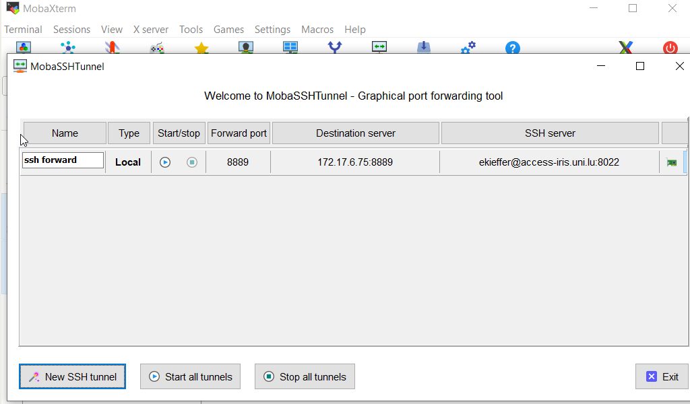
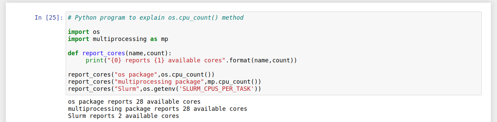
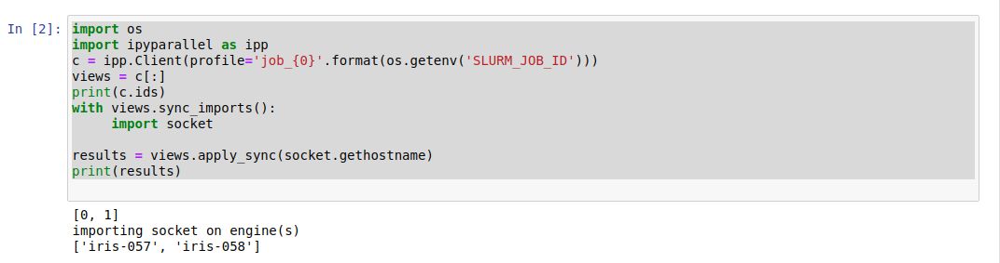
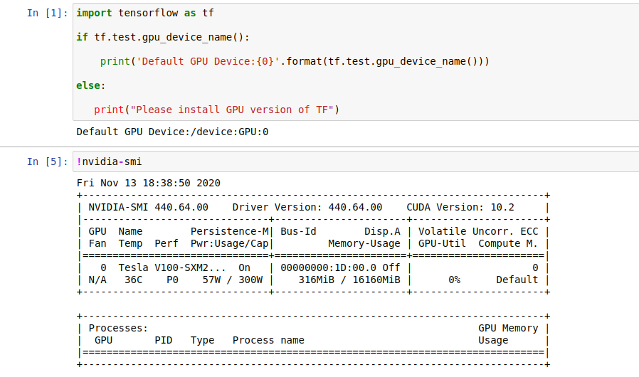

[](https://hpc.uni.lu) [](http://www.gnu.org/licenses/gpl-3.0.html) [](https://github.com/ULHPC/tutorials/issues/) [](slides.pdf) [](https://github.com/ULHPC/tutorials/tree/devel/advanced/advanced_scheduling/) [](http://ulhpc-tutorials.readthedocs.io/en/latest/advanced/advanced_scheduling/) [](https://github.com/ULHPC/tutorials)

# UL HPC Tutorial: HPC Containers with Singularity

     Copyright (c) 2018- UL HPC Team <hpc-team@uni.lu>


[](slides.pdf)


<p align="center">

</p>

## Main Objectives of this Session

* **Discussion on container systems**
    - what they are and where they help
    - common container systems
    - will focus on _Singularity_ container system


* how to use _Singularity_ containers on the UL HPC platform
    -  how to build containers from a definition file
    -  how to import pre-existing containers
    -  how to use applications embedded in containers
* containerized parallel applications execution

## A brief intro. to containers

### Purpose of containers?

* **Application portability**
    - containers bundle together an entire runtime env. (OS to apps.)
    - easy replication of environments
* Services isolation
    - separate microservices in different containers
* Do more with less
    - fast instantiation and tear-down
    - little memory/CPU overhead


### Technology main points

* OS-level virtualization - _light virtualization_
    - don't spin up a full virtual machine
* Close to native _bare metal_ speed

### Common container systems

* [**Docker**](https://www.docker.com)
    - A new (2013-) take on containers (OpenVZ and LXC came before)
    - High uptake in Enterprise (microservices) & science (reproducibility)
    - In use everywhere (esp. DevOps), available on most Cloud infra.

* [**Shifter**](https://github.com/NERSC/shifter)
    - Linux containers for HPC, developed at NERSC
    - Uses Docker functionality but makes it safe in shared HPC systems
    - Image gateway used to convert Docker images before use

* [**Singularity**](https://github.com/sylabs/singularity)
    - Containers for science, initially developed at LBNL
    - Not based on Docker, but can directly import/run Docker images
    - Also HPC oriented, diff. take to running MPI software than Shifter
    - Provides an [Image Registry]{https://github.com/singularityhub/sregistry}


### Singularity in a nutshell


<p align="center">

</p>

* **build environment**: your workstation (admin. required)
* **production environmemnt**: [UL HPC clusters](https://hpc.uni.lu/systems/clusters.html)

Source: [Kurtzer GM, Sochat V, Bauer MW (2017) Singularity: Scientific containers for mobility of compute. PLoS ONE 12(5): e0177459](https://doi.org/10.1371/journal.pone.0177459)

## Singularity setups

### Build env - Debian/Ubuntu

* Install dependencies

```{.bash}
sudo apt-get update && sudo apt-get install -y build-essential \
     libssl-dev uuid-dev libgpgme11-dev squashfs-tools \
     libseccomp-dev wget pkg-config git cryptsetup
```

* Installing [go](https://sylabs.io/guides/3.6/user-guide/quick_start.html#install)

```bash
export VERSION=1.15 OS=linux ARCH=amd64 && \
  wget https://dl.google.com/go/go$VERSION.$OS-$ARCH.tar.gz && \
  sudo tar -C /usr/local -xzvf go$VERSION.$OS-$ARCH.tar.gz && \
  rm go$VERSION.$OS-$ARCH.tar.gz

echo 'export PATH=/usr/local/go/bin:$PATH' >> ~/.bashrc && \
source ~/.bashrc
```

* Download singularity [source](https://sylabs.io/guides/3.6/user-guide/quick_start.html#download)

```bash
export VERSION=3.6.4
export URL="https://github.com/sylabs/singularity/releases/download"
wget "${URL}/v${VERSION}/singularity-${VERSION}.tar.gz"
tar -xzf singularity-${VERSION}.tar.gz
cd singularity
```

* Compiling singularity from source

```bash
./mconfig && \
    make -C builddir && \
    sudo make -C builddir install
```


### Build env - CentOS & RHEL
  - The epel (Extra Packages for Enterprise Linux) repos contain Singularity
  - The singularity package is actually split into two packages called `singularity-runtime`
  - The package `singularity` which also gives you the ability to build Singularity containers

```bash
sudo yum update -y
sudo yum install -y epel-release
sudo yum update -y
sudo yum install -y singularity-runtime singularity
```

See also: https://sylabs.io/guides/3.0/user-guide/installation.html#install-on-linux

### Build env - macOS

* Prerequisites - install Brew, VirtualBox and Vagrant

```bash
/usr/bin/ruby -e "$(curl -fsSL https://raw.githubusercontent.com/Homebrew/install/master/install)"
brew cask install virtualbox
brew cask install vagrant
brew cask install vagrant-manager
```
* Initialize an Ubuntu VM and install Singularity inside

```bash
mkdir singularity-vm && cd singularity-vm
export VM=sylabs/singularity-3.2-ubuntu-bionic64
vagrant init $VM
vagrant up
vagrant ssh
```

See also: https://sylabs.io/guides/3.0/user-guide/installation.html#install-on-windows-or-mac

### Use on the UL HPC clusters

- Production environment (no admin rights)
- Images can be pulled from official repository (dockerhub,shub,...)
- Images **CANNOT** be built on the ULHPC platform

```bash
module load tools/Singularity
```

### Now that Singularity is there...

```bash
singularity
Usage:
  singularity [global options...] <command>
Available Commands:
  build       Build a Singularity image
  cache       Manage the local cache
  capability  Manage Linux capabilities for users and groups
  config      Manage various singularity configuration (root user only)
  delete      Deletes requested image from the library
  exec        Run a command within a container
  inspect     Show metadata for an image
  instance    Manage containers running as services
  key         Manage OpenPGP keys
  oci         Manage OCI containers
  plugin      Manage Singularity plugins
  pull        Pull an image from a URI
  push        Upload image to the provided URI
  remote      Manage singularity remote endpoints
  run         Run the user-defined default command within a container
  run-help    Show the user-defined help for an image
  search      Search a Container Library for images
  shell       Run a shell within a container
  sif         siftool is a program for Singularity Image Format (SIF) file manipulation
  sign        Attach digital signature(s) to an image
  test        Run the user-defined tests within a container
  verify      Verify cryptographic signatures attached to an image
  version     Show the version for Singularity
```

## Quick start with Singularity


### Pulling from DockerHub

* You can pull images from [DockerHub](https://hub.docker.com/)
  - Example for a specific python version

```bash
singularity pull docker://python:3.8.0b1-alpine3.9
singularity exec python_3.8.0b1-alpine3.9.sif python3
singularity shell python_3.8.0b1-alpine3.9.sif
```
* The ouput is the following:

```bash
./python_3.8.0b1-alpine3.9.sif 
Python 3.8.0b1 (default, Jun  5 2019, 23:34:27) 
[GCC 8.3.0] on linux
Type "help", "copyright", "credits" or "license" for more information.
>>> print("Running python from within the container.") 
```

* This brought us an immutable image with (tiny) Alpine Linux & Python 3.8.0b1 from the Docker Registry.
<span style="color:red">The image is not writeable, but has access to our home directory by default.</span>

### Building from scratch

* **Sandbox mode**: container development in your build env (laptop)

```bash
sudo singularity build --sandbox \
     python_3.7.3-stretch docker://python:3.7.3-stretch
sudo singularity exec --writable \
     python_3.7.3-stretch/ pip3 install numpy nose test
singularity exec python_3.7.3-stretch \
     python3 -c "import numpy; numpy.test()"
```

This time the Docker Image was downloaded and unpacked to a directory (sandbox mode).
<span style="color:red">Changes within the directory can be made persistent with the **writable** flag.</span>

* Building a **sif image** from the sandbox 
  - done when ready to use envrionment in production
  - just have to send it to your dedicated space

```bash
sudo singularity build python_3.7.3-stretch.sif python_3.7.3-stretch/ 
```

Now image can be transferred, e.g. to the Iris cluster and used normally.

* Containers' access to filesystem(s)
  - Home directories are bind mounted by default
  - Your user(name) and group(s) are dynamically added
  - thus files created maintain normal permissions
  - Other paths need to be explicitly set

```bash
## Just an example - do not copy-paste
# Build 
sudo singularity build custom.sif python_3.7.3-stretch/
# Execute 
singularity exec --bind /work/projects/myprj/:/mnt \
            custom.sif python3 /mnt/my_nice_code.py
singularity exec --bind /work/projects/myprj:/work/projects/myprj \
            --bind /scratch/users/$USER:/scratch/users/$USER \
            custom.sif python3 /work/projects/myprj/nice_code.py -o \
	        /scratch/users/$USER/output_dir/
```

With the first command we create a compressed, *SIF - Singularity Image File* from the sandbox folder.
Then, we run the python3 interpreter from this image on code and data existing outside the container.

More details on SIF: https://archive.sylabs.io/2018/03/sif-containing-your-containers/


### Definition headers

* **%setup**: commands in the `%setup` section are first executed on the host system outside of the container after the base OS has been installed
* **%files**: the `%files` section allows you to copy files into the container 
* **%app***: redundant to build different containers for each app with nearly equivalent dependencies
* **%post**: install new software and libraries, write configuration files, create new directories
* **%test**: the `%test` section runs at the very end of the build process to validate the container using a method of your choice
* **%environment**: The `%environment` section allows you to define environment variables that will be set at runtime
* **%startscript**: the contents of the %startscript section are written to a file within the container at build time. This file is executed when the `instance start` command is issued
* **%runscript**: the contents of the `%runscript` section are written to a file within the container that is executed when the container image is run (either via the `singularity run` command or by executing the container directly as a command
* **%labels**: the %labels section is used to add metadata to the file /.singularity.d/labels.json within your container. The general format is a name-value pair
* **%help**: any text in the `%help` section is transcribed into a metadata file in the container during the build. This text can then be displayed using the run-help command

### Applications 

```bash
Bootstrap: docker
From: ubuntu

%environment
    GLOBAL=variables
    AVAILABLE="to all apps"
##############################
# foo
##############################
%apprun foo
    exec echo "RUNNING FOO"
%applabels foo
   BESTAPP FOO
%appinstall foo
   touch foo.exec
%appenv foo
    SOFTWARE=foo
    export SOFTWARE
%apphelp foo
    This is the help for foo.
%appfiles foo
   foo.txt
##############################
# bar
##############################
%apphelp bar
    This is the help for bar.
%applabels bar
   BESTAPP BAR
%appinstall bar
    touch bar.exec
%appenv bar
    SOFTWARE=bar
    export SOFTWARE
```
* Add %app prefix to headers and finish with the application name
* Ex: `singularity run --app foo my_container.sif`


## Advanced Singularity 

* Objectives:
  - Provide a Jupyter notebook container with full features
  - features: IPython Parallel, Virtualenv, CUDA, MPI 

### Step 1: Jupyter

* We will consider the next singularity definition file

```bash
Bootstrap: library
From: ubuntu:18.04
Stage: build
%setup
    touch /file_on_host
    touch ${SINGULARITY_ROOTFS}/file_on_guest
%files
    /file_on_host /opt
%environment
    export PORT=8889
    export LC_ALL=C
%post
    apt-get install -y software-properties-common
    add-apt-repository multiverse
    apt-get update
    apt-get install -y python3 python3-pip python3-venv
    python3 -m pip install jupyter
```

```bash    
%runscript
    echo "Container was created $NOW"
    echo "Arguments received: $*"
    exec python3 "$@"
%startscript
    echo "Started new instance on $(date)"
%test
    grep -q NAME=\"Ubuntu\" /etc/os-release
    if [ $? -eq 0 ]; then
        echo "Container base is Ubuntu as expected."
    else
        echo "Container base is not Ubuntu."
    fi
    python3 -m pip show jupyter
%labels
    Author ekieffer
    Version v0.0.1
%help
    This is a demo container used to illustrate a def
    file that uses all supported sections.
```

```bash 
sudo singularity build jupyter.sif jupyter.def
rsync -avz jupyter.def iris-cluster:jupyter.sif # to the cluster

```

* Next, we need to prepare a launcher ...

```bash
#!/bin/bash -l
#SBATCH -J Singularity_Jupyter
#SBATCH -N 1 # Nodes
#SBATCH -n 1 # Tasks
#SBATCH -c 2 # Cores assigned to each task
#SBATCH --time=0-01:00:00
#SBATCH -p batch
#SBATCH --qos=normal
#SBATCH --mail-user=<firstname>.<lastname>@uni.lu
#SBATCH --mail-type=BEGIN,END

module load tools/Singularity
# Avoid to modify your current jupyter config
export JUPYTER_CONFIG_DIR="$HOME/jupyter_sing/$SLURM_JOBID/"
export JUPYTER_PATH="$HOME/jupyter_sing/$SLURM_JOBID/jupyter_path"
export JUPYTER_DATA_DIR="$HOME/jupyter_sing/$SLURM_JOBID/jupyter_data"
export JUPYTER_RUNTIME_DIR="$HOME/jupyter_sing/$SLURM_JOBID/jupyter_runtime"
export IPYTHONDIR="$HOME/ipython_sing/$SLURM_JOBID"
mkdir -p $IPYTHONDIR

IP=$(facter ipaddress)
echo "On your laptop: ssh -p 8022 -NL 8889:$IP:8889 ${USER}@access-iris.uni.lu " 
singularity instance start jupyter.sif jupyter
singularity exec instance://jupyter jupyter \
    notebook --ip $(facter ipaddress) --no-browser --port 8889 &
pid=$!
sleep 5s
singularity exec instance://jupyter  jupyter notebook list
wait $pid
echo "Stopping instance"
singularity instance stop jupyter
```

To start the container job: `sbatch <launcher_name>.sh`

Once your job is running (see `squeue` command), you can use ssh forwarding to connect to the notebook from your laptop. Open a terminal on your laptop and copy-paste the ssh forward command in the slurm-****.out logfile.
You should be now able to reach your notebook.

__MobaXterm users__:

MobaXterm has tunneling a feature to setup ssh forwarding. Click on the "Tuneling".

<p align="center">

</p>

Then click on "New SSH tunnel".

<p align="center">

</p>

Use the ssh forward command in the slurm-****.out logfile to setup correctly the tunnel.


Then open your browser and go to the url: `http://127.0.0.1:8889/`. Jupyter should ask you for a password (see screenshot below). This password can be set before running the jupyter notebook and his part of the initial configuartion detailed at [Jupyter official documentation](https://jupyter-notebook.readthedocs.io/en/stable/public_server.html).

if by mistake, you forgot to setup this password, have a look in the slurm-****.out file in which the output of the command `jupyter notebook list` has been recorded.


```bash
On your laptop: ssh -p 8022 -NL 8889:172.17.6.75:8889 ekieffer@access-iris.uni.lu 
INFO:    instance started successfully
[I 13:46:53.550 NotebookApp] Writing notebook server cookie secret to /home/users/ekieffer/jupyter_sing/2169124/jupyter_runtime/notebook_cookie_secret
[I 13:46:53.916 NotebookApp] Serving notebooks from local directory: /home/users/ekieffer/singularity_tests
[I 13:46:53.916 NotebookApp] Jupyter Notebook 6.1.5 is running at:
[I 13:46:53.916 NotebookApp] http://172.17.6.75:8889/?token=f42786e3f025b30e28b8b6534bf74b2aab25e40ea229b20a
[I 13:46:53.916 NotebookApp]  or http://127.0.0.1:8889/?token=f42786e3f025b30e28b8b6534bf74b2aab25e40ea229b20a
[I 13:46:53.916 NotebookApp] Use Control-C to stop this server and shut down all kernels (twice to skip confirmation).
[C 13:46:53.924 NotebookApp] 
    
    To access the notebook, open this file in a browser:
        file:///home/users/ekieffer/jupyter_sing/2169124/jupyter_runtime/nbserver-20-open.html
    Or copy and paste one of these URLs:
        http://172.17.6.75:8889/?token=f42786e3f025b30e28b8b6534bf74b2aab25e40ea229b20a
     or http://127.0.0.1:8889/?token=f42786e3f025b30e28b8b6534bf74b2aab25e40ea229b20a
Currently running servers:
http://172.17.6.75:8889/?token=f42786e3f025b30e28b8b6534bf74b2aab25e40ea229b20a :: /home/users/ekieffer/singularity_tests
[I 13:49:54.399 NotebookApp] 302 GET / (172.17.2.11) 0.92ms
[I 13:49:54.423 NotebookApp] 302 GET /tree? (172.17.2.11) 1.17ms
[I 13:51:04.820 NotebookApp] 302 GET /?token=f42786e3f025b30e28b8b6534bf74b2aab25e40ea229b20a (172.17.2.11) 0.82ms
[I 13:51:20.005 NotebookApp] Writing notebook-signing key to /home/users/ekieffer/jupyter_sing/2169124/jupyter_data/notebook_secret
[W 13:51:20.007 NotebookApp] Notebook HPC school 2020.ipynb is not trusted
[I 13:51:20.361 NotebookApp] Kernel started: 8961291f-7e23-4b9f-b382-7e90b4e5c9b7, name: python3
[I 13:53:15.702 NotebookApp] Starting buffering for 8961291f-7e23-4b9f-b382-7e90b4e5c9b7:f77c8f489d3542548b1a4d6a83d28e52

```

Jupyter provides you a token to connect to the notebook.


* Note that the number of cpus reported by python itself will be 28 (regular nodes)
* This is obvisouly wrong. Check  `$SLURM_CPUS_PER_TASK`
* Never use `os.cpu_count()` nor `multiprocessing.cpu_count()`

<p align="center">

</p>

### Step 2:  Jupyter + custom Kernels

* One can wonder **WHY** we want to work with venv in a singularity image:
    - You do not need to rebuild the container evreytime you want to install a new package


* We will first apply some changes in our singularity definition file to activate the virtual environement 
automatically when calling a command. For this purpose, we will use the `%runscript` header now.

* We built a new sif image: jupyter_venv.if with the following definition:

```bash
Bootstrap: library
From: ubuntu:18.04
Stage: build

%setup
    touch /file_on_host
    touch ${SINGULARITY_ROOTFS}/file_on_guest

%files
    /file_on_host /opt

%environment
    export PORT=8889
    export LC_ALL=C

%post
    apt-get install -y software-properties-common
    add-apt-repository multiverse
    apt-get update
    apt-get install -y python3 python3-pip python3-venv
    python3 -m pip install jupyter cgroup-utils

%runscript
    VENV=$1
    echo "Sourcing $VENV"
    shift
    exec bash -c "source $VENV/bin/activate;$@"

%startscript
    echo "Started new instance on $(date)"

%test
    grep -q NAME=\"Ubuntu\" /etc/os-release
    if [ $? -eq 0 ]; then
        echo "Container base is Ubuntu as expected."
    else
        echo "Container base is not Ubuntu."
    fi
    python3 -m pip show jupyter


%labels
    Author ekieffer
    Version v0.0.1

%help
    This is a demo container used to illustrate a def file that uses all
    supported sections.
```

* On your laptop: `sudo singularity build jupyter_venv.sif jupter_venv.def`


```bash
#!/bin/bash -l
#SBATCH -J Singularity_Jupyter_venv
#SBATCH -N 1 # Nodes
#SBATCH -n 1 # Tasks
#SBATCH -c 2 # Cores assigned to each tasks
#SBATCH --time=0-01:00:00
#SBATCH -p batch
#SBATCH --qos=normal
#SBATCH --mail-user=<firstname>.<lastname>@uni.lu
#SBATCH --mail-type=BEGIN,END


module load tools/Singularity
export VENV="$HOME/.envs/venv"
export JUPYTER_CONFIG_DIR="$HOME/jupyter_sing/$SLURM_JOBID/"
export JUPYTER_PATH="$VENV/share/jupyter":"$HOME/jupyter_sing/$SLURM_JOBID/jupyter_path"
export JUPYTER_DATA_DIR="$HOME/jupyter_sing/$SLURM_JOBID/jupyter_data"
export JUPYTER_RUNTIME_DIR="$HOME/jupyter_sing/$SLURM_JOBID/jupyter_runtime"
export IPYTHONDIR="$HOME/ipython_sing/$SLURM_JOBID"

mkdir -p $JUPYTER_CONFIG_DIR
mkdir -p $IPYTHONDIR


echo "On your laptop: ssh -p 8022 -NL 8889:$(facter ipaddress):8889 ${USER}@access-iris.uni.lu " 

singularity instance start jupyter_venv.sif jupyter

if [ ! -d "$VENV" ];then
    singularity exec instance://jupyter python3 -m venv $VENV --system-site-packages
    # singularity run instance://jupyter $VENV "python3 -m pip install <your_packages>"
    singularity run instance://jupyter $VENV "python3 -m ipykernel install --sys-prefix --name HPC_SCHOOL_ENV --display-name HPC_SCHOOL_ENV"

fi


singularity run instance://jupyter  $VENV "jupyter notebook --ip $(facter ipaddress) --no-browser --port 8889" &
pid=$!
sleep 5s
singularity run instance://jupyter $VENV "jupyter notebook list"
singularity run instance://jupyter $VENV "jupyter --paths"
singularity run instance://jupyter $VENV "jupyter kernelspec list"
wait $pid
echo "Stopping instance"
singularity instance stop jupyter
```


### Step 3:  Jupyter + custom Kernels + IPyParallel


* The installation of the IPyParallel package should be done during the image generation
* Copy-paste the jupyter_venv.def to jupyter_parallel.def 
* Add in the `%post` section, `python3 -m pip install ipyparallel`


```bash
#!/bin/bash -l
#SBATCH -J Singularity_Jupyter_parallel
#SBATCH -N 2 # Nodes
#SBATCH -n 2 # Tasks
#SBATCH -c 2 # Cores assigned to each tasks
#SBATCH --time=0-01:00:00
#SBATCH -p batch
#SBATCH --qos=normal
#SBATCH --mail-user=<firstname>.<lastname>@uni.lu
#SBATCH --mail-type=BEGIN,END


module load tools/Singularity

export VENV="$HOME/.envs/venv_parallel"
export JUPYTER_CONFIG_DIR="$HOME/jupyter_sing/$SLURM_JOBID/"
export JUPYTER_PATH="$VENV/share/jupyter":"$HOME/jupyter_sing/$SLURM_JOBID/jupyter_path"
export JUPYTER_DATA_DIR="$HOME/jupyter_sing/$SLURM_JOBID/jupyter_data"
export JUPYTER_RUNTIME_DIR="$HOME/jupyter_sing/$SLURM_JOBID/jupyter_runtime"
export IPYTHONDIR="$HOME/ipython_sing/$SLURM_JOBID"

mkdir -p $JUPYTER_CONFIG_DIR
mkdir -p $IPYTHONDIR


echo "On your laptop: ssh -p 8022 -NL 8889:$(facter ipaddress):8889 ${USER}@access-iris.uni.lu "


singularity instance start jupyter_parallel.sif jupyter

if [ ! -d "$VENV" ];then
    singularity exec instance://jupyter python3 -m venv $VENV --system-site-packages
    # singularity run instance://jupyter $VENV "python3 -m pip install <your_packages>"
    singularity run instance://jupyter $VENV "python3 -m ipykernel install --sys-prefix --name HPC_SCHOOL_ENV_IPYPARALLEL --display-name HPC_SCHOOL_ENV_IPYPARALLEL"

fi

#create a new ipython profile appended with the job id number
profile=job_${SLURM_JOB_ID}
singularity run instance://jupyter $VENV "ipython profile create --parallel ${profile}"

# Enable IPython clusters tab in Jupyter notebook
singularity run instance://jupyter $VENV "jupyter nbextension enable --py ipyparallel"

## Start Controller and Engines
#
singularity run instance://jupyter $VENV "ipcontroller --ip="*" --profile=${profile}" &
sleep 10

##srun: runs ipengine on each available core
srun singularity run jupyter_parallel.sif $VENV "ipengine --profile=${profile} --location=$(hostname)" &
sleep 25
export XDG_RUNTIME_DIR=""

singularity run instance://jupyter $VENV "jupyter notebook --ip $(facter ipaddress) --no-browser --port 8889" &
pid=$!
sleep 5s
singularity run instance://jupyter $VENV "jupyter notebook list"
singularity run instance://jupyter $VENV "jupyter --paths"
singularity run instance://jupyter $VENV "jupyter kernelspec list"

wait $pid
echo "Stopping instance"
singularity instance stop jupyter
```

* When opening the job log (slurm-job_number.out), you should see when the engines start:

```bash
On your laptop: ssh -p 8022 -NL 8889:172.17.6.57:8889 ekieffer@access-iris.uni.lu
INFO:    instance started successfully
Sourcing /home/users/ekieffer/.envs/venv_parallel
Installed kernelspec HPC_SCHOOL_ENV_IPYPARALLEL in /home/users/ekieffer/.envs/venv_parallel/share/jupyter/kernels/hpc_school_env_ipyparallel
Sourcing /home/users/ekieffer/.envs/venv_parallel
[ProfileCreate] Generating default config file: &apos;/home/users/ekieffer/ipython_sing/2134685/profile_job_2134685/ipython_config.py&apos;
[ProfileCreate] Generating default config file: &apos;/home/users/ekieffer/ipython_sing/2134685/profile_job_2134685/ipython_kernel_config.py&apos;
[ProfileCreate] Generating default config file: &apos;/home/users/ekieffer/ipython_sing/2134685/profile_job_2134685/ipcontroller_config.py&apos;
[ProfileCreate] Generating default config file: &apos;/home/users/ekieffer/ipython_sing/2134685/profile_job_2134685/ipengine_config.py&apos;
[ProfileCreate] Generating default config file: &apos;/home/users/ekieffer/ipython_sing/2134685/profile_job_2134685/ipcluster_config.py&apos;
Sourcing /home/users/ekieffer/.envs/venv_parallel
Enabling tree extension ipyparallel/main...
      - Validating: <font color="#4E9A06">OK</font>
Sourcing /home/users/ekieffer/.envs/venv_parallel
2020-11-13 15:29:52.292 [IPControllerApp] Hub listening on tcp://*:49933 for registration.
2020-11-13 15:29:52.294 [IPControllerApp] Hub using DB backend: &apos;DictDB&apos;
2020-11-13 15:29:52.574 [IPControllerApp] hub::created hub
2020-11-13 15:29:52.575 [IPControllerApp] writing connection info to /home/users/ekieffer/ipython_sing/2134685/profile_job_2134685/security/ipcontroller-client.json
2020-11-13 15:29:52.576 [IPControllerApp] writing connection info to /home/users/ekieffer/ipython_sing/2134685/profile_job_2134685/security/ipcontroller-engine.json
2020-11-13 15:29:52.578 [IPControllerApp] task::using Python leastload Task scheduler
2020-11-13 15:29:52.578 [IPControllerApp] Heartmonitor started
2020-11-13 15:29:52.590 [IPControllerApp] Creating pid file: /home/users/ekieffer/ipython_sing/2134685/profile_job_2134685/pid/ipcontroller.pid
2020-11-13 15:29:52.601 [scheduler] Scheduler started [leastload]
2020-11-13 15:29:52.604 [IPControllerApp] client::client b&apos;\x00k\x8bEg&apos; requested &apos;connection_request&apos;
2020-11-13 15:29:52.604 [IPControllerApp] client::client [b&apos;\x00k\x8bEg&apos;] connected
Sourcing /home/users/ekieffer/.envs/venv_parallel
Sourcing /home/users/ekieffer/.envs/venv_parallel
2020-11-13 15:30:02.960 [IPEngineApp] Loading url_file &apos;/home/users/ekieffer/ipython_sing/2134685/profile_job_2134685/security/ipcontroller-engine.json&apos;
2020-11-13 15:30:02.980 [IPEngineApp] Registering with controller at tcp://127.0.0.1:49933
2020-11-13 15:30:02.989 [IPControllerApp] client::client b&apos;2ac54d70-5ec5cb4f47a0ff21c199b7e9&apos; requested &apos;registration_request&apos;
2020-11-13 15:30:03.082 [IPEngineApp] Starting to monitor the heartbeat signal from the hub every 3010 ms.
2020-11-13 15:30:03.088 [IPEngineApp] Completed registration with id 0
2020-11-13 15:30:04.160 [IPEngineApp] Loading url_file &apos;/home/users/ekieffer/ipython_sing/2134685/profile_job_2134685/security/ipcontroller-engine.json&apos;
2020-11-13 15:30:04.188 [IPEngineApp] Registering with controller at tcp://172.17.6.57:49933
2020-11-13 15:30:04.199 [IPControllerApp] client::client b&apos;e7a7b917-dd93682af4c3649148a0b60c&apos; requested &apos;registration_request&apos;
2020-11-13 15:30:04.295 [IPEngineApp] Starting to monitor the heartbeat signal from the hub every 3010 ms.
2020-11-13 15:30:04.301 [IPEngineApp] Completed registration with id 1
2020-11-13 15:30:07.582 [IPControllerApp] registration::finished registering engine 1:e7a7b917-dd93682af4c3649148a0b60c
2020-11-13 15:30:07.583 [IPControllerApp] engine::Engine Connected: 1
2020-11-13 15:30:07.586 [IPControllerApp] registration::finished registering engine 0:2ac54d70-5ec5cb4f47a0ff21c199b7e9
2020-11-13 15:30:07.587 [IPControllerApp] engine::Engine Connected: 0
Sourcing /home/users/ekieffer/.envs/venv_parallel
[I 15:30:27.510 NotebookApp] Writing notebook server cookie secret to /home/users/ekieffer/jupyter_sing/2134685/jupyter_runtime/notebook_cookie_secret
[I 15:30:27.772 NotebookApp] Loading IPython parallel extension
[I 15:30:27.773 NotebookApp] Serving notebooks from local directory: /home/users/ekieffer/singularity_tests
[I 15:30:27.773 NotebookApp] Jupyter Notebook 6.1.5 is running at:
[I 15:30:27.774 NotebookApp] http://172.17.6.57:8889/?token=15c128acd6eee2d4f8e1d1561fe11ab8dc6f6d2b730a7cfe
[I 15:30:27.774 NotebookApp]  or http://127.0.0.1:8889/?token=15c128acd6eee2d4f8e1d1561fe11ab8dc6f6d2b730a7cfe
[I 15:30:27.774 NotebookApp] Use Control-C to stop this server and shut down all kernels (twice to skip confirmation).
[C 15:30:27.780 NotebookApp]

    To access the notebook, open this file in a browser:
        file:///home/users/ekieffer/jupyter_sing/2134685/jupyter_runtime/nbserver-100-open.html
    Or copy and paste one of these URLs:
        http://172.17.6.57:8889/?token=15c128acd6eee2d4f8e1d1561fe11ab8dc6f6d2b730a7cfe
     or http://127.0.0.1:8889/?token=15c128acd6eee2d4f8e1d1561fe11ab8dc6f6d2b730a7cfe
Sourcing /home/users/ekieffer/.envs/venv_parallel
Currently running servers:
http://172.17.6.57:8889/?token=15c128acd6eee2d4f8e1d1561fe11ab8dc6f6d2b730a7cfe :: /home/users/ekieffer/singularity_tests
Sourcing /home/users/ekieffer/.envs/venv_parallel
config:
    /home/users/ekieffer/jupyter_sing/2134685/
    /usr/etc/jupyter
    /usr/local/etc/jupyter
    /etc/jupyter
data:
    /home/users/ekieffer/.envs/venv_parallel/share/jupyter
    /home/users/ekieffer/jupyter_sing/2134685/jupyter_path
    /home/users/ekieffer/jupyter_sing/2134685/jupyter_data
    /usr/local/share/jupyter
    /usr/share/jupyter
runtime:
    /home/users/ekieffer/jupyter_sing/2134685/jupyter_runtime
Sourcing /home/users/ekieffer/.envs/venv_parallel
Available kernels:
  hpc_school_env_ipyparallel    /home/users/ekieffer/.envs/venv_parallel/share/jupyter/kernels/hpc_school_env_ipyparallel
  python3                       /usr/local/share/jupyter/kernels/python3
```

<p align="center">

</p>

### Step 4:  Jupyter + custom Kernels + IPyParallel + CUDA

* In this last section, we will use a GPU-enabled container from NVIDIA:
    - Only need to change the `Boostrap` and `From` sections
    - NVIDIA containers can be obtained from DockerHub
    - For more details, please have a look at [NVIDIA](https://ngc.nvidia.com/catalog/containers)
    - [Tensorflow GPU-enabled container](https://ngc.nvidia.com/catalog/containers/nvidia:tensorflow) will be consider hereafter

```bash
Bootstrap: docker
From: nvcr.io/nvidia/tensorflow:20.10-tf2-py3
Stage: build

%setup
    touch /file_on_host
    touch ${SINGULARITY_ROOTFS}/file_on_guest

%files
    /file_on_host /opt

%environment
    export PORT=8889
    export LC_ALL=C

%post
    python3 -m pip install virtualenv jupyter ipyparallel cgroup-utils

%runscript
    VENV=$1
    echo "Sourcing $VENV"
    shift
    exec bash -c "source $VENV/bin/activate;$@"

%startscript
    echo "Started new instance on $(date)"

%test
    grep -q NAME=\"Ubuntu\" /etc/os-release
    if [ $? -eq 0 ]; then
        echo "Container base is Ubuntu as expected."
    else
        echo "Container base is not Ubuntu."
    fi
    python3 -m pip show jupyter

%labels
    Author ekieffer
    Version v0.0.1

%help
    This is a demo container used to illustrate a def file that uses all
    supported sections.
```


```bash
#!/bin/bash -l
#SBATCH -J Singularity_Jupyter_parallel_cuda
#SBATCH -N 1 # Nodes
#SBATCH -n 1 # Tasks
#SBATCH -c 1 # Cores assigned to each tasks
#SBATCH --time=0-01:00:00
#SBATCH -p gpu
#SBATCH -G 1
#SBATCH --qos=normal
#SBATCH --mail-user=<firstname>.<lastname>@uni.lu
#SBATCH --mail-type=BEGIN,END


module load tools/Singularity

export VENV="$HOME/.envs/venv_parallel_cuda"
export JUPYTER_CONFIG_DIR="$HOME/jupyter_sing/$SLURM_JOBID/"
export JUPYTER_PATH="$VENV/share/jupyter":"$HOME/jupyter_sing/$SLURM_JOBID/jupyter_path"
export JUPYTER_DATA_DIR="$HOME/jupyter_sing/$SLURM_JOBID/jupyter_data"
export JUPYTER_RUNTIME_DIR="$HOME/jupyter_sing/$SLURM_JOBID/jupyter_runtime"
export IPYTHONDIR="$HOME/ipython_sing/$SLURM_JOBID"

mkdir -p $JUPYTER_CONFIG_DIR
mkdir -p $IPYTHONDIR


echo "On your laptop: ssh -p 8022 -NL 8889:$(facter ipaddress):8889 ${USER}@access-iris.uni.lu " 


singularity instance start --nv jupyter_parallel_cuda.sif jupyter

if [ ! -d "$VENV" ];then
    # For some reasons, there is an issue with venv -- using virtualenv instead
    singularity exec --nv instance://jupyter python3 -m virtualenv $VENV --system-site-packages
    singularity run --nv instance://jupyter $VENV "python3 -m pip install --upgrade pip" 
    # singularity run --nv instance://jupyter $VENV "python3 -m pip install <your_packages>"
    singularity run --nv instance://jupyter $VENV "python3 -m ipykernel install --sys-prefix --name HPC_SCHOOL_ENV_IPYPARALLEL_CUDA --display-name HPC_SCHOOL_ENV_IPYPARALLEL_CUDA"

fi

#create a new ipython profile appended with the job id number
profile=job_${SLURM_JOB_ID}
singularity run --nv instance://jupyter $VENV "ipython profile create --parallel ${profile}"

# Enable IPython clusters tab in Jupyter notebook
singularity run --nv instance://jupyter $VENV "jupyter nbextension enable --py ipyparallel"

## Start Controller and Engines
#
singularity run --nv instance://jupyter $VENV "ipcontroller --ip="*" --profile=${profile}" &
sleep 10

##srun: runs ipengine on each available core
srun singularity run --nv jupyter_parallel.sif $VENV "ipengine --profile=${profile} --location=$(hostname)" &
sleep 25

export XDG_RUNTIME_DIR=""

singularity run --nv instance://jupyter $VENV "jupyter notebook --ip $(facter ipaddress) --no-browser --port 8889" &
pid=$!
sleep 5s
singularity run --nv instance://jupyter $VENV "jupyter notebook list"
singularity run --nv instance://jupyter $VENV "jupyter --paths"
singularity run --nv instance://jupyter $VENV "jupyter kernelspec list"
wait $pid
echo "Stopping instance"
singularity instance stop jupyter
```
<p align="center">

</p>

* The notebook has now access to `nvidia-smi` command and the tensorflow library confirms that we have access to the GPU device 0
