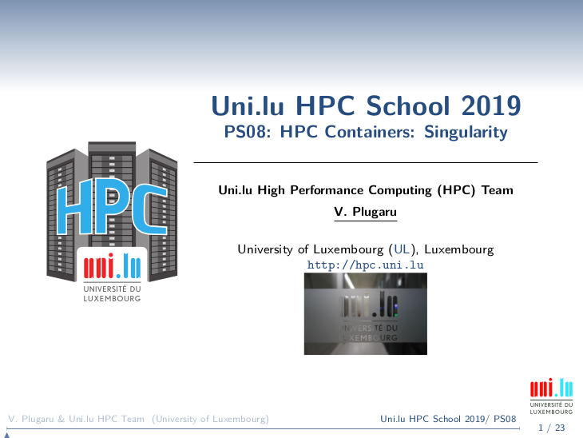

      

# UL HPC Tutorial: HPC Containers with Singularity

     Copyright (c) 2018- UL HPC Team <hpc-sysadmins@uni.lu>

The objective of this tutorial is to practice using Singularity containers on the UL HPC [iris cluster](https://hpc.uni.lu/systems/iris/).

It's important that you read the [slides](https://github.com/ULHPC/tutorials/blob/devel/containers/singularity/slides.pdf?raw=true) first.

They review:

1. setting up Singularity on your workstation
2. common Singularity commands
3. how to download existing Docker registry images 
4. how to create and customize containers locally
5. how to run Singularity containers on the UL HPC platform

## Practice using Singularity containers

### Part 1 - using existing containers

1. Connect to the Iris cluster, load the Singularity module.
2. Download using Singularity the official [Docker](https://hub.docker.com/r/tensorflow/tensorflow/) image of Tensorflow (CPU version)
3. Download the Git repository of [Tensorflow models and examples](https://github.com/tensorflow/models.git)
4. Run the _LeNet-5-like convolutional MNIST model example_ `tutorials/image/mnist/convolutional.py` with Singularity

       (node)$> mkdir singularity-tests
       (node)$> git clone https://github.com/tensorflow/models.git
       (node)$> module use /opt/apps/resif/data/devel/default/modules/all
       (node)$> module load tools/Singularity 
       (node)$> singularity pull docker://tensorflow/tensorflow
       (node)$> singularity exec tensorflow.simg python models/tutorials/image/mnist/convolutional.py

### Part 2 - building a container

1. Set up Singularity on your workstation or laptop
2. Create a definition file to create a CentOS 7 container
3. Customize the definition file to install Python, NumPy, SciPy and Seaborn
4. Build the container as _production_ SquashFS image
5. Transfer the image to the Iris cluster
6. Use the container's embedded python and libraries to run a [Seaborn plot example](https://seaborn.pydata.org/examples/large_distributions.html)

### Part 3 - MPI parallel execution with containers

1. On your workstation or laptop set up a new definition file for a CentOS 7 container
2. Build the container as a sandbox directory 
3. Install OpenMPI 2.1.3 within the sandbox
4. Install the OSU Microbenchmarks in the sandbox, see instructions within the dedicated [UL HPC tutorial](http://ulhpc-tutorials.readthedocs.io/en/latest/parallel/mpi/OSU_MicroBenchmarks/) 
5. Build the sandbox into a _production_ SquashFS image
6. Transfer the image to the Iris cluster
7. Run the `mpi/one-sided/osu_get_bw` benchmark within the container on 2 MPI processes in parallel

### Part 4 - use your own

Extra challenge - embed your own code / software in a container and use it on the UL HPC platform :-)
