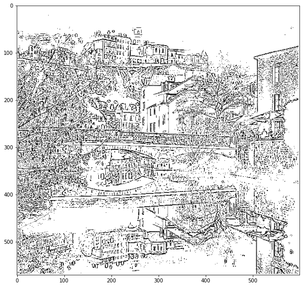
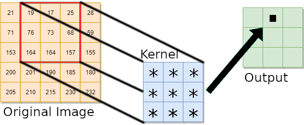
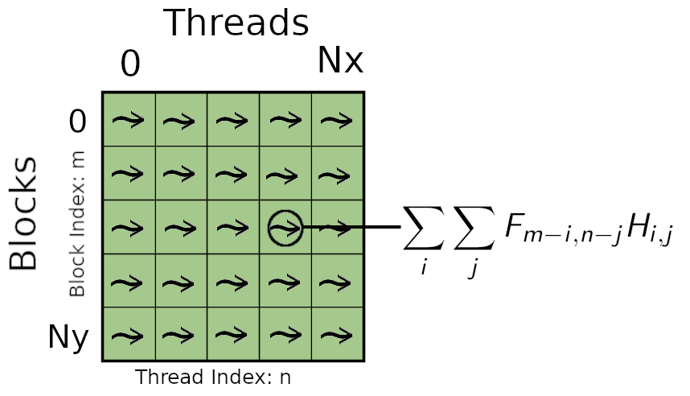

[](https://hpc.uni.lu) [](http://www.gnu.org/licenses/gpl-3.0.html) [](https://github.com/ULHPC/tutorials/issues/) [](https://github.com/ULHPC/tutorials/raw/devel/cuda/exercises/convolution/slides.pdf) [](https://github.com/ULHPC/tutorials/tree/devel/cuda/exercises/convolution/) [](http://ulhpc-tutorials.readthedocs.io/en/latest/cuda/exercises/convolution/) [](https://github.com/ULHPC/tutorials)

# Image Convolution with GPU and CUDA

     Copyright (c) 2020-2021 L. Koutsantonis UL HPC Team <hpc-team@uni.lu>

[](https://github.com/ULHPC/tutorials/raw/devel/cuda/exercises/convolution/slides.pdf)

This tutorial will cover the following aspects of CUDA programming:

 1. GPU Global Memory Allocation
 2. Dynamic Shared Memory Allocation
 3. Thread Indexing
 4. Thread Synchronization

<br />
<br />

--------------------
## Pre-requisites ##

Ensure you are able to [connect to the UL HPC clusters](https://hpc-docs.uni.lu/connect/access/).
In particular, recall that the `module` command **is not** available on the access frontends.

```bash
### Access to ULHPC cluster - here iris
(laptop)$> ssh iris-cluster
# /!\ Advanced (but recommended) best-practice:
#    always work within an GNU Screen session named with 'screen -S <topic>' (Adapt accordingly)
# IIF not yet done, copy ULHPC .screenrc in your home
(access)$> cp /etc/dotfiles.d/screen/.screenrc ~/
```

Now you'll need to pull the latest changes in your working copy of the [ULHPC/tutorials](https://github.com/ULHPC/tutorials) you should have cloned in `~/git/github.com/ULHPC/tutorials` (see ["preliminaries" tutorial](../../preliminaries/))

``` bash
(access)$> cd ~/git/github.com/ULHPC/tutorials
(access)$> git pull
```
You should have followed the [Introduction to GPU programming with CUDA](../../)


## Laplacian of Gaussian (LoG): A convolution kernel for edge detection


  * Derivative Filter used to find rapid changes in signals and especially images

  * Used for edge detection and noise detection

  * Mathematical Formula:

$$H(x,y) = \frac{-1}{\pi \sigma ^4}(1-\frac{x^2+y^2}{2\sigma ^2})e^{-\frac{x^2+y^2}{2\sigma^2}}$$

 

 

<br />
<br />

## Convolution Operator
The discrete convolution operator is  define by the double sum:

$$G_{m,n} =  F *H = \sum_i \sum_j {F_{m-i, n-j} H_{i,j} }$$

where $F$ is the original image, $H$ is the convolution kernel and $G$ is the resulted image.


<br />
<br />

## CPU Implementation
A serial code implementing the image convolution on a CPU employs two loops to compute the values of the pixels of the output image. The convolution operator is calculated at each iteration for each image pixel using the double sum provided in the equation above.

```c
//CPU function: conv_img_cpu
//Parameters: float *img, float *kernel, float *imgf, int Nx, int Ny, int kernel_size
//center: center of kernel
  for (int i = center; i<(Ny-center); i++)
    for (int j = center; j<(Nx-center); j++){
        //Convolution Operator:
        sum = 0;
        for (int ki = 0; ki<kernel_size; ki++)
	       for (int kj = 0; kj<kernel_size; kj++){
	           ii = j + kj - center;
	           jj = i + ki - center;
	           sum+=img[jj*Nx+ii]*kernel[ki*kernel_size + kj];
	           }
        imgf[i*Nx +j] = sum;
        }
```

<br />
<br />

## GPU Implementation

The parallel implementation of convolution of GPU is described by the following figure. Multiple threads are used to calculate the convolution operator of multiple pixels simultaneously. The total number of calculated pixels at each step will be equal to the total number of launched threads ($Number of Blocks \times Block Threads$). Each thread having access to the coefficients of the convolution kernel calculates the double sum of the convolution operator. The kernel coefficients being constant during the whole execution can be stored into the shared memory (accessible by the block threads).



<br />
<br />

## Hands On Image Convolution with CUDA
### Get the source files
***Task 1:*** If you do not have yet the UL HPC tutorial repository, clone it. Update to the latest version.

```bash
ssh iris-cluster
mkdir -p ~/git/github.com/ULHPC
cd  ~/git/github.com/ULHPC
git clone https://github.com/ULHPC/tutorials.git
cd tutorials/cuda/exercises/convolution
git stash && git pull -r && git stash pop
```
<br />

### Get an interactive GPU job

See also [documentation](https://hpc-docs.uni.lu/jobs/gpu/)


```bash
### ... either directly - dedicate 1/4 of available cores to the management of GPU card
$> si-gpu -c7
# /!\ warning: append -G 1 to really reserve a GPU
# salloc -p interactive --qos debug -C gpu -c7 -G 1 --mem-per-cpu 27000

### ... or using the HPC School reservation 'hpcschool-gpu'
salloc --reservation=hpcschool-gpu -p interactive -C gpu --ntasks-per-node 1 -c7 -G 1

### Load the required modules
module load system/CUDA
module load compiler/GCC
```


### A CUDA kernel for the Convolution Operator
***Task 2:*** Following the steps `1` to `3` provided bellow write a CUDA kernel for the computation of the convolution operator.

Open the source file `LoG_gpu_exercise.cu` with your favorite editor (e.g. `emacs LoG_gpu_exercise.cu`). The CUDA kernel is already defined:

```c
void conv_img_cpu(float *img, float *kernel, float *imgf, int Nx, int Ny, int kernel_size)
```
where `*img` is a pointer to the original image vector, `*kernel` is a pointer to the convolution kernel vector, `*imgf` is a pointer to the convoluted image, `Nx` and `Ny` are the dimensions of both the original and convoluted image, and `kernel_size` is the dimension of the convolution kernel.


#### Step 1. CUDA Threads and  Blocks indices
The CUDA kernel will be executed by each thread. Thus, a mapping mechanism is needed for each thread to compute a specific pixel of the output image and store the result to the corresponding  memory location.

CUDA kernels have access to device variables identifying both the thread index  within the block and the block index.
These variables are `threadIdx.x` and `blockIdx.x` respectively. In this  example, each block of threads will compute a row of the output image and each block thread will compute a single pixel value on this row. Thus, the index of a pixel in the image can be defined throught:
```c
//each block is assigned to a row of an image, iy integer index of y
  int iy = blockIdx.x + (kernel_size - 1)/2;

  //each thread is assigned to a pixel of a row, ix integer index of x
  int ix = threadIdx.x + (kernel_size - 1)/2;
```

The offset `(kernel_size - 1)/2` is added to the `iy, ix` variables as the convolution will not be computed for the image pixels lying at the boundary layers of the original image (computations are performed only when the discrete filter kernel lies completely within the original image). We can define the center of the convolution kernel as it will be used in differnet calculations:
```c
//center of kernel in both dimensions
  int center = (kernel_size -1)/2;
```

It is important to say that the `kernel_size` must be an odd number so that its center has an integer value.

For each block thread, the memory location of the corresponding pixel can be  calculated by:
```c
int idx = iy*Nx +ix;
```


#### Step 2. Dynamically Allocated Shared Memory

Shared memory is allocated per thread block, so all threads in the block have access to the same shared memory. The best practice is to use the shared memory for parameters that remain constant during the execution of the CUDA kernel and used in multiple calculations. In our example, these parameters are the coefficient of the convolution kernel. To statically allocate shared memory we use:
```c
__shared__ float sdata[9];
```
where in this case the `kernel_size` is 9. As we want our kernel to run with convolution kernels of different size, we can dynamically allocate shared memory using the prefix `extern`:
```c
extern __shared__ float sdata[];
```

where in this case, the size of the allocated shared memory is passed through the launch of the kernel (from the main function).

For each block, the block threads are used to copy the coefficients of the convolution kernel from the global memory to the shared memory. The index of each thread is used to define the location in shared memory where the  convolution coefficients from the global memory will be copied. It also provides the location where these coefficients are stored in the global memory. For our case, these mappings are identical:

```c
int tid = threadIdx.x;
int K2 = kernel_size*kernel_size;
extern __shared__ float sdata[];
if (tid<K2)
    sdata[tid] = kernel[tid];
 __syncthreads();
```
As the vector containing the convolution coefficients is of size of `K2 = kernel_size*kernel_size`, only the threads  with index in the range`[0 ,K2)` can access the global and shared memory. This is ensured using the `if (tid<K2)` statement. At the end of the transfer we have to syncronize all block threads using `___syncthreads()`. This synchronization is required to ensure that all of the block threads will perform calculations after all convolution coefficients are completely transfered to the shared memory.

#### Step 3. Calculate the output image
Each thread calculates the corresponding pixel value of the convoluted image. The convolution operation is performed through a nested loop implementing a double summation.  At each iteration, each block thread calculates the multiplication of a pixel value of the original image lying within  the convolution window   with the corresponding  coefficient of the convolution kernel stored in shared memory (see image above). The result is used to update the value of a local summation (`sum`). The value of the output pixel is the result of the double summation. The CUDA code implementing the above procedure is given bellow:

```c
if (idx<Nx*Ny){
    for (int ki = 0; ki<kernel_size; ki++)
        for (int kj = 0; kj<kernel_size; kj++){
	       ii = kj + ix - center;
	       jj = ki + iy - center;
	sum+=img[jj*Nx+ii]*sdata[ki*kernel_size + kj];
    }
    imgf[idx] = sum;
  }
```
As you can see the code is exactly the same with the code implementing the convolution on a CPU. What is missing is the double for loop running on the pixels of the output image.

In the above code, the `if (idx<Nx*Ny)` statement is used to ensure that each thread has access to an allocated memory location.

<br />

### Complete the main function
In main, the arrays `img`, `imgf` and `kernel` storing the original images pixel values, the convoluted image pixel values and the convolution kernel coefficients respectively
are `float` arrays allocated  in the host memory (CPU). The original image is preloaded into the `img` through the host function:
```c
void load_image(char *fname, int Nx, int Ny, float  *img)
```
The convolution kernel coefficients are calculated for a given sigma value  `sigma` and convolution kernel size `kernel_size` through the host function:

```c
void calculate_kernel(int kernel_size, float sigma, float *kernel)
```
<br />

#### Allocate Device Memory
The array `d_img` storing  the original image pixel values in device global memory is allocated using:

```c
cudaMalloc(&d_img,Nx*Ny*sizeof(float));
```

***Task 3a*** Based on the above instruction allocate device memory  for the arrays `d_imgf` and `d_kernel` storing the output image pixels and convolution kernel coeffients respectively. The size of the output image in `Nx \times Ny` and the size of the convolution kernel is `kernel_size \times kernel_size`.

#### Transfer the filter coefficients from the host memory to the device memory
The original image pixel values are copied from the host memory to the device memory through:
```c
cudaMemcpy(d_img, img, Nx*Ny*sizeof(float),cudaMemcpyHostToDevice);
```

***Task 3b*** Utilize the above instruction to tranfer the convolution kernel coefficients from the host memory `kernel` to the global memory `d_kernel`.

#### Configure the Execution and Launch the CUDA kernel

The kernel code will by executed by every thread after its launch. The total number of blocks `Nblocks` will be equal to the number of the calculated rows of the  output image `(Ny - kernel_size + 1)` and the number of block threads `Nthreads` equal to the number of the calculated pixel elements per row `(Nx - kernel size + 1)`. In general, a CUDA kernel is configured and launched  using the following instruction:
```c
my_gpu_kernel<<<Nblocks, Nthreads>>>(vars);
```
When shared memory is dynamically allocated within the kernel, an extra argument `size` defining the  number of bytes of the shared memory that is dynamically allocated per thread block  has to be passed through the configuration of the kernel:

```c
conv_img_gpu<<<Nblocks, Nthreads, size>>>(d_img, d_kernel, d_imgf, Nx, Ny, kernel_size);
```
In our case, the size of the allocated shared memory is equal to the size of the convolution kernel `Size =  kernel_size*kernel_size*sizeof(float)`.

***Task 4*** Configure the Execution and Launch the GPU kernel from the main function.

#### De-allocation of host and device memory

At the end of main, the host memory is deallocated with ```free(var)```. Similarly, the device memory is deallocated with ```cudaFree(var)```.
```c
  free(img);
  free(imgf);
  free(kernel);

  cudaFree(d_img);
  cudaFree(d_imgf);
  cudaFree(d_kernel);

```

<br />
### Compile and run your code

 The NVIDIA CUDA compiler 'nvcc' is used to compile the source code containing both the host and device functions.
The non CUDA part of the code will be forwarded to a general purpose host compiler (e.g. `gcc`).
As you have seen, the GPU functionsare declared using some annotations (e.g. `__global__,` `__device__`) distinguishing them from the host code.

In simple words, you can compile your code using:

```bash
nvcc -arch=compute_70 -o ./$exe $src
```
where `nvcc` is the keyword for the nvcc compiler,
`$src` is the name of the source file to compile ( e.g.`LoG_gpu.cu` is passed as the source file to compile,
the `o` flag is used to specify the name `$exe` of the compiled program, and
the `arch` points to the GPU architecture for which the source file must be compiled. `sm_70` indicates the Volta GPU architecture. Use `-lm` to link the math library to your executable.

To run your executable file interactively, just use:
```bash
./$exe $arg1 $arg2 ... $argn
```
where `$arg1`, `$arg2`, `...`, `$argn` are the appropriate arguments (if any).

<br />
<br />

## Additional Exercises
### Profiling
You can use  `nvprof`  ([documentation][4]) to profile your GPU  application.

[4]: https://docs.nvidia.com/cuda/profiler-users-guide/index.html#nvprof-overview "nvprof documentation"

To profile your application simply:
```bash
nvprof ./$exe  # you can also add --log-file prof
```

<br />

### Experimentation with convolution parameters

Try to change the parameters `sigma` and `kernel_size` in your main function. Try to use a large enough convolution kernel size. Compile the modified source code and use `nvprof` to profile your application.
Do you observe any difference in the execution time of the GPU kernel?

Try to implement the GPU kernel without using the shared memory. In this case the CUDA kernel is implemented as follows:

```c

if (idx<Nx*Ny){
    for (int ki = 0; ki<kernel_size; ki++)
        for (int kj = 0; kj<kernel_size; kj++){
	       ii = kj + ix - center;
	       jj = ki + iy - center;
	sum+=img[jj*Nx+ii]*kernel[ki*kernel_size + kj];
    }
    imgf[idx] = sum;
  }
```

Again, recompile your source file and profile your application.
Can you observe any difference in the execution time of the GPU kernel?

<br />

### Plotting your convoluted image

A jupyter notebook `show_images.ipynb` is available for plotting your results. You can access the notebook directly from the iris-cluster by building a virtual environment for the jupyter notebook.

First connect to the iris-cluster with a SOCK proxy opened on port 1080:
```bash
ssh -D 1080 iris-cluster
```
 Reserve a single node  interactively:
```bash
si-gpu
```

 Prepare virtual environment for the notebook:
```bash
module load lang/Python/3.7.2-GCCcore-8.2.0
python -m venv ~/venv/jupyter
source ~/venv/jupyter/bin/activate
pip install -U pip
pip install jupyter
python -m ipykernel install --user --name=jupiter
pip install matplotlib
pip install numpy
```

Generate your jupyter notebook:
```bash
jupyter notebook --generate-config
```
You can protect your notebook with a password (not required):
```bash
jupyter notebook password
```
Launch your notebook:
```bash
jupyter notebook --ip $(ip addr | grep '172.17' | grep 'inet ' | awk '{print $2}' | cut -d/ -f1) --no-browser
```
The IP address of the node launcing the notebook is shown:

```bash
[]> Jupyter Notebook 6.1.5 is running at:
[]> http://172.17.6.196:8888/
```

On your local machine, you can access the notebook using an SSH tunnel.  Open a terminal and type:

```bash
ssh -NL 8000:$IP iris-cluster
```
where `$IP` is the IP address of the node where the jupyter notebook was launched.

Open a browser and access your jupyter notebook on your localhost: `http://127.0.0.1:8000`. Run the python script to reproduce the results of your CUDA application.
