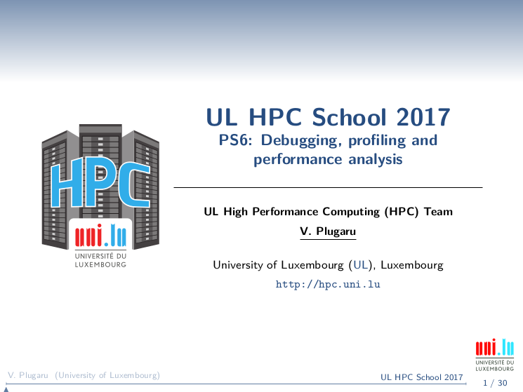

      

# UL HPC Tutorial: Advanced debugging on the UL HPC platform

     Copyright (c) 2013-2018 UL HPC Team <hpc-sysadmins@uni.lu>

The objective of this tutorial is to practice running and debugging applications on the [UL HPC clusters](https://hpc.uni.lu).

It's important that you read the [slides](https://github.com/ULHPC/tutorials/raw/devel/debugging/advanced/slides.pdf?raw=true) first.

They review:

* basic tools you can use to view and understand how your application is running
* HPC oriented debugging, profiling and analysis tools:
    - Allinea Forge (DDT+MAP) and Allinea Performance Reports
    - Intel Advisor, Inspector, ITAC and VTune Amplifier
    - Scalasca and Score-P

## Your tasks

1. Compile and make a first timed run of unmodified HPCG v3.0 (MPI only) as per the [ULHPC HPCG tutorial](http://ulhpc-tutorials.readthedocs.io/en/latest/parallel/hybrid/HPCG/)
     - full single node, use >= `80 80 80` for input params (edit `hpcg.dat`)
     - use `/usr/bin/time -v` to get details (especially as regards timing and memory usage)
2. Run HPCG (timed) through Allinea Performance Reports
     - use `perf-report` (bonus points if using `iris` to get energy metrics)
3. Instrument and measure HPCG execution with Scalasca
4. Re-compile HPCG with debugging symbols and run under Allinea DDT (GUI mode) and MAP (batch mode)

Helper notes:

* Choose your toolchain (compilers, libraries, MPI implementations):
    - `module load toolchain/intel` or
    - `module load toolchain/foss`

* Run HPCG in parallel:
    - Gaia, Chaos clusters: `mpirun -hostfile $OAR_NODEFILE ./xhpcg`
    - Iris cluster: `srun ./xhpcg`

* Run HPCG with Allinea Performance Reports:
    - Gaia, Chaos clusters: `perf-report mpirun -hostfile $OAR_NODEFILE ./xhpcg`
    - Iris cluster: `perf-report srun ./xhpcg`

* Compile and run HPCG with Scalasca/Score-P:
    - use `toolchain/foss`, `perf/Scalasca` and `perf/Score-P`
    - edit HPCG's setup file and prepend the compiler (e.g. `mpicxx`) on the the `CXX =` line with `scorep` (e.g. `CXX = scorep mpicxx`)
    - compile HPCG
    - run HPCG with Scalasca in summary mode:
      * Gaia, Chaos clusters: `scan -s mpirun -hostfile $OAR_NODEFILE ./xhpcg`
      * Iris cluster: `scan -s srun ./xhpcg`
    - generate text report `square -s scorep_xhpcg_*_sum` and see it with `cat scorep_xhpcg_*_sum/scorep.score`
