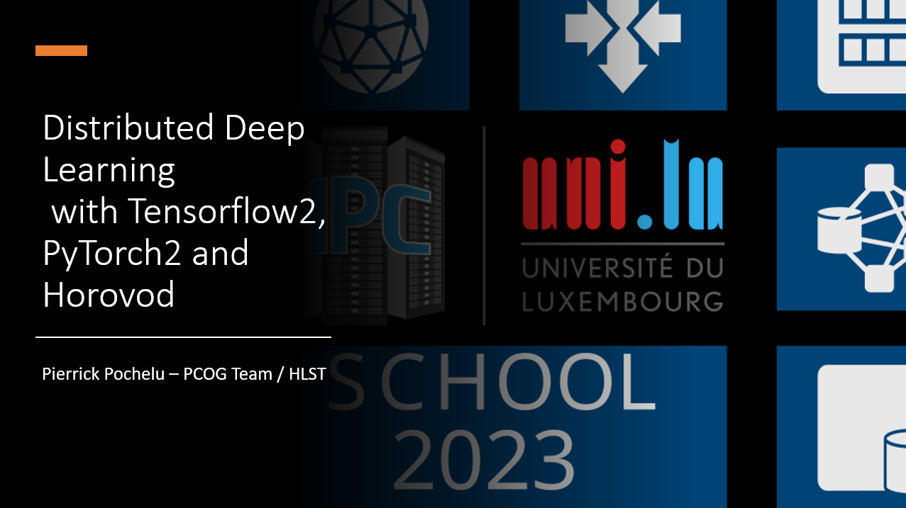

     Copyright (c) 2013-2023 P. Pochelu and UL HPC Team  <hpc-sysadmins@uni.lu>

# Horovod

[](slides.pdf)


Horovod ([website](https://horovod.readthedocs.io/en/stable/)) is a framework for scaling training based on the Ring All-Reduce protocol. Unlike approaches that use a centralized memory for aggregating and broadcasting weights' updates during stochastic gradient descent (SGD) computations, Horovod takes advantage of the computing machine's communication links, such as NVLink, to maximize performance. Horovod integrates with popular modern deep learning frameworks like Keras2, TensorFlow2, PyTorch2, with a few code changes making it easy to incorporate into existing workflows.

By using Horovod, you can attempt to accelerate the distributed training time *T* compared to the time for a single accelerator *G*. However, communication can reduce scalability, and the batch size is often inversely proportional to the communication time.

The theoretical estimation for *T* is *T=G/W+C(W)*, with *W* the number of workers, and *C* the communiction time between workers.

## Pre-requiste
It is assumed you already use a modern deep learning framework like Tensorflow2 or PyTorch2.


## Installation

ULHPC team propose either to load a previously installed or you can install it yourself. 

Pre-installed approach:

```Bash
source /work/projects/ulhpc-tutorials/PS10-Horovod/env.sh
```

We strongly recommend to use the provided environment. However, if you want to install it yourself, we provide help in the appendix 1.

The following command ensures that you can now use Horovod:

```Bash
horovodrun --check-build
```

The command should produce the following output:

```Bash
Available Frameworks:
    [X] TensorFlow
    [X] PyTorch
    [ ] MXNet

Available Controllers:
    [X] MPI
    [X] Gloo

Available Tensor Operations:
    [X] NCCL
    [ ] DDL
    [ ] CCL
    [X] MPI
    [X] Gloo
```

Ensures that the deep learning framework you wish to use is checked, along with MPI and NCCL.

<!-- 
# HPC/AI methodology

To assess how your workload can benefit from using Horovod, it is recommended to perform one of the following analyses:

* **Strong Scalability Analysis**. It consists in fixing the AI workload behaviour (Batch size, model, ...) and scaling the number of machine. By increasing the computational resources while maintaining the other workload characteristics, you can observe the impact of scaling on the training speed.

* **Weak Scalability Analysis**. It consists in fixing a number of AI-accelerator (e.g, 4) and scale a characteristic of the AI workload, such as the number of layers. This analysis helps understand how a parameter affects the accuracy, scalability and speed of the workload when varying a specific aspect.
-->

## Horovod typical code

The proposed codes contains the following blocks of codes:

1. **Initalizing Horvod**. The Horovod object it is generally named "hvd". It contains collective communication primitives and callbacks.
1. **Adaptating the local_batch** according the desired global_bath_size and the number of workers
1. **Pinning AI-accelerator** to workers in a bijective way
1. **Creating data generators** which will transfer asynchronously and efficiently data samples Disk->RAM->VRAM. The transfer between I/O to RAM is a "shard" and from the RAM to the VRAM the "local batch".
1. **Building the neural network** in each GPU VRAM
1. **Training** it
1. Evaluating it (time & accuracy)

Bonus : You can add some features (e.g, Horovod callbacks) for adding more features to your code but they come with a speed overheads. Example: verbosity, monitoring the validation metric, regular checkpointing after each epoch, learning rate scheduling with loss plateau detection, ...

Proposed code samples:

[Test code for checking horovod initialization](app/test_horovod.py)

[ULHPC Tensorflow/Keras code example](app/tensorflow_horovod.py)

[ULHPC Torch code example](app/pytorch_horovod.py)

[Official Horovod code examples](https://github.com/horovod/horovod/tree/master/examples)

## Testing multi-node multi-GPU Horovod

For testing large-scale training we launch test_horovod.py on 2 nodes, each node containing 4 GPUs

Script multinode-multigpu-test.sh:
```Bash
#!/bin/sh -l
#SBATCH -c 2              # 2 CPU-core for each process
#SBATCH -N 2              # 2 nodes
#SBATCH -p gpu
#SBATCH --gpus-per-node 3 # Each process will see 3 GPUs
#SBATCH -t 30
#SBATCH --export=ALL

mpirun -n 6 python test_horovod.py
```

```Bash
sbatch multinode-multigpu-test.sh
```

The SLURM correctly output:
```Bash
List of TF visible physical GPUs :  [PhysicalDevice(name='/physical_device:GPU:0', device_type='GPU'), PhysicalDevice(name='/physical_device:GPU:1', device_type='GPU'), PhysicalDevice(name='/physical_device:GPU:2', device_type='GPU')]
MPI_size = 6, MPI_rank = 0, MPI_local_size = 3,  MPI_local_rank = 0 platform = iris-179
List of TF visible physical GPUs :  [PhysicalDevice(name='/physical_device:GPU:0', device_type='GPU'), PhysicalDevice(name='/physical_device:GPU:1', device_type='GPU'), PhysicalDevice(name='/physical_device:GPU:2', device_type='GPU')]
MPI_size = 6, MPI_rank = 1, MPI_local_size = 3,  MPI_local_rank = 0 platform = iris-180
List of TF visible physical GPUs :  [PhysicalDevice(name='/physical_device:GPU:0', device_type='GPU'), PhysicalDevice(name='/physical_device:GPU:1', device_type='GPU'), PhysicalDevice(name='/physical_device:GPU:2', device_type='GPU')]
MPI_size = 6, MPI_rank = 2, MPI_local_size = 3,  MPI_local_rank = 1 platform = iris-179
List of TF visible physical GPUs :  [PhysicalDevice(name='/physical_device:GPU:0', device_type='GPU'), PhysicalDevice(name='/physical_device:GPU:1', device_type='GPU'), PhysicalDevice(name='/physical_device:GPU:2', device_type='GPU')]
MPI_size = 6, MPI_rank = 4, MPI_local_size = 3,  MPI_local_rank = 2 platform = iris-179
List of TF visible physical GPUs :  [PhysicalDevice(name='/physical_device:GPU:0', device_type='GPU'), PhysicalDevice(name='/physical_device:GPU:1', device_type='GPU'), PhysicalDevice(name='/physical_device:GPU:2', device_type='GPU')]
MPI_size = 6, MPI_rank = 3, MPI_local_size = 3,  MPI_local_rank = 1 platform = iris-180
List of TF visible physical GPUs :  [PhysicalDevice(name='/physical_device:GPU:0', device_type='GPU'), PhysicalDevice(name='/physical_device:GPU:1', device_type='GPU'), PhysicalDevice(name='/physical_device:GPU:2', device_type='GPU')]
MPI_size = 6, MPI_rank = 5, MPI_local_size = 3,  MPI_local_rank = 2 platform = iris-180
```

## Examples

### Tensorflow2

Running tensorflow2 code with **1 GPU**:

```Bash
$ mpirun -n 1 python tensorflow_horovod.py
[...]
Epoch 4/4
195/195 - 147s - loss: 0.1119 - 147s/epoch - 753ms/step
Loss:  1.7116930484771729  accuracy:  0.4459134638309479
```

Running tensorflow2 code with **2 GPUs**:

```Bash
$ mpirun -n 2 python tensorflow_horovod.py
[...]
Epoch 4/4
Epoch 4/4
195/195 - 92s - loss: 0.1164 - 92s/epoch - 472ms/step
195/195 - 92s - loss: 0.1173 - 92s/epoch - 469ms/step
Loss:  1.3920882940292358  accuracy:  0.5380609035491943
Loss:  1.3958407640457153  accuracy:  0.5354567170143127
```

The training time are improved by using 2 GPUs compared to 1.

### PyTorch2

Running PyTorch2 code with **1 GPU**:

```Bash
$ mpirun -n 1 python pytorch_horovod.py
[...]
Epoch: 4 141 sec.
Loss:  -0.7153724431991577  accuracy:  0.7164999842643738
```

Running PyTorch2 code with **2 GPUs**:

```Bash
$ mpirun -n 2 python pytorch_horovod.py
[...]
Epoch: 4 85 sec.
Loss:  -0.6600856781005859  accuracy:  0.6620000004768372
Epoch: 4 85 sec.
Loss:  -0.6600856781005859  accuracy:  0.6620000004768372
```

The prediction quality remains similar (around 70% +/- 4%) however the training time with 2 GPUs is 1.65 times faster.

## Going further towards scalability

Bigger batch reduce the communication need. If your are facing scalability issue increase the batch size.

* Large Batch Size (LBS) such as >1024 may hurts the convergence, for mitigating this: 
    *  Learning Rate scheduling. This can help compensate for the challenges posed by larger batch sizes and aid in achieving better convergence.
    *  Adam optimizer offers better experimental results than SGD. The adaptive nature of the Adam optimizer can help alleviate some of the convergence issues associated with LBS. [This blog post](https://medium.com/mini-distill/effect-of-batch-size-on-training-dynamics-21c14f7a716e)
    *  Adapting the neural network architecture for scalability. For example, some suggest that wider model can scale better: [L Chen et al 2018](https://proceedings.neurips.cc/paper/2018/file/e7c573c14a09b84f6b7782ce3965f335-Paper.pdf)


## Appendices 

### Appendix 1: Install Horovod yourself

Before installing Horovod you need to get dependendices: MPI, CUDA, CUDNN, NCCL. All of them requires matching versions :)

There are some already installed software for helping you in the horovod installation quest.

The provided script sets up the environment variables required for installing Horovod's dependencies. 

```Bash
HPCAI_ROOT="/work/projects/ulhpc-tutorials/PS10-Horovod/"

# MPI, CUDA, and compilers
module load toolchain/intelcuda

# CUDNN
export CUDNN_PATH=${HPCAI_ROOT}/soft/cudnn/install/cudnn-linux-x86_64-8.8.1.3_cuda11-archive
export LD_LIBRARY_PATH=${CUDNN_PATH}/lib/:${LD_LIBRARY_PATH}
export CPATH=${CUDNN_PATH}/include/:${CPATH}

# NCCL
NCCL_DEBUG=INFO # allow to check if NCCL is active
# NCCL_ROOT=${HPCAI_ROOT}/miniconda/install/miniconda/lib/python3.10/site-packages/nvidia/nccl/ #nccl also present there
NCCL_ROOT=/work/projects/ulhpc-tutorials/PS10-Horovod/soft/nccl/install/nccl_2.17.1-1+cuda11.0_x86_64/
NCCL_INCLUDE_DIR=${NCCL_ROOT}/include/
NCCL_LIBRARY=${NCCL_ROOT}/lib/

LD_LIBRARY_PATH=${NCCL_ROOT}/lib/:${LD_LIBRARY_PATH}
CPATH=${NCCL_ROOT}/include/:${CPATH}

HOROVOD_NCCL_HOME=${NCCL_ROOT}
HOROVOD_NCCL_INCLUDE=${NCCL_ROOT}/include/
HOROVOD_NCCL_LIB=${NCCL_ROOT}/lib/

# HOROVOD
HOROVOD_GPU_OPERATIONS=NCCL
HOROVOD_WITH_TENSORFLOW=1
HOROVOD_WITH_PYTORCH=1
HOROVOD_WITH_MPI=1

# GIVE XLA CUDA PATH
export XLA_FLAGS=--xla_gpu_cuda_data_dir=/opt/apps/resif/iris-rhel8/2020b/gpu/software/CUDAcore/11.1.1/
```

Now let's install Horovod with NCCL (1 single command):
```Bash
HOROVOD_GPU_OPERATIONS=NCCL HOROVOD_NCCL_INCLUDE=$HOROVOD_NCCL_INCLUDE HOROVOD_NCCL_LIB=$HOROVOD_NCCL_LIB pip install --no-cache-dir --force-reinstall horovod
```

### Checking Horovod

The following command ensures that you can now use Horovod:

```Bash
horovodrun --check-build
```

The command should produce the following output:

```Bash
Available Frameworks:
    [X] TensorFlow
    [X] PyTorch
    [ ] MXNet

Available Controllers:
    [X] MPI
    [X] Gloo

Available Tensor Operations:
    [X] NCCL
    [ ] DDL
    [ ] CCL
    [X] MPI
    [X] Gloo
```

Ensures that the deep learning framework you wish to use is checked, along with MPI and NCCL.

### Appendix 2: 

Bigger batch reduce the communication need. If your are facing scalability issue increase the batch size.

* Large Batch Size (LBS) such as >1024 may hurts the convergence, for mitigating this:
    *  Learning Rate scheduling. This can help compensate for the challenges posed by larger batch sizes and aid in achieving better convergence.
    *  Adam optimizer offers better experimental results than SGD. The adaptive nature of the Adam optimizer can help alleviate some of the convergence issues associated with LBS. https://medium.com/mini-distill/effect-of-batch-size-on-training-dynamics-21c14f7a716e
    *  Re-thinking the neural network architecture for scalability https://proceedings.neurips.cc/paper/2018/file/e7c573c14a09b84f6b7782ce3965f335-Paper.pdf


