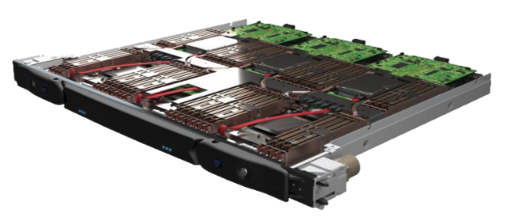

# Essential concepts and prerequisites

## Essential Concepts

The following information is intentionally simplified so as not to overwhelm the first time user. It is not overly technical and should be read in about 15 minutes.  
It is thus imprecise and users willing to go further can read more detailed information on the [ULHPC technical documentation](https://hpc-docs.uni.lu/) page.

It is recommended to read it as it introduces basic concepts and should give you a broad picture about what HPC clusers are and how they are used.

### HPC clusters

The University currently possesses two **HPC clusters**, namely *Aion* and *Iris*.  
**HPC clusters** differ from traditional computers by their size and power. They are housed in a **data center** and, compared to a standard laptop (8 to 16 cores, 8 to 16GB of RAM), are much more powerful (45312 cores, 90624GB of RAM for Aion).

  
*The Aion cluster*


A **cluster** is composed of **nodes**.  
A **node** is a *single physical machine* (for Aion, 128 cores and 256GB of RAM). It is connected to the other nodes of the cluster through a **fast interconnect**; a fiberoptics connection that vastly outperforms a *standard* ethernet connection (100Gb bandwidth with a latency --the time for the information to travel-- of a couple of nanoseconds vs 1Gb bandwidth and a latency counted in microseconds). This is especially important if your workload does not fit on a single node.

  
*A server blade containing three Aion nodes*

Users share the cluster but get **dedicated resources**, so as not to interfere with the other users.  
The resources are reserved for a **predetermined amount of time** and are released after the user's workload completes or the reservation expires, whichever comes first.

A cluster can be composed of multiple **partitions**. A partition is a set of *homogeneous nodes*.  
Aion has only one partition whereas Iris has three (CPU, GPU and Large memory nodes, which are standard CPU nodes with additional RAM -- 3TB instead of 128GB on the standard iris nodes).

You can find more detailed information about the clusters and interconnect [here](https://hpc-docs.uni.lu/systems/) and [here](https://hpc-docs.uni.lu/interconnect/ib/).

### Storage

All the nodes (of both clusters) are connected to a networked storage, making all the data accessible from any node on both clusters.  
The storage is shared between our users (the total represents more than 4000 GB of storage space). Each user gets access to a personnal storage space (the 'home' directory) of 500GB as well as a scratch space of 10TB (temporary workspace that can be wiped at any moment).

In both case, the HPC storage should **not** be considered as a *long term storage* for your files as it **not backed up**.

You can find more detailed information about the storage [here](https://hpc-docs.uni.lu/filesystems/).

### Using the clusters

#### Access nodes
When connecting to either cluster, you will land on its **access node**.
**Access nodes** are a resource shared by all connected users and should only be used for resource reservation. Running computational heavy worloads is frowned upon as it makes the access node slow or unresponsive for **everyone else**.

#### Command line
The main mean of interaction with the clusters is the command line as it doesn't waste a many resources as a graphical user interface (we are here for high performance computing, are we not?).  
The command line can be intimidating for newcomers but we provide a [crash course](../cli/index.md) that should help demystifying it.

#### Getting computational resources
Computationally intensive workloads are meant to be run on **compute nodes**.  
Getting resources on compute nodes is done through a **resource manager**, which in our case is **SLURM**. 

As the cluster is shared by many users, the resources you need might not be available right away. SLURM's job is to manage all the resource requests and hand the resources as **fairly** as possible to all our users when they **become available**. Resources are not given in a first come, first served basis.

When you submit a job, it is added to a **queue** and **prioritized**. Once your job reached the top of the queue, the requested resources are allocated and your job starts.  
The more computation your are running over a time period, the less prioritary your jobs become.  
The less resources you request (and for a smaller duration), the more likely it is for SLURM to schedule your job earlier.  

It is not unusual to have users submit big experiment campaigns of more than 50 jobs. As their jobs start and complete, their priority is reevaluated and the jobs of more infrequent users might get a better place in the queue.

### Authenticating on the clusters

The connection to the ULHPC clusters requires to authenticate yourself using an SSH key pair for more security.  
Read the following section to learn about them.

#### What is an SSH key pair ?

SSH keys are used to authenticate a user on a server without exchanging a password and encrypting the communication.

It is composed of two separate keys:

* **a public key** that can be used by anyone to *encrypt* messages
* **a private key** that **should never be shared** and that is used to *decrypt* messages encrypted by the associated public key.

#### Why not use passwords ?

When you request a connection to a server while authenticating with an SSH key pair, it sends you its public key (encrypted by the server's private key). Using your private key, your are able to decrypt the message and get the server's public key.  
Once the connection is established, you are thus able to send encrypted messages to each other.

This way, no password is ever exchanged between you and the server and, unless an attacker gets a hold on your private key, you can consider the communication between you and the server as secured thanks to the encryption.

#### Secure your ssh key pair

A third party might still get a hold of your private key (e.g. trojan infection, stolen laptop, ...). How can you protect your private key?

Well, during the creation of the key pair, the key generation utility will ask you for a passphrase which will be used to encrypt the access to the private key. The longer the passphrase, the most secure your private key is. It is strongly recommended **not** to leave the passphrase field blank.

## Prerequisites

### Request an Account

Please read the Acceptable Use policy [here](https://hpc-docs.uni.lu/accounts/#how-to-get-an-new-user-account) and fill the form to request an account.  
A ULHPC system administrator will process your request and create your account. This procedure is manual and might take a few days.  
You will then receive an email with your username and a temporary password.  

```plain
Please note that this password is only valid for 24h. 
If it expires, you will have to request a new one.
```

### Software Requirements

* This step is specific to each operating system
* For Linux and MacOS, out of the box options (i.e. terminals) are available but can be customized.
* For Windows, multiple approaches are possible
	* **Recommended if you are not familiar with the command line:** Install [MobaXterm](https://mobaxterm.mobatek.net/) which provides a terminal emulator as well as a graphical interface for configuration and utilities for data transfer.
	* **Recommended to users familiar with linux and the command line:** Install and use [WSL](https://learn.microsoft.com/en-us/windows/wsl/install) (Windows Subsystem for Linux). Basically, an ubuntu installation nested inside your windows installation.

