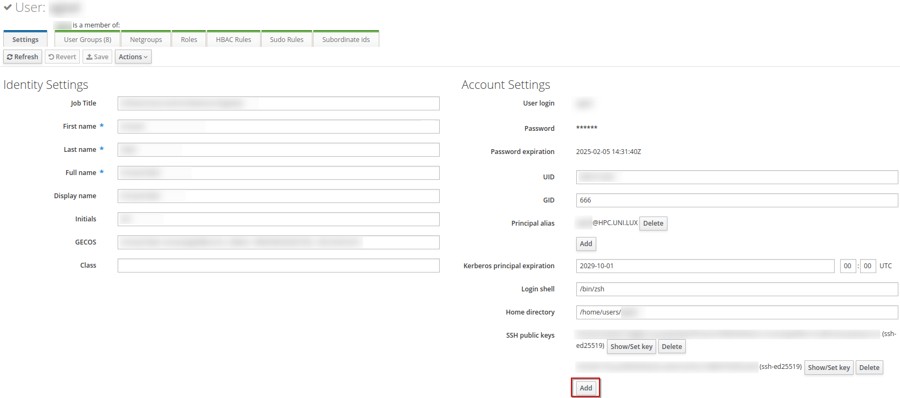
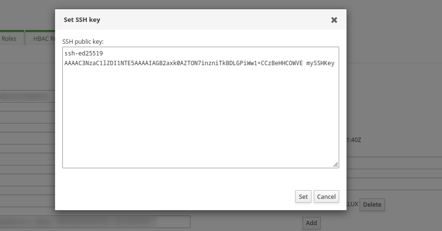
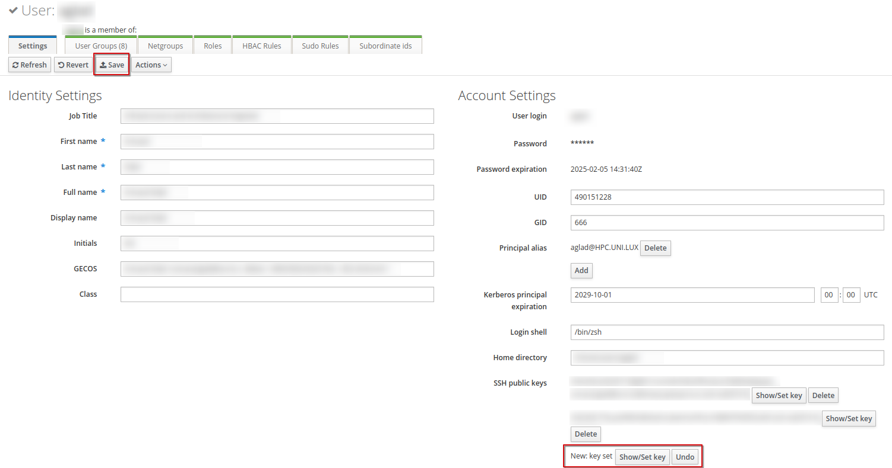

# First Connection 

All of the following is meant to be run from your machine.

## Step 1: Generate and Register your SSH Key pair

Be sure you fulfill the [prerequisites](../../concepts/index.md#prerequisites).

### What is an SSH key pair and why use it ?

Confused by SSH keys, you can read a quick explanation [here](../../concepts/index.md#authenticating-on-the-clusters).  
Do not forget to [secure](../../concepts/index.md##secure-your-ssh-key-pair) them properly.

### How do I create my key pair1 ?

* Open your favorite terminal
* Enter the following command: ```$ ssh-keygen -t ed25519 -a 100```
	* By default, the key pair will be saved in your home directory in the hidden '.ssh' directory as ed25519 (for the private key) and ed25519.pub (for the public key)
	* You can rename the keypair to something more explicit if you whish so (either by answering the prompt or by adding the following flag to the previous command: ```-f newname```). 
		* Be careful not to overwrite an existing key pair with the same name.
		* It is recommended to put your key in the *.ssh* directory at the root of your home directory.
	* You can check that the keys have been created by running the following command: ```$ ls ~/.ssh```. 

## Step 2: Register your SSH public key

Our identity manager is called IPA and is available [here](https://hpc-ipa.uni.lu).

* Log in on IPA with your HPC credentials (the login you received in your account activation email, usually the first letter of you first name followed by your last name).
* Select Identity/Users
* Select your login
* On the right column, you can see a SSH public key section
* Click Add, paste the content of your public key file and click on Set




* You can see that a new key has been set
* Click the Save button before leaving IPA



## Step 3: First connection

* You can use the following commands to connect the ULHPC.

```$ ssh yourlogin@access-aion.uni.lu -p 8022 -i path-to-your-ssh-key``` for the aion cluster  
```$ ssh yourlogin@access-iris.uni.lu -p 8022 -i path-to-your-ssh-key``` for the iris cluster

* Upon running the command, your machine will ask you to confirm the connection:

```plain
The authenticity of host '[access-aion.uni.lu]:8022 (<no hostip for proxy command>)' can't be established.
ED25519 key fingerprint is SHA256:jwbW8pkfCzXrh1Xhf9n0UI+7hd/YGi4FlyOE92yxxe0.
This key is not known by any other names.
Are you sure you want to continue connecting (yes/no/[fingerprint])?
```

Type 'yes' to accept

* If you secured your SSH key pair with a password (which you should), you will be prompted with the following:

```plain
Warning: Permanently added '[access-aion.uni.lu]:8022' (ED25519) to the list of known hosts.
Enter passphrase for key '/home/aglad/.ssh/id_ed25519':
```

Enter your password and you will be greeted with the following output:

```plain
================================================================================
  Welcome to access2.aion-cluster.uni.lux
  WARNING: For use by authorized users only!
            __  _    _                ____ _           _          __
           / / / \  (_) ___  _ __    / ___| |_   _ ___| |_ ___ _ _\ \
          | | / _ \ | |/ _ \| '_ \  | |   | | | | / __| __/ _ \ '__| |
          | |/ ___ \| | (_) | | | | | |___| | |_| \__ \ ||  __/ |  | |
          | /_/   \_\_|\___/|_| |_|  \____|_|\__,_|___/\__\___|_|  | |
           \_\                                                    /_/

=== Support and community ======================================================

  - Technical Docs ........... https://hpc-docs.uni.lu
  - Discourse / Forum ........ https://hpc-discourse.uni.lu/
  - Helpdesk / Service Now ... https://hpc.uni.lu/support
  - User Mailing-list ........ hpc-users@uni.lu

=== HPC utilization as of 2024-10-07 11h15 =====================================

  AION  batch    33.69%
  IRIS  batch    29.04%
  IRIS  gpu      39.58%
  IRIS  bigmem   79.02%

=== Status =====================================================================

  ULHPC live status: https://hpc.uni.lu/live-status/motd

================================================================================
Last login: Mon Oct  7 11:17:43 2024 from 92.94.140.142
```

## Step 4: Simplifying the connection process

We can connect to both clusters but the command is a bit long to type and you have to input your password every time. The following section simplifies the connection process.

### Setting up a .ssh/config file

On Linux / Mac OS / Unix / WSL, your SSH configuration is defined in ```~/.ssh/config```.

Open your favorite text editor, update your username ('yourlogin', three lines from the end) and save the following in ```~/.ssh/config```.

```bash
# ~/.ssh/config -- SSH Configuration
# Common options
Host *
    Compression yes
    ConnectTimeout 15

# ULHPC Clusters
Host iris-cluster
    Hostname access-iris.uni.lu

Host aion-cluster
    Hostname access-aion.uni.lu

Host *-cluster
    User yourlogin  # <-- replace 'yourlogin' with your username
    Port 8022
    ForwardAgent no
```

Once the configuration is in place, you cann conect to the clusters using the following commands: 
```$ ssh aion-cluster``` for AION  
```$ ssh iris-cluster``` for IRIS

### SSH agent

To use the SSH key in a public key authentication scheme, you need to load your key in a SSH agent.
Depending on your distribution, the key registration might be automatic and this step not necessary.

If you can connect with the ```ssh aion-cluster``` command without issue and without inputting your password every time, you can skip this step. Otherwise, run the following commands.

* Make run your ssh-agent is running  
```bash
$ eval "$(ssh-agent)"
```
* Add your key  
```bash
(laptop)$> ssh-add ~/.ssh/your-private-key          # <-- replace with the path to your private key
Enter passphrase for ~/.ssh/your-private-key:       # <-- enter your passphrase here
Identity added: ~/.ssh/your-private-key (<login>@<hostname>)
```  

You should now be able to connect to both clusters without having to enter your password each time.

## Going further

You can a more advanced and complete SSH documentation on the [hpc-docs.uni.lu](https://hpc-docs.uni.lu/connect/ssh/) portal, including tunneling, port forwarding and troubleshooting.