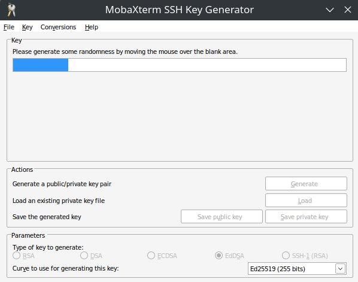
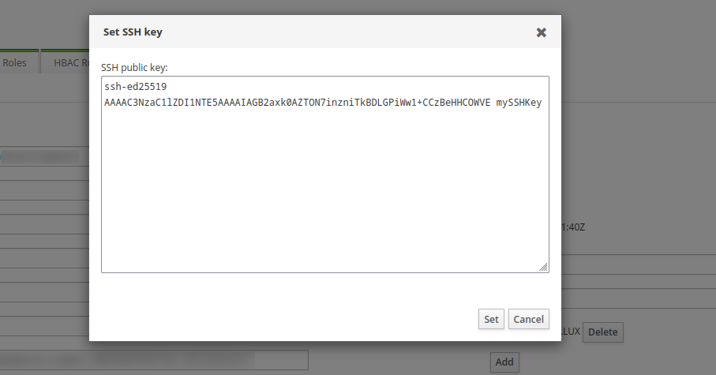
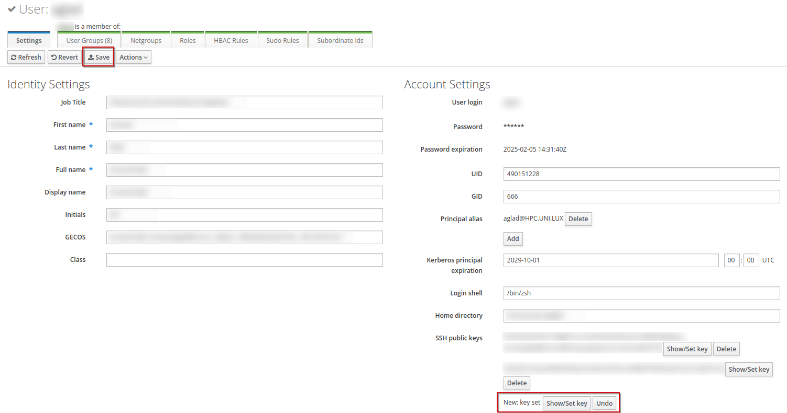
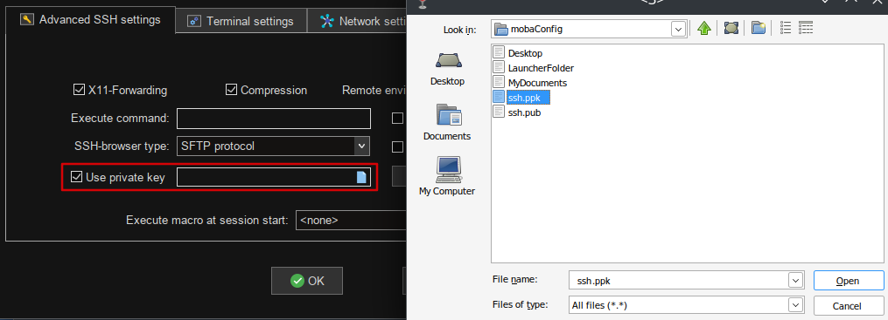

# First Connection (MobaXterm)
All of the following is meant to be run from your machine.

## Step 1: Install an configure MobaXterm

* Download [MobaXterm Home Edition](https://mobaxterm.mobatek.net/download-home-edition.html)
	* You can use the portable edition (no installation, just an executable you can extract anywhere),
	* or the installer version (requires to be installed but adds shortcuts to find it easily)
* Open MobaXterm and go to the configuration screen
	
* Change the persistent home directory to a folder of your choice on your machine (a directory in the documents directory or on the desktop are good options). 
	

## Step 2: Generate and Register your SSH Key pair

Be sure you [requested an account](../../concepts/index.md#prerequisites) and completed the activation procedure before continuing.

### What is an SSH key pair and why use it ?

Confused by SSH keys? you can read a quick explanation [here](../../concepts/index.md#authenticating-on-the-clusters).  
Do not forget to [secure](../../concepts/index.md#secure-your-ssh-key-pair) them properly.

### How do I create my key pair ?

* Go to the MobaKeyGen screen
	
	

* First, change the parameters and select the EdDSA encryption. Make sure the box has the Ed25519 curve selected.
* Then, click on the generate button
	
	

* Move your mouse in the area under the progress bar to help the random number generation progress faster
	
	

* Finally, input a passphrase to encrypt your private key (do not forget the password as you will need it to unlock your key before using it) and save both the public and private keys in a place you will remember.
	* It is customary to use .pub extension but windows usually associate it with MS Publisher files, which might cause you issues when trying to open the file. As the public key is just a text file, you can use the .txt extension.
	
	

## Step 3: Register your SSH public key

The next step is registering your public key on the ULHPC so that the server can authenticate you.
Our identity manager is called IPA and is available [here](https://hpc-ipa.uni.lu).

* Log in on IPA with your HPC credentials (the login you received in your account activation email, usually the first letter of your first name followed by your last name).
* Select Identity/Users
* Select your login
* On the right column, you can see a SSH public key section
* Click Add, paste the content of your public key file and click on Set




* You can see that a new key has been set (bottom right)
* Click the Save button before leaving IPA (top left)



## Step 4: First connection

We will create two bookmarks, as there are two clusters (see [HPC clusters](../../concepts#hpc-clusters)); one for aion and one for iris.

* First, wewill create a bookmark for aion. Click on the Session button and then on SSH.


* Fill the 'Basic SSH settings'
	* The remote host will be: ```access-aion.uni.lu```
	* Check 'Specify username' and enter your HPC username
	* Set the port to *8022*


* In the 'Advanced SSH settings' tab
	* Check 'Use private key'
	* Click on the blue icon in the field and select your **private** key (It should have a ppk extension).
	* Click OK



* Do the same and create another bookmark for iris
	* Follow the same procedure as for aion
	* In the 'Basic SSH settings', set the remote host to ```access-iris.uni.lu```
	* All other paramters stay the same, both for the basic and advanced SSH settings


* Double click on one of the bookmarks
	* Accept the warning about the unknown server identity. You can check that the server's public key matches the relevant one below by clicking on *'More info...'*
		* Aion's public key is ```SHA256:jwbW8pkfCzXrh1Xhf9n0UI+7hd/YGi4FlyOE92yxxe0```
		* Iris's public key is ```SHA256:tkhRD9IVo04NPw4OV/s2LSKEwe54LAEphm7yx8nq1pE```

	

	* enter your private ssh key passphrase
		* Note that when you type the passphrase, nothing gets inputed in the terminal. This is normal; type anyway then hit enter.

	

	* You are connected!

	

### Troubleshooting

Here are common errors you might encounter and possible solutions. If nothing works, you can always open a ticket in the [HPC service now category](https://service.uni.lu/sp?id=sc_cat_item&sys_id=9c88bd8bdbb38090c15598f3db9619c1&sysparm_category=9c992749db8f84109aa59ee3db96196f).

#### Connection timeout  
You probably use an internet connection that filters out the 8022 port.  
Try to use Eduroam or ethernet.
#### No route to host  
Check that there is no typo in your configuration.
#### Permission denied  
* You may have forgotten to copy your public key in IPA.
* Check if you copy pasted correctly your key in IPA.
* If you already had other SSH keys, ensure you use the correct key to connect.


## Step 5: Enable the SSH agent

Tired of typing your passphrase at each connection?

* Go to the configuration menu.

	

* In the SSH tab
	* 1. Activate the agent.
	* 2. Click on the + sign to add your key.

	

* Back to the general tab, click on the password management button.
	
	

* Check the 'save SSH keys passphrases checkbox' and set the saving policy to 'ask'.

	

* Validate and restart MobaXterm and connect to the cluster.

* Input your SSH key password.

	

* Validate the request to save the password.

	

* Moba will ask you for a master password. It will be used to encrypt the locally stored password of your SSH key.
	* The better option security wise would be at every MobaXterm startup but for convenience (i.e. never), the first option is acceptable.
	
	

* Your are now able to connect without password input while keeping your key safe.

## Step 6: What is the next step?

You are connected now but how do you actually use the HPC clusters?

* If the terminal or commands like ```cd```, ```mkdir``` or ```rsync``` confuse you, there is a crash course on basic commandline usage [here](link).
* If you know your way with the command line and can find the command to extract a .tar.bz2, you can continue and read about getting resources [here](link).