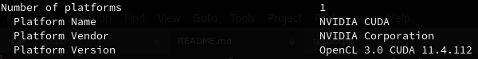

[](https://hpc.uni.lu) [](http://www.gnu.org/licenses/gpl-3.0.html) [](https://github.com/ULHPC/tutorials/issues/) [](https://github.com/ULHPC/tutorials/raw/devel/gpu/opencl/slides.pdf) [](https://github.com/ULHPC/tutorials/tree/devel/gpu/opencl/) [](http://ulhpc-tutorials.readthedocs.io/en/latest/gpu/opencl/) [](https://github.com/ULHPC/tutorials)

# Introduction to OpenCL Programming (C/C++)

     Copyright (c) T. Carneiro, L. Koutsantonis, 2021 UL HPC Team <hpc-team@uni.lu>

[](https://github.com/ULHPC/tutorials/raw/devel/gpu/openacl/slides.pdf)

In the HPC school, the students had the opportunity to work with a higher-level heterogeneous programming model based on directives, called **OpenACC**. In this programming model, the parallelism is implicit, which means that the compiler is responsible for the parallelization, which might not work in all scenarios. However, OpenACC is a proprietary parallel programming model and it is supported by a limited set of devices, such as NVIDIA GPUs. 

## What's OpenCL?

OpenCL came as a **standard** for heterogeneous programming that enables a code to run in different platforms, such as multicore CPUs, GPUs (AMD, Intel, ARM), FPGAs, Apple M1, tensor cores, and ARM processors with minor or no modifications. 

Furthermore, differently from OpenACC, the programmer has **full control** of the hardware and is **entirely** responsible for the parallelization process.

However, this portability has a cost, that’s the reason why OpenCL exposes the programmer to a **much lower level** compared to OpenACC or even CUDA. 


## OpenCL's target audience:

The target audience of OpenCL consists of programmers that aim at programming portable heterogeneous code and that want full control of the parallelization process.

------------------------------


In this introductory tutorial, we teach how to perform the sum of two vectors `C=A+B` on the OpenCL device and how to retrieve the results from the device memory.


# Objectives of this tutorial:

The **main objective** of this tutorial is to introduce for students of the HPC school the heterogeneous programming standard - OpenCL. A **secondary objective** is to show what is behind the higher-level heterogeneous programming libraries, so it is possible to understand how they work. 

## This tutorial covers the following aspects of OpenCL programming:


- Check for OpenCL-capable device(s);
- Memory allocation on the device;
- Data transfer to the device;
- Retrieve data from the device;
- Compile C/C++ programs that launch OpenCL kernels.

# References:

This tutorial is based on the following content from the Internet:

[0]: ./code "code"
[1]: https://programmerclick.com/article/47811146604/ "Tutorial: Simple start with OpenCL and C++" 
[2]: https://www.khronos.org/registry/OpenCL/ "Khronos OpenCL Working Group. The OpenCL Specification (Oct. 2021)"
[3]: https://www.eriksmistad.no/getting-started-with-opencl-and-gpu-computing/ "Smistad, E. Getting started with OpenCL and GPU Computing, Feb. 22, 2018 (Access on Oct. 28, 2021)."
[4]: https://www.nersc.gov/assets/pubs_presos/MattsonTutorialSC14.pdf "Mattson, T., McIntosh-Smith, S.,  Koniges, A. OpenCL: a Hands-on Introduction"

- [Tutorial: Simple start with OpenCL and C++][1]
- [Khronos OpenCL Working Group. The OpenCL Specification (Oct. 2021)][2]
- [Smistad, E. Getting started with OpenCL and GPU Computing, Feb. 22, 2018 (Access on Oct. 28, 2021).][3]
- [Mattson, T., McIntosh-Smith, S.,  Koniges, A. OpenCL: a Hands-on Introduction][4]

--------------------
# Programming Pre-requisites: #

- C/C++ language and, due to the lower level of OpenCL, 
- (preferable) knowledge in other frameworks for heterogeneous programming, such as CUDA, OpenACC or SYCL. 

--------------------

# Connecting to a GPU-enable node on the Iris Cluster #

Ensure you can [connect to the UL HPC clusters](https://hpc-docs.uni.lu/connect/access/).
In particular, recall that the `module` command **is not** available on the access frontends.

Access to the ULHPC [iris](https://hpc-docs.uni.lu/systems/iris/) cluster  (here it is the only one featuring GPU nodes):

```bash
(laptop)$>  ssh iris-cluster 
```

Now you'll need to pull the latest changes in your working copy of the [ULHPC/tutorials](https://github.com/ULHPC/tutorials) you should have cloned in `~/git/github.com/ULHPC/tutorials` (see ["preliminaries" tutorial](../../preliminaries/))

``` bash
(access)$> cd ~/git/github.com/ULHPC/tutorials
(access)$> git pull
```

## Accessing a GPU-equipped node of the Iris cluster

This practical session assumes that you reserve a node on `iris` with one GPU for interactive development.
See [documentation](https://hpc-docs.uni.lu/jobs/gpu/)

```bash
### Have an interactive GPU job
# ... either directly
(access)$> si-gpu
# ... or using the HPC School reservation 'hpcschool-gpu' if needed  - use 'sinfo -T' to check if active and its name
# (access)$> si-gpu --reservation=hpcschool-gpu
$ nvidia-smi
```
Driver is loaded, but we still need to load the CUDA development kit from the latest software set.

```bash
$ resif-load-swset-devel
$ module load system/ULHPC-gpu/2020b
```

--------------------
# Verifying the OpenCL Installation #

First of all, it is necessary to verify if there is an OpenCL-capable device correctly installed by using the `clinfo` command. **This command is not available on the Iris cluster**. 

If OpenCL is correctly installed, the output of `clinfo` should return the number of OpenCL-capable devices, the OpenCL version and the name(s) of the device(s), as one can see below.




In this example of output, the OpenCL 3.0 version from the CUDA toolkit is installed. Moreover, there is one OpenCL-capable device, a NVIDIA Quadro RTX 5000 GPU. 

Refer to the [code folder][0] for the complete example.

----------------------


# The OpenCL platform model

The platform model of OpenCL is similar to the one of the CUDA programming model. In short, according to the [OpenCL Specification][2], *"The model consists of a **host** (usually the CPU) connected to one or more OpenCL **devices** (e.g., GPUs, FPGAs). An OpenCL device is divided into one or more compute units (CUs) which
are further divided into one or more processing elements (PEs). Computations on a device occur
within the processing element"*


An OpenCL program consists of two parts: *host* code and *device* code. As the name suggests, the host code is executed by the *host* and also *"submits the kernel code as commands from the host to OpenCL devices"*.

Finally, such as in the CUDA programming model, the *host* communicates with the *device(s)* through the global memory of the device(s). As in the CUDA programming model, there is a memory hierarchy on the device. However, we have omitted these details for the sake of greater simplicity.

------------------
# Writing a First OpenCL Program

In this tutorial, we will learn how to perform C = A+B in OpenCL. 

The initial step is to add the OpenCL headers to the code.

## Headers:


For the sake of greater readability, the examples are written using the C++ bindings of OpenCL (`<CL/cl.hpp>`). 


```cpp
#define CL_USE_DEPRECATED_OPENCL_2_0_APIS
#include <CL/cl.hpp>
```

## Verifying the installed OpenCL platforms and setting up a device

One of the key features of OpenCL is its portability. So, for instance, there might be situations in which both the CPU and the GPU can run OpenCL code. Thus, a good practice is to verify the OpenCL platforms `(cl::Platform)` to choose on which the compiled code will run.

```cpp

    cl::Platform default_platform = all_platforms[0];
    std::cout << "Using platform: " <<default_platform.getInfo<CL_PLATFORM_NAME>() << "\n";

```

An OpenCL platform might have several devices. The next step is to ensure that the code will run on the first device (`device 0`) of the platform, if found. 

  
```cpp
  std::vector<cl::Device> all_devices;
    default_platform.getDevices(CL_DEVICE_TYPE_ALL, &all_devices);
    if (all_devices.size() == 0) {
        std::cout << " No devices found.\n";
        exit(1);
    }

    cl::Device default_device = all_devices[0];
    std::cout << "Using device: " << default_device.getInfo<CL_DEVICE_NAME>() << "\n";

```
----------------------
# The OpenCL Context

According to the **OpenCL Parallel Programming Development Cookbook**, *"contexts are used by the OpenCL runtime for managing objects such as command queues (the object that allows you to send commands to the device), memory, program, and kernel objects, and for executing kernels on one or more devices specified in the context"*.

```cpp
    cl::Context context({default_device});
```
Now we need to define the code object which is going to be executed on the device, called *kernel*. 

```cpp
   cl::Program::Sources sources;
```

--------------------
# Allocating Memory on the Device

The host communicates with the device by using its global memory. However, it is required, first, to allocate, on the host portion of the code, to allocate memory on the device. In OpenCL, the memory allocated on the device is called Buffer.

In our example, we have to host vectors, `A` and `B` of `SIZE=10`. 

```cpp
int A_h[] = { 0, 1, 2, 3, 4, 5, 6, 7, 8, 9 };
int B_h[] = { 10, 9, 8, 7, 6, 5, 4, 3, 2, 1 };
```

The next step is to allocate two regions on the device memory for `A_h`, `B_h` and `C_h`. It is a good practice to name the variables on the GPU with a suffix `_d` and `_h` on the host. This way, `A_h` is the version of the vector on the **host** and `A_d` its copy on the **device**.

```cpp
cl::Buffer A_d(context, CL_MEM_READ_WRITE, sizeof(int) * SIZE);
```

In this example, buffer `A_d` is connected to the context, and it has the size of `SIZE` elements of four bytes (`sizeof(int)`).  

A buffer can be of [several types](https://man.opencl.org/clCreateBuffer.html). In this tutorial, we focus on `CL_MEM_READ_WRITE` and `CL_MEM_READ_ONLY`. These flags say the actions will perform in the buffer.

In this tutorial, it is necessary to create three buffers: one `CL_MEM_READ_ONLY` for vector `A`, one `CL_MEM_READ_ONLY` for vector `B`, and a `CL_MEM_WRITE_ONLY` for vector `C`. 

--------------------
# Creating a Queue

In OpenCL, it is required to create a queue to push commands onto the device. For those who program in CUDA, OpenCL queues are similar *CUDA streams*. 


```cpp
cl::CommandQueue queue(context, default_device);
```
--------------------
# Writing into the Device Memory

Once the `CommandQueue queue` is created, it is possible to execute commands on the device side. 

Using the `queue`, connected to the `context` and the device `default_device`, it is possible to initialize the vectors `A_d` and `B_d` with the values from `A_h` and `B_h`.

```cpp
queue.enqueueWriteBuffer(buffer_A, CL_TRUE, 0, sizeof(int) * SIZE, A_h);
queue.enqueueWriteBuffer(buffer_B, CL_TRUE, 0, sizeof(int) * SIZE, B_h);
```
Pay attention that the function is writing from the host to the buffer: `enqueueWriteBuffer`.

It is not required to initialize vector `C` as it will receive the values of `A+B`.

----------------------------
# Building the OpenCL Kernel

In OpenCL, there are several ways to build the kernel function and enqueue its execution on the device. Unfortunately, to the best of our knowledge, these ways are lower level than CUDA, for which one just needs to define the block size, number of threads and call the kernel as a function.

In this tutorial, we present a way that programmers familiarized with CUDA might understand. In OpenCL, for the sake of higher portability, the kernel function is presented as a string, which is appended to the program in the runtime, as one can see in the code below. 

The kernel `simple_add` is a substring of the global variable of type `std::string` `kernel_code`.

```cpp
std::string kernel_code =
    "   void kernel simple_add(global const int* A, global const int* B, global int* C){ "
    "       C[get_global_id(0)]=A[get_global_id(0)]+B[get_global_id(0)];                 "
    "   } 

```
In OpenCL, kernel functions must return `void`, and the `global` keyword means that the variable points to the global memory. 

## Organizing the source code for compilation

Initially, it is required to append the kernel, which is presented here as a string, to the OpenCL source code. 


```cpp
  cl::Program::Sources sources;
  sources.push_back({ kernel_code.c_str(),kernel_code.length() });
```

Then, we create an OpenCL program, linking the OpenCL source code to the `context`. 

```cpp
  cl::Program program(context, sources);
```
Then, the OpenCL code is ready to be compiled in execution time

```cpp

if (program.build({ default_device }) != CL_SUCCESS) {
        std::cout << " Error building: " << program.getBuildInfo<CL_PROGRAM_BUILD_LOG>(default_device) << "\n";
        exit(1);
    }
    
```
It is important to point out that compilation errors are found, in execution time at this point. If compilation errors are found, the program output the message `Error building`, and, then, outputs the compilation errors.

It is worth to mention that there are other ways to define a kernel in OpenCL. Furthermore, it is also possible to perform offline compilation of OpenCL kernels. 


## Launching the kernel on the device

From the program, which contains the `simple_add` kernel, create a kernel for execution with three `cl:buffers` as arguments.

```cpp
    
    cl::make_kernel<cl::Buffer, cl::Buffer, cl::Buffer> simple_add(cl::Kernel(program, "simple_add"));
    cl::NDRange global(SIZE);
    simple_add(cl::EnqueueArgs(queue, global), A_d, B_d, C_d).wait();

```
Next, it is possible to call `simple_add` as a function. However, note that in `cl::EnqueueArgs(queue, global)` the queue `queue` is passed and `cl::NDRange global(SIZE)` is the number of threads the execution is going to spawn on the device. The remaining arguments are the three buffers on the global memory of the device. 

----------------------

# Kernel execution on the device

The kernel is a simple function that performs `C[i]=A[i]+B[i]`. In this case, OpenCL provides the function `get_global_id(0)`, which returns the id `i` of the thread in a 1D organization.

----------------------
# Retrieving data from the device

In this example, it is only required to retrieve data from `C_d` to `C_h`. 


```cpp
queue.enqueueReadBuffer(C_d, CL_TRUE, 0, sizeof(int) * SIZE, C_h);
```

In the line above, we read, from the buffer  `C_d`, `sizeof(int) * SIZE`  bytes using the `enqueueReadBuffer` function.


--------------------
# Compiling an OpenCL code:

It is simple to compile an OpenCL code with `gcc` or `g++`. In short, it is only required to add `-lOpenCL` flag to the compilation command.

If it is not possible to find the OpenCL library, it is required, first, to `locate libOpenCL` and append the directory to the `LD_LIBRARY_PATH` or explicitly indicate the location of `libOpenCL` in the compilation commands.

```bash
g++ -lOpenCL exercise1.cpp
```

## Exercise 1: whats the output of exercise1.cpp on the Iris cluster? Is it using the GPUs by Default?

On the Iris cluster, if the programmer compiles the code by only adding the `-lOpenCL` flag, the compiler uses the *Portable Computing Language (PoCL)* implementation of OpenCL that runs on the CPU.

So, in the output, this first example, the *platform* is the [Portable Computing Language](http://portablecl.org/)
the *device* is `pthread-Intel(R) Xeon(R) Gold 6132 CPU @ 2.60GHz`. For the purpose of this tutorial, it is OK to use the PCL implementation of OpenCL.

If one wants to program the example for the NVIDIA GPUs, it is required to manually point the include and the library directories for the compiler:

```bash
g++ -I/mnt/irisgpfs/apps/resif/iris/2019b/gpu/software/CUDA/10.1.243-GCC-8.3.0/include -L/mnt/irisgpfs/apps/resif/iris/2019b/gpu/software/CUDA/10.1.243-GCC-8.3.0/lib64 -lOpenCL exercise1.cpp
```

Here `/mnt/…` is the directory in which the module has been loaded. 

## Exercise 2: compile the code using the NVIDIA implementation of OpenCL.

## Compilation errors

For the sake of higher portability, the OpenCL code is compiled in execution time. For instance, in the kernel, adding `AAA` to the `const` keyword returns the following compiler error in execution time: 

```bash
Error building: <kernel>:1:34: error: unknown type name 'constAAA'
   void kernel simple_add(global constAAA int* A, global const int* B, global int* C){        C[get_global_id(0)]=A[get_global_id(0)]+B[get_global_id(0)];                    }                                                                               
...
```
It is important to point out that this runtime error was returned using the NVIDIA implementation of OpenCL 3.0.

# Exercise 3: D=A+B+C 

Extend the previous example so a vector `D` receives the sum of three other vectors, `A`,`B`, and `C`.

Refer to the [code folder](https://github.com/ULHPC/tutorials/tree/devel/gpu/opencl/code) for the solution. 
