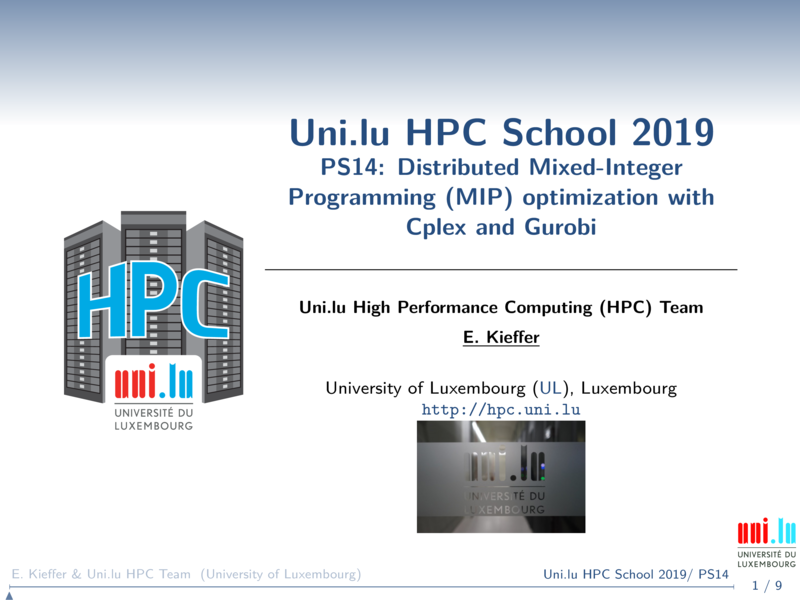
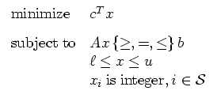

[](https://hpc.uni.lu) [](http://www.gnu.org/licenses/gpl-3.0.html) [](https://github.com/ULHPC/tutorials/issues/) [](https://github.com/ULHPC/tutorials/raw/devel/maths/Cplex-Gurobi/slides.pdf) [](https://github.com/ULHPC/tutorials/tree/devel/maths/Cplex-Gurobi/) [](http://ulhpc-tutorials.readthedocs.io/en/latest/maths/Cplex-Gurobi/) [](https://github.com/ULHPC/tutorials)

# Distributed Mixed-Integer Programming (MIP) optimization with Cplex and Gurobi


[](slides.pdf)


[**Cplex**](https://www.ibm.com/analytics/cplex-optimizer) is an optimization software for mathematical programming.
The Cplex optimizer can solve:

* Mixed-Integer programming problems (MIP)
* Very large linear programming problems (LP)
* Non-convex quadratic programming problems (QP)
* Convex quadratically constrained problems (QCP)


[**Gurobi**](http://www.gurobi.com) is a powerful optimization software and an alternative to Cplex for solving. Gurobi has some additionnal features compared to Cplex. For example, it can perform Mixed-Integer Quadratic Programming (MIQP) and Mixed-Integer Quadratic Constrained Programming (MIQCP).

In this tutorial, we are going to see how to leverage distributed optimization on a High Computing Platform such as Slurm.


## Mathematical programming

Decision and optimization problems can be representend as mathematical models called programs.



It exists several formats used by Cplex and Gurobi to provide your problems to these solvers:

* The [LP format](http://lpsolve.sourceforge.net/5.0/CPLEX-format.htm)
* The [MPS format](http://lpsolve.sourceforge.net/5.0/mps-format.htm)
* The [AMPL format](https://ampl.com)


## Using both optimization software on the ULHPC platform


The cplex optimizer can be accessed throught the module command once ressources have been requested through the SLURM scheduler. 
```bash
module load math/CPLEX/12.8-foss-2018a
``` 

The Gurobi optimizer can be accessed throught the module command once ressources have been requested through the SLURM scheduler. 
```bash
module load math/Gurobi/8.1.1-intel-2018a-Python-3.6.4
``` 

The resolution of optmization problem can be either done using the command line interface (CLI) or by using the different APis (e.g. C/C++, Python, Java). In this tutorial, we only consider the CLI for each optimizer.


## Ressources for this tutorial

In order to test cplex and gurobi, we need an optimization instance. Hereafter, we are going to rely on instances from the [miplib](http://miplib2017.zib.de). For example, let us the following instance [ex10.mps.gz](http://miplib2017.zib.de/WebData/instances/ex10.mps.gz) described in details [here](http://miplib2017.zib.de/instance_details_ex10.html) for the interested readers.

If you did not already clone the tutorial repository, enter the following commands in your ```HOME``` directory:

```bash
cd $HOME
git clone https://github.com/ULHPC/tutorials.git
# cd into the scripts folder
cd tutorials/maths/Cplex-Gurobi/scripts
```

## Cplex

### Multi-threaded optimization with Cplex

In order to solve mathematical programs, cplex allows users to define a command line script that can be passed to the executable. On the Iris cluster, the following launcher can be used to perform multi-threaded MIP optimzation. A good practice is to request as many threads as available cores on the node. If you need more computing power, you have to consider a distributed version.  

```bash
#!/bin/bash -l
#SBATCH -J Multi-threaded_cplex
#SBATCH --tasks=1
#SBATCH --cpus-per-task=28
#SBATCH --time=0-01:00:00
#SBATCH -p batch
#SBATCH --qos=qos-batch

# Load cplex 
module load math/CPLEX/12.8-foss-2018a

# Some variable
MPS_FILE=$1
RES_FILE=$2
CPLEX_COMMAND_SCRIPT="command_job${SLURM_JOBID}.lst"


# Create cplex command script
cat << EOF > ${CPLEX_COMMAND_SCRIPT}
set threads ${SLURM_CPUS_PER_TASK}
read ${MPS_FILE} 
mipopt
write "${RES_FILE}.sol" 
quit
EOF
chmod +x ${CPLEX_COMMAND_SCRIPT}

# Cplex will access use the required number of thread
cplex -f ${CPLEX_COMMAND_SCRIPT}
rm ${CPLEX_COMMAND_SCRIPT}
```


Use the script ```cplex_mtt.slurm ``` and launch a batch job using the ```sbatch``` command as follows ``` sbatch cplex_mtt.slurm ex10.mps.gz cplex_mtt```.


### Distributed optimization with Cplex

When you require more computing power (e.g. more cores), distributed computations is the way to go. The cplex optimization software embeds a feature that allows you to perform distributed MIP. Using the Message Passing Interface (MPI), cplex will distribute the exploration of the tree search to multiple workers.
The below launcher is an example showing how to reserve ressources on multiple nodes through the Slurm scheduler. In this example, 31 tasks will be distributed over 2 nodes. 


```bash
#!/bin/bash -l
#SBATCH -J Distrbuted_cplex
#SBATCH --nodes=2
#SBATCH --tasks=14
#SBACTH --cpus-per-task=2
#SBATCH --time=0-01:00:00
#SBATCH -p batch
#SBATCH --qos=qos-batch
module load math/CPLEX/12.8-foss-2018a

# Some variables
MPS_FILE=$1
RES_FILE=$2
CPLEX_COMMAND_SCRIPT="command_job${SLURM_JOBID}.lst"


# Create cplex command script
cat << EOF > ${CPLEX_COMMAND_SCRIPT}
set distmip config mpi
set threads ${SLURM_CPUS_PER_TASK}
read ${MPS_FILE} 
mipopt
write "${RES_FILE}.sol" 
quit
EOF
chmod +x ${CPLEX_COMMAND_SCRIPT}

# Start Cplex with MPI
# On first host, the master is running 
mpirun -np 1 cplex -f ${CPLEX_COMMAND_SCRIPT} -mpi : -np $((SLURM_NTASKS - 1)) cplex -mpi
rm ${CPLEX_COMMAND_SCRIPT}
```

Use the script ```cplex_dist.slurm ``` and launch a batch job using the ```sbatch``` command as follows ``` sbatch cplex_dist.slurm ex10.mps.gz cplex_dist```.

## Gurobi

### Multi-threaded optimization with Gurobi

The script below allows you to start multi-threaded MIP optimization with Gurobi. 


```bash
#!/bin/bash -l
#SBATCH -J Multi-threaded_gurobi
#SBATCH --tasks=1
#SBATCH --cpus-per-task=28
#SBATCH --time=0-01:00:00
#SBATCH -p batch
#SBATCH --qos=qos-batch

# Load Gurobi 
module load math/Gurobi/8.1.1-intel-2018a-Python-3.6.4

# Some variable
MPS_FILE=$1
RES_FILE=$2

# Gurobi will access use the required number of thread
gurobi_cl Threads=${SLURM_CPUS_PER_TASK} ResultFile="${RES_FILE}.sol" ${MPS_FILE}
```

Use the script ```gurobi_mtt.slurm ``` and launch a batch job using the ```sbatch``` command as follows ``` sbatch gurobi_mtt.slurm ex10.mps.gz gurobi_mtt```.

### Distributed optimization with Gurobi 


```bash
#!/bin/bash -l
#SBATCH -J Distrbuted_gurobi
#SBATCH --nodes=3
#SBATCH --ntasks-per-node=1
#SBATCH --cpus-per-task=5
#SBATCH --time=00:15:00
#SBATCH -p batch
#SBATCH --qos qos-batch
#SBATCH -o %x-%j.log

# Load personal modules
mu
# Load gurobi
module load math/Gurobi/8.1.1-intel-2018a-Python-3.6.4

export MASTER_PORT=61000
export SLAVE_PORT=61000
export MPS_FILE=$1
export RES_FILE=$2
export GUROBI_INNER_LAUNCHER="inner_job${SLURM_JOBID}.sh"

if [[ -f "grb_rs.cnf" ]];then
    sed -i "s/^THREADLIMIT.*$/THREADLIMIT=${SLURM_CPUS_PER_TASK}/g" grb_rs.cnf
else
    $GUROBI_REMOTE_BIN_PATH/grb_rs init
    echo "THREADLIMIT=${SLURM_CPUS_PER_TASK}" >> grb_rs.cnf
fi


cat << 'EOF' > ${GUROBI_INNER_LAUNCHER}
#!/bin/bash
MASTER_NODE=$(scontrol show hostname ${SLURM_NODELIST} | head -n 1)
    ## Load configuration and environment
    if [[ ${SLURM_PROCID} -eq 0 ]]; then
        ## Start Gurobi master worker in background
         $GUROBI_REMOTE_BIN_PATH/grb_rs --worker --port ${MASTER_PORT} &
         wait
    elif [[ ${SLURM_PROCID} -eq 1 ]]; then
        sleep 5
        grbcluster nodes --server ${MASTER_NODE}:${MASTER_PORT} 
        gurobi_cl Threads=${SLURM_CPUS_PER_TASK} ResultFile="${RES_FILE}.sol" Workerpool=${MASTER_NODE}:${MASTER_PORT} DistributedMIPJobs=$((SLURM_NNODES -1)) ${MPS_FILE}
    else
        sleep 2
        ## Start Gurobi slave worker in background
        $GUROBI_REMOTE_BIN_PATH/grb_rs --worker --port ${MASTER_PORT} --join ${MASTER_NODE}:${MASTER_PORT} &
        wait
fi
EOF
chmod +x ${GUROBI_INNER_LAUNCHER}

## Launch Gurobi and wait for it to start
srun ${GUROBI_INNER_LAUNCHER} &
while [[ ! -e "${RES_FILE}.sol" ]]; do
    sleep 5
done
rm ${GUROBI_INNER_LAUNCHER}
```


Use the script ```gurobi_dist.slurm ``` and launch a batch job using the ```sbatch``` command as follows ``` sbatch gurobi_dist.slurm ex10.mps.gz gurobi_dist```.

## Next 


1. Download and try to solve other [miplib](http://miplib2017.zib.de) instances using Cplex and/or Gurobi
2. Modify the number of parallel tasks  
