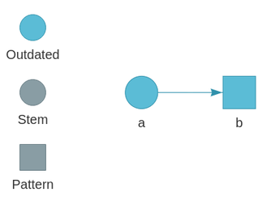
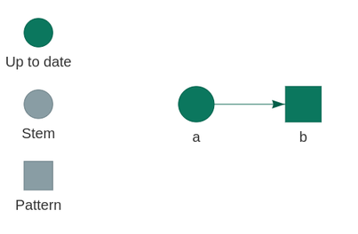
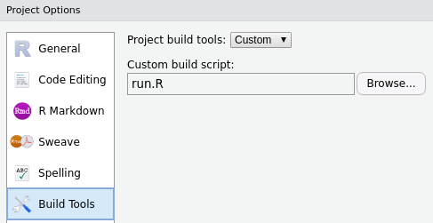
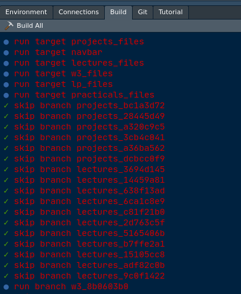

```{r setup, include = FALSE}
knitr::opts_chunk$set(warning = FALSE, comment = '')
library(dplyr)
library(xaringan)  
library(xaringanthemer)# gadenbuie/xaringanthemer
library(xaringanExtra) # gadenbuie/xaringanExtra
library(icon)          # ropenscilabs/icon
library(showtext)
options(htmltools.dir.version = FALSE)
knitr::opts_chunk$set(fig.retina = 3) #  dpi is 72 x 3 = 216
library(ggplot2)
# theme from Gaben Buie
style_mono_accent(
  base_color = "#00A4E1", # LU blue flag
  text_font_size = "0.95rem",
  code_font_size = "0.9rem",
  header_h1_font_size = "2.1rem",
  header_h2_font_size = "1.9rem",
  header_h3_font_size = "1.7rem",
  header_font_google = google_font("Roboto Condensed"),
  text_font_google   = google_font("Roboto Condensed", "300", "300i"),
  code_font_google   = google_font("Fira Mono")
)
#xaringanExtra::use_xaringan_extra(c("tile_view", "tachyons"))

# bring in tachyons https://roperzh.github.io/tachyons-cheatsheet/
xaringanExtra::use_tachyons()
# tile view when press 't'
xaringanExtra::use_tile_view()
# all code with icon for copy
htmltools::tagList(
  xaringanExtra::use_clipboard(
    button_text = "<i class=\"fa fa-clipboard\"></i>",
    success_text = "<i class=\"fa fa-check\" style=\"color: #90BE6D\"></i>",
    error_text = "<i class=\"fa fa-times-circle\" style=\"color: #F94144\"></i>"
  ),
  rmarkdown::html_dependency_font_awesome()
)
# use webcam, on/off with 'w' and press Shift + W to move the video to the next corner.
xaringanExtra::use_webcam()
xaringanExtra::use_share_again()
Sys.getenv("TAR_ASK", FALSE)
```


class: title-slide

# `r params$title`

## `r params$subtitle`

.center[]

### `r params$author` | HPC School | `r params$date`


```{r, echo = FALSE}
htmltools::img(src = "img/hpc150x150.png",
               style = "height:150px;position: absolute;bottom: 5em;right: 44%;")
```

```{r, echo = FALSE}
# uni logo on all slides, position top right
xaringanExtra::use_logo(
  image_url = "img/hpc150x150.png",
  width = "50px",
  height = "50px",
  position = xaringanExtra::css_position(bottom = "1em", left = "1em"),
  link_url = "https://ulhpc-tutorials.readthedocs.io/en/latest/hpc-school/",
  exclude_class = c("title-slide", "inverse", "hide_logo"))
```

---

## Introduction to R

.Large[Not the scope of this session from the previous sessions]

--

.Large[But an introduction to `targets`, a Make-like workflow manager for .bold[`R`]]

.pull-left[
- if you are a beginner user, check out [this lecture](https://rworkshop.uni.lu/lectures/lecture01_intro.html#9)

]

.pull-right[
- if you are an advanced user, interested in programming, check out [this lecture](https://rworkshop.uni.lu/lectures/lecture09_tidyeval.html)

]

---

## About this lecture

```{r, echo = FALSE}
htmltools::img(src = "img/logo_targets.png",
               style = "height:150px;position: absolute;top: 1em;right: 1em;")
```
```{r, echo = FALSE}
htmltools::img(src = "https://wlandau.github.io/tarchetypes/reference/figures/logo.png",
               style = "height:150px;position: absolute;top: 10em;right: 1em;")
```

.flex.items-center[
  .w-10[
  ]
  .w-70.bg-washed-green.b--green.ba.bw2.br3.shadow-5.ph3.mt3.mr1[
  .large[.bbox[Learning objectives]]

.right[]
.large[
- Why a workflow manager is saving you time and stress
- Understand how it is implemented in `targets`
    + folder structure
    + define your `targets`
    + connect `targets` to create the **dependencies**
    + check **dependencies** with `visnetwork`
    + embrace **dynamic** branching
    + run **only** what needs to be executed
    + bundle **dependencies** in a Rmarkdown document with [`tar_render()`](https://wlandau.github.io/tarchetypes/reference/tar_render.html)
    + increase reproducibility with the package manager [`renv`](https://rstudio.github.io/renv/articles/renv.html)
- Practice on a dataset, running > 100 linear models in the [`tidyverse`](https://www.tidyverse.org/) framework
]]]


---

## Tidyverse set of packages


```{r, echo = FALSE}
htmltools::img(src = "img/logo_tidyverse.png",
               style = "height:150px;position: absolute;top: 1em;right: 1em;")
```

```{r, echo = FALSE}
htmltools::img(src = "https://rworkshop.uni.lu/lectures/img/09/tidyverse_pkg_in_processes.png",
               style = "  display:block;margin-left: auto;margin-right: auto;height:500px;")
```

---

## Practical sessions

.flex[
.w-33.bg-washed-green.b--green.ba.bw2.br3.shadow-5.ph3.mt3.mr1[
.large[.gbox[For beginners]]
- [dataSaurus](https://rworkshop.uni.lu/practicals/practical01_datasauRus_solution.html)


]
.w-33.bg-washed-yellow.b--yellow.ba.bw2.br3.shadow-5.ph3.mt3.mr1[
.large[.ybox[For intermediates]]
- [exercises and `furrr`](https://ulhpc-tutorials.readthedocs.io/en/latest/maths/R/)


]
.w-33.bg-washed-blue.b--blue.ba.bw2.br3.shadow-5.ph3.mt3.mr1[
.large[.bbox[For targets]]
- [targets](XX)
]
]

---

## If you wonder about `drake`


- [`drake`](https://github.com/ropensci/drake), 1,300 `r icon::fa_star()` on github is the most used workflow manager for .Large[`R`].

.flex[
.w-70.bg-washed-blue.b--blue.ba.bw2.br3.shadow-5.ph3.mt3.ml5[
.large[.ybox[Rationale for [rewriting from scratch](https://wlandau.github.io/targets/articles/need.html)]]

- drake is still an excellent choice for pipeline management, but it has permanent user-side limitations.
- targets was created to overcome these limitations and create a smoother user experience.
- Stronger guardrails by design.
- A friendlier, lighter, more transparent data management system.
- Show which functions are up to date.
- More flexible dynamic branching.
- Improved parallel efficiency.
- Designed for custom user-side metaprogramming (`tarchetypes`/`stantargets`).

- [Debugging!](https://wlandau.github.io/targets-manual/practice.html#debugging) with [workspaces](https://wlandau.github.io/targets/reference/tar_workspace.html) (wishing this exists in `snakemake`)

.footnote[Source: targets [slides](https://wlandau.github.io/nyhackr2020/#40) W. Landau. NY Meetup hackR]
]]

.flex[
.w-70.bg-washed-yellow.b--yellow.ba.bw2.br3.shadow-5.ph3.mt3.ml5[
.large[.bbox[Not in CRAN yet]]

```{r, eval=FALSE}
remotes::install_github("wlandau/targets@main")
remotes::install_github("wlandau/tarchetypes@main")
```


]]

---

## Folder structure

```{r, echo = FALSE}
htmltools::img(src = "https://raw.githubusercontent.com/rstudio/renv/master/man/figures/logo.svg",
               style = "height:150px;position: absolute;top: 1em;right: 1em;")
```
```{r, echo = FALSE}
htmltools::img(src = "https://camo.githubusercontent.com/f10a96951d85f43abc67d46bafd97d302deb9daf8490082fe339b9292c75072a/68747470733a2f2f626f6f6b646f776e2e6f72672f79696875692f726d61726b646f776e2f696d616765732f6865782d726d61726b646f776e2e706e67",
               style = "height:150px;position: absolute;top: 10em;right: 1em;")
```
```{r, echo = FALSE}
htmltools::img(src = "https://upload.wikimedia.org/wikipedia/commons/thumb/d/d0/RStudio_logo_flat.svg/1200px-RStudio_logo_flat.svg.png",
               style = "height:100px;position: absolute;top: 18em;right: 1em;")
```
```{r, echo = FALSE}
htmltools::img(src = "https://git-scm.com/images/logos/logomark-black@2x.png",
               style = "height:150px;position: absolute;top: 23em;right: 1em;")
```


.large[
.left-column[
```{r, eval = FALSE}
├── .git/
├── run.R
├── _targets.R #<<
├── _targets/
├── Repro.Rproj
├── R
│   ├── functions.R #<<
│   └── utils.R #<<
├── run.R*
├── renv/
├── renv.lock
└── report.Rmd
```

]

.right-column[
- with `renv`
- `_targets.R` is the only mandatory file
- use a `R` sub-folder, gets closer to a `R` package
- a `run.R` file for custom building in RStudio
- `Rmd` file allows to gather results in a report
- in a RStudio project
- version tracked with `git`
]
]

---

## Main file `_targets.R`


.pull-left[
```{r, eval = FALSE}
# Beginning of _targets.R
library(targets)
source("R/functions.R")
options(tidyverse.quiet = TRUE)
tar_option_set(
  packages = c("dplyr")
)
# Pipeline description
tar_pipeline(
  tar_target(a, 1:3),
  tar_target(b, a + 1,
             pattern = map(a))
)
```

]

.pull-right[
.large[
- add `library(tarchetypes)` for extra-utilities
- nice helpers in options like silencing `tidyverse` loading
- declare packages that will be loaded by default
- each `target` can have their own additional packages to load (avoid loading for nothing)
- using bar names of targets, create the dependencies
- `pattern = map()` creates dynamic branching

#### Guardrails

- all targets are fresh R processes
- `_targets.R` must be at the project root
]
]

---

## Formats, Patterns, Iterations


.pull-left[
#### Formats

- `"rds"`: default
- `"qs"`: faster binary objects (see [`qs::qsave()`](https://rdrr.io/pkg/qs/man/qsave.html))
- `"fst"`: amazing speed for `data.frame`, (see [`fst::write_fst()`](http://www.fstpackage.org/reference/write_fst.html))
- `"fst_dt"`: same for `data.table` objects
- `"fst_tbl"`: same for `tibbles` objects
- `"keras"`
- `"torch"`
- `"url"`
- `"file"`: automatic hashing
- `"aws_rds/file"`: for AWS S3 cloud
]

.pull-right[
#### Patterns

- `map()`: iterate over one or more targets in sequence.
- `cross()`: iterate over combinations of slices of targets.
- `head()`: restrict branching to the first few elements.
- `tail()`: restrict branching to the last few elements.
- `sample()`: restrict branching to a random subset of elements.

#### Iterations

- `"vector"`: using [`vctrs`](https://vctrs.r-lib.org/)
- `"list"`: less strict than `vctrs::vec_c()`
- `"group"`:handy for `dplyr::group_by()` tibble

.footnote[Source: [W. Landau, NYhackr](https://wlandau.github.io/nyhackr2020/#52)] and `tar_target` [reference page](https://wlandau.github.io/targets/reference/tar_target.html)
]

---

# Toy example

.pull-left[

```{r toy, eval=FALSE}
library(targets)
tar_pipeline(
  tar_target(a, 1:3),
  tar_target(b, a + 1,
             pattern = map(a))
)
tar_make()
#> ● run target a
#> ● run branch b_0a91b2ed
#> ● run branch b_847c5ae2
#> ● run branch b_1619f1a0
tar_read(b_0a91b2ed)
#> [1] 2
# graph dependency BEFORE tar_make()
tar_visnetwork()
```
.center[]
]

--

.pull-right[
#### re-run with `tar_make()`: all skipped
```{r, eval=FALSE}
tar_make()
#> ✓ skip target a
#> ✓ skip branch b_0a91b2ed
#> ✓ skip branch b_847c5ae2
#> ✓ skip branch b_1619f1a0
#> ✓ Already up to date.
tar_read(b_0a91b2ed)
#> [1] 2
# graph dependency AFTER tar_make()
tar_visnetwork()
```

.center[]
]


---

# Toy example

.pull-left[
#### Add one element to `a`, `r icon::fa("arrow-circle-right")` one more `b` branch
```{r, eval=FALSE}
tar_pipeline(
  tar_target(a, 1:4), #<<
  tar_target(b, a + 1,
             pattern = map(a))
)
tar_make()
#> ● run target a
#> ✓ skip branch b_0a91b2ed
#> ✓ skip branch b_847c5ae2
#> ✓ skip branch b_1619f1a0
#> ● run branch b_9401bbb6
```
]

--

.pull-right[
#### change `b` `r icon::fa("arrow-circle-right")` all branches re-run
```{r, eval=FALSE}
tar_pipeline(
  tar_target(a, 1:4),
  tar_target(b, a + 2, #<<
             pattern = map(a))
)
tar_make()
#> ✓ skip target a
#> ● run branch b_0a91b2ed
#> ● run branch b_847c5ae2
#> ● run branch b_1619f1a0
#> ● run branch b_9401bbb6
tar_read(b_0a91b2ed)
#> [1] 3
```
]

---

# Toy parallelism, using `future`

```{r, echo = FALSE}
htmltools::img(src = "https://raw.githubusercontent.com/HenrikBengtsson/future/develop/man/figures/logo.png",
               style = "height:150px;position: absolute;top: 1em;right: 1em;")
```

.pull-left[
#### [`future`](https://github.com/HenrikBengtsson/future) by [Henrik Bengtsson](https://github.com/HenrikBengtsson/) is available. Only one worker
```{r toy_parallel, eval=FALSE}
library(future) #<<
plan(multisession) #<<
tar_pipeline(
  tar_target(a, 1:3),
  tar_target(b, {
    # fake a long process
    Sys.sleep(5)
    a + 1
  },
  pattern = map(a))
)
system.time(tar_make_future(workers = 1L))
#> ● run target a
#> ● run branch b_0a91b2ed
#> ● run branch b_847c5ae2
#> ● run branch b_1619f1a0
#>   user  system elapsed 
#>  2.156   0.284  20.807
```
]

--

.pull-right[
#### with 3 workers
```{r, eval = FALSE}
library(future)
plan(multisession)
tar_pipeline(
  tar_target(a, 1:3),
  tar_target(b, {
    # fake a long process
    Sys.sleep(5)
    a + 1
  },
  pattern = map(a))
)
system.time(tar_make_future(workers = 3L)) #<<
#> ● run target a
#> ● run branch b_0a91b2ed
#> ● run branch b_847c5ae2
#> ● run branch b_1619f1a0
#>    user  system elapsed 
#>   2.126   0.164  12.920 
```
]

.Large.center[Still overhead, but individual target can be parallelised (`deployment` / `resources` args)]

---

# Custom Build in RStudio

.pull-left[
`run.R` is essentially a call to `tar_make()` as seen below:

```{r, eval=FALSE}
#!/usr/bin/env Rscript

targets::tar_make()
```
#### Then specified in RStudio project building option:

]

--

.pull-right[
#### Example (also nice a keyboard shortcut)


]


---
class: inverse, middle, center

# A more realistic example

---

# Linear modelling on the `gapminder` dataset


.pull-left[
#### 142 countries, 12 yearly observations of 3 parameters
```{r, echo = FALSE}
library(gapminder)
gapminder %>%
  slice_head(n = 3) %>%
  huxtable::as_hux() %>% 
  huxtable::theme_striped()
```
.center.huge[...]
```{r, echo = FALSE}
library(gapminder)
gapminder %>%
  slice_tail(n = 3) %>%
  huxtable::as_hux() %>% 
  huxtable::theme_striped(header_cols = FALSE)
```
]

--

.pull-right[
```{r, echo = FALSE}
gapminder %>% 
  ggplot(aes(x = year, y = lifeExp, group = country)) +
  geom_line(alpha = .3) +
  theme_xaringan()
```

]


---

## Before we stop

.flex[
.w-50.bg-washed-green.b--green.ba.bw2.br3.shadow-5.ph3.mt2.ml1[
.large[.gbox[You learned to:]

- apprehend `targets`
- discover the advantages of workflow managers
- Makefile-like approach and project design
]]
.w-50.bg-washed-blue.b--blue.ba.bw2.br3.shadow-5.ph3.mt2.ml2[
.large[.bbox[Acknowledgments  🙏 👏]]

* [Willam Laudau](https://github.com/wlandau) obviously
* [Eric Koncina](https://github.com/koncina) early adopter of `targets`
* [Hadley Wickham](https://github.com/hadley)
* [Henrik Bengtsson](https://github.com/HenrikBengtsson/)
* [Xie Yihuie](https://github.com/yihuie) and [Garrick Aden-Buie](https://github.com/gadenbuie) for [`xarigan`](https://github.com/yihui/xaringan)/[`xaringanExtra`](https://github.com/gadenbuie/xaringanExtra)
* [Jennyfer Bryan](https://github.com/jennybc)
]]
.flex[
.w-50.bg-washed-green.b--green.ba.bw2.br3.shadow-5.ph3.mt2.ml1[
.large[.ybox[Further reading `r icon::fa("book")`]]

- [`targets` manual](https://wlandau.github.io/targets-manual) by William Landau
- [`targets` reference](https://wlandau.github.io/targets/) by William Landau
- [`tarchetypes` reference](https://wlandau.github.io/tarchetypes/) by William Landau
- [NY Open Statistical Meeup, Dec 2020, targets presentation](https://youtu.be/Gqn7Xn4d5NI) by William Landau
]
.w-50.pv2.ph3.mt2.ml1[
.Large[.bbox[Thank you for your attention!]]


.huge[.gbox[Now practical session]]]
]]


```{r, echo = FALSE}
knitr::knit_exit()
```


```{r, eval=FALSE}
library(targets)
tar_dir({
  tar_script({
    options(crayon.enabled = FALSE)
      #clustermq.scheduler = "slurm",
    #clustermq.scheduler = "ssh",
    #clustermq.ssh.host = "iris-cluster", # use your user and host, obviously
    #clustermq.ssh.log = "cmq_ssh.log", # log for easier debugging
    #clustermq.template = "slurm.tmpl" # if using your own template
    library(future)
    plan(multisession)
    tar_pipeline(
      tar_target(a, 1:3),
      tar_target(b, {
        Sys.sleep(5)
        a + 1
      },
      pattern = map(a))
    )
  })
  Sys.time(tar_make_future(workers = 1L))
})
```