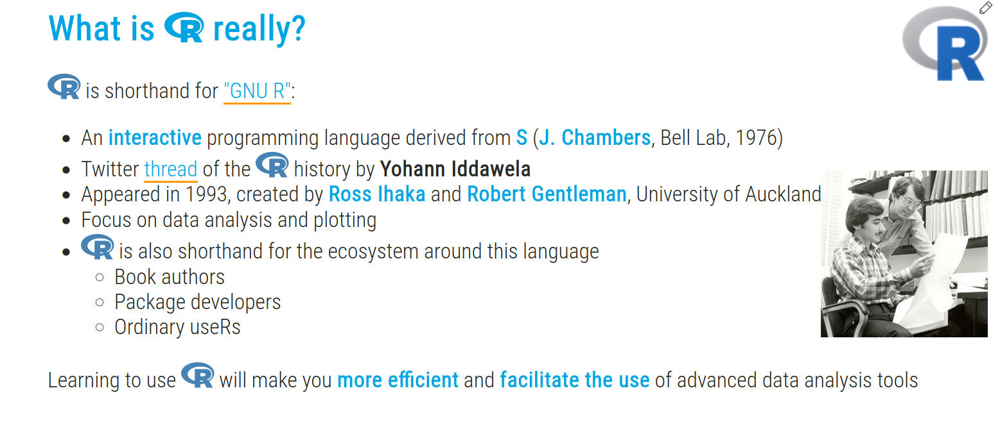
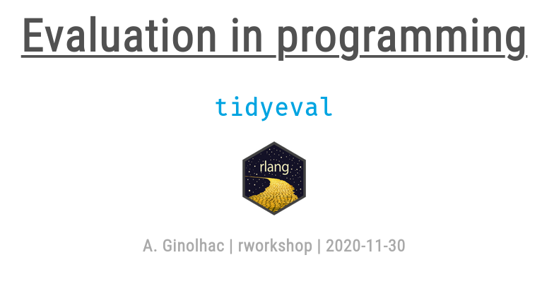
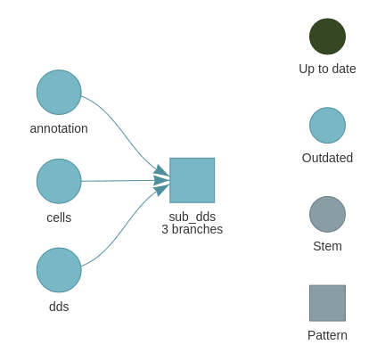
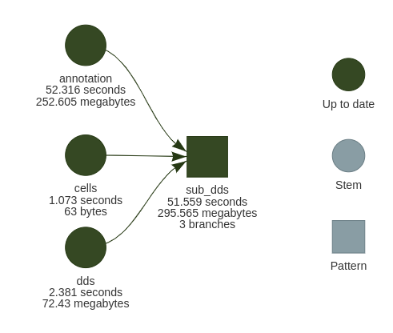
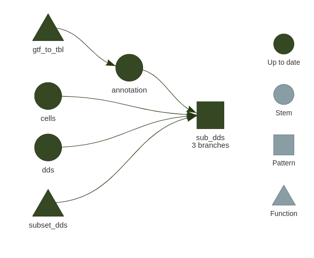
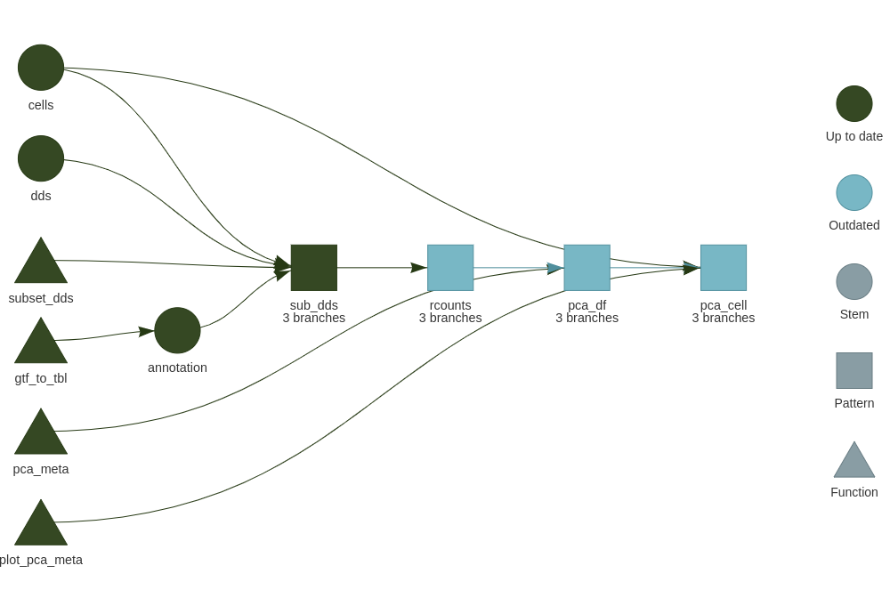
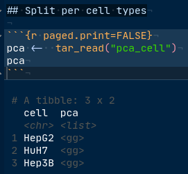
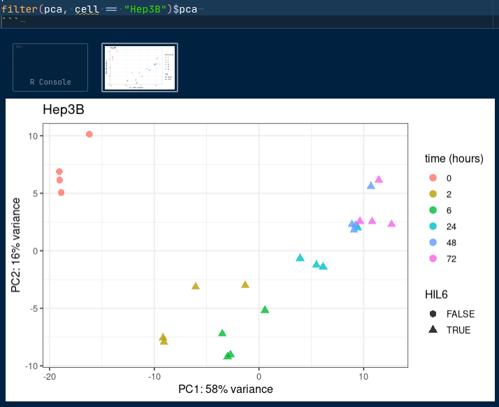

class: title-slide

```{r setup, include = FALSE}
knitr::opts_chunk$set(warning = FALSE, comment = '')
library(dplyr)
library(fontawesome)
library(xaringan)  
library(xaringanthemer)# gadenbuie/xaringanthemer
library(xaringanExtra) # gadenbuie/xaringanExtra
knitr::opts_chunk$set(fig.retina = 3) #  dpi is 72 x 3 = 216
library(ggplot2)
# theme from Gaben Buie
style_mono_accent(
  base_color = "#00A4E1", # LU blue flag
  text_font_size = "0.9rem",
  code_font_size = "0.7rem",
  header_h1_font_size = "2.1rem",
  header_h2_font_size = "1.9rem",
  header_h3_font_size = "1.5rem",
  header_font_google = google_font("Roboto Condensed"),
  text_font_google   = google_font("Roboto Condensed", "300", "300i"),
  code_font_google   = google_font("Fira Mono")
)
xaringanExtra::use_xaringan_extra(c("tile_view", "tachyons", "logo"))
# bring in tachyons https://roperzh.github.io/tachyons-cheatsheet/
xaringanExtra::use_tachyons()
# tile view when press 't'
xaringanExtra::use_tile_view()
# all code with icon for copy
htmltools::tagList(
  xaringanExtra::use_clipboard(
    button_text = "<i class=\"fa fa-clipboard\"></i>",
    success_text = "<i class=\"fa fa-check\" style=\"color: #90BE6D\"></i>",
    error_text = "<i class=\"fa fa-times-circle\" style=\"color: #F94144\"></i>"
  ),
  rmarkdown::html_dependency_font_awesome()
)
# use webcam, on/off with 'w' and press Shift + W to move the video to the next corner.
xaringanExtra::use_search(show_icon = FALSE)
xaringanExtra::use_share_again()
xaringanExtra::use_scribble()
```

```{r, echo = FALSE}
xaringanExtra::use_logo(
  image_url = "img/logo_hpc-shool2021.png",
  height = "60px",
  position = xaringanExtra::css_position(bottom = "1em", left = "1em"),
  link_url = "https://ulhpc-tutorials.readthedocs.io/en/latest/",
  exclude_class = c("title-slide", "inverse", "hide_logo"))
```

```{r, echo = FALSE}
xaringanExtra::use_progress_bar(location = "top", color = "#00A4E1")
```

# `r params$title`

## `r params$subtitle`

.center[]


## HPC SChool 2021 PS11: R session

### `r params$author`

### DLSM University of Luxembourg


```{r, echo = FALSE}
htmltools::img(src = "https://raw.githubusercontent.com/ULHPC/documents/master/roll-ups/ULHPC-RollUp.png",
               style = "height:550px;position: absolute;bottom: 1em;left: 1em;")
```

```{r, echo = FALSE}
htmltools::img(src = "img/logo_hpc-shool2021.png",
               style = "height:150px;position: absolute;bottom: 1em;right: 1em;")
```

---

## Introduction to R

.Large[Not the scope of this session]

.pull-left[
.Large[.bold[Beginner] user, check out [this lecture](https://rworkshop.uni.lu/lectures/lecture01_intro.html#10)]


]

.pull-right[
.Large[.bold[Advanced] user, interested in programming, check out [this lecture](https://rworkshop.uni.lu/lectures/lecture12_tidyeval.html)]


]


---
class: middle, center, inverse


# targets

## a Make-like workflow manager for `r fontawesome::fa("r-project", height = "30px")`


```{r, echo = FALSE}
htmltools::img(src = "https://docs.ropensci.org/targets/reference/figures/logo.png",
               style = "height:150px")
```
```{r, echo = FALSE}
htmltools::img(src = "https://docs.ropensci.org/tarchetypes/reference/figures/logo.png",
               style = "height:150px")
```

---

# targets and companion package tarchetypes

```{r, echo = FALSE}
htmltools::img(src = "https://docs.ropensci.org/targets/reference/figures/logo.png",
               style = "height:150px;position: absolute;top: 1em;right: 1em;")
```
```{r, echo = FALSE}
htmltools::img(src = "https://docs.ropensci.org/tarchetypes/reference/figures/logo.png",
               style = "height:150px;position: absolute;top: 10em;right: 1em;")
```

.flex.items-center[
  .w-10[
  ]
  .w-70.bg-washed-green.b--green.ba.bw2.br3.shadow-5.ph3.mt3.mr1[
  .large[.bbox[A workflow manager for R]]

.large[
- Saving you time and stress
- Understand how it is implemented in `targets`
    + Define your `targets`
    + Connect `targets` to create the **dependencies** `r fontawesome::fa("project-diagram")`
    + Check **dependencies** with `visnetwork`
    + Embrace **dynamic** branching `r fontawesome::fa("code-branch")`
    + Run **only** what needs to be executed
    + Bundle **dependencies** in a Rmarkdown document with [`tar_render()`](https://wlandau.github.io/tarchetypes/reference/tar_render.html)
    + Increase reproducibility with the package manager [`renv`](https://rstudio.github.io/renv/articles/renv.html)
- Example with RNA-seq data from .bold[Wendkouni Nadège MINOUNGOU]
]]]

---

# Folder structure

```{r, echo = FALSE}
htmltools::img(src = "https://raw.githubusercontent.com/rstudio/renv/master/man/figures/logo.svg",
               style = "height:160px;position: absolute;top: 1em;right: 1em;")
```
```{r, echo = FALSE}
htmltools::img(src = "https://camo.githubusercontent.com/f10a96951d85f43abc67d46bafd97d302deb9daf8490082fe339b9292c75072a/68747470733a2f2f626f6f6b646f776e2e6f72672f79696875692f726d61726b646f776e2f696d616765732f6865782d726d61726b646f776e2e706e67",
               style = "height:150px;position: absolute;top: 10em;right: 1.6em;")
```

```{r, echo = FALSE}
htmltools::img(src = "https://upload.wikimedia.org/wikipedia/commons/thumb/d/d0/RStudio_logo_flat.svg/1200px-RStudio_logo_flat.svg.png",
               style = "height:70px;position: absolute;top: 18em;right: 1em;")
```
```{r, echo = FALSE}
htmltools::img(src = "https://git-scm.com/images/logos/logomark-black@2x.png",
               style = "height:120px;position: absolute;top: 22em;right: 2em;")
```

.left-column[
```{r, eval = FALSE}
├── .git/
├── _targets.R #<<
├── _targets/
├── Repro.Rproj
├── R
│   ├── functions.R #<<
│   └── utils.R #<<
├── run.R*
├── renv/
├── renv.lock
└── report.Rmd
```

]

.right-column[

.large[
- With [`renv`](https://rstudio.github.io/renv/). Snapshot your package environment (and restore! 😌)
- `_targets.R` is the only mandatory file
- Use a `R` sub-folder for functions, gets closer to a `r fontawesome::fa("r-project")` package
- In a RStudio project
- Version tracked with `r fontawesome::fa("git-square")`
- `Rmarkdown` file allows to gather results in a report
- Optional: an executable `run.sh` allows to use Build Tools in RStudio


.Large[Targets Markdown]
.large[
Bundle `globals` and `pipeline` inside a **Rmarkdown** document.

- Makes development easier
- Documentation can be embedded
- `targets` engine recognizes by `knitr` and takes care of writing all `r fontawesome::fa("r-project")` scripts
]
]
]

---

# `renv` features

```{r, echo = FALSE}
htmltools::img(src = "https://raw.githubusercontent.com/rstudio/renv/master/man/figures/logo.svg",
               style = "height:140px;position: absolute;top: 1em;right: 1em;")
```

.pull-left[
- `hydrate()` parses your code and finds library calls
- `install()` from .bold[CRAN] with dependencies (also from `r fontawesome::fa(name = "github", fill = "orange")`)
- `snapshot()` registers changes, hashes and origin
- `restore()` to a certain point in time

```r
> renv::snapshot()
The following package(s) will be updated in the lockfile:

# CRAN ===============================
- RcppParallel   [5.0.2 -> 5.0.3]
- cli            [2.3.0 -> 2.3.1]
- pkgload        [1.1.0 -> 1.2.0]
- tint           [0.1.3 -> *]

# GitHub =============================
- targets        [ropensci/targets@main: 598d7a23 -> bdc1b29c]

Do you want to proceed? [y/N]: 
```


]

--

.pull-right[
`renv.lock` file after a `snapshot`

```
  "R": {
    "Version": "4.0.3",
    "Repositories": [
      {
        "Name": "CRAN",
        "URL": "https://cloud.r-project.org"
      }
    ]
  },
  "Bioconductor": {
    "Version": "3.12"
  },
  "Packages": {
    "AnnotationDbi": {
      "Package": "AnnotationDbi",
      "Version": "1.52.0",
      "Source": "Bioconductor",
      "Hash": "ca5106b296b3aa6af713ce197be547c1"
    },
    "BH": {
      "Package": "BH",
      "Version": "1.75.0-0",
      "Source": "Repository",
      "Repository": "CRAN",
      "Hash": "e4c04affc2cac20c8fec18385cd14691"
    },
    "targets": {
      "Package": "targets",
      "Version": "0.1.0.9000",
      "Source": "GitHub",
      "RemoteType": "github",
      "RemoteUsername": "ropensci",
      "RemoteRepo": "targets",
      "RemoteRef": "main",
      "RemoteSha": "598d7a23661d4c760209c7991bf10584eadcf7c8",
      "RemoteHost": "api.github.com",
      "Hash": "ee66061fd5c757ec600071965d457818"
    },
    [...]
```

]


---

#Example with RNA-seq data across 3 cell lines

### PCA shows that differences between cells .bold.red[`>>`] biological effect (roman numbers)

```{r, echo = FALSE}
htmltools::img(src = "img/targets_pca.png",
               style = "float:right;height:400px;")
```

--

### Solution: Split counts and metadata for each cell

.Large[Do we copy code 3 times?]

---

# Define targets = explicit dependencies

```{r, echo = FALSE}
htmltools::img(src = "https://docs.ropensci.org/targets/reference/figures/logo.png",
               style = "height:120px;position: absolute;top: 1em;right: 1em;")
```

.pull-left[
### `_targets.R`, define 4 targets

Last `target` depends on the **3** upstreams

```{r, eval=FALSE}
library(targets)
source("R/functions.R")
source("R/plotting.R")

list(
  tar_target(cells, c("HepG2", "HuH7", "Hep3B")),#<<
  tar_qs(dds, read_rds(here::here("data", "all.rds")),#<<
         packages = "DESeq2"),
  tar_fst_tbl(annotation, gtf_to_tbl(here::here("data", #<<
                                                "gencode.v36.annotation.gtf")),
              packages = c("tibble", "rtracklayer")),
  tar_qs(sub_dds, subset_dds(dds, #<<
                             filter(annotation, type == "gene"),
                             .cell = cells),
         pattern = map(cells), # dynamic branching
         packages = c("DESeq2", "tidyverse"))
[...]
)
```

]

--

.pull-right[
.bold[Dynamic branching] makes dependencies easier to read.

.large[
> .orange.bold[Of course, someone has to write for loops, it doesn't have to be you]

.tr[
— _.bold[Jenny Bryan]_]]




]

.footnote[Figure from `tar_visnetwork()`]

---
class: hide_logo

# Running targets

```{r, echo = FALSE}
htmltools::img(src = "https://docs.ropensci.org/targets/reference/figures/logo.png",
               style = "height:120px;position: absolute;top: 1em;right: 1em;")
```

.pull-left[
```
● run target annotation
● run target cells
● run target dds
● run branch sub_dds_3078b1e0
         condition time_h
HepG2_I1   control      0
HepG2_I2      HIL6      2
using pre-existing size factors
estimating dispersions
gene-wise dispersion estimates: 2 workers
mean-dispersion relationship
final dispersion estimates, fitting model and testing: 2 workers
● run branch sub_dds_d05c5da7
        condition time_h
HuH7_I1   control      0
HuH7_I2      HIL6      2
using pre-existing size factors
estimating dispersions
gene-wise dispersion estimates: 2 workers
mean-dispersion relationship
final dispersion estimates, fitting model and testing: 2 workers
● run branch sub_dds_c60d7096
         condition time_h
Hep3B_I1   control      0
Hep3B_I2      HIL6      2
using pre-existing size factors
estimating dispersions
gene-wise dispersion estimates: 2 workers
mean-dispersion relationship
final dispersion estimates, fitting model and testing: 2 workers
● end pipeline
```
]

--

.pull-right[
.Large[Options to display time and object sizes]

]

---

# Re-running

```{r, echo = FALSE}
htmltools::img(src = "https://docs.ropensci.org/targets/reference/figures/logo.png",
               style = "height:120px;position: absolute;top: 1em;right: 1em;")
```


.pull-left[
```
✓ skip target annotation
✓ skip target cells
✓ skip target dds
✓ skip branch sub_dds_3078b1e0
✓ skip branch sub_dds_d05c5da7
✓ skip branch sub_dds_c60d7096
✓ skip pipeline
```

.Large[All good, nothing to be done ✔️.

Actually `targets` tracks all objects and so functions

A more complete dependency graph shows .bold[functions]
]
]

--

.pull-right[



.Large[Let's add the PCA per cell type now]
]


---
class: hide_logo

# PCA, add 4 targets

```{r, echo = FALSE}
htmltools::img(src = "https://docs.ropensci.org/targets/reference/figures/logo.png",
               style = "height:120px;position: absolute;top: 1em;right: 1em;")
```

.pull-left[
### Smaller targets avoid unnecessary re-running steps
```{r, eval = FALSE}
[...]
tar_target(rcounts, vst(sub_dds, blind = TRUE),
           pattern = map(sub_dds),
           packages = c("DESeq2")),
tar_target(pca_df, pca_meta(rcounts),
           pattern = map(rcounts),
           packages = c("DESeq2", "tidyr", "dplyr")),
tar_target(pca_cell, tibble(cell = cells,
                            pca = list(plot_pca_meta(pca_df))),
           pattern = map(cells, pca_df),
           packages = c("ggplot2", "tibble"))
[...]
```

.large[
.bold[Translate into]:

- For every cell data, compute regularized counts (`vst`: variance stabilization)
- For every regularized counts, compute PCA (`df`: data.frame, _i. e_ a table)
- For every cell names / PCA tables, plot PCA in a table for easier labeling

]

]

--

.pull-right[



]

---

# PCA results


.flex[
.w-33.b--green.ba.bw2.br3.shadow-5.ph4.mt2.mr2[
### Running

<video width="310" height="340">
<source src="https://biostat2.uni.lu/practicals/data/targets_pca.mp4" type="video/mp4">
</video>

]
.w-33.b--green.ba.bw2.br3.shadow-5.ph4.mt2.mr2[
### Awesome feature: load results IN a Rmarkdown document

.green.bold[Separate] `code` from content



]
.w-33.b--green.ba.bw2.br3.shadow-5.ph4.mt2[
### How to display a plot

]]


---

# The full picture

### Adding step by step 

### desired analyses

#### Whole analysis takes 24 minutes and 4.54 seconds

.large[
> .orange.bold[Of course, someone has to</br>remember the dependencies, </br>it doesn't have to be you]

.tl[
— _could be William Landau via .bold[Jenny Bryan]_]]


```{r, echo = FALSE}
htmltools::img(src = "https://docs.ropensci.org/targets/reference/figures/logo.png",
               style = "height:120px;position: absolute;top: 1em;right: 1em;")
```

```{r, echo = FALSE}
htmltools::img(src = "img/targets_dag_full.png",
               style = "position: absolute;top: 4em;right: 10em;height:600px")
```


---

# Is it worth the effort?

--

.left-column[

.huge.bold.green[Yes]

.Large[
#### For you

- Autonomy
- Skills
- _Free_ time
- Confidence over results
- Reproducibility
- Fun 🥳
]
]

--

.right-column[
### Better project design

.Large[Thinking at what is a [good `targets`](https://books.ropensci.org/targets/targets.html#what-a-target-should-do) helps tremendously the coding]

>1. Are large enough to subtract a decent amount of runtime when skipped.
2. Are small enough that some targets can be skipped even if others need to run.
3. Invoke no side effects (tar_target(format = "file") can save files.)
4.Return a single value that is
    + Easy to understand and introspect.
    + Meaningful to the project [...]

.tr[.bold[William Landau]]

### Reproducibility

.bold[Both] thanks to .bold[`targets`] and `renv` via `git`
```r
> renv::history()
   commit         author_date      committer_date                                    subject
1e8dd2278 2021-02-23 15:29:57 2021-02-23 15:29:57             reformat creating config files
24c1222db 2021-02-15 17:07:01 2021-02-15 17:07:01    highlight gene type in the DEG patterns
326c8a726 2021-02-04 16:16:38 2021-02-04 16:16:38 cluster LRT genes by they dynamic patterns
4c6791796 2021-01-26 13:08:15 2021-01-26 13:08:15      gene types in upset plots for lengths
5865ee70b 2021-01-21 16:36:48 2021-01-21 16:37:08                            add upset plots
[...]
```


]


---

# Scalability and parallelization

```{r, echo = FALSE}
htmltools::img(src = "https://future.futureverse.org/reference/figures/logo.png",
               style = "height:120px;position: absolute;top: 1em;right: 1em;")
```

.pull-left[

.large[
- Scale-up with .bold[dynamic] branching
- Parallelization on .bold[HPC] using:
  + `tar_make_clustermq(workers = 3L)` ([`clustermq`](https://mschubert.github.io/clustermq/articles/userguide.html#configuration) by **Michael Schubert**)
  + `tar_make_future(workers = 3L)` ([`future`](https://future.futureverse.org/) by **Henrik Bengtsson**)
- [.bold[Cloud]](https://books.ropensci.org/targets/cloud.html) computing in .bold[AWS] is also available
- [.bold[Static] branching](https://books.ropensci.org/targets/static.html#when-to-use-static-branching)

to get explicit branch names.
]
]

.pull-right[
</br></br>


.footnote[Source: .bold[William Landau]: talk at [Bayes Lund](https://wlandau.github.io/bayes-lund-2021/#8)]
]

---

# Reports as Rmarkdown documents

```{r, echo = FALSE}
htmltools::img(src = "https://github.com/wlandau.png",
               style = "height:150px;position: absolute;top: 1em;right: 1em;")
```

.left-column[

`targets`, written by [William Landau](https://wlandau.github.io/) (pictured), is flexible, robust and still allows for a customized report.

All computing is done only when needed, and code is away from writing content.

Pipelines can now also be a **Rmd**!

Once `knitted` the report can be sent to the inquirer.

]


### Targets Markdown

New in `targets` > **0.6**. Instructions at [William bookdown](https://books.ropensci.org/targets/markdown.html)

Test it as the Rmd template (and excellent [video](https://www.youtube.com/watch?v=FODSavXGjYg) from R Lille meetup by **Landau**):

.center[]

---

# Bonus: watch the pipeline running live 🍿

```{r, echo = FALSE}
htmltools::img(src = "https://docs.ropensci.org/targets/reference/figures/logo.png",
               style = "height:120px;position: absolute;top: 1em;right: 1em;")
```

```{r, echo = FALSE}
htmltools::img(src = "https://raw.githubusercontent.com/rstudio/shiny/master/man/figures/logo.png",
               style = "height:120px;position: absolute;top: 1em;right: 7em;")
```

.left-column[
- `targets` events watched live 🎞
- Here, after changing a threshold in the LRT step
- `branches` can be monitored too
- 2 videos joined as I fixed an .red.bold[error] at 1'42"
- Option to display functions (unset here)
]
.right-column[
### `tar_watch()` shiny app from `targets`

<video>
<source src="https://biostat2.uni.lu/practicals/data/tar_watch.mp4" type="video/mp4">
</video>

]

---

# Before we stop

.flex[
.w-50.bg-washed-green.b--green.ba.bw2.br3.shadow-5.ph3.mt1.mr1[
.large[.gbox[Highlights]

 * `targets`: a Makefile-like approach for project design
     + dependencies manager
     + re-run only what's needed
]]
.w-50.bg-washed-green.b--green.ba.bw2.br3.shadow-5.ph3.mt1.ml1[
.large[.bbox[Acknowledgments  🙏 👏]
* **Eric Koncina** early adopter of `targets`
* **Wendkouni N. Minoungou** for the RNA-seq data
* [**William Landau**](https://github.com/wlandau) main developer of `targets`
* [Xie Yihui](https://github.com/yihui) and [Garrick Aden-Buie](https://github.com/gadenbuie) for [`xarigan`](https://github.com/yihui/xaringan)/[`xaringanExtra`](https://github.com/gadenbuie/xaringanExtra)
* [Jennifer Bryan](https://github.com/jennybc)
]
]]
.flex[
.w-50.bg-washed-green.b--green.ba.bw2.br3.shadow-5.ph3.mt1.mr1[
.large[.ybox[Further reading `r fontawesome::fa("book")`]]
- [Main website](https://docs.ropensci.org/targets/)
- [Targetopia](https://wlandau.github.io/targetopia/) **Landau** universe of targets-derived
- [Video](https://www.youtube.com/watch?v=FODSavXGjYg) from R Lille meetup by **William Landau**. June 2021 45''
- [Video](https://www.youtube.com/watch?v=odcBA4ETLn8) from Bayes Lund by **William Landau**. October 2021
- [Documentation](https://books.ropensci.org/targets/) as bookdown by **Landau**
]
.w-50.pv2.ph3.mt2.ml1[
.huge[.bbox[Thank you for your attention!]]

]]

```{r, echo = FALSE}
knitr::knit_exit()
```


```{r, eval = FALSE}
tar_reprex(
  pipeline = {
    list(
      tar_target(data, data.frame(x = sample.int(1e3))),
      tar_target(summary, mean(data$x, na.rm = TRUE))
    )
  },
  run = {
    tar_visnetwork()
    tar_make()
  }
)
```


```{r, eval=FALSE}
library(targets)
tar_dir({
  tar_script({
    options(crayon.enabled = FALSE)
      #clustermq.scheduler = "slurm",
    #clustermq.scheduler = "ssh",
    #clustermq.ssh.host = "iris-cluster", # use your user and host, obviously
    #clustermq.ssh.log = "cmq_ssh.log", # log for easier debugging
    #clustermq.template = "slurm.tmpl" # if using your own template
    library(future)
    plan(multisession)
    list(
      tar_target(a, 1:3),
      tar_target(b, {
        Sys.sleep(5)
        a + 1
      },
      pattern = map(a))
    )
  })
  Sys.time(tar_make_future(workers = 1L))
})
```
