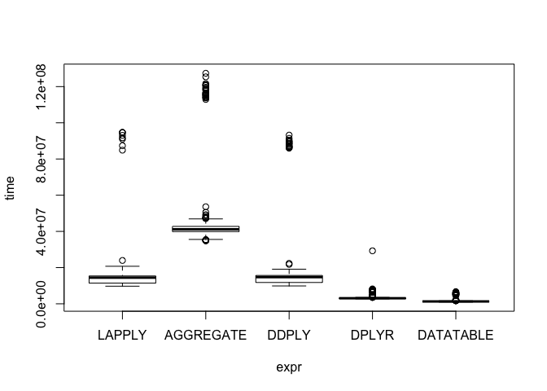
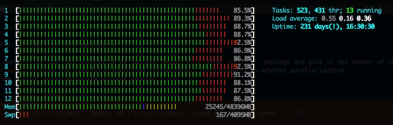

Introduction to R
================

Copyright (c) 2014 Joseph Emeras <joseph.emeras@uni.lu>

Copyright (c) 2017 Aurélien Ginolhac <aurelien.ginolhac@uni.lu>

------------------------------------------------------------------------

R Tutorial
==========

Through this tutorial you will learn how to use R from your local machine or from one of the [UL HPC platform](http://hpc.uni.lu) clusters. We will also use the `ggplot` library to generate nice graphics and export them as pdf files. Then, we will see how to organize and group data. Finally we will illustrate how R can benefit from multicore and cluster parallelization.

Warning: this tutorial does not focus on the learning of R language but aims at showing you nice startup tips.
If you're also looking for a good tutorial on R's data structures you can take a look at: [Hadley Wickham's page](http://adv-r.had.co.nz/Data-structures.html). Another [bookdown](https://bookdown.org/)'s book is available for free: [R for Data Science](http://r4ds.had.co.nz/index.html) by Garrett Grolemund & Hadley Wickham

**Conventions used in this tutorial:**

-   commands that have to be typed on the cluster start with a prompt like this: `jdoe@access:~$`
-   commands that have to be typed on your local machine start with a prompt like this: `jdoe@localhost:~$`
-   code blocks containing one or several `>` should not be pasted "as it", they are meant for you to observe the output of each function; others can be pasted in R terminal "as it".

lecture: introduction to R
--------------------------

see slides:

-   [here as html](https://cdn.rawgit.com/ULHPC/tutorials/devel/advanced/R/Intro_PS.html)
-   [here as pdf](https://github.com/ULHPC/tutorials/raw/devel/advanced/R/Intro_PS.pdf)

Pre-requisites
--------------

### Optional: On your local machine

First of all, let's install R. You will find releases for various distributions available at [CRAN Archive](http://cran.r-project.org/). Once installed, to use R interactive session interface, simply open a terminal and type:

    jdoe@localhost:~$ R

You will also find handy to use the [R-Studio](https://www.rstudio.com/) graphical IDE. R-Studio embeds a R shell where you can call R functions as in the interactive session interface. Thus you can use whether R interactive shell or R-Studio embedded shell.

### On the cluster

R is already available in `chaos`, `gaia` and `iris` clusters as a module. Only `iris` has the latest version `3.4.0`. The first step is the reservation of a resource. Connect to your favorite cluster frontend (here: `iris`). We assume you have already configured your `.ssh/config`.

#### iris

    jdoe@localhost:~$ ssh iris-cluster

Once connected to the user frontend, book 1 core for half an hour (as we will use R in single-threaded mode, we will need only one core).

    [jdoe@access2 ~]$ srun -p interactive --qos qos-interactive --time=0:30:0 --pty bash

When the job is running and you are connected load *R* module. For a complete list of availbale modules see: [Software page](https://hpc.uni.lu/users/software/).

    [jdoe@access2 ~]$ module load lang/R

Now you should be able to invoke R and see something like this:

    [jdoe@iris-081 ~]$  R

    R version 3.4.0 (2017-04-21) -- "You Stupid Darkness"
    Copyright (C) 2017 The R Foundation for Statistical Computing
    Platform: x86_64-pc-linux-gnu (64-bit)

    R is free software and comes with ABSOLUTELY NO WARRANTY.
    You are welcome to redistribute it under certain conditions.
    Type 'license()' or 'licence()' for distribution details.

      Natural language support but running in an English locale

    R is a collaborative project with many contributors.
    Type 'contributors()' for more information and
    'citation()' on how to cite R or R packages in publications.

    Type 'demo()' for some demos, 'help()' for on-line help, or
    'help.start()' for an HTML browser interface to help.
    Type 'q()' to quit R.

    >

`sessionInfo()` function gives information about R version, loaded libraries etc.

    > sessionInfo()
    R version 3.4.0 (2017-04-21)
    Platform: x86_64-pc-linux-gnu (64-bit)
    Running under: CentOS Linux 7 (Core)

    Matrix products: default
    BLAS: /mnt/irisgpfs/apps/resif/data/production/v0.1-20170602/default/software/lang/R/3.4.0-intel-2017a-X11-20170314-bare/lib64/R/lib/libR.so
    LAPACK: /mnt/irisgpfs/apps/resif/data/production/v0.1-20170602/default/software/lang/R/3.4.0-intel-2017a-X11-20170314-bare/lib64/R/modules/lapack.so

    locale:
     [1] LC_CTYPE=en_US.UTF-8       LC_NUMERIC=C              
     [3] LC_TIME=en_US.UTF-8        LC_COLLATE=en_US.UTF-8    
     [5] LC_MONETARY=en_US.UTF-8    LC_MESSAGES=en_US.UTF-8   
     [7] LC_PAPER=en_US.UTF-8       LC_NAME=C                 
     [9] LC_ADDRESS=C               LC_TELEPHONE=C            
    [11] LC_MEASUREMENT=en_US.UTF-8 LC_IDENTIFICATION=C       

    attached base packages:
    [1] stats     graphics  grDevices utils     datasets  methods   base     

    loaded via a namespace (and not attached):
    [1] compiler_3.4.0
    >

### gaia

    jdoe@localhost:~$ ssh gaia-cluster

Once connected to the user frontend, book 1 core for half an hour (as we will use R in single-threaded mode, we will need only one core).

    jdoe@access(gaia-cluster) ~ $ oarsub -I -l core=1,walltime=0:30

When the job is running and you are connected load *R* module. For a complete list of availbale modules see: [Software page](https://hpc.uni.lu/users/software/).

    jdoe@access2:~$ module load lang/R

Now you should be able to invoke R and see something like this:

    jdoe@gaia-59(gaia-cluster)[OAR4159732->29] ~ $ R

    R version 3.3.0 (2016-05-03) -- "Supposedly Educational"
    Copyright (C) 2016 The R Foundation for Statistical Computing
    Platform: x86_64-pc-linux-gnu (64-bit)

    R is free software and comes with ABSOLUTELY NO WARRANTY.
    You are welcome to redistribute it under certain conditions.
    Type 'license()' or 'licence()' for distribution details.

      Natural language support but running in an English locale

    R is a collaborative project with many contributors.
    Type 'contributors()' for more information and
    'citation()' on how to cite R or R packages in publications.

    Type 'demo()' for some demos, 'help()' for on-line help, or
    'help.start()' for an HTML browser interface to help.
    Type 'q()' to quit R.

    >

`sessionInfo()` function gives information about R version, loaded libraries etc.

    > sessionInfo()
    R version 3.3.0 (2016-05-03)
    Platform: x86_64-pc-linux-gnu (64-bit)
    Running under: Debian GNU/Linux 7 (wheezy)

    locale:
     [1] LC_CTYPE=en_US.ISO-8859-15       LC_NUMERIC=C                    
     [3] LC_TIME=en_US.ISO-8859-15        LC_COLLATE=en_US.ISO-8859-15    
     [5] LC_MONETARY=en_US.ISO-8859-15    LC_MESSAGES=en_US.ISO-8859-15   
     [7] LC_PAPER=en_US.ISO-8859-15       LC_NAME=C                       
     [9] LC_ADDRESS=C                     LC_TELEPHONE=C                  
    [11] LC_MEASUREMENT=en_US.ISO-8859-15 LC_IDENTIFICATION=C             

    attached base packages:
    [1] stats     graphics  grDevices utils     datasets  methods   base
    >

### Installing R Packages

To install libraries you can use the `install.packages()` function. *e.g*

`install.packages("ggplot2")`

This will install the `ggplot2` library.

Note: on the first run, R might ask you various questions during the installation. e.g. selecting a CRAN mirror to use for downloading packages. Select a mirror close to your location. For other questions, using default values is ok.

Now, to load this library call:

`library(ggplot2)`

A call to `sessionInfo()` function will return `ggplot2` version as it is now attached to the current session.

Warm-up Session -- Simple Plotting
----------------------------------

### From Single Dataset

Movies dataset, derived from data provided by [IMDB](http://imdb.com) is a sample dataset available as a pacakge in `ggplot2movies` for testing purpose. Its data description can be found [here](http://had.co.nz/data/movies/description.pdf). Thus, when loading `ggplot2movies` library, this dataset is available under the name: `movies`.

(OPTIONAL) An other way to get the dataset would be to download, extract and read it by using the `readr` library (part of the [tidyverse](http://tidyverse.org)) that can uncompress by itself:

``` r
library(readr)
movies <- read_csv("https://github.com/hadley/ggplot2movies/raw/master/data-raw/movies.csv")
```

    ## Parsed with column specification:
    ## cols(
    ##   .default = col_double(),
    ##   title = col_character(),
    ##   year = col_integer(),
    ##   length = col_integer(),
    ##   budget = col_integer(),
    ##   votes = col_integer(),
    ##   mpaa = col_character(),
    ##   Action = col_integer(),
    ##   Animation = col_integer(),
    ##   Comedy = col_integer(),
    ##   Drama = col_integer(),
    ##   Documentary = col_integer(),
    ##   Romance = col_integer(),
    ##   Short = col_integer()
    ## )

    ## See spec(...) for full column specifications.

Now let's take a (reproducible) sample of 1000 movies and plot their distribution regarding their rating.

``` r
library(ggplot2)            # load ggplot2 library to use packages functions
set.seed(5689)              # set the seed for random selection used in `sample()` function
# movies is the data.frame name, from this data.frame, randomly select 1000 rows
movies_sample <- movies[sample(nrow(movies), 1000), ]   
# construct the graph -- movies_sample will be used as data, we will plot an histogram where x=movies_sample$rating and with a bin size=0.5
graph <- ggplot(movies_sample) + geom_histogram(aes(x = rating), binwidth = 0.5)        
ggsave(graph, file = "movies_hist.pdf", width = 8, height = 4)                              # save the graph in a pdf file
```

Now you retrieve the generated pdf on your local workstation for visualization:

    jdoe@localhost:~$ scp iris-cluster:movies_hist.pdf .

`ggplot2` proposes many functions to plot data according to your needs. Do not hesitate to wander in the [ggplot2 documentation](http://ggplot2.tidyverse.org/) and to read at provided examples to better understand how to use it. The `ggsave()` function is convenient to export ggplot graphics as `.pdf`, `.jpg` or `.png` files

you should see:


### From Several Datasets

Now, let's say we have two different datasets: `diamonds_fair` and `diamonds_good` that are both extracts from the `diamonds` dataset (provided in the `ggplot2` dataset). In this example we will consider that these two datasets come from different sources, so do not try to understand the next lines, they are just here to setup the example (simply copy-paste these in your R prompt).

``` r
set.seed(2109)  
diamonds_fair <- data.frame(carat = diamonds$carat[which(diamonds$cut == 'Fair')],
                            price = diamonds$price[which(diamonds$cut == 'Fair')])
diamonds_fair <- diamonds_fair[sample(nrow(diamonds_fair), 20), ]
diamonds_good <- data.frame(carat = diamonds$carat[which(diamonds$cut == 'Good')],
                            price = diamonds$price[which(diamonds$cut == 'Good')])
diamonds_good <- diamonds_good[sample(nrow(diamonds_good), 20), ]
```

To know the class of an R object you can use the `class()` function

``` r
class(diamonds_fair)
```

    ## [1] "data.frame"

So we have these two datasets, being of class dataframe. In R, a `data.frame` is one kind of data structure whose columns have names and that can contain several rows. Basically it looks like a matrix with columns identified by an index *and* a name, and with rows identified by an index. Let's check how they are organized with the `names()` function that gives a dataset column names.

``` r
names(diamonds_fair)
## [1] "carat" "price"
names(diamonds_good)
## [1] "carat" "price"
```

Thus for each dataset row we have the price and the carat value for a given diamond. We want to add a column to datasets that will describe from which one it comes from, then we will merge these into one single dataset.

``` r
diamonds_fair <- cbind(diamonds_fair, cut_class = "Fair")                               # add a column named cut_class with all values being "Fair" to data.frame diamonds_fair
diamonds_good <- cbind(diamonds_good, cut_class = "Good")                               # same with "Good"
diamonds_merge <- rbind(diamonds_fair, diamonds_good)                                   # combine the 2 data.frame with `rbind()` as they both have the same structure
```

`cbind()` function is used to add a column to a dataframe, `rbind()` to combine rows of two dataframes (c is for column, r is for row). Now we have all data merged in a dataframe and a column that describes the origin of data (the column `cut_class`), let's plot data.

Note: To visualize an extract of your data you can do:

``` r
diamonds_merge[1:10,]       # returns rows 1 to 10
```

    ##      carat price cut_class
    ## 297   1.01  3801      Fair
    ## 1104  0.46  1035      Fair
    ## 623   1.01  5538      Fair
    ## 35    0.91  2854      Fair
    ## 290   1.51  3765      Fair
    ## 1560  0.96  2540      Fair
    ## 590   1.01  5226      Fair
    ## 192   0.90  3332      Fair
    ## 563   1.00  5027      Fair
    ## 1213  0.89  1334      Fair

``` r
diamonds_merge[, 3]             # returns column no.3
```

    ##  [1] Fair Fair Fair Fair Fair Fair Fair Fair Fair Fair Fair Fair Fair Fair
    ## [15] Fair Fair Fair Fair Fair Fair Good Good Good Good Good Good Good Good
    ## [29] Good Good Good Good Good Good Good Good Good Good Good Good
    ## Levels: Fair Good

``` r
diamonds_merge$cut_class        # returns column named cut_class
```

    ##  [1] Fair Fair Fair Fair Fair Fair Fair Fair Fair Fair Fair Fair Fair Fair
    ## [15] Fair Fair Fair Fair Fair Fair Good Good Good Good Good Good Good Good
    ## [29] Good Good Good Good Good Good Good Good Good Good Good Good
    ## Levels: Fair Good

Then we construct and save the graph.

this time we use ggplot's function `geom_point()` to plot data points. colour=cut\_class aestetics option will plot the points according to cut\_class values

``` r
graph <- ggplot(data = diamonds_merge) + 
  geom_point(aes(x = carat, y = price, colour = cut_class))
ggsave(graph, file = "diamonds_plot.pdf", width=8, height=4)
```

Remember, to get help about a particular function you can type `?function_name`. e.g.

``` r
?cbind
```

To get package and meta information on a function you can type `??function_name`. e.g.

``` r
??ggsave
```

Organizing your Data
--------------------

Let's say we are working with the full `diamonds` dataset and we want to have the **average** price for a given diamond **cut**.

``` r
names(diamonds)
```

    ##  [1] "carat"   "cut"     "color"   "clarity" "depth"   "table"   "price"  
    ##  [8] "x"       "y"       "z"

We could do a for loop to aggregate the data per cuts and manually compute the average price, but in R loops are generally a bad idea. For large datasets it is very long to compute. Thus instead of looping around the dataset, we will use a function from the `dplyr` package part of the [tidyverse](http://tidyverse.org) idiom

### `dplyr` from the tidyverse

You will first need to install and load `dplyr`.

``` r
install.packages("dplyr")
```

Of note, all core packages of the *tidyverse* could be installed at once

``` r
install.packages("tidyverse")
```

First of all, we chain the commands using the **pipe** *%&gt;%*. That avoids many parenthesis and keep the natural reading from left to right.

The first parameter will be the dataset, the second will be the column of the dataset we want to group the results on, third parameter will be the call to the `summarise()` function that will enable to aggregate data on the `cut` column.

``` r
library(dplyr)
diamonds %>%
  group_by(cut) %>%
  summarise(avg_price = mean(price))
```

    ## # A tibble: 5 x 2
    ##         cut avg_price
    ##       <ord>     <dbl>
    ## 1      Fair  4358.758
    ## 2      Good  3928.864
    ## 3 Very Good  3981.760
    ## 4   Premium  4584.258
    ## 5     Ideal  3457.542

Note: `summarise()` from the `dplyr` package is similar to `aggregate()` from base package, you can use indifferently one or the other, `dplyr` functions simply provide a more consistent naming convention together with better performance

### `aggregate` from base

``` r
aggregate(price ~ cut,
          FUN = mean,
          data = diamonds)
```

    ##         cut    price
    ## 1      Fair 4358.758
    ## 2      Good 3928.864
    ## 3 Very Good 3981.760
    ## 4   Premium 4584.258
    ## 5     Ideal 3457.542

### `lapply` from base

In the previous example we used `aggregate` for the **aggregation**, we could also have used `lapply` (but in a slightlier more complicated way):

``` r
as.data.frame(cbind(cut = as.character(unique(diamonds$cut)), avg_price = lapply(unique(diamonds$cut), function(x) mean(diamonds$price[which(diamonds$cut == x)]))))
```

    ##         cut avg_price
    ## 1     Ideal  3457.542
    ## 2   Premium  4584.258
    ## 3      Good  3928.864
    ## 4 Very Good   3981.76
    ## 5      Fair  4358.758

### `data.table`

[**data.table**](https://github.com/Rdatatable/data.table/wiki/Getting-started) is a package without dependencies that is super fast. Although the syntax is harder to learn compare to `dplyr`. See this long thread [at stackoverflow](https://stackoverflow.com/questions/21435339/data-table-vs-dplyr-can-one-do-something-well-the-other-cant-or-does-poorly) for more details.

``` r
# install.package("data.table")
library(data.table)
```

    ## 
    ## Attaching package: 'data.table'

    ## The following objects are masked from 'package:dplyr':
    ## 
    ##     between, first, last

    ## The following object is masked from 'package:purrr':
    ## 
    ##     transpose

``` r
DT <- data.table(diamonds)
DT[, mean(price), by = cut]
```

    ##          cut       V1
    ## 1:     Ideal 3457.542
    ## 2:   Premium 4584.258
    ## 3:      Good 3928.864
    ## 4: Very Good 3981.760
    ## 5:      Fair 4358.758

### `plyr`

For completeness, we could add `ddply` from `plyr` the first attempt of Hadley Wickham to make data manipulation easier.

``` r
library(plyr)
```

    ## -------------------------------------------------------------------------

    ## You have loaded plyr after dplyr - this is likely to cause problems.
    ## If you need functions from both plyr and dplyr, please load plyr first, then dplyr:
    ## library(plyr); library(dplyr)

    ## -------------------------------------------------------------------------

    ## 
    ## Attaching package: 'plyr'

    ## The following objects are masked from 'package:dplyr':
    ## 
    ##     arrange, count, desc, failwith, id, mutate, rename, summarise,
    ##     summarize

    ## The following object is masked from 'package:purrr':
    ## 
    ##     compact

``` r
ddply(diamonds, .(cut), summarize, avg_price = mean(price))
```

    ##         cut avg_price
    ## 1      Fair  4358.758
    ## 2      Good  3928.864
    ## 3 Very Good  3981.760
    ## 4   Premium  4584.258
    ## 5     Ideal  3457.542

Perfomance Considerations
-------------------------

So, we want to know which one of the two versions is the most efficient, for that purpose, the library `microbenchmark` is handy.

``` r
install.packages("microbenchmark")
```

We can use the `microbenchmark()` function on several expressions, with a given repetition number to compare them:

``` r
library(dplyr) # dplyr needs to be loaded after plyr when both are used
library(microbenchmark)
m <- microbenchmark(LAPPLY    = as.data.frame(cbind(cut = as.character(unique(diamonds$cut)), avg_price = lapply(unique(diamonds$cut), function(x) mean(diamonds$price[which(diamonds$cut == x)])))),
                   AGGREGATE = aggregate(price ~ cut, FUN = mean, data = diamonds),
                   DDPLY     = ddply(diamonds, .(cut), summarize, avg_price = mean(price)),
                   DPLYR     = diamonds %>% group_by(cut) %>% summarise(avg_price = mean(price)),
                   DATATABLE = DT[, .(mean(price)), by = cut],
                   times     = 1000)
m
```

    ## Unit: microseconds
    ##       expr       min        lq      mean    median        uq       max
    ##     LAPPLY  9728.227 11430.066 14327.419 14451.795 15378.028  94718.08
    ##  AGGREGATE 34857.006 39880.578 43258.622 41155.558 42766.251 127360.33
    ##      DDPLY  9868.561 11775.282 15316.425 14737.079 15663.672  93199.60
    ##      DPLYR  2724.228  2964.753  3223.255  3064.992  3199.719  29266.28
    ##  DATATABLE   946.433  1204.498  1460.516  1303.794  1398.279   6723.17
    ##  neval
    ##   1000
    ##   1000
    ##   1000
    ##   1000
    ##   1000

### Plotting the benchmark

result gives us a boxplot graph if you use the base function `plot`

``` r
plot(m)
```



if you want to save as a **png** file

``` r
png("benchmark_boxplot.png")
## plot the graph
plot(m)
## flush the output device to save the graph
dev.off()                   
```

Of note, you can use `ggplot2` via the `autoplot` function

``` r
autoplot(m)
```


Using the `data.table` package
------------------------------

According to the [data.table documentation](http://cran.r-project.org/web/packages/data.table/index.html) `data.table` inherits from `data.frame` to offer fast subset, fast grouping, fast update, fast ordered joins and list columns in a short and flexible syntax, for faster development.

It uses binary search instead of vector scan to perform its operations and thus is scalable. We can convert easily a `data.frame` to a `data.table`.

load the `data.table` package then convert the `data.frame` to a `data.table`:

``` r
MOVIES <- data.table(movies)
```

As `data.table` uses binary search, we have to define manually the keys that will be used for this search, this is done with `setkey()` function.

Let's now create a new `data.frame`. We will make it large enough (10 million rows, 676 groups) to demonstrate the difference between a vector scan and a binary search.

``` r
grpsize <- ceiling(1e7 / 26^2) 
system.time(DF <- data.frame(x = rep(LETTERS, each = 26 * grpsize),
                             y = rep(letters, each = grpsize),
                             v = runif(grpsize * 26^2),
                             stringsAsFactors = FALSE)
)   
```

    ##    user  system elapsed 
    ##   0.910   0.067   0.982

This generated a data.frame named DF with 3 columns.

-   Column `x` is a repetition of uppercase letters from A to Z
-   column `y` is minorcase letters
-   Column `v` is a random uniform value.

To illustrate the difference, we take as example the selection in this large dataset of rows where `x == "R"` and `y == "h"`.

#### vector scan

we select rows where x="R" and y="h". For this we have to scan the full data.frame twice.

``` r
system.time(ans1 <- DF[DF$x=="R" & DF$y=="h",])         
```

    ##    user  system elapsed 
    ##   0.316   0.074   0.411

#### binary search

We select rows that match the join between DT and the data.table row: data.table("R","h"). This will return the same result as before but much faster.

``` r
DT <- data.table(DF)                                    # convert the data.frame to a data.table
setkey(DT, x, y)                                          # set column x and y as data.table keys.
system.time(ans2 <- DT[J("R", "h")])                    
```

    ##    user  system elapsed 
    ##   0.002   0.001   0.003

In the first case, we scan the full table twice (once for selecting x's that are equal to "R", then y's that are equal to "h"), then do the selection. In the second case, we are joining DT to the 1 row, 2 column table returned by data.table("R","h"). We use the alias for joining data.tables called J(), short for join. As we defined x and y as keys, this works like a database join. You can see that vector scan is very long compared to binary search.

#### Grouping

`data.table` also provides faster operations for reading files and grouping data.

Now you can compare the same aggregation operation with `data.frame` and `data.table`. In both examples we aggregate on x and apply the function `sum()` to corresponding v.

`data.frame` and *base* style:

``` r
system.time(tapply(DT$v, DT$x, sum))
```

    ##    user  system elapsed 
    ##   0.500   0.164   0.686

`data.table` style, using `by`:

``` r
system.time(DT[, sum(v), by = x])
```

    ##    user  system elapsed 
    ##   0.150   0.014   0.177

**Question: use `dplyr` instead of `tapply()` in the first example.**

**Question: return the min and max instead of the sum using data.table**

Parallel R
----------

The first part of the tutorial is now over, you can connect to `gaia` cluster and submit an other job requesting several machines.

      jdoe@localhost:~$ ssh gaia-cluster
    jdoe@access(gaia-cluster) ~$ oarsub -I -l nodes=1,walltime=1

<!--
When the job is running and you are connected load R module (version compiled with GCC).

    jdoe@access:~$ module load R/3.0.2-goolf-1.4.10
-->
When the job is running and you are connected load R module (version compiled with Intel Compiler), then run R.

    jdoe@access:~$ module load lang/R
      jdoe@access:~$ R

We will use a large dataset (400K+ rows) to illustrate the effect of parallelization in R (as dataset is large, the following line may take time to complete depending on your network speed).

    > air <- read.csv(url("http://packages.revolutionanalytics.com/datasets/AirOnTimeCSV2012/airOT201201.csv"))

**NOTE**: If downloading the air dataset (above line) takes too much time you can load it from a file on the cluster:

    > load("~jemeras/data/air.rda")

(For information you can save your `air` object just as showed above with: `save(air,file= "~/data/air.rda")`)

If we want to have the number of flights for each destination `DEST` we can do the following:

    dests <- as.character(unique(air$DEST))
      count_flights <- function(x) length(which(air$DEST == x))
      as.data.frame(cbind(dest = dests, nb = lapply(dests, count_flights)))

As the dataframe is large it takes some time to compute

    > microbenchmark(LAPPLY = lapply(dests, count_flights), times = 10)
    Unit: seconds
       expr      min       lq   median       uq      max neval
     LAPPLY 1.607961 1.609036 1.609638 1.610269 2.023961    10

### Single Machine Parallelization

To parallelize the lapply function we can use `mclapply()` from `parallel` package and give it the number of cores to use. `mclapply()` uses the underlying operating system fork() functionality to achieve parallelization. Using several cores makes the process shorter.

``` r
library(parallel)
as.data.frame(cbind(dest = dests, nb = mclapply(dests, count_flights, mc.cores = 12)))
    
library(microbenchmark)
microbenchmark(MCLAPPLY = mclapply(dests, count_flights, mc.cores = 12), times = 20)  # or use `detectCores()` from `parallel` package instead of giving cores value.
```

      Unit: milliseconds
           expr      min       lq   median       uq     max neval
       MCLAPPLY 233.8035 235.1089 235.9138 236.6393 263.934    10

It is nice to visualize all your cores working on your node with `htop` for example. You can connect to the same node from another terminal by typing:

      jdoe@access:~$ oarstat -u
      Job id     Name           User           Submission Date     S Queue
      ---------- -------------- -------------- ------------------- - ----------
      6664321                   jdoe           2015-06-03 14:24:23 R default

Note the `Job id` field. Put this job id in the next command:

      jdoe@access:~$ oarsub -C 6664321

Then `htop` will show you your cores working if you call again the `mclapply()` function.



Finally you can save the `air` R object to reuse it in an other R session.

    > save(air, file = "./air.rda")

Then quit your current R session but **do not** end your current `oar` job.

### `dplyr` version

``` r
library(dplyr)
count(air, DEST)
microbenchmark(DPLYR = count(air, DEST), times = 20)
```

    Unit: milliseconds
      expr      min       lq     mean   median       uq     max neval
     DPLYR 25.66517 25.86669 26.40936 26.11667 26.83215 28.1973    20

Optimised code may be better than parallelisation. Of note, parallel `dplyr` exists: [`multidplyr`](https://github.com/hadley/multidplyr).

### Cluster Parallelization

The `parLapply()` function will create a cluster of processes, which could even reside on different machines on the network, and they communicate via TCP/IP or MPI in order to pass the tasks and results between each other. Thus you have to load necessary packages and export necessary data and functions to the global environment of the cluster workers.

First, add the module loading at bash login too for enabling it on the nodes. To do so, within a shell type:

    echo "module load lang/R" >> ~/.bash_login      # /!\ TO REMOVE AT THE END OF PS /!\
      module purge
      module load lang/R

**Warning: do not forget to clean your ~/.bash\_login file after the PS (remove the 'module load lang/R/3.2.0-ictce-7.3.5-bare' line).**

#### Socket Communications

First, let's load data and initialize variables.

    library(parallel)

      # air = read.csv(url("http://packages.revolutionanalytics.com/datasets/AirOnTimeCSV2012/airOT201201.csv"))  # load again the air data.table from http
    load("./air.rda")   # read saved R object from file "air.rda"
      dests = as.character(unique(air$DEST))
      count_flights = function(x){length(which(air$DEST == x))}

      ## set cluster characteristics -- get OAR nodes to use, type of communication
      nodes = scan(Sys.getenv("OAR_NODE_FILE"), what=character(0))
      oar_job_id = as.numeric(Sys.getenv("OAR_JOB_ID"))
      connector = paste0("OAR_JOB_ID=", oar_job_id)
      connector = paste0(connector, " ~jemeras/bin/roarsh")
      comm_type = "PSOCK"

Then, setup the cluster.

      ## set up the cluster
      cl = makeCluster(nodes, type = comm_type, rshcmd = connector) 
      ## If a particular library <LIB> is needed, load it on the nodes with
      # clusterEvalQ(cl, { library(<LIB>) })
      ## or give the full environment with
      # clusterEvalQ(cl, sessionInfo())
      ## export air dataset on all the nodes
      clusterExport(cl, varlist=c("air"))

Do the parallel computation.

      ## compute in parallel through sockets
      as.data.frame(cbind(dest=dests, nb=parLapply(cl, dests, count_flights)))

Finalize and cleanup things.

      stopCluster(cl)

**Exercise: Plot a speedup graph with different number of cores and/or machines used.**

#### MPI Communications

In this section we will use the same example as previously but with MPI connections. For that purpose we need to install two libraries: `rmpi` and `snow`.

As we are using R compiled with Intel compiler we will have to specify manually some paths and which version of MPI we are using when installing `rmpi`.

    > install.packages("Rmpi",
                       configure.args =
                       c(paste("--with-Rmpi-include=",Sys.getenv("EBROOTIMPI"),"/include64",sep=""),
                         paste("--with-Rmpi-libpath=",Sys.getenv("EBROOTIMPI"),"/lib64",sep=""),
                         paste("--with-mpi=",Sys.getenv("EBROOTIMPI"),sep=""),
                         "--with-Rmpi-type=OPENMPI"))

**NOTE**: if the installation fails you can try using the module with `Rmpi` already installed:

      module purge
      module load lang/R/3.2.0-ictce-7.3.5-Rmpi

Then, outside of R shell write a file named `parallelAirDests.R` with the following code.

**Warning**: when using parallelization in R, please keep in mind that communication is much slower than computation. Thus if your problem is involving a long computation then you are right to use it, otherwise, if your problem is a large quantity of data you must use `data.table` or `dplyr`.

      library(Rmpi)
      library(snow)
      
      # Initiate the cluster
      cluster <- makeMPIcluster(length(readLines(Sys.getenv("OAR_NODE_FILE"))))
      
      # Function that prints the hostname of the caller, just for fun
      sayhello <- function()
      {
          info <- Sys.info()[c("nodename", "machine")]
          paste("Hello from", info[1])
      }
      
      # Call the 'sayhello' function on each node of the cluster
      names <- clusterCall(cluster, sayhello)
      print(unlist(names))
      
        
      # Compute the number of flights for a given destination. 
      # Same as previous examples but with MPI communications.
      load("~jemeras/data/air.rda")
      dests = as.character(unique(air$DEST))
      count_flights = function(x){length(which(air$DEST == x))}
      #as.data.frame(cbind(dest=dests, nb=lapply(dests, count_flights)))
      clusterExport(cluster, "air")
      
      print(as.data.frame(cbind(dest=dests, nb=parLapply(cluster, dests, count_flights))))
      
      # Terminate the cluster
      stopCluster(cluster)

Then, still outside of R and on your job head node run:

      mpirun -np 1 -machinefile $OAR_NODE_FILE Rscript parallelAirDests.R

You may find strange the `-np 1`, in fact this is because it is `snow` that manages the processes spawning.

<!--
# With dplyr
DPLYR = air %>% dplyr::group_by(DEST) %>% dplyr::summarize(length(FL_NUM))

# With data.table
DT = data.table(air)[, .N, by=DEST]

microbenchmark(DPLYR, DT, times=1000)
Unit: nanoseconds
  expr min lq   mean median uq   max neval
 DPLYR  33 43 61.213     46 48  8844  1000
    DT  31 42 94.902     44 46 50623  1000

## DPLYR can be more efficient than data.table...
-->
<!--
#### MPI Communications

In this section we will use R with MPI connections. We will use the OpenMPI implementation and thus we need to load a custom R easybuild module.

First unload all previously loaded modules.

    module purge

Then load the custom module

    module use /home/users/jemeras/.easybuild/modules/all/
    module load lang/R/3.2.0-goolf-1.4.10-bare

Install `Rmpi` and `snow` packages in R (you might need to specify manually the MPI type before installing the package, this can be done via the RMPI_TYPE env variable).

    > Sys.setenv(RMPI_TYPE='OPENMPI')
    > install.packages("Rmpi", "snow")
-->
### Useful links

-   [CRAN Archive](http://cran.r-project.org/)

-   [CRAN HPC Packages](http://cran.r-project.org/web/views/HighPerformanceComputing.html)

-   [ggplot2 Documentation](http://ggplot2.tidyverse.org/)

-   [Advanced R programming by Hadley Wickham](http://adv-r.had.co.nz/)
