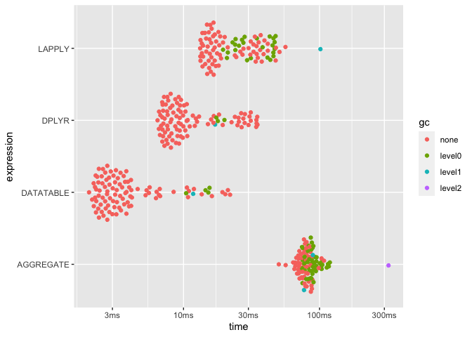

Introduction to R
================

[](https://hpc.uni.lu)
[](http://www.gnu.org/licenses/gpl-3.0.html)
[](https://github.com/ULHPC/tutorials/issues/)
[](https://github.com/ULHPC/tutorials/raw/devel/maths/R/PS11-introduction_to_R.pdf)
[](https://github.com/ULHPC/tutorials/tree/devel/maths/R/)
[](http://ulhpc-tutorials.readthedocs.io/en/latest/maths/R/)
[](https://github.com/ULHPC/tutorials)

-----

# R Tutorial

``` 
  Copyright (c) 2013-2019 Aurelien Ginolhac, UL HPC Team  <hpc-sysadmins@uni.lu>
```

[](https://github.com/ULHPC/tutorials/raw/devel/maths/R/PS11-introduction_to_R.pdf)

  - [slides as dynamic
    html](https://cdn.rawgit.com/ULHPC/tutorials/devel/maths/R/Intro_PS.html)

Through this tutorial you will learn how to use R from your local
machine or from one of the [UL HPC platform](http://hpc.uni.lu)
clusters. Then, we will see how to organize and group data. Finally we
will illustrate how R can benefit from multicore and cluster
parallelization.

Warning: this tutorial does not focus on the learning of R language but
aims at showing you nice start-up tips.  
If you’re also looking for a good tutorial on R’s data structures you
can take a look at: [Hadley Wickham’s
page](http://adv-r.had.co.nz/Data-structures.html). Another
[bookdown](https://bookdown.org/)’s book is available for free: [R for
Data Science](http://r4ds.had.co.nz/index.html) by Garrett Grolemund &
Hadley Wickham

-----

## Pre-requisites

Ensure you are able to [connect to the UL HPC
clusters](https://hpc.uni.lu/users/docs/access.html)

**you MUST work on a computing
node**

``` bash
# /!\ FOR ALL YOUR COMPILING BUSINESS, ENSURE YOU WORK ON A COMPUTING NODE
# Have an interactive job
############### iris cluster (slurm) ###############
(access-iris)$> si -n 2 -t 2:00:00        # 2h interactive reservation
# OR (long version)
(access-iris)$> srun -p interactive -n 2 -t 2:00:00 --pty bash
```

### Optional: On your local machine

First of all, let’s install R. You will find releases for various
distributions available at [CRAN Archive](http://cran.r-project.org/).
Once installed, to use R interactive session interface, simply open a
terminal and type:

    jdoe@localhost:~$ R

You will also find handy to use the [R-Studio](https://www.rstudio.com/)
graphical IDE. R-Studio embeds a R shell where you can call R functions
as in the interactive session interface. Thus you can use whether R
interactive shell or R-Studio embedded shell.

### Installing R Packages

To install libraries you can use the `install.packages()` function.
*e.g*

`install.packages("tidyverse")`

This will install the core packages of the `tidyverse`, including
`ggplot2` and `dplyr`.

Note: on the first run, R might ask you various questions during the
installation. e.g. selecting a CRAN mirror to use for downloading
packages. Select a mirror close to your location. For other questions,
using default values is ok.

Now, to load packages with a `library()` call:

`library(ggplot2)`

A call to `sessionInfo()` function will return `ggplot2` version as it
is now attached to the current session.

## Beginner session – dataSaurus

in R or Rstudio do `install.packages("tidyverse")` (takes some time)

instructions: [in this
tutorial](https://rworkshop.uni.lu/practicals/practical01_datasauRus.html)

## Comparing methods for aggregating data – diamonds

Let’s say we are working with the full `diamonds` dataset (suppplied by
the `ggplot2` package) and we want to compute the **average** price for
a given diamond **cut**.

This dataset is not small:

``` r
dim(diamonds)
```

    ## [1] 53940    10

before computing the average price per **cut**, we should explore the
dataset. We won’t use the ggplot’s function `geom_point()` as there are
too many dots. However, bining the data is fast and still provide an
idea of where the majority of dots are with a chosen lost of precision
(number of **bins**, set to 30 by default).

From previous plots, we know the relationship between carat and price is
linear in the log-space. All those computation can be done by `ggplot2`

Of note: you may need to install the package `hexbin`

``` r
ggplot(diamonds) + 
  # bin data into 30 sets
  geom_hex(aes(x = carat, y = price), bins = 30) +
  # split per cut
  facet_wrap(~ cut) +
  # log transform both axes
  scale_x_log10() +
  scale_y_log10() +
  # add logsticks to bottom and left
  annotation_logticks(side = "bl") +
  # viridis is so much better than the default blue gradient
  scale_fill_viridis_c() +
  theme_minimal(14)
```

<!-- -->

``` r
#ggsave(file = "diamonds_plot.pdf", last_plot(), width = 8, height = 4)
```

## Speed comparison of different tools for aggregating data

We could do a for loop to aggregate the data per cuts and manually
compute the average price, but in R loops are generally a bad idea ([if
you avoid growing vectors there are
fine](https://privefl.github.io/blog/why-loops-are-slow-in-r/)). It is
better to concentrate on actions and not on programming, so the looping
can be efficiently done internally.

Thus instead of looping around the dataset, we will use a function from
the `dplyr` package part of the [tidyverse](http://tidyverse.org) idiom

### `dplyr` from the tidyverse

First of all, we chain the commands using the **pipe** *%\>%*. That
avoids many parenthesis and keep the natural reading from left to right.

The first parameter will be the dataset, the second will be the column
of the dataset we want to group the results on, third parameter will be
the call to the `summarise()` function that will enable to aggregate
data on the `cut` column.

``` r
library(dplyr)
diamonds %>%
  group_by(cut) %>%
  summarise(avg_price = mean(price))
```

    ## # A tibble: 5 x 2
    ##   cut       avg_price
    ##   <ord>         <dbl>
    ## 1 Fair          4359.
    ## 2 Good          3929.
    ## 3 Very Good     3982.
    ## 4 Premium       4584.
    ## 5 Ideal         3458.

Note: `summarise()` from the `dplyr` package is similar to `aggregate()`
from base package, `dplyr` functions simply provide a more consistent
naming convention together with better performance

### `aggregate` from base

``` r
aggregate(price ~ cut,
          FUN = mean,
          data = diamonds)
```

    ##         cut    price
    ## 1      Fair 4358.758
    ## 2      Good 3928.864
    ## 3 Very Good 3981.760
    ## 4   Premium 4584.258
    ## 5     Ideal 3457.542

### `lapply` from base

In the previous example we used `aggregate` for the **aggregation**, we
could also have used `lapply` (but in a more complex
way):

``` r
as.data.frame(cbind(cut = as.character(unique(diamonds$cut)), avg_price = lapply(unique(diamonds$cut), function(x) mean(diamonds$price[which(diamonds$cut == x)]))))
```

    ##         cut avg_price
    ## 1     Ideal  3457.542
    ## 2   Premium  4584.258
    ## 3      Good  3928.864
    ## 4 Very Good   3981.76
    ## 5      Fair  4358.758

### `data.table`

[**data.table**](https://github.com/Rdatatable/data.table/wiki/Getting-started)
is a package without dependencies that is super fast. Although the
syntax is harder to learn compared to `dplyr`, if speed is your concern,
it is your go-to package. See this long thread [at
stackoverflow](https://stackoverflow.com/questions/21435339/data-table-vs-dplyr-can-one-do-something-well-the-other-cant-or-does-poorly)
for a comparison of both tools.

``` r
# install.package("data.table")
suppressPackageStartupMessages(library(data.table))
DT <- data.table(diamonds)
DT[, mean(price), by = cut] 
```

    ##          cut       V1
    ## 1:     Ideal 3457.542
    ## 2:   Premium 4584.258
    ## 3:      Good 3928.864
    ## 4: Very Good 3981.760
    ## 5:      Fair 4358.758

So, we want to know which one of the two versions is the most efficient,
for that purpose, the package `bench` is handy.

``` r
install.packages("bench")
```

The `mark()` function performs x times the calls of several expressions,
grabbing its performance (time and ressources used)

``` r
library(bench)
set.seed(123)
m <- bench::mark(LAPPLY    = as.data.frame(cbind(cut = as.character(unique(diamonds$cut)),
                                                 price = lapply(unique(diamonds$cut), function(x) mean(diamonds$price[which(diamonds$cut == x)])))),
                 AGGREGATE = aggregate(price ~ cut, FUN = mean, data = diamonds),
                 DPLYR     = group_by(diamonds, cut) %>% summarise(price = mean(price)),
                 DATATABLE = DT[, list(price = mean(price)), by = cut],
                 iterations = 100, check = FALSE)
m
```

    ## # A tibble: 4 x 6
    ##   expression      min   median `itr/sec` mem_alloc `gc/sec`
    ##   <bch:expr> <bch:tm> <bch:tm>     <dbl> <bch:byt>    <dbl>
    ## 1 LAPPLY       10.1ms  11.92ms      74.7    8.04MB    22.3 
    ## 2 AGGREGATE   41.43ms  51.98ms      18.4   11.85MB    13.9 
    ## 3 DPLYR        2.03ms   2.31ms     368.   211.22KB     3.72
    ## 4 DATATABLE    3.37ms   4.16ms     221.     1.24MB     9.19

  - makes comparison easier to read using **relative** values. `1` for
    the fastest.

<!-- end list -->

``` r
summary(m, relative = TRUE)
```

    ## # A tibble: 4 x 6
    ##   expression   min median `itr/sec` mem_alloc `gc/sec`
    ##   <bch:expr> <dbl>  <dbl>     <dbl>     <dbl>    <dbl>
    ## 1 LAPPLY      4.97   5.15      4.06     39.0      6.00
    ## 2 AGGREGATE  20.4   22.5       1        57.5      3.73
    ## 3 DPLYR       1      1        20.0       1        1   
    ## 4 DATATABLE   1.66   1.80     12.0       6.02     2.47

### Plotting the benchmark

You can use `ggplot2` via the `autoplot()` function

``` r
autoplot(m)
```

<!-- -->

  - plot the memory allocation

<!-- end list -->

``` r
m %>%
  unnest() %>%
  filter(gc == "none") %>%
  mutate(expression = as.character(expression)) %>%
  ggplot(aes(x = mem_alloc, y = time, color = expression)) +
  geom_point() +
  theme_minimal(14)
```

<!-- -->

## Parallel computing using HPC

R is already available on `iris` clusters as a module. The current
production version `3.4.4`, but you can get the uptodate `3.6.0` by
fetching the **development** version of the module lists Valentin
Plugaru prepared. They will soon by be released as the default
production environment. The first step is the reservation of a resource.
Connect to your favorite cluster frontend (here: `iris`). We assume you
have already configured your `.ssh/config`.

#### iris

    jdoe@localhost:~$ ssh iris-cluster

Once connected to the user frontend, book **4** cores for half an hour

    [jdoe@access2 ~]$ srun -p interactive  --time=0:30:0 -c 4 --pty bash

When the job is running and you are connected load *R* module (so
version `3.4.4`).

    [jdoe@access2 ~]$ module load lang/R

Now you should be able to invoke R and see something like this:

    [jdoe@iris-081 ~]$  R
    
    R version 3.4.4 (2018-03-15) -- "Someone to Lean On"
    Copyright (C) 2018 The R Foundation for Statistical Computing
    Platform: x86_64-pc-linux-gnu (64-bit)
    [...]
    Type 'q()' to quit R.
    >

`sessionInfo()` function gives information about R version, loaded
libraries etc.

    > sessionInfo()
    R version 3.4.4 (2018-03-15)
    Platform: x86_64-pc-linux-gnu (64-bit)
    Running under: CentOS Linux 7 (Core)
    
    Matrix products: default
    BLAS/LAPACK: /mnt/irisgpfs/apps/resif/data/devel/default/software/numlib/OpenBLAS/0.2.20-GCC-6.4.0-2.28/lib/libopenblas_haswellp-r0.2.20.so
    
    locale:
     [1] LC_CTYPE=en_US.UTF-8       LC_NUMERIC=C              
     [3] LC_TIME=en_US.UTF-8        LC_COLLATE=en_US.UTF-8    
     [5] LC_MONETARY=en_US.UTF-8    LC_MESSAGES=en_US.UTF-8   
     [7] LC_PAPER=en_US.UTF-8       LC_NAME=C                 
     [9] LC_ADDRESS=C               LC_TELEPHONE=C            
    [11] LC_MEASUREMENT=en_US.UTF-8 LC_IDENTIFICATION=C       
    
    attached base packages:
    [1] stats     graphics  grDevices utils     datasets  methods   base     
    
    loaded via a namespace (and not attached):
    [1] compiler_3.4.4

### mandatory packages

The core package we are going to use is
[`future`](https://github.com/HenrikBengtsson/future) by [Henrik
Bengtsson](https://github.com/HenrikBengtsson).

The main idea is to run expressions **asynchronously**. Future
expressions are run according to *plan* defined by the user.

for the last section, you need to install the following packages,
`future`, `furrr` and `Rstne`

On `iris`, in an interactive session, load the module to get R version
3.6.0, still **not** in *production*

    module load swenv/default-env/devel
    module load lang/R/3.6.0-foss-2019a-bare

you will a warning because it hasn’t been fully tested yet.

After entering R using the `R` command, install both packages. Don’t
forget to use multi-threading for the
compilations.

``` r
install.packages(c("future", "furrr", "purrr", "dplyr", "dbscan", "tictoc", "Rtsne"), repos = "https://cran.rstudio.com", Ncpus = 4)
```

quit by typing `quit()` and `n` do not save workspace image (actually,
this should be your default).

The [`furrr` package](https://davisvaughan.github.io/furrr/) by David
Vaughan is a nice wrapper around `future` and `purrr`, the functional
programming idiom of the tidyverse.

### toy example

Run a dumb loop on 3 times **2** that wait for those values

  - first sequentially

<!-- end list -->

``` r
library(furrr)
```

    ## Loading required package: future

``` r
plan(sequential)
tictoc::tic()
nothingness <- future_map(c(2, 2, 2), ~Sys.sleep(.x), .progress = TRUE)
tictoc::toc()
```

    ## 6.054 sec elapsed

  - second in parallel

<!-- end list -->

``` r
plan(multiprocess)
tictoc::tic()
nothingness <- future_map(c(2, 2, 2), ~Sys.sleep(.x), .progress = TRUE)
```

    ## 
     Progress:                                                                                                                     100%
     Progress:                                                                                                                     100%
     Progress: ─────────────────────────────────────────────────────────────────────────────────────────────────────────────────── 100%

``` r
tictoc::toc()
```

    ## 2.275 sec elapsed

fetch env variables in R

`as.integer(Sys.getenv("SLURM_CPUS_PER_TASK"))`

### t-SNE example

Now, let’s try with a real example. Using some data supplied as a R
object.

Create both the `R` and `bash` script in a folder (likely your `scratch`
partition).

#### R script

``` r
library(dplyr)
library(purrr)
library(furrr)
library(Rtsne)

# check the path of pkgs
.libPaths()
# see how many cores are going to be used
availableCores()
# load data
tSNEdata <- readRDS("/scratch/users/aginolhac/renv/tSNEdata.rds")
# create a partial function with filled arguments 
short_tsne <- purrr::partial(Rtsne, X = tSNEdata, pca_center = TRUE, 
                            theta = 0.5, pca_scale = TRUE, verbose = TRUE, max_iter = 300)

plan(multiprocess)

tictoc::tic(msg = "tsne")
tsne_future <- tibble(perplexities = seq(10, 110, by = 5)) %>%
                 # quietly captures outputs
                 mutate(model = future_map(perplexities, ~quietly(short_tsne)(perplexity = .x), .progress = FALSE))
tictoc::toc()


tictoc::tic("finding clusters")
res_tib <- mutate(tsne_future,
                  # unlist and extract the 2D matrix 
                  Y = map(model, pluck, "result", "Y"),
                  # convert to a dataframe
                  Y_df = map(Y, as.data.frame),
                  # for clustering, parallelise since expensive step
                  cluster = future_map(Y_df, dbscan::hdbscan, minPts = 200),
                  # extract from hdbscan object only the cluster info
                  c = map(cluster, pluck, 1),
                  # iterate though the 2D coordinates and cluster info to merge them
                  tsne = map2(Y_df, c, ~ bind_cols(.x, tibble(c = .y))),
                  # extract the output of tsne runs if needed to be parsed
                  output = map_chr(model, pluck, "output"))
tictoc::toc()

saveRDS(res_tib, "tsne_future.rds")
```

save as file named **tsne.R**

#### launcher for 10 minutes on one full node (28 cores)

``` bash
#!/bin/bash -l
#SBATCH -J tsne_hpc
#SBATCH -N 1
#SBATCH -c 28
#SBATCH --ntasks-per-node=1
#SBATCH --time=0-00:10:00
#SBATCH -p batch
#SBATCH --qos=qos-batch

echo "== Starting run at $(date)"
echo "== Job ID: ${SLURM_JOBID}"
echo "== Node list: ${SLURM_NODELIST}"
echo "== Submit dir. : ${SLURM_SUBMIT_DIR}"

# use version 3.6.0 and load the GNU toolchain
module load swenv/default-env/devel
module load lang/R/3.6.0-foss-2019a-bare

# prevent sub-spawn, 28 cores -> 28 processes
export OMP_NUM_THREADS=1
export MKL_NUM_THREADS=1

Rscript tsne.R > job_${SLURM_JOB_NAME}.out 2>&1
```

save as file named **launcher.sh**. It requests a full node of **28**
cores

#### Run the job

on the `iris` frontend, in the folder where both the **tsne.R** and
**launcher.sh** files are located, type the `slurm` command:

    sbatch launcher.sh

you can monitor the queue line with:

    squeue -l -u $USER

When your *passive* job has started, you can connect to the assigned
node using the `sjoin` command on the frontend by Valentin Plugaru, use
<TAB> to autocomplete the correct job and node ids.

Once logged in, you can check that the job is indeed run using the 28
cores as the output of `htop` below


and that they are dully full processes


`furrr` allows to simply change your `map()` functions to `future_map()`
to run in parallel. `future` takes in charge all the spawning and
fetching of the processes.

it should give the following timing, looking at the `job_tsne_hpc.out`
file:

    tsne: 16.103 sec elapsed
    finding clusters: 2.395 sec elapsed

##### trying the sequential version

  - remove the `future` calls

`sed 's/future_map/map/' tsne.R > tsne_nofuture.R`

  - adapt launcher script

`sed 's/tsne.R/tsne_nofuture.R/' launcher.sh > launcher_nofuture.sh`

  - submit the job

`sbatch launcher_nofuture.sh`

  - new timing, same `job_tsne_hpc.out` file:

<!-- end list -->

    tsne: 214.913 sec elapsed
    finding clusters: 28.043 sec elapsed

#### Conclusion

see below the benefit of using more cores on the elapsed time for
computationally intensive tasks such as t-SNE (code in
[`furrr_benchmark.Rmd`](https://github.com/ULHPC/tutorials/blob/devel/maths/R/furrr_benchmark.Rmd))


#### Animation

just for the fun of it, using the
[gganimate](https://github.com/thomasp85/gganimate) package, we can
visualise how the t-SNE evolves with increasing perplexities


If of interest, the code it as follows (install required for
`gganimate`, `gifski`):

Beware, the animating takes ~ 4 minutes to complete.

``` r
library(gganimate)

res <- read_rds("tsne_future.rds")

res %>%
  rename(cdbl = c) %>%
  filter(perplexities %in% seq(10, 110, 20)) %>% 
  unnest(tsne) %>%
  select(-output) %>%
  group_by(perplexities) %>%
  mutate(n = row_number()) -> tib_light

tictoc::tic("tweening")
tib_light %>%
  ggplot(aes(x = V1, y = V2, group = n, colour = factor(c))) +
  geom_point(data = function(x) filter(x, c == 0), colour = "grey50", alpha = 0.2) +
  geom_point(data = function(x) filter(x, c != 0), alpha = 0.6) +
  transition_states(perplexities, transition_length = 5, state_length = 1) +
  ease_aes('cubic-in-out') +
  labs(title = "perplexities: {closest_state}") +
  labs(colour = "cluster") +
  coord_equal() +
  theme_minimal(14) +
  theme(legend.position = "bottom") -> tib_anim
tictoc::toc()
tictoc::tic("animate")
tib_gif <- animate(tib_anim, nframes = 200, fps = 10)
tictoc::toc()
tib_gif
anim_save("tsne_200.gif", tib_gif)
```

### Reading data

For the t-SNE example, we cheated a bit by loading a R compressed object
I prepared in advance (`.rds`). It was convenient because loading was
fast and the columns and numbers were correctly read.

In real life though, most dataset come as text files with some
delimiters. Now we can load the equivalent of the t-SNE data as a `.csv`
file and benchmarks the main tools for this step.

  - `read.csv()` is the base function. Turns out to be slow for large
    files.
  - [`fread()`](https://www.rdocumentation.org/packages/data.table/versions/1.12.2/topics/fread)
    is the fantastic and fast import function from
    `data.table`
  - [`read_csv()`](https://readr.tidyverse.org/reference/read_delim.html)
    is the tidyverse way of reading a csv. Fast than base, slower than
    `data.table`.
  - \[`vroom()`\] is the recent
    [package](http://vroom.r-lib.org/articles/vroom.html) that could be
    the next standard for reading files in the tidyverse dialect. Check
    the [benchmarks](http://vroom.r-lib.org/articles/benchmarks.html)
    for a detailed comparison. It uses the
    [ALTREP](https://purrple.cat/blog/2018/10/14/altrep-and-cpp/)
    introduced in R `3.5.0` that allows to delay actual reading data,
    making it super fast. Materialization of data comes when you need
    the exact column and rows.

Here we will benchmark reading only numbers since it is a matrix of
doubles.

In your session on `iris`, in the R console,

  - first install required
packages

<!-- end list -->

``` r
install.packages(c("vroom", "ggplot2", "cowplot", "data.table", "readr", "bench", "ggbeeswarm"), Ncpus = 4)
```

paste the following code:

``` r
library(dplyr)
library(ggplot2)
library(readr)

# must set thread by hand since parallel::detectCores() will detect 28.
# overhead will be bad for the performance
Sys.setenv(VROOM_THREADS = as.integer(Sys.getenv("SLURM_CPUS_PER_TASK")))
# must be 4
as.integer(Sys.getenv("VROOM_THREADS"))

tSNEdata_location <- "tSNEdata.csv"
bench::mark(base = read.csv(tSNEdata_location),
            readr = readr::read_csv(tSNEdata_location, col_types = cols(), progress = FALSE),
            data.table = data.table::fread(tSNEdata_location),
            dat_vroom = vroom::vroom(tSNEdata_location, col_types = cols(), progress = FALSE),
            dat_vroom_altrep = vroom::vroom(tSNEdata_location, altrep_opts = TRUE, col_types = cols(), progress = FALSE),
            check = FALSE, iterations = 50) -> m
# show tables, absolute and relative
m
summary(m, relative = TRUE)
# create a plot of both speed and memory allocations, align the vertical lines
p <- cowplot::plot_grid(autoplot(m),
                        m %>%
                          tidyr::unnest() %>%
                          filter(gc == "none") %>%
                          mutate(expression = as.character(expression)) %>%
                          ggplot(aes(x = mem_alloc, y = time, color = expression)) +
                          geom_point() +
                          theme_minimal(14), ncol = 1, align = "v")
# save as pdf
ggsave("csv_benchmarks.pdf", p, width = 8)
```

    # A tibble: 5 x 13
      expression           min  median `itr/sec` mem_alloc `gc/sec` n_itr  n_gc
      <bch:expr>       <bch:t> <bch:t>     <dbl> <bch:byt>    <dbl> <int> <dbl>
    1 base             205.7ms 210.1ms      4.70        0B    2.35     34    17
    2 readr            171.7ms 172.9ms      5.77        0B    0.641    45     5
    3 data.table        80.9ms  86.3ms     11.6         0B    1.01     46     4
    4 dat_vroom         61.8ms  65.3ms     14.3         0B    1.25     46     4
    5 dat_vroom_altrep  42.7ms  47.5ms     21.2         0B    1.84     46     4
    # … with 5 more variables: total_time <bch:tm>, result <list>, memory <list>,
    #   time <list>, gc <list>

    # A tibble: 5 x 13
      expression         min median `itr/sec` mem_alloc `gc/sec` n_itr  n_gc
      <bch:expr>       <dbl>  <dbl>     <dbl>     <dbl>    <dbl> <int> <dbl>
    1 base              4.82   4.43      1          NaN     3.67    34    17
    2 readr             4.03   3.64      1.23       NaN     1       45     5
    3 data.table        1.90   1.82      2.46       NaN     1.57    46     4
    4 dat_vroom         1.45   1.38      3.05       NaN     1.94    46     4
    5 dat_vroom_altrep  1      1         4.51       NaN     2.88    46     4
    # … with 5 more variables: total_time <bch:tm>, result <list>, memory <list>,
    #   time <list>, gc <list>


By default the `ALTREP` framework for `vroom` is used only for
**characters**. `vroom` is multi-threaded and will use the 4 cores we
have (on `iris` we need to set it up manually) and performed similarly
as `data.table` which was designed to be efficient for **numeric** data.
By activating the option for all data types (altrep\_opts = TRUE),
`vroom` becomes even faster than `data.table`. But it means that after
materialization, it will be slower. However, for **characters**, `vroom`
is faster even after materialization, see the
[benchmarks](http://vroom.r-lib.org/articles/benchmarks.html) done by
the author [Jim Hester](https://github.com/jimhester) (also maintainer
of `readr`).

### Enclosed R packages environment

this package is still under development but is the promising replacement
for `packrat`. Here is some instructions extracted from the [overview
vignette](https://rstudio.github.io/renv/articles/renv.html)

  - installation (`install.packages("remotes")` if you miss `remotes`)

<!-- end list -->

``` r
remotes::install_github("rstudio/renv")
```

### Useful links

  - [CRAN Archive](https://cran.r-project.org/)
  - [CRAN HPC
    Packages](https://cran.r-project.org/web/views/HighPerformanceComputing.html)
  - [tidyverse Documentation](https://tidyverse.org/)
  - [4-days tidyverse workshop.uni.lu](https://rworkshop.uni.lu/)
  - [Advanced R programming by Hadley Wickham](http://adv-r.had.co.nz/)
