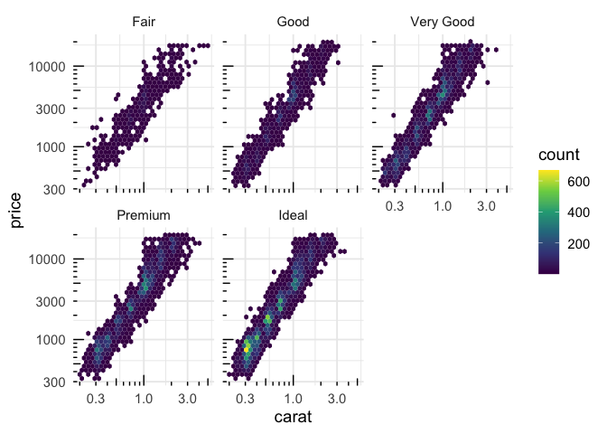
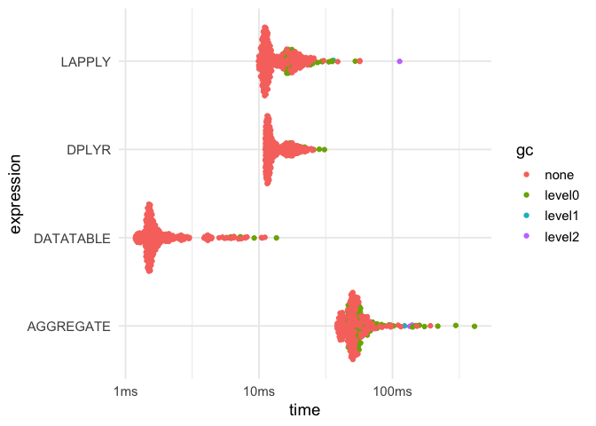
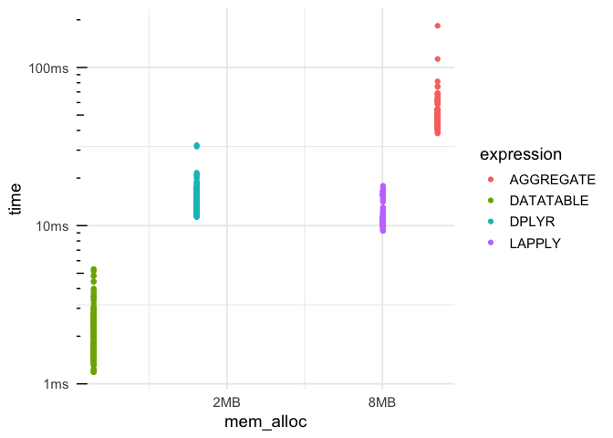
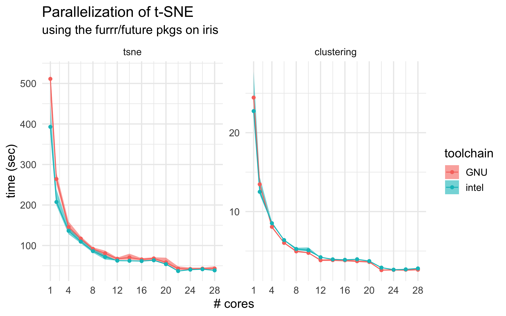

Introduction to R
================

[](https://hpc.uni.lu)
[](http://www.gnu.org/licenses/gpl-3.0.html)
[](https://github.com/ULHPC/tutorials/issues/)
[](https://github.com/ULHPC/tutorials/raw/devel/maths/R/PS12-introduction_to_R.pdf)
[](https://github.com/ULHPC/tutorials/tree/devel/maths/R/)
[](http://ulhpc-tutorials.readthedocs.io/en/latest/maths/R/)
[](https://github.com/ULHPC/tutorials)

-----

# R Tutorial

``` 
  Copyright (c) 2013-2018 Aurelien Ginolhac, UL HPC Team  <hpc-sysadmins@uni.lu>
```

[](https://github.com/ULHPC/tutorials/raw/devel/maths/R/PS12-introduction_to_R.pdf)

  - [slides as dynamic
    html](https://rworkshop.uni.lu/preview/hpcschool/Intro_PS.html)

Through this tutorial you will learn how to use R from your local
machine or from one of the [UL HPC platform](http://hpc.uni.lu)
clusters. Then, we will see how to organize and group data. Finally we
will illustrate how R can benefit from multicore and cluster
parallelization.

Warning: this tutorial does not focus on the learning of R language but
aims at showing you nice startup tips.  
If you’re also looking for a good tutorial on R’s data structures you
can take a look at: [Hadley Wickham’s
page](http://adv-r.had.co.nz/Data-structures.html). Another
[bookdown](https://bookdown.org/)’s book is available for free: [R for
Data Science](http://r4ds.had.co.nz/index.html) by Garrett Grolemund &
Hadley Wickham

-----

## Pre-requisites

Ensure you are able to [connect to the UL HPC
clusters](https://hpc.uni.lu/users/docs/access.html) **For all tests and
compilation with Easybuild, you MUST work on a computing
node**

``` bash
# /!\ FOR ALL YOUR COMPILING BUSINESS, ENSURE YOU WORK ON A COMPUTING NODE
# Have an interactive job
############### iris cluster (slurm) ###############
(access-iris)$> si -n 2 -t 2:00:00        # 2h interactive reservation
# OR (long version)
(access-iris)$> srun -p interactive -n 2 -t 2:00:00 --pty bash

############### gaia/chaos clusters (OAR) ###############
(access-{gaia|chaos})$> oarsub -I -l nodes=1/core=2,walltime=2
```

### Optional: On your local machine

First of all, let’s install R. You will find releases for various
distributions available at [CRAN Archive](http://cran.r-project.org/).
Once installed, to use R interactive session interface, simply open a
terminal and type:

    jdoe@localhost:~$ R

You will also find handy to use the [R-Studio](https://www.rstudio.com/)
graphical IDE. R-Studio embeds a R shell where you can call R functions
as in the interactive session interface. Thus you can use whether R
interactive shell or R-Studio embedded shell.

### Installing R Packages

To install libraries you can use the `install.packages()` function.
*e.g*

`install.packages("ggplot2")`

This will install the `ggplot2` library.

Note: on the first run, R might ask you various questions during the
installation. e.g. selecting a CRAN mirror to use for downloading
packages. Select a mirror close to your location. For other questions,
using default values is ok.

Now, to load this library call:

`library(ggplot2)`

A call to `sessionInfo()` function will return `ggplot2` version as it
is now attached to the current session.

## Warm-up Session – dataSaurus

in R or Rstudio do `install.packages("tidyverse")` (takes some time)

see [the
tutorial](https://rworkshop.uni.lu/preview/hpcschool/practical_datasaurus.html)

## Comparing methods for aggregating data

Let’s say we are working with the full `diamonds` dataset (suppplied by
the `ggplot2` package) and we want to compute the **average** price for
a given diamond **cut**.

This dataset is not small:

``` r
dim(diamonds)
```

    ## [1] 53940    10

before computing the average price per **cut**, we should explore the
dataset. We won’t use the ggplot’s function `geom_point()` as there are
too many dots. However, bining the data is fast and still provide an
idea of where the majority of dots are with a chosen lost of precision
(number of **bins**, set to 30 by default).

From previous plots, we know the relationship between carat and price is
linear in the log-space. All those computation can be done by `ggplot2`

Of note: we may need to install the package `hexbin`

``` r
ggplot(diamonds) + 
  # bin data into 30 sets
  geom_hex(aes(x = carat, y = price), bins = 30) +
  # split per cut
  facet_wrap(~ cut) +
  # log transform both axes
  scale_x_log10() +
  scale_y_log10() +
  # add logsticks to bottom and left
  annotation_logticks(side = "bl") +
  # viridis is so much better than the default blue gradient
  viridis::scale_fill_viridis() +
  theme_minimal(14)
```

<!-- -->

``` r
#ggsave(file = "diamonds_plot.pdf", last_plot(), width = 8, height = 4)
```

## Speed comparison of different tools

We could do a for loop to aggregate the data per cuts and manually
compute the average price, but in R loops are generally a bad idea (if
you avoid growing vectors there are fine). It is better to concentrate
on actions and not on programming, so the looping can be efficiently
done internally to available functions.

Thus instead of looping around the dataset, we will use a function from
the `dplyr` package part of the [tidyverse](http://tidyverse.org) idiom

### `dplyr` from the tidyverse

Of note, all core packages of the *tidyverse* could be installed at once

``` r
install.packages("tidyverse")
```

First of all, we chain the commands using the **pipe** *%\>%*. That
avoids many parenthesis and keep the natural reading from left to right.

The first parameter will be the dataset, the second will be the column
of the dataset we want to group the results on, third parameter will be
the call to the `summarise()` function that will enable to aggregate
data on the `cut` column.

``` r
library(dplyr)
diamonds %>%
  group_by(cut) %>%
  summarise(avg_price = mean(price))
```

    ## # A tibble: 5 x 2
    ##   cut       avg_price
    ##   <ord>         <dbl>
    ## 1 Fair          4359.
    ## 2 Good          3929.
    ## 3 Very Good     3982.
    ## 4 Premium       4584.
    ## 5 Ideal         3458.

Note: `summarise()` from the `dplyr` package is similar to `aggregate()`
from base package, `dplyr` functions simply provide a more consistent
naming convention together with better performance

### `aggregate` from base

``` r
aggregate(price ~ cut,
          FUN = mean,
          data = diamonds)
```

    ##         cut    price
    ## 1      Fair 4358.758
    ## 2      Good 3928.864
    ## 3 Very Good 3981.760
    ## 4   Premium 4584.258
    ## 5     Ideal 3457.542

### `lapply` from base

In the previous example we used `aggregate` for the **aggregation**, we
could also have used `lapply` (but in a more complex
way):

``` r
as.data.frame(cbind(cut = as.character(unique(diamonds$cut)), avg_price = lapply(unique(diamonds$cut), function(x) mean(diamonds$price[which(diamonds$cut == x)]))))
```

    ##         cut avg_price
    ## 1     Ideal  3457.542
    ## 2   Premium  4584.258
    ## 3      Good  3928.864
    ## 4 Very Good   3981.76
    ## 5      Fair  4358.758

### `data.table`

[**data.table**](https://github.com/Rdatatable/data.table/wiki/Getting-started)
is a package without dependencies that is super fast. Although the
syntax is harder to learn compared to `dplyr`, if speed is your concern,
it is your go-to package. See this long thread [at
stackoverflow](https://stackoverflow.com/questions/21435339/data-table-vs-dplyr-can-one-do-something-well-the-other-cant-or-does-poorly)
for a comparison of both tools.

``` r
# install.package("data.table")
library(data.table)
```

    ## 
    ## Attaching package: 'data.table'

    ## The following objects are masked from 'package:dplyr':
    ## 
    ##     between, first, last

    ## The following object is masked from 'package:purrr':
    ## 
    ##     transpose

``` r
DT <- data.table(diamonds)
DT[, mean(price), by = cut] %>% class()
```

    ## [1] "data.table" "data.frame"

So, we want to know which one of the two versions is the most efficient,
for that purpose, the package `bench` is handy.

``` r
install.packages("bench")
```

The `mark()` function performs x times the calls of several expressions,
grabbing its performance (time and ressources used)

``` r
library(data.table)
library(bench)
m <- bench::mark(LAPPLY   = as.data.frame(cbind(cut = as.character(unique(diamonds$cut)),
                                                price = lapply(unique(diamonds$cut), function(x) mean(diamonds$price[which(diamonds$cut == x)])))),
                 AGGREGATE = aggregate(price ~ cut, FUN = mean, data = diamonds),
                 DPLYR     = group_by(diamonds, cut) %>% summarise(price = mean(price)),
                 DATATABLE = DT[, list(price = mean(price)), by = cut],
                 iterations = 300, check = FALSE)
m
```

    ## # A tibble: 4 x 10
    ##   expression      min     mean   median      max `itr/sec` mem_alloc  n_gc
    ##   <chr>      <bch:tm> <bch:tm> <bch:tm> <bch:tm>     <dbl> <bch:byt> <dbl>
    ## 1 LAPPLY       9.79ms  13.01ms  11.21ms   43.2ms      76.9    8.04MB    67
    ## 2 AGGREGATE   39.27ms  48.72ms  49.37ms   64.2ms      20.5   13.09MB   139
    ## 3 DPLYR       11.15ms  12.99ms   11.8ms   19.8ms      77.0    1.53MB    12
    ## 4 DATATABLE    1.17ms   1.79ms   1.51ms    8.8ms     559.   623.85KB     6
    ## # ... with 2 more variables: n_itr <int>, total_time <bch:tm>

  - makes comparison easier to read using **relative** values. 1 for the
    fastest.

<!-- end list -->

``` r
summary(m, relative = TRUE)
```

    ## # A tibble: 4 x 10
    ##   expression   min  mean median   max `itr/sec` mem_alloc  n_gc n_itr
    ##   <chr>      <dbl> <dbl>  <dbl> <dbl>     <dbl>     <dbl> <dbl> <dbl>
    ## 1 LAPPLY      8.36  7.28   7.42  4.91      3.74     13.2   11.2  1.45
    ## 2 AGGREGATE  33.5  27.3   32.7   7.29      1        21.5   23.2  1   
    ## 3 DPLYR       9.52  7.27   7.80  2.25      3.75      2.51   2    1.79
    ## 4 DATATABLE   1     1      1     1        27.3       1      1    1.83
    ## # ... with 1 more variable: total_time <dbl>

### Plotting the benchmark

result gives us a boxplot graph if you use the base function `autoplot`

Of note, you can use `ggplot2` via the `autoplot` function

``` r
autoplot(m) +
  theme_minimal(14)
```

<!-- -->

  - plot the memory allocation

<!-- end list -->

``` r
m %>%
  unnest() %>%
  filter(gc == "none") %>%
  ggplot(aes(x = mem_alloc, y = time, color = expression)) +
  geom_point() +
  annotation_logticks(sides = "l") +
  theme_minimal(14)
```

<!-- -->

### Parallel computing using HPC

R is already available in `chaos`, `gaia` and `iris` clusters as a
module. Only `iris` has the latest version `3.4.4`. The first step is
the reservation of a resource. Connect to your favorite cluster frontend
(here: `iris`). We assume you have already configured your
`.ssh/config`.

#### iris

    jdoe@localhost:~$ ssh iris-cluster

Once connected to the user frontend, book **4** cores for half an hour

    [jdoe@access2 ~]$ srun -p interactive  --time=0:30:0 -c 4 --pty bash

When the job is running and you are connected load *R* module.

    [jdoe@access2 ~]$ module load lang/R

Now you should be able to invoke R and see something like this:

    [jdoe@iris-081 ~]$  R
    
    R version 3.4.4 (2018-03-15) -- "Someone to Lean On"
    Copyright (C) 2018 The R Foundation for Statistical Computing
    Platform: x86_64-pc-linux-gnu (64-bit)
    [...]
    Type 'q()' to quit R.
    >

`sessionInfo()` function gives information about R version, loaded
libraries etc.

    > sessionInfo()
    R version 3.4.4 (2018-03-15)
    Platform: x86_64-pc-linux-gnu (64-bit)
    Running under: CentOS Linux 7 (Core)
    
    Matrix products: default
    BLAS/LAPACK: /mnt/irisgpfs/apps/resif/data/devel/default/software/numlib/OpenBLAS/0.2.20-GCC-6.4.0-2.28/lib/libopenblas_haswellp-r0.2.20.so
    
    locale:
     [1] LC_CTYPE=en_US.UTF-8       LC_NUMERIC=C              
     [3] LC_TIME=en_US.UTF-8        LC_COLLATE=en_US.UTF-8    
     [5] LC_MONETARY=en_US.UTF-8    LC_MESSAGES=en_US.UTF-8   
     [7] LC_PAPER=en_US.UTF-8       LC_NAME=C                 
     [9] LC_ADDRESS=C               LC_TELEPHONE=C            
    [11] LC_MEASUREMENT=en_US.UTF-8 LC_IDENTIFICATION=C       
    
    attached base packages:
    [1] stats     graphics  grDevices utils     datasets  methods   base     
    
    loaded via a namespace (and not attached):
    [1] compiler_3.4.4

### mandatory packages

The core package we are going to use is
[`future`](https://github.com/HenrikBengtsson/future) by Henrik
Bengtsson.

The main idea is to run expressions **asynchronously**. Future
expressions are run according to *plan* defined by the user.

for the last section, you need to install the following packages,
`future`, `furrr` and `Rstne`

On `iris`, in an interactive session, load the module to get R version
3.4.4

    module use /opt/apps/resif/data/devel/default/modules/all
    module load lang/R/3.4.4-foss-2018a-X11-20180131-bare

After entering R using the `R` command, install both packages

``` r
install.packages(future, repos = "https://cran.rstudio.com")
install.packages(furrr, repos = "https://cran.rstudio.com")
install.packages(Rtsne, repos = "https://cran.rstudio.com")
```

quit by typing `quit()` and `n` do not save workspace image.

The [`furrr` package](https://davisvaughan.github.io/furrr/) by David
Vaughan is a nice wrapper around `future` and `purrr`, the functional
programming idiom of the tidyverse.

### toy example

Run a dumb loop on 3 times **2** that wait for those values

  - first sequentially

<!-- end list -->

``` r
library(furrr)
```

    ## Loading required package: future

``` r
plan(sequential)
tictoc::tic()
nothingness <- future_map(c(2, 2, 2), ~Sys.sleep(.x), .progress = TRUE)
tictoc::toc()
```

    ## 6.334 sec elapsed

  - second in parallel

<!-- end list -->

``` r
plan(multiprocess)
tictoc::tic()
nothingness <- future_map(c(2, 2, 2), ~Sys.sleep(.x), .progress = TRUE)
```

    ## 
     Progress:                                                                                            100%
     Progress:                                                                                            100%
     Progress: ────────────────────────────────────────────────────────────────────────────────────────── 100%

``` r
tictoc::toc()
```

    ## 2.11 sec elapsed

### t-SNE example

Now, let’s try with a real example. Using some data supplied as a R
object.

Create both the R and bash script in a folder on the `iris` cluster.

#### R script

    library(tidyverse)
    library(furrr)
    library(Rtsne)
    
    # check the path of pkgs
    .libPaths()
    # see how many cores are going to be used
    availableCores()
    # load data
    tSNEdata <- readRDS("/home/users/aginolhac/future/tSNEdata.rds")
    # create a partial function with filled arguments 
    short_tsne <- purrr::partial(Rtsne, X = tSNEdata, pca_center = TRUE, 
                                theta = 0.5, pca_scale = TRUE, verbose = TRUE, max_iter = 300)
    
    plan(multiprocess)
    
    tictoc::tic(msg = "tsne")
    tsne_future <- tibble(perplexities = seq(10, 110, by = 5)) %>%
                     # quietly captures outputs
                     mutate(model = future_map(perplexities, ~quietly(short_tsne)(perplexity = .x), .progress = FALSE))
    tictoc::toc()
    
    
    tictoc::tic("finding clusters")
    res_tib <- mutate(tsne_future,
                      # unlist and extract the 2D matrix 
                      Y = map(model, pluck, "result", "Y"),
                      # convert to a dataframe
                      Y_df = map(Y, as.data.frame),
                      # for clustering, parallelise since expensive step
                      cluster = future_map(Y_df, dbscan::hdbscan, minPts = 200),
                      # extract from hdbscan object only the cluster info
                      c = map(cluster, pluck, 1),
                      # iterate though the 2D coordinates and cluster info to merge them
                      tsne = map2(Y_df, c, ~ bind_cols(.x, tibble(c = .y))),
                      # extract the output of tsne runs if needed to be parsed
                      output = map_chr(model, pluck, "output"))
    tictoc::toc()
    
    saveRDS(res_tib, "tsne_future.rds")

save as **tsne.R**

#### launcher for 10 minutes on one full node (28 cores)

    #!/bin/bash -l
    #SBATCH -J tsne_hpc
    #SBATCH -N 1
    #SBATCH -c 28
    #SBATCH --ntasks-per-node=1
    #SBATCH --time=0-00:10:00
    #SBATCH -p batch
    #SBATCH --qos=qos-batch
    
    echo "== Starting run at $(date)"
    echo "== Job ID: ${SLURM_JOBID}"
    echo "== Node list: ${SLURM_NODELIST}"
    echo "== Submit dir. : ${SLURM_SUBMIT_DIR}"
    
    # use version 3.4.4 and load the GNU toolchain
    module use /opt/apps/resif/data/devel/default/modules/all
    module load lang/R/3.4.4-foss-2018a-X11-20180131-bare
    
    # prevent sub-spawn, 28 cores -> 28 processes
    export OMP_NUM_THREADS=1
    export MKL_NUM_THREADS=1
    
    Rscript tsne.R > job_${SLURM_JOB_NAME}.out 2>&1

save as **launcher.sh**. The request a full node of **28** cores

#### Run the job

on the `iris` frontend, in the folder where both the **tsne.R** and
**launcher.sh** files are located, simply run:

    sbatch launcher.sh

you can monitor the queue line with:

    squeue -l -u $USER

When you *passive* job has started, you can connect to the assigned node
using the `sjoin` command by Valentin Plugaru, use <TAB> to autocomplete
the correct job and node ids.

Once logged in, you can check that the job is indeed run using the 28
cores as the output of `htop` below


and that they are dully full processes


`furrr` allows to simply change your `map()` functions to `future_map()`
to run in parallel. `future` takes in charge all the spawning and
fetching of the processes.

#### Conclusion

see below the benefit of using more cores on the elapsed time for
computationally intensive tasks such as t-SNE



#### Animation

just for the fun of it, using the [experimental
gganimate](https://github.com/thomasp85/gganimate), we can visualise how
the t-SNE evolves with increased perplexities


### Useful links

  - [CRAN Archive](https://cran.r-project.org/)

  - [CRAN HPC
    Packages](https://cran.r-project.org/web/views/HighPerformanceComputing.html)

  - [tidyverse Documentation](https://tidyverse.org/)

  - [Advanced R programming by Hadley Wickham](http://adv-r.had.co.nz/)
