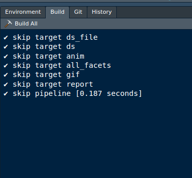
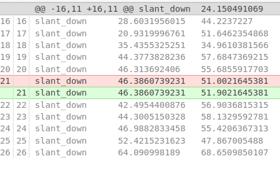

class: title-slide

```{r setup-lectures, include = FALSE}
knitr::opts_chunk$set(fig.retina = 3, comment = '', dev = "ragg_png") #  dpi is 72 x 3 = 216
# theme from Gaben Buie
library(xaringanthemer) # "gadenbuie/xaringanthemer"
# "gadenbuie/xaringanExtra"
style_mono_accent(
  base_color = "#00A4E1", # LU blue flag
  text_font_size = "0.9rem",
  code_font_size = "0.7rem",
  header_h1_font_size = "2.1rem",
  header_h2_font_size = "1.9rem",
  header_h3_font_size = "1.5rem",
  header_font_google = google_font("Roboto Condensed"),
  text_font_google   = google_font("Roboto Condensed", "300", "300i"),
  code_font_google   = google_font("Fira Mono")
)
xaringanExtra::use_xaringan_extra(c("tile_view", "tachyons", "logo"))
# bring in tachyons https://roperzh.github.io/tachyons-cheatsheet/
xaringanExtra::use_tachyons()
# tile view when press 't'
xaringanExtra::use_tile_view()
# use webcam, on/off with 'w' and press Shift + W to move the video to the next corner.
xaringanExtra::use_webcam()
xaringanExtra::use_share_again()
xaringanExtra::use_search(show_icon = FALSE)
xaringanExtra::use_scribble()
set.seed(1423)
```

```{r, echo = FALSE}
# all code with icon for copy
htmltools::tagList(
  xaringanExtra::use_clipboard(
    button_text = "<i class=\"fa fa-clipboard\"></i>",
    success_text = "<i class=\"fa fa-check\" style=\"color: #90BE6D\"></i>",
    error_text = "<i class=\"fa fa-times-circle\" style=\"color: #F94144\"></i>"
  ),
  rmarkdown::html_dependency_font_awesome()
)
```


```{r, echo = FALSE}
xaringanExtra::use_logo(
  image_url = "img/hpc150x150.png",
  height = "60px",
  position = xaringanExtra::css_position(bottom = "1em", left = "1em"),
  link_url = "https://ulhpc-tutorials.readthedocs.io/en/latest/",
  exclude_class = c("title-slide", "inverse", "hide_logo"))
```

```{r, echo = FALSE}
xaringanExtra::use_progress_bar(location = "top", color = "#00A4E1")
```

```{r setup, include = FALSE}
knitr::opts_chunk$set(echo = TRUE)
library(tidyverse)
library(xaringan)
library(xaringanthemer)# gadenbuie/xaringanthemer
library(xaringanExtra) # gadenbuie/xaringanExtra
```


# `r params$title`

## `r params$subtitle`

.center[

]

### `r params$author`, Dpt. Life Sciences and Medecine


```{r, echo = FALSE}
htmltools::img(src = "https://raw.githubusercontent.com/ULHPC/tutorials/devel/maths/R/img/ULHPC-RollUp.png",
               style = "height:550px;position: absolute;bottom: 1em;left: 1em;")
```

```{r, echo = FALSE}
htmltools::img(src = "img/logo_hpc-shool2023.png",
               style = "height:150px;position: absolute;bottom: 1em;right: 1em;")
```

---

# targets and companion package tarchetypes

```{r, echo = FALSE}
htmltools::img(src = "https://docs.ropensci.org/targets/reference/figures/logo.png",
               style = "height:150px;position: absolute;top: 1em;right: 1em;")
```
```{r, echo = FALSE}
htmltools::img(src = "https://docs.ropensci.org/tarchetypes/reference/figures/logo.png",
               style = "height:150px;position: absolute;top: 10em;right: 1em;")
```

.flex.items-center[
  .w-10[
  ]
  .w-70.bg-washed-green.b--green.ba.bw2.br3.shadow-5.ph3.mt3.mr1[
  .large[.bbox[A workflow manager for R]]

.large[
- Saving you time and stress
- Understand how it is implemented in `targets`
    + Define your `targets`
    + Connect `targets` to create the **dependencies** `r fontawesome::fa("project-diagram")`
    + Check **dependencies** with `visnetwork`
    + Embrace either  `r fontawesome::fa("code-branch")`
        + **Dynamic** branching 
        + **Static** branching 
    + Run **only** what needs to be executed
    + Embrace [literate programming](https://books.ropensci.org/targets/literate-programming.html) with `qmd` or `Rmd` docs
    + Bundle **dependencies** in a documents with [`tar_render()`](https://docs.ropensci.org/tarchetypes/reference/tar_render.html)/[`tar_quarto()`](https://docs.ropensci.org/tarchetypes/reference/tar_quarto.html)
    + Increase reproducibility with the package manager [`renv`](https://rstudio.github.io/renv/articles/renv.html)
- Example with RNA-seq data from .bold[Wendkouni Nadège MINOUNGOU]
]]]

---

# Folder structure

```{r, echo = FALSE}
htmltools::img(src = "https://raw.githubusercontent.com/rstudio/renv/master/man/figures/logo.svg",
               style = "height:160px;position: absolute;top: 1em;right: 1em;")
```
```{r, echo = FALSE}
htmltools::img(src = "https://camo.githubusercontent.com/f10a96951d85f43abc67d46bafd97d302deb9daf8490082fe339b9292c75072a/68747470733a2f2f626f6f6b646f776e2e6f72672f79696875692f726d61726b646f776e2f696d616765732f6865782d726d61726b646f776e2e706e67",
               style = "height:150px;position: absolute;top: 10em;right: 1.6em;")
```

```{r, echo = FALSE}
htmltools::img(src = "https://upload.wikimedia.org/wikipedia/commons/thumb/d/d0/RStudio_logo_flat.svg/1200px-RStudio_logo_flat.svg.png",
               style = "height:100px;position: absolute;top: 18em;right: 1em;")
```
```{r, echo = FALSE}
htmltools::img(src = "https://git-scm.com/images/logos/logomark-black@2x.png",
               style = "height:150px;position: absolute;top: 23em;right: 1em;")
```

.left-column[
```{r, eval = FALSE}
├── .git/
├── run.R
├── _targets.R #<<
├── _targets/
├── Repro.Rproj
├── R
│   ├── functions.R #<<
│   └── utils.R #<<
├── run.R*
├── renv/
├── renv.lock
└── report.Rmd
```

]

.right-column[
.Large[Targets]
.large[
- With [`renv`](https://rstudio.github.io/renv/). Snapshot your package environment (and restore! 😌)
- `_targets.R` is the only mandatory file
- Use a `R` sub-folder for functions, gets closer to a `r fontawesome::fa("r-project")` package
- `Rmarkdown`/`qmd` file allows to gather results in a report
- In a RStudio project
- Version tracked with `r fontawesome::fa("git-square")`
- An executable `run.sh` allows to use Build Tools in RStudio

]
]

---

# DatasauRus example, smart animation caching

This example is available at the [`target_demos` repo](https://gitlab.lcsb.uni.lu/aurelien.ginolhac/targets_demos/-/tree/hpc)(`hpc` branch)

.pull-left[
#### targets script [`_targets_ds_fun1.R`](https://gitlab.lcsb.uni.lu/aurelien.ginolhac/targets_demos/-/blob/hpc/_targets_ds_fun1.R)

``` r
library(targets)
library(tarchetypes)
source("R/plotting.R")
# load the tidyverse quietly for each target
# which each runs in a fresh R session
tar_option_set(packages = "tidyverse")

list(
  # track if distant file has changed
  tar_url(ds_file, "https://raw.githubusercontent.com/jumpingrivers/datasauRus/main/inst/extdata/DatasaurusDozen-Long.tsv"),
  tar_target(ds, read_tsv(ds_file, show_col_types = FALSE)),
  tar_target(all_facets, facet_ds(ds)),
  # animation is worth caching  ~ 1 min
  tar_target(anim, anim_ds(ds), 
             packages = c("ggplot2", "gganimate", "gifski")),
  tar_file(gif, {
    anim_save("ds.gif", animation = anim, title_frame = TRUE)
    # anim_save returns NULL, we need to get the file output path
    "ds.gif"},
             packages = c("gganimate")),
  tar_render(report, "ds1.Rmd")
)
```
]

--

.pull-right[
#### Corresponding Directed Acyclic Graph


``` r
> tar_manifest()
# A tibble: 6 × 2
  name       command     
  <chr>      <chr>  
1 ds_file    "\"https://raw.gi[...]n/inst/extdata/DatasaurusDozen-Long.tsv\""
2 ds         "read_tsv(ds_file, show_col_types = FALSE)"    
3 anim       "anim_ds(ds)"
4 all_facets "facet_ds(ds)"
5 gif        "{\n     anim_save(\"ds.gif\", animation = anim, title_frame = TRUE)\n     \"ds.gif\"\n }"  
6 report     "tarchetypes::tar_render_run(path = \"ds1.Rmd\", args = list(input = \"ds1.Rmd\", \n     knit_root_dir = g…
```

]

.footnote[Animation code is presented as function, full code in [`_targets_ds1.R`](https://gitlab.lcsb.uni.lu/aurelien.ginolhac/targets_demos/-/blob/main/_targets_ds_1.R)]


---

# Scalability and parallelization


```{r, echo = FALSE}
htmltools::img(src = "https://shikokuchuo.net/mirai/reference/figures/logo.png",
               style = "height:120px;position: absolute;top: 1em;right: 8em;")
```
```{r, echo = FALSE}
htmltools::img(src = "https://future.futureverse.org/reference/figures/logo.png",
               style = "height:120px;position: absolute;top: 1em;right: 1em;")
```
```{r, echo = FALSE}
htmltools::img(src = "https://wlandau.github.io/crew/reference/figures/logo-readme.png",
               style = "height:120px;position: absolute;bottom: 5em;left: 12em;")
```


.pull-left[

.large[
- Scale-up with .bold[dynamic] or .bold[static] branching
- Parallelization on .bold[HPC] using:
  + `tar_make_clustermq(workers = 3L)` [`clustermq`](https://mschubert.github.io/clustermq/articles/userguide.html#configuration) by **Michael Schubert** based on [ZeroMQ](https://zeromq.org/)
  + `tar_make_future(workers = 3L)` [`future`](https://future.futureverse.org/) by **Henrik Bengtsson**
  + `tar_make()` ([`mirai`](https://shikokuchuo.net/mirai/) by **Charlie Gao** based on [NNG](https://nng.nanomsg.org/)

The last one is the recommended way, but just out! Implemented in the recent `{crew}` package.
]
]

.pull-right[
</br></br>


.footnote[Source: .bold[William Landau]: talk at [Bayes Lund](https://wlandau.github.io/bayes-lund-2021/#8)]
]


---
class: hide_logo

# Autoscaling of jobs on defined number of workers

.pull-left[
#### All job on ~ 1 worker
``` r
library(targets)
controller <- crew::crew_controller_local(
  name = "my_controller",
  workers = 10,
  seconds_idle = 3
)
tar_option_set(controller = controller)
list(
  tar_target(x, seq_len(1000)),
  tar_target(y, x, pattern = map(x))
)
```

``` r
# after tar_make()
tar_crew()
#> # A tibble: 10 × 5
#>    controller    worker launches seconds targets
#>    <chr>          <int>    <int>   <dbl>   <int>
#>  1 my_controller      1        1   1.77      998
#>  2 my_controller      2        4   0.076       3
#>  3 my_controller      3        1   0           0
#>  4 my_controller      4        0   0           0
#>  5 my_controller      5        0   0           0
#>  6 my_controller      6        0   0           0
#>  7 my_controller      7        0   0           0
#>  8 my_controller      8        0   0           0
#>  9 my_controller      9        0   0           0
#> 10 my_controller     10        0   0           0
```
]

--

.pull-right[
#### Better balance with 1 sec jobs
``` r
library(targets)
controller <- crew::crew_controller_local(
  name = "my_controller",
  workers = 10,
  seconds_idle = 3
)
tar_option_set(controller = controller)
list(
  tar_target(x, seq_len(1000)),
  tar_target(y, Sys.sleep(1), pattern = map(x)) # Run for 1 second.
)
```

``` r
# after tar_make()
tar_crew()
#> # A tibble: 10 × 5
#>    controller    worker launches seconds targets
#>    <chr>          <int>    <int>   <dbl>   <int>
#>  1 my_controller      1        1   103.      104
#>  2 my_controller      2        1   100.      100
#>  3 my_controller      3        1   100.      100
#>  4 my_controller      4        1   100.      100
#>  5 my_controller      5        1   100.      100
#>  6 my_controller      6        1   100.      100
#>  7 my_controller      7        1    99.4      99
#>  8 my_controller      8        1   100.      100
#>  9 my_controller      9        1    99.4      99
#> 10 my_controller     10        1    99.4      99
```
]

---
class: hide_logo

# Literate programming

We recommend using it [within a target](https://books.ropensci.org/targets/literate-programming.html#literate-programming-within-a-target) and not the [Target Markdown](https://books.ropensci.org/targets/literate-programming.html#target-markdown) that overload the document.

.pull-left[


]

--

.pull-right[


]


---

# Multi-projects in one folder

Like the `targets_demos` repo which has 4 projects

.pull-left[
#### Config file: `_targets.yaml`

`targets` needs a R script and a store location

``` yaml
ds_linear:
  store: _ds_1
  script: _targets_ds_1.R
ds_fun_linear:
  store: _ds_fun1
  script: _targets_ds_fun1.R
ds_dynamic:
  store: _ds_2
  script: _targets_ds_2.R
ds_dynamic_crew:
  store: _ds_2_crew
  script: _targets_ds_2_crew.R
ds_static:
  store: _ds_3
  script: _targets_ds_3.R
  reporter_make: verbose_positives # do not display skipped targets
```

]

--

.pull-right[
#### Usage

In your Rmd or console, one env variable to configure:

``` r
Sys.setenv(TAR_PROJECT = "ds_fun_linear")
```
]

---
class: hide_logo

# Custom Building Tool

- Use the `run.R` as Custom file for Building  

.pull-left[
#### Tools > Projects Options > Custom


``` r
#!/usr/bin/env Rscript
# Optional var env is you have one _targets.R
Sys.setenv(TAR_PROJECT = "ds_fun_linear")
targets::tar_make()
```

]

--

.pull-right[
#### Running targets

- Useful shortcut **CTRL+SHIFT + B**


- Animation takes the most time
]

---

# Re-running, same shortcut only what is needed

.pull-left[
#### Without changes


]

--

.pull-right[
#### Change in `facet_ds()`
`facet_wrap(~ dataset, ncol = 4)` <- 3


.footnote[Change that are comments are not invalidating a target]
]


---

# Dynamic branching

.pull-left[
#### Often we start from multiple files

```
data
├── dset_10.tsv
├── dset_11.tsv
├── dset_12.tsv
├── dset_13.tsv
├── dset_1.tsv
├── dset_2.tsv
├── dset_3.tsv
├── dset_4.tsv
├── dset_5.tsv
├── dset_6.tsv
├── dset_7.tsv
├── dset_8.tsv
└── dset_9.tsv
```

And we want to apply the same treatment to each
]

--

.pull-right[
#### Functional programming again, iteration for what's needed

Done by the `pattern = map()` keyword. Use `cross()` to combinations.

``` r
  tar_target(ds, read_tsv(dset, show_col_types = FALSE),
             pattern = map(dset)),
```


Directly with `tar_files_input()`


]


---

# Changing one input file

.pull-left[

]

--

.pull-right[
#### Re-run only one file and downstream dependencies

```
✔ skip target dset_files
[...]
• start branch dset_3c9c9095
• built branch dset_3c9c9095 [0 seconds]
✔ skip branch dset_fe11a7b7
• built pattern dset
✔ skip branch ds_10a9d1c1
[...]
✔ skip branch ds_765f2283
• start branch ds_7f4fe112
• built branch ds_7f4fe112 [0.954 seconds]
✔ skip branch ds_dcc9ee18
• built pattern ds
✔ skip branch summary_stat_ad2f392a
[...]
• built branch summary_stat_3c976614 [0.01 seconds]
✔ skip branch summary_stat_90f7b2c1
• built pattern summary_stat
✔ skip branch plots_ad2f392a
[...]
✔ skip branch plots_1a450db7
• start branch plots_3c976614
• built branch plots_3c976614 [0.008 seconds]
✔ skip branch plots_90f7b2c1
• built pattern plots
• start target report
• built target report [4.104 seconds]
• end pipeline [5.659 seconds]
```

]


---

# Automatic aggregation

.pull-left[
#### For vectors/tibbles happens directly

``` r
> tar_read(ds)
## # A tibble: 1,846 × 3
##    dataset     x     y
##    <chr>   <dbl> <dbl>
##  1 away     32.3  61.4
##  2 away     53.4  26.2
##  3 away     63.9  30.8
```

#### Use branches for subsetting
``` r
> tar_read(ds, branches = 2L)
## # A tibble: 142 × 3
##    dataset     x     y
##    <chr>   <dbl> <dbl>
##  1 star     58.2  91.9
##  2 star     58.2  92.2
##  3 star     58.7  90.3
```
]

--

.pull-right[
#### For plots, use `iteration = "list"` 

``` r
tar_target(plots, ggplot(ds, aes(x, y)) +
             geom_point() +
             labs(title = unique(ds$dataset)),
           pattern = map(ds),
           iteration = "list"),
```


``` r
> tar_read(plots, branches = 2L)
## $plots_a55f1afc
```

Then this list can be used by `patchwork`

``` r
library(patchwork)
wrap_plots(tar_read(plots)) +
   plot_annotation(title = "13 datasets bundled with patchwork") & theme_void()
```
]


---

# Static branching, with dynamic inside

### Dynamic branch names are not meaningful, just hashes

.pull-left[
#### Multi-folders input data

We still have multiple files per folder

```
circles
├── dset_2.tsv
└── dset_3.tsv
lines
├── dset_11.tsv
├── dset_12.tsv
├── dset_13.tsv
├── dset_6.tsv
├── dset_7.tsv
├── dset_8.tsv
└── dset_9.tsv
others
├── dset_10.tsv
├── dset_1.tsv
├── dset_4.tsv
└── dset_5.tsv
```
]

--

.pull-right[
#### Dynamic within static, best of both worlds

More difficult to write with `tar_map()` (see [example](https://gitlab.lcsb.uni.lu/aurelien.ginolhac/targets_demos/-/blob/hpc/_targets_ds_3.R))

But meaningful names and combine when needed:


Use `tar_manifest()` to display exactly the command to be run
]


---
class: hide_logo

# Parallel static branches and combine

.pull-left[
#### From [`_targets_ds_3.R`](https://gitlab.lcsb.uni.lu/aurelien.ginolhac/targets_demos/-/blob/hpc/_targets_ds_3.R), static branches:

``` r
# Static branching with dynamic branching inside
values <- tibble(
  folders = c("lines", "circles", "others")
)

# tar_map() generates R expressions, and substitute the desired 'values'
mapped <- tar_map(
  values = values,
  names = "folders", # to avoid targets reporting "files_lines_lines"
  tar_target(filenames, fs::dir_ls(folders, glob = "*tsv")),
  # filenames is not of format file, no checksum is done
  # we need a dynamic pattern at this step to read them dynamically too
  tar_target(files, format = "file", filenames, 
             pattern = map(filenames)),
  # Dynamic within static
  tar_target(ds, read_tsv(files, show_col_types = FALSE),
             pattern = map(files)),
  tar_target(summary_stat, summarise(ds, m_x = mean(x), m_y = mean(y)),
             pattern = map(ds)),
  tar_target(plots, ggplot(ds, aes(x, y)) +
               geom_point(),
             pattern = map(ds),
             iteration = "list"),
  # Patchwork each group into one plot
  tar_target(patch_plots, 
             wrap_plots(plots) + 
               # Title the last bit of path_plots_{circles,lines,others}
               plot_annotation(title = stringr::str_split_i(tar_name(), '_', -1)),
             packages = "patchwork")
)
```

]

--

.pull-right[
#### Combining steps:
``` r
# We want to combined in one tibble the 3 tibble of summary stats
# Each of one them is actually composed of 2, 4 and 7 tibbles
stat_combined <- tar_combine(
  stat_summaries,
  mapped[["summary_stat"]],
  # Force evaluation using triple bang (!!!)
  command = dplyr::bind_rows(!!!.x, .id = "ds_type")
)
# And the plots now, a patchwork of patchwork
plot_combined <- tar_combine(
  plots_agg,
  mapped[["patch_plots"]],
  # Force evaluation of all patchwork plots again with triple bang!
  command = {wrap_plots(list(!!!.x), ncol = 2) + 
               plot_annotation(title = "Master Saurus")},
  packages = "patchwork"
)
# Wrap all targets in one list
list(mapped, 
     stat_combined, 
     plot_combined, 
     tar_render(report, "ds3.Rmd"))
```


]

---

# Manifest and final plot

.pull-left[
#### `tar_manifest()` (paged version in [`ds3.Rmd`](https://gitlab.lcsb.uni.lu/aurelien.ginolhac/targets_demos/-/blob/main/ds3.Rmd))

```
# A tibble: 21 × 3
name                 command                                                                                  pattern
<chr>                <chr>                                                                                    <chr>  
filenames_circles    "fs::dir_ls(\"circles\", glob = \"*tsv\")"                                               NA     
filenames_others     "fs::dir_ls(\"others\", glob = \"*tsv\")"                                                NA     
filenames_lines      "fs::dir_ls(\"lines\", glob = \"*tsv\")"                                                 NA     
files_circles        "filenames_circles"                                                                      map(fi…
files_others         "filenames_others"                                                                       map(fi…
files_lines          "filenames_lines"                                                                        map(fi…
ds_circles           "read_tsv(files_circles, show_col_types = FALSE)"                                        map(fi…
ds_others            "read_tsv(files_others, show_col_types = FALSE)"                                         map(fi…
ds_lines             "read_tsv(files_lines, show_col_types = FALSE)"                                          map(fi…
summary_stat_circles "summarise(ds_circles, m_x = mean(x), m_y = mean(y))"                                    map(ds…
plots_circles        "ggplot(ds_circles, aes(x, y)) + geom_point()"                                           map(ds…
summary_stat_others  "summarise(ds_others, m_x = mean(x), m_y = mean(y))"                                     map(ds…
plots_others         "ggplot(ds_others, aes(x, y)) + geom_point()"                                            map(ds…
plots_lines          "ggplot(ds_lines, aes(x, y)) + geom_point()"                                             map(ds…
summary_stat_lines   "summarise(ds_lines, m_x = mean(x), m_y = mean(y))"                                      map(ds…
patch_plots_circles  "wrap_plots(plots_circles) + plot_annotation(title = stringr::str_split_i(tar_name(), \… NA     
patch_plots_others   "wrap_plots(plots_others) + plot_annotation(title = stringr::str_split_i(tar_name(), \n… NA     
patch_plots_lines    "wrap_plots(plots_lines) + plot_annotation(title = stringr::str_split_i(tar_name(), \n … NA     
stat_summaries       "dplyr::bind_rows(summary_stat_lines = summary_stat_lines, \n     summary_stat_circles … NA     
plots_agg            "wrap_plots(list(patch_plots_lines = patch_plots_lines, \n     patch_plots_circles = pa… NA     
report               "tarchetypes::tar_render_run(path = \"ds3.Rmd\", args = list(input = \"ds3.Rmd\", \n   … NA 
```
]

.pull-right[

]

---
class: inverse, middle, center

# RNA-seq real example


---

# Example with RNA-seq data across 3 cell lines

### PCA shows that differences between cells .bold.red[`>>`] biological effect (roman numbers)

```{r, echo = FALSE}
htmltools::img(src = "img/targets_pca.png",
               style = "float:right;height:400px;")
```

--

### Solution: Split counts and metadata for each cell

.Large[Do we copy code 3 times?]

---

# Define targets = explicit dependencies

```{r, echo = FALSE}
htmltools::img(src = "https://docs.ropensci.org/targets/reference/figures/logo.png",
               style = "height:120px;position: absolute;top: 1em;right: 1em;")
```

.pull-left[
### `_targets.R`, define 4 targets

Last `target` depends on the **3** upstreams

```{r, eval=FALSE}
library(targets)
source("R/functions.R")
source("R/plotting.R")

list(
  tar_target(cells, c("HepG2", "HuH7", "Hep3B")),#<<
  tar_qs(dds, read_rds(here::here("data", "all.rds")),#<<
         packages = "DESeq2"),
  tar_fst_tbl(annotation, gtf_to_tbl(here::here("data", #<<
                                                "gencode.v36.annotation.gtf")),
              packages = c("tibble", "rtracklayer")),
  tar_qs(sub_dds, subset_dds(dds, #<<
                             filter(annotation, type == "gene"),
                             .cell = cells),
         pattern = map(cells), # dynamic branching
         packages = c("DESeq2", "tidyverse"))
[...]
)
```

]

--

.pull-right[
.bold[Dynamic branching] makes dependencies easier to read.


]

.footnote[Figure from `tar_visnetwork()`]

---

# Running targets

```{r, echo = FALSE}
htmltools::img(src = "https://docs.ropensci.org/targets/reference/figures/logo.png",
               style = "height:120px;position: absolute;top: 1em;right: 1em;")
```

.pull-left[
```
● run target annotation
● run target cells
● run target dds
● run branch sub_dds_3078b1e0
         condition time_h
HepG2_I1   control      0
HepG2_I2      HIL6      2
using pre-existing size factors
estimating dispersions
gene-wise dispersion estimates: 2 workers
mean-dispersion relationship
final dispersion estimates, fitting model and testing: 2 workers
● run branch sub_dds_d05c5da7
        condition time_h
HuH7_I1   control      0
HuH7_I2      HIL6      2
using pre-existing size factors
estimating dispersions
gene-wise dispersion estimates: 2 workers
mean-dispersion relationship
final dispersion estimates, fitting model and testing: 2 workers
● run branch sub_dds_c60d7096
         condition time_h
Hep3B_I1   control      0
Hep3B_I2      HIL6      2
using pre-existing size factors
estimating dispersions
gene-wise dispersion estimates: 2 workers
mean-dispersion relationship
final dispersion estimates, fitting model and testing: 2 workers
● end pipeline
```
]

--

.pull-right[
.Large[Options to display time and object sizes]

]

---

# Re-running

```{r, echo = FALSE}
htmltools::img(src = "https://docs.ropensci.org/targets/reference/figures/logo.png",
               style = "height:120px;position: absolute;top: 1em;right: 1em;")
```


.pull-left[
```
✓ skip target annotation
✓ skip target cells
✓ skip target dds
✓ skip branch sub_dds_3078b1e0
✓ skip branch sub_dds_d05c5da7
✓ skip branch sub_dds_c60d7096
✓ skip pipeline
```

.Large[All good, nothing to be done ✔️.

Actually `targets` tracks all objects and so functions

A more complete dependency graph shows .bold[functions]
]
]

--

.pull-right[


.Large[Let's add the PCA per cell type now]
]


---
class: hide_logo

# PCA, add 4 targets

```{r, echo = FALSE}
htmltools::img(src = "https://docs.ropensci.org/targets/reference/figures/logo.png",
               style = "height:120px;position: absolute;top: 1em;right: 1em;")
```

.pull-left[
### Smaller targets avoid unnecessary re-running steps
```{r, eval = FALSE}
[...]
tar_target(rcounts, vst(sub_dds, blind = TRUE),
           pattern = map(sub_dds),
           packages = c("DESeq2")),
tar_target(pca_df, pca_meta(rcounts),
           pattern = map(rcounts),
           packages = c("DESeq2", "tidyr", "dplyr")),
tar_target(pca_cell, tibble(cell = cells,
                            pca = list(plot_pca_meta(pca_df))),
           pattern = map(cells, pca_df),
           packages = c("ggplot2", "tibble"))
[...]
```

.large[
.bold[Translate into]:

- For every cell data, compute regularized counts (`vst`: variance stabilization)
- For every regularized counts, compute PCA (`df`: data.frame, _i. e_ a table)
- For every cell names / PCA tables, plot PCA in a table for easier labeling

]

]

--

.pull-right[


]

---

# PCA results


.flex[
.w-33.b--green.ba.bw2.br3.shadow-5.ph4.mt2.mr2[
### Running

<video width="310" height="340">
<source src="https://biostat2.uni.lu/practicals/data/targets_pca.mp4" type="video/mp4">
</video>

]
.w-33.b--green.ba.bw2.br3.shadow-5.ph4.mt2.mr2[
### Literate programming

.Large[load results in a Rmd doc, .green.bold[separate] computation from report]

- Plots in a list-column


]
.w-33.b--green.ba.bw2.br3.shadow-5.ph4.mt2[
### How to display a plot

]]


---

# The full picture

### Adding step by step 

### desired analyses

#### Whole analysis takes 24 minutes and 4.54 seconds

.large[
> .orange.bold[Of course, someone has to</br>remember the dependencies, </br>it doesn't have to be you]

.tl[
— _could be William Landau via .bold[Jenny Bryan]_]]


```{r, echo = FALSE}
htmltools::img(src = "https://docs.ropensci.org/targets/reference/figures/logo.png",
               style = "height:120px;position: absolute;top: 1em;right: 1em;")
```

```{r, echo = FALSE}
htmltools::img(src = "img/targets_dag_full.png",
               style = "position: absolute;top: 4em;right: 10em;height:600px")
```


---

# Is it worth the effort?

--

.left-column[

.huge.bold.green[Yes]

.Large[
#### For you

- Autonomy
- Skills
- _Free_ time
- Confidence over results
- Reproducibility
- Fun 🥳
]
]

--

.right-column[
### Better project design

.Large[Thinking at what is a [good `targets`](https://books.ropensci.org/targets/targets.html#what-a-target-should-do) helps tremendously the coding]

>1. Are large enough to subtract a decent amount of runtime when skipped.
2. Are small enough that some targets can be skipped even if others need to run.
3. Invoke no side effects (tar_target(format = "file") can save files.)
4.Return a single value that is
    + Easy to understand and introspect.
    + Meaningful to the project [...]

.Large[
.tr[
— _.bold[William Landau]_]]
]

### Reproducibility, thanks to .bold[`targets`] and `renv` via `git`
```r
> renv::history()
   commit         author_date      committer_date                                    subject
1e8dd2278 2021-02-23 15:29:57 2021-02-23 15:29:57             reformat creating config files
24c1222db 2021-02-15 17:07:01 2021-02-15 17:07:01    highlight gene type in the DEG patterns
326c8a726 2021-02-04 16:16:38 2021-02-04 16:16:38 cluster LRT genes by they dynamic patterns
4c6791796 2021-01-26 13:08:15 2021-01-26 13:08:15      gene types in upset plots for lengths
5865ee70b 2021-01-21 16:36:48 2021-01-21 16:37:08                            add upset plots
[...]
```


]


---

# Bonus: watch the pipeline running live 🍿

```{r, echo = FALSE}
htmltools::img(src = "https://docs.ropensci.org/targets/reference/figures/logo.png",
               style = "height:120px;position: absolute;top: 1em;right: 1em;")
```

```{r, echo = FALSE}
htmltools::img(src = "https://raw.githubusercontent.com/rstudio/shiny/master/man/figures/logo.png",
               style = "height:120px;position: absolute;top: 1em;right: 7em;")
```

.left-column[
- `targets` events watched live 🎞
- Here, after changing a threshold in the LRT step
- `branches` can be monitored too
- 2 videos joined as I fixed an .red.bold[error] at 1'42"
- Option to display functions (unset here)
]
.right-column[
### `tar_watch()` shiny app from `targets`

<video>
<source src="https://biostat2.uni.lu/practicals/data/tar_watch.mp4" type="video/mp4">
</video>

]

---

# Before we stop

.flex[
.w-50.bg-washed-green.b--green.ba.bw2.br3.shadow-5.ph3.mt2.mr1[
.large[.gbox[Highlights]

 * `targets`, dependencies manager, re-run what's needed
]]
.w-50.bg-washed-green.b--green.ba.bw2.br3.shadow-5.ph3.mt2.ml1[
.large[.bbox[Acknowledgments  🙏 👏]
* **Eric Koncina** early adopter of `targets`
* **Wendkouni N. Minoungou** for the RNA-seq data
* [**William Landau**](https://github.com/wlandau) main developer of `targets`
]
]]
.flex[
.w-50.bg-washed-green.b--green.ba.bw2.br3.shadow-5.ph3.mt2.mr1[
.large[.ybox[Further reading `r fontawesome::fa("book")`]]
- [Documentation](https://books.ropensci.org/targets/) as bookdown by **Landau**
- [Distributed computing](https://books.ropensci.org/targets/crew.html) using [`{crew}`](https://wlandau.github.io/crew/)
- [Targetopia](https://wlandau.github.io/targetopia/packages.html) **Landau** universe of targets-derived (stan/jags)
- [Video](https://www.youtube.com/watch?v=FODSavXGjYg) from R Lille meetup by **William Landau**. June 2021 45''
- [Video](https://www.youtube.com/watch?v=odcBA4ETLn8) from Bayes Lund by **William Landau**. October 2021
]
.w-50.pv2.ph3.mt2.ml1[
.huge[.bbox[Thank you for your attention!  
Hope it was useful!]]

]]


