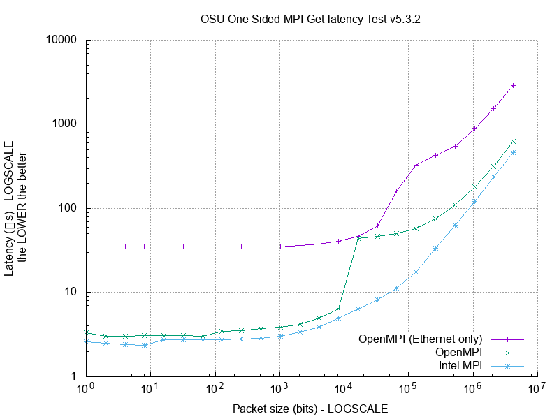

[](https://hpc.uni.lu) [](http://www.gnu.org/licenses/gpl-3.0.html) [](https://github.com/ULHPC/tutorials/issues/) [](https://github.com/ULHPC/tutorials/raw/devel/advanced/OSU_MicroBenchmarks/slides.pdf) [](https://github.com/ULHPC/tutorials/tree/devel/advanced/OSU_MicroBenchmarks) [](http://ulhpc-tutorials.readthedocs.io/en/latest/advanced/OSU_MicroBenchmarks/) [](https://github.com/ULHPC/tutorials)


# UL HPC MPI Tutorial: Building and Runnning OSU Micro-Benchmarks

     Copyright (c) 2013-2018 UL HPC Team  <hpc-sysadmins@uni.lu>

[](https://github.com/ULHPC/tutorials/raw/devel/advanced/OSU_MicroBenchmarks/slides.pdf)

The objective of this tutorial is to compile and run on of the [OSU micro-benchmarks](http://mvapich.cse.ohio-state.edu/benchmarks/) which permit to measure the performance of an MPI implementation.
**On purpose**, we won't check here if an Easybuild recipe is available for this software to conduct a full build _by hand_ and check the difference in build options between the different MPI suits.

You can work in groups for this training, yet individual work is encouraged to ensure you understand and practice the usage of MPI programs on an HPC platform.

In all cases, ensure you are able to [connect to the UL HPC  clusters](https://hpc.uni.lu/users/docs/access.html).


```bash
# /!\ FOR ALL YOUR COMPILING BUSINESS, ENSURE YOU WORK ON A COMPUTING NODE
# Have an interactive job
(access)$> si -N 2 --ntasks-per-node=1                    # iris
(access)$> srun -p interactive --qos qos-iteractive -N 2 --ntasks-per-node=1 --pty bash  # iris (long version)
(access)$> oarsub -I -l enclosure=1/nodes=2,walltime=4   # chaos / gaia
```

**Advanced users only**: rely on `screen` (see  [tutorial](http://support.suso.com/supki/Screen_tutorial) or the [UL HPC tutorial](https://hpc.uni.lu/users/docs/ScreenSessions.html) on the  frontend prior to running any `oarsub` or `srun/sbatch` command to be more resilient to disconnection.

The latest version of this tutorial is available on [Github](https://github.com/ULHPC/tutorials/tree/devel/advanced/OSU_MicroBenchmarks).
Finally, advanced MPI users might be interested to take a look at the [Intel Math Kernel Library Link Line Advisor](https://software.intel.com/en-us/articles/intel-mkl-link-line-advisor).

## Objectives

The [OSU micro-benchmarks](http://mvapich.cse.ohio-state.edu/benchmarks/) feature a series of MPI benchmarks that measure the performances of various MPI operations:

* __Point-to-Point MPI Benchmarks__: Latency, multi-threaded latency, multi-pair latency, multiple bandwidth / message rate test bandwidth, bidirectional bandwidth
* __Collective MPI Benchmarks__: Collective latency tests for various MPI collective operations such as MPI_Allgather, MPI_Alltoall, MPI_Allreduce, MPI_Barrier, MPI_Bcast, MPI_Gather, MPI_Reduce, MPI_Reduce_Scatter, MPI_Scatter and vector collectives.
* __One-sided MPI Benchmarks__: one-sided put latency (active/passive), one-sided put bandwidth (active/passive), one-sided put bidirectional bandwidth, one-sided get latency (active/passive), one-sided get bandwidth (active/passive), one-sided accumulate latency (active/passive), compare and swap latency (passive), and fetch and operate (passive) for MVAPICH2 (MPI-2 and MPI-3).
* Since the 4.3 version, the [OSU micro-benchmarks](http://mvapich.cse.ohio-state.edu/benchmarks/) also features OpenSHMEM benchmarks, a 1-sided communications library.

In this tutorial, we will build **version 5.4 of the [OSU micro-benchmarks](http://mvapich.cse.ohio-state.edu/benchmarks/)** (the latest at the time of writing), and focus on two of the available tests:

* `osu_get_latency` - Latency Test
* `osu_get_bw` - Bandwidth Test

> The latency tests are carried out in a ping-pong fashion. The sender sends a message with a certain data size to the receiver and waits for a reply from the receiver. The receiver receives the message from the sender and sends back a reply with the same data size. Many iterations of this ping-pong test are carried out and average one-way latency numbers are obtained. Blocking version of MPI functions (MPI_Send and MPI_Recv) are used in the tests.

> The bandwidth tests were carried out by having the sender sending out a fixed number (equal to the window size) of back-to-back messages to the receiver and then waiting for a reply from the receiver. The receiver sends the reply only after receiving all these messages. This process is repeated for several iterations and the bandwidth is calculated based on the elapsed time (from the time sender sends the first message until the time it receives the reply back from the receiver) and the number of bytes sent by the sender. The objective of this bandwidth test is to determine the maximum sustained date rate that can be achieved at the network level. Thus, non-blocking version of MPI functions (MPI_Isend and MPI_Irecv) were used in the test.

The idea is to compare the different MPI implementations available on the [UL HPC platform](http://hpc.uni.lu).:

* [Intel MPI](http://software.intel.com/en-us/intel-mpi-library/)
* [OpenMPI](http://www.open-mpi.org/)
* [MVAPICH2](http://mvapich.cse.ohio-state.edu/overview/) (MPI-3 over OpenFabrics-IB, Omni-Path, OpenFabrics-iWARP, PSM, and TCP/IP)

For the sake of time and simplicity, we will focus on the first two suits. Eventually, the benchmarking campain will typically involves for each MPI suit:

* two nodes, belonging to the _same_ enclosure
* two nodes, belonging to _different_ enclosures

## Pre-requisites

On the **access** and a **computing** node of the cluster you're working on, clone the [ULHPC/tutorials](https://github.com/ULHPC/tutorials)  and [ULHPC/launcher-scripts](https://github.com/ULHPC/launcher-scripts) repositories

```bash
$> cd
$> mkdir -p git/ULHPC && cd  git/ULHPC
$> git clone https://github.com/ULHPC/launcher-scripts.git
$> git clone https://github.com/ULHPC/tutorials.git         # If not yet done
```

Prepare your working directory

```bash
$> mkdir -p ~/tutorials/OSU-MicroBenchmarks
$> cd ~/tutorials/OSU-MicroBenchmarks
$> ln -s ~/git/ULHPC/tutorials/advanced/OSU_MicroBenchmarks ref.ulhpc.d   # Keep a symlink to the reference tutorial
$> ln -s ref.ulhpc.d/Makefile .     # symlink to the root Makefile
```

Fetch and uncompress the latest version of the [OSU micro-benchmarks](http://mvapich.cse.ohio-state.edu/benchmarks/)

```bash
$> cd ~/tutorials/OSU-MicroBenchmarks
$> mkdir src
$> cd src
# Download the latest version
$> export OSU_VERSION=5.4     # Just to abstract from the version to download
$> wget --no-check-certificate http://mvapich.cse.ohio-state.edu/download/mvapich/osu-micro-benchmarks-${OSU_VERSION}.tar.gz
$> tar xvzf osu-micro-benchmarks-${OSU_VERSION}.tar.gz
$> cd osu-micro-benchmarks-${OSU_VERSION}
```

## Building the OSU Micro-benchmarks

We will build the [OSU micro-benchmarks](http://mvapich.cse.ohio-state.edu/benchmarks/) for each considered MPI suit, thus in a separate directory `build.<suit>` -- that's a good habbit you're encouraged (as with [CMake](https://cmake.org/) based projects)
In all cases, you **should** now operate the compilation within an interactive job to be able to use the `module` command.

```bash
# If not yet done
(access)$> si -N 2 --ntasks-per-node=1                   # on iris (1 core on 2 nodes)
(access)$> oarsub -I -l nodes=2/core=1,walltime=4   # chaos / gaia
```

### Compilation based on the Intel MPI suit

We are first going to use the [Intel Cluster Toolkit Compiler Edition](http://software.intel.com/en-us/intel-cluster-toolkit-compiler/),
which provides Intel C/C++ and Fortran compilers, Intel MPI.
We will compile the [OSU micro-benchmarks](http://mvapich.cse.ohio-state.edu/benchmarks/) in a specific directory (that a good habbit)

```bash
$> cd ~/tutorials/OSU-MicroBenchmarks/
$> mkdir build.intel    # Prepare the specific building directory
$> cd  build.intel
# Load the appropriate module
$> module spider MPI     # Search for available modules featuring MPI
$> module load toolchain/intel   # On iris -- use 'module load toolchain/ictce' otherwise
$> module list
Currently Loaded Modules:
  1) compiler/GCCcore/6.3.0                   4) compiler/ifort/2017.1.132-GCC-6.3.0-2.27                 7) toolchain/iimpi/2017a
  2) tools/binutils/2.27-GCCcore-6.3.0        5) toolchain/iccifort/2017.1.132-GCC-6.3.0-2.27             8) numlib/imkl/2017.1.132-iimpi-2017a
  3) compiler/icc/2017.1.132-GCC-6.3.0-2.27   6) mpi/impi/2017.1.132-iccifort-2017.1.132-GCC-6.3.0-2.27   9) toolchain/intel/2017a

# Configure the Intel MPI-based build for installation in the current directory
$> ../src/osu-micro-benchmarks-5.4/configure CC=mpiicc CXX=mpiicpc CFLAGS=-I$(pwd)/../src/osu-micro-benchmarks-5.4/util --prefix=$(pwd)
$> make && make install
```

**Questions**:

* **Q1: Why did we request the use of the `--prefix` at the configure step ?**
* **Q2: Why did we enforce the environment variables `CC` and `CXX`?**
* **Q3: Why did we enforce the environment variables `CFLAGS`?**

If everything goes fine, you shall have the [OSU micro-benchmarks](http://mvapich.cse.ohio-state.edu/benchmarks/) installed in the directory `libexec/osu-micro-benchmarks/mpi/`.

Once compiled, ensure you are able to run it:


```bash
$> cd libexec/osu-micro-benchmarks/mpi/one-sided/

#### On iris
$> srun -n $SLURM_NTASKS ./osu_get_latency
$> srun -n $SLURM_NTASKS ./osu_get_bw

#### On gaia, chaos
$> mpirun -hostfile $OAR_NODEFILE -perhost 1 ./osu_get_latency
$> mpirun -hostfile $OAR_NODEFILE -perhost 1 ./osu_get_bw
```

### Compilation based on the OpenMPI suit

Repeat the procedure for the OpenMPI suit:

```bash
$> cd ~/tutorials/OSU-MicroBenchmarks/
$> mkdir build.openmpi    # Prepare the specific building directory
$> cd  build.openmpi
# Clean the previously loaded module and load the appropriate OpenMPI one
$> module purge
$> module spider OpenMPI
$> module load mpi/OpenMPI
$> module list

Currently Loaded Modules:
  1) compiler/GCCcore/6.3.0              3) compiler/GCC/6.3.0-2.28              5) system/hwloc/1.11.7-GCC-6.3.0-2.28
  2) tools/binutils/2.28-GCCcore-6.3.0   4) tools/numactl/2.0.11-GCCcore-6.3.0   6) mpi/OpenMPI/2.1.1-GCC-6.3.0-2.28

# Configure the OpenMPI-based build for installation in the current directory
$> ../src/osu-micro-benchmarks-5.4/configure CC=mpicc CFLAGS=-I$(pwd)/../src/osu-micro-benchmarks-5.4/util --prefix=$(pwd)
$> make && make install
```

**Questions**:

* **Q4: Why do we need to precise the `CC` variable at the configure step?**
* **Q5: How to get rid of `CFLAGS` at the configure step ?**

Once compiled, ensure you are able to run it:

```bash
$> cd libexec/osu-micro-benchmarks/mpi/one-sided/

#### On iris
$> srun -n $SLURM_NTASKS ./osu_get_latency   # OR mpirun -npernode 1 --mca btl openib,self,sm  ./osu_get_latency
$> srun -n $SLURM_NTASKS ./osu_get_bw        # OR mpirun -npernode 1 --mca btl openib,self,sm  ./osu_get_bw
# Or, if you don't want to use PMI2
$> mpirun -np $SLURM_NTASKS -perhost 1 --mca btl openib,self,sm ./osu_get_{latency,bw}

#### On gaia, chaos
$> mpirun -x LD_LIBRARY_PATH -hostfile $OAR_NODEFILE -npernode 1 ./osu_get_latency
$> mpirun -x LD_LIBRARY_PATH -hostfile $OAR_NODEFILE -npernode 1 ./osu_get_bw
```

## Preparing batch runs

We are now going to prepare launcher scripts to permit passive runs (typically in the `{default | batch}` queue).
We will place them in a separate directory (`runs/`) as it will host the outcomes of the executions on the UL HPC platform .

```bash
$> cd ~/tutorials/OSU-MicroBenchmarks/
$> mkdir runs    # Prepare the specific run directory
```

### Slurm launcher (Intel MPI)

Copy and adapt the [default SLURM launcher](https://github.com/ULHPC/launcher-scripts/blob/devel/slurm/launcher.default.sh) you should have a copy in `~/git/ULHPC/launcher-scripts/slurm/launcher.default.sh`

```bash
$> cd ~/tutorials/OSU-MicroBenchmarks/runs
# Prepare a laucnher for intel suit
$> cp ~/git/ULHPC/launcher-scripts/slurm/launcher.default.sh launcher-OSU.intel.sh
```

Take your favorite editor (`vim`, `nano`, etc.) to modify it according to your needs.
Here is for instance a suggested difference for intel MPI:

```diff
--- ~/git/ULHPC/launcher-scripts/slurm/launcher.default.sh  2017-06-11 23:40:34.007152000 +0200
+++ launcher-OSU.intel.sh       2017-06-11 23:41:57.597055000 +0200
@@ -10,8 +10,8 @@
 #
 #          Set number of resources
 #
-#SBATCH -N 1
-#SBATCH --ntasks-per-node=28
+#SBATCH -N 2
+#SBATCH --ntasks-per-node=1
 ### -c, --cpus-per-task=<ncpus>
 ###     (multithreading) Request that ncpus be allocated per process
 #SBATCH -c 1
@@ -64,15 +64,15 @@
 module load toolchain/intel

 # Directory holding your built applications
-APPDIR="$HOME"
+APPDIR="$HOME/tutorials/OSU-MicroBenchmarks/build.intel/libexec/osu-micro-benchmarks/mpi/one-sided"
 # The task to be executed i.E. your favorite Java/C/C++/Ruby/Perl/Python/R/whatever program
 # to be invoked in parallel
-TASK="${APPDIR}/app.exe"
+TASK="${APPDIR}/$1"

 # The command to run
-CMD="${TASK}"
+# CMD="${TASK}"
 ### General MPI Case:
-# CMD="srun -n $SLURM_NTASKS ${TASK}"
+CMD="srun -n $SLURM_NTASKS ${TASK}"
 ### OpenMPI case if you wish to specialize the MCA parameters
 #CMD="mpirun -np $SLURM_NTASKS --mca btl openib,self,sm ${TASK}"
```

If you apply the above changes, you can test the script in an interactive job as follows:

```bash
$> cd ~/tutorials/OSU-MicroBenchmarks/runs
$> si -N 2 --ntasks-per-node=1     # create an interactive job, 1 core on 2 nodes
$> ./launcher-OSU.intel.sh osu_get_bw
$> ./launcher-OSU.intel.sh osu_get_latency
```

And then test it in batch mode:

```bash
$> cd ~/tutorials/OSU-MicroBenchmarks/runs
$> sbatch ./launcher-OSU.intel.sh osu_get_bw
$> sbatch ./launcher-OSU.intel.sh osu_get_latency
```

### Slurm launcher (OpenMPI)

```bash
$> cd ~/tutorials/OSU-MicroBenchmarks/runs
$> cp launcher-OSU.intel.sh launcher-OSU.openmpi.sh
```

Take again your favorite editor (`vim`, `nano`, etc.) to modify `launcher-OSU.openmpi.sh` as follows:

```diff
--- launcher-OSU.intel.sh       2017-06-11 23:41:57.597055000 +0200
+++ launcher-OSU.openmpi.sh     2017-06-11 23:46:04.589924000 +0200
@@ -61,10 +61,10 @@

 # Load the {intel | foss} toolchain and whatever module(s) you need
 module purge
-module load toolchain/intel
+module load mpi/OpenMPI

 # Directory holding your built applications
-APPDIR="$HOME/tutorials/OSU-MicroBenchmarks/build.intel/libexec/osu-micro-benchmarks/mpi/one-sided"
+APPDIR="$HOME/tutorials/OSU-MicroBenchmarks/build.openmpi/libexec/osu-micro-benchmarks/mpi/one-sided"
 # The task to be executed i.E. your favorite Java/C/C++/Ruby/Perl/Python/R/whatever program
 # to be invoked in parallel
 TASK="${APPDIR}/$1"
```

And then test it in (passive) batch mode:

```bash
$> cd ~/tutorials/OSU-MicroBenchmarks/runs
$> sbatch ./launcher-OSU.openmpi.sh osu_get_bw
$> sbatch ./launcher-OSU.openmpi.sh osu_get_latency
```

### Slurm launcher (OpenMPI over Ethernet interface)

By default, the MPI communications are operated over the fast Infiniband interconnect.
With OpenMPI, we can _force_ them over the Ethernet network to highlight the performance impact of using such a slower network.

```bash
$> cd ~/tutorials/OSU-MicroBenchmarks/runs
$> cp launcher-OSU.openmpi.sh launcher-OSU.openmpi-eth.sh
```

Take again your favorite editor (`vim`, `nano`, etc.) to modify `launcher-OSU.openmpi-eth.sh` as follows:

```diff
--- launcher-OSU.openmpi.sh     2017-06-11 23:46:04.589924000 +0200
+++ launcher-OSU.openmpi-eth.sh 2017-06-11 23:55:02.239258000 +0200
@@ -72,9 +72,9 @@
 # The command to run
 # CMD="${TASK}"
 ### General MPI Case:
-CMD="srun -n $SLURM_NTASKS ${TASK}"
+# CMD="srun -n $SLURM_NTASKS ${TASK}"
 ### OpenMPI case if you wish to specialize the MCA parameters
-#CMD="mpirun -np $SLURM_NTASKS --mca btl openib,self,sm ${TASK}"
+CMD="mpirun -np $SLURM_NTASKS -npernode 1 --mca btl tcp,self ${TASK}"

 ### Prepare logfile
 LOGFILE="${RUNDIR}/$(date +%Y-%m-%d)_$(basename ${TASK})_${SLURM_JOBID}.log"
```

And then test it in (passive) batch mode:

```bash
$> cd ~/tutorials/OSU-MicroBenchmarks/runs
$> sbatch ./launcher-OSU.openmpi-eth.sh osu_get_bw
$> sbatch ./launcher-OSU.openmpi-eth.sh osu_get_latency
```

You can find the obtained results on the `iris` cluster:




### OAR launcher (Intel MPI)

In the case of OAR (_i.e._ on the `gaia` and `chaos` cluster), you can use the [MPI generic launcher](https://github.com/ULHPC/launcher-scripts/blob/devel/bash/MPI/mpi_launcher.sh) to run the code:

```bash
$> ~/tutorials/OSU-MicroBenchmarks/runs
$> ln -s ~/git/ULHPC/launcher-scripts/bash/MPI/mpi_launcher.sh launcher-OSU.intel.sh
$> ./launcher-OSU.intel.sh \
     --basedir $HOME/tutorials/OSU-MicroBenchmarks/build.intel/libexec/osu-micro-benchmarks/mpi/one-sided \
     --npernode 1 --module toolchain/intel --exe osu_get_latency,osu_get_bw
```

If you want to avoid this long list of arguments, just create a file `launcher-OSU.intel.default.conf` to contain:

```bash
# Defaults settings for running the OSU Micro benchmarks compiled with Intel MPI
NAME=OSU.intel
DATADIR=$HOME/tutorials/OSU-MicroBenchmarks/runs/data

MODULE_TO_LOADstr=toolchain/intel
MPI_PROG_BASEDIR=$HOME/tutorials/OSU-MicroBenchmarks/build.intel/libexec/osu-micro-benchmarks/mpi/one-sided/

MPI_PROGstr=osu_get_latency,osu_get_bw
MPI_NPERNODE=1
```

Now you can run the launcher script (interactively, or not):

```bash
# IF within an interactive job
$> ./launcher-OSU.intel.sh
# You might want also to host the output files in the local directory (under the date)
$> ./launcher-OSU.intel.sh --datadir data/$(date +%Y-%m-%d)

# Submitting a passive job
$> oarsub -S ./launcher-OSU.intel.sh
```

### OAR launcher (OpenMPI)

Again, we will rely on the [MPI generic launcher](https://github.com/ULHPC/launcher-scripts/blob/devel/bash/MPI/mpi_launcher.sh) to run the code:

```bash
$> ~/tutorials/OSU-MicroBenchmarks/runs
$> ln -s ~/git/ULHPC/launcher-scripts/bash/MPI/mpi_launcher.sh launcher-OSU.openmpi.sh
$> vim launcher-OSU.openmpi.default.conf
[...] # See below for content
$> cat launcher-OSU.openmpi.default.conf
# Defaults settings for running the OSU Micro benchmarks wompiled with OpenMPI
NAME=OSU.openmpi

MODULE_TO_LOADstr=mpi/OpenMPI
	MPI_PROG_BASEDIR=$HOME/tutorials/OSU-MicroBenchmarks/build.openmpi/libexec/osu-micro-benchmarks/mpi/one-sided/
DATADIR=$HOME/tutorials/OSU-MicroBenchmarks/runs/data

MPI_PROGstr=osu_get_latency,osu_get_bw
MPI_NPERNODE=1

# Submit a passive job
$> oarsub -S ./launcher-OSU.openmpi.sh
```

### Benchmarking on two nodes

Operate the benchmarking campain (in the two cases) in the following context:

* 2 nodes belonging to the same enclosure. Use for that:

		$> oarsub -l enclosure=1/nodes=2,walltime=8 […]

* 2 nodes belonging to the different enclosures:

		$> oarsub -l enclosure=2/core=1,walltime=8 […]

## Now for Lazy / frustrated persons

You will find in the [UL HPC tutorial](https://github.com/ULHPC/tutorials)
repository, under the `advanced/OSU_MicroBenchmarks` directory, a set of tools / script that
facilitate the running and analysis of this tutorial that you can use/adapt to
suit your needs.

In particular, once in the `advanced/OSU_MicroBenchmarks` directory:

* running `make fetch` will automatically download the archives for the [OSU micro-benchmarks](http://mvapich.cse.ohio-state.edu/benchmarks/) in the `src/` directory
* The  different launcher files in `runs/`
* Some sample output data in `runs/data/`
* run `make build` to build the different versions of the OSU Micro-benchmarks
* run `make plot` to invoke the [Gnuplot](http://www.gnuplot.info/) script
  `plots/benchmark_OSU.gnuplot` and generate various plots from the sample
  runs.

In particular, you'll probably want to see the comparison figure extracted from
the sample run in `plots/benchmark_OSU_2H_latency.pdf` and `plots/benchmark_OSU_2H_bandwidth.pdf`

A PNG version of these plots is available on Github:
[OSU latency](https://raw.github.com/ULHPC/tutorials/devel/advanced/OSU_MicroBenchmarks/plots/benchmark_OSU_2H_latency.png) -- [OSU Bandwidth](https://raw.github.com/ULHPC/tutorials/devel/advanced/OSU_MicroBenchmarks/plots/benchmark_OSU_2H_bandwidth.png)


