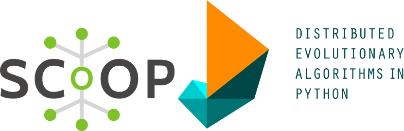
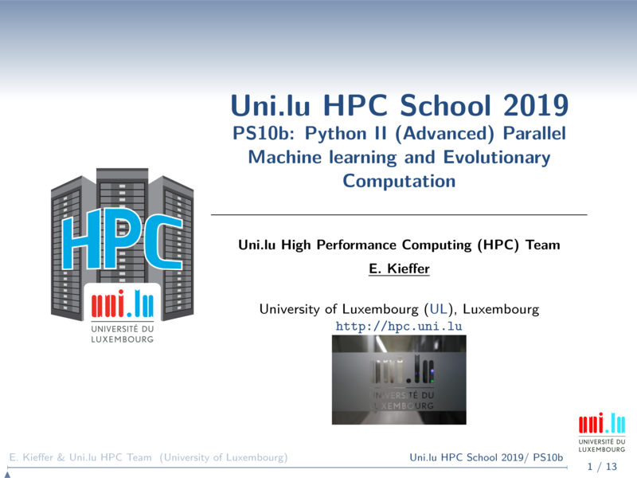

[](https://hpc.uni.lu) [](http://www.gnu.org/licenses/gpl-3.0.html) [](https://github.com/ULHPC/tutorials/issues/) [](https://github.com/ULHPC/tutorials/raw/devel/python/advanced/scoop-deap/slides.pdf) [](https://github.com/ULHPC/tutorials/tree/devel/python/advanced/scoop-deap/) [](http://ulhpc-tutorials.readthedocs.io/en/latest/python/advanced/scoop-deap/) [](https://github.com/ULHPC/tutorials)


# Parallel evolutionary computing with Scoop/Deap 



[](slides.pdf)

## Description 

Evolutionary computing is a class of global optimisation algorithms designed to tackle complex optimisation problems (e.g. combinatorial, non-linear, non-convex).  One can find multiple python libraries such:

* [**Deap**](https://deap.readthedocs.io/en/master/)  
* [**Pygmo**](https://esa.github.io/pagmo2/)
* [**Pyvolution**](https://pyvolution.readthedocs.io/en/latest/)
* [**pySTEP**](https://github.com/pySTEPS/pysteps)
* [**Pyevolve**](http://pyevolve.sourceforge.net/)
* [**PyRobot**](https://github.com/chriskiehl/pyrobot)
* [**Inspyred**](https://pythonhosted.org/inspyred/)


## Deap through scoop distributed worflow

In this tutorial, we focus on the Deap library that is highly configurable and can be easily tuned. One of the main advantage of Deap is its capacities to rely on the Scoop library to distribute algorithms. 

The Scalable COncurrent Operations in Python, aka Scoop, is a distributed task module allowing concurrent parallel programming on various environments, from heterogeneous grids to supercomputers. Its documentation is available on [http://scoop.readthedocs.org/](http://scoop.readthedocs.org/).

Scoop can be used on [HPC platform](https://scoop.readthedocs.io/en/0.7/install.html#hpc-usage) but still requires some tricks to cross nodes.


## Objectives

* See how to use Deap and Scoop in concert to distribute evolutionary computations
* See how to prepare a general launcher in order to use Scoop 


## Deap

For this tutorial, we are going to find the global minimum of the rastigin function (see below for 2 variables x and y). This function is used generally as benchmark to test evolutionary algorithms. The global optima ```f(x)=0``` with ```x=[0....0]```.
<center>

</center>

To optimise this continuous function, we are going to rely on the Covariance Matrix Adaptation - Evolutionary Strategy (CMA-ES). This algorithm is based on the maximum likelihood principle and adjusts the mean and covariance of the solution distribution in order to maximize the likelihood of finding promising candidates.

<center>

</center>


## Setup

We are going to setup a python virtual environment in order to install all required python libraries. 
Please create a separate folder (ex. scoop-deap) and cd into it. Apply the following commands to setup your
environment.

Be sure to start with a bare environment:

* No interactive job running and thus no loaded modules
* No python virtualenv already loaded

```bash
# If you did not already clone the tutorial repository
cd $HOME
git clone https://github.com/ULHPC/tutorials.git
# Else update it
cd tutorials && git pull && cd ..
# cd into the scripts folder
cd tutorials/python/advanced/scoop-deap/scripts
# Ask an interactive job
si
# Load python3 module (load by default Python3)
module load lang/Python
python -m venv test_env
source test_env/bin/activate
pip install numpy deap scoop matplotlib
```


## The CMA-ES optimisation script

The code of the following python script can be found in the file ```evolution.py``` located in the 
```scripts``` folder. Actually, your current folder if you did not cd into another one. 

```python
import sys
import numpy
import random
import timeit
import json
import collections
import os
# Library to generate plots                                                                         
import matplotlib as mpl                                                                            
# Define Agg as Backend for matplotlib when no X server is running                                  
mpl.use('Agg')                                                                                      
import matplotlib.pyplot as plt 
from deap.algorithms import *
from deap import base
from deap import creator
from deap import tools
from deap import benchmarks
from deap import algorithms
from deap import cma

# Create new type dynalically
creator.create("FitnessMin", base.Fitness, weights=(-1.0,))
creator.create("Individual", list, fitness=creator.FitnessMin)

# Create a toolbox and overload existing functions
toolbox = base.Toolbox()
toolbox.register("evaluate", benchmarks.rastrigin)

def tree():
    ''' 
        Recursive dictionnary with defaultdict 
    '''
    return collections.defaultdict(tree)

def main(N,out_sol_dict):
    '''
        Procedure setting up all the necessary parameters and components for 
        CMAES evolution

        Parameters:
        -----------
        N: Dimension of the problem (number of variables)
        out_sol_dict: Dictionnary to store the results

    '''
    # CMAES strategy
    strategy = cma.Strategy(centroid=[5.0]*N, sigma=5.0, lambda_=20*N)
    # Register the generation and update procedure for the algorithm workflow
    toolbox.register("generate", strategy.generate, creator.Individual)
    toolbox.register("update", strategy.update)

    # Create a set containing the best individual recorded
    hof = tools.HallOfFame(1)
    # Create a statistical object and tell it what you want to monitor
    stats = tools.Statistics(lambda ind: ind.fitness.values)
    stats.register("avg", numpy.mean)
    stats.register("std", numpy.std)
    stats.register("min", numpy.min)
    stats.register("max", numpy.max)
   
    # Start the generation and update the population of solutions:w
    _,logbook=algorithms.eaGenerateUpdate(toolbox, ngen=250, stats=stats, halloffame=hof)
    # Get best solution and save it
    best_sol=tools.selBest(hof,1)[0]
    out_sol_dict["solution"]=list(best_sol)
    out_sol_dict["fit"]=float(best_sol.fitness.values[0])
    # Plot convergence
    gen, avg = logbook.select("gen", "avg")
    plt.figure()
    plt.title("Convergence curve")
    plt.xlabel("Generations")
    plt.ylabel("Best obtained Fitness value at gen N")
    plt.grid(True)
    plt.plot(gen,avg,"r--")
    plt.savefig("conv.pdf",dpi=600)

if __name__ == "__main__":
    # Check number of parameters
    assert len(sys.argv)==2, "Please enter the dimension of the problem"
    solutions=tree()
    # Evaluate the running time
    t=timeit.timeit("main({0},solutions)".format(sys.argv[1]),setup="from __main__ import main,solutions",number=1)
    solutions['time']=t
    solutions['cores']=int(os.environ["SLURM_NTASKS"])
    solutions['dimensions']=int(sys.argv[1])
    # Save to json file
    with open('solutions_c{0}_n{1}.json'.format(sys.argv[1],os.environ["SLURM_NTASKS"]), 'w') as json_file:
        json.dump(solutions, json_file,indent=True)

```
Since you are still in the interactive job, start an interactive optimisation using the following command ```python evolution.py [size]``` with ```[size]``` the number of variables to be considered. 
For example, you can run ```python evolution.py 10```. While the optimisation of the rastrigin function is ongoing, you can see the evolution log for every evolutionary generations displayed on your terminal.

Note that if your interactive job ended, please start a new one and source again the python virtual environment.

## Distributed evolution with scoop

If you increase ```[size]```, you will notice how it can be time-consuming to optimise the rastrigin function. This is mainly due to the dimensionality curse that forces population-based algorithm to consider much more candidates.

To cope with this issue, we can evaluate candidates in a distributed manner. To do this, you need to overload the map function of the algorithm using the [toolbox class](https://deap.readthedocs.io/en/master/api/base.html) provided by Deap and replace the default ```map``` function with ```futures.map``` from the scoop library.

Modify the ```evolution.py``` script to include the scoop library and overload the map function using the Deap [documentation](https://deap.readthedocs.io/en/master/). Please try yourself before looking at the solution below. 

### Solution: 

```python
import sys
import numpy
import random
import timeit
import json
import collections
import os
# Library to generate plots                                                                         
import matplotlib as mpl                                                                            
# Define Agg as Backend for matplotlib when no X server is running                                  
mpl.use('Agg')                                                                                      
import matplotlib.pyplot as plt 
from deap.algorithms import *
from deap import base
from deap import creator
from deap import tools
from deap import benchmarks
from deap import algorithms
from deap import cma
from scoop import futures # <-------------------- import futures module from scoop

# Create new type dynalically
creator.create("FitnessMin", base.Fitness, weights=(-1.0,))
creator.create("Individual", list, fitness=creator.FitnessMin)

# Create a toolbox and overload existing functions
toolbox = base.Toolbox()
toolbox.register("evaluate", benchmarks.rastrigin)
toolbox.register("map",futures.map) # <--------------- overload the map function

def tree():
    ''' 
        Recursive dictionnary with defaultdict 
    '''
    return collections.defaultdict(tree)

def main(N,out_sol_dict):
    '''
        Procedure setting up all the necessary parameters and components for 
        CMAES evolution

        Parameters:
        -----------
        N: Dimension of the problem (number of variables)
        out_sol_dict: Dictionnary to store the results

    '''
    # CMAES strategy
    strategy = cma.Strategy(centroid=[5.0]*N, sigma=5.0, lambda_=20*N)
    # Register the generation and update procedure for the algorithm workflow
    toolbox.register("generate", strategy.generate, creator.Individual)
    toolbox.register("update", strategy.update)

    # Create a set containing the best individual recorded
    hof = tools.HallOfFame(1)
    # Create a statistical object and tell it what you want to monitor
    stats = tools.Statistics(lambda ind: ind.fitness.values)
    stats.register("avg", numpy.mean)
    stats.register("std", numpy.std)
    stats.register("min", numpy.min)
    stats.register("max", numpy.max)
   
    # Start the generation and update the population of solutions:w
    _,logbook=algorithms.eaGenerateUpdate(toolbox, ngen=250, stats=stats, halloffame=hof)
    # Get best solution and save it
    best_sol=tools.selBest(hof,1)[0]
    out_sol_dict["solution"]=list(best_sol)
    out_sol_dict["fit"]=float(best_sol.fitness.values[0])
    # Plot convergence
    gen, avg = logbook.select("gen", "avg")
    plt.figure()
    plt.title("Convergence curve")
    plt.xlabel("Generations")
    plt.ylabel("Best obtained Fitness value at gen N")
    plt.grid(True)
    plt.plot(gen,avg,"r--")
    plt.savefig("conv.pdf",dpi=600)

if __name__ == "__main__":
    # Check number of parameters
    assert len(sys.argv)==2, "Please enter the dimension of the problem"
    solutions=tree()
    # Evaluate the running time
    t=timeit.timeit("main({0},solutions)".format(sys.argv[1]),setup="from __main__ import main,solutions",number=1)
    solutions['time']=t
    solutions['cores']=int(os.environ["SLURM_NTASKS"])
    solutions['dimensions']=int(sys.argv[1])
    # Save to json file
    with open('solutions_c{0}_n{1}.json'.format(sys.argv[1],os.environ["SLURM_NTASKS"]), 'w') as json_file:
        json.dump(solutions, json_file,indent=True)

```

## Starting scoop-deap with Slurm

The following script may look complex but remains very general. Feel free to use it for any other python project where you need distributed computations with scoop.
Starting distributed computation with Slurm requires a small trick (Thx to V. Plugaru for it). 


First, we need to pass to scoop the different allocated host machines. Here, we save the hostname of each machines using ```scontrol show hostanmes > $HOSTFILE```  into the file ```hostfile```. This allows scoop to find and use all allocated ressources. Last but not least, we need to **decorate** or **wrap** the python interpreter used by scoop to spawn workers. Indeed, scoop connects with ssh to the nodes and start the worker in place without loading module (using system python) and sourcing our virtual environment. To solve this issue, we need to replace the default python interpreter by a custom script that load the required python module but also source ```test_env```  before calling python. This permits to call the python loaded module and not the system one. 
Thus, it is important to start scoop as follows (see also last line): 

```python -m scoop --hostfile $HOSTFILE -n ${SLURM_NTASKS} --python-interpreter=$SCOOP_WRAPPER $INPUTFILE $@ ```


```bash
#!/bin/bash -l


# Ensure process affinity is disabled
export SLURM_CPU_BIND=none

# Prepare in the current folder a worker launcher for Scoop 
# The scipt below will 'decorate' the python interpreter command
# Before python is called, modules are loaded
HOSTFILE=$(pwd)/hostfile
SCOOP_WRAPPER=$(pwd)/scoop-python.sh

cat << EOF > $SCOOP_WRAPPER
#!/bin/bash -l
module load lang/Python
export SLURM_NTASKS=${SLURM_NTASKS}
source $(pwd)/test_env/bin/activate
EOF
echo 'python $@' >> $SCOOP_WRAPPER

chmod +x $SCOOP_WRAPPER

# Classical "module load" in the main script
module load lang/Python
source $(pwd)/test_env/bin/activate

# Save the hostname of the allocated nodes
scontrol show hostnames > $HOSTFILE

# Start scoop with python input script
INPUTFILE=$(pwd)/evolution.py 
python -m scoop --hostfile $HOSTFILE -n ${SLURM_NTASKS} --python-interpreter=$SCOOP_WRAPPER $INPUTFILE $@
```

Finally in order to execute this script (```launcher.sh```) on multiple cores and nodes, you can use the ```sbatch``` command. For example, ```sbatch --ntasks=31 --cpus-per-task=1 --time=00:10:00 -p batch launcher.sh 50``` will start the script with 31 cores allocated during 10 minutes to solve the rastrigin benchmark having 50 variables.

After job completion, use [scp or rsync](https://hpc.uni.lu/users/docs/filetransfer.html) to retrieve your results on your laptop.

## Next


1. Restart the script with different size (number of variables)
2. Restart thie script with different core allocation
3. All results are saved in json file. You can use the results to compute speedup, etc ...
4. Try to optimize another multivariate function (e.g. [shaffer function](https://deap.readthedocs.io/en/master/api/benchmarks.html#deap.benchmarks.schaffer))
5. Read scoop [documentation](https://scoop.readthedocs.io/en/0.7/usage.html) and adapt it for your research problem  


## References

See the following books to know all about python parallel programming.


<center>
[](https://books.google.fr/books/about/Python_Parallel_Programming_Cookbook.html?id=Aht1CgAAQBAJ&source=kp_book_description&redir_esc=y)
[](https://books.google.fr/books?id=VQDgDAAAQBAJ&printsec=frontcover&dq=Mastering+python&hl=en&sa=X&ved=0ahUKEwiG6dG13fjiAhWkxoUKHcu-DZoQ6AEIKDAA#v=onepage&q=Mastering%20python&f=false)
[](https://books.google.fr/books/about/High_Performance_Python.html?id=bIZaBAAAQBAJ&redir_esc=y)
</center> 
