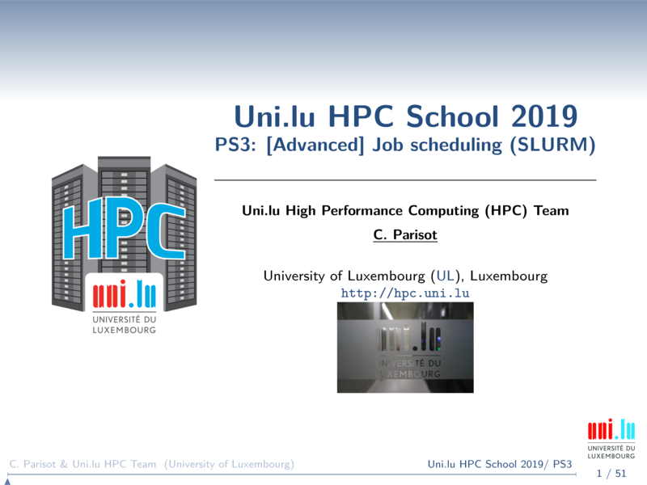

[](https://hpc.uni.lu) [](http://www.gnu.org/licenses/gpl-3.0.html) [](https://github.com/ULHPC/tutorials/issues/) [](slides.pdf) [](https://github.com/ULHPC/tutorials/tree/devel/advanced/advanced_scheduling/) [](http://ulhpc-tutorials.readthedocs.io/en/latest/advanced/advanced_scheduling/) [](https://github.com/ULHPC/tutorials)

# UL HPC Tutorial: Advanced scheduling with SLURM

     Copyright (c) 2013-2018 UL HPC Team <hpc-sysadmins@uni.lu>


[](slides.pdf)

The objective of this tutorial is to practice using the SLURM cluster
workload manager in use on the UL HPC [iris cluster](https://hpc.uni.lu/systems/iris/).

It's important that you read the [slides](https://github.com/ULHPC/tutorials/blob/devel/advanced/advanced_scheduling/advanced_scheduling.pdf?raw=true) first.

They review, for iris:

1. the way SLURM was configured, accounting and permissions
2. common and advanced SLURM tools and commands
3. SLURM job types
4. SLURM generic launchers you can use as a base for your own jobs
5. a comparison of SLURM (iris cluster) and OAR (gaia and chaos)

## Part one

You will now get familiar, if not already, with the main tools part of SLURM (otherwise skip down to [Part two](#part-two-the-harder-stuff)).

You must first connect to the iris cluster frontend, e.g. with `ssh yourlogin@access-iris.uni.lu -p 8022`.

__Notes__:

* All the commands used have detailed manuals (`man $toolname`) that you can always refer to.
* To make interactive jobs easier to launch, a function `si` exists that starts an interactive job with your parameters and the qos-interactive QOS
* You can override it in your own `~/.bashrc` with aliases that customizes it for your particular needs, e.g.
    - `alias si='srun -p interactive --qos qos-interactive --time=0:30:0 --pty bash -i'`
    - `alias si='srun -p interactive --qos qos-interactive-001 --pty bash -i'`
    - `alias six='srun -p interactive --qos qos-interactive --x11 --pty bash -i'`
* Users that are part of groups with access to dedicated QOS should use their specific QOS when launching jobs below (e.g. `qos-interactive-001`)

### Partition (queue) and node status

* Show queued jobs, show more details ('long' view that includes the job time limit):

```
squeue
squeue -l
```

__Question__: are all jobs visible by default? what does `squeue -a` do?

* Show only the queued jobs of your user (`$USER` is an environment variable in your shell), then for another specific user:

```
squeue -u $USER
squeue -u vplugaru
```

* Show queued jobs in a specific partition:

```
squeue -p $partition
```

* Show queued jobs that are in a specific state (pending / running / failed / preempted, see `man squeue` for all available states):

```
squeue -t PD
squeue -t R
squeue -t F
squeue -t PR
```

__Question__: what other job states exist?


* Show partition status, summarized status (without node state), and node-oriented partition status:

```
sinfo
sinfo -s
sinfo -N
```

__Questions__: What does the 'mix' state in the output of `sinfo` signify?  What will happen to your jobs if the nodes are 'down' or 'drain'? What will you see when looking at a job with `squeue` or `scontrol show job` ?

* Show node reservations that have been created by the administrators for specific users or accounts:

```
sinfo -T
```

* Show node details (all nodes, specific node):

```
scontrol show nodes
scontrol show nodes $nodename
```

* Check the default account your jobs will use:

```
sacctmgr show user $USER format=user%20s,defaultaccount%30s
```

* See all account associations for your user and the QOS they grant access to:

```
sacctmgr list association where users=$USER format=account%30s,user%20s,qos%120s
```

### Job submission and management

#### Starting interactive jobs

* Start an interactive job with the default number of cores and walltime:

```
srun -p interactive --qos qos-interactive --pty bash -i
```

__Question__: now before exiting the job, what does `env | grep SLURM` give out? What is the walltime for this job?

* Start an interactive job for 3 minutes, with 2 nodes and 4 tasks per node:

```
srun -p interactive --qos qos-interactive --time=0:03:0 -N 2 --ntasks-per-node=4 --pty bash -i
```

__Question__: can you ssh between the nodes part of this job? what happens if you try to ssh to a different node (not from your job/jobs)? if you are still connected to the job after 3 minutes, what happens?

* Start an interactive job with _X11 forwarding_ such that GUI applications (running in the cluster) will be shown on your workstation:
    - note that your initial connection to the iris cluster needs to have X11 Forwarding enabled, e.g. `ssh -X iris-cluster`

Note: as of 2017-11-09, direct X11 (--x11) support with srun (`srun -p interactive --qos qos-interactive --pty --x11 bash -i`) is being patched, and the below workaround is needed.

1. create a file `~/bin/slurm-x11` with the below content and make it executable (`chmod +x ~/bin/slurm-x11`):

```
#!/bin/bash
headNode=$(scontrol show hostname $SLURM_NODELIST | head -n1)
slurmEnv=$(printenv | grep SLURM_ | sed -rn "s/=(.*)/='\1'/p" | paste -d ' ' -s)
exec ssh -X $headNode -t "$slurmEnv bash"
```

2. launch a job with X11: `salloc -p interactive --qos qos-interactive slurm-x11`

__Question__: what happens if you launch a graphical application (e.g. `xterm`)? did it appear on your own machine? if not, what went wrong?

* Start a best-effort interactive job (can be interrupted by regular jobs if other users submit them):

```
srun -p interactive --qos qos-besteffort --pty bash -i
```

__Question__: can you make this job be preempted? try to allocate other nodes in the interactive partition and see what happens when the besteffort job is marked for preemption.

* Start an interactive job on nodes with Skylake CPUs

```
srun -C skylake --pty bash -i
```

__Question__: what partition is this job running in?

#### Collecting job information

Now start a job with one of the previous commands, and you will check its details (runtime metrics, status, after execution statistics, etc.).

* Show the details of a job:

```
scontrol show job $jobid
```

__Question__: what happens if you try to take a look at a job which is not in the queue (waiting/running) anymore (e.g. `scontrol show job 2`)?


* Check waiting job priority (detailed view):

```
sprio -l
```

* Check expected job start time:

```
squeue --start -u $USER
```

* Show running job (and steps) system-level utilization (memory, I/O, energy):
    - note that `sstat` information is limited to your own jobs

```
sstat -j $jobid
```

* Show specific statistics from a running job (and steps) or multiple jobs:

```
sstat -j $jobid --format=AveCPU,AveRSS,AveVMSize,MaxRSS,MaxVMSize
sstat -j $jobid1,$jobid2 --format=AveCPU,AveRSS,AveVMSize,MaxRSS,MaxVMSize
```
* Output the statistics in a parseable format, delimited by `|` (with, then without trailing `|`):

```
sstat -p -j $jobid --format=AveCPU,AveRSS,AveVMSize,MaxRSS,MaxVMSize
sstat -P -j $jobid --format=AveCPU,AveRSS,AveVMSize,MaxRSS,MaxVMSize
```

* Show running or completed job (and steps) system-level utilization from the accounting information, and with full details:

```
sacct -j $jobid
sacct -j $jobid -l
```

__Question__: remember that job id #2? can we see its information with `sacct -j 2 --format=user` and `sacct -j 2 -l` ?


* Show statistics relevant to the job allocation itself not taking steps into consideration, and with more details:

```
sacct -X -j $jobid
sacct -X -j $jobid -l
```

* Show a subset of interesting statistics from a completed job and its steps, including:
    1. elapsed time in both human readable and total # of seconds
    2. maximum resident set size of all tasks in job (you may want to add also `maxrssnode` and `maxrsstask` for a better understanding of which process consumed memory)
    3. maximum virtual memory size (idem for `maxvmsizenode` and `maxvmsizetask`)
    4. consumed energy (in Joules), be aware there are many caveats!
        - your job needs to be the only one running on the corresponding compute nodes
        - the [RAPL mechanism](http://web.eece.maine.edu/~vweaver/projects/rapl/rapl_support.html) will not take into account all possible hardware elements which consume power (CPUs, GPUs and DRAM are included)

```
sacct -j $jobid --format=account,user,jobid,jobname,partition,state,elapsed,elapsedraw,start,end,maxrss,maxvmsize,consumedenergy,consumedenergyraw,nnodes,ncpus,nodelist
```

* Output the same statistics in the parseable `|`-delimited format, for a single and multiple jobs:

```
sacct -p -j $jobid --format=account,user,jobid,jobname,partition,state,elapsed,elapsedraw,start,end,maxrss,maxvmsize,consumedenergy,consumedenergyraw,nnodes,ncpus,nodelist
sacct -p -j $jobid1,$jobid2 --format=account,user,jobid,jobname,partition,state,elapsed,elapsedraw,start,end,maxrss,maxvmsize,consumedenergy,consumedenergyraw,nnodes,ncpus,nodelist
```

* Show statistics for all personal jobs started since a particular date, then without job steps:

```
sacct --starttime 2017-06-12 -u $USER
sacct -X --starttime 2017-06-12 -u $USER
```

#### Pausing, resuming and cancelling jobs

* To stop a waiting job from being scheduled and later to allow it to be scheduled:

```
scontrol hold $jobid
scontrol release $jobid
```

__Question__: what do you see as "Reason" in `squeue` output on a large (say, 10 nodes interactive) job that you submitted and then ran `scontrol hold $jobid` on?


* To pause a running job and then resume it:

```
scontrol suspend $jobid
scontrol resume $jobid
```

__Question__: what happens when you try to suspend an interactive job?


* To remove a job from the queue (stopping it if already started):

```
scancel $jobid
```

__Question__: what happens when you cancel a running job, does it get killed immediately?


* To remove a job by name:

```
scancel --name=$jobname
scancel -n $jobname
```

__Question__: what happens if you start two jobs with the same name and cancel by name?


* To remove all user jobs:

```
scancel --user=$USER
scancel -u $USER
```

* To remove all waiting jobs (`pending` state) for a given user:

```
scancel --user=$USER --state=pending
scancel -u $USER -t pending
```

* To remove all waiting jobs in a given partition (e.g. __batch__):

```
scancel -u $USER --partition=batch
scancel -u $USER -p batch
```

* To stop and restart a given job:

```
scontrol requeue $jobid
```

__Question__: what message do you get when you try to requeue an interactive job?


## Part two: the harder stuff

We have made available a set of template [batch launcher scripts for SLURM](https://hpc.uni.lu/users/docs/slurm_launchers.html).

You should now:

* adapt the most appropriate one (sequential, parallel, etc.) for your most commonly used HPC application
* launch your own (short execution time) test case, on a single core for sequential code or two distributed cores for parallel code
    - take note of your fair-share and usage values (e.g. with `sshare -A $(sacctmgr -n show user $USER format=defaultaccount%30s)`)
    - alternative: compile and use HPCG from the [ULHPC HPCG tutorial](https://github.com/ULHPC/tutorials/tree/devel/advanced/HPCG)
* monitor job progression:
    - with `sprio` / `sprio -l` to see its priority in the queue
    - using `sstat` once it starts, to get running metrics
    - by connecting to the job (`--jobid` parameter of `srun`) and using `htop`
* finally, once the job finished or you have stopped it:
    - check the information visible with `sacct`
    - how did your fair-share and usage values change?
