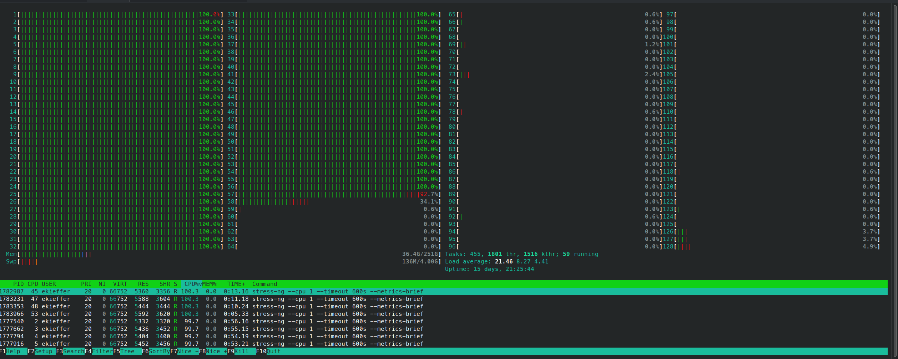
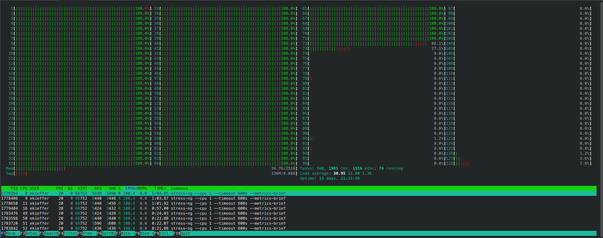
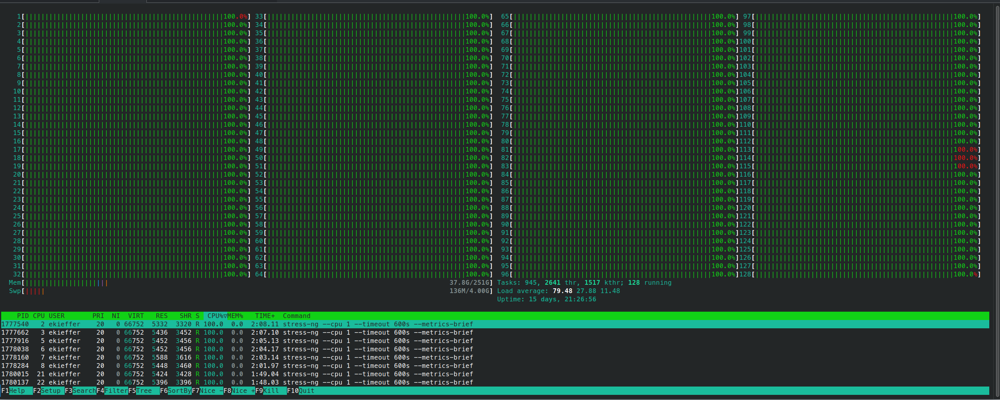

[](https://hpc.uni.lu) [](http://www.gnu.org/licenses/gpl-3.0.html) [](https://github.com/ULHPC/tutorials/issues/) [](https://github.com/ULHPC/tutorials/tree/devel/sequential/basics/) [](http://ulhpc-tutorials.readthedocs.io/en/latest/sequential/basics/) [](https://github.com/ULHPC/tutorials)

# HPC Management of Sequential and Embarrassingly Parallel Jobs

     Copyright (c) 2020-2023 E. Kieffer, S. Varrette and UL HPC Team <hpc-team@uni.lu>


Embarrassingly parallel jobs, also known as "perfectly parallel" or "pleasingly parallel" jobs, refer to computational tasks that can be easily divided into smaller, independent sub-tasks that can be executed simultaneously without any need for communication or interaction between them. This makes them ideal for parallel computing, where multiple processors or computing units can work on separate sub-tasks at the same time, leading to significant performance improvements.

The term "embarrassingly parallel" is used because these problems are considered relatively simple to parallelize, compared to other computational problems that require complex coordination or communication between processors.

Examples of embarrassingly parallel jobs include:

1. Monte Carlo simulations: Many independent runs can be executed concurrently, with each simulation using different random numbers or initial conditions.
2. Image or video processing: Each frame or section of an image can be processed independently, such as applying filters or transformations.
3. Parameter sweeps: Running a computational model with varying parameter values, where each combination of parameters is independent of the others.
4. Data mining: Analyzing large datasets by breaking them into smaller chunks and processing them concurrently.
5. Brute-force search: Trying out all possible solutions to a problem, where each possible solution can be tested independently.

Embarrassingly parallel jobs are well-suited for distributed computing environments, such as clusters, grids, or cloud computing, where multiple computing resources can be leveraged to process the sub-tasks in parallel, significantly reducing the overall time to completion.

--------------------
## Pre-requisites ##

Ensure you are able to [connect to the UL HPC clusters](https://hpc-docs.uni.lu/connect/access/).
In particular, recall that the `module` command **is not** available on the access frontends.


## Bad approaches

### Job Arrays

**One legitimate naive way would be to perform N tasks (N=30) which can be obtained by submitting N=30 jobs**, typically through a `for [...] sbatch [...]` loop or [job Arrays](https://slurm.schedmd.com/job_array.html), a mechanism for submitting and managing collections of similar jobs quickly and easily.

This works of course but this is **generally against best-practices** (and basically every time you consider this approach, and except in a very few case, a `for [...] sbatch [...]` loop is probably a bad idea). 
Indeed:
    - **to complete N (serial) tasks, you need to submit N jobs that could be spread on up to N different nodes**.
         * this induces an **non-necessary overload of the scheduler** for (generally) very short tasks
         * you will likely wait (sometimes very long time) to have all your jobs completed
         * All these jobs will compete for a limited resource
    - **Node coverage is sub-optimal**
         * your serial jobs can be spread on **up to N different nodes**
Imagine expanding the job campaign to 1000 or 10000 test cases if not more, you risk to degrade significantly the HPC environment (**the scheduler will likely have trouble to manage so many short-live jobs**).

To prevent this behaviour, **We have thus limit the number of jobs allowed per user**  (see `sqos`).
The objective is to invite you _gently_ to **regroup your tasks per node** in order to better exploit their many-core configuration (28 cores on `iris`, 128 on `aion`).

So you should favor a single job running on a full node and use it to schedule _inside_ your independent tasks.  It will be both more efficient and faster to schedule as your tasks will not compete with other users

_Note on [Job Arrays](https://slurm.schedmd.com/job_array.html)_ support in Slurm:
All jobs must have the same initial options (e.g. size, time limit, etc.) and you can limit the number of simultaneous jobs by specifying the array index values using the `--array` or `-a` option of the `sbatch` command. You **SHOULD** set the maximum number of simultaneously running tasks from the job array  using a "%" separator -- typically match the number of cores per node (28 on `iris`, 128 on `aion`). For example `--array=0-100%28" will limit the number of simultaneously running tasks from this job array to 28.
Job arrays will have several additional environment variable set:

* `$SLURM_ARRAY_JOB_ID`     will be set to the first job ID of the array
* `$SLURM_ARRAY_TASK_ID`    will be set to the job array index value.
* `$SLURM_ARRAY_TASK_COUNT` will be set to the number of tasks in the job array.

We have configured the ULHPC facility to prevent job arrays. Indeed, massive job arrays campaign were run in the past that used to overwhelm the slurm controllers.
To avoid this behaviour to repeat, **we drastically reduce the capabilities of job arrays**:

``` bash
(access)$> scontrol show config | grep -i maxarray
```

_In short_, **Don't use job arrays!!!**: you can do better with [GNU Parallel](http://www.gnu.org/software/parallel/)


### For loops inside the job allocation

So you are encouraged to aggregate several serial tasks within a single job to better exploit the many-core configuration of each nodes (28 or 128 cores per node) - this would clearly be beneficial compared to you laptop that probably have "_only_" 4 cores.
One natural way of doing so would be to aggregate these tasks within a single slurm launcher, start them in the background (i.e. as child processes) by using the ampersand `&` after a Bash command, and the `wait` command to restrict the number of simultaneous tasks:

``` bash
# For illustration purpose only, DON'T DO THAT, prefer GNU Parallel
TASK=run_stressme
ncores=${SLURM_NTASKS_PER_NODE:-$(nproc --all)}
For i in {1..30}; do
    srun -n1 --exclusive -c 1 --cpu-bind=cores ${TASK} $i &
    [[ $((i%ncores)) -eq 0 ]] && wait    # Safeguard to limit simultaneously executed forsked sub-processes
done
wait
```

The ampersand `&` spawns the command `srun -n1 --exclusive -c 1 --cpu-bind=cores ${TASK} $i`  in the background.
The propose check to run the `wait` command allows to execute your bag of tasks by groups of 28 (or 128) to match the hardware configuration of ULHPC nodes. In generic terms, you wish to target `${SLURM_NTASKS_PER_NODE}` (if set) or the output of `nproc --all` (28 on iris, 128 on aion) process to be forked assuming you use a full node.
**This approach is nevertheless sub-optimal**: each bag of tasks is waiting for the longest one to complete before the next one is executed. That why you should favor the [GNU Parallel](http://www.gnu.org/software/parallel/) approach proposed on the sequel.

## Using GNU Parallel


[GNU Parallel](http://www.gnu.org/software/parallel/) is a tool for executing tasks in parallel, typically on a single machine. When coupled with the Slurm command `srun`, parallel becomes a powerful way of distributing a set of embarrassingly parallel tasks amongst a number of workers. This is particularly useful when the number of tasks is significantly larger than the number of available workers (i.e. `$SLURM_NTASKS`), and each tasks is independent of the others.

**Follow now our [GNU Parallel tutorial](../gnu-parallel/) to become more accustomed with the special (complex) syntax of this tool.**


```bash
#!/bin/bash -l
#SBATCH --time=02:00:00
#SBATCH --partition=batch
#SBATCH --nodes=1
#SBATCH --exclusive
#SBATCH --mem=0
#SBATCH --ntasks-per-node=128
#SBATCH --cpus-per-task=1


# Just useful check
print_error_and_exit() { echo "***ERROR*** $*"; exit 1; }
hash parallel 2>/dev/null && test $? -eq 0 || print_error_and_exit "Parallel is not installed on the system"

# Increase the user process limit.
ulimit -u 10000

echo "Node: ${SLURM_NODELIST}"
echo "Executing ${SLURM_NTASKS} independant tasks at the same time"
export TIMESTAMP=$(date +"%Y%m%dT%H%M%S")


# the --exclusive to srun makes srun use distinct CPUs for each job step
# -N1 -n1 single task with ${SLURM_CPUS_PER_TASK} cores
SRUN="srun  --exclusive -n1 -c ${SLURM_CPUS_PER_TASK:=1} --cpu-bind=cores"

HOSTNAME=$(hostname)
LOGS="logs.${TIMESTAMP}"
RESUME=""
TASKFILE=""
NTASKS=""


#=======================
# Get Optional arguments
#=======================
while [ $# -ge 1 ]; do
    case $1 in
        -r | --resume)           shift; LOGS=$1; RESUME=" --resume ";;
        -n | --ntasks)           shift; NTASKS="$1"                            ;;
        -* | --*)                echo "[Warning] Invalid option $1"          ;;
        *)                       break                                       ;;
    esac
    shift
done

#=======================
# Get Mandatory  Options
#=======================

if [[ "$#" < 1 ]]; then
    print_error_and_exit "No tasks defined"
else
    TASKFILE="$1"
    TASKFILE_DIR=$(cd "$(dirname "${TASKFILE}")" && pwd)
    TASKFILE_NAME="$(basename "${TASKFILE}")"
fi

echo "Starting parallel worker initialisation on $(hostname)"

#=======================
# Set logs for resuming
#=======================

LOGS_DIR="${TASKFILE_DIR}/${LOGS}"
TASKFILE_MAINLOG="${LOGS_DIR}/${TASKFILE_NAME//sh/log}"
PARALLEL="parallel --delay 0.2 -j ${SLURM_NTASKS} --joblog ${TASKFILE_MAINLOG} ${RESUME}"


echo "Create logs directory if not existing"
mkdir -p ${LOGS_DIR}

if [[ -z ${NTASKS} ]];then
    cat ${TASKFILE} |                                      \
    awk -v NNODE="$SLURM_NNODES" -v NODEID="$SLURM_NODEID" \
    'NR % NNODE == NODEID' |                               \
    ${PARALLEL} "${SRUN} {1} > ${LOGS_DIR}/$(basename ${TASKFILE}).log.{%}"
else
    echo  "$(seq 1 ${NTASKS})" |                             \
    awk -v NNODE="$SLURM_NNODES" -v NODEID="$SLURM_NODEID" \
    'NR % NNODE == NODEID' |                               \
    ${PARALLEL} "${SRUN} ${TASKFILE} > ${LOGS_DIR}/$(basename ${TASKFILE}).log.{1}"
fi
```

* The option `--exclusive` has been added to be sure that we do not share the node with another job. 
* The option `--mem=0` ensures that all memory will be available
* **Note**: Even if the previous options were missing, the `--ntasks-per-node` and `--cpus-per-task` options would ensure that all memory and cores are allocated to our job. In some situation, you may not need all cores but all the memory. Therefore I kept `--mem=0` and `--exclusive`. 

* Parallel is really a fantastic tool that offers the possibility to record all performed tasks into a joblog
* This is extremely useful in the case you underestimate the walltime associated to your allocation because you can resume from the last unfinished job using this joblog
* In this `slurm_parallel_launcher_single_node.sh` script, we propose to the user:
    - Either to repeat a task `--tasks` time
    - Or to provide a taskfile in which each line defines a command/app and its parameters

## Applications

### Stress test on the Aion cluster

* Among the tools to stress CPU and Memory, we have:
    - stress: a simple workload generator for POSIX systems
    - stress-ng: an updated version of stress tool with more features (CPU compute, cache thrastring, Drive stress, etc...)

* To install stress-ng, please clone the following [repository](https://github.com/ColinIanKing/stress-ng) 
* Follow the code chunk below to install it in the `${HOME}/.local` folder

```bash
$user@aion-XXXX> git clone https://github.com/ColinIanKing/stress-ng
$user@aion-XXXX> cd stress-ng
$user@aion-XXXX> make 
$user@aion-XXXX> ln -s $(pwd)/stress-ng ~/.local/bin/
```

* Let's now create a task script `task.sh` which stresses a single core

```bash
#!/bin/bash -l

# $PARALLEL_SEQ is a special variable from GNU parallel. It gives the
# number of the job in the sequence.
#
# Here we print the sleep time, host name, and the date and time.
echo "Task ${PARALLEL_SEQ}  started on host:$(hostname) date:$(date)"
echo "Stress test on 1 core"
${HOME}/.local/bin/stress-ng --cpu 1 --timeout 600s --metrics-brief
```
* Copy-paste the `task.sh` script to the current directory
* Now, submit a job with `sbatch slurm_parallel_launcher_single_node.sh -n 300 "./task.sh"`
* You can join your allocation using `srun --jobid <jobid> --overlap -w <node> --pty bash -i` and monitor the cpu usage

<style>
figcaption {
    text-align:center;
}

.page {
    padding-right: 0
}
</style>

<figure  class="align-center">
  <a id="task"></a>
  <figcaption> Parallel is submitting tasks to be executed in parallel on different cores </figcaption>
</figure>

<figure  class="align-center">
  <a id="task"></a>
  <figcaption> Almost done </figcaption>
</figure>


<figure  class="align-center">
  <a id="task"></a>
  <figcaption> Now all cores are occupied </figcaption>
</figure>

* The script contains also a mechanism to backup and clean a `log.timestamp` directory in which each task output is stored 

```bash
logs.20230511T112250
├── task.log
├── task.sh.log.1
├── task.sh.log.10
├── task.sh.log.100
├── task.sh.log.101
├── task.sh.log.102
├── task.sh.log.103
├── task.sh.log.104
├── task.sh.log.105
[...]
├── task.sh.log.93
├── task.sh.log.94
├── task.sh.log.95
├── task.sh.log.96
├── task.sh.log.97
├── task.sh.log.98
└── task.sh.log.99
```


```bash
cat logs.20230511T112250/task.log
Seq     Host    Starttime       JobRuntime      Send    Receive Exitval Signal  Command
1       :       1683796970.000     601.000      0       0       0       0       srun  --exclusive -n1 -c 1 --cpu-bind=cores ./task.sh > /home/users/ekieffer/parallel-srun/logs.20230511T112250/task.sh.log.1
2       :       1683796971.000     600.000      0       0       0       0       srun  --exclusive -n1 -c 1 --cpu-bind=cores ./task.sh > /home/users/ekieffer/parallel-srun/logs.20230511T112250/task.sh.log.2
3       :       1683796972.000     600.000      0       0       0       0       srun  --exclusive -n1 -c 1 --cpu-bind=cores ./task.sh > /home/users/ekieffer/parallel-srun/logs.20230511T112250/task.sh.log.3
4       :       1683796973.000     600.000      0       0       0       0       srun  --exclusive -n1 -c 1 --cpu-bind=cores ./task.sh > /home/users/ekieffer/parallel-srun/logs.20230511T112250/task.sh.log.4
5       :       1683796974.000     600.000      0       0       0       0       srun  --exclusive -n1 -c 1 --cpu-bind=cores ./task.sh > /home/users/ekieffer/parallel-srun/logs.20230511T112250/task.sh.log.5
6       :       1683796975.000     600.000      0       0       0       0       srun  --exclusive -n1 -c 1 --cpu-bind=cores ./task.sh > /home/users/ekieffer/parallel-srun/logs.20230511T112250/task.sh.log.6
7       :       1683796976.000     600.000      0       0       0       0       srun  --exclusive -n1 -c 1 --cpu-bind=cores ./task.sh > /home/users/ekieffer/parallel-srun/logs.20230511T112250/task.sh.log.7
[...]
297     :       1683798213.000     601.000      0       0       0       0       srun  --exclusive -n1 -c 1 --cpu-bind=cores ./task.sh > /home/users/ekieffer/parallel-srun/logs.20230511T112250/task.sh.log.297
298     :       1683798214.000     601.000      0       0       0       0       srun  --exclusive -n1 -c 1 --cpu-bind=cores ./task.sh > /home/users/ekieffer/parallel-srun/logs.20230511T112250/task.sh.log.298
299     :       1683798215.000     601.000      0       0       0       0       srun  --exclusive -n1 -c 1 --cpu-bind=cores ./task.sh > /home/users/ekieffer/parallel-srun/logs.20230511T112250/task.sh.log.299
300     :       1683798216.000     601.000      0       0       0       0       srun  --exclusive -n1 -c 1 --cpu-bind=cores ./task.sh > /home/users/ekieffer/parallel-srun/logs.20230511T112250/task.sh.log.300
```

* Suppose that some job tasks failed. You can resume the job using the following command: `sbatch slurm_parallel_launcher_single_node.sh -n 300 -r "logs.20230511T112250" "./task.sh`

## Embarrassingly [GNU] parallel tasks across multiples nodes

[GNU Parallel](http://www.gnu.org/software/parallel/) supports the distribution of tasks to multiple compute nodes using ssh connections, _i.e._ via the the `--sshloginfile <filename>` or `--sshlogin` options.

However, **Scaling Parallel with `--sshlogin[file]` is Not Recommended** Though this allows work to be balance between multiple nodes, past experience suggests that scaling is much less effective. 
Additionnaly, [GNU Parallel](http://www.gnu.org/software/parallel/) can cause some issues regarding the way it spawns tasks across nodes. Indeed, GNU Parallel uses internally the `ssh` command and don't use slurm. The notion of job steps is therefore lost which can lead to a bad job cleanup.
To overcome this issue, you may follow the [Many Tasks — Many Node Allocations using Slurm and GNU Parallel](../manytasks-manynodes/index.md).
