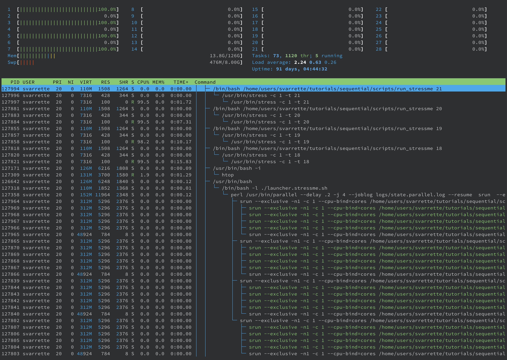
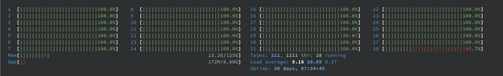

[](https://hpc.uni.lu) [](http://www.gnu.org/licenses/gpl-3.0.html) [](https://github.com/ULHPC/tutorials/issues/) [](https://github.com/ULHPC/tutorials/raw/devel/sequential/basics/slides.pdf) [](https://github.com/ULHPC/tutorials/tree/devel/sequential/basics/) [](http://ulhpc-tutorials.readthedocs.io/en/latest/sequential/basics/) [](https://github.com/ULHPC/tutorials)

# HPC Management of Sequential and Embarrassingly Parallel Jobs

     Copyright (c) 2021 S. Varrette and UL HPC Team <hpc-team@uni.lu>

[](https://github.com/ULHPC/tutorials/raw/devel/sequential/basics/slides.pdf)

For many users, the reason to consider (or being encouraged) to offload their computing executions on a (remote) HPC or Cloud facility is tied to the limits reached by their computing devices (laptop or workstation).
It is generally motivated by time constraints:

> "_My computations take several hours/days to complete. On an HPC, it will last a few minutes, no?_"

or search-space explorations:

> "_I need to check my application against a **huge** number of input pieces (files) - it worked on a few of them locally but takes ages for a single check. How to proceed on HPC?_"

For a large majority of you, these questions arise when executing programs that you traditionally run on your laptop or workstation and which consists in:

* a (well-known) application installed on your system, iterated over multiple input conditions configured by specific command-line arguments / configuration files
* a compiled program (C, C++, Java, Go etc.), iterated over multiple input conditions
* your favorite R or python (custom) development scripts, iterated again over multiple input conditions

**Be aware that in most of the cases, these applications are inherently SERIAL**: These are **able to use only one core** when executed.
You thus deal with what is often call a _Bag of (independent) tasks_, also referred to as **embarrassingly parallel tasks**.
The objective of this practical session is to guide you toward the effective management of such tasks in a way that optimize both the resource allocation and the completion time.


--------------------
## Pre-requisites ##

Ensure you are able to [connect to the UL HPC clusters](https://hpc.uni.lu/users/docs/access.html).
In particular, recall that the `module` command **is not** available on the access frontends.

If you have never configured [GNU Screen](http://www.gnu.org/software/screen/) before, and while not strictly mandatory, we advise you to rely on our customized configuration file for screen [`.screenrc`](https://github.com/ULHPC/dotfiles/blob/master/screen/.screenrc) available on [Github](https://github.com/ULHPC/dotfiles/blob/master/screen/.screenrc) and available on the access nodes under `/etc/dotfiles.d/screen/.screenrc`.
Otherwise, on Aion and more recent systems, **Prefer [Tmux](https://github.com/tmux/tmux/wiki)** -- see [Tmux cheat sheet](https://tmuxcheatsheet.com/) and [tutorial](https://www.howtogeek.com/671422/how-to-use-tmux-on-linux-and-why-its-better-than-screen/).
You may even want to use the [tmux-powerline](https://powerline.readthedocs.io/) by creating the file `~/.tmux.conf` mentioned below

```bash
### Access to ULHPC cluster - here aion
(laptop)$> ssh aion-cluster
# /!\ Advanced (but recommended) best-practice:
#    always work within an Tmux (aion) or GNU Screen (iris only) session named
#    with 'tmux new -s <topic>' OR (with screen) 'screen -S <topic>' (Adapt accordingly)
# IIF not yet done, copy ULHPC .screenrc in your home
(access)$> cp /etc/dotfiles.d/screen/.screenrc ~/
# IIF not yet done, copy ULHPC .tmux.conf in your home
(access)$> cp /etc/dotfiles.d/tmux/.tmux.conf ~/
```

Now you'll need to pull the latest changes in your working copy of the [ULHPC/tutorials](https://github.com/ULHPC/tutorials) you should have cloned in `~/git/github.com/ULHPC/tutorials` (see ["preliminaries" tutorial](../../preliminaries/))

``` bash
(access)$> cd ~/git/github.com/ULHPC/tutorials
(access)$> git pull
```

Now **configure a dedicated directory `~/tutorials/sequential` for this session**

``` bash
# return to your home
(access)$> mkdir -p ~/tutorials/sequential
(access)$> cd ~/tutorials/sequential
# create a symbolic link to the reference material
(access)$> ln -s ~/git/github.com/ULHPC/tutorials/sequential/basics ref.d
```

**Advanced users** (_eventually_ yet __strongly__ recommended), create a [Tmux](https://github.com/tmux/tmux/wiki) session (see [Tmux cheat sheet](https://tmuxcheatsheet.com/) and [tutorial](https://www.howtogeek.com/671422/how-to-use-tmux-on-linux-and-why-its-better-than-screen/)) or [GNU Screen](http://www.gnu.org/software/screen/) session you can recover later. See also ["Getting Started" tutorial ](../../beginners/).

``` bash
# /!\ Advanced (but recommended) best-practice:
#     Always work within a TMux or GNU Screen session named '<topic>' (Adapt accordingly)
(access-aion)$> tmux new -s HPC-school   # Tmux
(access-iris)$> screen -S HPC-school     # GNU Screen
#  TMux     | GNU Screen | Action
# ----------|------------|----------------------------------------------
#  CTRL+b c | CTRL+a c   | (create) creates a new Screen window. The default Screen number is zero.
#  CTRL+b n | CTRL+a n   | (next) switches to the next window.
#  CTRL+b p | CTRL+a p   | (prev) switches to the previous window.
#  CTRL+b , | CTRL+a A   | (title) rename the current window
#  CTRL+b d | CTRL+a d   | (detach) detaches from a Screen -
# Once detached:
#   tmux ls  | screen -ls : list available screen
#   tmux att | screen -x  : reattach to a past screen
```

## A sample "Stress Me!" parameter exploration

In this sample scenario, we will mimic the exploration of integer parameters within a continuous range `[1..n]` for serial (1-core) tasks lasting different amount time (here ranging ranging from 1 to n seconds). This is very typical: your serial application is likely to take more or less time depending on its execution context (typically controlled by command line arguments).
To keep it simple, we will assume the n=30 by default.

You will use a script, `scripts/run_stressme`, to reproduce a configurable amount of  stress on the system set for a certain amount of time (by default: 20s) passed as parameter using the '[stress](https://linux.die.net/man/1/stress)' command.
For instance, we would like to conduct the following executions:

``` bash
run_stressme 1     # execution time: 1s
run_stressme 2     # execution time: 2s
run_stressme 3     # execution time: 3s
run_stressme 4     # execution time: 4s
run_stressme 5     # execution time: 5s
[...]
run_stressme 27    # execution time: 27s
run_stressme 28    # execution time: 28s
run_stressme 29    # execution time: 29s
run_stressme 30    # execution time: 30s
```

Running this job campaign **sequentially** (one after the other on the same core) would take approximatively **465s**.
The below table wrap up the sequential times required for the completion of the job campaign depending on the number of `run_stressme` tasks, and the _theoretical_ optimal time corresponding to the _slowest_ task to complete when using an infinite number of computing resources.

| n = Number of tasks | Expected Seq. time to complete | Optimal time |
|---------------------|--------------------------------|--------------|
| 1                   | 1s                             | 1s           |
| 10                  | 55s      (~1 min)              | 10s          |
| __30 (default)__    | __465s     (7 min 45s)__       | __30s__      |
| 100                 | 5050s    (1h 24 min 10s)       | 100s         |


The objective is of course to optimize the time required to conclude this exploration


### Single task run (interactive)

Let's first test this command in an interactive jobs:

```bash
### Access to ULHPC cluster (if not yet done)
(laptop)$> ssh aion-cluster
### Have an interactive job
# ... either directly
(access)$> si
# ... or using the HPC School reservation 'hpcschool'if needed  - use 'sinfo -T' to check if active and its name
# (access)$> si --reservation=hpcschool
(node)$>
```

In another terminal (or another screen tab/windows), connect to that job and run `htop`

``` bash
# check your running job
(access)$> sq
# squeue -u $(whoami)
   JOBID PARTIT       QOS                 NAME       USER NODE  CPUS ST         TIME    TIME_LEFT PRIORITY NODELIST(REASON)
 2171206  [...]
# Connect to your running job, identified by its Job ID
(access)$> sjoin 2171206     # /!\ ADAPT job ID accordingly, use <TAB> to have it autocatically completed
(node)$> htop # view of all processes
#               F5: tree view
#               u <name>: filter by process of <name>
#               q: quit
```
Note that you have **only one core** reserved by default in a interactive job: you may thus see activities on the other cores via `htop`, they are corresponding to processes run by the other users. Note that you can use the `--exclusive`  flag upon reservation to request en exclusive access to a full node.

Now execute the `run_stressme` command in the first terminal/windows to see its effect on the processor load:

``` bash
# Run directly
(node)$> ~/git/github.com/ULHPC/tutorials/sequential/basics/scripts/run_stressme
#  /usr/bin/stress -c 1 -t 20
stress: info: [59918] dispatching hogs: 1 cpu, 0 io, 0 vm, 0 hdd
stress: info: [59918] successful run completed in 20s

# Now let's create a convenient path to the scripts under the dedicated directory
# used for this session
(node)$> cd ~/tutorials/sequential
# create a symbolic link to the script directory
(node)$> ln -s ref.d/scripts .    # <-- don't forget the trailing '.'  means 'here'
(node)$> ls scripts/run_stressme      # should not fail
scripts/run_stressme
(node)$> ./scripts/run_stressme
stress: info: [59918] dispatching hogs: 1 cpu, 0 io, 0 vm, 0 hdd
stress: info: [59918] successful run completed in 20s
# Exit the job
(node)$> exit    # OR CTRL-D
(access)$>
```

Exit `htop` in its terminal (press 'q' to exit) and press `CTRL-D` to disconnect to return to the access server.
Quit the interactive job by pressing `CTRL-D` to disconnect to return to the access server.


## A First launcher (1 job, 1 task on one core)

We will create a first "_launcher_ script", responsible to perform a single task over 1 core.
We will copy the default template provided by the ULHPC team for such usage, [`launcher.serial.sh`](scripts/launcher.serial.sh).

```bash
(access)$> cd ~/tutorials/sequential # if not yet done
(access)$> cp ~/git/github.com/ULHPC/tutorials/sequential/basics/scripts/launcher.serial.sh .   # <- trailing '.' means 'here
(access)$> mv launcher.serial.sh launcher.stressme-serial.sh
```

Use your favorite editor (`nano`, `vim` etc) to edit it as follows:

```diff
--- ~/git/github.com/ULHPC/tutorials/sequential/basics/scripts/launcher.stressme-serial.sh 2020-12-10 16:25:24.564580000 +0100
+++ launcher.stressme-serial.sh 2020-12-10 17:02:16.847752000 +0100
 #! /bin/bash -l
 ############################################################################
 # Default launcher for serial (one core) tasks
 ############################################################################
-###SBATCH -J Serial-jobname
+#SBATCH -J StressMe-single
@@ -32,7 +32,7 @@
 # /!\ ADAPT TASK variable accordingly
 # Absolute path to the (serial) task to be executed i.e. your favorite
 # Java/C/C++/Ruby/Perl/Python/R/whatever program to be run
-TASK=${TASK:=${HOME}/bin/app.exe}
+TASK=${TASK:=${HOME}/tutorials/sequential/scripts/run_stressme}
```

Let's test it in an interactive job:

```bash
### Have an interactive job
# ... either directly
(access)$> si
# ... or using the HPC School reservation 'hpcschool'if needed  - use 'sinfo -T' to check if active and its name
# (access)$> si --reservation=hpcschool

# check usage
(node)$> ./launcher.stressme-serial.sh -h

### DRY-RUN
(node)$> ./launcher.stressme-serial.sh -n
### Starting timestamp (s): 1607616148
/home/users/<login>/tutorials/sequential/scripts/run_stressme
### Ending timestamp (s): 1607616148"
# Elapsed time (s): 0

### REAL test
(node)$> ./launcher.stressme-serial.sh
### Starting timestamp (s): 1607616167
#  /usr/bin/stress -c 1 -t 20
stress: info: [64361] dispatching hogs: 1 cpu, 0 io, 0 vm, 0 hdd
stress: info: [64361] successful run completed in 20s
### Ending timestamp (s): 1607616187"
# Elapsed time (s): 20
```

_Hint_: for the lazy persons, you can define on the fly the `TASK` variable as follows:

```bash
### DRY-RUN
(node)$> TASK=$(pwd)/scripts/run_stressme ./scripts/launcher.serial.sh -n
### Starting timestamp (s): 1607616148
/home/users/<login>/tutorials/sequential/scripts/run_stressme
### Ending timestamp (s): 1607616148"
# Elapsed time (s): 0

### REAL test
(node)$> TASK=$(pwd)/scripts/run_stressme ./scripts/launcher.serial.sh
### Starting timestamp (s): 1607616500
#  /usr/bin/stress -c 1 -t 20
stress: info: [103707] dispatching hogs: 1 cpu, 0 io, 0 vm, 0 hdd
stress: info: [103707] successful run completed in 20s
### Ending timestamp (s): 1607616520"
# Elapsed time (s): 20
```

Quit your interactive job (exit or `CTRL+D`) and submit it as a passive job:

``` bash
# Note: you may want/need to run it under the dedicated reservation set for the training event
# using sbatch --reservation=[...]
(access)$> sbatch ./launcher.stressme-serial.sh
```

_Hint_: still for the lazy persons, just run:

``` bash
# Note: you may want/need to run it under the dedicated reservation set for the training event
# using [...] sbatch --reservation=[...]
#    TASK=$(pwd)/scripts/run_stressme  sbatch ./scripts/launcher.serial.sh
```

## Embarrassingly parallel parameter exploration

Now that we dispose of a launcher able to execute our individual _task_, we can consider the exploration campaign consisting of testing our task over 30 parameters `{1..30}`.

### First VERY BAD idea: For loop on sbatch or Job arrays

**One legitimate naive way would be to perform N tasks (N=30) which can be obtained by submitting N=30 jobs**, typically through a `for [...] sbatch [...]` loop or [job Arrays](https://slurm.schedmd.com/job_array.html), a mechanism for submitting and managing collections of similar jobs quickly and easily.
This works of course but this is **generally against best-practices** (and basically every time you consider this approach, and except in a very few case, a `for [...] sbatch [...]` loop is probably a bad idea). Indeed:
    - **to complete N (serial) tasks, you need to submit N jobs that could be spread on up to N different nodes**.
         * this induces an **non-necessary overload of the scheduler** for (generally) very short tasks
         * you will likely wait (sometimes very long time) to have all your jobs completed
    - Node coverage is sub-optimal
         * your serial jobs can be spread on **up to N different nodes**
    Imagine expanding the job campaign to 1000 or 10000 test cases if not more, you risk to degrade significantly the HPC environment (the scheduler will likely have trouble to manage so many short-live jobs).

To prevent this behaviour, **We have thus limit the number of jobs allowed per user**  (see `sqos`).
The objective is to invite you _gently_ to **regroup your tasks per node** in order to better exploit their many-core configuration (28 cores on `iris`, 128 on `aion`).

So you should favor a single jobs (for a full node) and use it to schedule _inside_ it your embarrassingly parallel exploration tasks. It will be both more efficient and faster to schedule.

_Note on [Job Arrays](https://slurm.schedmd.com/job_array.html)_ support in Slurm:
all jobs must have the same initial options (e.g. size, time limit, etc.) and you can limit the number of simultaneous jobs by specifying the array index values using the `--array` or `-a` option of the `sbatch` command. You **SHOULD** set the maximum number of simultaneously running tasks from the job array  using a "%" separator -- typically match the number of cores per node (28 on `iris`, 128 on `aion`). For example `--array=0-100%28" will limit the number of simultaneously running tasks from this job array to 28.
Job arrays will have several additional environment variable set:

* `$SLURM_ARRAY_JOB_ID`     will be set to the first job ID of the array
* `$SLURM_ARRAY_TASK_ID`    will be set to the job array index value.
* `$SLURM_ARRAY_TASK_COUNT` will be set to the number of tasks in the job array.

We have configured the ULHPC facility to prevent job arrays. Indeed, massive job arrays campaign were run in the past that used to overwhelm the slurm controllers.
To avoid this behaviour to repeat, **we drastically reduce the capabilities of job arrays**:

``` bash
(access)$> scontrol show config | grep -i maxarray
```

_In short_, **Don't use job arrays!!!**: you can do better with [GNU Parallel](http://www.gnu.org/software/parallel/)

### Second VERY BAD idea: Fork [bomb] for loop

So you are encouraged to aggregate several serial tasks within a single job to better exploit the many-core configuration of each nodes (28 or 128 cores per node) - this would clearly be beneficial compared to you laptop that probably have "_only_" 4 cores.
One natural way of doing so would be to aggregate these tasks within a single slurm launcher, start them in the background (i.e. as child processes) by using the ampersand `&` after a Bash command, and the `wait` command to restrict the number of simultaneous tasks:

``` bash
# For illustration purpose only, DON'T DO THAT, prefer GNU Parallel
TASK=run_stressme
ncores=${SLURM_NTASKS_PER_NODE:-$(nproc --all)}
For i in {1..30}; do
    srun -n1 --exclusive -c 1 --cpu-bind=cores ${TASK} $i &
    [[ $((i%ncores)) -eq 0 ]] && wait    # Safeguard to limit simultaneously executed forsked sub-processes
done
wait
```

The ampersand `&` spawns the command `srun -n1 --exclusive -c 1 --cpu-bind=cores ${TASK} $i`  in the background.
The propose check to run the `wait` command allows to execute your bag of tasks by groups of 28 (or 128) to match the hardware configuration of ULHPC nodes. In generic terms, you wish to target `${SLURM_NTASKS_PER_NODE}` (if set) or the output of `nproc --all` (28 on iris, 128 on aion) process to be forked assuming you use a full node.
**This approach is nevertheless sub-optimal**: each bag of tasks is waiting for the longest one to complete before the next one is executed. That why you should favor the [GNU Parallel](http://www.gnu.org/software/parallel/) approach proposed on the sequel.


----------------------------------------------------------------
## Best launcher based on GNU Parallel (1 job, 1 node, N tasks)


[GNU Parallel](http://www.gnu.org/software/parallel/) is a tool for executing tasks in parallel, typically on a single machine. When coupled with the Slurm command `srun`, parallel becomes a powerful way of distributing a set of embarrassingly parallel tasks amongst a number of workers. This is particularly useful when the number of tasks is significantly larger than the number of available workers (i.e. `$SLURM_NTASKS`), and each tasks is independent of the others.

**Follow now our [GNU Parallel tutorial](../gnu-parallel/) to become more accustomed with the special (complex) syntax of this tool.** In particular, you **MUST** run this tutorial over a more recent version of GNU Parallel (20211022) instead of the default system version.

To illustrate the advantages of this approach, we will use the generic GNU parallel launcher script designed by the UL HPC Team **[`scripts/launcher.parallel.sh`](https://github.com/ULHPC/tutorials/blob/devel/sequential/basics/scripts/launcher.parallel.sh)**. This file of proposed with optimized default slurm settings for each cluster, i.e. `scripts/launcher.parallel.{iris,aion}.sh` - use the most appropriate one (you can use the global variable `$ULHPC_CLUSTER` for that)

```diff
--- launcher.parallel.aion.sh	2021-11-15 21:43:53.000000000 +0100
+++ launcher.parallel.iris.sh	2021-11-15 21:43:54.000000000 +0100
@@ -23,7 +23,7 @@
 #SBATCH --partition=batch
 #__________________________
 #SBATCH -N 1
-#SBATCH --ntasks-per-node 128  # Optimized for 1 full node of aion
+#SBATCH --ntasks-per-node 28   # Optimized for 1 full node of iris
 #SBATCH -c 1                   # multithreading per task : -c --cpus-per-task <n> request
```

First copy this script template and **make it your FINAL launcher for stressme**:

```bash
(access)$> cd ~/tutorials/sequential # if not yet done
(access)$> cp ~/git/github.com/ULHPC/tutorials/sequential/basics/scripts/launcher.parallel.${ULHPC_CLUSTER}.sh .   # <- trailing '.' means 'here
(access)$> mv launcher.parallel.${ULHPC_CLUSTER}.sh launcher.stressme.${ULHPC_CLUSTER}.sh
```

Use your favorite editor (`nano`, `vim` etc) to edit it as follows:

```diff
--- scripts/launcher.parallel.${ULHPC_CLUSTER}.sh   2021-11-12 14:28:56.978642778 +0100
+++ launcher.stressme.${ULHPC_CLUSTER}.sh           2021-11-12 14:31:14.432175130 +0100
@@ -55,9 +55,9 @@
 ### /!\ ADAPT TASK and TASKLIST[FILE] variables accordingly
 # Absolute path to the (serial) task to be executed i.e. your favorite
 # Java/C/C++/Ruby/Perl/Python/R/whatever program to be run
-TASK=${TASK:=${HOME}/bin/app.exe}
+TASK=${TASK:=${HOME}/tutorials/sequential/scripts/run_stressme}
 # Default task list, here {1..8} is a shell expansion interpreted as 1 2... 8
-TASKLIST="{1..8}"
+TASKLIST="{1..30}"
 # TASKLISTFILE=path/to/input_file
 # If non-empty, used as input source over TASKLIST.
 TASKLISTFILE=
```

So not far from what you did form the basic first launcher.

### Interactive test of ULHPC GNU Parallel launcher (exclusive job required)

You can test this launcher within an **exclusive** interactive job (otherwise the internal calls to `srun --exclusive` will conflict with the default settings of interactive jobs)

``` bash
### Have an **exclusive** interactive job for 4 (embarrassingly parallel) tasks
# DON'T forget the exclusive flag for interactive tests of GNU parallel with our launcher
# ... either directly
(access)$> si --ntasks-per-node 4 --exclusive
# ... or using the HPC School reservation 'hpcschool'if needed  - use 'sinfo -T' to check if active and its name
# (access)$> srun --reservation=hpcschool --ntasks-per-node 4 --exclusive  --pty bash
```

As before, in another terminal (or another screen tab/windows), connect to that job and run `htop`.
Now you can make some tests:

```bash
# check usage
(node)$> ./launcher.stressme.sh -h   # read [tf] manual, press Q to quit

################ DRY-RUN
(node)$> ./launcher.stressme.sh -n
### Starting timestamp (s): 1607707840
parallel --delay .2 -j 4 --joblog logs/state.parallel.log --resume  srun  --exclusive -n1 -c 1 --cpu-bind=cores /home/users/svarrette/tutorials/sequential/scripts/run_stressme {1} ::: 1 2 3 4 5 6 7 8 9 10 11 12 13 14 15 16 17 18 19 20 21 22 23 24 25 26 27 28 29 30
### Ending timestamp (s): 1607707840"
# Elapsed time (s): 0

Beware that the GNU parallel option --resume makes it read the log file set by
--joblog (i.e. logs/state*.log) to figure out the last unfinished task (due to the
fact that the slurm job has been stopped due to failure or by hitting a walltime
limit) and continue from there.
In particular, if you need to rerun this GNU Parallel job, be sure to delete the
logfile logs/state*.parallel.log or it will think it has already finished!

############### TEST mode - parallel echo mode (always important to do before running effectively the commands)
(node)$> ./launcher.stressme.sh -t
### Starting timestamp (s): 1607708018
srun --exclusive -n1 -c 1 --cpu-bind=cores /home/users/svarrette/tutorials/sequential/scripts/run_stressme 1
srun --exclusive -n1 -c 1 --cpu-bind=cores /home/users/svarrette/tutorials/sequential/scripts/run_stressme 2
srun --exclusive -n1 -c 1 --cpu-bind=cores /home/users/svarrette/tutorials/sequential/scripts/run_stressme 3
[...]
srun --exclusive -n1 -c 1 --cpu-bind=cores /home/users/svarrette/tutorials/sequential/scripts/run_stressme 27
srun --exclusive -n1 -c 1 --cpu-bind=cores /home/users/svarrette/tutorials/sequential/scripts/run_stressme 28
srun --exclusive -n1 -c 1 --cpu-bind=cores /home/users/svarrette/tutorials/sequential/scripts/run_stressme 29
srun --exclusive -n1 -c 1 --cpu-bind=cores /home/users/svarrette/tutorials/sequential/scripts/run_stressme 30
### Ending timestamp (s): 1607708024"
# Elapsed time (s): 6

Beware that the GNU parallel option --resume makes it read the log file set by
--joblog (i.e. logs/state*.log) to figure out the last unfinished task (due to the
fact that the slurm job has been stopped due to failure or by hitting a walltime
limit) and continue from there.
In particular, if you need to rerun this GNU Parallel job, be sure to delete the
logfile logs/state*.parallel.log or it will think it has already finished!
/!\ WARNING: Test mode - removing sate file

############## REAL run
(node)$> ./launcher.stressme.sh
### Starting timestamp (s): 1607708111
#  /usr/bin/stress -c 1 -t 1
stress: info: [127447] dispatching hogs: 1 cpu, 0 io, 0 vm, 0 hdd
stress: info: [127447] successful run completed in 1s
#  /usr/bin/stress -c 1 -t 2
stress: info: [127439] dispatching hogs: 1 cpu, 0 io, 0 vm, 0 hdd
stress: info: [127439] successful run completed in 2s
[...]
#  /usr/bin/stress -c 1 -t 29
stress: info: [128239] dispatching hogs: 1 cpu, 0 io, 0 vm, 0 hdd
stress: info: [128239] successful run completed in 29s
#  /usr/bin/stress -c 1 -t 30
stress: info: [128276] dispatching hogs: 1 cpu, 0 io, 0 vm, 0 hdd
stress: info: [128276] successful run completed in 30s
### Ending timestamp (s): 1607708243"
# Elapsed time (s): 132

Beware that the GNU parallel option --resume makes it read the log file set by
--joblog (i.e. logs/state*.log) to figure out the last unfinished task (due to the
fact that the slurm job has been stopped due to failure or by hitting a walltime
limit) and continue from there.
In particular, if you need to rerun this GNU Parallel job, be sure to delete the
logfile logs/state*.parallel.log or it will think it has already finished!
```

A quick look in parallel on `htop` report in the second terminal/screen windows demonstrate the usage of only 4 cores as expressed in the slurm job (`--ntasks-per-node 4`):



**IMPORTANT** as highlighted by the ULHPC script: Beware that the GNU parallel option `--resume` makes it read the log file set by `--joblog` (i.e. `logs/state*.log`) to figure out the last unfinished task (due to the fact that the slurm job has been stopped due to failure or by hitting a walltime
limit) and continue from there.
In particular, as we now want to rerun the **same** GNU Parallel job, be sure to delete the
logfile `logs/state*.parallel.log` or your passive job will likely do nothing as it will think it has already finished!

``` bash
(node)$> rm logs/state.parallel.log
```

You can even test on another set of parameters without changing your script:

``` bash
# BEWARE of placing the range within surrounding double quotes!!!
(node)$> ./launcher.stressme.sh -n "{1..10}"   # Dry-run
(node)$> ./launcher.stressme.sh -t "{1..10}"   # Test
(node)$> ./launcher.stressme.sh "{1..10}"      # Real run
(node)$> rm logs/state.parallel.log
```
To avoid cleaning the joblog file, you may want to _exceptionally_ set it to `/dev/null` using the `--joblog` option also supported by our script.

### Passive job submission

Now that you have validated the expected behavior of the launcher script (you may want to test on higher number of tasks per node: GNU parallel will just adapt without any change to the launcher script), it's time to go for a passive run at full capacity.

Exit `htop` in its terminal (press 'q' to exit) and press `CTRL-D` to disconnect to return to the access server.
Quit your interactive job (exit or `CTRL+D`) and submit it as a passive job:

``` bash
# Exit the interactive job
(node)$> exit    # OR CTRL-D
### IFF not yet done: remove logs/state.parallel.log
(node)$> rm logs/state.parallel.log

# Note: you may want/need to run it under the dedicated reservation set for the training event
# using sbatch --reservation=[...]
(access)$> sbatch ./launcher.stressme.sh # --joblog /dev/null
```

_Hint_: for the lazy persons, you can still define on the fly the `TASK` variable as follows:

``` bash
(access)$> TASK=$(pwd)/scripts/run_stressme sbatch ./scripts/launcher.parallel.sh
```

A quick look in parallel on `htop` report (`sq` then `sjoin <JOBID>` then `htop`)  in the second terminal/screen windows demonstrate the expected usage optimizing the full node.
As there are "only" 30 parameters tested by default and that the launcher is configured with 28 tasks per node, the time you open `htop` you will likely _not_ see all cores used.
Yet you can repeat the experience for 100 `run_stressme` tasks quite conveniently, **without** changing the launcher script:

``` bash
# Remove the state log
(access)$> rm logs/state.parallel.log
# Note: you may want/need to run it under the dedicated reservation set for the training event
# using sbatch --reservation=[...]
# BEWARE of placing the range within surrounding double quotes!!!
#    --joblog option used **exceptionnally** to disable resume option
(access)$> sbatch ./launcher.stressme.sh --joblog /dev/null "{1..100}"
```

In this case, you can be reassured on your htop usage:



_Note_: if you use the default (old) version of `parallel` (GNU parallel 20160222 or 2019), you may occasionally witness a single core that seems inactive. This is a bug inherent to that version (tied to the controlling process) corrected in more recent version.

Repeat with 10 tasks

``` bash
# Note: you may want/need to run it under the dedicated reservation set for the training event
# using sbatch --reservation=[...]
# BEWARE of placing the range within surrounding double quotes!!!
(access)$> sbatch ./launcher.stressme.sh --joblog /dev/null "{1..10}"
```

And let's collect the aggregated statistics from these 3 jobs (adapt job ID accordingly):

``` bash
(access)$> slist 2175717,2175719,2175721 -X
# sacct -j 2175717,2175719,2175721 --format User,JobID,Jobname%30,partition,state,time,elapsed,MaxRss,MaxVMSize,nnodes,ncpus,nodelist,AveCPU,ConsumedEnergyRaw -X
     User        JobID                        JobName  Partition      State  Timelimit    Elapsed     MaxRSS  MaxVMSize   NNodes      NCPUS        NodeList     AveCPU ConsumedEnergyRaw
--------- ------------ ------------------------------ ---------- ---------- ---------- ---------- ---------- ---------- -------- ---------- --------------- ---------- -----------------
svarrette 2175717                         GnuParallel      batch  COMPLETED   01:00:00   00:00:13                              1         28        iris-117                         2430
svarrette 2175719                         GnuParallel      batch  COMPLETED   01:00:00   00:00:36                              1         28        iris-117                         9311
svarrette 2175721                         GnuParallel      batch  COMPLETED   01:00:00   00:03:57                              1         28        iris-117                        70702
[...]
```

Compared to the serial ampersand approach, we have thus **obtained a significant improvement in time efficiency** for the same node occupancy (1  single node allocated):

* for 30 tasks:  **39% improvement** (36s vs 59s), demonstrating a 92% improvement compared to the sequential run.
     - it's also 22% better than the VERY BAD `for [...] sbatch` approach (36s vs 46s)
* for 100 tasks: **13% improvement** (237s vs. 277s), demonstrating a 95% improvement compared to the sequential run.


## Embarrassingly [GNU] parallel tasks across multiples nodes

[GNU Parallel](http://www.gnu.org/software/parallel/) supports the distribution of tasks to multiple compute nodes using ssh connections, _i.e._ via the the `--sshloginfile <filename>` or `--sshlogin` options.

However, **Scaling Parallel with `--sshlogin[file]` is Not Recommended**
Though this allows work to be balance between multiple nodes, past experience suggests that scaling is much less effective. And as the typical usage of GNU parallel includes embarrassingly parallel tasks, there is no real justification to go across multiples nodes with a single job.
For instance, let's assume you wish to explore the parameters `{1..1000}`, you can divide your search space in (for instance) 5 sub domains and dedicated one GnuParallel job (exploiting a full node) for each subdomain as follows:

``` bash
(access)$> sbatch ./launcher.stressme.sh --joblog logs/state.1.parallel.log "{1..200}"
(access)$> sbatch ./launcher.stressme.sh --joblog logs/state.2.parallel.log "{201..400}"
(access)$> sbatch ./launcher.stressme.sh --joblog logs/state.3.parallel.log "{401..600}"
(access)$> sbatch ./launcher.stressme.sh --joblog logs/state.4.parallel.log "{601..800}"
(access)$> sbatch ./launcher.stressme.sh --joblog logs/state.5.parallel.log "{801..1000}"
```

Each of these jobs will cover (independently) the subdomain.
Note that you **MUST** set different joblog files to avoid collusion -- you can use the `--joblog` option supported by our launcher.

Finally, if you would need to scale to more than 5 such jobs, you are encouraged to use the [job dependency mechanism](https://slurm.schedmd.com/sbatch.html) implemented by Slurm to limit the number of concurrent running nodes.
This can be easily achieved with the `singleton` dependency (option `-d` of sbatch)  and carefully selected job names (option `-J` of sbatch):

> `-d, --dependency=singleton`: This job can begin execution **after any previously launched jobs sharing the same job name and user have terminated**. In other words, only one job by that name and owned by that user can be running or suspended at any point in time.

This would permit to restrict the number of concurrent jobs (leaving more resources for others)
For example, to explore `{1..2000}` (and more generally `{$min..$max}`), without exceeding concurrent running on more than 4 nodes (i.e. within a "tunnel" of 4 nodes max), you could proceed as follows:

``` bash
# Abstract search space parameters
min=1
max=2000
chunksize=200
for i in $(seq $min $chunksize $max); do
    ${CMD_PREFIX} sbatch \
                  -J ${JOBNAME}_$(($i/$chunksize%${MAXNODES})) --dependency singleton \
                  ${LAUNCHER} --joblog log/state.${i}.parallel.log  "{$i..$((i+$chunksize))}";
done
```

A sample submission script [`scripts/submit_stressme_multinode`](scripts/submit_stressme_multinode) is proposed to illustrate this concept:

```bash
(access)$> ./scripts/submit_stressme_multinode -h
Usage: submit_stressme_multinode [-x] [-N MAXNODES]
    Sample submision script across multiple nodes
    Execution won t spread on more than 4 nodes (singleton dependency)
      -x --execute         really submit the jobs with sbatch
      -N --nodes MAXNODES  set max. nodes

# Target restriction to 4 running nodes max
(access)$> ./scripts/submit_stressme_multinode
sbatch -J StressMe_0 --dependency singleton launcher.stressme.sh --joblog logs/state.1.parallel.log {1..201}
sbatch -J StressMe_1 --dependency singleton launcher.stressme.sh --joblog logs/state.201.parallel.log {201..401}
sbatch -J StressMe_2 --dependency singleton launcher.stressme.sh --joblog logs/state.401.parallel.log {401..601}
sbatch -J StressMe_3 --dependency singleton launcher.stressme.sh --joblog logs/state.601.parallel.log {601..801}
sbatch -J StressMe_0 --dependency singleton launcher.stressme.sh --joblog logs/state.801.parallel.log {801..1001}


# Target restriction to 2 running nodes max
(access)$> ./scripts/submit_stressme_multinode -N 2
sbatch -J StressMe_0 --dependency singleton launcher.stressme.sh --joblog logs/state.1.parallel.log {1..201}
sbatch -J StressMe_1 --dependency singleton launcher.stressme.sh --joblog logs/state.201.parallel.log {201..401}
sbatch -J StressMe_0 --dependency singleton launcher.stressme.sh --joblog logs/state.401.parallel.log {401..601}
sbatch -J StressMe_1 --dependency singleton launcher.stressme.sh --joblog logs/state.601.parallel.log {601..801}
sbatch -J StressMe_0 --dependency singleton launcher.stressme.sh --joblog logs/state.801.parallel.log {801..1001}
```

Now if you execute it, you will see only two running jobs and thus nodes (the other jobs are waiting for the dependency to be met)

```bash
(access)$> ./scripts/submit_stressme_multinode -N 2 -x
Submitted batch job 2175778
Submitted batch job 2175779
Submitted batch job 2175780
Submitted batch job 2175781
Submitted batch job 2175782

(access)$> sq
# squeue -u svarrette
   JOBID PARTIT    QOS        NAME  NODE  CPUS ST  TIME TIME_LEFT NODELIST(REASON)
 2175780  batch normal  StressMe_0     1    28 PD  0:00   1:00:00 (Dependency)
 2175781  batch normal  StressMe_1     1    28 PD  0:00   1:00:00 (Dependency)
 2175782  batch normal  StressMe_0     1    28 PD  0:00   1:00:00 (Dependency)
 2175779  batch normal  StressMe_1     1    28  R  0:02     59:58 iris-064
 2175778  batch normal  StressMe_0     1    28  R  0:05     59:55 iris-047
```
