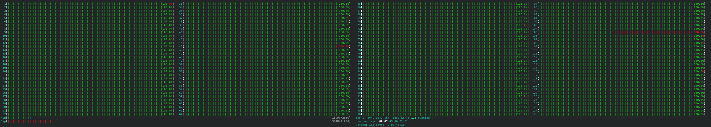

[](https://hpc.uni.lu) [](http://www.gnu.org/licenses/gpl-3.0.html) [](https://github.com/ULHPC/tutorials/issues/) ](https://github.com/ULHPC/tutorials/tree/devel/sequential/manytasks-manynodes/) [](http://ulhpc-tutorials.readthedocs.io/en/latest/sequential/manytasks-manynodes/) [](https://github.com/ULHPC/tutorials)

# Many Tasks — Many Node Allocations using Slurm and GNU Parallel

     Copyright (c) 2022-2023 E. Kieffer and UL HPC Team <hpc-team@uni.lu>

## Going beyond a single node

[GNU Parallel](/sequential/gnu-parallel/) is definitely a powerful system when combined with the [Slurm scheduler](https://slurm.schedmd.com/) and avoid all the disavantages of [Job Arrays](https://slurm.schedmd.com/job_array.html).
An extensive use of job arrays is **NOT** recommanded as described in [HPC Management of Sequential and Embarrassingly Parallel Jobs](/sequential/basic/) while using a script to submit jobs inside a loop is even worse as all your submitted jobs compete to be scheduled.

Although using Parallel on a single node allows to schedule your tasks inside your own allocation, it may not be sufficient. You may want to use a multiple node allocation to run more than **28** independent tasks on the Iris cluster and **128** on the Aion cluster. In mutiple research area, **repeatbility** is necessary and this is absolutely **NOT** embarrassing. In fact, task independence is a perfect case with no communication overhead.

In the [HPC Management of Sequential and Embarrassingly Parallel Jobs](/sequential/basic/) tutorial, you have seen how to use efficiently the [GNU Parallel](/sequential/gnu-parallel/) for executing multiple independent tasks in parallel on a single machine/node. In this tutorial, we will consider a multi-node allocation with GNU Parallel.

## Prerequisites

It's very important to make sure that parallel is installed on the computing nodes and not only on the access. On the ULHPC clusters, this should the case. If you would like to test it on a different platform, please refer to [GNU Parallel](/sequential/gnu-parallel/) to learn how to install it locally. Some other  well-know HPC centers provides GNU Parallel as a [Lmod](https://lmod.readthedocs.io/en/latest/) module.

## Methodology


## Spawning parallel workers

By default, GNU Parallel can distribute tasks to multiples nodes using the `--sshlogin` feature. Nonetheless, the approach is not really effective as suggested in the [NERSC documentation](https://docs.nersc.gov/jobs/workflow/gnuparallel/#scaling-parallel-with-sshlogin-is-not-recommended). In fact, we will use a simple but efficient approach to distribute tasks to nodes in a round-robin manner.  

Using `srun`, we will spawn a single parallel worker on each node. Each parallel worker will manage its own queue of tasks which implies that if a node fail only its queue will be impacted. To do so, have a look on the `slurm_parallel_launcher.sh` script:

```bash
#!/bin/bash -l
#SBATCH --time=02:00:00
#SBATCH --partition=batch
#SBATCH --nodes=2
#SBATCH --exclusive
#SBATCH --mem=0
#SBATCH --ntasks-per-node=1
#SBATCH --cpus-per-task=128

# Increase the user process limit.
ulimit -u 10000

echo "Spawning ${SLURM_NTASKS_PER_NODE} parallel worker on ${SLURM_NNODES} nodes"
echo "Nodes: ${SLURM_NODELIST}"
echo "Each parallel worker can execute ${SLURM_CPUS_PER_TASK} independant tasks" 
srun --no-kill --wait=0 parallel_worker.sh $*
```
* The option `--exclusive` has been added to be sure that we do not share the node with another job. 
* The option `--mem=0` ensures that all memory will be available
* **Note**: Even if the previous options were missing, the `--ntasks-per-node` and `--cpus-per-task` options would ensure that all memory and cores are allocated to our job. In some situation, you may not need all cores but all the memory. Therefore I kept `--mem=0` and `--exclusive`. 

You probably notice the srun options `--no-kill` and `--wait=0` which respectively ensure that the job does **NOT** automatically terminate  if one of the nodes it has been allocated fails and does wait on all tasks, i.e., does not terminate some time after the first task has been completed.

## The parallel worker

We now need to define the script starting the parallel workers `parallel_worker.sh`. Please keep in mind that this script will be executing exactly ${SLURM_NTASKS} times. Since we want a single parallel worker on each node, we have to specify in the previous launcher `--ntasks-per-node=1`. 


```bash
#!/bin/bash -l

print_error_and_exit() { echo "***ERROR*** $*"; exit 1; }


hash parallel 2>/dev/null && test $? -eq 0 || print_error_and_exit "Parallel is not installed on the system"

if [[ -z "${SLURM_NODEID}" ]]; then
    print_error_and_exit "The variable \${SLURM_NODEID} is required (but missing)... exiting"
fi
if [[ -z "${SLURM_NNODES}" ]]; then
    print_error_and_exit "The variable \${SLURM_NNODES} is required (but missing)... exiting"
    exit
fi

NBCORES_TASK=1
SCRIPT_DIR=$(cd "$(dirname "${BASH_SOURCE[0]}")" && pwd)
SCRIPT_NAME="$(basename "${BASH_SOURCE[0]}")"
HOSTNAME=$(hostname)
LOGS_DIR="${SCRIPT_DIR}/logs/Worker${SLURM_NODEID}"
SCRIPT_MAINLOG="${LOGS_DIR}/${SCRIPT_NAME//sh/log}"
RESUME='n'
PARALLEL="parallel --delay 0.2 -j $((SLURM_CPUS_PER_TASK / NBCORES_TASK)) --joblog ${SCRIPT_MAINLOG} "
TIMESTAMP=$(date +"%Y%m%d-%H%M%S")
TASKFILE=""
NTASKS=""


#=======================
# Get Optional arguments
#=======================
while [ $# -ge 1 ]; do
    case $1 in
        -r | --resume)           PARALLEL="${PARALLEL} --resume "; RESUME='y';;
        -n | --ntasks)           shift; NTASKS="$1"                            ;;
        -* | --*)                echo "[Warning] Invalid option $1"          ;;
        *)                       break                                       ;;
    esac
    shift
done

#=======================
# Get Mandatory  Options
#=======================

if [[ "$#" < 1 ]]; then
    print_error_and_exit "No tasks defined"
else
    TASKFILE="$1"
fi

echo "Starting worker initialisation on $(hostname)"

# Every worker clean its own log directory
if [[ -d ${LOGS_DIR} ]] && [[ ${RESUME} == 'n' ]];then
    echo "Create archive from old results  ${LOGS_DIR}"
    tar -zcvf "${LOGS_DIR}-${TIMESTAMP}.tar.gz" ${LOGS_DIR}
    echo "Cleaning ${LOGS_DIR}"
    find ${LOGS_DIR} -mindepth 1 -print -delete
fi

echo "Create logs directory if not existing"
mkdir -p ${LOGS_DIR}

if [[ -z ${NTASKS} ]];then
    cat ${TASKFILE} |                                      \
    awk -v NNODE="$SLURM_NNODES" -v NODEID="$SLURM_NODEID" \
    'NR % NNODE == NODEID' |                               \
    ${PARALLEL} "{1} > ${LOGS_DIR}/$(basename ${TASKFILE}).log.{%}"
else
    echo  "$(seq 1 ${NTASKS})" |                             \
    awk -v NNODE="$SLURM_NNODES" -v NODEID="$SLURM_NODEID" \
    'NR % NNODE == NODEID' |                               \
    ${PARALLEL} "${TASKFILE} > ${LOGS_DIR}/$(basename ${TASKFILE}).log.{1}"
fi
```
* It is essential to ensure that we have a valid allocation of computing nodes, i.e, `${SLURM_NODEID}` and  `${SLURM_NNODES}` are defined.

* Parallel is really a fantastic tool that offers the possibility to record all performed tasks into a joblog
* This is extremely useful in the case you underestimate the walltime associated to your allocation because you can resume from the last unfinished job using this joblog
* In this `parallel_worker.sh` script, we propose to the user:
    - Either to repeat a task `--tasks` time
    - Or to provide a taskfile in which each line defines a command/app and its parameters


<style>
figcaption {
    text-align:center;
}

.page {
    padding-right: 0
}
</style>

<figure style="width: 512px" class="align-center">
  <a id="task"></a>
  <figcaption>Example of tasks</figcaption>
</figure>

* The script contains also a mechanism to backup and clean a `log` directory in which each task output is stored 
* Each parallel worker has its own joblog  

```bash
logs/
├── Worker0
│   ├── parallel_worker.log
│   ├── task.sh.log.10
│   ├── task.sh.log.12
│   ├── task.sh.log.14
│   ├── task.sh.log.16
│   ├── task.sh.log.18
│   ├── task.sh.log.2
│   ├── task.sh.log.20
│   ├── task.sh.log.4
│   ├── task.sh.log.6
│   └── task.sh.log.8
└── Worker1
    ├── parallel_worker.log
    ├── task.sh.log.1
    ├── task.sh.log.11
    ├── task.sh.log.13
    ├── task.sh.log.15
    ├── task.sh.log.17
    ├── task.sh.log.19
    ├── task.sh.log.3
    ├── task.sh.log.5
    ├── task.sh.log.7
    └── task.sh.log.9

```
## Applications

### Stress test on the Aion cluster

* Among the tools to stress CPU and Memory, we have:
    - stress: a simple workload generator for POSIX systems
    - stress-ng: an updated version of stress tool with more features (CPU compute, cache thrastring, Drive stress, etc...)

* To install stress-ng, please clone the following [repository](https://github.com/ColinIanKing/stress-ng) 
* Follow the code chunk below to install it in the `${HOME}/.local` folder

```bash
$user@aion-XXXX> git clone https://github.com/ColinIanKing/stress-ng
$user@aion-XXXX> cd stress-ng
$user@aion-XXXX> make 
$user@aion-XXXX> ln -s $(pwd)/stress-ng ~/.local/bin/
```

* Let's now create a task script `task.sh` which stresses a single core

```bash
#!/bin/bash -l

# $PARALLEL_SEQ is a special variable from GNU parallel. It gives the
# number of the job in the sequence.
#
# Here we print the sleep time, host name, and the date and time.
echo "Task ${PARALLEL_SEQ}  started on host:$(hostname) date:$(date)"
echo "Stress test on 1 core"
${HOME}/.local/bin/stress-ng --cpu 1 --timeout 60s --metrics-brief
```
* Copy-paste the `task.sh` script to the current directory
* Now, submit a job with `sbatch slurm_parallel_launcher.sh parallel_worker.sh -n 300 "./task.sh"

<figure class="align-center">
  <a id="task"></a>
  <figcaption>Scheduled job</figcaption>
</figure>

* You can join your allocation using `srun --jobid <jobid> --overlap <node> --pty bash -i` and monitor the cpu usage
* Here, as the ekieffer user, I can join
    - the first allocated node with `srun --jobid 375186 --overlap aion-0192 --pty bash -i` 
    - the second allocated node with `srun --jobid 375186 --overlap aion-0238 --pty bash -i` 


<figure  class="align-center">
  <a id="task"></a>
  <figcaption> htop on aion-0192 </figcaption>
</figure>

<figure  class="align-center">
  <a id="task"></a>
  <figcaption> htop on aion-0238 </figcaption>
</figure>

## Exercice

* Provide a multi-threaded task and adapt the `parallel_worker.sh` consequently

**hint**: replace the variable `NBCORES_TASK=1` 


