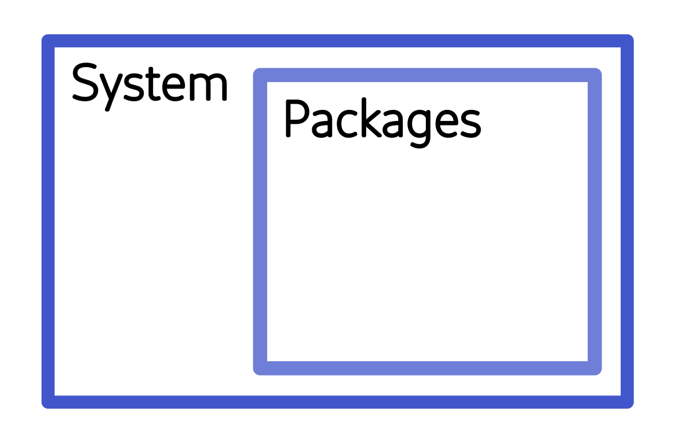

[](https://hpc.uni.lu) [](http://www.gnu.org/licenses/gpl-3.0.html) [](https://github.com/ULHPC/tutorials/issues/) [](https://github.com/ULHPC/tutorials/raw/devel/path/to/slides.pdf) [](https://github.com/ULHPC/tutorials/tree/devel/path/to/) [](http://ulhpc-tutorials.readthedocs.io/en/latest/path/to/) [](https://github.com/ULHPC/tutorials)

# An introduction to project environment management with Conda

> Copyright (c) 2023 UL HPC Team <hpc-sysadmins@uni.lu><br>
> Author: Georgios Kafanas

<!--
[](https://github.com/ULHPC/tutorials/raw/devel/path/to/slides.pdf)
-->

The objective of this tutorial is to cover the basics of package management with Conda. Conda environments can simultaneously install dependencies from multiple software distributions, such as Python and R. Package management systems native to distributions of Python, R, and Julia will also be covered to demonstrate how Conda can interface with such systems.

In this tutorial the users will learn to:

- use Conda environments to manage the software and package dependencies of projects,
- document and exchange Conda environment setups for reproducibility,
- determine which is the best environment management tool given the requirements of a project, and
- instal packages using the facilities available in R, Python, and Julia when these packages are not available in Conda.

---
## Pre-requisites

This tutorial focuses on generic aspects of package management. It is assumed that you have some basic knowledge of how to use packages in R or Python. The main package management framework used is Conda, although there will be mentions to tools native to R, Python, and Julia. You can use the techniques covered here both in your personal machine and on the UL HPC clusters. If you would like to setup environments in the UL HPC clusters, please ensure that you are able to [connect](https://hpc-docs.uni.lu/connect/access/) first.

---
## A brief introduction to Conda

You must be familiar with a few concepts to start working with Conda. In brief, these concepts are _package managers_ which are the programs used to create and manage environments, _channels_ which are the repositories that contain the packages from which environments are composed, and _distributions_ which are systems for shipping package managers.

### Package managers

Package managers are the programs that install and manage the Conda environments. There are multiple package managers, such as [`conda`](https://docs.conda.io/projects/conda/en/stable/), [`mamba`](https://mamba.readthedocs.io/en/latest/user_guide/mamba.html), and [`micromamba`](https://mamba.readthedocs.io/en/latest/user_guide/micromamba.html).

The UL HPC centre supports the use of [`micromamba`](https://mamba.readthedocs.io/en/latest/user_guide/micromamba.html) for the creation and management of personal Conda environments.

### Channels

Conda [channels](https://docs.conda.io/projects/conda/en/latest/user-guide/concepts/channels.html#what-is-a-conda-channel) are the locations where packages are stored. There are also multiple channels, with some important channels being:

- [`defaults`](https://repo.anaconda.com/pkgs/), the default channel,
- [`anaconda`](https://anaconda.org/anaconda), a mirror of the default channel,
- [`bioconda`](https://anaconda.org/bioconda), a distribution of bioinformatics software, and
- [`conda-forge`](https://anaconda.org/conda-forge), a community-led collection of recipes, build infrastructure, and distributions for the conda package manager.

The most useful channel that comes pre-installed in all distributions, is Conda-Forge. Channels are usually hosted in the [official Anaconda page](https://anaconda.org/), but in some rare occasions [custom channels](https://conda.io/projects/conda/en/latest/user-guide/tasks/create-custom-channels.html) may be used. For instance the [default channel](https://repo.anaconda.com/pkgs/) is hosted independently from the official Anaconda page. Many channels also maintain web pages with documentation both for their usage and for packages they distribute:

- [Default Conda channel](https://docs.anaconda.com/free/anaconda/reference/default-repositories/)
- [Bioconda](https://bioconda.github.io/)
- [Conda-Forge](https://conda-forge.org/)

### Distributions

Quite often, the package manager is not distributed on its own, but with a set of packages that are required for the package manager to work, or even with some additional packages that required for most applications. For instance, the `conda` package manager is distributed with the Miniconda and Anaconda distributions. Miniconda contains the bare minimum packages for the `conda` package manager to work, and Anaconda contains multiple commonly used packages and a graphical user interface. The relation between these distributions and the package manager is depicted in the following diagram.

[](images/Miniconda-vs-Anaconda.jpg)

The situation is similar for [Mamba](https://mamba.readthedocs.io/en/latest/index.html) distributions. Mamba distributions are supported by [Conda-Forge](https://github.com/conda-forge/miniforge), and their default installation options set-up `conda-forge` as the default and only channel during installation. The `defaults` or its mirror `anaconda` must be explicitly added if required. The distribution using the [Mamba](https://mamba.readthedocs.io/en/latest/user_guide/mamba.html) package manager was originally distributed as Mambaforge and was [recently renamed](https://github.com/conda-forge/miniforge#whats-the-difference-between-mambaforge-and-miniforge) to Miniforge. Miniforge comes with a minimal set of python packages required by the Mamba package manager. The distribution using the [Micromamba](https://mamba.readthedocs.io/en/latest/user_guide/micromamba.html) package manager ships no accompanying packages, as Micromamba is a standalone executable with no dependencies. Micromamba is using [`libmamba`](https://mamba.readthedocs.io/en/latest/index.html), a C++ library implementing the Conda API.

## The Micromamba package manager

[{: style="width:200px; margin-right:10px; float: left;"}](https://mamba.readthedocs.io/en/latest/index.html)

The [Micromaba](https://mamba.readthedocs.io/en/latest/user_guide/micromamba.html) package manager is a minimal yet fairly complete implementation of the Conda interface in C++, which is shipped as a standalone executable. The package manager operates strictly on the user-space and thus it requires no special permissions to install packages. It maintains all its files in a couple of places, so uninstalling the package manager itself is also easy. Finally, the package manager is also lightweight and fast.

UL HPC provides support _only_ for the Micromamba package manager.

### Installation

A complete guide regarding Micromamba installation can be found in the [official documentation](https://mamba.readthedocs.io/en/latest/micromamba-installation.html). To install micromamaba in the HPC clusters, log in to Aion or Iris. Working on a login node, run the installation script,
```bash
"${SHELL}" <(curl -L micro.mamba.pm/install.sh)
``` 
which will install the executable and setup the environment. There are 4 options to select during the installation of Micromamba:

- The directory for the installation of the binary file:
  ```
  Micromamba binary folder? [~/.local/bin]
  ```
  Leave empty and press enter to select the default displayed within brackets. Your `.bashrc` script should include `~/.local/bin` in the `$PATH` by default.
- The option to add to the environment autocomplete options for `micromamba`:
  ```
  Init shell (bash)? [Y/n]
  ```
  Press enter to select the default option `Y`. This will append a clearly marked section in the `.bashrc` shell. Do not forget to remove this section when uninstalling Micromamba.
- The option to configure the channels by adding conda-forge:
  ```
  Configure conda-forge? [Y/n]
  ```
  Press enter to select the default option `Y`. This will setup the `~/.condarc` file with `conda-forge` as the default channel. Note that Mamba and Micromamba will not use the `defaults` channel if it is not present in `~/.condarc` like `conda`.
- The option to select the directory where environment information and packages will be stored:
  ```
  Prefix location? [~/micromamba]
  ```
  Press enter to select the default option displayed within brackets.

To activate the new environment log-out and log-in again. You now can use `micromamba` in the login and compute nodes, including the auto-completion feature.

### Managing environments

As an example we consider the creation and use of an environment for R jobs. The command,
```bash
$ micromamba create --name R-project
```
creates an environment named `R-project`. The environment is activated with the command
```bash
$ micromamba activate R-project
```
anywhere in the file system.

Next, install the base R environment package that contains the R program, and any R packages required by the project. To install packages, first ensure that the `R-project` environment is active, and then install any package with the command
```bash
$ micromamba install <package_name>
```
all the required packages. Quite often, the channel where Conda should first look for the package must also be specified. Using the syntax
```bash
$ micromamba install --chanell <chanell_1> --channels <chanell_2> <package_name>
```
channels are listed in a series of `--channel <channel_name>` entries and the channels are searched in the order they appear. Using the syntax
```bash
$ micromamba install <chanell>::<package_name>
```
packages are searched in the specified channel only. Available packages can be found by searching the [conda-forge channel](https://anaconda.org/conda-forge).

For instance, the basic functionality of the R software environment is contained in the `r-base` package. Calling
```bash
micromamba install --channel conda-forge r-base
```
or
```bash
micromamba install conda-forge::r-base
```
will install all the components required to run standalone R scripts. More involved scripts use functionality defined in various packages. The R packages are prepended with a prefix 'r-'. Thus, `plm` becomes `r-plm` and so on. After all the required packages have been installed, the environment is ready for use.

Packages in the conda-forge channel come with instructions for their installation. Quite often the channel is specified in the installation instructions, `conda-forge::<package name>` or even `-c conda-forge` or `--channel conda-forge`. While the Micromamba installer sets-up `conda-forge` as the default channel, latter modification in `~/.condarc` may change the channel priority. Thus it is a good practice to explicitly specify the source channel when installing a package.

After work in an environment is complete, deactivate the environment,
```bash
$ micromamba deactivate
```
to ensure that it does not interfere with any other operations. In contrast to [modules](modules.md), Conda is designed to operate with a single environment active at a time. Create one environment for each project, and Conda will ensure that any package that is shared between multiple environments is installed once.

Micromamba supports almost all the subcommands of Conda. For more details see the [official documentation](https://mamba.readthedocs.io/en/latest/user_guide/micromamba.html).

### Using environments in submission scripts

Since all computationally heavy operations must be performed in compute nodes, Conda environments are also used in jobs submitted to the [queuing system](../slurm/index.md). You can activate and deactivate environment in various sections of your script.

Returning to the R example, a submission script running a single core R job can use the `R-project_name` environment as follows:
```
#SBATCH --job-name R-test-job
#SBATCH --nodes 1
#SBATCH --ntasks-per-node 1
#SBATCH --cpus-per-task 1
#SBATCH --time=0-02:00:00
#SBATCH --partition batch
#SBATCH --qos normal

micromamba activate R-project

echo "Launched at $(date)"
echo "Job ID: ${SLURM_JOBID}"
echo "Node list: ${SLURM_NODELIST}"
echo "Submit dir.: ${SLURM_SUBMIT_DIR}"
echo "Numb. of cores: ${SLURM_CPUS_PER_TASK}"

export SRUN_CPUS_PER_TASK="${SLURM_CPUS_PER_TASK}"
export OMP_NUM_THREADS=1
srun Rscript --no-save --no-restore script.R

micromamba deactivate
```

Environment activations in Conda are stacked, and unlike modules, only one environment is active at a time with the rest being pushed down the stack. Consider the following script excerpt.
```
# Initialization code

micromabma activate python-project

# Code to run a simulation and generate output with Python

micromabma activate R-project

# Code to perform statistical analysis and ploting with R

micromamba deactivate

# Code to save data with Python
```

These script creates the following environment stack.

```
(base)
|
| # No software is available here
|
+-(python-project) # micromabma activate python-project
| |
| | # Only Python is available here
| |
| +-(R-project) # micromabma activate R-project
| | |
| | | # Only R is available here
| | |
| +-+ # micromamba deactivate
| |
| | # Only Python is available here
| |
```

We can see that the Python environment (`python-project`) remains in the stack while the R environment (`R-project`) is active, and will be broght forth as soon as the R environment is deactivated.

_Useful scripting resources_

- [Formatting submission scripts for R (and other systems)](https://hpc-docs.uni.lu/slurm/launchers/#serial-task-script-launcher)

### Exporting and importing environment specifications

An important feature of Conda is that it allows you to export and version control you environment specifications, and recreate the environment on demand.

- A description of the software installed in the Conda environment can be exported on demand to a text file.
- In turn, a specification file can be used to populate a new environment, in effect recreating the environment.

The environment reproducibility is particularly important when you want to have reproducible results, like for instance in a scientific simulation. You can setup and test your application in your local machine, save the environment, and later load the environment in an HPC system, and be sure that the application will behave identically. Conda in the background will ensure that identical packages will be installed.

In Micromaba, you can export the specifications of an environment using the command:
```bash
$ micromaba env export --name <environment name>
```
By default the command prints to the standard output, but you can redirect the output to a file:
```bash
$ micromaba env export --name <environment name> > <environment name>.yaml
```
To recreate an environment from a specification file, pass the file as argument to the create command with the `--file` flag:
```bash
$ micromamba env create --name <environment name> --file <environment name>.yaml
```
This workflow demonstrates the use of simple text files to store specifications, but Micormamba supports various specification file types. All specification files are text files and can be version controlled with a tool such as Git.

_Sources_

- [Micromamba User Guide: Specification files](https://mamba.readthedocs.io/en/latest/user_guide/micromamba.html#specification-files)

### Example: Installing Jupyter and managing the dependencies of a notebook with Micromamba

In this example we will create an environment, install Jupyter, and install all the dependencies for our notebooks with Micromamba. Start by creating an environment:
```
micromamba env create --name jupyter
```
Next, install Jupyter in the environment. Have a look at the page for [`jupyterlab`](https://anaconda.org/conda-forge/jupyterlab) in the conda-forge channel. To install it in your environment call:
```
micromamba install --name jupyter conda-forge::jupyterlab
```
Now activate the environment, create a working directory for your notebooks, and launch Jypyter:
```
micromamba activate jupyter
mkdir ~/Documents/notebooks && cd ~/Documents/notebooks
jupyter lab
```
If a webpage appears with the Jupyter lab, the installation worked succeeded!

You may need some Python package in your Jupyter notebook. You can make packages available in your notebook by installing the appropriate package in the Conda environment. For instance, assume that you need `pandas` and `numpy`. Searching the conda-forge channel, we can find the package name and installation instruction. With the `jupyter` environment active, run the command:
```
micromamba install conda-forge::numpy conda-forge::pandas
```
You should now be able to import `numpy` and `pandas` in your notebook!

After completing your work, close down the notebook with the command `C-c`, and deactivate the `jupyter` Conda environment:
```
micromamba deactive
```
You should now be in your normal operating system environment.

## Self management of work environments in UL HPC with Conda

Conda is one of the systems for providing software in UL HPC systems, along with [modules](modules.md) and [containers](../../containers/). When starting a new project it is important to select the appropriate system.

Before installing any software yourself in user space you should contact the ULHPC High Level Support Team in the [service portal](https://service.uni.lu/sp?id=index) [Home > Research > HPC > Software environment > Request expertise] to check if we can install the software in our system. A system wide installation will not consume any of your storage quota, and it will be configured and tested to provide optimal efficiency.

### When a Conda environment is useful

There are three aspects of environment management that you should consider when selecting the method with which you will manage your software.

- **Ease of use:** Many software systems whose performance is not critical and are used by relatively few users are not provided though the standard distribution channels of modules or containers. In such cases the easiest installation option is a user side installation with Conda or some similar package management system.

- **Reproducibility:** Conda and containers can both create reproducible environments, with descriptions of the environment exported and version controlled in text files. However, containers require significant amount of manual configuration to create a reproducible environment and to perform well in a wide range of systems. If your aim is an easily reproducible environment Conda is the superior choice.

- **Performance:** Conda provides precompiled executables. Even thought multiple configurations are supported, you will not always find an executable tailored to your target system. Modules and containers provided by UL UPC are optimized to ensure performance and stability in our systems, so prefer them.

### Storage limitations in UL HPC

Regardless of installation method, _when you install software in user space you are using up your storage quota_. Conda environment managers download and store a sizable amount of data to provided packages to the various environments. Even though the package data are shared between the various environments, they still consume space in your or your project's account. There are [limits in the storage space and number of files](../../filesystems/quotas/#current-usage) that are available to projects and users in the cluster. Since Conda packages are self managed, _you need to clean unused data yourself_.

### Cleaning up package data

There are two main sources of unused data, compressed archives of packages that Conda stores in its cache when downloading a new package, and data of packages no longer used in any environment. All unused data in Micromoamba can be removed with the command
```bash
micromamba clean --all --yes
```
where the flag `--yes` suppresses an interactive dialogue with details about the operations performed. In general you can use the default options with `--yes`, unless you have manually edited any files in you package data directory (default location `~/micromamba`) and you would like to preserve your changes.

**Updating environments to remove old package versions**

As we create new environments, we often install the latest version of each package. However, if the environments are not updated regularly, we may end up with different versions of the same package across multiple environments. If we have the same version of a package installed in all environments, we can save space by removing unused older versions.

To update a package across all environments, use the command
```bash
for e in $(micromamba env list | awk 'FNR>2 {print $1}'); do micromamba update --yes --name $e <package name>; done
```
and to update all packages across all environments
```bash
for e in $(micromamba env list | awk 'FNR>2 {print $1}'); do micromamba update --yes --name $e --all; done
```
where `FNR>2` removes the headers in the output of `micromamba env list`, and is thus sensitive to changes in the user interface of Micromamba.

After updating packages, the `clean` command can be called to removed the data of unused older package versions.

_Sources_

- [Oficial Conda `clean` documentation](https://docs.conda.io/projects/conda/en/latest/commands/clean.html)
- [Understanding Conda `clean`](https://stackoverflow.com/questions/51960539/where-does-conda-clean-remove-packages-from)

### A note about internal workings of Conda

In general, Conda packages are stored in a central directory, and hard links are created in the library directories of any environment that requires the package. Since hard links do not consume space and inodes, Conda is very efficient in its usage of storage space.

Consider for instance the MPFR package used in some environment `gaussian_regression`. Looking into the Conda installation managed by Micromamba, these are the installed library files:
```
gkaf@ulhpc-laptop:~/micromamba$ ls -lahFi pkgs/mpfr-4.2.1-h9458935_0/lib/
total 1.3M
5286432 drwxr-xr-x 1 gkaf gkaf   94 Oct 25 13:59 ./
5286426 drwxr-xr-x 1 gkaf gkaf   38 Oct 25 13:59 ../
5286436 lrwxrwxrwx 1 gkaf gkaf   16 Oct 22 21:47 libmpfr.so -> libmpfr.so.6.2.1*
5286441 lrwxrwxrwx 1 gkaf gkaf   16 Oct 22 21:47 libmpfr.so.6 -> libmpfr.so.6.2.1*
5286433 -rwxrwxr-x 7 gkaf gkaf 1.3M Oct 22 21:47 libmpfr.so.6.2.1*
5286442 drwxr-xr-x 1 gkaf gkaf   14 Oct 25 13:59 pkgconfig/
```
Looking into the libraries of the `gaussian_regression` environment, there is a hard link to the MPFR library:
```
gkaf@ulhpc-laptop:~/micromamba$ ls -lahFi envs/gaussian_regression/lib/libmpfr.so.6.2.1 
5286433 -rwxrwxr-x 7 gkaf gkaf 1.3M Oct 22 21:47 envs/gaussian_regression/lib/libmpfr.so.6.2.1*
```
You can use the `-i` flag in `ls` to print the inode number of a file. Hard links have the same inode number, meaning that they are essentially the same file.

Conda will not automatically check if the files in the `pkgs` directories must be removed. For instance, when you uninstall a package from an environment, when you delete an environment, or when a package is updated in an environment, only the hard link in the environment directory will change. The files in `pkgs` will remain even if they are no longer used in any environment. The relevant `clean` routines check which packages are actually used and remove the unused files.

---

## Environment management best practices

Environment management systems are diverse but support a simple common set of features, which are:

- the ability to create and reproduce software environments,
- isolation between environments and between each environment and the system, and
- easy access to multiple sources of software packages.

The environment of a software system can be categorized in 2 components,

- the _system_ comprising of installed software components and environment settings, and
- the _packages_ added to various software components of the environment.

The system is a superset of the packages in the environment, however, it makes sense to consider them separately as many software distributions provide native managers for the packages they ship.

[](images/environment_management.png)

_Environment management_ systems usually focus on the management of the system, installing software, setting environment variables and so on. _Package management_ systems on the other hand usually focus on managing the packages installed for some specific software component. The distinction albeit useful is not always clear, and usually environment managers that can also manage the packages of some software systems.

Furthermore, both _environment_ and _package_ management systems can be further subdivided according to the extend of the target environment. The management systems can target

- the whole system (_system environment management tools_), or
- the environment within a single project directory (_project environment management tools_).

All _project environment management tools_ and most _system environment management tools_ provide methods to

- store the environment setup in a text file that can be version controlled, and
- to recreate the environment from the description in the text file.

The _project environment management tools_ in particular often automate the function of updating the text file describing the environment in order to automatically initialize the environment when initializing a new instance of the project. Thus project environments are very useful in storing a distributing research projects, since they automate the reproducibility of the project setup.

The overarching theory for environment management tools such as Conda is simple. However, there are implementation details which affect how environment management tools are used. In the following section we present some case studies about practical issues you may encounter with few environment management tools. 

### Using `pip` for Python package management

The official package installer for Python is [`pip`](https://pypi.org/project/pip/). You can use pip to install packages from the Python Package Index (PyPI) and other indexes. With `pip` you can install packages in 3 modes,

- system-wide installation, where a package is available to all users,
- user-wide installation, where a package are installed in a special directory in the user home directory and are available to the user only, and
- environment installation where a package is only available inside the environment where it was installed.

Python is now part of many Linux distributions, such as [Debian](https://wiki.debian.org/Python). This means now that users cannot (or should not) install packages system-wide using `pip`. User-wide and `venv` environment installations are still possible though.

To install a package user-wide use the command:
```
$ pip install --user <package_name>
```
User-wide installations install packages in a directory at the users home directory. Python searches for packages in the user installation path first. This packages are meant to be installed with the system Python and run without root privileges. Thus user-wide installation are more appropriate extend the system functionality for a single user.

For most applications, functionality should be installed in a virtual environment. To use a `venv` environment, first initialize the environment in some directory. The official distribution of Python comes packaged with the `venv` module that can create a virtual environment with the command:
```
$ python -m venv <path_to_directory>
```
You activate the environment with
```
$ source <path_to_directory>/bin/activate
```
and deactivate with:
```
$ deactivate
```
When the environment is active, you can install packages with the command:
```
$ pip install <package_name>
```
This is the same command installing packages system-wide, but because the environment is active the package is installed in the environment directory.

The `pip` package manager also provides the functionality required to export environment setups in text files and recreate environments from a text file description of the environment setup. To export the environment, activate the environment and use the `freeze` command:
```
$ source <path_to_directory>/bin/activate
(<environment name>) $ pip freeze > <environment name>.yml
```
To recreate the environment, create an empty environment,
```
python -m venv ~/environments/<environment name>
```
activate the environment,
```
source ~/environments/<environment name>/bin/activate
```
and install all the required packages from the requirement file:
```
(<environment name>) $ pip install --requirement /path/to/<environment name>.yml
```

When managing an environment, it is often required to upgrade a package to access new functionality or fix a bug. To upgrade a package with `pip`, simply install/reinstall the package with the `--upgrade` flag:
```
(<environment name>) $ pip install --upgrade <package name>
```
Note that in Python environments managed with `pip`, you have to update each package individually. Package management can thus be quote laborious, but there are some methods to speed up the process.

With all the features that `pip` provides, it is a very attractive method for creating and managing environments. However, is often necessary even when you are managing your environments with `pip`!

#### Creating a `venv` environment with Python installed in a Conda environment

In most distributions `venv` comes packages together with python, however, in some distributions `venv` is provided as an independent package. In Debian for instance, the system Python package, `python3`,  does not contain the `venv` module. The module is distributed through the `python3-venv` package. You may want to avoid using the system package for a variety of reasons:

- The PyPI package you want to install may require a version of Python that is not provided by your system.
- You may be in a constrained system where installing a package such as `python3-venv` is not possible, either because you don't have the rights, or because you are working with some high performance computer where installing a package required installing the package in hundreds of machines.
- You may not want to pollute your system installation. In accordance to the UNIX philosophy use the system ensures that your machine operates correctly, and use the Conda to run the latest application!

The trick is to install a version of Python in a Conda environment, and use the Python installed in the Conda environment to create `venv` environments. Start by creating a python environment with the required version for python. For instance:
```
$ micromamba env create --name <environment name>-python
$ micromamba install --name <environment name>-python conda-forge::python
```
The Python distribution from conda-forge comes with `venv` installed. Use `venv` to create your virtual environment:
```
$ micromamba run --name <environment name>-python python -m venv ~/environments/<environment name>
```
It is a good idea to use some standard location to install global environments; a good choice is some directory in your home directory such as:
```
~/environments
```
Now an environment has been installed with the required version of python.

Any other tool requires the activation of the Conda environment before you are able to activate an environment created by an internal tool, such as `venv`. In fact, you can activate your `venv` as follows:
```
$ micromaba activate <environment name>-python
(<environment name>-python) $ source ~/environments/<environment name>/bin/activate
(<environment name>) (<environment name>-python) $
```
However, activating the Conda environment is redundant with a `venv` environment. Yow you can activate the environment simply with:
```
source ~/environments/<environment name>/bin/active
(<environment name>) $
```

After creating a `venv` environment you no longer need to interact with the Conda environment, `<environment name>-python`, except for updating Python itself. This is because `pip` environments are completely isolated from the system, except for the Python executable. If you browse the environment definition file,
```
$ cat ~/environments/<environment name>/pyvenv.cfg
home = /home/gkaf/micromamba/envs/<environment name>-python/bin
include-system-site-packages = false
version = 3.8.18
```
you can see that system package usage is disabled by default, with the option `include-system-site-packages = false`. Also, note that the binary directory of the Conda environment that provides the Python executable is noted in the `home` entry. This is important, as the only package that `pip` cannot install is python itself. The python executable is selected the environment is created with the command:
```
$ python -m venv ~/environments/<environment name>
```
In fact, listing the contents of `~/environments/<environment name>/bin`, there are the symbolic links
```
python -> /home/gkaf/micromamba/envs/<environmen name>-python/bin/python
python3 -> python
```
that point to the Python installed in our Conda environment. Every other executable and library package installed in our environment, is installed locally, and as the options `include-system-site-packages = false` suggests, it will shadow any other package in the Conda environment.

### Combining Conda with other package and environment management tools

Quite often Conda is used as the environment management framework and other tools are used for package management. There are a few reasons why you may want to manage packages with different tools.

- You may want to use a project environment management tool. For instance, you may install Python with Cond and use project environments managed with [Virtualenv](https://virtualenv.pypa.io/en/latest/), [Pipenv](https://pipenv.pypa.io/en/latest) and [Poetry](https://python-poetry.org/). In the case of R you may install R with Conda and manage project environments with [Packrat](https://rstudio.github.io/packrat/). 

- In some cases packages are not available through Conda, but they may be available through other source code or binary distributions. A typical example is Julia where packages are only available trough the [Pkg](https://pkgdocs.julialang.org/v1/) package manager.

A list of case studies follows. In these case studies you can find how Conda and other package managers can be combined to install software.

#### Combining Conda with `pip` to install a Python package

In this example `pip` is used to manage packages in a Conda environment with [MkDocs](https://www.mkdocs.org/) related packages. To install the packages, create an environment
```bash
micromamba env create --name mkdocs
```
activate the environment,
```bash
micromamba activate mkdocs
```
and install `pip`
```bash
micromamba install --channel conda-forge pip
```
which will be used to install the remaining packages.

The `pip` will be the only package that will be managed with Conda. For instance, to update Pip activate the environment,
```bash
micromamba activate mkdocs
```
and run
```bash
micromaba update --all
```
to update all installed packaged (only `pip` in our case). All other packages are managed by `pip`.

For instance, assume that a `mkdocs` project requires the following packages:

- `mkdocs`
- `mkdocs-minify-plugin`

The package `mkdocs-minify-plugin` is less popular and thus is is not available though a Conda channel, but it is available in PyPI. To install it, activate the `mkdocs` environment
```bash
micromamba activate mkdocs
```
and install the required packages with `pip`
```bash
pip install --upgrade mkdocs mkdocs-minify-plugin
```
inside the environment. The packages will be installed inside a directory that `micromamba` created for the Conda environment, for instance
```
${HOME}/micromamba/envs/mkdocs
```
along side packages installed by `micromamba`. As a results, 'system-wide' installations with `pip` inside a Conda environment do not interfere with system packages.

**Do not install packages in Conda environments with pip as a user:** User installed packages (e.g.`pip install --user --upgrade mkdocs-minify-plugin`) are installed in the same directory for all environments, typically in `~/.local/`, and can interfere with other versions of the same package installed from other Conda environments.

#### Combining Conda with `pip` to install a Python source package

Let's consider the installation of the [PySPQR](https://github.com/yig/PySPQR) module that wraps the SuiteSparseQR decomposition function for use with SciPy. Installing this software is challenging because

- the PySPQR package is not available through Conda channels, and
- installing PySPQR (`sparseqr`) directly in a `venv` fails. 


The PySPQR package is a source code package and its installation in a `venv` requires linking with the [SuiteSparse](https://people.engr.tamu.edu/davis/suitesparse.html) library. We can install SparseSuite in our system (e.g. `apt-get install libsuitesparse-dev` in Debian), but we will avoid modifying system libraries and use a Conda environment instead.

A Conda environment is a directory with packages where you can install anything you need with a compatible package manager like Micromamba. Create an environment with all the required dependencies:
```
$ micromamba env create --name python-suitesparse
$ micromamba install conda-forge::python conda-forge::suitesparse --name python-suitesparse
```

The package `conda-forge::suitesparse` is effectively what `apt-get install libsuitesparse-dev` installs globally in a Deabian based system, but now it is only available in the Conda environment `python-suitesparse`.

You are not going to use `python-suitesparse` directly though! You will use the Python installed in `python-suitesparse` to create a venv where you will install `sparseqr`.

Create a venv with the Python of `python-suitesparse` like this:
```
$ micromamba run --name python-suitesparse python -m venv ~/environments/PySPQR
```
This will create a venv in `~/environments/PySPQR`, and since it is created with the python of the `python-suitesparse` Conda environment, SuiteSparse is now available inside the environment.

Activate your new environment, and install `sparseqr` with any method you prefer, I have chosen to use the PyPI repo:
```
$ source ~/environments/PySPQR/bin/activate
(PySPQR) $ pip install --upgrade setuptools sparseqr
(PySPQR) $ python
>>> import sparseqr
```
Note that `setuptools` is also required and must be installed manually in a venv since PySPQR is a source package.

**N.B.** When installing source packages from PyPI ensure that `setuptools` is available in your environment. The `setuptools` library is used to package Python projects, and it is required by source packages to build the source code.

After the first Python `import` command, your package should compile successfully. After that, the package should be available for import without the need to compile again.

For future use activate the `venv` environment with
```
$ source ~/environments/PySPQR/bin/activate
```
and deactivate with
```
(PySPQR) $ deactivate
```

<!--

Conda can be used as an environment manager and combined with other package management tools to install packages. For instance, you can install Python in an environment with Conda, and manage packages in the environment with [PiPY](https://pip.pypa.io/en/stable/getting-started/), or create subenvironments with project package management tools such as  Let's see a few examples.

### Software installation in Python environments

Python packages are available through Conda channels. However, many channels, are only available through PyPI (the Python Package Index). You have 2 options regarding the installation of packaged from PyPI,

- install directly in the Micromamba environments, or
- install in an isolated "Python virtual environment" (`venv`).

`add ReachabilityAnalysis, ModelingToolkit`

#### Installing Conda inside a Micromamba environment


## Combining Conda with other package and environment management tools

It may be desirable to use Conda to manage environments but a different tool to manage packages, such as [`pip`](https://pip.pypa.io/en/stable/getting-started/).

Conda integrates well with any such tool. Some of the most frequent cases are described bellow.

### Managing packages with external tools

Quite often a package that is required in an environment is not available through a Conda channel, but it is available through some other distribution channel, such as the [Python Package Index (PyPI)](https://pypi.org/). In these cases the only solution is to create a Conda environment and install the required packages with `pip` from the Python Package Index.

Using an external packaging tool is possible because of the method that Conda uses to install packages. Conda installs package versions in a central directory (e.g. `~/micromamba/pkgs`). Any environment that requires a package links to the central directory with _hard links_. Links are added to the home directory (e.g. `~/micromamba/envs/R-project` for the `R-project` environment) of any environment that requires them. When using an external package tool, package components are installed in the same directory where Conda would install the corresponding link. Thus, external package management tools integrate seamlessly with Conda, with a couple of caveats:

- each package must be managed by one tool, otherwise package components will get overwritten, and
- packages installed by the package tool are specific to an environment and cannot be shared as with Conda, since components are installed directly and not with links.

**Prefer Conda over external package managers:** Installing the same package in multiple environments with an external package tool consumes quotas in terms of [storage space and number of files](../../filesystems/quotas/#current-usage), so prefer Conda when possible. This is particularly important for the `inode` limit, since some packages install a large number of files, and the hard links used by Conda do not consume inodes or [disk space](https://stackoverflow.com/questions/55566419/why-are-packages-installed-rather-than-just-linked-to-a-specific-environment).

#### Pip

In this example `pip` is used to manage packages in a Conda environment with [MkDocs](https://www.mkdocs.org/) related packages. To install the packages, create an environment
```bash
micromamba env create --name mkdocs
```
activate the environment,
```bash
micromamba activate mkdocs
```
and install `pip`
```bash
micromamba install --channel conda-forge pip
```
which will be used to install the remaining packages.

The `pip` will be the only package that will be managed with Conda. For instance, to update Pip activate the environment,
```bash
micromamba activate mkdocs
```
and run
```bash
micromaba update --all
```
to update all installed packaged (only `pip` in our case). All other packages are managed by `pip`.

For instance, assume that a `mkdocs` project requires the following packages:

- `mkdocs`
- `mkdocs-minify-plugin`

The package `mkdocs-minify-plugin` is less popular and thus is is not available though a Conda channel, but it is available in PyPI. To install it, activate the `mkdocs` environment
```bash
micromamba activate mkdocs
```
and install the required packages with `pip`
```bash
pip install --upgrade mkdocs mkdocs-minify-plugin
```
inside the environment. The packages will be installed inside a directory that `micromamba` created for the Conda environment, for instance
```
${HOME}/micromamba/envs/mkdocs
```
along side packages installed by `micromamba`. As a results, 'system-wide' installations with `pip` inside a Conda environment do not interfere with system packages.

**Do not install packages in Conda environments with pip as a user:** User installed packages (e.g.`pip install --user --upgrade mkdocs-minify-plugin`) are installed in the same directory for all environments, typically in `~/.local/`, and can interfere with other versions of the same package installed from other Conda environments.

#### Pkg

The Julia programming language provides its own package and environment manager, Pkg. The package manager of Julia provides many useful capabilities and it is recommended that it is used with Julia projects. Details about the use of Pkg can be found in the official [documentation](https://pkgdocs.julialang.org/v1/).

The Pkg package manager comes packages with Julia. Start by creating an environment,
```bash
mocromamba env create --name julia
```
activate the environment,
```bash
micromamba activate julia
```
and install Julia,
```bash
micromamba install --channel conda-forge julia
```
to start using Pkg.

In order to install a Julia package, activate the Julia environment, and start an interactive REPL session,
```bash
$ julia
julia>
```
by just calling `julia` without any input files.

- Enter the Pkg package manager by pressing `]`.
- Exit the package manager by clearing all the input from the line with backspace, and then pressing backspace one more time.

In the package manager you can see the status of the current environment,
```julia
(@julia) pkg> status
Status `~/micromamba/envs/julia/share/julia/environments/julia/Project.toml` (empty project)
```
add or remove packages,
```julia
(@julia) pkg> add Example
(@julia) pkg> remove Example
```
update the packages in the environment,
```julia
(@julia) pkg> update
```
and perform many other operations, such as exporting and importing environments from plain text files which describe the environment setup, and pinning packages to specific versions. The Pkg package manager maintains a global environment, but also supports the creation and use of local environments that are used within a project directory. The use of local environments is highly recommended, please read the [documentation](https://pkgdocs.julialang.org/v1/environments/) for more information.

After installing the Julia language in a Conda environment, the language distribution itself should be managed with `micromamba` and all packages in global or local environments with the Pkg package manager. To update Julia activate the Conda environment where Julia is stored and call
```bash
micromamba update julia
```
where as to update packages installed with Pgk use the `update` command of Pkg. The packages for local and global environments are stored in the Julia installation directory, typically
```
${HOME}/micromamba/envs/julia/share
```
if the default location for the Micromamba environment directory is used.

_Useful resources_

- [Pkg documentation](https://pkgdocs.julialang.org/v1/)

**Advanced management of package data**

Julia packages will consume [storage and number of files quota](../../filesystems/quotas/#current-usage). Pkg uses automatic garbage collection to cleanup packages that are no longer is use. In general you don't need to manage then package data, simply remove the package and its data will be deleted automatically after some time. However, when you exceed your quota you need to delete files immediately.

The _immediate removal_ of the data of uninstalled packages can be forced with the command:
```julia
using Pkg
using Dates
Pkg.gc(;collect_delay=Dates.Day(0))
```
Make sure that the packages have been removed from all the environments that use them

_Sources_: [Immediate package data clean up](https://discourse.julialang.org/t/packages-clean-up-general-julia-data-consumption/56198)

### Combining Conda with external environment management tools

Quite often it is required to create isolated environments using external tools. For instance, tools such as [`virtualenv`](https://virtualenv.pypa.io/en/latest/) can install and manage a Python distribution in a given directory and export and import environment descriptions from text files. This functionalities allows for instance the shipping of a description of the Python environment as part of a project. Higher level tools such as [`pipenv`](https://pipenv.pypa.io/en/latest) automate the process by managing the Python environment as part of a project directory. The description of the environment is stored in version controlled files, and the Python packages are stored in a non-tracked directory within the project directory. Some wholistic project management tools, such as [`poetry`](https://python-poetry.org/), further integrate the management of the Python environment withing the project management workflow.

Installing and using in Conda environments tools that create isolated environments is relatively straight forward. Create an environment where only the required that tool is installed, and manage any subenvironments using the installed tool.

**Create a different environment for each tool:** While this is not a requirement it is a good practice. For instance, `pipenv` and `poetry` used to and may still have conflicting dependencies; Conda detects the dependency and aborts the conflicting installation.

#### Pipenv

To demonstrate the usage of `pipenv`, create a Conda environment,
```bash
micromamba enc create --name pipenv
```
activate it
```bash
micromamba activate pipenv
```
and install the `pipenv` package
```bash
micromamba install --channel conda-forge pipenv
```
 as the only package in this environment. Now the `pipenv` is managed with Conda, for instance to update `pipenv` activate the environment
```bash
micromamba activate pipenv
```
and call
```bash
micromamba update --all
```
to update the single installed package. Inside the environment use `pipenv` as usual to create and manage project environments.


---

### When a Conda environment is useful


The environment of a project is composed by 2 components,

- the _system environment components_ such as software and environment variables, and
- the _packages_ required by the various software systems of the environment.

For instance, assume that you have a project with R scripts that need some R packages and you manage the project with Packrat. Then,

- the installation of R and various environment variables are the project environment, and
- the packages installed and managed with Packrat are the packages of the project.

In this case Packrat manages the packages of the project, and the system manages the environment, most importantly the version of R.

**Mixing environment and package management:** Some tools, especially in Python, partially mix the functionality of environment and package management. For instance, in a project with Python scripts where the packages are managed by `venv`, due to the design of Python some environment variables must be setup by `venv` so that Python can detect the local packages. For this reason, users have to activate a `venv` environment to access local packages, something not required by Packrat in R. However, `venv` is not a full environment manager as it cannot modify some important aspects of the environment, such as the Python installation.

Conda environments are able to manage both the project environment, and the project packages. It is left to the user to chose what components they will mange with Conda and what with native tools. For instance, the user may choose to manage the R version with Conda and packages with Packrat.

Given that using Conda adds a layer of complexity in the management of your software stack, there are 2 cases that justify the extra work of using Conda.

- The first case is when a software system is only available through Conda, and not as a module or container.
- The second case is when there are multiple software systems in a project and it is more convenient to handle all project packages with a single tool instead of multiple native tools.
-->

<!--
- The first reason is when the packages of a project require a version of a software system (e.g. R, Python, or Julia) that is not available through a module or a container. For instance, a Python package may require Python>=3.10.x but only version 3.8.x is available.
- The second reason is when there are multiple software systems in a project (e.g. Python and R) and it is more convenient to handle all project packages with a single tool instead of multiple native tools. For instance a project with Python and R scripts needs both venv and Packrat to handle packages.
-->

<!--
## Conda as an environment manager

Conda is the preferred method to install software system when they are not available though the conventional channels of modules and containers. These are a few typical cases where you may consider using a Conda environment.

- A software system is not available through modules or containers. In this case install the software system through Conda.
- A software system is available, but not in a version required by a dependency. For instance, a Python package may require Python>=3.10.x but only version 3.8.x is available. In this case install the required version through Conda.
- A dependency is available only through a native package manager, but the required package manager version is not supported by the environments offered through modules or containers. In this case setup the required environment with Conda.

### Conda as a package manager

Conda is a very capable package manager. A particular attractive feature of Conda is that it can handle dependencies from multiple software systems in the same environment. For instance in a project using Python and R and it can be more convenient to handle all project packages with Conda instead of multiple native tools, such as venv for Python and Packrat for R.

If you plan to use Conda just to manage packages, you may also consider using a native package management tool. In some cases more packages are distributed with native tools.

- In Julia all packages are distributed _only_ through the native package manager Pkg.
- In Python most packages are distributed through Conda, but a few nice packages are available through the native package manager Pip only.
- In R all packages are available through Conda; just append the prefix `r-` to the name of the package.

Some native package mangers offer useful features, such as setting up isolated environments inside a project directory. Project environments automatically trace dependencies in a text file inside the project directory. This allow easy version control of the dependencies. Tools that offer automatic dependency logging include

- Packrat for R,
- venv (partially automated), pipenv, and poetry for Python, and
- Pgk for Julia.

Conda can log dependencies too. However, the process is manual, as Conda is not designed to maintain an environment inside a project directory.


## Overview of environment and package management

This overview discusses R and Python package management. These 2 software systems follow a somewhat different approach in the organization of their package management. R provides its own package management utilities that are strictly used for managing packages and avoid modifying the environment. On the other hand the package management utilities of Python often modify the environment as well. While the approach of R is much cleaner and easier to follow, the approach of Python significantly simplifies some package management operations. Conda further expands on the approach used by Python by seamlessly integrating the environment and package management.

### Installing the R and Python software systems

In the ULHPC systems, R and Python are provided as [modules](../cli/modules.md). In many Linux distributions R is provided as a [package](https://cran.r-project.org/). Python is also available as a package in many distributions, however, in many distributions Python is now a core package. Various other packages in the distribution depend on the Python core package, which implies that

- the system is limited in the versions of Python shipped by the distribution, and
- packages are managed only by the distribution package manager; using any external Python package manager can break the system!

To avoid the limitations of the package manager of you distribution, you can always use an autonomous environment manager such as Conda to install the R and Python software systems. An additional advantage of using an environment manager is that you can use the exact same software distribution in your local machine, the HPC system, and any other computer.

### Managing packages in R

The R program has a built-in package manager. Assuming that you have access to an installation of R, the R system contains 2 utilities that allow the installation of packages in 3 different modes. First, there is the built-in package manager that can instal packages

- in system wide accessible locations for packages that should be available to all users (requires elevated privileges), or
- in user specific location for packages that are accessible to the current user only.

There are default locations where the built-in package manager searches for packages. The user specific locations take precedence over system locations. The package manager search path can be extended by the user to include bespoke locations. There is also the Packrat package manager which installs packages

- in project directories, with the packages being available in an environment isolated within the project directory.

The Packrat package manager is available as an R package. When creating an environment within a project directory, the environment is activated automatically when starting R in the project directory (but not in its subdirectories due to the implementation of Packrat).

In your local system you can install packages in any mode. In the HPC systems, you can only install packages in the user accessible location, so you are limited to user and project wide installations. Nevertheless, the HPC installation of R includes a number of commonly used packages, such as `dbplyr` and `tidyverse`. You should check if the package you require is installed and that the installed version provides the functionality you need before installing any packages locally. Remember, local package installations consume space and inodes against personal or project quota.

#### Installing R packages locally and globally

Be default R installs packages system wide. When R detects that it does not have write access to the system directories it suggests installing packages for the current user only.

Start and interactive session and then load the R module and start R:
```bash
$ module load lang/R
$ R
```
You can list the directories where R is installing and looking for new packages using the function `.libPaths()`
```R
> .libPaths()
[1] "/mnt/irisgpfs/apps/resif/aion/2020b/epyc/software/R/4.0.5-foss-2020b/lib64/R/library"
```
If you haven't installed any libraries, only the system path appears in the path where R is looking for libraries. Now, try installing for instance the Packrat package globally with the `install.packages` command.
```R
> install.packages(c("packrat"))
Warning in install.packages(c("packrat")) :
  'lib = "/mnt/irisgpfs/apps/resif/aion/2020b/epyc/software/R/4.0.5-foss-2020b/lib64/R/library"' is not writable
Would you like to use a personal library instead? (yes/No/cancel) yes
Would you like to create a personal library
‘~/R/x86_64-pc-linux-gnu-library/4.0’
to install packages into? (yes/No/cancel) yes
--- Please select a CRAN mirror for use in this session ---
Secure CRAN mirrors
```
Select any mirror apart from `1: 0-Cloud [https]`; usually mirrors closer to your physical location will provide better bandwidth. After selecting a mirror the download and installation of the package proceeds automatically.

Note that after failing to install the package in the system directory, R creates an installation directory for the user in their home directory `~/R/x86_64-pc-linux-gnu-library/4.0` and installs the package for the user only. After the installation, you can check the path where R is looking for packages again.
```R
> .libPaths()
[1] "/mnt/irisgpfs/users/<user name>/R/x86_64-pc-linux-gnu-library/4.0"
[2] "/mnt/irisgpfs/apps/resif/aion/2020b/epyc/software/R/4.0.5-foss-2020b/lib64/R/library"
```
Now R will look for packages in the user directory first (`/mnt/irisgpfs` is another path for `/home` that appears in the `${HOME}` variable). Note by the naming convention that R uses when it creates the directory for installing user packages, you can have multiple minor versions of R installed, and their packages will not interfere with each other. For instance,

- R version 4.0.5 installs packages in `~/R/x86_64-pc-linux-gnu-library/4.0`, and
- R version 4.3.2 installs packages in `~/R/x86_64-pc-linux-gnu-library/4.3`.

Some useful commands for managing packages are,

- `installed.packages()` to list installed packages and various information regarding each package installation,
- `old.packages()` to list outdated packages,
- `update.packages()` to update installed packages, and
- `remove.packages(c("packrat"))` to remove packages.

To list the loaded packages, use the command
```R
search()
```
and to get a detailed description of the environment, use the command
```R
sessionInfo()
```
which provides information about the version of R, the OS, and loaded packages.

To load a library that has been installed use the command `library`. For instance,
```R
library(packrat)
```
where you cam notice that the use of quotes is optional and only a single can be loaded at a time. The `library` function causes an error when the loading of a package fails, so R provides the function `require` which returns the status of the package loading operation in a return variable, and is design for use inside R functions.

_Useful resources_

- [R Packages: A Beginner's Tutorial](https://www.datacamp.com/tutorial/r-packages-guide)
- [Efficient R programming: Efficient set-up](https://bookdown.org/csgillespie/efficientR/set-up.html)

#### Configuring installation paths in R

So far we have only used the default installation paths of R. However, in a local installation where the user has rights to install in the system directories (e.g. in a Conda environment with R) the user installation directory is not created automatically. Open an R session in an interactive session in the HPC cluster or in your personal machine. To get the location where user packages are installed call
```R
> Sys.getenv("R_LIBS_USER")
[1] "/home/<user name>/R/x86_64-conda-linux-gnu-library/4.3"
```
which will print an environment variable, `R_LIBS_USER`, which is set by R and stores the default location for storing user packages. If you create the directory with
```bash
$ mkdir -p /home/<user name>/R/x86_64-conda-linux-gnu-library/4.3
```
then you can print the locations where R is searching for packages (after reloading R), and the default location should appear first in the list. For instance for o Conda installation of R using the Micromamba package manager, the paths printed are
```R
> .libPaths()
[1] "/home/<user name>/R/x86_64-conda-linux-gnu-library/4.3"
[2] "/home/<user name>/micromamba/envs/R/lib/R/library"
```
where R is installed in a Conda environment named `R` in the second entry of the search path.

There are now multiple locations where packages are stored. The location used by default is the first in the list. Thus, after creating the default location for user installed packages, packages are installed by default in user wide mode. For instance, installing the Packrat package,
```R
> install.packages(c("packrat"))
```
listing the user installation directory
```bash
$ ls "/home/<user name>/R/x86_64-conda-linux-gnu-library/4.3"
packrat
```
will show the directory with the installed Packrat package files. To install the package in a system wide installation, use the `lib`flag
```R
> install.packages(c("packrat"), lib="/home/<user name>/micromamba/envs/R/lib/R/library")
```
to specify the installation location. During loading, all directories in the path are searched consecutively until the package is located.

The package installation paths can also be used to maintain multiple independent environments in R. For instance, you can maintain a personal environment and project environment for your research group. Lets consider the case where you want the create an environment in a project directory. First, create a directory for the R environment
```bash
$ mkdir -p "${PROJECTHOME}<project name>/R-environment"
```
where the variable `PROJECTHOME` is defined in the UL HPC system environment to point to the home of the project directories (and includes a trailing slash '/'). To install a package in the project environment, call the installation function with the appropriate `lib` argument
```R
> install.packages( c("packrat"), lib=paste0( Sys.getenv("PROJECTHOME"), "<project name>/", "R-environment" ) )
```
and follow the typical instructions. To load the package, you now must also specify the location of the library,
```R
> library( packrat, lib.loc=paste0( Sys.getenv("PROJECTHOME"), "<project name>/", "R-environment" ) )
```
similar to the installation. Environment options can be used to extent the library paths and avoid having to specify the library path in each command.

A startup file mechanism is provided by R to set up user and project wide environment options. There are 2 kinds of file,

- `.Renviron` files used to set-up environment variables for R, and
- `.Rprofile` files used to run any R code during initialization.

Note that `.Renviron` files are simply a list of
```
key=value
```
assignment pairs which are read by R, not proper bash code (adding an `export` modifier is a syntax error). There are 2 locations where startup files appear,

- the home directory, `~/.Renviron` and `~/.Rprofile`, for user wide settings, and
- project directories for project wide settings.

The definitions in project `.Rprofile` files override the user wide definitions in `~/.Rprofile`. The definitions in `.Renviron` files supersede the definitions in `~/.Renviron`, that is if the project has an environment file, the user wide definitions are ignored. Note that R is designed to source setup files at the directory where R starts, and any setup files in parent or descendent directories are ignored.

Both the profile and environment startup files can setup a user wide environment. For instance, to use an environment setup in the project directories of the UL HPC systems add in the user wide environment setup file, `~/.Renviron`, the entry
```
R_LIBS=${PROJECTHOME}<project name>/R-environment
```
and then reload R. The new library path is
```R
> .libPaths()
[1] "/mnt/irisgpfs/projects/<project name>/R-environment"
[2] "/mnt/irisgpfs/users/<user name>/R/x86_64-pc-linux-gnu-library/4.0"
[3] "/mnt/irisgpfs/apps/resif/iris-rhel8/2020b/broadwell/software/R/4.0.5-foss-2020b/lib64/R/library"
```
assuming that all directories appearing in the path exist. Note that the setup file options precede any default options.

We can also use startup files to setup project wide libraries. For instance, assume that we are working on a project in a directory named `project` and the R packages are stored in a subdirectory `R-environment`. We use a project profile, to still be able to use any library paths defined in the user wide environment file. Add in a file `project/.Rprofile` the following definitions,
```R
project_path <- paste0( getwd(), "/R-environment" )
newpaths <- c( project_path, .libPaths() )
.libPaths( newpaths )
```
and then start R in the `project` directory. The new library path is
```R
> .libPaths()
[1] "/mnt/irisgpfs/users/<user name>/Documents/project/R-environment"
[2] "/mnt/irisgpfs/projects/<project name>/R-environment"
[3] "/mnt/irisgpfs/users/<user name>/R/x86_64-pc-linux-gnu-library/4.0"
[4] "/mnt/irisgpfs/apps/resif/iris-rhel8/2020b/broadwell/software/R/4.0.5-foss-2020b/lib64/R/library"
```
were the local project settings override the user and system wide settings. This is effectively a local project environment.

#### Installing packages in R project directories with Packrat

The Packrat library is used to automate the creation and management of project based environments. Packrat also automates operations such as tracking the version of the packages installed in the environment with snapshots, and saving the snapshot information in a text file that can be version controlled. The R distribution available through the UL HPC modules has a fairly old version of Packrat, which nevertheless supports all the basic features. Packrat is a light package, so you can install a more modern version in a user wide mode or in some environment accessible to all the users of a UL HPC project.

To initialize the project, for instance in the directory `~/Documents/project`, use the commands:
```R
library(packrat)
packrat::init("~/Document/project")
```
The initialization command creates,
- a directory `~/Document/project/packrat` to store the packages, and
- a setup script `~/Document/project/.Rprofile` to initialize the project.
Therefore, start R within the project directory `~/Document/packrat`, to activate the project environment. After initializing the project or whenever you start R in the project directory, the `packrat` directory and its subdirectories will be the only ones appearing in the library paths:
```R
> .libPaths()
[1] "/mnt/irisgpfs/users/<user name>/Documents/project/packrat/lib/x86_64-pc-linux-gnu/4.0.5"    
[2] "/mnt/irisgpfs/users/<user name>/Documents/project/packrat/lib-ext/x86_64-pc-linux-gnu/4.0.5"
[3] "/mnt/irisgpfs/users/<user name>/Documents/project/packrat/lib-R/x86_64-pc-linux-gnu/4.0.5"
```
Execute all package operations as usual. For instance, to install the `plyr` package, use the command:
```R
> install.packages(c("plyr"))
```
All packages are stored in the `packrat` subdirectory of the project.

Packrat stores the status of the project in the file `packrat/packrat.lock`. This file stores the precise package versions that were used to satisfy dependencies, including dependencies of dependencies, and should not be edited by hand. After any change in the installed packages run the command
```R
packrat::snapshot()
```
to update the file. You can use the command
```R
packrat::status()
```
to analyze the code in the project directory and get a report regarding the status of extraneous or missing packages. After running the `status` command, you can run
```R
packrat::clean()
```
to remove any unused packages. Finally, after restoring the `packrat/packrat.lock` file from a version control system, or if `status` detects a missing package, use the command
```R
packrat::restore()
```
to install any missing packages.

_Useful resources_

- [Official Packrat tutorial](https://rstudio.github.io/packrat/walkthrough.html)

#### Issues with managing packages with the native R package managers

The native package manager of R is quite potent, and there are packages such as Packrat that further extend its capabilities. However, there are some drawbacks in installing packages with the native tools. Consider for instance installing the `hdf5r` package, a package used to read and write binary files, that is quite popular in HPC engineering applications. The installation mode is not important for our demonstration purposes, but assume that you are performing a user wide installation.
```R
> install.packages(c("hdf5r"))
```

During the installation, you can see that R is compiling the package components. This can be advantageous is the compilation process is tailored to optimize the build for the underlying system configuration. If you use the module available in the UL HPC systems, it is configured to use the main components of the FOSS tool chain (you can see that by calling `module list` after loading R), so the compiled packages are well optimized.

**N.B.** If you encounter any issues with missing packages load the whole FOSS tool chain module with the command,
```bash
module load toolchain/foss
```
as there are a few popular packages missing in the dependencies of R.

However, if you want to avoid compiling packages from source, which can be quite time consuming, you can use binary distributions of R. These include the distributions provided though native package managers in various Linux distributions, like APT and YUM, as well as Conda package managers like Mamba.

-->

<!--
You could use the scratch directories to install packages. However, the file system for the scratch directories is slow in handling small files. It is better if you use the scratch directory for scratch data, large files you upload temporarily for processing, and computation temporary and raw output.
-->

<!--
https://www.rdocumentation.org/packages/base/versions/3.6.2/topics/libPaths
https://www.r-bloggers.com/2020/10/customizing-your-package-library-location/
https://zkamvar.github.io/blog/using-a-custom-library-in-r/
https://support.posit.co/hc/en-us/articles/360047157094-Managing-R-with-Rprofile-Renviron-Rprofile-site-Renviron-site-rsession-conf-and-repos-conf
https://cran.r-project.org/web/packages/startup/vignettes/startup-intro.html

https://r4ds.had.co.nz/index.html
https://rstudio-education.github.io/hopr/

https://www.tidyverse.org/

https://cran.r-project.org/doc/manuals/R-intro.pdf

https://www.carc.usc.edu/user-information/user-guides/software-and-programming/singularity
-->


